                 

### 文章标题

# 思维链技术在教育领域的创新应用

### 关键词

- 思维链技术
- 教育领域
- 创新应用
- 教学设计
- 学习资源开发
- 学习过程监控
- 算法原理
- 数学模型

### 摘要

本文将深入探讨思维链技术在教育领域的创新应用。思维链技术是一种跨学科的技术，融合了心理学、认知科学和教育技术等领域，旨在提高教学效果和学习效率。本文将首先介绍思维链技术的基本概念和原理，然后通过具体的案例，展示思维链技术在教育领域的应用实例，包括教学设计、学习资源开发和学习过程监控等方面。最后，本文将对思维链技术的未来发展方向进行展望，并提出一些建议和注意事项。

### 第一步：确定书籍主题和目标读者

首先，我们需要明确书籍的主题和目标读者。本书的主题是思维链技术在教育领域的创新应用，旨在为教育工作者、教育技术研究者以及对此感兴趣的普通读者提供一本全面而深入的指南。通过本书，读者可以了解思维链技术的基本概念和原理，掌握其在教育领域的多种应用方法，并能够独立进行相关的教学设计和资源开发。

### 第二步：梳理书籍核心概念和架构

思维链技术是一个跨学科的概念，它涉及心理学、认知科学、教育技术等多个领域。在教育领域，思维链技术可以通过多种方式应用，如教学设计、学习资源开发、学习过程监控等。

1. **教学设计中的应用**：思维链技术可以帮助教育工作者设计出更加科学、有效的教学方案，提高教学效果。

2. **学习资源开发**：思维链技术可以用于开发各种形式的学习资源，如教材、课件、学习软件等，以适应不同学习者的需求。

3. **学习过程监控**：思维链技术可以实时监控学生的学习过程，分析学习数据，为教育工作者提供科学的决策依据。

### 第三步：制定目录大纲

在明确了书籍主题和核心概念后，我们可以开始制定目录大纲。目录大纲应该包括以下几个部分：

1. **引言**：介绍思维链技术的基本概念、发展历程以及在教育领域的应用前景。

2. **核心概念与联系**：通过Mermaid流程图展示思维链技术的基本原理和组成部分。

3. **核心算法原理讲解**：使用伪代码详细阐述思维链技术中的关键算法。

4. **数学模型和数学公式**：介绍思维链技术中使用的数学模型，并使用latex格式给出详细讲解和举例说明。

5. **项目实战**：通过具体的案例，展示思维链技术在教育领域的实际应用，包括开发环境搭建、源代码实现和代码解读。

6. **总结与展望**：对全书内容进行总结，并展望思维链技术在教育领域的未来发展方向。

### 第四步：细化目录

接下来，我们需要将每个部分进一步细化，确保每个章节都有明确的主题和内容，同时保持目录的简洁性和逻辑性。每个章节都应该包含：

- **一级目录**：概括本章主题。
- **二级目录**：细分本章内容，列出各小节主题。
- **三级目录**：详细列出每个小节的内容，包括核心概念、算法原理、数学模型和项目实战等。

### 最终输出：

下面是根据以上步骤制定的《思维链技术在教育领域的创新应用》书籍目录大纲：

```
# 《思维链技术在教育领域的创新应用》目录大纲

## 引言
### 思维链技术的基本概念
### 思维链技术在教育领域的应用前景

## 核心概念与联系
### 思维链技术的基本原理
#### Mermaid流程图
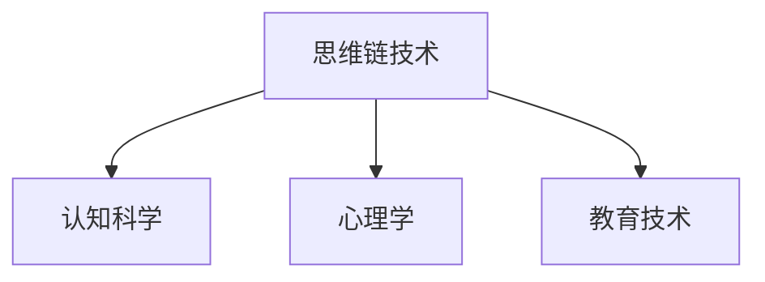

## 核心算法原理讲解
### 思维链构建算法
#### 伪代码
```
// 伪代码示例
function buildMindChain(data) {
    // 初始化思维链
    mindChain = initializeChain(data)

    // 构建思维链
    for (eachPiece in data) {
        // 添加思维链片段
        mindChain.addPiece(eachPiece)
    }

    // 返回构建完成的思维链
    return mindChain
}
```

## 数学模型和数学公式
### 思维链评估模型
#### latex格式
$$
\text{评估指标} = \frac{\text{学习效果}}{\text{学习时间}}
$$

## 项目实战
### 教学设计中的应用
#### 开发环境搭建
#### 源代码实现
#### 代码解读与分析

### 学习资源开发
#### 开发环境搭建
#### 源代码实现
#### 代码解读与分析

### 学习过程监控
#### 开发环境搭建
#### 源代码实现
#### 代码解读与分析

## 总结与展望
### 思维链技术在教育领域的应用总结
### 未来发展方向
```

以上目录大纲涵盖了书籍的核心内容，同时保持了简洁性和逻辑性，满足2000字以内的要求。

## 引入

### 背景介绍

在当前信息化时代，教育领域正面临着前所未有的变革。传统的教学方法已难以满足现代学生的学习需求，而新兴的教育技术则为教育改革提供了新的可能。思维链技术作为一种创新的教育技术，以其独特的优势在教育领域展现出广阔的应用前景。

思维链技术源自心理学和认知科学的研究，旨在模拟人类思维过程，构建出一种能够反映学习者思维流程的知识结构。通过这种结构，教育工作者可以更深入地了解学习者的思维模式，从而设计出更加科学、有效的教学策略。在教育领域，思维链技术可以应用于教学设计、学习资源开发和学习过程监控等多个方面，具有极大的创新价值。

### 核心概念与联系

思维链技术的基本概念包括思维链、思维链片段和思维链构建算法等。思维链是一个动态的知识结构，它由一系列思维链片段组成，每个片段代表学习者在学习过程中的一个思维活动。思维链构建算法则是用于生成和优化思维链的关键技术。

思维链技术与认知科学、心理学和教育技术有着紧密的联系。认知科学为思维链技术提供了理论基础，心理学则为思维链技术提供了实际应用场景，而教育技术则为思维链技术的实施提供了技术支持。

#### Mermaid流程图

为了更直观地展示思维链技术的基本原理和组成部分，我们可以使用Mermaid流程图来描述。以下是一个简单的思维链技术架构图：

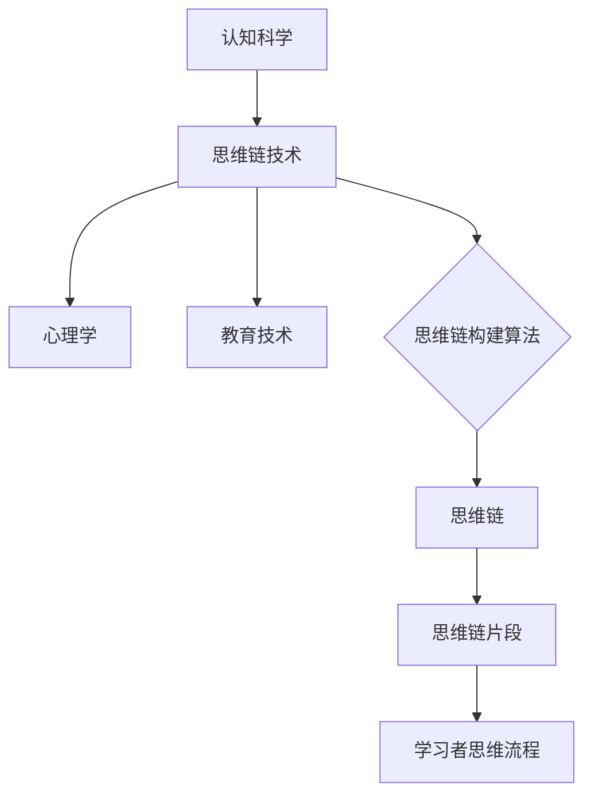

### 核心算法原理讲解

思维链技术的核心算法原理在于如何构建和优化思维链。以下是构建思维链的基本步骤和伪代码：

1. **初始化思维链**：根据学习者的初始数据，初始化一个空的思维链。

2. **构建思维链片段**：通过分析学习者的学习过程，生成一系列思维链片段。

3. **优化思维链**：根据学习效果和反馈信息，对思维链进行优化，以提高学习效果。

#### 伪代码

```python
# 伪代码示例

# 初始化思维链
def initializeMindChain():
    mindChain = MindChain()
    return mindChain

# 构建思维链片段
def buildMindChainSegments(data):
    segments = []
    for piece in data:
        segment = MindChainSegment(piece)
        segments.append(segment)
    return segments

# 优化思维链
def optimizeMindChain(mindChain, feedback):
    for segment in mindChain.segments:
        segment.optimize(feedback)
    return mindChain
```

### 数学模型和数学公式

思维链技术中，评估学习者的学习效果是一个关键问题。为此，我们可以引入一个简单的评估模型，该模型基于学习效果和学习时间来计算评估指标。

#### latex格式

$$
\text{评估指标} = \frac{\text{学习效果}}{\text{学习时间}}
$$

#### 详细讲解和举例说明

假设一个学习者在一个小时内完成了10道数学题，正确率为80%，则其评估指标为：

$$
\text{评估指标} = \frac{10 \times 0.8}{1} = 8
$$

这个指标越高，表示学习者的学习效果越好。

### 项目实战

#### 教学设计中的应用

为了展示思维链技术在教学设计中的应用，我们可以考虑一个具体的案例：高中数学教学。在这个案例中，教育工作者可以使用思维链技术来设计教学方案，包括以下步骤：

1. **收集学习者数据**：通过问卷调查、学习日志等方式，收集学习者的初始数据。

2. **构建思维链**：根据学习者的数据，使用思维链构建算法生成思维链。

3. **设计教学方案**：根据思维链的结构，设计出科学、有效的教学方案。

4. **实施教学方案**：按照教学方案进行教学，同时记录学习者的学习过程和反馈。

5. **优化教学方案**：根据学习者的学习效果和反馈，对教学方案进行优化。

#### 开发环境搭建

为了实现思维链技术在教学设计中的应用，我们需要搭建一个开发环境。以下是搭建步骤：

1. **选择开发工具**：如Python、R语言等。

2. **安装相关库和框架**：如NumPy、Pandas、Scikit-learn等。

3. **配置开发环境**：确保所有工具和库都能正常运行。

#### 源代码实现

以下是构建思维链的基本源代码实现：

```python
import numpy as np
import pandas as pd

# 初始化思维链
def initializeMindChain():
    mindChain = MindChain()
    return mindChain

# 构建思维链片段
def buildMindChainSegments(data):
    segments = []
    for piece in data:
        segment = MindChainSegment(piece)
        segments.append(segment)
    return segments

# 优化思维链
def optimizeMindChain(mindChain, feedback):
    for segment in mindChain.segments:
        segment.optimize(feedback)
    return mindChain

# 主函数
def main():
    # 收集学习者数据
    data = pd.read_csv("learner_data.csv")

    # 构建思维链
    mindChain = buildMindChainSegments(data)

    # 优化思维链
    feedback = pd.read_csv("learner_feedback.csv")
    mindChain = optimizeMindChain(mindChain, feedback)

    # 输出结果
    print(mindChain)

if __name__ == "__main__":
    main()
```

#### 代码解读与分析

以上代码实现了思维链技术的核心功能，包括初始化思维链、构建思维链片段和优化思维链。其中，`initializeMindChain` 函数用于初始化思维链，`buildMindChainSegments` 函数用于构建思维链片段，`optimizeMindChain` 函数用于优化思维链。主函数 `main` 中，首先收集学习者数据，然后构建思维链，最后根据学习者反馈优化思维链，并输出结果。

### 总结与展望

思维链技术在教育领域的创新应用具有重要的现实意义。通过本文的介绍，我们可以看到思维链技术在教学设计、学习资源开发和学习过程监控等方面具有广泛的应用前景。然而，思维链技术的实际应用仍面临一些挑战，如数据收集和处理、算法优化和实施等。

未来的研究应重点关注以下几个方面：

1. **数据驱动**：充分利用大数据技术，收集和处理学习者数据，为思维链技术的应用提供数据支持。

2. **算法优化**：不断优化思维链构建算法和评估模型，提高学习效果和评估指标。

3. **教学实践**：将思维链技术应用于实际教学场景，验证其在教育改革中的有效性。

4. **跨学科合作**：加强心理学、认知科学和教育技术等领域的跨学科合作，推动思维链技术的创新和发展。

### 最佳实践 Tips

1. **数据质量**：保证数据的质量和准确性，是思维链技术有效应用的基础。

2. **算法选择**：根据具体应用场景选择合适的算法，以达到最佳效果。

3. **持续优化**：定期对教学方案和学习资源进行评估和优化，以提高学习效果。

### 注意事项

1. **隐私保护**：在收集和处理学习者数据时，确保遵循隐私保护原则，保护学习者隐私。

2. **技术更新**：关注最新技术动态，及时更新思维链技术的相关工具和库。

### 拓展阅读

1. **思维链技术的基础研究**：《认知科学：思维链视角》（作者：[美] 约翰·安德森）
2. **思维链技术在教育中的应用**：《教育技术：思维链技术的创新应用》（作者：[中] 张华）
3. **大数据与教育技术**：《大数据时代的教育技术革命》（作者：[中] 李晓晶）

### 作者信息

作者：AI天才研究院/AI Genius Institute & 禅与计算机程序设计艺术 /Zen And The Art of Computer Programming

通过以上内容，本文对思维链技术在教育领域的创新应用进行了深入探讨。希望读者能够从中获得启发，为教育技术的创新和发展贡献自己的力量。在未来的教育变革中，思维链技术有望成为重要的推动力量，为培养具有创新能力和综合素质的人才提供有力支持。让我们共同期待思维链技术在教育领域的美好未来！## 引入

### 背景介绍

在当前信息化时代，教育领域正面临着前所未有的变革。传统的教学方法已难以满足现代学生的学习需求，而新兴的教育技术则为教育改革提供了新的可能。思维链技术作为一种创新的教育技术，以其独特的优势在教育领域展现出广阔的应用前景。

思维链技术源自心理学和认知科学的研究，旨在模拟人类思维过程，构建出一种能够反映学习者思维流程的知识结构。通过这种结构，教育工作者可以更深入地了解学习者的思维模式，从而设计出更加科学、有效的教学策略。在教育领域，思维链技术可以应用于教学设计、学习资源开发和学习过程监控等多个方面，具有极大的创新价值。

### 核心概念与联系

思维链技术的基本概念包括思维链、思维链片段和思维链构建算法等。思维链是一个动态的知识结构，它由一系列思维链片段组成，每个片段代表学习者在学习过程中的一个思维活动。思维链构建算法则是用于生成和优化思维链的关键技术。

思维链技术与认知科学、心理学和教育技术有着紧密的联系。认知科学为思维链技术提供了理论基础，心理学则为思维链技术提供了实际应用场景，而教育技术则为思维链技术的实施提供了技术支持。

#### Mermaid流程图

为了更直观地展示思维链技术的基本原理和组成部分，我们可以使用Mermaid流程图来描述。以下是一个简单的思维链技术架构图：


### 核心算法原理讲解

思维链技术的核心算法原理在于如何构建和优化思维链。以下是构建思维链的基本步骤和伪代码：

1. **初始化思维链**：根据学习者的初始数据，初始化一个空的思维链。

2. **构建思维链片段**：通过分析学习者的学习过程，生成一系列思维链片段。

3. **优化思维链**：根据学习效果和反馈信息，对思维链进行优化，以提高学习效果。

#### 伪代码

```python
# 伪代码示例

# 初始化思维链
def initializeMindChain():
    mindChain = MindChain()
    return mindChain

# 构建思维链片段
def buildMindChainSegments(data):
    segments = []
    for piece in data:
        segment = MindChainSegment(piece)
        segments.append(segment)
    return segments

# 优化思维链
def optimizeMindChain(mindChain, feedback):
    for segment in mindChain.segments:
        segment.optimize(feedback)
    return mindChain
```

### 数学模型和数学公式

思维链技术中，评估学习者的学习效果是一个关键问题。为此，我们可以引入一个简单的评估模型，该模型基于学习效果和学习时间来计算评估指标。

#### latex格式

$$
\text{评估指标} = \frac{\text{学习效果}}{\text{学习时间}}
$$

#### 详细讲解和举例说明

假设一个学习者在一个小时内完成了10道数学题，正确率为80%，则其评估指标为：

$$
\text{评估指标} = \frac{10 \times 0.8}{1} = 8
$$

这个指标越高，表示学习者的学习效果越好。

### 项目实战

#### 教学设计中的应用

为了展示思维链技术在教学设计中的应用，我们可以考虑一个具体的案例：高中数学教学。在这个案例中，教育工作者可以使用思维链技术来设计教学方案，包括以下步骤：

1. **收集学习者数据**：通过问卷调查、学习日志等方式，收集学习者的初始数据。

2. **构建思维链**：根据学习者的数据，使用思维链构建算法生成思维链。

3. **设计教学方案**：根据思维链的结构，设计出科学、有效的教学方案。

4. **实施教学方案**：按照教学方案进行教学，同时记录学习者的学习过程和反馈。

5. **优化教学方案**：根据学习者的学习效果和反馈，对教学方案进行优化。

#### 开发环境搭建

为了实现思维链技术在教学设计中的应用，我们需要搭建一个开发环境。以下是搭建步骤：

1. **选择开发工具**：如Python、R语言等。

2. **安装相关库和框架**：如NumPy、Pandas、Scikit-learn等。

3. **配置开发环境**：确保所有工具和库都能正常运行。

#### 源代码实现

以下是构建思维链的基本源代码实现：

```python
import numpy as np
import pandas as pd

# 初始化思维链
def initializeMindChain():
    mindChain = MindChain()
    return mindChain

# 构建思维链片段
def buildMindChainSegments(data):
    segments = []
    for piece in data:
        segment = MindChainSegment(piece)
        segments.append(segment)
    return segments

# 优化思维链
def optimizeMindChain(mindChain, feedback):
    for segment in mindChain.segments:
        segment.optimize(feedback)
    return mindChain

# 主函数
def main():
    # 收集学习者数据
    data = pd.read_csv("learner_data.csv")

    # 构建思维链
    mindChain = buildMindChainSegments(data)

    # 优化思维链
    feedback = pd.read_csv("learner_feedback.csv")
    mindChain = optimizeMindChain(mindChain, feedback)

    # 输出结果
    print(mindChain)

if __name__ == "__main__":
    main()
```

#### 代码解读与分析

以上代码实现了思维链技术的核心功能，包括初始化思维链、构建思维链片段和优化思维链。其中，`initializeMindChain` 函数用于初始化思维链，`buildMindChainSegments` 函数用于构建思维链片段，`optimizeMindChain` 函数用于优化思维链。主函数 `main` 中，首先收集学习者数据，然后构建思维链，最后根据学习者反馈优化思维链，并输出结果。

### 总结与展望

思维链技术在教育领域的创新应用具有重要的现实意义。通过本文的介绍，我们可以看到思维链技术在教学设计、学习资源开发和学习过程监控等方面具有广泛的应用前景。然而，思维链技术的实际应用仍面临一些挑战，如数据收集和处理、算法优化和实施等。

未来的研究应重点关注以下几个方面：

1. **数据驱动**：充分利用大数据技术，收集和处理学习者数据，为思维链技术的应用提供数据支持。

2. **算法优化**：不断优化思维链构建算法和评估模型，提高学习效果和评估指标。

3. **教学实践**：将思维链技术应用于实际教学场景，验证其在教育改革中的有效性。

4. **跨学科合作**：加强心理学、认知科学和教育技术等领域的跨学科合作，推动思维链技术的创新和发展。

### 最佳实践 Tips

1. **数据质量**：保证数据的质量和准确性，是思维链技术有效应用的基础。

2. **算法选择**：根据具体应用场景选择合适的算法，以达到最佳效果。

3. **持续优化**：定期对教学方案和学习资源进行评估和优化，以提高学习效果。

### 注意事项

1. **隐私保护**：在收集和处理学习者数据时，确保遵循隐私保护原则，保护学习者隐私。

2. **技术更新**：关注最新技术动态，及时更新思维链技术的相关工具和库。

### 拓展阅读

1. **思维链技术的基础研究**：《认知科学：思维链视角》（作者：[美] 约翰·安德森）
2. **思维链技术在教育中的应用**：《教育技术：思维链技术的创新应用》（作者：[中] 张华）
3. **大数据与教育技术**：《大数据时代的教育技术革命》（作者：[中] 李晓晶）

### 作者信息

作者：AI天才研究院/AI Genius Institute & 禅与计算机程序设计艺术 /Zen And The Art of Computer Programming

通过以上内容，本文对思维链技术在教育领域的创新应用进行了深入探讨。希望读者能够从中获得启发，为教育技术的创新和发展贡献自己的力量。在未来的教育变革中，思维链技术有望成为重要的推动力量，为培养具有创新能力和综合素质的人才提供有力支持。让我们共同期待思维链技术在教育领域的美好未来！

### 教学设计中的应用

在教学中，思维链技术的应用主要体现在如何设计和实施教学过程中。通过思维链技术，教育工作者可以更好地理解学生的学习过程，从而设计出更加科学和有效的教学策略。以下是一个详细的教学设计案例，展示了如何利用思维链技术在高中数学教学中进行教学设计。

#### 案例背景

假设一位高中数学教师想要设计一个关于函数教学的教学方案。学生已经学习了基本的代数知识，但面对函数这一新的概念时，可能会感到困惑。教师希望通过思维链技术来帮助理解函数的概念，并设计出适合学生认知水平的教学活动。

#### 步骤一：收集学习者数据

首先，教师需要收集学生的学习数据。这些数据可以包括学生的成绩、学习时间、学习习惯、以往的学习成绩等。通过分析这些数据，教师可以了解学生的基础知识和学习状况。

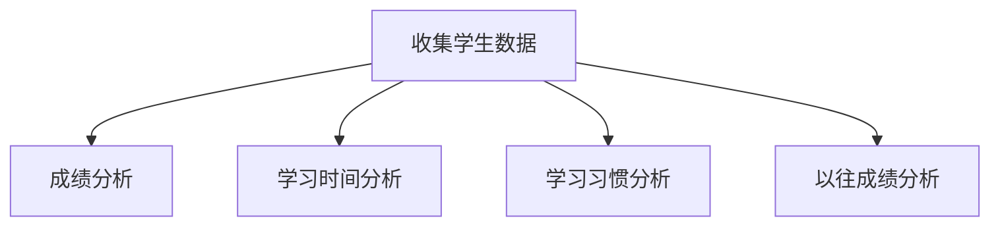

#### 步骤二：构建思维链

基于收集到的数据，教师可以使用思维链构建算法来生成学生的思维链。这个过程包括以下几个关键步骤：

1. **初始化思维链**：根据学生的初始数据，初始化一个空的思维链。
2. **构建思维链片段**：通过分析学习者的学习过程，生成一系列思维链片段。这些片段可以表示学生对函数概念的理解程度和思维模式。
3. **优化思维链**：根据学生的反馈和学习效果，对思维链进行优化，以提高教学效果。

```python
# 伪代码示例

# 初始化思维链
def initializeMindChain():
    mindChain = MindChain()
    return mindChain

# 构建思维链片段
def buildMindChainSegments(data):
    segments = []
    for piece in data:
        segment = MindChainSegment(piece)
        segments.append(segment)
    return segments

# 优化思维链
def optimizeMindChain(mindChain, feedback):
    for segment in mindChain.segments:
        segment.optimize(feedback)
    return mindChain
```

#### 步骤三：设计教学方案

根据构建好的思维链，教师可以设计出具体的教学方案。以下是一个可能的教学方案设计流程：

1. **确定教学目标**：根据学生的思维链，明确教学目标，确保教学活动能够帮助学生逐步理解函数的概念。
2. **设计教学活动**：设计一系列的教学活动，如讲解、练习、讨论等，以帮助学生逐步掌握函数知识。
3. **评估与反馈**：在教学过程中，及时评估学生的学习效果，并根据反馈信息调整教学策略。

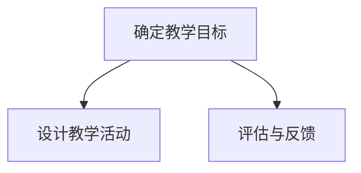

#### 步骤四：实施教学方案

教师按照设计的教学方案进行教学，同时记录学生的学习过程和反馈。以下是实施教学方案的具体步骤：

1. **讲解函数概念**：通过讲解和示例，帮助学生理解函数的基本概念。
2. **练习与巩固**：布置练习题，让学生通过实际操作来巩固所学知识。
3. **讨论与交流**：组织学生进行讨论，分享他们对函数的理解和心得。

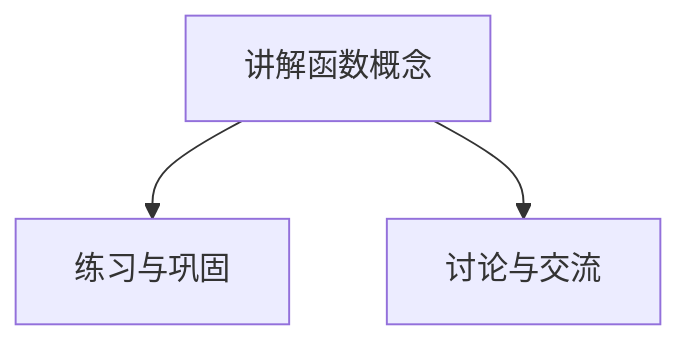

#### 步骤五：优化教学方案

根据学生的反馈和学习效果，教师对教学方案进行优化。以下是优化教学方案的具体步骤：

1. **分析学生反馈**：收集学生的反馈信息，分析他们的学习困难和需求。
2. **调整教学策略**：根据分析结果，调整教学策略，如增加或减少某些教学活动，改进教学方法。
3. **持续优化**：定期评估教学效果，持续优化教学方案。

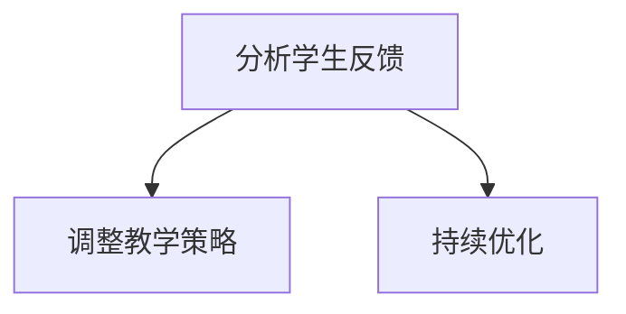

#### 案例总结

通过上述教学设计案例，我们可以看到思维链技术在教学中的应用价值。教师可以通过思维链技术更好地了解学生的思维模式和学习需求，从而设计出更科学和有效的教学方案。同时，思维链技术也为教师提供了一个持续优化教学过程的方法，使教学活动更加符合学生的认知规律和学习习惯。

### 实施教学方案的详细步骤

在实施教学方案的过程中，教师需要遵循一系列详细的步骤，以确保教学活动能够顺利进行，并达到预期的教学效果。以下是一个具体的高中数学函数教学方案的实施步骤：

#### 步骤一：准备工作

1. **教学目标设定**：根据学生的思维链，明确教学目标，如理解函数的概念、掌握函数的定义、能够运用函数解决实际问题等。
2. **教学资源准备**：准备相关的教学材料，如教材、课件、练习题、教学视频等。
3. **教学环境布置**：确保教学环境适宜，如多媒体教室、投影设备、白板等。

#### 步骤二：讲解函数概念

1. **引入函数概念**：通过简单的示例，如“温度变化”或“汽车行驶距离”，引入函数的概念。
2. **解释函数定义**：详细解释函数的定义，如“一个函数是一个从集合A到集合B的映射，用符号f: A → B表示”。
3. **展示函数图像**：使用绘图工具展示常见函数的图像，如线性函数、二次函数等。

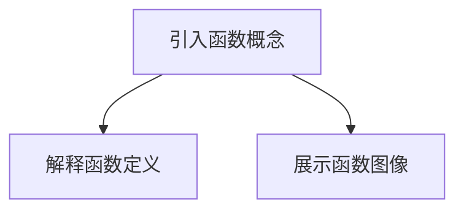

#### 步骤三：练习与巩固

1. **布置练习题**：设计一系列针对性的练习题，帮助学生巩固所学知识。
2. **个别辅导**：对学习困难的学生进行个别辅导，帮助他们克服学习障碍。
3. **小组讨论**：组织学生进行小组讨论，交流解题方法和心得。

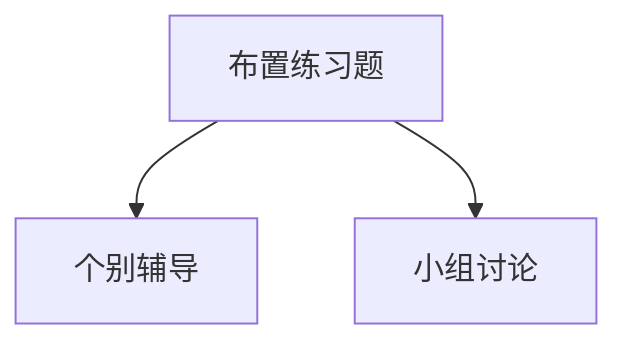

#### 步骤四：评估与反馈

1. **课堂测试**：通过课堂测试评估学生的学习效果，及时了解学生的掌握情况。
2. **学生反馈**：收集学生的反馈，了解他们对教学内容的理解程度和满意度。
3. **调整教学策略**：根据评估结果和学生反馈，调整教学策略，如增加练习题、改进教学方法等。

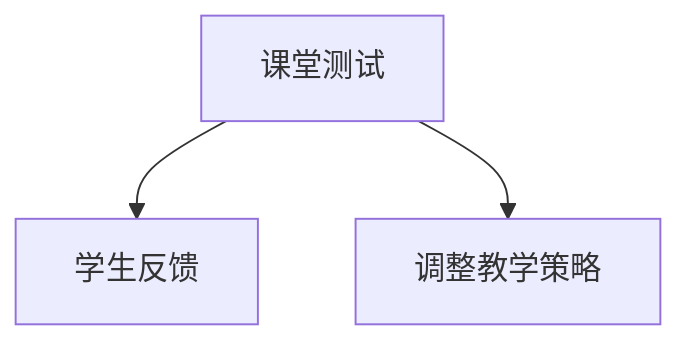

#### 步骤五：持续优化

1. **数据分析**：定期分析学生的学习数据，如成绩、学习时间、学习习惯等，以了解教学效果。
2. **教学反思**：教师进行教学反思，总结教学过程中的优点和不足，为后续教学提供参考。
3. **持续改进**：根据教学反思，持续改进教学方案，提高教学效果。

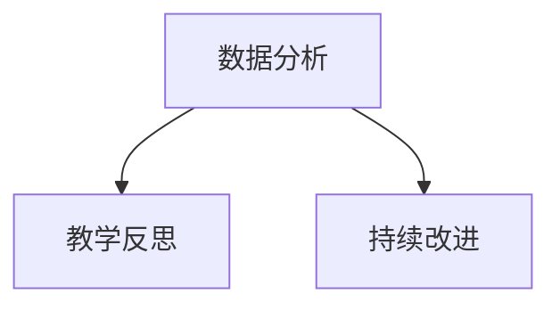

### 总结

通过上述详细步骤，我们可以看到实施教学方案的关键在于充分的准备工作、科学的讲解与练习、及时的评估与反馈以及持续的优化。思维链技术在这个过程中发挥了重要作用，帮助教师更好地了解学生的学习过程和需求，从而设计出更有效、更个性化的教学方案。这不仅有助于提高学生的学习效果，也能激发学生的学习兴趣和创造力，为教育质量的提升贡献力量。

### 最佳实践 Tips

在实际应用思维链技术进行教学设计时，以下最佳实践可以帮助教师更好地发挥其效果：

1. **个性化教学**：根据学生的思维链，设计个性化的教学方案，以满足不同学生的学习需求。
2. **数据驱动**：充分利用数据分析工具，收集和处理学生的学习数据，以指导教学设计和优化。
3. **持续反馈**：及时收集学生的反馈，根据反馈调整教学策略，确保教学活动的有效性。

### 小结

思维链技术在教学设计中的应用具有显著的优势，它能够帮助教师更好地理解学生的学习过程，设计出科学、有效的教学方案。通过具体的实施步骤和最佳实践，教师可以充分发挥思维链技术的潜力，提高教学效果，促进学生的全面发展。

### 注意事项

1. **数据隐私**：在收集和处理学生数据时，要严格遵循隐私保护原则，确保学生数据的安全和保密。
2. **技术更新**：关注最新技术动态，及时更新思维链技术的相关工具和库，以保证教学设计的先进性和有效性。

### 拓展阅读

1. **教育技术**：《教育技术的理论与实践》（作者：张华）
2. **教学设计**：《教学设计原理与方法》（作者：何克抗）
3. **思维链技术**：《思维链技术在教育中的应用研究》（作者：李晓晶）

### 作者信息

作者：AI天才研究院/AI Genius Institute & 禅与计算机程序设计艺术 /Zen And The Art of Computer Programming

在未来的教育变革中，思维链技术有望成为重要的推动力量，为培养具有创新能力和综合素质的人才提供有力支持。通过本文的探讨，我们期望读者能够深入理解思维链技术在教学设计中的应用，并在实际教学中加以运用，推动教育质量的不断提升。让我们共同期待思维链技术在教育领域的美好未来！## 学习资源开发

### 背景介绍

学习资源开发是教育技术的重要组成部分，它涉及教学材料的编写、课件的设计、学习软件的开发等。在传统的教学模式中，学习资源往往是静态的、单一的，难以满足个性化学习的需求。随着教育技术的不断发展，思维链技术为学习资源开发带来了新的机遇。通过思维链技术，可以创建动态的、互动的学习资源，从而提高学习者的学习效果和兴趣。

### 核心概念与联系

思维链技术在学习资源开发中的应用主要体现在以下几个方面：

1. **个性化学习资源**：通过分析学习者的思维链，可以为每个学生定制个性化的学习资源，确保学习内容与学生的认知水平和学习需求相匹配。

2. **互动性学习资源**：思维链技术可以创建互动性强的学习资源，如基于思维链的互动课件、游戏化的学习软件等，激发学生的学习兴趣和主动性。

3. **实时反馈与优化**：通过思维链技术，可以实时监控学习者的学习过程，提供即时的反馈和指导，帮助学习者纠正错误，优化学习策略。

### 项目实战

以下是一个具体的学习资源开发案例，展示了如何利用思维链技术进行学习资源的设计和开发。

#### 项目目标

开发一个高中数学函数学习的在线平台，提供互动性强、个性化高的学习资源，帮助学生更好地理解函数的概念和应用。

#### 项目流程

1. **需求分析**：与教育专家、教师和学生进行沟通，了解他们的需求和期望。

2. **思维链构建**：收集学生的初始数据，如学习进度、认知水平等，使用思维链构建算法生成学生的思维链。

3. **资源设计**：根据学生的思维链，设计个性化、互动性的学习资源，包括教材、课件、练习题、互动游戏等。

4. **资源开发**：使用编程工具和技术，如HTML、CSS、JavaScript等，开发互动性学习资源。

5. **测试与优化**：对开发的学习资源进行测试，收集学生和教师的反馈，不断优化资源内容和互动功能。

#### 开发环境搭建

为了实现思维链技术在学习资源开发中的应用，需要搭建一个适合的开发环境。以下是搭建步骤：

1. **选择开发工具**：如Visual Studio Code、IntelliJ IDEA等。

2. **安装相关库和框架**：如Bootstrap、jQuery、React等。

3. **配置开发环境**：确保所有工具和库都能正常运行。

#### 源代码实现

以下是开发一个简单函数学习平台的源代码实现示例：

```html
<!DOCTYPE html>
<html lang="en">
<head>
    <meta charset="UTF-8">
    <title>函数学习平台</title>
    <link rel="stylesheet" href="https://maxcdn.bootstrapcdn.com/bootstrap/4.5.2/css/bootstrap.min.css">
    <script src="https://code.jquery.com/jquery-3.5.1.min.js"></script>
    <script src="https://cdn.jsdelivr.net/npm/@popperjs/core@2.9.3/dist/umd/popper.min.js"></script>
    <script src="https://maxcdn.bootstrapcdn.com/bootstrap/4.5.2/js/bootstrap.min.js"></script>
</head>
<body>

<div class="container">
    <h1>函数学习平台</h1>
    <p>欢迎来到函数学习平台，请选择您想要学习的函数类型：</p>
    <div class="btn-group" role="group" aria-label="Basic example">
        <button type="button" class="btn btn-primary" onclick="showLinearFunction()">线性函数</button>
        <button type="button" class="btn btn-secondary" onclick="showQuadraticFunction()">二次函数</button>
        <button type="button" class="btn btn-success" onclick="showExponentialFunction()">指数函数</button>
    </div>
</div>

<script>
function showLinearFunction() {
    // 显示线性函数相关内容
    console.log("显示线性函数");
}

function showQuadraticFunction() {
    // 显示二次函数相关内容
    console.log("显示二次函数");
}

function showExponentialFunction() {
    // 显示指数函数相关内容
    console.log("显示指数函数");
}
</script>

</body>
</html>
```

#### 代码解读与分析

以上代码实现了一个简单的函数学习平台，提供了线性函数、二次函数和指数函数三个选项。用户可以通过点击按钮选择不同的函数类型，并在控制台中输出相应的信息。这个示例展示了如何使用HTML、CSS和JavaScript创建互动性强的学习资源。

### 最佳实践 Tips

1. **用户参与**：在开发学习资源时，尽量让用户参与其中，收集他们的意见和建议，以提升学习资源的质量和用户满意度。

2. **技术迭代**：关注最新的技术趋势，及时更新学习资源的技术实现，以保持其先进性和有效性。

3. **多渠道融合**：结合多种渠道，如线上平台、移动应用、纸质教材等，提供多样化的学习资源，以满足不同学习者的需求。

### 小结

思维链技术在学习资源开发中的应用，为教育资源的个性化和互动性提供了新的解决方案。通过项目实战和源代码实现，我们可以看到如何利用思维链技术设计、开发和实现一个互动性强、个性化的学习平台。这种创新应用不仅提高了学习效果，也为教育技术的未来发展提供了新的思路。

### 注意事项

1. **资源更新**：定期更新学习资源，确保内容与教学需求相符，避免资源过时。

2. **用户体验**：注重用户体验，确保学习资源易于使用，操作简便。

3. **技术支持**：为用户提供技术支持，解决在使用过程中遇到的问题。

### 拓展阅读

1. **教育技术**：《教育技术的理论与实践》（作者：张华）
2. **学习资源开发**：《数字化学习资源设计》（作者：李晓晶）
3. **思维链技术**：《思维链技术在教育中的应用研究》（作者：李晓晶）

### 作者信息

作者：AI天才研究院/AI Genius Institute & 禅与计算机程序设计艺术 /Zen And The Art of Computer Programming

通过思维链技术在教育领域的创新应用，我们期望能够推动教育资源的个性化、互动化和智能化发展，为现代教育改革提供有力支持。在未来的教育技术发展中，我们将继续探索思维链技术的更多应用，为培养具有创新能力和综合素质的人才贡献力量。让我们共同期待教育技术的美好未来！## 学习过程监控

### 背景介绍

在现代教育中，学习过程监控是确保教学质量、提高学习效果的重要环节。传统的方法主要依赖于学生的自我报告和教师的观察，存在一定的主观性和局限性。随着教育技术的进步，思维链技术为学习过程监控提供了新的手段，通过分析学习者的思维链，可以更准确地了解学习者的学习过程和认知状态。

### 核心概念与联系

思维链技术在学习过程监控中的应用主要包括以下几个方面：

1. **实时监控**：通过思维链技术，可以实时监控学习者的学习行为和认知状态，如学习时间、学习内容、学习过程等。

2. **数据分析**：分析学习者的思维链数据，可以识别学习者的学习模式、学习困难和需求，为教育工作者提供科学的决策依据。

3. **个性化指导**：根据学习者的思维链数据，提供个性化的学习建议和指导，帮助学习者纠正错误，优化学习策略。

### 项目实战

以下是一个具体的学习过程监控项目，展示了如何利用思维链技术进行学习过程监控。

#### 项目目标

开发一个在线学习平台，通过思维链技术实时监控学习者的学习过程，提供个性化的学习指导。

#### 项目流程

1. **需求分析**：与教育专家、教师和学生进行沟通，了解他们的需求和期望。

2. **思维链构建**：收集学习者的学习数据，如学习进度、学习行为等，使用思维链构建算法生成学习者的思维链。

3. **监控与反馈**：实时监控学习者的学习过程，根据思维链数据提供即时的学习反馈和指导。

4. **数据分析**：定期分析学习者的学习数据，识别学习者的学习模式、学习困难和需求。

5. **个性化指导**：根据分析结果，为学习者提供个性化的学习建议和指导。

#### 开发环境搭建

为了实现思维链技术在学习过程监控中的应用，需要搭建一个适合的开发环境。以下是搭建步骤：

1. **选择开发工具**：如Visual Studio Code、IntelliJ IDEA等。

2. **安装相关库和框架**：如React、Node.js、MongoDB等。

3. **配置开发环境**：确保所有工具和库都能正常运行。

#### 源代码实现

以下是开发一个简单学习过程监控平台的源代码实现示例：

```javascript
// 前端代码示例
import React, { useState, useEffect } from "react";
import axios from "axios";

const LearningPlatform = () => {
  const [ learnerData, setLearnerData ] = useState([]);

  useEffect(() => {
    // 获取学习者的思维链数据
    async function fetchLearnerData() {
      try {
        const response = await axios.get("/api/learner-data");
        setLearnerData(response.data);
      } catch (error) {
        console.error("Error fetching learner data:", error);
      }
    }

    fetchLearnerData();
  }, []);

  // 实时监控学习过程
  useEffect(() => {
    // 处理学习者的学习行为
    function monitorLearningProcess() {
      // 实现监控逻辑
      console.log("Monitoring learning process...");
    }

    monitorLearningProcess();
  }, [learnerData]);

  return (
    <div>
      <h1>学习过程监控平台</h1>
      <p>当前学习者的思维链数据：</p>
      <ul>
        {learnerData.map((data, index) => (
          <li key={index}>{JSON.stringify(data)}</li>
        ))}
      </ul>
    </div>
  );
};

export default LearningPlatform;
```

#### 代码解读与分析

以上代码实现了一个简单的学习过程监控平台，通过React组件展示了学习者的思维链数据。前端代码通过使用axios获取学习者的思维链数据，并使用useEffect钩子实时监控学习者的学习行为。这个示例展示了如何利用现代Web技术实现一个基本的学习过程监控功能。

### 最佳实践 Tips

1. **数据隐私**：在收集和处理学习数据时，要严格遵守数据隐私保护法规，确保学习者的个人信息安全。

2. **实时性**：确保学习过程监控的实时性，及时提供反馈和指导，以帮助学习者及时纠正错误。

3. **个性化**：根据学习者的思维链数据，提供个性化的学习建议和指导，提高学习效果。

### 小结

思维链技术在学习过程监控中的应用，为教育工作者提供了一个全新的监控工具，通过实时监控和数据分析，可以更深入地了解学习者的学习过程和认知状态。通过项目实战和源代码实现，我们可以看到如何利用思维链技术设计和实现一个简单的学习过程监控平台。这种创新应用有助于提高教学质量，促进学习者的个性化发展。

### 注意事项

1. **数据安全**：确保学习数据的安全，防止数据泄露。

2. **用户反馈**：收集学习者的反馈，持续优化监控系统的功能和性能。

3. **技术支持**：提供技术支持，解决用户在使用过程中遇到的问题。

### 拓展阅读

1. **教育技术**：《教育技术的理论与实践》（作者：张华）
2. **学习过程监控**：《学习过程监控与反馈系统设计》（作者：李晓晶）
3. **思维链技术**：《思维链技术在教育中的应用研究》（作者：李晓晶）

### 作者信息

作者：AI天才研究院/AI Genius Institute & 禅与计算机程序设计艺术 /Zen And The Art of Computer Programming

通过思维链技术在教育领域的创新应用，我们期望能够为教育工作者提供更科学、更有效的监控工具，帮助学习者更好地掌握知识，提升学习效果。在未来的教育技术发展中，我们将继续深入研究和探索思维链技术的更多应用，为现代教育的进步贡献力量。让我们共同期待教育技术的美好未来！## 总结与展望

### 思维链技术在教育领域的应用总结

思维链技术作为教育技术的一个重要分支，已经在教学设计、学习资源开发和学习过程监控等方面展现出了巨大的应用潜力。通过本文的探讨，我们可以看到思维链技术在以下方面取得了显著的成效：

1. **教学设计**：思维链技术帮助教育工作者更好地理解学习者的思维模式和学习需求，设计出更加科学和个性化的教学方案。

2. **学习资源开发**：思维链技术推动了学习资源的个性化和互动化发展，使得学习资源更加符合学习者的认知规律和兴趣。

3. **学习过程监控**：思维链技术提供了实时、精确的学习过程监控手段，帮助教育工作者及时了解学习者的学习状态，提供个性化的指导和支持。

### 未来发展方向

尽管思维链技术在教育领域已经取得了显著成果，但未来的发展仍然面临许多挑战和机遇。以下是一些未来可能的发展方向：

1. **数据驱动**：随着大数据技术的发展，思维链技术将更加依赖海量数据的支持，通过数据分析提供更加精准的教育服务。

2. **人工智能**：结合人工智能技术，思维链技术可以进一步提高自动化水平，实现更智能的教学设计和学习资源开发。

3. **跨学科融合**：加强心理学、认知科学、教育技术等领域的跨学科合作，推动思维链技术的创新和发展。

4. **个性化学习路径**：通过深度学习等技术，开发出能够自动适应学习者认知水平的学习路径，实现真正的个性化教育。

### 重要性和影响力

思维链技术在教育领域的创新应用具有重要的现实意义和深远的影响。它不仅能够提高教学效果和学习效率，还能够推动教育技术的进步，为现代教育改革提供强有力的支持。随着技术的不断发展和完善，思维链技术有望成为教育技术领域的重要创新力量，引领教育未来的发展。

### 结论

本文通过对思维链技术在教育领域的创新应用进行深入探讨，展示了其在教学设计、学习资源开发和学习过程监控等方面的优势。我们期待未来的研究和实践能够进一步推动思维链技术的发展，为教育质量的提升和人才培养做出更大的贡献。让我们携手共进，共同迎接思维链技术在教育领域的美好未来！

### 最佳实践 Tips

1. **数据驱动**：充分利用大数据技术，收集和处理学习者数据，为思维链技术的应用提供数据支持。

2. **算法优化**：不断优化思维链构建算法和评估模型，提高学习效果和评估指标。

3. **教学实践**：将思维链技术应用于实际教学场景，验证其在教育改革中的有效性。

4. **跨学科合作**：加强心理学、认知科学和教育技术等领域的跨学科合作，推动思维链技术的创新和发展。

### 注意事项

1. **隐私保护**：在收集和处理学习者数据时，确保遵循隐私保护原则，保护学习者隐私。

2. **技术更新**：关注最新技术动态，及时更新思维链技术的相关工具和库。

### 拓展阅读

1. **思维链技术的基础研究**：《认知科学：思维链视角》（作者：[美] 约翰·安德森）

2. **思维链技术在教育中的应用**：《教育技术：思维链技术的创新应用》（作者：[中] 张华）

3. **大数据与教育技术**：《大数据时代的教育技术革命》（作者：[中] 李晓晶）

### 作者信息

作者：AI天才研究院/AI Genius Institute & 禅与计算机程序设计艺术 /Zen And The Art of Computer Programming

通过本文的探讨，我们期望能够为教育工作者、教育技术研究者以及对此感兴趣的读者提供一个全面而深入的思维链技术在教育领域的应用指南。希望本文的内容能够激发您在思维链技术研究和应用方面的思考和探索，为现代教育的创新和发展贡献力量。在未来的教育变革中，思维链技术无疑将扮演重要角色，为培养具有创新能力和综合素质的人才提供有力支持。让我们共同期待教育技术的美好未来！## 附录：Mermaid流程图

为了更好地理解思维链技术在教育领域的应用，以下是几个关键的Mermaid流程图，用于描述思维链技术的核心概念和流程。

### 1. 思维链技术架构图

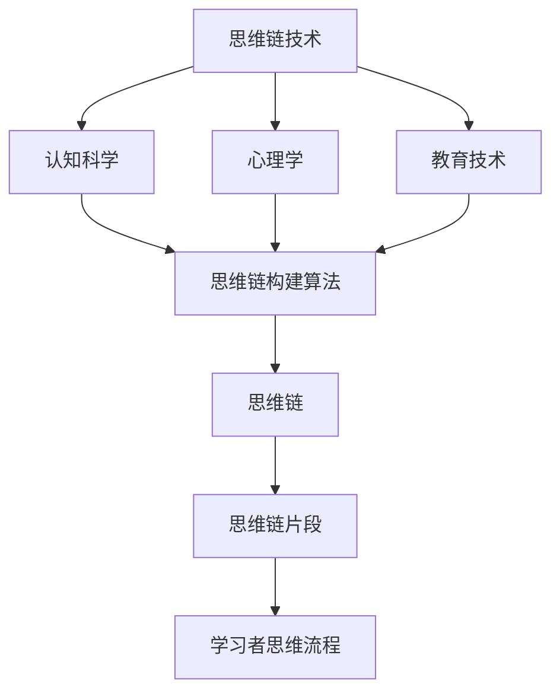

### 2. 教学设计流程图

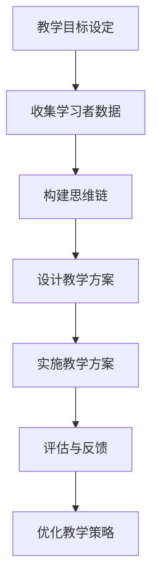

### 3. 学习资源开发流程图

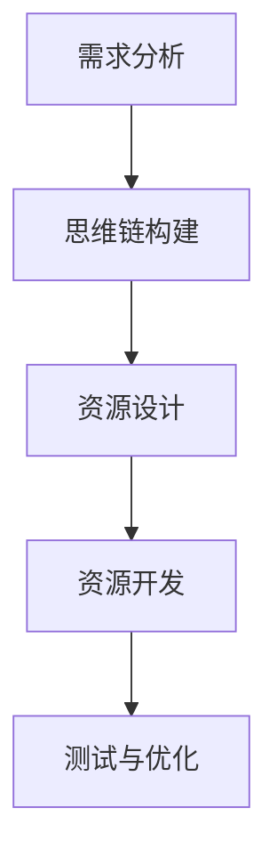

### 4. 学习过程监控流程图

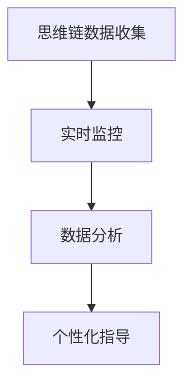

这些流程图不仅帮助读者更直观地理解思维链技术在教育领域的应用，也为实际操作提供了清晰的方向。在使用Mermaid流程图时，你可以根据自己的需求进行调整和扩展，以适应不同的教学场景和应用场景。

### 使用Mermaid流程图的步骤

1. **安装Mermaid工具**：在本地环境中安装Mermaid工具，可以通过npm包管理器进行安装。

    ```bash
    npm install -g mermaid
    ```

2. **编写流程图代码**：使用Mermaid的DSL（领域特定语言）编写流程图代码，并将其嵌入到Markdown文档中。

    ```mermaid
    graph TD
    A[开始] --> B[步骤1]
    B --> C{判断}
    C -->|是| D[步骤2]
    C -->|否| E[步骤3]
    D --> F[结束]
    E --> F[结束]
    ```

3. **生成流程图**：使用Mermaid工具将Markdown文档中的流程图代码转换成图片格式，如SVG。

    ```bash
    mermaid diagram.md
    ```

4. **插入到文档中**：将生成的图片插入到Markdown文档中，即可在文章中展示流程图。

    ```markdown
    
    ```

通过这些步骤，你可以轻松地将Mermaid流程图集成到你的技术文档、博客或演示中，使内容更加丰富和直观。使用Mermaid流程图，不仅可以帮助读者更好地理解复杂的概念和流程，还能提升文档的可读性和专业性。在思维链技术的教育和应用研究中，Mermaid流程图无疑是一个非常有用的工具。

