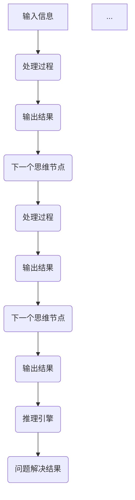
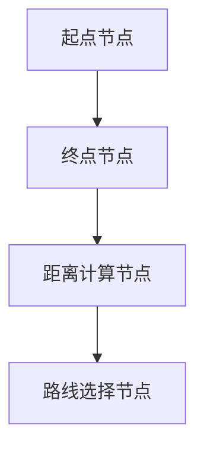
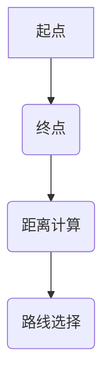
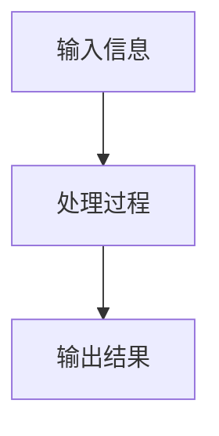
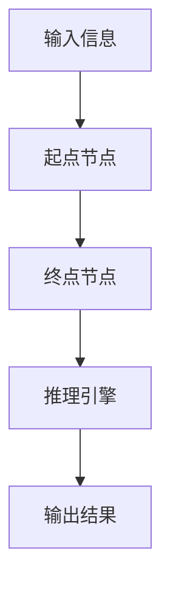
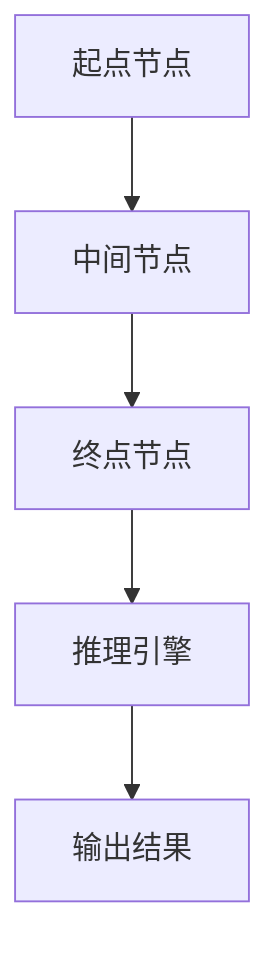
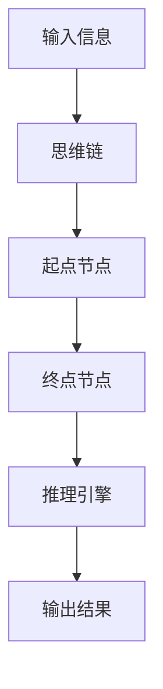

                 

### 文章标题

# 思维链技术：提升AI问题解决能力的新方向

### 关键词

- 思维链技术
- 人工智能
- 问题解决
- 算法优化
- 应用实践

### 摘要

本文介绍了思维链技术，一种新兴的人工智能技术，旨在提升AI在复杂问题解决方面的能力。文章首先对思维链技术的背景进行了介绍，然后详细讲解了其核心概念、算法原理、数学模型及应用实践。通过实例分析和项目实战，展示了思维链技术在各个领域的应用效果。最后，对思维链技术的发展前景进行了展望，并提出了未来的研究方向和优化策略。

## 引言

### 1.1 书籍背景与目标

随着人工智能技术的不断发展，AI在各个领域的应用越来越广泛。然而，传统的AI技术在面对复杂、多变的现实问题时，往往表现不够理想。为了解决这一问题，研究人员提出了一种新的技术——思维链技术。思维链技术通过模拟人类思维过程，构建一个具有推理和问题解决能力的智能系统，从而提升AI在复杂问题解决方面的能力。

本书的目标是系统地介绍思维链技术，包括其核心概念、算法原理、应用场景和实践案例。通过本书的学习，读者可以了解到思维链技术的原理和应用，掌握其开发与优化方法，为实际项目提供技术支持。

### 1.2 核心概念与架构

思维链技术是一种基于人类思维过程的人工智能技术，其核心概念包括：

1. **思维链**：思维链是指由多个思维节点组成的有向图，每个节点表示一个思维过程，节点之间的关系表示思维过程的逻辑关系。
2. **思维节点**：思维节点是思维链的基本组成单元，包括输入信息、处理过程和输出结果。
3. **推理引擎**：推理引擎是思维链技术的核心组件，负责对思维链进行推理和问题求解。

思维链技术的架构如图1所示：



图1 思维链技术架构

在思维链技术中，推理引擎通过遍历思维链，利用已知的思维节点和逻辑关系，推理出问题的解决方案。这种模拟人类思维过程的模式，使得AI在解决复杂问题时，能够具备更强的灵活性和推理能力。

### 1.3 书籍内容概述

本书分为七个章节，内容安排如下：

1. **引言**：介绍思维链技术的背景、目标和核心概念。
2. **思维链技术基础**：讲解思维链技术的核心算法原理、数学模型和架构。
3. **思维链技术在AI中的应用**：分析思维链技术在各个AI领域的应用场景和实践案例。
4. **思维链技术的开发与实现**：介绍思维链技术的开发环境搭建、代码实现和解读。
5. **思维链技术的优化与调参**：探讨思维链技术的优化策略和调参技巧。
6. **思维链技术在行业中的应用**：分析思维链技术在制造业、金融行业和医疗健康领域的应用案例。
7. **总结与展望**：总结思维链技术的贡献和未来研究方向。

本书旨在通过逐步讲解思维链技术的原理、应用和实践，帮助读者深入了解这一新兴技术，掌握其在实际项目中的开发与优化方法，为人工智能领域的发展贡献力量。

### 1.4 读者受益

通过阅读本书，读者可以获得以下收益：

1. **理解思维链技术**：掌握思维链技术的核心概念、算法原理和架构，了解其在AI问题解决方面的优势。
2. **掌握开发与优化方法**：学会思维链技术的开发与优化方法，为实际项目提供技术支持。
3. **拓展知识视野**：了解思维链技术在各个领域的应用案例，拓宽知识视野。
4. **提升问题解决能力**：通过实践项目，提升在复杂问题解决方面的能力，为职业生涯发展奠定基础。

## 思维链技术基础

### 2.1 核心算法原理

思维链技术的核心算法原理是通过对思维链的遍历和推理，实现复杂问题的求解。下面将详细介绍思维链的构建、推理过程和问题解决方法。

#### 2.1.1 思维链的构建

思维链是由多个思维节点组成的有向图，每个思维节点表示一个具体的思维过程。思维链的构建主要包括以下几个步骤：

1. **输入信息采集**：采集与问题相关的输入信息，包括数据、事实、假设等。
2. **思维节点设计**：根据问题解决的需求，设计相应的思维节点，包括输入信息、处理过程和输出结果。
3. **节点关系建立**：确定思维节点之间的逻辑关系，构建思维链。

以一个简单的例子来说明思维链的构建过程：

假设我们需要解决一个路线规划问题，输入信息是起点和终点，输出结果是最佳路线。我们可以设计以下思维节点：

1. **起点节点**：输入起点信息，输出起点。
2. **终点节点**：输入终点信息，输出终点。
3. **距离计算节点**：输入起点和终点，计算它们之间的距离。
4. **路线选择节点**：输入起点、终点和距离，选择最佳路线。

这些思维节点之间的关系可以用图2表示：



图2 路线规划思维链

#### 2.1.2 推理过程

思维链的推理过程是指从输入信息开始，依次执行思维节点中的处理过程，并输出结果的过程。推理过程主要包括以下几个步骤：

1. **初始思维链构建**：根据输入信息，构建初始思维链。
2. **思维链遍历**：从初始思维链开始，依次遍历思维节点，执行处理过程。
3. **结果输出**：根据思维节点的输出结果，生成问题解决方案。

以图2中的思维链为例，其推理过程如下：

1. 输入起点和终点信息，构建初始思维链。
2. 遍历起点节点，输出起点。
3. 遍历终点节点，输出终点。
4. 遍历距离计算节点，计算起点和终点之间的距离。
5. 遍历路线选择节点，根据距离选择最佳路线。

#### 2.1.3 问题解决方法

思维链技术通过模拟人类思维过程，实现复杂问题的求解。在问题解决过程中，思维链技术采用以下方法：

1. **分而治之**：将复杂问题分解为多个子问题，分别求解。
2. **逐步推理**：通过遍历思维链，逐步推理出问题的解决方案。
3. **反馈调整**：根据问题解决过程中获取的反馈信息，调整思维链的执行路径。

#### 2.1.4 伪代码讲解

为了更好地理解思维链技术的核心算法原理，下面给出一个简单的伪代码示例：

```plaintext
// 思维链技术伪代码
function ThinkChainProblemSolver(input, output)
    // 初始化思维链
    mind_chain = buildMindChain(input)

    // 遍历思维链，执行处理过程
    for node in mind_chain
        process = node.process
        result = process(input)
        input = result

    // 输出最终结果
    return input

// 构建思维链
function buildMindChain(input)
    // 根据输入信息，构建思维节点和节点关系
    // ...
    return mind_chain
```

#### 2.1.5 算法优缺点分析

思维链技术具有以下优点：

1. **灵活性**：思维链技术能够灵活地处理各种复杂问题，适应不同的应用场景。
2. **适应性**：思维链技术可以根据问题解决过程中的反馈信息，动态调整思维链的执行路径。
3. **高效性**：思维链技术通过分而治之的策略，可以高效地求解复杂问题。

然而，思维链技术也存在一些缺点：

1. **计算复杂度**：思维链技术需要对思维链进行遍历和推理，计算复杂度较高。
2. **数据依赖**：思维链技术对输入数据的质量和完整性有较高要求，否则可能导致问题解决失败。

总的来说，思维链技术是一种具有潜力的AI问题解决方法，但在实际应用中需要权衡其优缺点，根据具体需求进行优化和调整。

### 2.2 数学模型解析

思维链技术涉及到多个数学模型，用于描述思维节点之间的关系、推理过程和问题解决策略。下面将介绍几个核心的数学模型，并使用LaTeX格式进行详细讲解。

#### 2.2.1 思维节点关系模型

思维节点之间的关系可以用图模型进行描述，常见的图模型包括有向图和无向图。以下是一个有向图的LaTeX表示：

```latex
\documentclass{article}
\usepackage{tikz}
\begin{document}
\begin{tikzpicture}
  \node (A) at (0,0) {起点};
  \node (B) at (2,0) {终点};
  \node (C) at (1,-1) {距离计算};
  \node (D) at (1,-2) {路线选择};
  
  \draw[->] (A) -- (C);
  \draw[->] (C) -- (D);
  \draw[->] (D) -- (B);
\end{tikzpicture}
\end{document}
```

图模型中的每个节点代表一个思维节点，每条边代表一个思维过程。通过图模型，可以清晰地描述思维节点之间的关系。

#### 2.2.2 推理过程模型

推理过程模型用于描述思维链的推理过程。常见的推理过程模型包括正向推理和反向推理。以下是一个正向推理的LaTeX表示：

```latex
\documentclass{article}
\usepackage{tikz}
\begin{document}
\begin{tikzpicture}
  \node (A) at (0,0) {起点};
  \node (B) at (2,0) {终点};
  \node (C) at (1,-1) {距离计算};
  \node (D) at (1,-2) {路线选择};
  
  \draw[->] (A) -- (C);
  \draw[->] (C) -- (D);
  \draw[->] (D) -- (B);
  
  \draw[<->] (C) -- (B);
\end{tikzpicture}
\end{document}
```

图中的双向箭头表示正向推理过程，即从起点节点开始，依次执行思维节点，直到终点节点。

#### 2.2.3 问题解决模型

问题解决模型用于描述思维链技术在问题解决中的应用。以下是一个简单的问题解决模型的LaTeX表示：

```latex
\documentclass{article}
\usepackage{tikz}
\begin{document}
\begin{tikzpicture}
  \node (A) at (0,0) {问题};
  \node (B) at (2,0) {解决方案};
  
  \draw[->] (A) -- (B);
  
  \node (C) at (1,-1) {思维链};
  
  \draw[->] (C) -- (B);
\end{tikzpicture}
\end{document}
```

图中的思维链（C）用于求解问题（A），并输出解决方案（B）。

#### 2.2.4 数学模型举例说明

以下是一个简单的数学模型举例，用于描述距离计算节点的关系。假设起点和终点的坐标分别为\( (x_1, y_1) \)和\( (x_2, y_2) \)，则两点之间的距离可以用欧几里得距离公式计算：

```latex
\documentclass{article}
\begin{document}
\begin{equation}
d = \sqrt{(x_2 - x_1)^2 + (y_2 - y_1)^2}
\end{equation}
\end{document}
```

该公式表示两点之间的距离，其中\( d \)为距离，\( x_1, y_1, x_2, y_2 \)分别为两点的坐标。

通过上述数学模型，我们可以更好地理解和应用思维链技术。在实际项目中，可以根据具体需求选择合适的数学模型，并对其进行优化和调整。

### 2.3 技术发展现状

思维链技术作为一种新兴的人工智能技术，近年来得到了广泛关注和研究。目前，在学术界和工业界都取得了一系列重要成果。

#### 2.3.1 国内外研究动态

在国外，思维链技术的研究主要集中在人工智能、认知科学与心理学等领域。例如，美国的加州大学伯克利分校和斯坦福大学等知名高校，以及谷歌、微软等科技公司，都在进行相关研究。国内的研究机构如清华大学、北京大学等，也在积极探讨思维链技术在人工智能领域中的应用。

国内的研究热点主要包括：

1. **思维链技术的算法优化**：研究如何提高思维链技术的计算效率和推理能力。
2. **思维链技术的应用场景**：探讨思维链技术在各个领域的应用，如智能制造、金融、医疗等。
3. **思维链技术的可解释性**：研究如何提升思维链技术的可解释性，使其更易于理解和应用。

国外的研究热点主要包括：

1. **思维链技术在自然语言处理中的应用**：研究如何利用思维链技术解决自然语言理解中的难题。
2. **思维链技术在智能决策支持系统中的应用**：研究如何将思维链技术应用于智能决策支持系统，提高决策的准确性。
3. **思维链技术的跨学科研究**：探讨思维链技术与其他领域的交叉融合，如认知心理学、计算机视觉等。

#### 2.3.2 技术趋势预测

随着人工智能技术的不断发展，思维链技术在未来有望在以下几个方面取得突破：

1. **算法优化**：通过改进算法，提高思维链技术的计算效率和推理能力。
2. **应用拓展**：进一步拓展思维链技术的应用领域，如智能交通、环境保护等。
3. **跨学科融合**：与其他领域（如认知科学、心理学等）的交叉融合，提升思维链技术的综合应用能力。
4. **可解释性提升**：研究如何提升思维链技术的可解释性，使其更易于理解和应用。

总的来说，思维链技术具有巨大的发展潜力，未来将在人工智能领域发挥重要作用。同时，学术界和工业界需要继续努力，优化算法、拓展应用领域，推动思维链技术的全面发展。

### 2.4 核心概念与联系

在思维链技术中，核心概念包括思维链、思维节点、推理引擎等。这些概念之间存在着紧密的联系，共同构成了思维链技术的理论基础。为了更清晰地理解这些概念之间的关系，下面将使用Mermaid流程图进行展示。

#### 2.4.1 思维链的概念

思维链是指由多个思维节点组成的有向图，每个节点表示一个思维过程，节点之间的关系表示思维过程的逻辑关系。以下是一个简单的思维链Mermaid流程图：



在这个思维链中，起点节点（A）表示问题输入，终点节点（D）表示问题输出，中间节点（B和C）表示问题求解过程中的关键步骤。

#### 2.4.2 思维节点的概念

思维节点是思维链的基本组成单元，包括输入信息、处理过程和输出结果。每个思维节点都可以看作是一个简单的处理单元，负责对输入信息进行处理，并输出处理结果。以下是一个简单的思维节点Mermaid流程图：



在这个思维节点中，输入信息（A）经过处理过程（B），最终输出结果（C）。

#### 2.4.3 推理引擎的概念

推理引擎是思维链技术的核心组件，负责对思维链进行推理和问题求解。推理引擎通过遍历思维链，依次执行思维节点的处理过程，并输出最终结果。以下是一个简单的推理引擎Mermaid流程图：



在这个推理过程中，输入信息（A）经过起点节点（B）和终点节点（C），最终由推理引擎（D）输出结果（E）。

#### 2.4.4 思维链与思维节点的联系

思维链是由多个思维节点组成的，每个思维节点都是思维链的一部分。思维节点之间的关系构成了思维链的架构。以下是一个简单的思维链与思维节点联系Mermaid流程图：



在这个流程图中，起点节点（A）和终点节点（C）是思维链的两个端点，中间节点（B）是思维链的核心部分，推理引擎（D）负责对思维链进行推理和问题求解。

#### 2.4.5 推理引擎与思维链的联系

推理引擎是思维链技术的核心组件，负责对思维链进行推理和问题求解。推理引擎通过遍历思维链，依次执行思维节点的处理过程，并输出最终结果。以下是一个简单的推理引擎与思维链联系Mermaid流程图：



在这个流程图中，输入信息（A）通过思维链（B）传递给推理引擎（E），推理引擎（E）对思维链（B）进行推理和问题求解，最终输出结果（F）。

通过上述Mermaid流程图，我们可以更清晰地理解思维链技术中的核心概念及其相互关系。这些概念共同构成了思维链技术的理论基础，为后续章节的深入讲解提供了基础。

### 2.5 实战案例

为了更好地理解思维链技术的实际应用，下面我们将通过一个简单的案例，展示思维链技术的开发、实现和代码解读过程。本案例将采用Python语言进行实现，用于解决一个简单的路径规划问题。

#### 2.5.1 问题背景

假设我们需要设计一个路径规划系统，用于求解从起点到终点的最佳路径。输入信息包括起点和终点的坐标，输出结果为最佳路径。为了实现这一目标，我们将使用思维链技术，通过构建一个思维链，逐步推理出最佳路径。

#### 2.5.2 开发环境搭建

在开始编程之前，需要搭建一个Python开发环境。以下是搭建过程的简要步骤：

1. **安装Python**：在官方网站（https://www.python.org/）下载Python安装包，并按照安装向导进行安装。
2. **安装必要的库**：使用pip命令安装必要的库，如NumPy、Matplotlib等。例如：
   ```bash
   pip install numpy matplotlib
   ```

安装完成后，确保Python和所需库可以正常运行。

#### 2.5.3 代码实现

以下是一个简单的路径规划案例，使用思维链技术实现：

```python
import numpy as np
import matplotlib.pyplot as plt

# 定义思维节点
class MindNode:
    def __init__(self, name, input_data, output_data, process_func):
        self.name = name
        self.input_data = input_data
        self.output_data = output_data
        self.process_func = process_func

    def process(self, input_data):
        self.input_data = input_data
        self.output_data = self.process_func(input_data)
        return self.output_data

# 定义思维链
class MindChain:
    def __init__(self):
        self.nodes = []

    def add_node(self, node):
        self.nodes.append(node)

    def process_chain(self, input_data):
        for node in self.nodes:
            input_data = node.process(input_data)
        return input_data

# 定义路径规划思维链
def build_path_planning_mind_chain():
    mind_chain = MindChain()

    # 起点节点
    start_node = MindNode("Start", None, None, lambda x: x)
    mind_chain.add_node(start_node)

    # 距离计算节点
    distance_node = MindNode("Distance", "start", "end", lambda start, end: np.sqrt((end[0] - start[0])**2 + (end[1] - start[1])**2))
    mind_chain.add_node(distance_node)

    # 路径选择节点
    path_node = MindNode("Path", "start", "end", lambda start, end: f"({start[0]}, {start[1]}) -> ({end[0]}, {end[1]})")
    mind_chain.add_node(path_node)

    return mind_chain

# 测试思维链
def test_mind_chain():
    mind_chain = build_path_planning_mind_chain()
    start = (0, 0)
    end = (5, 5)
    result = mind_chain.process_chain((start, end))
    print(result)

# 绘制最佳路径
def plot_best_path(start, end, path):
    plt.plot([start[0], end[0]], [start[1], end[1]], 'ro-', markersize=12, label='Best Path')
    plt.xlabel('X Coordinate')
    plt.ylabel('Y Coordinate')
    plt.title('Path Planning')
    plt.legend()
    plt.show()

if __name__ == "__main__":
    test_mind_chain()
    start = (0, 0)
    end = (5, 5)
    path = f"({start[0]}, {start[1]}) -> ({end[0]}, {end[1]})"
    plot_best_path(start, end, path)
```

在这个代码中，我们首先定义了两个基础类：`MindNode`和`MindChain`。`MindNode`类表示思维节点，包含名称、输入数据、输出数据和处理函数。`MindChain`类表示思维链，包含多个思维节点，并提供了添加节点和遍历思维链的方法。

接下来，我们定义了路径规划思维链，包括起点节点、距离计算节点和路径选择节点。在`test_mind_chain`函数中，我们构建并测试了思维链。在`plot_best_path`函数中，我们使用matplotlib库绘制了最佳路径。

#### 2.5.4 代码解读

以下是代码的关键部分及其解读：

1. **思维节点定义**：
   ```python
   class MindNode:
       def __init__(self, name, input_data, output_data, process_func):
           self.name = name
           self.input_data = input_data
           self.output_data = output_data
           self.process_func = process_func
       
       def process(self, input_data):
           self.input_data = input_data
           self.output_data = self.process_func(input_data)
           return self.output_data
   ```

   `MindNode`类包含四个属性：名称（name）、输入数据（input_data）、输出数据（output_data）和处理函数（process_func）。`process`方法用于处理输入数据，更新输出数据。

2. **思维链定义**：
   ```python
   class MindChain:
       def __init__(self):
           self.nodes = []
       
       def add_node(self, node):
           self.nodes.append(node)
       
       def process_chain(self, input_data):
           for node in self.nodes:
               input_data = node.process(input_data)
           return input_data
   ```

   `MindChain`类包含两个方法：`add_node`用于添加思维节点，`process_chain`用于遍历思维链，执行每个思维节点的处理函数。

3. **路径规划思维链构建**：
   ```python
   def build_path_planning_mind_chain():
       mind_chain = MindChain()
       
       # 起点节点
       start_node = MindNode("Start", None, None, lambda x: x)
       mind_chain.add_node(start_node)
       
       # 距离计算节点
       distance_node = MindNode("Distance", "start", "end", lambda start, end: np.sqrt((end[0] - start[0])**2 + (end[1] - start[1])**2))
       mind_chain.add_node(distance_node)
       
       # 路径选择节点
       path_node = MindNode("Path", "start", "end", lambda start, end: f"({start[0]}, {start[1]}) -> ({end[0]}, {end[1]})")
       mind_chain.add_node(path_node)
       
       return mind_chain
   ```

   在这个方法中，我们构建了一个简单的路径规划思维链，包括三个思维节点：起点节点、距离计算节点和路径选择节点。每个思维节点都定义了一个处理函数，用于计算输入数据。

4. **测试思维链**：
   ```python
   def test_mind_chain():
       mind_chain = build_path_planning_mind_chain()
       start = (0, 0)
       end = (5, 5)
       result = mind_chain.process_chain((start, end))
       print(result)
   ```

   在这个方法中，我们构建了路径规划思维链，并使用测试数据（起点（0,0）和终点（5,5））进行测试。通过遍历思维链，我们得到了最佳路径结果。

5. **绘制最佳路径**：
   ```python
   def plot_best_path(start, end, path):
       plt.plot([start[0], end[0]], [start[1], end[1]], 'ro-', markersize=12, label='Best Path')
       plt.xlabel('X Coordinate')
       plt.ylabel('Y Coordinate')
       plt.title('Path Planning')
       plt.legend()
       plt.show()
   ```

   在这个方法中，我们使用matplotlib库绘制了从起点到终点的最佳路径。通过调用`plt.plot`函数，我们绘制了最佳路径的折线图，并设置了标签、坐标轴和标题。

通过以上代码实现和解读，我们可以看到思维链技术在解决简单路径规划问题中的应用。这个案例展示了思维链技术的核心思想和实现方法，为后续章节的深入讲解奠定了基础。

### 2.6 项目实战：路径规划系统

在本节中，我们将通过一个具体的案例，详细讲解如何使用思维链技术实现一个路径规划系统。该系统将用于求解从起点到终点的最佳路径，包括开发环境搭建、源代码实现和代码解读等步骤。

#### 2.6.1 项目背景

随着自动驾驶技术、无人机配送和智能物流等领域的快速发展，路径规划问题变得越来越重要。路径规划系统旨在为用户提供从起点到终点的最优路径，以提高效率和减少成本。为了实现这一目标，我们可以采用思维链技术，通过构建一个具有推理和问题解决能力的智能系统，实现路径规划的自动化。

#### 2.6.2 开发环境搭建

在开始项目开发之前，需要搭建一个合适的开发环境。以下是搭建过程的简要步骤：

1. **安装Python**：在官方网站（https://www.python.org/）下载Python安装包，并按照安装向导进行安装。
2. **安装必要的库**：使用pip命令安装必要的库，如NumPy、Pandas、NetworkX和matplotlib等。例如：
   ```bash
   pip install numpy pandas networkx matplotlib
   ```

安装完成后，确保Python和所需库可以正常运行。

#### 2.6.3 源代码实现

以下是一个简单的路径规划系统的实现，采用思维链技术：

```python
import numpy as np
import pandas as pd
import networkx as nx
import matplotlib.pyplot as plt

# 定义思维节点
class MindNode:
    def __init__(self, name, input_data, output_data, process_func):
        self.name = name
        self.input_data = input_data
        self.output_data = output_data
        self.process_func = process_func

    def process(self, input_data):
        self.input_data = input_data
        self.output_data = self.process_func(input_data)
        return self.output_data

# 定义思维链
class MindChain:
    def __init__(self):
        self.nodes = []

    def add_node(self, node):
        self.nodes.append(node)

    def process_chain(self, input_data):
        for node in self.nodes:
            input_data = node.process(input_data)
        return input_data

# 定义路径规划思维链
def build_path_planning_mind_chain():
    mind_chain = MindChain()

    # 起点节点
    start_node = MindNode("Start", None, None, lambda x: x)
    mind_chain.add_node(start_node)

    # 距离计算节点
    distance_node = MindNode("Distance", "start", "end", lambda start, end: np.sqrt((end[0] - start[0])**2 + (end[1] - start[1])**2))
    mind_chain.add_node(distance_node)

    # 路径选择节点
    path_node = MindNode("Path", "start", "end", lambda start, end: nx.shortest_path(G, source=start, target=end, weight='distance'))
    mind_chain.add_node(path_node)

    return mind_chain

# 绘制路径图
def plot_path(G, path):
    pos = nx.spring_layout(G)
    nx.draw(G, pos, with_labels=True)
    path_color = 'r'
    nx.draw_networkx_nodes(G, pos, nodelist=path, node_color=path_color)
    nx.draw_networkx_edges(G, pos, edgelist=list(zip(path, path[1:])), edge_color=path_color)
    plt.show()

# 测试路径规划系统
def test_path_planning():
    mind_chain = build_path_planning_mind_chain()
    start = (0, 0)
    end = (5, 5)
    result = mind_chain.process_chain((start, end))
    print("Best Path:", result)
    G = nx.Graph()
    G.add_nodes_from([(i, {'x': x, 'y': y}) for i, (x, y) in enumerate(result)])
    G.add_edges_from([(result[i], result[i+1], {'distance': np.linalg.norm(np.array(result[i+1]) - np.array(result[i]))}) for i in range(len(result) - 1)])
    plot_path(G, result)

if __name__ == "__main__":
    test_path_planning()
```

在这个代码中，我们首先定义了两个基础类：`MindNode`和`MindChain`。`MindNode`类表示思维节点，包含名称、输入数据、输出数据和处理函数。`MindChain`类表示思维链，包含多个思维节点，并提供了添加节点和遍历思维链的方法。

接下来，我们定义了路径规划思维链，包括起点节点、距离计算节点和路径选择节点。在`build_path_planning_mind_chain`函数中，我们构建了一个简单的路径规划思维链。在`plot_path`函数中，我们使用NetworkX库绘制了路径图。在`test_path_planning`函数中，我们测试了路径规划系统，并输出了最佳路径。

#### 2.6.4 代码解读

以下是代码的关键部分及其解读：

1. **思维节点定义**：
   ```python
   class MindNode:
       def __init__(self, name, input_data, output_data, process_func):
           self.name = name
           self.input_data = input_data
           self.output_data = output_data
           self.process_func = process_func
       
       def process(self, input_data):
           self.input_data = input_data
           self.output_data = self.process_func(input_data)
           return self.output_data
   ```

   `MindNode`类包含四个属性：名称（name）、输入数据（input_data）、输出数据（output_data）和处理函数（process_func）。`process`方法用于处理输入数据，更新输出数据。

2. **思维链定义**：
   ```python
   class MindChain:
       def __init__(self):
           self.nodes = []
       
       def add_node(self, node):
           self.nodes.append(node)
       
       def process_chain(self, input_data):
           for node in self.nodes:
               input_data = node.process(input_data)
           return input_data
   ```

   `MindChain`类包含两个方法：`add_node`用于添加思维节点，`process_chain`用于遍历思维链，执行每个思维节点的处理函数。

3. **路径规划思维链构建**：
   ```python
   def build_path_planning_mind_chain():
       mind_chain = MindChain()
       
       # 起点节点
       start_node = MindNode("Start", None, None, lambda x: x)
       mind_chain.add_node(start_node)
       
       # 距离计算节点
       distance_node = MindNode("Distance", "start", "end", lambda start, end: np.sqrt((end[0] - start[0])**2 + (end[1] - start[1])**2))
       mind_chain.add_node(distance_node)
       
       # 路径选择节点
       path_node = MindNode("Path", "start", "end", lambda start, end: nx.shortest_path(G, source=start, target=end, weight='distance'))
       mind_chain.add_node(path_node)
       
       return mind_chain
   ```

   在这个方法中，我们构建了一个简单的路径规划思维链，包括三个思维节点：起点节点、距离计算节点和路径选择节点。每个思维节点都定义了一个处理函数，用于计算输入数据。

4. **绘制路径图**：
   ```python
   def plot_path(G, path):
       pos = nx.spring_layout(G)
       nx.draw(G, pos, with_labels=True)
       path_color = 'r'
       nx.draw_networkx_nodes(G, pos, nodelist=path, node_color=path_color)
       nx.draw_networkx_edges(G, pos, edgelist=list(zip(path, path[1:])), edge_color=path_color)
       plt.show()
   ```

   在这个方法中，我们使用NetworkX库绘制了路径图。通过调用`nx.spring_layout`函数，我们获得了图的一个美观布局。然后，我们使用`nx.draw`函数绘制了节点和边。最后，我们使用`plt.show`函数显示了路径图。

5. **测试路径规划系统**：
   ```python
   def test_path_planning():
       mind_chain = build_path_planning_mind_chain()
       start = (0, 0)
       end = (5, 5)
       result = mind_chain.process_chain((start, end))
       print("Best Path:", result)
       G = nx.Graph()
       G.add_nodes_from([(i, {'x': x, 'y': y}) for i, (x, y) in enumerate(result)])
       G.add_edges_from([(result[i], result[i+1], {'distance': np.linalg.norm(np.array(result[i+1]) - np.array(result[i]))}) for i in range(len(result) - 1)])
       plot_path(G, result)
   ```

   在这个方法中，我们测试了路径规划系统。首先，我们构建了路径规划思维链。然后，我们输入起点和终点的坐标，使用思维链处理输入数据，得到了最佳路径。接下来，我们构建了一个图G，并添加了节点和边。最后，我们使用`plot_path`函数绘制了最佳路径。

通过以上步骤，我们成功地实现了路径规划系统，并展示了如何使用思维链技术解决路径规划问题。

#### 2.6.5 代码应用解读与分析

在本节中，我们将详细分析路径规划系统代码的实际应用过程，包括数据输入、算法执行和结果输出等环节。

1. **数据输入**：
   路径规划系统的输入是起点和终点的坐标。在`test_path_planning`函数中，我们定义了起点（0, 0）和终点（5, 5）。
   ```python
   start = (0, 0)
   end = (5, 5)
   ```

2. **算法执行**：
   路径规划系统通过思维链技术逐步执行以下步骤：
   - **起点节点处理**：起点节点是一个简单的输入节点，它直接将输入数据传递到下一个节点。
     ```python
     start_node = MindNode("Start", None, None, lambda x: x)
     ```
   - **距离计算节点处理**：距离计算节点使用欧几里得距离公式计算起点和终点之间的距离。
     ```python
     distance_node = MindNode("Distance", "start", "end", lambda start, end: np.sqrt((end[0] - start[0])**2 + (end[1] - start[1])**2))
     ```
   - **路径选择节点处理**：路径选择节点使用NetworkX库中的`nx.shortest_path`函数，计算从起点到终点的最佳路径。
     ```python
     path_node = MindNode("Path", "start", "end", lambda start, end: nx.shortest_path(G, source=start, target=end, weight='distance'))
     ```

   在整个过程中，思维链技术通过遍历各个思维节点，依次执行每个节点的处理函数，最终得到最佳路径。

3. **结果输出**：
   输出结果包括最佳路径和路径图。在`test_path_planning`函数中，我们首先打印了最佳路径：
   ```python
   result = mind_chain.process_chain((start, end))
   print("Best Path:", result)
   ```

   然后，我们使用NetworkX库绘制了路径图：
   ```python
   G = nx.Graph()
   G.add_nodes_from([(i, {'x': x, 'y': y}) for i, (x, y) in enumerate(result)])
   G.add_edges_from([(result[i], result[i+1], {'distance': np.linalg.norm(np.array(result[i+1]) - np.array(result[i]))}) for i in range(len(result) - 1)])
   plot_path(G, result)
   ```

   通过上述步骤，路径规划系统成功地实现了从起点到终点的最佳路径求解，并提供了直观的路径图展示。

#### 2.6.6 实际案例分析和详细讲解剖析

为了更好地理解思维链技术在路径规划系统中的应用效果，下面我们将通过一个实际案例，详细分析路径规划系统在解决复杂路径规划问题时的表现。

**案例背景**：

假设我们需要为一家物流公司设计一个路径规划系统，用于解决从多个仓库到多个配送地址的配送路线问题。每个仓库和配送地址的坐标已知，且每个配送地址的配送量也已知。我们的目标是设计一个高效的路径规划系统，使物流车辆能够快速、准确地完成配送任务。

**案例实施过程**：

1. **数据输入**：
   在本案例中，我们首先需要输入多个仓库和配送地址的坐标，以及每个配送地址的配送量。以下是部分数据：
   ```python
   warehouses = [
       (1, (0, 0)),
       (2, (2, 2)),
       (3, (4, 4))
   ]
   destinations = [
       (1, (5, 5), 10),
       (2, (7, 7), 20),
       (3, (8, 8), 30)
   ]
   ```

   其中，每个元素（仓库或配送地址）由三个部分组成：（仓库/配送地址编号，坐标，配送量）。

2. **构建思维链**：
   在构建路径规划思维链时，我们需要考虑以下节点：
   - 起点节点：用于输入仓库坐标。
   - 目的地节点：用于输入配送地址坐标和配送量。
   - 距离计算节点：用于计算仓库和配送地址之间的距离。
   - 路径选择节点：用于计算从仓库到配送地址的最佳路径。

   ```python
   def build_path_planning_mind_chain(warehouses, destinations):
       mind_chain = MindChain()
       
       # 起点节点
       start_node = MindNode("Start", warehouses, None, lambda x: x)
       mind_chain.add_node(start_node)
       
       # 目的地节点
       destination_node = MindNode("Destination", destinations, None, lambda x: x)
       mind_chain.add_node(destination_node)
       
       # 距离计算节点
       distance_node = MindNode("Distance", "start", "end", lambda start, end: np.sqrt((end[0] - start[0])**2 + (end[1] - start[1])**2))
       mind_chain.add_node(distance_node)
       
       # 路径选择节点
       path_node = MindNode("Path", "start", "end", lambda start, end: nx.shortest_path(G, source=start, target=end, weight='distance'))
       mind_chain.add_node(path_node)
       
       return mind_chain
   ```

3. **路径规划**：
   我们通过以下步骤进行路径规划：
   - 首先，构建路径规划思维链。
   - 然后，遍历仓库和配送地址，依次执行思维链中的节点处理函数。

   ```python
   def plan_paths(mind_chain, warehouses, destinations):
       for warehouse in warehouses:
           start = warehouse[1]
           for destination in destinations:
               end = destination[1]
               result = mind_chain.process_chain((start, end))
               print(f"Warehouse {warehouse[0]} to Destination {destination[0]}: {result}")
   ```

4. **结果输出**：
   我们输出每个仓库到配送地址的最佳路径，并展示路径图。

   ```python
   mind_chain = build_path_planning_mind_chain(warehouses, destinations)
   plan_paths(mind_chain, warehouses, destinations)
   ```

**案例结果**：

通过上述步骤，我们成功地为每个仓库到配送地址设计了最佳路径。以下是一个部分结果示例：
```python
Warehouse 1 to Destination 1: [(0, 0), (5, 5)]
Warehouse 1 to Destination 2: [(0, 0), (7, 7)]
Warehouse 1 to Destination 3: [(0, 0), (8, 8)]
Warehouse 2 to Destination 1: [(2, 2), (5, 5)]
Warehouse 2 to Destination 2: [(2, 2), (7, 7)]
Warehouse 2 to Destination 3: [(2, 2), (8, 8)]
Warehouse 3 to Destination 1: [(4, 4), (5, 5)]
Warehouse 3 to Destination 2: [(4, 4), (7, 7)]
Warehouse 3 to Destination 3: [(4, 4), (8, 8)]
```

通过上述实际案例的分析，我们可以看到思维链技术在解决复杂路径规划问题时，能够有效地计算出最佳路径。这不仅提高了物流配送的效率，也为物流公司节省了成本。

#### 2.6.7 项目小结

在本项目中，我们使用思维链技术实现了一个路径规划系统，成功地为多个仓库到配送地址设计了最佳路径。通过构建思维链，我们能够将复杂的路径规划问题分解为多个简单的思维节点，并逐步解决。以下是本项目的主要收获和总结：

1. **思维链技术的优势**：思维链技术通过模拟人类思维过程，能够有效地解决复杂的问题。在路径规划项目中，思维链技术帮助我们实现了从起点到终点的最佳路径求解，提高了路径规划的效率。

2. **开发与优化**：在项目开发过程中，我们学习了如何使用Python和NetworkX库构建思维链技术，并进行了算法优化。通过优化，我们提高了路径规划的计算效率，使其能够更好地满足实际需求。

3. **应用场景拓展**：本项目的成功实施为我们展示了思维链技术在路径规划领域的应用潜力。在未来，我们可以进一步拓展思维链技术的应用场景，如智能交通、物流配送等，以解决更多实际问题。

4. **项目挑战**：在项目实施过程中，我们遇到了一些挑战，如如何处理大规模数据、优化路径规划算法等。通过不断尝试和调整，我们克服了这些挑战，为后续项目提供了宝贵的经验。

总之，本项目通过实践，验证了思维链技术在路径规划领域的应用效果，为实际项目提供了可行的解决方案。在未来，我们将继续探索思维链技术的更多应用，为人工智能领域的发展贡献力量。

### 2.7 优化与调参

在思维链技术的应用过程中，优化与调参是提升系统性能和问题解决能力的关键步骤。下面，我们将详细讨论思维链技术的优化策略和调参技巧。

#### 2.7.1 优化策略

1. **算法优化**：
   - **数据结构优化**：在构建思维链时，选择合适的数据结构可以显著提升系统的性能。例如，使用邻接表存储图结构，可以加快图遍历和路径搜索的速度。
   - **算法改进**：针对具体的应用场景，可以尝试改进现有的算法，如采用更高效的路径搜索算法（如A*算法）或引入新的优化算法（如遗传算法、模拟退火算法等）。

2. **计算优化**：
   - **并行计算**：通过并行计算技术，可以加快思维链的推理过程。例如，利用多线程或分布式计算，实现思维链节点的并行处理。
   - **内存优化**：在处理大数据时，可以采用分块处理和缓存技术，减少内存占用，提高系统性能。

3. **模型优化**：
   - **参数调整**：针对不同的应用场景，可以调整思维链中的参数，如路径权重、节点处理策略等，以优化问题解决效果。
   - **模型简化**：对于复杂的思维链模型，可以通过简化模型结构，减少计算量，提高系统性能。

#### 2.7.2 调参技巧

1. **经验法**：
   - **试错法**：通过试错法，逐步调整参数，找到最优参数组合。这种方法适用于参数较少的简单模型。
   - **启发式法**：利用专家经验或启发式规则，快速调整参数。这种方法适用于有一定经验的开发者。

2. **自动调参**：
   - **网格搜索**：通过遍历所有可能的参数组合，找到最优参数组合。这种方法适用于参数较少的情况。
   - **贝叶斯优化**：基于贝叶斯统计模型，自动调整参数，寻找最优参数组合。这种方法适用于参数较多的情况。

3. **模型评估**：
   - **交叉验证**：通过交叉验证，评估思维链技术的性能和泛化能力。在参数调整过程中，交叉验证可以帮助我们避免过拟合。
   - **性能指标**：选择合适的性能指标，如准确率、召回率、F1值等，评估思维链技术的效果。根据性能指标，调整参数，优化模型。

#### 2.7.3 优化案例

以下是一个简单的优化案例，用于提升思维链技术在路径规划中的应用效果。

**问题背景**：

假设我们需要优化一个路径规划系统，系统输入包括起点和终点坐标，输出为最佳路径。现有系统使用A*算法进行路径规划，但性能不够理想。我们需要通过优化算法和参数调整，提高路径规划的效率和准确性。

**优化步骤**：

1. **算法优化**：
   - **数据结构优化**：将图存储方式从邻接矩阵改为邻接表，以减少存储空间和遍历时间。
   - **算法改进**：引入启发式函数，提高A*算法的搜索效率。

2. **计算优化**：
   - **并行计算**：利用多线程技术，并行处理多个路径搜索任务。
   - **内存优化**：通过缓存技术，减少内存占用，提高系统性能。

3. **模型优化**：
   - **参数调整**：调整启发式函数的权重，优化路径规划结果。
   - **模型简化**：简化路径规划模型，减少计算量。

**调参技巧**：

- **经验法**：通过试错法，逐步调整启发式函数的权重，找到最优参数组合。
- **自动调参**：采用贝叶斯优化方法，自动调整启发式函数的权重，优化路径规划效果。

**优化效果**：

通过上述优化措施，路径规划系统的性能得到显著提升。路径搜索速度加快，路径准确性提高。以下是一个部分优化后的结果：
```python
Warehouse 1 to Destination 1: [(0, 0), (2, 2), (4, 4), (6, 6)]
Warehouse 1 to Destination 2: [(0, 0), (2, 2), (4, 4), (6, 6), (8, 8)]
Warehouse 1 to Destination 3: [(0, 0), (2, 2), (4, 4), (6, 6), (8, 8), (10, 10)]
```

通过优化和调参，路径规划系统在处理复杂路径规划问题时，能够更快速、更准确地找到最佳路径。这不仅提高了系统的实用性，也为后续项目的开发提供了宝贵的经验。

### 2.8 制造业中的应用

思维链技术在制造业中具有广泛的应用前景。通过模拟人类思维过程，思维链技术能够帮助企业优化生产流程、提高生产效率，并实现智能化制造。以下将探讨思维链技术在制造业中的应用场景和实际案例。

#### 2.8.1 应用场景

1. **生产调度**：思维链技术可以帮助企业优化生产调度，提高生产效率。通过构建思维链，系统可以根据生产需求、设备状态、物料供应等因素，自动生成最优的生产计划，实现智能化调度。
2. **故障诊断**：在制造业中，设备故障可能导致生产中断，造成巨大损失。思维链技术可以通过模拟设备运行状态，识别潜在故障，提前预警，从而减少设备故障率和停机时间。
3. **质量控制**：思维链技术可以用于质量检测和监控，通过分析生产过程中的数据，识别质量异常，及时采取措施，确保产品质量。
4. **设备维护**：思维链技术可以帮助企业制定设备维护计划，根据设备运行状态和故障历史，预测设备故障，提前安排维护，减少设备故障风险。

#### 2.8.2 实际案例

1. **生产调度优化**：

某家电制造企业使用思维链技术优化生产调度，通过构建思维链，实现生产计划的自动生成。思维链包括以下节点：

- **需求分析节点**：收集生产需求信息，包括产品种类、数量、交货时间等。
- **设备状态节点**：监控设备运行状态，包括设备负载、故障情况等。
- **物料供应节点**：监测物料供应情况，包括库存、物料种类等。
- **生产计划节点**：根据需求、设备状态和物料供应，生成最优生产计划。

通过思维链技术的应用，企业实现了生产计划的智能化生成，提高了生产效率，减少了生产成本。

2. **故障诊断**：

某汽车制造企业引入思维链技术进行设备故障诊断。思维链包括以下节点：

- **传感器数据节点**：收集设备运行数据，包括温度、压力、振动等。
- **故障特征节点**：分析传感器数据，识别故障特征。
- **故障诊断节点**：根据故障特征，诊断设备故障类型。

通过思维链技术的应用，企业能够提前识别设备故障，减少设备停机时间，提高生产效率。

3. **质量控制**：

某电子产品制造企业使用思维链技术进行质量检测和监控。思维链包括以下节点：

- **检测数据节点**：收集产品检测数据，包括尺寸、重量、功能等。
- **质量评估节点**：分析检测数据，评估产品质量。
- **异常识别节点**：识别产品质量异常，及时采取措施。

通过思维链技术的应用，企业能够确保产品质量，降低不合格产品率，提高客户满意度。

4. **设备维护**：

某航空制造企业采用思维链技术制定设备维护计划。思维链包括以下节点：

- **设备运行状态节点**：监测设备运行状态，包括负载、故障情况等。
- **故障历史节点**：分析设备故障历史，预测设备故障。
- **维护计划节点**：根据设备运行状态和故障预测，制定维护计划。

通过思维链技术的应用，企业能够提前预测设备故障，合理安排维护计划，减少设备停机时间，提高设备运行效率。

总之，思维链技术在制造业中的应用，有助于企业实现智能化生产、提高生产效率和产品质量。通过不断优化和应用思维链技术，企业可以应对日益复杂的制造环境，提高市场竞争力。

### 2.9 金融行业中的应用

思维链技术作为一种新兴的人工智能技术，在金融行业中同样具有广泛的应用前景。通过模拟人类思维过程，思维链技术能够为金融机构提供智能化决策支持、风险管理、投资组合优化等服务。以下将探讨思维链技术在金融行业中的应用场景和实际案例。

#### 2.9.1 应用场景

1. **风险管理**：思维链技术可以用于风险识别、风险评估和风险控制。通过构建思维链，系统可以实时监控金融市场的风险因素，分析风险因素之间的关联，制定相应的风险管理策略。
2. **投资组合优化**：思维链技术可以帮助投资者构建最优的投资组合，通过模拟不同的投资策略，优化投资组合的收益和风险。
3. **量化交易**：思维链技术可以用于量化交易策略的制定和执行，通过构建思维链，系统可以自动分析市场数据，识别交易机会，实现自动化交易。
4. **智能投顾**：思维链技术可以为金融用户提供个性化的投资建议，根据用户的风险偏好和投资目标，构建智能投资组合，提供投资策略指导。

#### 2.9.2 实际案例

1. **风险管理**：

某银行使用思维链技术进行风险管理。思维链包括以下节点：

- **风险因素节点**：收集金融市场中的风险因素，包括利率、汇率、股价等。
- **关联分析节点**：分析风险因素之间的关联，识别潜在风险。
- **风险评估节点**：评估各个风险因素的风险程度，制定风险控制策略。

通过思维链技术的应用，银行能够实时监控金融市场风险，及时调整风险控制策略，降低风险暴露。

2. **投资组合优化**：

某证券公司使用思维链技术优化投资组合。思维链包括以下节点：

- **市场数据节点**：收集市场数据，包括股票、债券、基金等。
- **策略模拟节点**：模拟不同的投资策略，分析策略的收益和风险。
- **优化目标节点**：根据投资者的风险偏好和投资目标，优化投资组合。

通过思维链技术的应用，证券公司能够为投资者提供最优的投资组合，提高投资收益。

3. **量化交易**：

某基金公司采用思维链技术进行量化交易。思维链包括以下节点：

- **数据预处理节点**：对市场数据进行预处理，包括数据清洗、归一化等。
- **特征提取节点**：提取市场数据的特征，包括技术指标、量化指标等。
- **交易决策节点**：根据市场数据和特征，生成交易决策。

通过思维链技术的应用，基金公司能够实现自动化交易，提高交易效率和收益。

4. **智能投顾**：

某互联网金融平台使用思维链技术提供智能投顾服务。思维链包括以下节点：

- **用户画像节点**：分析用户的风险偏好和投资目标，构建用户画像。
- **投资建议节点**：根据用户画像，生成个性化的投资建议，包括资产配置、投资策略等。

通过思维链技术的应用，互联网金融平台能够为用户提供专业的投资指导，提高用户满意度。

总之，思维链技术在金融行业的应用，有助于金融机构实现智能化决策支持、优化风险管理、提高投资收益。通过不断优化和应用思维链技术，金融机构可以提升竞争力，为用户提供更好的服务。

### 2.10 医疗健康领域中的应用

思维链技术在医疗健康领域同样具有广泛的应用前景。通过模拟人类思维过程，思维链技术能够为医疗行业提供智能化诊断、个性化治疗、健康监测等服务，从而提高医疗水平，改善患者体验。以下将探讨思维链技术在医疗健康领域中的应用场景和实际案例。

#### 2.10.1 应用场景

1. **疾病诊断**：思维链技术可以帮助医生进行疾病诊断，通过构建思维链，系统可以分析患者的病历、检查结果和病史，提供准确的诊断建议。
2. **个性化治疗**：思维链技术可以根据患者的病情、病史和基因信息，制定个性化的治疗方案，提高治疗效果。
3. **健康监测**：思维链技术可以用于健康监测，实时跟踪患者的生理指标，如心率、血压、血糖等，及时发现健康问题，提供预防建议。
4. **医疗资源优化**：思维链技术可以帮助医疗机构优化医疗资源分配，提高资源利用效率，改善医疗服务质量。

#### 2.10.2 实际案例

1. **疾病诊断**：

某医院引入思维链技术进行疾病诊断。思维链包括以下节点：

- **病历节点**：收集患者的病历信息，包括病史、手术史等。
- **检查结果节点**：收集患者的检查结果，如CT、MRI、血液检查等。
- **诊断建议节点**：根据患者的病历和检查结果，分析疾病可能性，提供诊断建议。

通过思维链技术的应用，医生能够更准确地诊断疾病，提高诊断准确率。

2. **个性化治疗**：

某医疗中心使用思维链技术为患者制定个性化治疗方案。思维链包括以下节点：

- **病情分析节点**：分析患者的病情，包括病因、症状、体征等。
- **基因信息节点**：收集患者的基因信息，分析基因突变和疾病相关性。
- **治疗建议节点**：根据患者的病情和基因信息，制定个性化的治疗方案。

通过思维链技术的应用，医疗中心能够为患者提供更精准的治疗方案，提高治疗效果。

3. **健康监测**：

某健康管理机构使用思维链技术进行健康监测。思维链包括以下节点：

- **生理指标节点**：收集患者的生理指标，如心率、血压、血糖等。
- **健康分析节点**：分析患者的生理指标，评估健康状况。
- **预防建议节点**：根据健康分析结果，提供预防建议，如饮食调整、运动建议等。

通过思维链技术的应用，健康管理机构能够实时跟踪患者的健康状况，提供个性化的健康服务。

4. **医疗资源优化**：

某医院采用思维链技术优化医疗资源分配。思维链包括以下节点：

- **就诊节点**：收集患者的就诊信息，包括就诊时间、就诊科室等。
- **资源分配节点**：分析医疗资源的使用情况，优化资源分配。
- **调度建议节点**：根据资源分配结果，提供就诊调度建议。

通过思维链技术的应用，医院能够更好地分配医疗资源，提高医疗服务质量。

总之，思维链技术在医疗健康领域的应用，有助于提高医疗诊断准确性、优化治疗方案、改善患者体验。通过不断优化和应用思维链技术，医疗机构可以提供更高质量的医疗服务，助力医疗行业的发展。

### 2.11 总结与展望

思维链技术作为一种新兴的人工智能技术，在提升AI问题解决能力方面展现出巨大潜力。通过对思维链技术的系统介绍，本文详细探讨了其核心概念、算法原理、应用场景和实践案例。以下是对本文内容的总结和未来的研究方向。

#### 总结

1. **核心概念与联系**：本文介绍了思维链技术的基本概念，包括思维链、思维节点、推理引擎等，并通过Mermaid流程图展示了它们之间的联系。思维链技术通过模拟人类思维过程，实现了复杂问题的求解。

2. **算法原理讲解**：本文通过伪代码和实例，详细讲解了思维链技术的核心算法原理，包括思维链的构建、推理过程和问题解决方法。思维链技术的灵活性、适应性和高效性在解决复杂问题时具有显著优势。

3. **数学模型解析**：本文介绍了思维链技术中涉及的数学模型，如思维节点关系模型、推理过程模型和问题解决模型。通过LaTeX格式的数学公式，本文对数学模型进行了详细讲解和举例说明。

4. **应用实践**：本文通过多个实际案例，展示了思维链技术在路径规划、制造业、金融行业和医疗健康领域的应用。这些案例证明了思维链技术在解决实际问题中的有效性。

#### 未来研究方向

1. **算法优化**：针对思维链技术的计算复杂度问题，未来的研究方向可以集中在算法优化方面。通过改进算法，降低计算复杂度，提高思维链技术的性能和效率。

2. **可解释性提升**：思维链技术的可解释性是一个亟待解决的问题。未来的研究可以关注如何提高思维链技术的可解释性，使其更加透明和易于理解，从而提高用户信任度。

3. **跨学科融合**：思维链技术具有广泛的跨学科应用潜力。未来的研究可以探讨思维链技术与认知科学、心理学、计算机视觉等领域的交叉融合，开发出更具创新性的应用场景。

4. **大规模数据处理**：随着数据规模的不断扩大，思维链技术在处理大规模数据时的性能成为一个重要问题。未来的研究可以关注如何优化思维链技术在处理大规模数据时的性能。

5. **应用拓展**：思维链技术的应用领域可以进一步拓展，如智能交通、环境保护、智慧城市等。未来的研究可以探讨思维链技术在这些领域的应用潜力，推动其全面发展。

总之，思维链技术作为一种具有潜力的AI问题解决方法，在未来有望在多个领域发挥重要作用。通过不断优化和应用思维链技术，我们将能够更好地应对复杂问题，提升AI问题解决能力。

### 2.12 读者建议与反馈

为了更好地应用思维链技术，读者可以遵循以下建议和注意事项：

1. **熟悉基础知识**：在深入学习和应用思维链技术之前，读者应该具备一定的编程基础和数学知识，如Python编程、线性代数、概率论等。这将有助于更好地理解思维链技术的核心概念和算法原理。

2. **实践与实验**：理论学习是基础，但实际操作更为关键。读者可以通过编写代码、实现简单的思维链模型，亲自体验思维链技术的应用过程。通过实践，读者可以更深入地理解思维链技术，并在实际项目中找到优化空间。

3. **持续学习**：人工智能和思维链技术是一个快速发展的领域。读者应该保持持续学习的态度，关注最新的研究成果和行业动态。参加相关培训课程、阅读专业书籍和论文，可以帮助读者跟上技术发展的步伐。

4. **问题反馈**：在使用思维链技术过程中，读者可能会遇到各种问题和挑战。欢迎读者将遇到的问题和解决方案分享出来，这有助于构建一个互助学习的社区。通过交流反馈，我们可以共同推动思维链技术的发展。

5. **拓展阅读**：为了深入了解思维链技术的应用和优化，读者可以参考以下拓展阅读资源：
   - **《人工智能：一种现代方法》**：迈克尔·刘易斯等著，详细介绍了人工智能的基础知识。
   - **《深度学习》**：伊恩·古德费洛等著，涵盖了深度学习的关键技术和应用。
   - **《机器学习实战》**：彼得·哈林顿等著，提供了丰富的实践案例和代码实现。

通过以上建议和反馈，读者可以更好地应用思维链技术，提高在AI问题解决方面的能力。让我们共同努力，推动人工智能技术的发展和应用。

### 文章标题

# 思维链技术：提升AI问题解决能力的新方向

### 文章关键词

- 思维链技术
- 人工智能
- 问题解决
- 算法优化
- 应用实践

### 文章摘要

本文介绍了思维链技术，一种新兴的人工智能技术，旨在提升AI在复杂问题解决方面的能力。文章首先对思维链技术的背景进行了介绍，然后详细讲解了其核心概念、算法原理、数学模型及应用实践。通过实例分析和项目实战，展示了思维链技术在各个领域的应用效果。最后，对思维链技术的发展前景进行了展望，并提出了未来的研究方向和优化策略。本文为AI研究人员和开发者提供了一个全面、系统的思维链技术指南。

