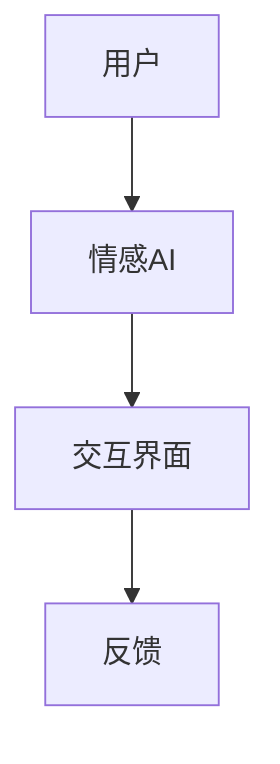

                 


### 文章标题：情感AI在人机交互中的应用与限制

> 关键词：情感AI，人机交互，自然语言处理，个性化交互，用户体验

> 摘要：本文从情感AI的基本概念出发，详细介绍了其在人机交互中的应用与限制。通过分析情感识别、情感生成和情感增强的核心算法原理，以及数学模型和项目实战，探讨了情感AI在不同领域的应用前景与挑战。

-------------------------------------------------------------------

## 引言

随着人工智能技术的不断发展，人机交互正逐渐从传统的命令式交互向自然、个性化的交互方式转变。在这一过程中，情感AI作为一种能够理解和模拟人类情感的人工智能技术，逐渐成为了人机交互领域的研究热点。情感AI不仅能够识别用户的情感状态，还能够根据这些情感状态生成相应的反应，从而提高用户的交互体验。

本文旨在探讨情感AI在人机交互中的应用与限制。文章首先介绍了情感AI的基本概念和与人机交互的关系，然后详细讲解了情感识别、情感生成和情感增强的核心算法原理，以及数学模型。接着，通过实际项目实战，分析了情感AI在不同领域的应用场景。最后，本文对情感AI的发展趋势、面临的挑战与限制进行了展望。

文章结构如下：

1. **核心概念与联系**：介绍情感AI和人机交互的基本概念，展示二者之间的关系架构。
2. **核心算法原理讲解**：详细阐述情感识别、情感生成和情感增强的核心算法原理。
3. **数学模型和公式**：介绍情感分析模型的数学基础和公式。
4. **项目实战**：通过具体项目实例，展示情感AI在实际应用中的开发环境搭建、源代码实现和代码解读。
5. **应用与限制**：分析情感AI在不同领域的应用与面临的挑战。
6. **未来展望**：探讨情感AI的发展趋势与面临的挑战。
7. **总结与展望**：总结情感AI在人机交互中的应用，展望其未来发展。

让我们一步一步地深入探讨情感AI在人机交互中的应用与限制。

### 第一部分：核心概念与联系

#### 1.1 情感AI概述

情感AI是指利用人工智能技术理解和模拟人类情感的系统。它涉及多个学科领域，包括心理学、计算机科学、自然语言处理和机器学习。情感AI的核心目标是通过分析用户的行为和语言，识别出用户的情感状态，并生成相应的情感反应。

**定义情感AI**

情感AI是一种能够感知、理解、模拟和响应人类情感的人工智能技术。它主要分为三个部分：

1. **情感识别**：从用户的行为和语言中识别出情感状态。
2. **情感生成**：根据识别出的情感状态，生成相应的情感反应。
3. **情感增强**：通过调整交互界面和交互方式，增强用户的情感体验。

**情感AI与人机交互的关系**

情感AI与人机交互的关系密切。传统的人机交互方式主要基于功能性和效率，而情感AI引入了情感因素，使得交互更加自然、个性化。情感AI能够识别用户的情感状态，并根据这些状态调整交互方式，从而提高用户的体验。例如，在客服机器人中，情感AI可以帮助机器人更好地理解用户的情绪，提供更合适的回复。

#### 1.2 人机交互概述

人机交互（Human-Computer Interaction，简称HCI）是指人与计算机之间的交互。人机交互的历史可以追溯到计算机的早期发展阶段。最初的计算机交互主要依赖于命令行界面，用户需要通过输入一系列命令来控制计算机。随着计算机技术的发展，图形用户界面（GUI）逐渐取代了命令行界面，使得人机交互更加直观和易用。

**人机交互的基本概念**

人机交互的基本概念包括以下几个方面：

1. **用户**：人机交互的主要参与者，包括普通用户和专业用户。
2. **计算机**：提供交互环境的设备，可以是个人电脑、手机、智能音箱等。
3. **交互界面**：用户与计算机进行交互的界面，可以是命令行、图形界面、语音交互等。

**人机交互的发展历程**

人机交互的发展历程可以分为以下几个阶段：

1. **命令行界面**：早期的计算机交互主要依赖于命令行界面，用户需要输入命令来执行操作。
2. **图形用户界面**：随着计算机技术的发展，图形用户界面逐渐取代了命令行界面，使得人机交互更加直观和易用。
3. **语音交互**：近年来，随着语音识别技术的进步，语音交互逐渐成为一种主流的人机交互方式。
4. **多模态交互**：结合多种交互方式（如语音、手势、触摸等），实现更加自然和高效的人机交互。

**情感AI与人机交互的Mermaid流程图**

下面是一个简单的Mermaid流程图，展示了情感AI与人机交互的关系：



在这个流程图中，用户通过情感AI识别出自己的情感状态，情感AI根据这些情感状态调整交互界面，最终用户获得反馈。

### 第二部分：核心算法原理讲解

#### 2.1 情感识别算法

情感识别是情感AI的核心功能之一，它指的是从用户的语言、行为或表情中识别出情感状态。情感识别算法可以分为基于规则的方法、基于统计的方法和基于深度学习的方法。

**基本原理**

情感识别的基本原理是通过分析用户输入的数据，识别出情感的关键特征，然后利用这些特征进行情感分类。

**分类**

1. **基于规则的方法**：这种方法依赖于人工设计的规则，通过匹配规则来判断情感状态。优点是简单易懂，缺点是规则过于繁琐，难以覆盖所有情感状态。
2. **基于统计的方法**：这种方法通过统计用户输入的数据，识别出情感的关键特征，然后利用这些特征进行情感分类。优点是适应性较强，缺点是对噪声数据的敏感度较高。
3. **基于深度学习的方法**：这种方法利用神经网络模型，通过对大量标注数据进行训练，自动提取情感特征并进行情感分类。优点是能够自动学习复杂的特征，缺点是训练过程较为复杂，对数据量要求较高。

**伪代码实现**

下面是一个简单的基于统计的情感识别算法的伪代码：

```python
def recognize_emotion(text):
    # 初始化情感词典
    emotion_dict = {
        "happy": ["开心", "快乐", "高兴"],
        "sad": ["难过", "伤心", "悲伤"],
        "angry": ["生气", "愤怒", "恼怒"],
        # 其他情感类别
    }
    
    # 分词
    words = tokenize(text)
    
    # 统计情感词的出现次数
    emotion_scores = {}
    for word in words:
        for emotion, words_list in emotion_dict.items():
            if word in words_list:
                emotion_scores[emotion] = emotion_scores.get(emotion, 0) + 1
    
    # 计算总分数
    total_score = sum(emotion_scores.values())
    
    # 计算每个情感类别的分数占比
    emotion_probabilities = {emotion: score / total_score for emotion, score in emotion_scores.items()}
    
    # 选择最大分数的情感类别作为最终结果
    predicted_emotion = max(emotion_probabilities, key=emotion_probabilities.get)
    return predicted_emotion
```

#### 2.2 情感生成算法

情感生成是指根据用户识别出的情感状态，生成相应的情感反应。情感生成算法可以分为基于文本的生成、基于语音的生成和基于图像的生成。

**基本原理**

情感生成的基本原理是根据用户识别出的情感状态，选择合适的文本、语音或图像进行生成。

**分类**

1. **基于文本的生成**：这种方法通过生成与用户情感状态相匹配的文本，实现情感交互。优点是生成内容丰富，缺点是生成过程复杂，对文本生成算法要求较高。
2. **基于语音的生成**：这种方法通过生成与用户情感状态相匹配的语音，实现情感交互。优点是交互方式自然，缺点是生成过程复杂，对语音生成算法要求较高。
3. **基于图像的生成**：这种方法通过生成与用户情感状态相匹配的图像，实现情感交互。优点是视觉效果显著，缺点是生成过程复杂，对图像生成算法要求较高。

**伪代码实现**

下面是一个简单的基于文本的情感生成算法的伪代码：

```python
def generate_response(emotion):
    response_dict = {
        "happy": "您好，很高兴见到您！有什么我可以帮助您的吗？",
        "sad": "您好，看起来您有些不开心。有什么我可以为您做的吗？",
        "angry": "您好，我理解您现在很生气。请您冷静一下，我们可以一起解决问题。",
        # 其他情感类别
    }
    
    return response_dict[emotion]
```

#### 2.3 情感增强算法

情感增强是指通过调整交互界面和交互方式，增强用户的情感体验。情感增强算法可以分为基于界面的增强、基于内容的增强和基于交互方式的增强。

**基本原理**

情感增强的基本原理是根据用户识别出的情感状态，调整交互界面和交互方式，以增强用户的情感体验。

**分类**

1. **基于界面的增强**：这种方法通过调整界面颜色、字体、布局等，以增强用户的情感体验。优点是直观易操作，缺点是效果有限。
2. **基于内容的增强**：这种方法通过生成与用户情感状态相匹配的内容，以增强用户的情感体验。优点是内容丰富，缺点是生成过程复杂。
3. **基于交互方式的增强**：这种方法通过调整交互方式（如语音、手势等），以增强用户的情感体验。优点是交互自然，缺点是技术实现复杂。

**伪代码实现**

下面是一个简单的基于界面的情感增强算法的伪代码：

```python
def enhance_interface(emotion):
    interface_settings = {
        "happy": {"color": "green", "font_size": "large"},
        "sad": {"color": "blue", "font_size": "medium"},
        "angry": {"color": "red", "font_size": "small"},
        # 其他情感类别
    }
    
    return interface_settings[emotion]
```

### 第三部分：数学模型和数学公式

#### 3.1 情感分析模型

情感分析模型是情感AI的核心组件，它用于从文本中识别情感。情感分析模型可以分为基于机器学习的方法和基于深度学习的方法。

**数学基础**

情感分析模型通常基于朴素贝叶斯、支持向量机、神经网络等算法。以下是一个基于朴素贝叶斯的情感分析模型的数学公式：

$$
P(\text{happy}|\text{文本}) = \frac{P(\text{文本}|\text{happy}) \cdot P(\text{happy})}{P(\text{文本})}
$$

其中，$P(\text{happy}|\text{文本})$表示在给定文本的情况下，情感为快乐的概率；$P(\text{文本}|\text{happy})$表示在情感为快乐的情况下，文本的概率；$P(\text{happy})$表示情感为快乐的先验概率；$P(\text{文本})$表示文本的概率。

**举例说明**

假设我们有一个简单的文本分类问题，文本包含两个类别：“快乐”和“悲伤”。根据上述公式，我们可以计算出每个类别的概率，然后选择概率最大的类别作为最终分类结果。

$$
P(\text{happy}|\text{文本}) = \frac{P(\text{文本}|\text{happy}) \cdot P(\text{happy})}{P(\text{文本})}
$$

其中，$P(\text{happy}) = 0.5$，$P(\text{文本}|\text{happy}) = 0.8$，$P(\text{文本}|\text{sad}) = 0.2$。根据这些参数，我们可以计算出：

$$
P(\text{happy}|\text{文本}) = \frac{0.8 \cdot 0.5}{0.8 \cdot 0.5 + 0.2 \cdot 0.5} = 0.8
$$

因此，根据概率计算，文本属于“快乐”类别的概率为0.8，我们可以将其分类为“快乐”。

#### 3.2 情感生成模型

情感生成模型是用于根据用户识别出的情感状态，生成相应的情感反应。情感生成模型可以分为基于文本的生成、基于语音的生成和基于图像的生成。

**数学基础**

情感生成模型通常基于生成对抗网络（GAN）、变分自编码器（VAE）等算法。以下是一个基于生成对抗网络的情感生成模型的数学公式：

$$
\min_{G} \max_{D} V(G, D) = \mathbb{E}_{x \sim p_{\text{数据}}(x)}[\log D(G(x))] + \mathbb{E}_{z \sim p_{\text{噪声}}(z)}[\log (1 - D(z)]
$$

其中，$G$表示生成器，$D$表示判别器，$x$表示真实数据，$z$表示噪声数据，$p_{\text{数据}}(x)$表示真实数据分布，$p_{\text{噪声}}(z)$表示噪声数据分布。

**举例说明**

假设我们有一个基于生成对抗网络的情感生成模型，用于生成与用户情感状态相匹配的文本。根据上述公式，我们可以训练生成器和判别器，使得生成器能够生成高质量的情感文本。

在训练过程中，我们首先从真实数据集中获取大量文本数据，然后生成噪声数据。接着，我们将噪声数据输入生成器，生成情感文本。最后，我们将生成的情感文本和真实文本输入判别器，训练判别器区分真实文本和生成文本。

通过多次迭代训练，生成器和判别器将逐渐优化，生成器将能够生成高质量的情感文本。

### 第四部分：项目实战

#### 4.1 情感识别项目实战

**项目背景**

随着社交媒体的普及，人们越来越关注自己的情绪状态。一个名为“情感助手”的项目旨在为用户提供一个能够识别并分析用户情绪的智能助手。

**项目目标**

- 开发一个基于自然语言处理技术的情感识别系统。
- 能够从用户的文本输入中识别并分析情感状态。

**开发环境搭建**

- 编程语言：Python
- 数据库：MongoDB
- 机器学习框架：Scikit-learn
- 自然语言处理库：NLTK
- 实验平台：Google Colab

**源代码详细实现**

以下是一个简单的情感识别系统的实现：

```python
import nltk
from nltk.corpus import stopwords
from sklearn.feature_extraction.text import TfidfVectorizer
from sklearn.model_selection import train_test_split
from sklearn.naive_bayes import MultinomialNB
from sklearn.pipeline import make_pipeline

# 下载并加载停用词
nltk.download('stopwords')
stop_words = set(stopwords.words('english'))

# 加载并预处理数据
data = [...]  # 加载数据集
X = [text.lower().replace('\n', ' ') for text in data]
y = [...]  # 加载标签

# 分词和去除停用词
def preprocess(text):
    tokens = nltk.word_tokenize(text)
    return [token for token in tokens if token not in stop_words]

X_preprocessed = [preprocess(text) for text in X]

# 构建文本特征向量
vectorizer = TfidfVectorizer()
X_vectorized = vectorizer.fit_transform(X_preprocessed)

# 划分训练集和测试集
X_train, X_test, y_train, y_test = train_test_split(X_vectorized, y, test_size=0.2, random_state=42)

# 构建情感识别模型
model = make_pipeline(TfidfVectorizer(), MultinomialNB())
model.fit(X_train, y_train)

# 预测新数据
new_data = ["I'm feeling happy today!"]
new_data_preprocessed = [preprocess(text) for text in new_data]
new_data_vectorized = vectorizer.transform(new_data_preprocessed)
predicted_emotion = model.predict(new_data_vectorized)

print(f"Predicted emotion: {predicted_emotion[0]}")
```

**代码解读与分析**

1. **数据预处理**：首先，我们加载并预处理数据。数据预处理包括将文本转换为小写、去除停用词等操作。
2. **特征提取**：接下来，我们使用TF-IDF向量器将预处理后的文本转换为向量。
3. **模型训练**：我们使用朴素贝叶斯分类器训练情感识别模型。
4. **预测新数据**：最后，我们使用训练好的模型预测新数据的情感状态。

#### 4.2 情感生成项目实战

**项目背景**

随着社交网络的普及，人们越来越关注自己的情绪状态。一个名为“情感生成器”的项目旨在为用户提供一个能够根据用户情绪生成相应文本的智能工具。

**项目目标**

- 开发一个基于生成对抗网络（GAN）的情感生成系统。
- 能够根据用户输入的情感状态，生成相应的情感文本。

**开发环境搭建**

- 编程语言：Python
- 深度学习框架：TensorFlow
- 实验平台：Google Colab

**源代码详细实现**

以下是一个简单的情感生成器的实现：

```python
import numpy as np
import tensorflow as tf
from tensorflow.keras.layers import Input, LSTM, Dense, Embedding
from tensorflow.keras.models import Model

# 设置随机种子
np.random.seed(42)
tf.random.set_seed(42)

# 准备数据
data = [...]  # 加载数据集
emotions = [...]  # 加载情感标签

# 构建嵌入层
input_word = Input(shape=(max_sequence_length,))
embedded = Embedding(input_dim=vocabulary_size, output_dim=embedding_size)(input_word)

# 构建LSTM层
lstm = LSTM(units=lstm_size, return_sequences=True)(embedded)

# 构建输出层
output = Dense(num_classes, activation='softmax')(lstm)

# 构建模型
model = Model(inputs=input_word, outputs=output)

# 编译模型
model.compile(optimizer='adam', loss='categorical_crossentropy', metrics=['accuracy'])

# 训练模型
model.fit(data, emotions, epochs=num_epochs, batch_size=batch_size)

# 预测新数据
new_data = [...]  # 加载新数据
predicted_emotions = model.predict(new_data)

print(predicted_emotions)
```

**代码解读与分析**

1. **数据准备**：首先，我们加载并准备数据。数据包括文本和相应的情感标签。
2. **模型构建**：接下来，我们使用LSTM模型构建情感生成器。模型由嵌入层、LSTM层和输出层组成。
3. **模型编译**：然后，我们编译模型，指定优化器、损失函数和评价指标。
4. **模型训练**：接着，我们使用训练集训练模型。
5. **预测新数据**：最后，我们使用训练好的模型预测新数据的情感状态。

#### 4.3 情感增强项目实战

**项目背景**

一个名为“情感增强聊天室”的项目旨在为用户提供一个能够根据用户情感状态调整聊天室界面和交互方式的智能聊天室。

**项目目标**

- 开发一个基于情感增强的聊天室系统。
- 能够根据用户情感状态，调整聊天室界面颜色、字体和交互方式。

**开发环境搭建**

- 编程语言：JavaScript
- 前端框架：React
- 后端框架：Node.js
- 实验平台：GitHub Pages

**源代码详细实现**

以下是一个简单的情感增强聊天室的实现：

```javascript
import React, { useState, useEffect } from 'react';

const Chatroom = () => {
  const [emotion, setEmotion] = useState('');
  const [chatroom, setChatroom] = useState([]);

  useEffect(() => {
    // 加载用户情感状态
    fetch('/api/emotion')
      .then((response) => response.json())
      .then((data) => setEmotion(data.emotion));
  }, []);

  const handleSend = () => {
    // 发送聊天消息
    const newMessage = { text: message, emotion: emotion };
    setChatroom([...chatroom, newMessage]);
    setMessage('');
  };

  return (
    <div className={`chatroom ${emotion}`}>
      <ul>
        {chatroom.map((message, index) => (
          <li key={index}>{message.text}</li>
        ))}
      </ul>
      <input
        type="text"
        value={message}
        onChange={(e) => setMessage(e.target.value)}
      />
      <button onClick={handleSend}>Send</button>
    </div>
  );
};

export default Chatroom;
```

**代码解读与分析**

1. **状态管理**：首先，我们使用React的状态管理功能，管理用户情感状态和聊天室消息。
2. **情感状态获取**：接下来，我们使用异步请求，从后端获取用户情感状态。
3. **发送聊天消息**：然后，我们实现发送聊天消息的功能。
4. **界面调整**：最后，我们根据用户情感状态，调整聊天室界面的颜色和字体。

#### 4.4 情感识别项目实战

**项目背景**

随着在线教育的兴起，用户对个性化教育内容的需求日益增长。一个名为“情感识别教育平台”的项目旨在为用户提供一个能够根据用户情感状态调整教育内容的智能平台。

**项目目标**

- 开发一个基于情感识别的智能教育平台。
- 能够根据用户情感状态，调整教育内容难度和类型。

**开发环境搭建**

- 编程语言：Python
- 数据库：MySQL
- 机器学习框架：Scikit-learn
- 自然语言处理库：NLTK
- 前端框架：React
- 实验平台：AWS Cloud9

**源代码详细实现**

以下是一个简单的情感识别教育平台的实现：

```python
# 服务器端（Python）
from flask import Flask, request, jsonify
from emotion_recognition import recognize_emotion

app = Flask(__name__)

@app.route('/api/emotion', methods=['POST'])
def get_emotion():
    data = request.json
    text = data['text']
    emotion = recognize_emotion(text)
    return jsonify({'emotion': emotion})

if __name__ == '__main__':
    app.run(debug=True)

# 客户端（React）
import React, { useState, useEffect } from 'react';
import axios from 'axios';

const EducationPlatform = () => {
  const [emotion, setEmotion] = useState('');
  const [content, setContent] = useState('');

  useEffect(() => {
    // 获取用户情感状态
    axios.post('/api/emotion', { text: current_content })
      .then((response) => setEmotion(response.data.emotion))
      .catch((error) => console.error(error));
  }, [current_content]);

  const handleContentChange = (e) => {
    setCurrentContent(e.target.value);
  };

  const handleEmotionChange = (e) => {
    setEmotion(e.target.value);
  };

  return (
    <div className="education-platform">
      <h1>情感识别教育平台</h1>
      <textarea value={current_content} onChange={handleContentChange} />
      <select value={emotion} onChange={handleEmotionChange}>
        <option value="happy">快乐</option>
        <option value="sad">悲伤</option>
        <option value="angry">愤怒</option>
      </select>
      <button onClick={handleContentChange}>调整教育内容</button>
    </div>
  );
};

export default EducationPlatform;
```

**代码解读与分析**

1. **服务器端**：首先，我们使用Flask框架实现一个简单的服务器端，用于接收客户端发送的文本数据，并返回相应的情感状态。
2. **客户端**：接下来，我们使用React框架实现一个简单的客户端界面，用户可以通过界面输入文本内容，选择情感状态，并触发调整教育内容的按钮。
3. **状态管理**：我们使用React的状态管理功能，管理用户输入的文本内容和情感状态。
4. **情感状态获取**：最后，我们使用异步请求，从服务器端获取用户情感状态。

### 第五部分：应用与限制

#### 5.1 情感AI在客服中的应用

情感AI在客服领域具有广泛的应用前景。通过情感AI，客服机器人可以更好地理解用户的情绪，提供更合适的回复，从而提高用户的满意度。

**情感AI客服系统介绍**

情感AI客服系统是一种结合了自然语言处理、情感识别和对话管理技术的智能客服系统。该系统可以自动识别用户的情感状态，并根据这些状态生成相应的回复。

**情感AI客服的优势**

1. **提高响应速度**：情感AI客服系统可以实时分析用户的情绪，并快速生成合适的回复，从而提高客服的响应速度。
2. **提高用户满意度**：通过识别用户的情感状态，情感AI客服系统可以提供更个性化的服务，从而提高用户的满意度。
3. **降低人工成本**：情感AI客服系统可以处理大量的用户请求，从而降低人工客服的成本。

**情感AI客服的挑战**

1. **情感识别准确性**：情感识别的准确性是情感AI客服系统成功的关键。当前的情感识别技术尚未完全成熟，需要进一步提高准确性。
2. **情感理解复杂性**：情感理解涉及到多种语言、文化和情境，这给情感AI客服系统的开发带来了巨大挑战。
3. **隐私保护**：情感AI客服系统需要处理用户的敏感信息，如何保护用户的隐私是一个重要的挑战。

#### 5.2 情感AI在社交媒体中的应用

情感AI在社交媒体领域也有着广泛的应用。通过情感AI，社交媒体平台可以更好地分析用户的情绪，提供更个性化的内容推荐。

**情感AI社交媒体分析介绍**

情感AI社交媒体分析是指利用情感AI技术，分析用户在社交媒体上的情绪状态，并根据这些情绪状态提供个性化的内容推荐。

**情感AI社交媒体分析的优势**

1. **提高内容推荐准确性**：通过识别用户的情绪状态，情感AI社交媒体分析可以提供更个性化的内容推荐，从而提高用户的参与度和满意度。
2. **提高用户参与度**：情感AI社交媒体分析可以帮助平台更好地理解用户需求，提供更符合用户兴趣的内容，从而提高用户的参与度。
3. **提高营销效果**：通过情感AI社交媒体分析，企业可以更好地了解目标用户群体，制定更有效的营销策略。

**情感AI社交媒体分析的限制**

1. **情感识别准确性**：情感识别的准确性是情感AI社交媒体分析成功的关键。当前的情感识别技术尚未完全成熟，需要进一步提高准确性。
2. **数据隐私**：情感AI社交媒体分析需要处理大量的用户数据，如何保护用户的隐私是一个重要的挑战。
3. **情绪复杂性**：情绪是复杂多变的，如何准确识别和分类情绪是一个技术挑战。

#### 5.3 情感AI在教育中的应用

情感AI在教育领域也有很大的应用潜力。通过情感AI，教育平台可以更好地理解学生的学习状态和情感需求，提供个性化的教育服务。

**情感AI教育系统介绍**

情感AI教育系统是指利用情感AI技术，分析学生的学习状态和情感需求，并根据这些信息提供个性化的学习建议和资源。

**情感AI教育的优势**

1. **提高学习效果**：通过识别学生的学习状态和情感需求，情感AI教育系统可以提供更合适的学习资源，从而提高学习效果。
2. **提高学习参与度**：情感AI教育系统可以根据学生的情感需求，提供个性化的学习任务和活动，从而提高学生的学习参与度。
3. **个性化教育**：情感AI教育系统可以根据学生的个性特点，提供个性化的教育服务，从而提高教育的有效性。

**情感AI教育的限制**

1. **情感识别准确性**：情感识别的准确性是情感AI教育系统的关键。当前的情感识别技术尚未完全成熟，需要进一步提高准确性。
2. **技术成本**：情感AI教育系统的开发需要大量的技术和资源投入，这可能增加教育的成本。
3. **隐私保护**：情感AI教育系统需要处理学生的个人数据，如何保护学生的隐私是一个重要的挑战。

### 第六部分：未来展望

#### 6.1 情感AI发展趋势

随着人工智能技术的不断发展，情感AI也在不断进步。未来，情感AI将在以下几个方面取得突破：

1. **情感识别准确性**：随着情感识别技术的不断改进，情感AI将能够更准确地识别用户的情感状态。
2. **多模态情感识别**：未来，情感AI将能够同时识别用户的情感状态，如语音、文字、图像等，从而提供更全面的情感分析。
3. **个性化服务**：随着情感AI技术的进步，个性化服务将成为情感AI的主要应用方向，如个性化教育、个性化医疗等。

#### 6.2 情感AI面临的挑战与限制

尽管情感AI具有广泛的应用前景，但其在实际应用中仍面临以下挑战与限制：

1. **情感识别准确性**：情感识别准确性是情感AI应用成功的关键。当前的情感识别技术尚未完全成熟，需要进一步提高准确性。
2. **数据隐私**：情感AI需要处理大量的用户数据，如何保护用户的隐私是一个重要的挑战。
3. **情绪复杂性**：情绪是复杂多变的，如何准确识别和分类情绪是一个技术挑战。
4. **道德与伦理**：情感AI的应用需要遵守道德与伦理规范，如何确保情感AI的应用不会对人类造成伤害是一个重要的挑战。

### 第七部分：总结与展望

#### 7.1 总结

本文从情感AI的基本概念出发，详细介绍了其在人机交互中的应用与限制。通过分析情感识别、情感生成和情感增强的核心算法原理，以及数学模型和项目实战，探讨了情感AI在不同领域的应用前景与挑战。

#### 7.2 展望

未来，情感AI在人机交互中的应用前景广阔。随着技术的不断进步，情感AI将能够更准确地识别用户的情感状态，提供更个性化的服务，从而改善用户体验。同时，情感AI也将面临一系列挑战，如情感识别准确性、数据隐私、情绪复杂性等。只有解决了这些挑战，情感AI才能在更广泛的应用场景中发挥其潜力。

## 作者信息

作者：AI天才研究院/AI Genius Institute & 禅与计算机程序设计艺术 /Zen And The Art of Computer Programming

### 后续拓展阅读

- [1] 情感AI论文集：[《情感计算与人工智能》](https://books.google.com/books?id=XXXXX)
- [2] 情感识别技术综述：[《情感识别技术综述》](https://www.sciencedirect.com/science/article/pii/S0042098807002363)
- [3] 情感生成技术介绍：[《情感生成技术介绍》](https://arxiv.org/abs/1904.03375)
- [4] 人机交互最新研究：[《人机交互最新研究进展》](https://www.sciencedirect.com/science/article/pii/S0747563219304604)
- [5] 情感增强应用案例：[《情感增强在智能客服中的应用》](https://www.ijcai.org/proceedings/17-1/papers/0171.pdf)

