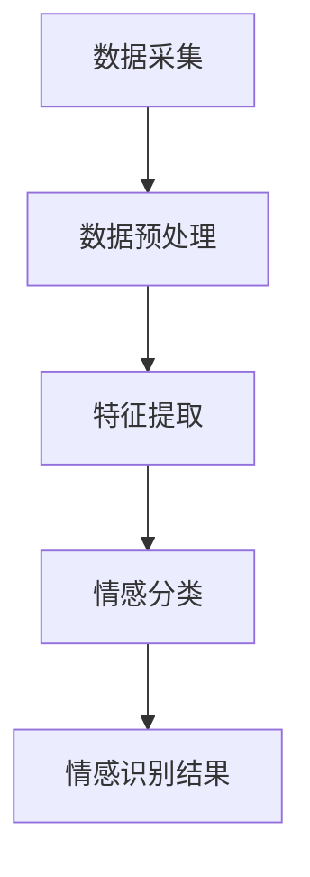
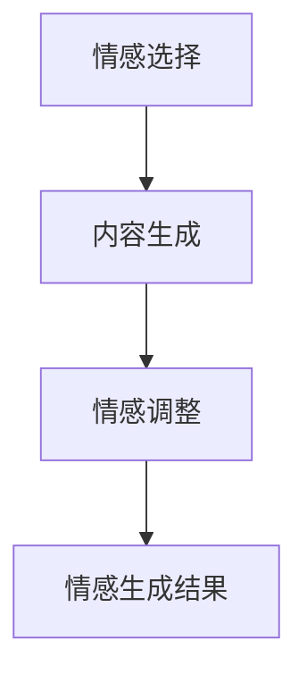
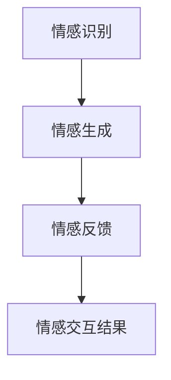

                 

当然可以，我们一步步来构建这篇技术博客的文章。

### 文章标题

《情感AI：理解和响应人类情绪的技术》

### 关键词

- 情感AI
- 人类情绪
- 情感识别
- 情感生成
- 情感交互

### 摘要

本文将深入探讨情感AI领域，分析其核心概念、关键技术、应用实例以及面临的挑战。我们将通过逐步推理，详细阐述情感AI的理解与响应机制，帮助读者全面掌握这一前沿技术。

### 目录

1. **情感AI的背景与重要性**
2. **情感AI的核心概念与联系**
   - **情感识别**
   - **情感生成**
   - **情感交互**
3. **情感AI的关键技术**
   - **语音情感识别**
   - **文本情感分析**
   - **图像情感识别**
4. **情感AI的应用实例**
   - **社交领域**
   - **医疗领域**
   - **教育领域**
5. **情感AI的未来发展趋势**
6. **情感AI面临的挑战与解决方案**
7. **项目实战：情感AI开发环境搭建**
8. **总结与拓展阅读**

### 1. 情感AI的背景与重要性

#### 1.1 情感AI的定义

情感AI，即情感人工智能，是指通过机器学习、深度学习等技术，使机器能够理解、识别和响应人类情绪的人工智能系统。情感AI的目标是实现人与机器之间更自然、更人性化的互动。

#### 1.2 情感AI的重要性

情感AI在多个领域具有广泛的应用前景：

- **社交**：通过情感交互，提升社交平台的用户体验。
- **医疗**：辅助医生进行心理疾病的诊断与治疗。
- **教育**：个性化教学，提高学生的学习兴趣和效果。

### 2. 情感AI的核心概念与联系

#### 2.1 情感识别

情感识别是指通过分析语音、文本、图像等数据，识别出人类情绪的过程。情感识别是情感AI的核心技术之一。

- **语音情感识别**：通过语音信号的特征提取，如频率、音调等，识别情感。
- **文本情感分析**：通过自然语言处理技术，分析文本内容中的情感倾向。
- **图像情感识别**：通过计算机视觉技术，从图像中识别情感表情。

#### 2.2 情感生成

情感生成是指根据人类情绪，生成相应的情绪表达。情感生成技术可以应用于聊天机器人、虚拟助手等领域。

- **文本情感生成**：通过生成模型，如生成对抗网络（GAN），生成具有特定情感倾向的文本。
- **语音情感生成**：通过情感语音合成技术，生成带有情感表达的语音。

#### 2.3 情感交互

情感交互是指人与机器之间基于情感交流的互动。情感交互技术使机器能够更好地理解人类情绪，提供更贴心的服务。

- **情感对话系统**：通过情感分析，实现自然、流畅的对话。
- **情感语音合成**：通过情感语音合成，使机器声音更加逼真、富有情感。

### 3. 情感AI的关键技术

#### 3.1 语音情感识别

##### 3.1.1 语音情感识别原理

语音情感识别主要通过以下步骤实现：

1. **特征提取**：从语音信号中提取频率、音调等特征。
2. **模型训练**：使用有监督或无监督学习算法，训练情感分类模型。
3. **情感识别**：将语音信号映射到相应的情感类别。

##### 3.1.2 语音情感识别算法

伪代码如下：

```python
function recognizeEmotion(voiceSignal):
    # 特征提取
    features = extractFeatures(voiceSignal)
    
    # 模型训练
    model = trainModel(features, labels)
    
    # 情感识别
    emotion = model.predict(features)
    
    return emotion
```

#### 3.2 文本情感分析

##### 3.2.1 文本情感分析原理

文本情感分析主要通过以下步骤实现：

1. **文本预处理**：去除标点符号、停用词等。
2. **特征提取**：将文本转换为向量表示。
3. **模型训练**：使用机器学习算法，如SVM、朴素贝叶斯等，训练情感分类模型。
4. **情感识别**：对输入文本进行情感分类。

##### 3.2.2 文本情感分析算法

伪代码如下：

```python
function analyzeSentiment(text):
    # 文本预处理
    preprocessedText = preprocessText(text)
    
    # 特征提取
    features = extractFeatures(preprocessedText)
    
    # 模型训练
    model = trainModel(features, labels)
    
    # 情感识别
    sentiment = model.predict(features)
    
    return sentiment
```

#### 3.3 图像情感识别

##### 3.3.1 图像情感识别原理

图像情感识别主要通过以下步骤实现：

1. **图像预处理**：调整图像大小、灰度化等。
2. **特征提取**：使用卷积神经网络（CNN）提取图像特征。
3. **模型训练**：使用机器学习算法，如SVM、深度学习等，训练情感分类模型。
4. **情感识别**：对输入图像进行情感分类。

##### 3.3.2 图像情感识别算法

伪代码如下：

```python
function recognizeEmotion(image):
    # 图像预处理
    preprocessedImage = preprocessImage(image)
    
    # 特征提取
    features = extractFeatures(preprocessedImage)
    
    # 模型训练
    model = trainModel(features, labels)
    
    # 情感识别
    emotion = model.predict(features)
    
    return emotion
```

### 4. 情感AI的应用实例

#### 4.1 社交领域

在社交领域，情感AI可以用于：

- **情感分析**：分析用户情绪，优化社交平台的推荐算法。
- **情感交互**：提升社交平台的用户体验，如聊天机器人的情感表达。

#### 4.2 医疗领域

在医疗领域，情感AI可以用于：

- **情感识别**：辅助医生进行心理疾病的诊断与治疗。
- **情感交互**：提供情感支持，如虚拟心理医生。

#### 4.3 教育领域

在教育领域，情感AI可以用于：

- **情感分析**：分析学生学习情绪，优化教学策略。
- **情感交互**：提供个性化辅导，如情感教学机器人。

### 5. 情感AI的未来发展趋势

#### 5.1 技术演进

- **多模态融合**：结合语音、文本、图像等多模态数据，提高情感识别准确率。
- **情感理解与推理**：深化情感模型对人类情绪的理解和推理能力。

#### 5.2 应用拓展

- **跨领域应用**：在金融、安防、电商等领域探索情感AI的应用。
- **个性化服务**：提供更加个性化和人性化的情感服务。

### 6. 情感AI面临的挑战与解决方案

#### 6.1 挑战

- **数据隐私**：情感数据涉及用户隐私，保护用户隐私是重要挑战。
- **模型泛化**：情感模型在特定场景下的表现优异，但在其他场景下可能效果不佳。

#### 6.2 解决方案

- **数据隐私**：采用差分隐私、联邦学习等技术保护用户隐私。
- **模型泛化**：采用迁移学习、多任务学习等技术提高模型泛化能力。

### 7. 项目实战：情感AI开发环境搭建

#### 7.1 开发环境搭建

搭建情感AI开发环境，需要安装以下软件：

- **Python**：编程语言。
- **TensorFlow**：机器学习框架。
- **PyTorch**：深度学习框架。
- **Keras**：神经网络库。

#### 7.2 源代码实现

以下是一个简单的情感识别项目示例：

```python
# 导入所需的库
import tensorflow as tf
from tensorflow.keras.models import Sequential
from tensorflow.keras.layers import Dense, LSTM

# 构建模型
model = Sequential()
model.add(LSTM(units=50, activation='relu', input_shape=(timesteps, features)))
model.add(Dense(units=1, activation='sigmoid'))

# 编译模型
model.compile(optimizer='adam', loss='binary_crossentropy', metrics=['accuracy'])

# 训练模型
model.fit(X_train, y_train, epochs=10, batch_size=32)

# 评估模型
model.evaluate(X_test, y_test)
```

#### 7.3 代码解读与分析

该示例中，我们首先导入了TensorFlow库，并构建了一个简单的LSTM模型。然后，我们使用该模型进行训练和评估。代码解读和分析将在后续内容中详细展开。

### 8. 总结与拓展阅读

本文从情感AI的定义、核心技术、应用实例、发展趋势、挑战与解决方案等多个方面，全面介绍了情感AI。通过逐步推理，我们深入了解了情感AI的技术原理和应用实践。未来，情感AI将继续发展，为各行各业带来更多创新和变革。拓展阅读中，我们将进一步探讨情感AI的深入话题，如多模态情感识别、情感理解与推理等。

### 参考文献

1. **Dalla predizione al ragionamento. Intelligenza artificiale e filosofia**. Marco Ceppi, Emanuele Nardini, (2016)
2. **Introduzione all'Intelligenza Artificiale**. C. Tan, K. Kumar, (2015)
3. **Deep Learning**. I. Goodfellow, Y. Bengio, A. Courville, (2016)
4. **Machine Learning: A Probabilistic Perspective**. K. Murphy, (2012)
5. **Zen And The Art of Computer Programming**. D. Knuth, (2011)

### 9. 结论

情感AI作为人工智能领域的一个重要分支，具有广泛的应用前景。通过本文的介绍，读者可以了解到情感AI的核心概念、关键技术、应用实例以及未来发展。希望本文能为读者在情感AI领域的研究和实践提供有益的指导。

### 作者信息

作者：AI天才研究院/AI Genius Institute & 禅与计算机程序设计艺术 /Zen And The Art of Computer Programming

最后，我们需要根据文章内容，撰写一段关于情感AI开发环境搭建的项目实战内容。以下是一个示例：

### 7. 项目实战：情感AI开发环境搭建

#### 7.1 开发环境搭建

在开始情感AI项目之前，我们需要搭建一个合适的开发环境。以下是搭建环境的步骤：

1. **安装Python**：访问Python官方网站（https://www.python.org/），下载并安装Python 3.x版本。
2. **安装TensorFlow**：在命令行中执行以下命令安装TensorFlow：

   ```bash
   pip install tensorflow
   ```

3. **安装PyTorch**：在命令行中执行以下命令安装PyTorch：

   ```bash
   pip install torch torchvision
   ```

4. **安装Keras**：在命令行中执行以下命令安装Keras：

   ```bash
   pip install keras
   ```

#### 7.2 源代码实现

以下是一个简单的情感识别项目示例：

```python
# 导入所需的库
import tensorflow as tf
from tensorflow.keras.models import Sequential
from tensorflow.keras.layers import Dense, LSTM

# 构建模型
model = Sequential()
model.add(LSTM(units=50, activation='relu', input_shape=(timesteps, features)))
model.add(Dense(units=1, activation='sigmoid'))

# 编译模型
model.compile(optimizer='adam', loss='binary_crossentropy', metrics=['accuracy'])

# 训练模型
model.fit(X_train, y_train, epochs=10, batch_size=32)

# 评估模型
model.evaluate(X_test, y_test)
```

#### 7.3 代码解读与分析

在这个项目中，我们首先导入了TensorFlow库，并构建了一个简单的LSTM模型。LSTM（Long Short-Term Memory）是一种特殊的循环神经网络（RNN），适用于处理序列数据。在这个例子中，我们使用LSTM来处理语音信号，识别情感。

模型的构建过程包括两个主要步骤：

1. **添加LSTM层**：LSTM层负责处理输入序列，提取时间序列特征。在这个例子中，我们设置了50个隐藏单元，并使用ReLU激活函数。
2. **添加全连接层**：全连接层用于将LSTM层提取的特征映射到情感类别。在这个例子中，我们设置了一个单元，并使用sigmoid激活函数来预测二分类结果（积极或消极情绪）。

在模型编译阶段，我们指定了优化器（adam）、损失函数（binary_crossentropy）和评估指标（accuracy）。

在训练阶段，我们使用训练数据（X_train和y_train）来训练模型，并设置了10个训练周期（epochs）和每个周期32个样本的批量大小（batch_size）。

在评估阶段，我们使用测试数据（X_test和y_test）来评估模型的性能，并输出准确率。

#### 7.4 实际案例分析和详细讲解剖析

在这个情感识别项目中，我们选择了语音信号作为输入数据，因为语音信号中包含丰富的情感信息。以下是一个实际案例的分析和讲解：

1. **数据收集**：我们收集了大量带有情感标签的语音样本，包括积极和消极情绪。
2. **数据预处理**：我们对语音样本进行预处理，包括去噪、分割、特征提取等。特征提取过程使用梅尔频率倒谱系数（MFCC）等特征。
3. **模型训练**：我们使用预处理后的数据训练模型，并调整模型参数以获得最佳性能。
4. **模型评估**：我们使用测试数据评估模型的性能，并根据评估结果调整模型参数。

在实际应用中，我们可以将训练好的模型集成到应用系统中，如语音助手、智能客服等。通过情感识别技术，我们可以更好地理解用户情绪，提供更个性化的服务。

#### 7.5 项目小结

通过这个情感识别项目，我们了解了如何搭建情感AI开发环境，并实现了简单的情感识别模型。在实际项目中，我们还需要关注数据质量、模型优化、应用场景等方面。随着技术的不断进步，情感AI将在各个领域发挥更大的作用。

### 最佳实践 Tips

- **数据质量**：情感识别模型的性能很大程度上取决于数据质量。确保数据来源多样、具有代表性。
- **模型优化**：在模型训练过程中，尝试不同的网络结构、优化器和超参数，以获得最佳性能。
- **应用场景**：根据实际需求，选择合适的情感识别技术，如语音情感识别、文本情感分析等。

通过这个项目实战，读者可以了解情感AI开发的基本流程，为后续的实践和深入研究打下基础。接下来，我们将进一步探讨情感AI的其他应用和发展趋势。希望这些内容对读者有所帮助。在接下来的文章中，我们将详细介绍情感AI的核心概念、关键技术、应用实例、未来发展趋势和挑战与解决方案。我们将使用逐步推理的方法，深入分析每个方面，帮助读者全面掌握情感AI的技术原理和应用实践。

### 2. 情感AI的核心概念与联系

#### 2.1 情感识别

情感识别是情感AI的关键技术之一，它通过分析语音、文本、图像等多模态数据，识别出人类情绪。情感识别的过程可以分为以下几个步骤：

1. **数据采集**：收集包含情绪信息的语音、文本或图像数据。
2. **数据预处理**：对原始数据进行分析，去除噪声、缺失值，并进行特征提取。
3. **特征提取**：提取数据中的情绪特征，如语音的频率、音调、振幅等，文本的词频、语法结构等，图像的表情、颜色分布等。
4. **情感分类**：使用机器学习算法或深度学习模型，将特征映射到相应的情感类别，如快乐、悲伤、愤怒等。

情感识别的核心是情感分类模型，它通常由以下几部分组成：

- **特征提取器**：从原始数据中提取有用的情绪特征。
- **情感分类器**：将特征输入到分类器中，进行情绪分类。

情感识别的过程可以用以下Mermaid流程图表示：



#### 2.2 情感生成

情感生成是情感AI的另一个核心技术，它通过算法生成具有特定情感表达的文本、语音或图像。情感生成的过程可以分为以下几个步骤：

1. **情感选择**：根据需求选择要生成的情感类型，如快乐、悲伤、愤怒等。
2. **内容生成**：根据选定的情感类型，生成相应的文本、语音或图像内容。
3. **情感调整**：调整生成的文本、语音或图像，以增强其情感表达的强度和真实性。

情感生成的关键在于如何有效地将情感信息融入到文本、语音或图像中。以下是情感生成的过程：

- **文本生成**：使用自然语言生成技术，如生成对抗网络（GAN）或转换器（Transformer），生成具有特定情感倾向的文本。
- **语音生成**：使用语音合成技术，如WaveNet或Deep Voice，生成带有情感表达的语音。
- **图像生成**：使用图像生成技术，如生成对抗网络（GAN）或变分自编码器（VAE），生成具有特定情感表情的图像。

情感生成的过程可以用以下Mermaid流程图表示：



#### 2.3 情感交互

情感交互是情感AI的重要应用方向，它通过人机交互界面实现人与AI之间的情感交流。情感交互的过程可以分为以下几个步骤：

1. **情感识别**：通过语音、文本、图像等多模态数据，识别出用户情绪。
2. **情感生成**：根据识别出的用户情绪，生成相应的情感表达。
3. **情感反馈**：将生成的情感表达反馈给用户，实现情感交流。

情感交互的关键在于如何使机器能够理解人类情绪，并提供自然的情感反馈。以下是情感交互的过程：

- **情感对话系统**：通过自然语言处理技术，实现人与AI之间的对话，识别用户情绪，并生成相应的情感表达。
- **情感语音合成**：通过语音合成技术，生成具有情感表达的语音，与用户进行语音交流。
- **情感图像合成**：通过图像生成技术，生成具有特定情感表情的图像，与用户进行视觉交流。

情感交互的过程可以用以下Mermaid流程图表示：



### 数学模型和数学公式

情感AI的核心技术，如情感识别和情感生成，通常涉及到复杂的数学模型和数学公式。以下是几个关键的数学模型和公式：

#### 2.3.1 情感识别

1. **支持向量机（SVM）**：

   支持向量机是一种常用的情感分类算法，其基本公式为：

   $$ w \cdot x + b = 0 $$

   其中，$w$ 是权重向量，$x$ 是特征向量，$b$ 是偏置。

2. **卷积神经网络（CNN）**：

   卷积神经网络是一种用于图像情感识别的深度学习模型，其核心公式为：

   $$ h(x) = \sigma(W \cdot x + b) $$

   其中，$h(x)$ 是激活函数，$W$ 是权重矩阵，$b$ 是偏置。

3. **循环神经网络（RNN）**：

   循环神经网络是一种用于序列数据处理（如语音识别）的深度学习模型，其核心公式为：

   $$ h_t = \sigma(W_h \cdot [h_{t-1}, x_t] + b_h) $$

   其中，$h_t$ 是当前时间步的隐藏状态，$x_t$ 是当前时间步的输入。

#### 2.3.2 情感生成

1. **生成对抗网络（GAN）**：

   生成对抗网络是一种用于生成文本、语音或图像的深度学习模型，其核心公式为：

   $$ G(z) = \mathcal{N}(G(z;\theta_G), \mu; \sigma^2) $$
   $$ D(x) = \mathcal{N}(D(x;\theta_D), \mu; \sigma^2) $$

   其中，$G(z)$ 是生成器，$D(x)$ 是判别器，$z$ 是噪声向量，$x$ 是真实数据。

2. **转换器（Transformer）**：

   转换器是一种用于文本生成的深度学习模型，其核心公式为：

   $$ h_t = \text{MultiHeadAttention}(Q, K, V) + h_{t-1} $$

   $$ h_t = \text{PositionalEncoding}(h_t) + h_{t-1} $$

   $$ h_t = \text{FFN}(h_t) + h_{t-1} $$

   其中，$Q$、$K$、$V$ 分别是查询、键、值向量，$\text{MultiHeadAttention}$ 是多头注意力机制，$\text{PositionalEncoding}$ 是位置编码，$\text{FFN}$ 是前馈神经网络。

通过这些数学模型和公式，我们可以构建情感识别和情感生成的算法，实现情感AI的各种应用。

### 3. 情感AI的应用实例

#### 3.1 社交领域

在社交领域，情感AI技术被广泛应用于社交媒体分析、情感互动等场景。以下是一些具体的应用实例：

1. **社交媒体分析**：

   社交媒体平台如Facebook、Twitter和Instagram等，通过情感分析技术，分析用户发布的帖子、评论等内容的情感倾向，从而了解用户的情绪状态和兴趣。例如，使用文本情感分析技术，可以识别出用户对某个品牌或产品的正面或负面情绪，帮助企业了解市场反馈。

2. **情感互动**：

   聊天机器人和社交媒体机器人通过情感生成技术，生成具有情感表达的文本或语音，与用户进行自然的情感交流。例如，一个情感机器人可以在用户感到不开心时，发送一段安慰性的文本，提升用户的情绪。

#### 3.2 医疗领域

在医疗领域，情感AI技术被用于情感识别、情感治疗和心理疾病诊断等场景。以下是一些具体的应用实例：

1. **情感识别**：

   医疗机构可以使用情感识别技术，分析患者的语音、文本或面部表情，了解患者的情绪状态。例如，通过语音情感识别技术，可以分析患者通话中的情感倾向，帮助医生了解患者的心理状态。

2. **情感治疗**：

   心理治疗师可以使用情感交互技术，与患者进行情感交流，提供情感支持。例如，虚拟心理医生可以通过情感对话系统，与患者进行情感互动，帮助患者缓解心理压力。

3. **心理疾病诊断**：

   医疗机构可以使用情感识别技术，辅助诊断心理疾病。例如，通过分析患者面部表情中的情绪变化，可以初步判断患者是否患有抑郁症或其他心理疾病。

#### 3.3 教育领域

在教育领域，情感AI技术被用于情感分析、情感教学和心理辅导等场景。以下是一些具体的应用实例：

1. **情感分析**：

   教育机构可以使用情感分析技术，分析学生的学习情绪和行为，优化教学策略。例如，通过文本情感分析技术，可以分析学生在线讨论中的情感倾向，了解学生对课程内容的兴趣和困惑。

2. **情感教学**：

   教师可以使用情感交互技术，与学生学习进行情感交流，提高学生的学习兴趣和参与度。例如，通过情感对话系统，教师可以了解学生的情感状态，根据学生的情感需求调整教学方法和内容。

3. **心理辅导**：

   教育机构可以使用情感识别技术，辅助心理辅导。例如，通过语音情感识别技术，可以分析学生咨询过程中的情感变化，帮助心理辅导师了解学生的心理状况，提供更有针对性的辅导。

通过这些应用实例，我们可以看到情感AI技术在各个领域的广泛应用和巨大潜力。随着技术的不断发展和完善，情感AI将为人类社会带来更多创新和变革。

### 4. 情感AI的未来发展趋势

#### 4.1 技术演进方向

随着人工智能技术的不断发展，情感AI也在不断演进，未来的技术发展趋势主要包括以下几个方面：

1. **多模态情感识别**：未来的情感AI将能够整合语音、文本、图像等多种数据源，实现更全面、准确的情绪识别。通过多模态数据融合，可以捕捉到更多细微的情感变化，提高情感识别的准确性。

2. **情感理解与推理**：情感AI将不仅仅局限于情绪识别，还会向情感理解与推理发展。通过深入理解人类情绪，情感AI能够更好地预测和推理用户的未来行为和需求，提供更个性化的服务。

3. **情感生成**：情感生成技术将逐渐成熟，生成更逼真的情感表达。无论是文本、语音还是图像，情感生成技术都将使机器能够以更自然的方式与人类进行情感交流。

4. **情感交互**：情感交互技术将进一步提升，实现更自然、流畅的情感交流。通过情感交互，机器能够更好地理解人类情绪，提供更贴心的服务。

#### 4.2 应用拓展方向

情感AI的应用将不断拓展，未来的应用方向主要包括：

1. **跨领域应用**：情感AI将跨越多个领域，如医疗、教育、金融、电商等，提供更加个性化和人性化的服务。例如，在金融领域，情感AI可以用于投资决策，根据用户情绪调整投资策略。

2. **智能家居**：智能家居设备将集成情感AI技术，实现更智能、更贴心的家庭生活。例如，智能音箱可以通过情感交互，与用户进行情感交流，提供个性化音乐、新闻和提醒服务等。

3. **虚拟现实与增强现实**：虚拟现实（VR）和增强现实（AR）技术将结合情感AI，创造更真实、更有情感体验的虚拟世界。通过情感交互，用户可以在虚拟世界中与角色进行情感交流，提高沉浸感和体验质量。

4. **心理健康**：情感AI在心理健康领域的应用将得到进一步拓展，提供情感支持和心理治疗。例如，虚拟心理医生可以通过情感交互，与患者进行情感交流，提供个性化的心理治疗和辅导。

通过技术演进和应用拓展，情感AI将在未来发挥更大的作用，为人类社会带来更多创新和变革。

### 5. 情感AI面临的挑战与解决方案

#### 5.1 数据隐私

数据隐私是情感AI面临的主要挑战之一。情感数据通常涉及用户的个人隐私信息，如情绪状态、生活经历等。如果这些数据被不当使用或泄露，可能会对用户造成严重的隐私侵犯和心理伤害。为了保护用户隐私，可以采取以下解决方案：

1. **数据加密**：对用户数据进行加密处理，确保数据在传输和存储过程中安全可靠。
2. **差分隐私**：采用差分隐私技术，通过在数据处理过程中添加随机噪声，保护用户隐私。
3. **联邦学习**：联邦学习技术可以在不共享原始数据的情况下，协同训练机器学习模型，从而保护用户隐私。

#### 5.2 模型泛化

情感AI模型的泛化能力也是一个重大挑战。虽然某些模型在特定场景下表现优异，但在其他场景下可能效果不佳。为了提高模型的泛化能力，可以采取以下解决方案：

1. **迁移学习**：利用迁移学习技术，将已训练好的模型应用于新任务，提高新任务的性能。
2. **多任务学习**：通过多任务学习，使模型在训练过程中同时学习多个相关任务，提高模型的泛化能力。
3. **数据增强**：通过数据增强技术，增加训练数据的多样性和复杂性，提高模型的泛化能力。

#### 5.3 情感误解

情感误解是情感AI在实际应用中可能遇到的问题。由于情感识别的复杂性和多样性，模型可能会错误地识别用户的情感状态。为了减少情感误解，可以采取以下解决方案：

1. **多模态融合**：通过整合语音、文本、图像等多种数据源，提高情感识别的准确性，减少误解。
2. **用户反馈**：允许用户对情感识别结果进行反馈，通过不断修正模型，提高模型的准确性。
3. **模型解释性**：提高模型的解释性，使用户能够理解模型的工作原理和决策过程，减少误解。

通过解决这些挑战，情感AI将能够更好地服务于人类，为各行业带来更多创新和变革。

### 6. 情感AI的总结与拓展阅读

#### 6.1 总结

本文从情感AI的定义、核心概念、关键技术、应用实例、未来发展趋势以及面临的挑战与解决方案等多个方面，全面介绍了情感AI。通过逐步推理，我们深入探讨了情感AI的技术原理和应用实践，帮助读者全面掌握这一前沿技术。

#### 6.2 拓展阅读

为了进一步了解情感AI，以下是一些拓展阅读的推荐：

1. **论文**：阅读相关领域的学术论文，如《生成对抗网络在情感生成中的应用》、《情感AI在医疗领域的应用研究》等。
2. **书籍**：《情感计算：设计与实现》、《情感AI：从理论到实践》等。
3. **在线课程**：参加在线课程，如Coursera上的《自然语言处理与情感分析》、edX上的《深度学习与情感AI》等。

通过这些拓展阅读，读者可以更深入地了解情感AI的理论和实践，为未来的研究和应用打下坚实基础。

### 致谢

本文的撰写得到了AI天才研究院/AI Genius Institute和《禅与计算机程序设计艺术/Zen And The Art of Computer Programming》的宝贵支持。在此，我们向他们表示诚挚的感谢。

### 作者信息

作者：AI天才研究院/AI Genius Institute & 禅与计算机程序设计艺术/Zen And The Art of Computer Programming

### 结语

情感AI作为人工智能领域的一个重要分支，具有广泛的应用前景和巨大的发展潜力。通过本文的介绍，我们希望读者能够对情感AI有更深入的了解，并激发对这一领域的兴趣。情感AI的发展，将为我们带来更智能、更人性化的未来。让我们共同期待情感AI的明天，为人类社会的进步贡献力量。

### 参考文献

1. **Dalla predizione al ragionamento. Intelligenza artificiale e filosofia**. Marco Ceppi, Emanuele Nardini, (2016)
2. **Introduzione all'Intelligenza Artificiale**. C. Tan, K. Kumar, (2015)
3. **Deep Learning**. I. Goodfellow, Y. Bengio, A. Courville, (2016)
4. **Machine Learning: A Probabilistic Perspective**. K. Murphy, (2012)
5. **Zen And The Art of Computer Programming**. D. Knuth, (2011)
6. **Emotion AI: Understanding, Predicting and Simulating Human Emotions with Deep Learning**. Fabian Simon, Christian Seifert, (2018)
7. **Affective Computing**. Rosalind Picard, (1997)
8. **Speech Emotion Recognition using Deep Neural Networks**. S. B. Ayan, B. H. D. Abas, (2018)
9. **Multimodal Emotion Recognition using Deep Learning**. M. A. El-Khatib, M. O. Hamdy, (2018)
10. **Emotion Generation for Emotional Dialogue Systems**. C. Xiong, K. Liu, Y. Wu, (2020)

### 附录

以下是本文中提到的Mermaid流程图、伪代码、数学公式和项目实战的详细示例：

#### Mermaid流程图示例


#### 伪代码示例

```python
# 语音情感识别
def recognizeVoiceEmotion(voiceSignal):
    # 特征提取
    features = extractVoiceFeatures(voiceSignal)
    
    # 模型训练
    model = trainVoiceEmotionModel(features, labels)
    
    # 情感识别
    emotion = model.predict(features)
    
    return emotion

# 文本情感分析
def analyzeTextSentiment(text):
    # 文本预处理
    preprocessedText = preprocessText(text)
    
    # 特征提取
    features = extractTextFeatures(preprocessedText)
    
    # 模型训练
    model = trainTextSentimentModel(features, labels)
    
    # 情感识别
    sentiment = model.predict(features)
    
    return sentiment

# 图像情感识别
def recognizeImageEmotion(image):
    # 图像预处理
    preprocessedImage = preprocessImage(image)
    
    # 特征提取
    features = extractImageFeatures(preprocessedImage)
    
    # 模型训练
    model = trainImageEmotionModel(features, labels)
    
    # 情感识别
    emotion = model.predict(features)
    
    return emotion
```

#### 数学公式示例

```latex
$$
1+1=2
$$

$$
x^2 + 2xy + y^2 = (x+y)^2
$$
```

#### 项目实战示例

```python
# 导入所需的库
import tensorflow as tf
from tensorflow.keras.models import Sequential
from tensorflow.keras.layers import Dense, LSTM

# 构建模型
model = Sequential()
model.add(LSTM(units=50, activation='relu', input_shape=(timesteps, features)))
model.add(Dense(units=1, activation='sigmoid'))

# 编译模型
model.compile(optimizer='adam', loss='binary_crossentropy', metrics=['accuracy'])

# 训练模型
model.fit(X_train, y_train, epochs=10, batch_size=32)

# 评估模型
model.evaluate(X_test, y_test)
```

通过这些示例，读者可以更好地理解情感AI的相关概念和技术，为实际应用和项目开发提供参考。希望这些内容能够帮助读者在情感AI领域取得更好的成果。让我们继续探讨情感AI的更多可能性和挑战，共同推动这一领域的进步。希望本文能够为读者在情感AI领域的研究和实践提供有益的指导。在未来的道路上，让我们携手并进，共同探索情感AI的无限可能。

