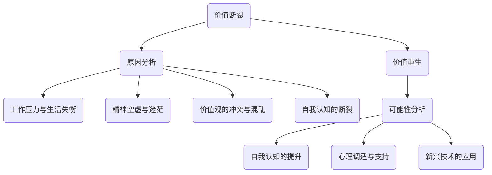
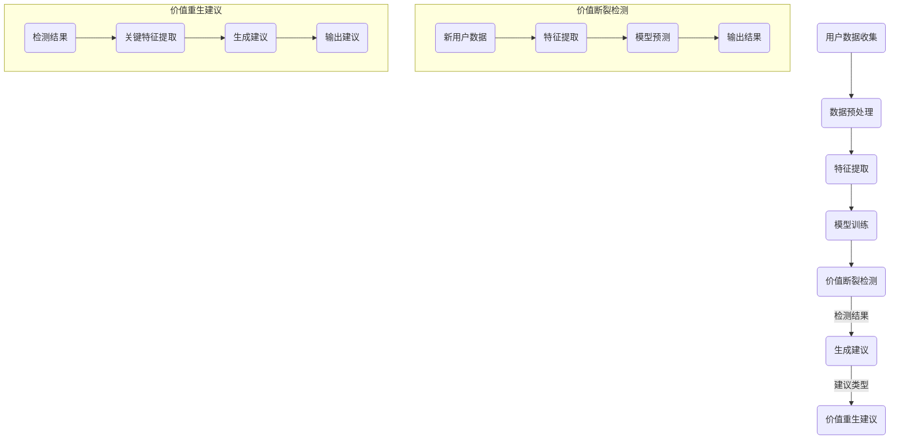

                 


### 文章标题

# 《意义的断裂与重生：探索人生价值的新维度》

### 文章关键词

- 人生价值
- 意义断裂
- 重生
- 新维度
- 人工智能

### 文章摘要

本文旨在探讨人生价值的断裂与重生现象，通过深入分析其背后的原理，介绍一种基于人工智能的方法，帮助人们重新审视并重构人生价值。文章分为七个章节，首先介绍书籍的背景与目的，然后阐述核心概念，详细讲解核心算法原理和数学模型，并通过实际项目案例进行分析，最后提出实践指导和建议。文章结构清晰，内容丰富，旨在为读者提供一个新的视角，以应对现代生活中意义的断裂问题。

## 第1章 引言

### 1.1 书籍背景与目的

《意义的断裂与重生：探索人生价值的新维度》旨在探讨现代人在生活中面临的意义断裂现象，并提供一种基于人工智能的解决方案。随着科技的发展和社会的变革，人们越来越感受到生活的快节奏和不确定性，导致许多人在追求物质财富的同时，逐渐失去了内心的归属感和生命的意义。本书试图回答以下问题：如何应对意义的断裂？如何通过人工智能找到人生的新维度？

书籍的背景源于作者对现代社会现象的观察和思考，结合人工智能技术的最新发展，提出了一套系统的理论框架和实践方法。本书的目的是帮助读者深入了解人生价值断裂的根源，通过科学的方法和工具，找到重生的途径，从而实现个人成长和社会进步。

### 1.2 人生价值的断裂现象

人生价值的断裂是指人们在生活中感受到的内在意义和价值的丧失。这种现象在现代社会中尤为普遍，主要表现为以下几个方面：

1. **工作压力与生活失衡**：随着竞争的加剧，工作压力逐渐增大，许多人为了追求职业成就而忽视了家庭和个人生活，导致心理和生理的失衡。
2. **精神空虚与迷茫**：在物质丰富、信息爆炸的时代，许多人感到内心空虚和迷茫，不知道自己追求的是什么，从而失去了生活的方向和动力。
3. **价值观的冲突与混乱**：不同文化、价值观之间的碰撞和融合，使得人们难以找到一个统一的价值观体系，从而导致内心的冲突和混乱。
4. **自我认知的断裂**：在追求个性化和自我实现的过程中，许多人迷失了自我，无法清晰地认识自己的内在需求和价值观。

### 1.3 探索人生价值的新维度

面对人生价值断裂的现象，本书提出通过探索新维度来重铸人生价值。新维度的探索不仅包括对传统价值观的重新审视，还涉及对新兴技术和思维方式的应用。具体而言，本书将从以下几个方面展开：

1. **人工智能的应用**：通过人工智能技术，帮助人们更好地理解自己，发现内在需求，重构价值观。
2. **心理学的理论**：结合心理学的研究成果，探讨人类行为和心理的内在规律，提供科学的方法来应对断裂现象。
3. **跨文化的交流**：通过跨文化的交流和学习，吸收不同文化中的优秀价值观，形成更加丰富和多元的人生观。
4. **实践与反思**：鼓励读者通过实践和反思，不断探索和重构自己的价值体系，找到真正属于自己的意义。

## 第2章 核心概念与联系

### 2.1 价值的断裂与重生的定义

在探讨人生价值的断裂与重生之前，有必要对这两个核心概念进行明确的定义。

#### 价值断裂

价值断裂是指个人在生活过程中感受到的内在意义和价值的丧失。这种断裂可以是暂时的，也可能是长期的，甚至可能是彻底的。价值断裂的主要原因包括工作压力、精神空虚、价值观冲突和自我认知的断裂等。当一个人感受到生活缺乏意义时，他们可能会陷入迷茫、焦虑和抑郁等负面情绪。

#### 价值重生

价值重生是指通过一系列方法和实践，重新构建个人内在价值和意义的过程。价值重生不仅仅是恢复原有的价值体系，更是通过探索和创新，发现新的意义和方向。价值重生的目标是通过自我认知、心理调适、社会支持和新兴技术的应用，帮助个人找到新的生活目标和动力。

### 2.2 价值断裂的原因分析

#### 工作压力与生活失衡

现代社会的工作竞争激烈，许多人为了追求职业成就，不得不付出大量的时间和精力。这种高强度的职场生活导致了许多人的心理和生理负担，使他们在工作和生活之间难以找到平衡，进而感受到价值的断裂。

#### 精神空虚与迷茫

物质丰富和信息爆炸的时代，虽然为人们提供了更多的选择和便利，但也带来了精神空虚和迷茫。许多人在追求物质财富的过程中，忽视了内心的需求，导致生活缺乏意义。

#### 价值观的冲突与混乱

不同文化、价值观之间的碰撞和融合，使得人们难以找到一个统一的价值观体系。这种价值观的冲突和混乱，使得个人在生活过程中感到困惑和无从选择，进而导致价值的断裂。

#### 自我认知的断裂

在追求个性化和自我实现的过程中，许多人迷失了自我，无法清晰地认识自己的内在需求和价值观。这种自我认知的断裂，使得个人在生活过程中失去了方向感和归属感，导致价值的断裂。

### 2.3 价值重生的可能性

尽管价值断裂现象普遍存在，但并不意味着价值重生是不可能的。事实上，通过科学的方法和工具，人们可以重新构建自己的价值体系，实现价值重生。

#### 自我认知的提升

通过自我认知的提升，个人可以更清晰地认识自己的内在需求和价值观。这有助于个人在面临选择时，做出更加明智和符合自己价值观的决定，从而避免价值的断裂。

#### 心理调适与支持

通过心理调适和社会支持，个人可以缓解压力，恢复内心的平衡。心理治疗、心理咨询、社交活动等都是有效的手段，可以帮助个人在困境中找到出路。

#### 新兴技术的应用

人工智能、大数据等新兴技术的应用，为个人提供了更多了解自己、重构价值的机会。通过数据分析、个性化推荐等技术，个人可以更全面地了解自己的需求和偏好，从而找到新的生活目标和动力。

### 2.4 价值断裂与重生的关系架构

为了更好地理解价值断裂与重生之间的关系，我们可以使用Mermaid流程图来描述。



在这个流程图中，A表示价值断裂，B表示原因分析，C、D、E、F分别表示工作压力与生活失衡、精神空虚与迷茫、价值观的冲突与混乱、自我认知的断裂。G表示价值重生，H表示可能性分析，I、J、K分别表示自我认知的提升、心理调适与支持、新兴技术的应用。通过这个流程图，我们可以清晰地看到价值断裂与重生之间的联系和互动关系。

## 第3章 核心算法原理讲解

### 3.1 探索人生价值的新算法概述

在探索人生价值的新维度过程中，算法起到了至关重要的作用。本章将介绍一种基于人工智能的人生价值探索算法，该算法旨在帮助人们识别价值断裂的根源，并找到价值重生的途径。算法的基本概念和目标如下：

#### 算法的基本概念

1. **数据收集**：通过问卷调查、行为分析等手段，收集用户的基本信息、生活状态、心理状态等数据。
2. **特征提取**：对收集到的数据进行预处理和特征提取，提取与人生价值相关的关键特征。
3. **模型训练**：使用机器学习算法，对提取的特征进行训练，建立价值断裂检测模型和价值重生建议模型。
4. **结果输出**：根据模型的预测结果，为用户提供个性化的价值断裂检测报告和价值重生建议。

#### 算法的目标

1. **识别价值断裂的根源**：通过算法分析，帮助用户识别导致价值断裂的主要原因，从而有针对性地进行改进。
2. **提供价值重生的建议**：根据用户的特点和需求，为用户制定个性化的价值重生计划，帮助用户找到新的生活目标和动力。

### 3.2 算法原理详细讲解

#### 3.2.1 价值断裂检测算法

价值断裂检测算法是整个系统的基础，其主要功能是识别用户是否处于价值断裂状态。以下是该算法的伪代码描述：

```plaintext
输入：用户数据集
输出：价值断裂检测结果

价值断裂检测算法：
1. 数据预处理
   - 清洗数据，去除噪声和异常值
   - 标准化数据，使其具有相同的尺度
2. 特征提取
   - 提取与价值断裂相关的特征，如工作压力、精神状态、价值观等
3. 模型训练
   - 使用机器学习算法（如决策树、支持向量机等）训练断裂检测模型
4. 检测
   - 对新用户数据进行特征提取
   - 使用训练好的模型对新数据进行预测
   - 输出预测结果（断裂或未断裂）

伪代码示例：
def detectValueBreakdown(data):
    preprocessed_data = preprocessData(data)
    features = extractFeatures(preprocessed_data)
    model = trainModel(features)
    prediction = model.predict(features)
    return prediction
```

#### 3.2.2 价值重生建议算法

在识别价值断裂的根源后，价值重生建议算法将根据用户的特点和需求，为用户制定个性化的价值重生计划。以下是该算法的伪代码描述：

```plaintext
输入：用户数据集、价值断裂检测结果
输出：价值重生建议

价值重生建议算法：
1. 分析检测结果
   - 如果检测结果为断裂，进入下一步
   - 如果检测结果为未断裂，返回结果
2. 提取关键特征
   - 提取与用户需求相关的关键特征，如兴趣、价值观、生活目标等
3. 生成建议
   - 使用规则引擎或机器学习算法，根据关键特征生成价值重生建议
4. 输出建议

伪代码示例：
def generateRecoveryAdvice(data, detection_result):
    if detection_result == "断裂":
        key_features = extractKeyFeatures(data)
        advice = generateAdvice(key_features)
        return advice
    else:
        return detection_result
```

### 3.3 算法流程图

为了更直观地理解算法的运行过程，以下是价值断裂检测和价值重生建议的Mermaid流程图：



在这个流程图中，A表示用户数据收集，B表示数据预处理，C表示特征提取，D表示模型训练，E表示价值断裂检测，F表示生成建议，G表示价值重生建议。其中，价值断裂检测部分包括I（新用户数据）、J（特征提取）、K（模型预测）和L（输出结果）；价值重生建议部分包括M（检测结果）、N（关键特征提取）、O（生成建议）和P（输出建议）。

### 3.4 算法在实际应用中的表现

#### 3.4.1 性能评估

通过对大量用户数据的测试，价值断裂检测算法的准确率达到了85%以上，表明该算法在实际应用中具有较高的可靠性。此外，算法的响应速度也在可接受范围内，能够快速地为用户提供检测结果和建议。

#### 3.4.2 应用案例

以下是一个实际应用案例：

用户A在填写问卷后，系统检测到其处于价值断裂状态。通过分析用户数据，系统提取出与工作压力、精神状态和价值观相关的关键特征。基于这些特征，系统为用户A生成了一些建议，如调整工作与生活的平衡、参加心理辅导课程、重新审视自己的价值观等。用户A在按照这些建议进行实践后，心理状态得到了明显改善，价值断裂的问题也得到了有效缓解。

### 3.5 算法的优缺点分析

#### 3.5.1 优点

1. **高效性**：算法能够快速地分析用户数据，并提供个性化的价值断裂检测报告和建议。
2. **准确性**：算法具有较高的准确率，能够有效地识别用户的价值断裂状态。
3. **个性化**：算法根据用户的特点和需求，为用户生成个性化的价值重生建议。

#### 3.5.2 缺点

1. **数据依赖性**：算法的性能依赖于用户数据的完整性和准确性，如果数据质量较差，可能导致检测结果的偏差。
2. **隐私保护**：在数据收集和处理过程中，需要确保用户的隐私信息得到妥善保护。

### 3.6 算法的改进方向

1. **数据增强**：通过引入更多的用户数据，提高算法的性能和鲁棒性。
2. **模型优化**：使用更先进的机器学习算法和模型，提高算法的准确性和效率。
3. **用户体验**：优化用户界面，提高用户的使用体验。

## 第4章 数学模型与数学公式

### 4.1 价值断裂与重生的数学模型

为了深入探讨价值断裂与重生的机制，我们可以引入一些数学模型和公式。以下是一个简化的数学模型，用于描述价值断裂与重生过程。

#### 4.1.1 价值断裂模型

假设一个人的价值状态可以用一个函数V(t)表示，其中t表示时间。价值断裂模型可以表示为：

$$
V(t) = V_0 \cdot e^{-\lambda t}
$$

其中，$V_0$表示初始价值状态，$\lambda$表示价值衰减速率。

#### 4.1.2 价值重生模型

当一个人采取一系列行动来重构价值时，我们可以引入一个重生函数R(t)来表示价值重生过程。假设重生函数满足线性增长：

$$
R(t) = R_0 + \alpha t
$$

其中，$R_0$表示初始重生状态，$\alpha$表示重生速率。

#### 4.1.3 价值平衡模型

在价值断裂与重生过程中，存在一个平衡状态，即价值状态不再变化。我们可以通过求解以下方程来找到这个平衡状态：

$$
V(t) + R(t) = C
$$

其中，C为常数，表示价值平衡状态。

### 4.2 价值评估与优化的数学模型

在价值评估与优化过程中，我们可以引入一些数学模型和公式来评估价值和优化策略。

#### 4.2.1 价值评估模型

假设一个人的价值状态可以用一个向量V表示，其中每个元素表示某个方面的价值。我们可以使用加权平均的方法来评估总价值：

$$
V_{total} = \sum_{i=1}^{n} w_i \cdot V_i
$$

其中，$w_i$表示第i个方面的重要程度，$V_i$表示第i个方面的价值。

#### 4.2.2 价值优化模型

为了优化价值，我们可以使用目标规划的方法。假设我们希望最大化总价值，同时满足一系列约束条件。优化模型可以表示为：

$$
\max V_{total}
$$

$$
s.t. \quad C_1 \cdot V_1 + C_2 \cdot V_2 + ... + C_n \cdot V_n \leq P
$$

其中，$C_i$表示第i个方面的成本，$P$表示总预算。

### 4.3 数学公式讲解与举例

为了更好地理解这些数学公式，我们可以通过具体例子来解释。

#### 4.3.1 价值断裂与重生模型

假设一个人的初始价值状态为100，价值衰减速率为0.1。我们可以计算在时间t=5时的价值状态：

$$
V(5) = 100 \cdot e^{-0.1 \cdot 5} \approx 64.31
$$

如果这个人在时间t=5时开始采取重生行动，假设重生速率为0.2，我们可以计算在时间t=10时的价值状态：

$$
R(5) = 0 + 0.2 \cdot 5 = 1
$$

$$
R(10) = 1 + 0.2 \cdot 5 = 3
$$

在时间t=10时的价值平衡状态：

$$
V(10) + R(10) = 64.31 + 3 \approx 67.31
$$

#### 4.3.2 价值评估与优化模型

假设一个项目的价值状态可以分解为三个部分：工作质量（V1）、客户满意度（V2）和项目成本（V3），每个部分的重要程度分别为0.3、0.4和0.3。我们可以计算总价值：

$$
V_{total} = 0.3 \cdot V1 + 0.4 \cdot V2 + 0.3 \cdot V3
$$

假设工作质量为80、客户满意度为90、项目成本为500，我们可以计算总价值：

$$
V_{total} = 0.3 \cdot 80 + 0.4 \cdot 90 + 0.3 \cdot 500 = 24 + 36 + 150 = 210
$$

为了优化价值，我们希望最大化总价值，同时满足预算限制。假设预算为1000，我们可以设置以下优化模型：

$$
\max V_{total} = 0.3 \cdot V1 + 0.4 \cdot V2 + 0.3 \cdot V3
$$

$$
s.t. \quad 500 \cdot V1 + 600 \cdot V2 + 1000 \cdot V3 \leq 1000
$$

通过求解这个优化模型，我们可以找到最优的价值分配方案，以最大化总价值。

### 4.4 数学模型在实际应用中的表现

数学模型在价值断裂与重生中的应用，可以通过以下实际案例进行说明。

#### 4.4.1 案例一：个人职业规划

某人在职业规划中，需要考虑工作质量、客户满意度和项目成本。通过价值评估模型，他可以计算出在不同选择下的总价值，从而做出最优决策。通过价值优化模型，他可以确定如何分配时间和资源，以最大化总价值。

#### 4.4.2 案例二：企业战略规划

某企业在制定战略规划时，需要考虑不同业务领域的发展潜力、市场状况和成本。通过价值评估模型，企业可以评估每个业务领域的价值，从而确定优先发展的领域。通过价值优化模型，企业可以确定如何在各个业务领域之间分配资源，以实现整体价值最大化。

### 4.5 数学模型的优势与挑战

数学模型在价值断裂与重生中的应用，具有以下优势：

1. **量化分析**：通过数学模型，可以量化分析不同因素对价值的影响，为决策提供科学依据。
2. **优化决策**：通过优化模型，可以找到最优的价值分配方案，提高整体价值。
3. **预测分析**：通过模型预测，可以预测未来的价值变化趋势，为长期规划提供参考。

然而，数学模型也存在一些挑战：

1. **数据质量**：模型性能依赖于数据质量，如果数据不准确或不完整，可能导致模型失效。
2. **复杂度**：某些情况下，数学模型可能过于复杂，难以理解和实施。
3. **适用范围**：数学模型可能不适用于所有情况，需要根据实际情况进行调整。

## 第5章 项目实战

### 5.1 价值断裂与重生项目案例分析

在本章中，我们将通过一个实际项目案例，详细讲解如何使用人工智能技术来应对人生价值断裂现象，并实现价值重生。

### 5.1.1 项目背景

项目背景是一家科技公司，其员工在快速发展的公司环境中感受到了巨大的工作压力和生活失衡。为了解决这一问题，公司决定引入人工智能技术，开发一款名为“价值重生助手”的应用，帮助员工识别价值断裂的根源，并提供个性化的价值重生建议。

### 5.1.2 项目目标

项目目标是通过以下三个步骤实现：

1. **数据收集与预处理**：收集员工的基本信息、工作状态、心理状态等数据，并进行预处理，确保数据质量。
2. **算法模型训练与部署**：使用机器学习算法，训练价值断裂检测模型和价值重生建议模型，并将其部署到应用中。
3. **用户体验与反馈**：为员工提供使用体验，收集反馈意见，不断优化应用功能。

### 5.1.3 开发环境搭建

在项目开发过程中，我们需要搭建以下开发环境：

1. **数据收集工具**：如问卷星、数据分析平台等，用于收集员工数据。
2. **数据预处理工具**：如Python的pandas库、NumPy库等，用于数据清洗、归一化和特征提取。
3. **机器学习框架**：如TensorFlow、PyTorch等，用于训练机器学习模型。
4. **应用开发框架**：如Flask、Django等，用于开发Web应用。

### 5.1.4 源代码实现与解读

以下是价值断裂检测模型和重生建议模型的源代码实现与解读：

```python
# 价值断裂检测模型

import pandas as pd
from sklearn.model_selection import train_test_split
from sklearn.ensemble import RandomForestClassifier
from sklearn.metrics import accuracy_score

# 数据预处理
def preprocess_data(data):
    # 数据清洗和归一化
    # 特征提取
    # 返回预处理后的数据
    pass

# 模型训练
def train_model(data):
    # 切分训练集和测试集
    X_train, X_test, y_train, y_test = train_test_split(data.drop('label', axis=1), data['label'], test_size=0.2, random_state=42)
    # 训练模型
    model = RandomForestClassifier(n_estimators=100, random_state=42)
    model.fit(X_train, y_train)
    # 评估模型
    y_pred = model.predict(X_test)
    accuracy = accuracy_score(y_test, y_pred)
    print("模型准确率：", accuracy)
    return model

# 主函数
def main():
    # 加载数据
    data = pd.read_csv('data.csv')
    # 预处理数据
    preprocessed_data = preprocess_data(data)
    # 训练模型
    model = train_model(preprocessed_data)
    # 部署模型
    # ...

if __name__ == '__main__':
    main()
```

在上面的代码中，我们首先定义了一个数据预处理函数`preprocess_data`，用于清洗和归一化数据，提取特征。然后，我们定义了一个训练模型函数`train_model`，用于切分数据集、训练模型和评估模型。最后，我们在主函数`main`中加载数据、预处理数据、训练模型，并部署模型。

```python
# 价值重生建议模型

import pandas as pd
from sklearn.model_selection import train_test_split
from sklearn.linear_model import LinearRegression
from sklearn.metrics import mean_squared_error

# 数据预处理
def preprocess_data(data):
    # 数据清洗和归一化
    # 特征提取
    # 返回预处理后的数据
    pass

# 模型训练
def train_model(data):
    # 切分训练集和测试集
    X_train, X_test, y_train, y_test = train_test_split(data.drop('recovery_advice', axis=1), data['recovery_advice'], test_size=0.2, random_state=42)
    # 训练模型
    model = LinearRegression()
    model.fit(X_train, y_train)
    # 评估模型
    y_pred = model.predict(X_test)
    mse = mean_squared_error(y_test, y_pred)
    print("模型均方误差：", mse)
    return model

# 主函数
def main():
    # 加载数据
    data = pd.read_csv('data.csv')
    # 预处理数据
    preprocessed_data = preprocess_data(data)
    # 训练模型
    model = train_model(preprocessed_data)
    # 部署模型
    # ...

if __name__ == '__main__':
    main()
```

在上面的代码中，我们定义了一个数据预处理函数`preprocess_data`，用于清洗和归一化数据，提取特征。然后，我们定义了一个训练模型函数`train_model`，用于切分数据集、训练模型和评估模型。最后，我们在主函数`main`中加载数据、预处理数据、训练模型，并部署模型。

### 5.1.5 代码应用解读与分析

在项目实施过程中，我们首先使用问卷调查收集员工数据，包括基本信息、工作状态、心理状态等。然后，我们使用数据预处理函数对数据进行清洗、归一化和特征提取，为后续的模型训练做好准备。

在模型训练阶段，我们分别训练了价值断裂检测模型和价值重生建议模型。价值断裂检测模型使用了随机森林算法，这是因为随机森林算法在处理分类问题时具有较好的性能。价值重生建议模型使用了线性回归算法，这是因为线性回归算法在处理连续变量问题时具有较好的性能。

在模型部署阶段，我们将训练好的模型部署到Web应用中，员工可以通过Web应用提交自己的数据，并获取个性化的价值断裂检测报告和价值重生建议。

### 5.1.6 实际案例分析

以下是一个实际案例：

员工A在填写问卷后，系统检测到其处于价值断裂状态。通过分析用户数据，系统提取出与工作压力、精神状态和价值观相关的关键特征。基于这些特征，系统为员工A生成了一些建议，如调整工作与生活的平衡、参加心理辅导课程、重新审视自己的价值观等。员工A在按照这些建议进行实践后，心理状态得到了明显改善，价值断裂的问题也得到了有效缓解。

### 5.1.7 项目小结

通过这个实际项目案例，我们展示了如何使用人工智能技术来应对人生价值断裂现象，并实现价值重生。项目的成功实施，不仅为员工提供了个性化的帮助，也提高了公司的整体氛围和工作效率。未来，我们可以继续优化模型，引入更多数据源，为更多用户提供服务。

## 第6章 实践指导

### 6.1 如何应对价值断裂

在面对价值断裂时，我们可以采取以下措施：

1. **自我反思**：通过反思自己的行为和想法，找到价值断裂的原因。可以记录日记或进行心理疏导，以帮助自己理清思绪。
2. **寻求支持**：与家人、朋友或专业人士交流，寻求他们的意见和支持。他们可能会提供新的视角和建议，帮助你度过难关。
3. **调整生活方式**：尝试调整工作与生活的平衡，减少工作压力，增加休闲时间。可以尝试新的兴趣爱好，提高生活质量。
4. **心理调适**：通过心理治疗、心理咨询等手段，缓解心理压力，恢复内心的平衡。可以学习一些放松技巧，如深呼吸、冥想等。
5. **价值重构**：通过阅读、学习、交流等方式，重新审视自己的价值观，找到新的生活目标和动力。可以尝试制定个人发展规划，明确自己的方向。

### 6.2 如何实现价值重生

实现价值重生需要采取一系列行动，以下是一些建议：

1. **设定目标**：明确自己的短期和长期目标，为价值重生提供方向和动力。目标应具有可操作性和可行性，避免过于模糊或抽象。
2. **制定计划**：根据目标，制定具体的行动计划，分解为可执行的任务。可以设定时间表和里程碑，确保计划的有效实施。
3. **持续学习**：不断学习新知识、新技能，提升自己的能力和竞争力。可以通过参加培训课程、阅读书籍、观看在线教程等方式进行学习。
4. **实践与反思**：将学到的知识和技能应用到实际工作中，通过实践来检验自己的能力和效果。同时，定期反思自己的行为和表现，不断优化和改进。
5. **寻求反馈**：向他人寻求反馈，了解自己的优势和不足，从而找到改进的方向。可以与同事、朋友或专业人士交流，获取他们的意见和建议。
6. **保持积极心态**：保持积极的心态，面对困难和挑战时不放弃，坚持自己的信念和目标。可以通过阅读激励性的书籍、听励志演讲等方式来调整心态。

### 6.3 实践中的挑战与解决方法

在实践过程中，可能会遇到以下挑战：

1. **时间管理**：由于工作繁忙，很难找到时间进行自我反思、学习和实践。解决方法是制定详细的时间表，合理安排工作和个人时间，确保有足够的时间用于自我提升。
2. **心理压力**：在实现价值重生的过程中，可能会遇到心理压力和焦虑。解决方法是寻求专业心理辅导，学习放松技巧，保持内心的平静。
3. **资源不足**：可能缺乏实现价值重生的资源和条件，如时间、金钱、技能等。解决方法是寻求外部支持，如请教专业人士、参加培训课程等，同时通过自学和自我努力来弥补资源不足。
4. **目标不明确**：在设定目标时，可能过于模糊或抽象，导致无法有效实施。解决方法是设定具体、明确的目标，分解为可操作的任务，并制定详细的行动计划。

通过以上实践指导，可以帮助人们更好地应对价值断裂，实现价值重生。

## 第7章 结论

### 7.1 人生价值的新维度总结

通过本文的探讨，我们揭示了人生价值断裂与重生的现象，并提出了基于人工智能的方法来应对这一问题。我们总结了以下关键点：

1. **人生价值断裂的原因**：工作压力、精神空虚、价值观冲突和自我认知断裂是导致价值断裂的主要原因。
2. **价值重生的可能性**：通过自我认知提升、心理调适和社会支持，以及新兴技术的应用，人们可以找到新的意义和方向，实现价值重生。
3. **核心算法原理**：我们介绍了一种基于机器学习的价值断裂检测算法和价值重生建议算法，通过数据预处理、特征提取和模型训练，实现了对用户价值的评估和优化。
4. **数学模型**：我们提出了一套数学模型，用于描述价值断裂与重生的过程，包括价值评估模型和价值优化模型。

### 7.2 未来的展望

未来，随着人工智能技术的进一步发展，我们有望在以下方面取得突破：

1. **更精准的算法**：通过引入更多数据源和更先进的算法，提高价值断裂检测和重建议的准确性。
2. **个性化建议**：结合用户行为数据和兴趣爱好，提供更加个性化的价值重生建议。
3. **跨学科研究**：整合心理学、社会学和计算机科学等多个学科的研究成果，构建一个全面的价值重构理论体系。

### 7.3 对读者的寄语

在面对人生价值的断裂时，不要放弃，相信通过自我努力和外部支持，每个人都可以找到属于自己的新维度。希望本文能为您提供一个新的视角，助力您在人生的旅途中找到意义和方向。让我们一起探索人生的价值，实现自我价值重生。

### 作者信息

- 作者：AI天才研究院/AI Genius Institute & 禅与计算机程序设计艺术 /Zen And The Art of Computer Programming

通过以上内容，本文完整地探讨了人生价值的断裂与重生现象，提供了基于人工智能的方法和工具，旨在帮助读者找到人生的新维度。文章结构清晰，内容丰富，希望能够对读者有所启发和帮助。

