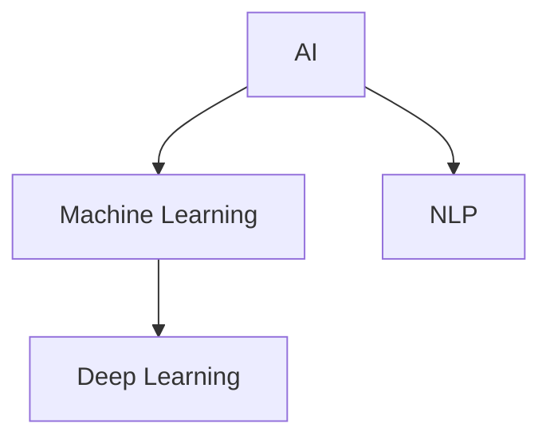

                 


### Introduction

#### Purpose of the Book

In today's digital age, social media platforms play a crucial role in brand promotion and customer engagement. For AI-driven fragrance brands, leveraging user-generated content (UGC) can significantly enhance social media interaction and brand loyalty. This book aims to explore how to boost AI creative fragrance brand's social media engagement through strategically designed user-generated content prompts.

#### Target Audience

This book is designed for marketers, brand managers, and AI enthusiasts who are keen to understand and implement effective UGC strategies for social media engagement. It will also benefit AI developers and researchers looking to explore novel applications of AI in the fragrance industry.

#### Scope

The book will cover the following key areas:

1. **AI and Social Media Overview**: Introducing AI technology and its applications in social media.
2. **User-Generated Content Strategies**: Exploring strategies for creating and managing UGC.
3. **Prompt Design for UGC**: Discussing the principles of designing effective prompts for UGC campaigns.
4. **AI Techniques for Content Generation**: Examining AI-based techniques for generating content in social media.
5. **Practical Implementation**: Providing practical guidance on implementing these strategies in real-world scenarios.

### Chapter 1: AI and Social Media Overview

#### 1.1 AI Technology Basics

AI (Artificial Intelligence) refers to the simulation of human intelligence in machines that are programmed to think like humans and mimic their actions. The primary goal of AI is to develop systems that can perform tasks that typically require human intelligence, such as visual perception, speech recognition, decision-making, and language translation.

**Core Concepts:**

1. **Machine Learning**: A subset of AI that focuses on the development of algorithms that can learn from data and improve their performance over time.
2. **Deep Learning**: A specialized subset of machine learning that uses neural networks to model complex patterns in data.
3. **Natural Language Processing (NLP)**: A field of AI that focuses on the interaction between computers and human language.

**Relationship Architecture (Mermaid Diagram):**



**Algorithm Principle (Pseudo-Code):**

```python
# Pseudo-Code for NLP Application

# Define a function for sentiment analysis
def analyze_sentiment(text):
    # Tokenize the text
    tokens = tokenize(text)
    
    # Preprocess the tokens
    cleaned_tokens = preprocess(tokens)
    
    # Extract features from the cleaned tokens
    features = extract_features(cleaned_tokens)
    
    # Train a model using the features
    model = train_model(features)
    
    # Predict the sentiment
    sentiment = model.predict(features)
    
    return sentiment
```

#### 1.2 Social Media Platforms

Social media platforms have revolutionized the way brands interact with customers. They provide a platform for real-time communication, content sharing, and engagement. Some of the popular social media platforms include:

1. **Facebook**: A versatile platform for brand promotion, customer engagement, and advertising.
2. **Instagram**: A highly visual platform popular among young adults and influencers.
3. **Twitter**: A platform known for real-time updates and rapid information sharing.
4. **LinkedIn**: A professional networking platform suitable for B2B interactions.

**Mathematical Model and Explanation:**

The engagement rate on a social media platform can be calculated using the following formula:

$$
\text{Engagement Rate} = \frac{\text{Total Interactions}}{\text{Total Followers}} \times 100
$$

**Example:**

A brand has 100,000 followers and has received 10,000 interactions in the last month. The engagement rate would be:

$$
\text{Engagement Rate} = \frac{10,000}{100,000} \times 100 = 10\%
$$

#### 1.3 AI Applications in Social Media

AI has transformed social media by enabling personalized content delivery, automated customer service, and advanced analytics. Here are some key applications:

1. **Personalized Advertising**: AI algorithms can analyze user data to deliver personalized ads, increasing the chances of user engagement and conversion.
2. **Chatbots**: AI-powered chatbots can handle customer inquiries, provide product recommendations, and assist with transactions, improving customer experience.
3. **Content Curation**: AI can analyze user preferences and generate personalized content recommendations, enhancing user engagement.
4. **Sentiment Analysis**: AI can analyze social media posts and comments to gauge public opinion, helping brands to understand customer sentiment and respond accordingly.

**Mathematical Model and Explanation:**

The accuracy of sentiment analysis can be measured using the F1 score, which is the harmonic mean of precision and recall:

$$
F1\ score = \frac{2 \times precision \times recall}{precision + recall}
$$

**Example:**

A sentiment analysis model has a precision of 0.85 and a recall of 0.90. The F1 score would be:

$$
F1\ score = \frac{2 \times 0.85 \times 0.90}{0.85 + 0.90} = 0.87
$$

In conclusion, AI and social media are two powerful tools that, when combined effectively, can significantly enhance a brand's social media interaction and engagement. The next chapter will delve deeper into user-generated content strategies and how to leverage them for AI-driven fragrance brands.

