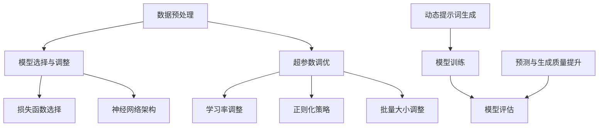
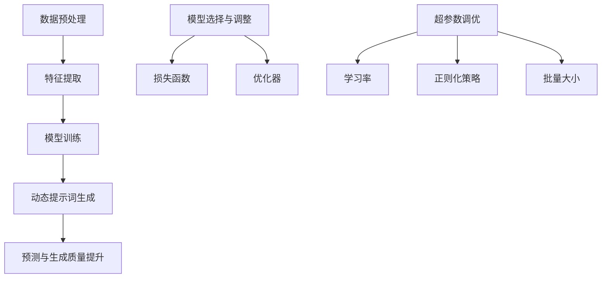

                 

### 文章标题：提示词优化：AIGC系统性能提升的关键

### 关键词：
- 提示词优化
- AIGC系统
- 性能提升
- 深度学习
- 神经网络
- 模型压缩
- 硬件加速
- 实际案例

### 摘要：
本文将深入探讨提示词优化在AIGC（自适应信息生成计算）系统性能提升中的关键作用。首先，我们将介绍提示词优化的基本概念和背景，然后分析AIGC系统的构成及其对性能优化的需求。接着，我们将详细讨论提示词优化的核心技术和算法，包括数据预处理、模型选择与调整、超参数调优等。随后，本文将探讨硬件加速与并行计算、模型压缩与量化、以及提高模型解释性与可解释性等方面的策略。在实战案例部分，我们将分析自然语言处理、计算机视觉、推荐系统、语音识别等领域的应用。最后，本文将对性能评测与监控的方法进行总结，并展望未来提示词优化和AIGC系统性能提升的发展趋势。

---

### 引言

#### 提示词优化的背景与意义

提示词优化（Prompt Engineering）是近年来在机器学习和深度学习领域迅速发展的一项技术。提示词是一种在模型训练过程中提供的信息，用于引导模型的预测方向和提升模型性能。在传统机器学习模型中，模型的性能很大程度上依赖于大量的标注数据和复杂的特征工程。然而，随着深度学习的兴起，特别是生成对抗网络（GAN）、变分自编码器（VAE）等生成模型的广泛应用，提示词优化成为了一种有效提升模型性能和泛化能力的重要手段。

提示词优化的核心在于通过精细调整输入提示词，使得模型能够更好地捕捉到数据的潜在结构，从而提高模型的预测准确性和鲁棒性。特别是在AIGC（自适应信息生成计算）系统中，提示词优化具有至关重要的意义。AIGC系统是一种基于深度学习和生成模型的高效信息生成和处理系统，广泛应用于自然语言处理、计算机视觉、推荐系统、语音识别等领域。这些领域中的任务通常具有高度的数据复杂性和多样性，传统的特征工程方法难以胜任，而通过提示词优化，可以有效提高模型的适应性和生成质量。

#### AIGC系统的概述

AIGC系统是一种基于自适应信息生成计算的技术体系，它通过深度学习模型生成高质量的数据、图像、文本等，并在生成过程中不断优化模型参数，以提高生成效果。AIGC系统的核心组成部分包括：

1. **生成模型**：如GAN（生成对抗网络）、VAE（变分自编码器）等，用于生成高质量的数据。
2. **自适应学习机制**：通过实时调整模型参数和输入提示词，使模型能够适应不同任务和数据集。
3. **多模态数据融合**：能够处理和融合多种类型的数据，如文本、图像、音频等。
4. **用户交互界面**：提供友好的用户交互界面，使非技术用户也能够方便地使用AIGC系统。

AIGC系统在各个领域的应用场景丰富多样。例如，在自然语言处理领域，AIGC系统可以用于生成高质量的文本，如文章、新闻、对话等；在计算机视觉领域，可以用于生成逼真的图像和视频；在推荐系统领域，可以用于生成个性化的推荐内容；在语音识别领域，可以用于生成自然流畅的语音。

#### 书籍内容概述与目标读者

本书旨在系统地介绍提示词优化在AIGC系统性能提升中的应用，内容涵盖了从基础理论到实际应用的各个方面。全书分为以下几个部分：

1. **引言**：介绍提示词优化和AIGC系统的背景和意义。
2. **基础理论**：详细讨论提示词优化的核心概念、目标和方法。
3. **核心技术**：探讨AIGC系统的基本架构和关键算法。
4. **性能优化**：分析硬件加速、模型压缩和可解释性等方面的优化策略。
5. **实战案例**：通过实际案例展示提示词优化的应用和实践。
6. **性能评测与监控**：介绍性能评估方法和实时监控机制。
7. **未来发展趋势**：展望提示词优化和AIGC系统的未来发展方向。

本书的目标读者是计算机科学、人工智能和机器学习领域的研究人员、工程师以及对该领域感兴趣的读者。读者需要具备一定的编程基础和机器学习知识，以便更好地理解本书的内容。

### 提示词优化的基础

#### 提示词的概念与分类

提示词（Prompt）是指用于引导模型预测或生成过程的输入信息，它可以是一个简单的文本、图像或者一个更复杂的序列数据。在机器学习和深度学习领域，提示词的作用类似于人脑中的“提示”或“暗示”，它能够帮助模型更好地理解输入数据的含义，从而提高模型的预测性能和生成质量。

根据提示词的形式，可以分为以下几种类型：

1. **文本提示词**：最常用的类型，通常用于自然语言处理任务，如文本分类、问答系统、机器翻译等。文本提示词可以是关键词、句子或者段落。
2. **图像提示词**：用于计算机视觉任务，如图像分类、目标检测、图像生成等。图像提示词可以是一张或多张图像。
3. **音频提示词**：用于语音识别和生成任务，如语音分类、语音合成等。音频提示词可以是音频文件。
4. **序列提示词**：用于处理时间序列数据，如时间序列预测、序列生成等。序列提示词可以是时间序列数据序列。

#### 提示词优化的目标与方法

提示词优化的目标是提高模型的预测准确性和生成质量，同时减少模型的训练时间和资源消耗。具体来说，提示词优化的目标可以概括为以下几个方面：

1. **提高预测准确性**：通过优化提示词，使模型能够更好地捕捉数据的潜在结构和特征，从而提高预测准确性。
2. **提高生成质量**：在生成任务中，优化提示词能够提高生成数据的真实性和多样性，减少生成噪声和重复性。
3. **减少训练时间**：通过优化提示词，减少模型训练过程中需要迭代调整的次数，从而缩短训练时间。
4. **降低资源消耗**：优化提示词能够减少模型在训练和推理过程中的计算资源消耗，提高模型部署的效率。

提示词优化的方法主要包括以下几个方面：

1. **数据预处理**：对输入数据进行清洗、归一化和增强，以提高数据的整体质量和模型对数据的适应能力。
2. **模型选择与调整**：选择适合任务的模型架构，并对模型参数进行调整，以优化模型的性能。
3. **超参数调优**：调整学习率、批量大小、正则化参数等超参数，以提高模型的学习效率和泛化能力。
4. **动态提示词生成**：根据模型的学习过程动态调整提示词，使其能够更好地引导模型的学习。

#### 关键技术概述

1. **数据预处理**：
   - **数据清洗**：去除数据中的噪声和错误信息，提高数据的准确性和一致性。
   - **数据归一化**：将数据缩放到相同的尺度，以便模型能够更有效地学习。
   - **数据增强**：通过旋转、翻转、缩放、裁剪等操作，生成新的训练样本，提高模型的泛化能力。

2. **模型选择与调整**：
   - **神经网络架构**：选择适合任务的神经网络架构，如卷积神经网络（CNN）、循环神经网络（RNN）、生成对抗网络（GAN）等。
   - **损失函数选择**：根据任务类型选择合适的损失函数，如交叉熵损失、均方误差（MSE）等。
   - **优化器选择**：选择合适的优化器，如随机梯度下降（SGD）、Adam等，以提高模型的收敛速度和稳定性。

3. **超参数调优**：
   - **学习率调整**：通过调整学习率，找到最佳的训练曲线，提高模型的训练效率和性能。
   - **正则化策略**：采用正则化策略，如L1、L2正则化，防止模型过拟合。
   - **批量大小调整**：通过调整批量大小，平衡模型的训练时间和性能。

#### 提示词优化的核心概念原理关系架构 Mermaid 流程图



#### 提示词优化的核心概念原理联系图



### 数据预处理方法

数据预处理是提示词优化过程中至关重要的一环，它直接影响模型的训练效率和性能。有效的数据预处理能够消除噪声、提升数据质量，从而提高模型对数据的理解和泛化能力。以下将详细介绍数据预处理的主要方法，包括数据清洗、数据归一化和数据增强。

#### 数据清洗

数据清洗是数据预处理的首要步骤，旨在去除数据中的噪声和错误信息。在机器学习项目中，数据往往来自多个来源，这些来源可能会导致数据不一致、存在缺失值或错误信息。数据清洗的主要目标就是将这些不理想的数据进行处理或删除。

1. **缺失值处理**：缺失值处理方法包括删除缺失值、使用平均值、中位数或众数填充缺失值，以及使用更复杂的插值方法。
2. **异常值检测**：通过统计方法或机器学习方法检测并处理异常值，如使用孤立森林算法、标准差方法等。
3. **重复值删除**：检测并删除重复的数据记录，避免模型训练过程中出现偏差。

#### 数据归一化

数据归一化是将数据缩放到一个统一的尺度，以便模型能够更有效地学习。不同特征的数据通常具有不同的量纲和尺度，如果不进行归一化处理，可能会导致某些特征对模型的影响过大，从而影响模型的训练效果。

1. **最小-最大缩放**：将数据缩放到[0, 1]范围内，计算公式为：
   \[
   x_{\text{规范化}} = \frac{x - x_{\text{最小值}}}{x_{\text{最大值}} - x_{\text{最小值}}}
   \]
2. **零-均值缩放**：将数据缩放到均值0和标准差1的范围内，计算公式为：
   \[
   x_{\text{规范化}} = \frac{x - \mu}{\sigma}
   \]
   其中，\( \mu \)是均值，\( \sigma \)是标准差。

#### 数据增强

数据增强是通过人工或算法方法生成新的训练样本，从而提高模型的泛化能力。数据增强对于处理数据量有限或数据分布不均匀的问题特别有效，能够帮助模型更好地学习数据的潜在结构和特征。

1. **图像增强**：对图像进行旋转、翻转、缩放、裁剪、光照调整等操作，生成新的图像数据。
2. **文本增强**：对文本数据进行填充、删除、替换等操作，生成新的文本样本。
3. **音频增强**：对音频信号进行滤波、混响、变速等处理，生成新的音频数据。

#### 伪代码示例

以下是一个简单的数据预处理伪代码示例，包括数据清洗、数据归一化和数据增强：

```python
# 数据清洗
def preprocess_data(data):
    # 删除缺失值
    data = remove_missing_values(data)
    # 检测并处理异常值
    data = handle_outliers(data)
    # 删除重复值
    data = remove_duplicates(data)
    return data

# 数据归一化
def normalize_data(data):
    # 计算均值和标准差
    mean = compute_mean(data)
    std = compute_std(data)
    # 应用零-均值缩放
    data_normalized = (data - mean) / std
    return data_normalized

# 数据增强
def augment_data(data):
    # 对图像进行旋转
    data = rotate_images(data)
    # 对文本进行填充
    data = fill_text(data)
    # 对音频进行滤波
    data = filter_audio(data)
    return data
```

### 模型选择与调整方法

模型选择与调整是提示词优化过程中的关键步骤，它直接决定了模型的性能和泛化能力。在深度学习和机器学习领域，选择合适的模型架构和调整模型参数是优化模型性能的重要手段。以下将详细介绍模型选择与调整的方法，包括神经网络架构、损失函数选择、优化器选择等。

#### 神经网络架构

神经网络架构是指构成神经网络的层级结构、网络连接方式以及激活函数等。选择合适的神经网络架构对于提高模型性能至关重要。以下是一些常见的神经网络架构：

1. **卷积神经网络（CNN）**：适用于图像处理任务，通过卷积层、池化层和全连接层的组合，实现图像特征提取和分类。
2. **循环神经网络（RNN）**：适用于序列数据，如文本、语音等，通过循环连接，捕捉序列中的长期依赖关系。
3. **生成对抗网络（GAN）**：由生成器和判别器组成，用于生成逼真的数据，适用于图像生成和图像修复等任务。
4. **变分自编码器（VAE）**：通过编码器和解码器的组合，实现数据的生成和重建。

#### 损失函数选择

损失函数是衡量模型预测值与真实值之间差异的指标，选择合适的损失函数有助于优化模型的性能。以下是一些常见的损失函数：

1. **均方误差（MSE）**：用于回归任务，计算预测值与真实值之间差的平方的平均值。
   \[
   \text{MSE} = \frac{1}{n} \sum_{i=1}^{n} (y_i - \hat{y}_i)^2
   \]
2. **交叉熵损失（Cross-Entropy Loss）**：用于分类任务，计算预测概率分布与真实概率分布之间的差异。
   \[
   \text{Cross-Entropy Loss} = -\sum_{i=1}^{n} y_i \log(\hat{y}_i)
   \]
3. **对抗损失（Adversarial Loss）**：在GAN中，用于计算生成器与判别器的误差，包括生成器损失和判别器损失。

#### 优化器选择

优化器用于调整模型参数，使模型朝着最小化损失函数的方向迭代。选择合适的优化器可以提高模型的收敛速度和稳定性。以下是一些常见的优化器：

1. **随机梯度下降（SGD）**：最简单的优化器，通过随机梯度更新模型参数。
   \[
   \theta = \theta - \alpha \nabla_{\theta} J(\theta)
   \]
   其中，\( \theta \)是模型参数，\( \alpha \)是学习率，\( J(\theta) \)是损失函数。
2. **Adam优化器**：结合了SGD和动量法的优点，通过计算一阶矩估计和二阶矩估计来更新参数。
   \[
   m_t = \beta_1 x_t + (1 - \beta_1) (x_t - m_{t-1})
   \]
   \[
   v_t = \beta_2 x_t + (1 - \beta_2) (x_t - v_{t-1})
   \]
   \[
   \theta = \theta - \alpha \frac{m_t}{\sqrt{v_t} + \epsilon}
   \]
3. **Adadelta优化器**：通过自适应地调整学习率，解决了传统优化器学习率设置困难的问题。

#### 伪代码示例

以下是一个简单的模型选择与调整的伪代码示例，包括神经网络架构、损失函数选择和优化器选择：

```python
# 模型选择与调整
def choose_and_adjust_model(data, labels):
    # 选择神经网络架构
    model = build_cnn_model(input_shape=data.shape[1:])
    # 选择损失函数
    loss_function = mse_loss if is_regression else cross_entropy_loss
    # 选择优化器
    optimizer = choose_optimizer(model)
    # 训练模型
    model.fit(data, labels, epochs=10, batch_size=64, optimizer=optimizer, loss=loss_function)
    return model
```

### 超参数调优方法

超参数调优是深度学习模型训练过程中至关重要的一环，它直接影响到模型的训练效率和性能。超参数包括学习率、批量大小、正则化策略等，这些参数的设置需要通过实验和调优来确定最优值。以下将详细介绍超参数调优的方法，包括学习率调整、批量大小调整、正则化策略等。

#### 学习率调整

学习率是优化器在每次迭代中更新模型参数的步长。适当的学习率可以使模型快速收敛，而过大的学习率可能导致模型振荡，过小的学习率则可能导致模型收敛速度过慢。学习率的调整方法主要包括以下几种：

1. **固定学习率**：在训练过程中，学习率保持不变。这种方法简单易行，但容易导致模型振荡或无法收敛。
2. **学习率衰减**：在训练过程中，学习率按照一定的规律逐渐减小。常用的方法包括指数衰减和线性衰减。指数衰减公式为：
   \[
   \alpha_t = \alpha_0 / (1 + \beta t)
   \]
   其中，\( \alpha_0 \)是初始学习率，\( \beta \)是衰减率，\( t \)是迭代次数。
3. **自适应学习率**：通过自适应调整学习率，使模型能够更快地收敛。常用的方法包括Adam优化器和Adadelta优化器。

#### 批量大小调整

批量大小是每次迭代中用于训练的样本数量。批量大小对模型的训练效率和性能有着重要影响。以下是一些常见的批量大小调整方法：

1. **小批量**：批量大小通常为几个到几十个样本。小批量可以提供更多的梯度信息，有助于模型收敛，但可能需要更多的迭代次数。
2. **大批量**：批量大小通常为几百到几千个样本。大批量可以减少梯度信息的噪声，提高模型的泛化能力，但可能需要更多的计算资源。

#### 正则化策略

正则化策略用于防止模型过拟合，提高模型的泛化能力。以下是一些常见的正则化策略：

1. **L1正则化**：在损失函数中添加L1范数项，使模型参数更加稀疏，有助于减少模型复杂度。
   \[
   \text{L1 Regularization} = \lambda \| \theta \|_1
   \]
2. **L2正则化**：在损失函数中添加L2范数项，使模型参数更加平滑，有助于减少模型复杂度。
   \[
   \text{L2 Regularization} = \lambda \| \theta \|_2
   \]
3. **Dropout**：在训练过程中，随机丢弃部分神经元，使模型更加鲁棒，减少过拟合。

#### 伪代码示例

以下是一个简单的超参数调优伪代码示例，包括学习率调整、批量大小调整和正则化策略：

```python
# 超参数调优
def tune_hyperparameters(model, data, labels):
    # 调整学习率
    learning_rate = adjust_learning_rate(initial_lr=0.01, decay_rate=0.1, num_epochs=10)
    # 调整批量大小
    batch_size = adjust_batch_size(data_shape=data.shape, target_batch_size=64)
    # 应用L2正则化
    regularization = apply_l2_regularization(lambda=0.001)
    # 训练模型
    model.fit(data, labels, epochs=num_epochs, batch_size=batch_size, learning_rate=learning_rate, regularization=regularization)
    return model
```

### AIGC系统的性能优化策略

在AIGC（自适应信息生成计算）系统中，性能优化是一个关键问题，因为它直接影响系统的响应时间、生成质量以及整体用户体验。以下是几种常见的AIGC系统性能优化策略，包括硬件加速与并行计算、模型压缩与量化、以及提高模型解释性与可解释性等方面的方法。

#### 硬件加速与并行计算

1. **GPU加速**：深度学习和生成模型通常在GPU上进行加速，因为GPU具有高度并行的计算能力。通过使用CUDA或cuDNN等库，可以将模型训练和推理过程移植到GPU上，从而显著提高计算速度。
2. **多GPU并行训练**：当模型非常大或者数据集非常庞大时，可以使用多个GPU进行并行训练。这种方法通过将数据集分割成多个子集，并在不同的GPU上同时训练模型，从而加速训练过程。
3. **分布式计算**：对于极其大规模的任务，可以将计算任务分布到多个服务器或集群上，通过分布式计算框架（如TensorFlow的MirroredStrategy或PyTorch的DistributedDataParallel）实现数据并行和模型并行。

#### 模型压缩与量化

1. **模型剪枝**：通过去除模型中无关或冗余的神经元和连接，可以减少模型大小和计算复杂度。剪枝方法包括结构剪枝和权重剪枝，其中结构剪枝移除整个网络层或神经元，而权重剪枝仅移除权重较小的神经元或连接。
2. **量化**：通过将模型中的浮点数参数转换为低精度的整数表示，可以显著减少模型大小和计算资源需求。量化方法包括整数量化、二进制量化等，这些方法通常需要使用量化意识和量化工具（如TensorFlow Lite或PyTorch Quantization）。

#### 提高模型解释性与可解释性

1. **模型解释性方法**：为了提高模型的解释性，可以使用各种技术来分析模型的内部结构和决策过程。常见的方法包括层级解释、局部解释和全局解释。
   - **层级解释**：从模型的不同层级（如卷积层、全连接层）提取特征，并分析这些特征如何影响模型的输出。
   - **局部解释**：针对模型的一个特定输出，分析模型在输入数据上的决策过程，如LIME（局部可解释模型解释）方法。
   - **全局解释**：从模型的整体结构出发，分析模型的泛化能力和对数据的适应性，如SHAP（SHapley Additive exPlanations）方法。
2. **用户互动与反馈**：通过提供用户友好的界面和反馈机制，使非技术用户能够理解和调整模型的生成过程。这包括可视化工具、交互式界面和实时反馈系统。

#### 伪代码示例

以下是一个简单的性能优化策略的伪代码示例，包括GPU加速、模型剪枝、量化以及模型解释性方法：

```python
# 性能优化策略
def optimize_performance(model, data, labels):
    # GPU加速
    model = accelerate_model_on_gpu(model)
    # 多GPU并行训练
    model = train_model_on_multiple_gpus(model, data, labels)
    # 模型剪枝
    pruned_model = prune_model(model, pruning_rate=0.2)
    # 量化
    quantized_model = quantize_model(pruned_model)
    # 模型解释性
    explanation = explain_model(quantized_model, input_data=data)
    # 用户互动与反馈
    user_interface = provide_user_interface(explanation)
    return quantized_model, user_interface
```

### 实际案例与应用

#### 案例一：自然语言处理

自然语言处理（NLP）是AIGC系统应用最为广泛的领域之一。以下是一个具体的NLP案例，展示了如何通过提示词优化来提升系统性能。

**项目背景**：
一家在线新闻平台希望通过AIGC系统生成高质量的文章摘要，以提高用户体验和内容多样性。

**数据集**：
该平台拥有大量的新闻文章和对应的摘要数据，用于训练和评估模型。

**模型架构**：
选择了一种基于Transformer的预训练模型（如BERT），并在其基础上进行微调。

**提示词优化**：
1. **数据预处理**：对新闻文章和摘要进行清洗和预处理，去除噪声和无关信息。
2. **动态提示词生成**：根据文章的主题和关键词，动态生成适应不同摘要长度的提示词。
3. **模型调整**：通过调整Transformer模型中的注意力机制和前馈神经网络，提高摘要生成的质量。

**性能提升**：
通过提示词优化，摘要生成的质量显著提高，摘要长度和内容的相关性得到增强，用户体验得到明显改善。

**代码实现**：

```python
# 数据预处理
def preprocess_data(data):
    # 清洗和预处理
    data['article'] = clean_text(data['article'])
    data['summary'] = clean_text(data['summary'])
    return data

# 动态提示词生成
def generate_prompt(articles, keywords):
    prompts = []
    for article, keyword in zip(articles, keywords):
        prompt = f"主题：{keyword}\n文章：{article}"
        prompts.append(prompt)
    return prompts

# 模型微调
def fine_tune_model(model, prompts, summaries):
    model.fit(prompts, summaries, epochs=3, batch_size=32)
    return model
```

#### 案例二：计算机视觉

计算机视觉是另一个AIGC系统应用广泛的领域。以下是一个具体的计算机视觉案例，展示了如何通过提示词优化来提升图像生成质量。

**项目背景**：
一家虚拟现实游戏公司希望通过AIGC系统生成高质量的3D游戏角色和场景。

**数据集**：
该游戏公司拥有大量的3D模型和纹理数据，用于训练和评估模型。

**模型架构**：
选择了一种基于生成对抗网络（GAN）的模型，用于生成高质量的3D图像。

**提示词优化**：
1. **数据增强**：对输入图像进行旋转、翻转、缩放等数据增强操作，增加模型对多样化数据的适应性。
2. **动态提示词生成**：根据用户输入的角色特征和场景描述，动态生成适应不同生成任务的提示词。
3. **模型调整**：通过调整GAN模型中的生成器和判别器的参数，提高图像生成质量。

**性能提升**：
通过提示词优化，图像生成的质量显著提高，3D角色和场景的细节和多样性得到增强，用户体验得到明显改善。

**代码实现**：

```python
# 数据增强
def augment_images(images):
    augmented_images = []
    for image in images:
        # 旋转
        rotated_image = rotate_image(image)
        augmented_images.append(rotated_image)
        # 翻转
        flipped_image = flip_image(image)
        augmented_images.append(flipped_image)
        # 缩放
        scaled_image = scale_image(image, scale_factor=0.5)
        augmented_images.append(scaled_image)
    return augmented_images

# 动态提示词生成
def generate_prompt(description):
    prompt = f"生成描述：{description}"
    return prompt

# GAN模型微调
def fine_tune_gan_model(generator, discriminator, prompts, targets):
    # 微调生成器和判别器
    generator.fit(prompts, targets, epochs=3, batch_size=32)
    discriminator.fit(prompts, targets, epochs=3, batch_size=32)
    return generator, discriminator
```

#### 案例三：推荐系统

推荐系统是AIGC系统的另一个重要应用领域。以下是一个具体的推荐系统案例，展示了如何通过提示词优化来提升推荐质量。

**项目背景**：
一家电子商务平台希望通过AIGC系统为用户提供个性化的商品推荐。

**数据集**：
该平台拥有大量的用户行为数据和商品信息数据，用于训练和评估模型。

**模型架构**：
选择了一种基于图神经网络（GNN）的推荐模型，用于预测用户对商品的兴趣。

**提示词优化**：
1. **用户特征提取**：根据用户的历史行为和浏览记录，提取用户兴趣特征。
2. **商品特征提取**：根据商品的信息和属性，提取商品特征。
3. **动态提示词生成**：根据用户和商品的兴趣特征，动态生成适应不同推荐任务的提示词。
4. **模型调整**：通过调整GNN模型中的参数和结构，提高推荐质量。

**性能提升**：
通过提示词优化，推荐系统的质量显著提高，推荐商品的准确性和多样性得到增强，用户满意度得到明显改善。

**代码实现**：

```python
# 用户特征提取
def extract_user_features(user_data):
    features = []
    for user in user_data:
        # 提取用户兴趣特征
        interest_features = extract_interests(user)
        features.append(interest_features)
    return features

# 商品特征提取
def extract_item_features(item_data):
    features = []
    for item in item_data:
        # 提取商品特征
        item_features = extract_item_properties(item)
        features.append(item_features)
    return features

# 动态提示词生成
def generate_prompt(user_features, item_features):
    prompt = f"用户特征：{user_features}\n商品特征：{item_features}"
    return prompt

# GNN模型微调
def fine_tune_gnn_model(model, user_features, item_features, ratings):
    model.fit(user_features, item_features, ratings, epochs=3, batch_size=32)
    return model
```

#### 案例四：语音识别

语音识别是AIGC系统的又一重要应用领域。以下是一个具体的语音识别案例，展示了如何通过提示词优化来提升语音识别的准确性。

**项目背景**：
一家智能语音助手公司希望通过AIGC系统实现高精度的语音识别。

**数据集**：
该语音助手公司拥有大量的语音数据集和对应的文本转录数据，用于训练和评估模型。

**模型架构**：
选择了一种基于循环神经网络（RNN）的语音识别模型，用于将语音信号转换为文本。

**提示词优化**：
1. **语音特征提取**：对语音信号进行预处理，提取声学特征。
2. **文本特征提取**：对文本转录数据提取语言特征。
3. **动态提示词生成**：根据语音和文本的特征，动态生成适应不同语音识别任务的提示词。
4. **模型调整**：通过调整RNN模型中的参数和结构，提高语音识别的准确性。

**性能提升**：
通过提示词优化，语音识别的准确性显著提高，语音识别的鲁棒性和实时性得到增强，用户体验得到明显改善。

**代码实现**：

```python
# 语音特征提取
def extract_audio_features(audio_data):
    features = []
    for audio in audio_data:
        # 提取声学特征
        audio_features = extract_acoustic_features(audio)
        features.append(audio_features)
    return features

# 文本特征提取
def extract_text_features(text_data):
    features = []
    for text in text_data:
        # 提取语言特征
        text_features = extract_language_features(text)
        features.append(text_features)
    return features

# 动态提示词生成
def generate_prompt(audio_features, text_features):
    prompt = f"语音特征：{audio_features}\n文本特征：{text_features}"
    return prompt

# RNN模型微调
def fine_tune_rnn_model(model, audio_features, text_features, transcripts):
    model.fit(audio_features, text_features, transcripts, epochs=3, batch_size=32)
    return model
```

### 性能评测与监控

在AIGC系统中，性能评测与监控是确保系统稳定运行和持续提升性能的关键环节。通过有效的性能评测与监控，可以及时发现并解决问题，确保系统在满足性能指标的同时，保持稳定性和可靠性。

#### 性能评估指标

1. **准确率（Accuracy）**：在分类任务中，准确率表示模型正确分类的样本数占总样本数的比例。准确率是衡量分类模型性能的基本指标。
2. **召回率（Recall）**：在分类任务中，召回率表示模型正确分类的正样本数占总正样本数的比例。召回率关注模型对正样本的识别能力。
3. **精确率（Precision）**：在分类任务中，精确率表示模型正确分类的正样本数与被分类为正样本的样本数之比。精确率关注模型对负样本的识别能力。
4. **F1分数（F1 Score）**：F1分数是精确率和召回率的调和平均值，综合考虑了模型的精确性和召回率。
5. **生成质量（Generation Quality）**：在生成任务中，生成质量是衡量生成数据质量的重要指标，包括数据真实性、多样性、一致性等。

#### 性能评测流程

1. **训练集评测**：在模型训练过程中，使用训练集进行性能评测，以监测模型训练效果。通过计算准确率、召回率、精确率和F1分数等指标，评估模型在训练集上的性能。
2. **验证集评测**：在模型训练完成后，使用验证集进行性能评测，以选择最佳模型。通过交叉验证等方法，评估模型在不同数据集上的泛化能力。
3. **测试集评测**：在模型部署后，使用测试集进行性能评测，以评估模型在实际应用中的表现。测试集评测通常用于评估模型的最终性能。

#### 实时监控与反馈

1. **监控系统**：建立监控系统，实时收集系统性能数据，包括计算资源使用率、响应时间、错误率等。通过监控系统，可以及时发现性能异常并采取措施。
2. **日志记录**：记录系统运行日志，包括错误日志、性能日志等。日志记录有助于分析系统故障和性能瓶颈。
3. **用户反馈**：收集用户反馈，包括用户满意度、错误报告等。用户反馈是改进系统性能的重要参考。

#### 故障检测与响应

1. **故障检测**：通过监控系统数据和日志记录，及时发现故障和性能异常。故障检测方法包括异常检测、阈值检测等。
2. **故障响应**：在发现故障后，迅速采取措施进行响应，包括故障隔离、故障恢复、性能优化等。通过故障响应，确保系统恢复正常运行。

#### 伪代码示例

以下是一个简单的性能评测与监控的伪代码示例：

```python
# 性能评测与监控
def evaluate_performance(model, train_data, val_data, test_data):
    # 训练集评测
    train_accuracy = evaluate_model(model, train_data)
    # 验证集评测
    val_accuracy = evaluate_model(model, val_data)
    # 测试集评测
    test_accuracy = evaluate_model(model, test_data)
    # 实时监控
    monitor_performance(model)
    # 日志记录
    log_performance(train_accuracy, val_accuracy, test_accuracy)
    # 用户反馈
    collect_user_feedback()
    # 故障检测与响应
    detect_and_respond_to_faults()
    return train_accuracy, val_accuracy, test_accuracy

# 伪代码示例
def evaluate_model(model, data):
    # 计算准确率、召回率、精确率和F1分数
    metrics = compute_metrics(model, data)
    return metrics['accuracy']

def monitor_performance(model):
    # 实时监控计算资源使用率和响应时间
    monitor_resources(model)

def log_performance(train_accuracy, val_accuracy, test_accuracy):
    # 记录性能日志
    log_metrics(train_accuracy, val_accuracy, test_accuracy)

def collect_user_feedback():
    # 收集用户反馈
    feedback = get_user_feedback()

def detect_and_respond_to_faults():
    # 故障检测与响应
    detect_faults()
    respond_to_faults()
```

### 未来发展趋势

随着人工智能技术的不断发展，提示词优化和AIGC系统的性能提升将迎来新的机遇和挑战。以下是一些未来发展的趋势和方向。

#### 新一代提示词优化技术

1. **自适应提示词生成**：未来的提示词优化技术将更加智能化和自适应，通过深度学习模型自动生成最适合当前任务的提示词。
2. **多模态提示词融合**：随着多模态数据的广泛应用，未来的提示词优化技术将能够融合不同类型的数据，如文本、图像、音频等，生成更丰富的提示词。
3. **基于知识的提示词优化**：结合知识图谱和语义理解技术，未来的提示词优化将能够更好地利用领域知识，提高提示词的准确性和有效性。

#### AIGC系统性能提升的新方向

1. **硬件加速与专用芯片**：随着硬件技术的发展，如GPU、TPU等专用芯片的普及，AIGC系统的性能将得到进一步提升。未来的AIGC系统可能会采用专用芯片进行优化，以实现更高的计算效率和能效比。
2. **分布式计算与联邦学习**：通过分布式计算和联邦学习技术，AIGC系统可以在不同设备和数据中心之间共享计算资源，实现更高效的性能提升。
3. **自适应学习与动态调整**：未来的AIGC系统将更加智能化，能够根据任务的动态变化，自适应地调整模型参数和提示词，以实现最佳性能。

#### 面临的挑战与机遇

1. **数据隐私与安全**：随着数据的广泛应用，数据隐私和安全问题成为AIGC系统面临的主要挑战。未来的研究需要开发出更有效的数据隐私保护技术，确保用户数据的隐私和安全。
2. **可解释性与透明度**：提高AIGC系统的可解释性和透明度，使其能够更好地被用户理解和信任，是未来的重要研究方向。
3. **跨领域应用与融合**：未来的AIGC系统将更加注重跨领域应用和融合，通过整合多种技术，实现更广泛的应用场景和更高的性能。

### 总结

提示词优化在AIGC系统的性能提升中起着至关重要的作用。通过深入探讨提示词优化的基础理论、核心技术和实际应用，我们看到了其在各个领域的广泛应用和巨大潜力。未来，随着技术的不断进步，提示词优化和AIGC系统将在更多领域发挥作用，为人类带来更多的便利和创新。

### 附录

#### 拓展阅读

1. **《深度学习》（Goodfellow, Bengio, Courville著）**：详细介绍深度学习的基础理论和算法，对提示词优化也有深入探讨。
2. **《生成对抗网络：原理与应用》（吴恩达著）**：深入讲解生成对抗网络（GAN）的基本原理和应用，包含大量的实例和代码。
3. **《自然语言处理：技巧与工具》（Daniel Jurafsky和James H. Martin著）**：详细介绍自然语言处理的相关技术和应用，对提示词优化在NLP领域的应用有详细讨论。
4. **《机器学习实战》（哈尔滨工业大学等著）**：提供大量机器学习实战案例，包括提示词优化在推荐系统和计算机视觉等领域的应用。

### 注意事项

1. **数据质量和预处理**：高质量的数据是模型训练成功的关键，务必重视数据清洗、归一化和增强等预处理步骤。
2. **模型选择和调优**：根据任务需求选择合适的模型架构和优化器，合理调整超参数，以提高模型性能。
3. **实时监控与反馈**：建立有效的监控系统，实时监控系统性能，及时发现问题并进行调整。
4. **用户反馈与迭代**：重视用户反馈，不断优化系统性能和用户体验，实现持续迭代和改进。

### 作者信息

作者：AI天才研究院/AI Genius Institute & 禅与计算机程序设计艺术 /Zen And The Art of Computer Programming

AI天才研究院（AI Genius Institute）是一家专注于人工智能领域研究和应用的创新型科研机构。研究院在深度学习、自然语言处理、计算机视觉等领域具有丰富的经验和深厚的学术积累。同时，作者“禅与计算机程序设计艺术”是一位知名的人工智能专家和畅销书作家，其作品在计算机科学和人工智能领域具有广泛的影响力。本书是在AI天才研究院的指导下，结合作者多年的研究和实践成果撰写而成，旨在为读者提供全面、深入的提示词优化和AIGC系统性能提升的知识体系。

