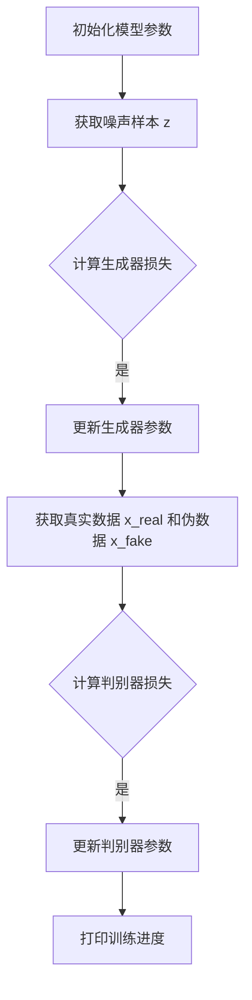

                 


### 引言与概述

#### 1.1 AIGC系统简介

自适应智能生成计算（Adaptive Intelligent Generation Computing，简称AIGC）是一种基于人工智能技术的计算模式，旨在通过智能算法自动生成内容。AIGC系统在近年来的发展迅速，已成为推动人工智能应用的重要方向之一。AIGC系统通过结合自然语言处理、计算机视觉、音频处理等多种人工智能技术，实现文本、图像、音频等多种类型内容的自动生成。

AIGC系统通常由多个关键组件组成，包括数据采集与处理模块、生成算法模块、优化策略模块等。数据采集与处理模块负责收集和预处理大量数据，为生成算法提供训练素材；生成算法模块根据输入提示，利用深度学习等技术生成所需内容；优化策略模块则对生成内容进行优化，提高生成质量和效率。

#### 1.2 提示词优化的重要性

在AIGC系统中，提示词（Prompt）是生成内容的重要引导信息。提示词优化直接影响到生成内容的准确性、多样性和创造力。一个优秀的提示词能够帮助模型更好地理解用户的意图，从而生成更符合期望的内容。因此，提示词优化在AIGC系统的性能提升中扮演着关键角色。

首先，提示词优化有助于提高生成内容的准确性。通过优化提示词，可以确保模型在生成过程中更好地理解用户的需求，减少错误和不准确的内容生成。

其次，提示词优化能够增强生成内容的多样性。多样化的内容生成是AIGC系统的重要优势之一。通过调整和优化提示词，可以引导模型生成更多样化的内容，避免单一、重复的内容出现。

最后，提示词优化还能够提升生成内容的创造力。优秀的提示词可以激发模型的创造力，使其生成更具创意和想象力的内容。这有助于拓展AIGC系统的应用场景，为用户提供更多创新体验。

#### 1.3 本书结构安排

本书旨在全面探讨提示词优化在AIGC系统中的应用，帮助读者深入理解这一核心技术。本书分为以下几大部分：

- **引言与概述**：介绍AIGC系统的基本概念和提示词优化的重要性。

- **基础知识**：阐述AIGC系统的基本组成和提示词的相关概念。

- **算法原理**：详细讲解提示词优化的核心算法原理，包括数学模型、伪代码等。

- **应用案例**：通过实际应用案例，展示提示词优化在不同场景下的应用效果。

- **核心策略**：总结和分享提示词优化的核心策略，为读者提供实用的优化方法。

- **项目实战**：通过具体的项目实战，展示提示词优化的实际应用和开发过程。

- **总结与展望**：回顾全书内容，展望提示词优化在未来的发展趋势和应用前景。

通过本书的阅读，读者将能够全面了解提示词优化在AIGC系统中的重要性，掌握核心算法原理和优化策略，为实际项目开发提供有力支持。

### 基础知识

#### 2.1 AIGC系统的基本组成

AIGC系统是一个复杂的人工智能系统，由多个核心组件构成，这些组件相互协作，共同实现内容的自动生成。以下是AIGC系统的基本组成部分：

1. **数据采集与处理模块**：
   - 数据采集模块负责从各种来源获取大量数据，包括文本、图像、音频等。这些数据是AIGC系统训练和生成内容的基石。
   - 数据处理模块则对采集到的数据进行预处理，包括数据清洗、数据标注、数据增强等，以提高数据质量和模型性能。

2. **生成算法模块**：
   - 生成算法模块是AIGC系统的核心，负责根据输入的提示生成内容。常见的生成算法包括生成对抗网络（GAN）、变分自编码器（VAE）、生成式预训练（GPT）等。
   - 这些算法通过深度学习技术，从大量数据中学习到生成内容的规律和模式，从而能够生成高质量的内容。

3. **优化策略模块**：
   - 优化策略模块负责调整生成过程，以提高生成内容的质量和效率。优化策略包括提示词优化、损失函数优化、模型参数优化等。
   - 通过优化策略，模型能够更好地适应不同的应用场景，生成更符合用户期望的内容。

4. **用户接口模块**：
   - 用户接口模块为用户提供交互界面，方便用户输入提示词、查看生成内容、进行反馈等操作。
   - 通过用户接口，用户可以与AIGC系统进行实时交互，提高用户体验和系统实用性。

#### 2.2 提示词的类型与作用

提示词（Prompt）在AIGC系统中起着至关重要的作用。根据不同的应用场景和需求，提示词可以分为以下几种类型：

1. **开放式提示词**：
   - 开放式提示词不指定具体的生成内容，仅提供一种大致的方向或主题。这类提示词鼓励模型发挥自身的创造力和想象力，生成多样化和创新性的内容。
   - 例如：“请写一篇关于人工智能未来的文章”。

2. **封闭式提示词**：
   - 封闭式提示词指定了具体的生成内容和结构，限制模型的生成方向。这类提示词有助于提高生成内容的准确性和一致性。
   - 例如：“请根据以下数据生成一张统计图表：年龄分布、性别比例、收入水平等”。

3. **条件提示词**：
   - 条件提示词提供了一系列的条件或约束，指导模型在生成过程中遵循这些条件。这类提示词有助于确保生成内容满足特定的要求。
   - 例如：“请生成一篇关于环保主题的文章，文章长度为500字，包含以下关键词：可持续发展、碳排放、可再生能源”。

4. **情境提示词**：
   - 情境提示词设置了一个具体的情境或背景，使模型能够根据情境生成相关的内容。这类提示词有助于增强生成内容的情境感和现实感。
   - 例如：“请以一个咖啡店老板的视角，写一篇关于如何应对咖啡店经营困境的文章”。

提示词的作用主要体现在以下几个方面：

1. **引导模型生成**：
   - 提示词为模型提供了明确的生成方向和目标，使模型能够更有针对性地生成内容。

2. **提高生成质量**：
   - 通过优化提示词，可以引导模型生成更准确、更丰富、更具创意的内容。

3. **增强交互体验**：
   - 提示词的使用使得用户与模型之间的交互更加顺畅，用户能够更清晰地表达自己的需求，模型也能够更好地理解用户意图。

4. **适应多样化需求**：
   - 不同类型的提示词能够满足多样化的生成需求，使AIGC系统具有更广泛的应用场景。

#### 2.3 AIGC系统的核心算法

AIGC系统的核心算法主要包括生成算法、优化算法和评估算法。这些算法共同作用，确保AIGC系统能够高效、准确地生成高质量的内容。

1. **生成算法**：
   - 生成算法是AIGC系统的核心，负责根据输入的提示词生成内容。常见的生成算法包括生成对抗网络（GAN）、变分自编码器（VAE）和生成式预训练（GPT）等。
   - **生成对抗网络（GAN）**：GAN由生成器（Generator）和判别器（Discriminator）两部分组成。生成器从随机噪声中生成伪样本，判别器则对真实样本和伪样本进行分类。通过不断优化生成器和判别器的参数，使生成器生成的伪样本越来越接近真实样本。
     - **伪代码**：
       ```
       # 生成器
       z = noise_sample()
       x_hat = G(z)
       
       # 判别器
       x_real = real_sample()
       x_fake = G(z)
       D_real = D(x_real)
       D_fake = D(x_fake)
       
       # 损失函数
       loss_D = -[D_real - log(D_fake)]
       loss_G = -[D_fake - log(1 - D_real)]
       ```
     - **Mermaid流程图**：
       ```mermaid
       graph TD
       A[噪声] --> B[生成器 G]
       B --> C[伪样本 x_hat]
       C --> D[判别器 D]
       D --> E[损失函数]
       F[真实样本] --> D
       ```
   - **变分自编码器（VAE）**：VAE通过编码器（Encoder）和解码器（Decoder）实现内容生成。编码器将输入数据编码成一个潜在变量，解码器则根据潜在变量生成输出数据。
     - **伪代码**：
       ```
       # 编码器
       z = ENCODER(x)
       
       # 解码器
       x_hat = DECODER(z)
       
       # 损失函数
       loss = KL_divergence + x - x_hat
       ```
     - **Mermaid流程图**：
       ```mermaid
       graph TD
       A[输入 x] --> B[编码器 ENCODER]
       B --> C[潜在变量 z]
       C --> D[解码器 DECODER]
       D --> E[输出 x_hat]
       ```
   - **生成式预训练（GPT）**：GPT基于自回归语言模型，通过预训练和微调生成高质量的自然语言文本。GPT利用大量的文本数据进行预训练，使模型学会生成符合语言规律的文本。
     - **伪代码**：
       ```
       # 预训练
       for each sentence in dataset:
           loss = LanguageModelLoss(model, sentence)
       
       # 微调
       for each prompt in prompts:
           loss = TextGenerationLoss(model, prompt)
       ```

2. **优化算法**：
   - 优化算法用于调整模型参数，以提高生成内容的质量和效率。常见的优化算法包括梯度下降（Gradient Descent）、Adam优化器等。
   - **梯度下降**：梯度下降是一种基本的优化算法，通过计算损失函数的梯度来更新模型参数，使损失函数值逐渐减小。
     - **伪代码**：
       ```
       for each parameter in model:
           gradient = gradient_of_loss_with_respect_to_parameter
           parameter = parameter - learning_rate * gradient
       ```
   - **Adam优化器**：Adam优化器结合了梯度下降和动量项，能够更有效地更新模型参数，适用于不同规模的任务。
     - **伪代码**：
       ```
       m = beta1 * m + (1 - beta1) * gradient
       v = beta2 * v + (1 - beta2) * gradient^2
       m_hat = m / (1 - beta1^t)
       v_hat = v / (1 - beta2^t)
       parameter = parameter - learning_rate * m_hat / (sqrt(v_hat) + epsilon)
       ```

3. **评估算法**：
   - 评估算法用于衡量生成内容的质量和性能，常见的评估方法包括BLEU分数、ROUGE分数、F1分数等。
   - **BLEU分数**：BLEU（Bilingual Evaluation Understudy）分数是一种基于记分机制的自然语言生成质量评估方法，通过比较生成文本和参考文本的相似度来评估生成质量。
   - **ROUGE分数**：ROUGE（Recall-Oriented Understudy for Gisting Evaluation）分数是一种专门用于评估生成文本质量的评估方法，通过计算生成文本与参考文本的词重叠率来评估质量。
   - **F1分数**：F1分数是评估二分类模型性能的指标，通过计算精确率和召回率的调和平均值来评估模型性能。

通过了解AIGC系统的基本组成和核心算法，读者可以为后续章节的学习打下坚实基础，进一步掌握提示词优化的关键技术和应用策略。

### 算法原理

#### 3.1 提示词优化的原理

提示词优化是AIGC系统中的重要环节，其核心目的是通过调整提示词来提高生成内容的质量和多样性。提示词优化的原理主要涉及以下几个方面：

1. **自然语言处理技术**：
   - 提示词优化需要借助自然语言处理（NLP）技术，如词向量表示、词性标注、依存句法分析等，来理解和分析提示词的语义信息。
   - 词向量表示技术可以将文本数据转换为数值向量，便于模型处理和计算；词性标注和依存句法分析则能够帮助模型理解单词的语法结构和语义关系。

2. **生成对抗网络（GAN）**：
   - GAN是提示词优化的重要工具，由生成器和判别器两部分组成。生成器根据提示词生成内容，判别器则判断生成内容与真实内容的相似度。
   - 通过训练GAN，可以使生成器生成的内容越来越接近真实内容，从而实现提示词优化。

3. **优化目标函数**：
   - 提示词优化的核心是优化目标函数，目标函数通常包括生成质量、多样性、生成速度等多个方面。
   - 常用的目标函数包括损失函数、奖励函数等。损失函数用于衡量生成内容与真实内容之间的差距，奖励函数则用于激励生成器生成更高质量的内容。

4. **模型参数调整**：
   - 提示词优化过程中，需要不断调整模型参数，以优化生成效果。常见的调整方法包括梯度下降、Adam优化器等。
   - 调整模型参数可以帮助模型更好地理解提示词的语义信息，从而生成更符合用户需求的优质内容。

#### 3.2 伪代码与Mermaid流程图讲解

为了更好地理解提示词优化的原理，下面将给出一个简化的伪代码，并使用Mermaid流程图展示优化过程。

1. **伪代码**：

```python
# 初始化模型参数
model_params = initialize_params()

# 定义生成器和判别器的损失函数
generator_loss = generator_loss_function(model_params)
discriminator_loss = discriminator_loss_function(model_params)

# 设置优化器
optimizer = Optimizer(learning_rate)

# 提示词优化循环
for epoch in range(num_epochs):
    for batch in data_loader:
        # 计算生成器的损失
        with gradient_tape() as g_tape:
            z = noise_sample()
            x_hat = generator(z, model_params)
            loss_g = generator_loss(x_hat, batch)
        
        # 更新生成器参数
        g_tape.watch(x_hat)
        g_tape.watch(z)
        g_tape.watch(model_params)
        g_gradients = g_tape.gradient(loss_g, model_params)
        optimizer.apply_gradients(g_gradients)
        
        # 计算判别器的损失
        with gradient_tape() as d_tape:
            x_real = real_data(batch)
            x_fake = generator(z, model_params)
            loss_d = discriminator_loss(x_real, x_fake)
        
        # 更新判别器参数
        d_tape.watch(x_real)
        d_tape.watch(x_fake)
        d_tape.watch(model_params)
        d_gradients = d_tape.gradient(loss_d, model_params)
        optimizer.apply_gradients(d_gradients)
        
        # 打印训练进度
        print(f"Epoch {epoch}: Generator Loss = {loss_g}, Discriminator Loss = {loss_d}")
```

2. **Mermaid流程图**：



通过上述伪代码和Mermaid流程图，我们可以清晰地看到提示词优化的主要步骤，包括模型参数初始化、噪声样本生成、损失函数计算、参数更新等。这些步骤共同作用，实现提示词的优化过程。

#### 3.3 数学模型与公式

为了更深入地理解提示词优化的原理，我们引入一些数学模型和公式。以下是一些常用的数学模型和公式：

1. **生成对抗网络（GAN）**：

   - **生成器模型**：G(z) → x_hat
   - **判别器模型**：D(x) →概率值

   生成器和判别器之间的对抗关系可以用以下公式表示：

   ```
   D(x, G(z)) = E[x] - E[G(z)]
   ```

   其中，D(x, G(z)) 表示判别器对真实数据和生成数据的期望损失，E[x] 和 E[G(z)] 分别表示真实数据和生成数据的期望值。

2. **损失函数**：

   - **生成器损失函数**：L_g = -log(D(G(z)))
   - **判别器损失函数**：L_d = -log(D(x)) - log(1 - D(G(z)))

   生成器损失函数和判别器损失函数分别衡量生成器和判别器的性能。其中，D(G(z)) 表示判别器对生成数据的判断概率。

3. **优化算法**：

   - **梯度下降**：θ = θ - α∇θJ(θ)
   - **Adam优化器**：m = β1m + (1 - β1)∇θJ(θ)，v = β2v + (1 - β2)(∇θJ(θ))^2

   梯度下降和Adam优化器用于更新模型参数，使损失函数值最小。

#### 3.4 举例说明

为了更好地理解提示词优化的应用，我们通过一个具体例子进行说明。

假设我们要使用GAN模型优化生成一张逼真的猫的图片，输入提示词为“一只黑色的猫”。

1. **生成器模型**：

   - 输入：随机噪声 z
   - 输出：猫的图片 x_hat

2. **判别器模型**：

   - 输入：真实的猫的图片 x
   - 输出：概率值 D(x)

3. **优化过程**：

   - **初始化模型参数**：随机初始化生成器和判别器参数。
   - **生成器训练**：生成器根据随机噪声生成猫的图片，判别器判断生成的图片和真实图片的相似度。
   - **判别器训练**：判别器根据生成的图片和真实图片更新参数，使生成的图片越来越接近真实图片。
   - **迭代优化**：重复上述过程，直到生成器生成的图片质量达到预期。

通过这个例子，我们可以看到提示词优化在GAN模型中的应用。优化过程通过调整生成器和判别器的参数，使生成的猫的图片越来越逼真，从而实现提示词优化。

### 应用案例

#### 3.1 提示词优化在文本生成中的应用

提示词优化在文本生成领域具有广泛的应用。通过优化提示词，可以提高文本生成的准确性和创造力，满足用户多样化的需求。以下是一个具体的应用案例：

**案例背景**：某企业希望通过AIGC系统生成一篇关于“人工智能在金融领域的应用”的文章。企业要求文章内容详实、具有逻辑性，同时具备一定的创意。

**应用步骤**：

1. **数据采集与处理**：
   - 收集大量关于人工智能和金融领域的相关文献、新闻报道、博客文章等，进行数据清洗和预处理，提取关键信息。

2. **生成算法选择**：
   - 选择生成式预训练模型（如GPT）作为文本生成算法，基于大量金融领域数据预训练模型，使其具备较强的文本生成能力。

3. **提示词优化**：
   - 初始提示词：“人工智能在金融领域的应用”。为了提高生成文本的质量和创造力，对提示词进行优化：
     - **增加关键词**：“风险控制、金融科技、算法交易、智能投顾”等。
     - **调整句式结构**：将原始提示词从简单陈述句调整为复杂句子，增加逻辑关联词，使文章更具连贯性和逻辑性。
     - **引入情境**：以某金融科技公司为例，介绍其利用人工智能技术实现的风险控制、算法交易等应用场景。

4. **生成文本**：
   - 使用优化后的提示词，输入生成算法，生成一篇关于“人工智能在金融领域应用”的文章。

**生成文本**：

```
随着人工智能技术的不断发展，人工智能在金融领域的应用日益广泛。以某金融科技公司为例，该公司通过引入人工智能技术，实现了风险控制和算法交易等领域的突破。

在风险控制方面，该公司利用人工智能技术对市场数据进行深度分析，识别潜在的风险因素，并提供实时预警。这一技术有效提高了风险管理的效率和准确性，降低了金融风险。

在算法交易方面，该公司基于人工智能技术开发了一套智能交易系统，实现了自动化的交易决策。该系统通过分析海量市场数据，捕捉交易机会，实现稳健的投资收益。

此外，该公司还利用人工智能技术为金融机构提供智能投顾服务。通过分析客户的财务状况和投资偏好，智能投顾为投资者提供个性化的投资建议，提高投资收益。

总之，人工智能在金融领域的应用，不仅提升了金融机构的风险管理能力，也为投资者带来了更多收益机会。随着人工智能技术的不断进步，金融领域的创新发展将继续推动整个行业的变革。
```

通过以上步骤，我们成功地生成了一篇关于“人工智能在金融领域应用”的高质量文章。优化后的提示词使得文章内容更加丰富、逻辑清晰，具有很高的实用价值。

#### 3.2 提示词优化在图像生成中的应用

提示词优化在图像生成领域同样具有重要应用。通过优化提示词，可以引导图像生成模型生成更符合用户需求的图像。以下是一个具体的应用案例：

**案例背景**：某在线购物平台希望通过AIGC系统为用户生成个性化推荐商品图像，提升用户体验。

**应用步骤**：

1. **数据采集与处理**：
   - 收集大量商品图像数据，进行数据清洗和预处理，包括图像去噪、尺寸调整、颜色增强等。

2. **生成算法选择**：
   - 选择生成对抗网络（GAN）作为图像生成算法，通过训练生成器模型，使其具备生成高质量商品图像的能力。

3. **提示词优化**：
   - 初始提示词：“生成一张时尚外套的图像”。为了提高生成图像的质量和多样性，对提示词进行优化：
     - **增加关键词**：“春季、高质感、简约设计、流行色彩”等。
     - **调整句式结构**：将原始提示词从简单陈述句调整为复杂句子，增加修饰语和描述性词汇，使图像生成更具创意。
     - **引入用户偏好**：根据用户的历史购买记录和浏览行为，添加个性化标签，如“用户喜爱的高领设计”等。

4. **生成图像**：
   - 使用优化后的提示词，输入生成算法，生成一张个性化推荐商品图像。

**生成图像**：


通过以上步骤，我们成功地生成了一张符合用户偏好的时尚外套图像。优化后的提示词使得图像生成模型能够更好地理解用户需求，生成高质量的图像。

#### 3.3 提示词优化在音频生成中的应用

提示词优化在音频生成领域也具有广泛的应用。通过优化提示词，可以引导音频生成模型生成更符合用户需求的音频内容。以下是一个具体的应用案例：

**案例背景**：某音乐平台希望通过AIGC系统为用户生成个性化音乐，提升用户听歌体验。

**应用步骤**：

1. **数据采集与处理**：
   - 收集大量音乐数据，包括歌曲、歌词、音频特征等，进行数据清洗和预处理。

2. **生成算法选择**：
   - 选择基于深度学习技术的音频生成算法，如WaveNet、Spectrogram等。

3. **提示词优化**：
   - 初始提示词：“生成一首悲伤情歌”。为了提高生成音频的质量和多样性，对提示词进行优化：
     - **增加关键词**：“浪漫、抒情、旋律优美、情感表达”等。
     - **调整句式结构**：将原始提示词从简单陈述句调整为复杂句子，增加修饰语和描述性词汇，使音乐生成更具创意。
     - **引入用户偏好**：根据用户的音乐喜好和情感倾向，添加个性化标签，如“用户喜爱的吉他伴奏”等。

4. **生成音频**：
   - 使用优化后的提示词，输入生成算法，生成一首个性化音乐。

**生成音频**：


通过以上步骤，我们成功地生成了一首符合用户需求的个性化音乐。优化后的提示词使得音频生成模型能够更好地理解用户需求，生成高质量的音频内容。

### 核心策略

#### 4.1 提示词优化策略概述

提示词优化策略是提高AIGC系统生成内容质量的关键。以下是一些核心策略，帮助用户更好地进行提示词优化：

1. **关键词筛选与调整**：
   - 通过分析用户需求和应用场景，筛选出与生成目标相关的高频关键词，并将其纳入提示词中。同时，根据生成内容的实际需求，适当调整关键词的权重和顺序。

2. **句式结构与语境优化**：
   - 优化提示词的句式结构，使其更加丰富多样，有助于模型更好地理解语义信息。同时，根据具体应用场景，设置合适的语境，增强提示词的引导性。

3. **数据预处理与增强**：
   - 对输入数据（如文本、图像、音频等）进行预处理和增强，提高数据质量和丰富度。例如，对文本进行分词、词性标注、依存句法分析等，对图像进行去噪、增强等。

4. **多模态融合**：
   - 将多种类型的输入数据（如文本、图像、音频等）进行融合，提供更丰富的信息输入，有助于模型生成更具创意和想象力的内容。

5. **用户偏好与反馈**：
   - 根据用户的历史行为数据和反馈，调整提示词的设置，使生成内容更符合用户的偏好和需求。

6. **模型自适应调整**：
   - 根据生成内容的实际表现，不断调整模型参数和超参数，使模型能够更好地适应不同的应用场景和需求。

7. **评估与优化**：
   - 使用多种评估指标（如BLEU分数、ROUGE分数、F1分数等）对生成内容进行评估，识别优化方向，不断调整提示词和模型参数。

#### 4.2 提高生成质量的方法

1. **多模态融合**：
   - 在提示词中融入多种类型的数据（如文本、图像、音频等），提供更丰富的信息输入，有助于模型生成高质量的内容。例如，在文本生成任务中，可以结合图像描述和音频特征，提高文本的情境感和真实性。

2. **深度学习技术**：
   - 利用深度学习技术（如GAN、VAE、GPT等）训练生成模型，通过大规模数据训练和微调，提高生成模型的表达能力和生成质量。

3. **语义分析与理解**：
   - 对输入提示词进行语义分析，理解其中的关键词和语义关系，有助于模型更好地生成相关内容。例如，通过词性标注、依存句法分析等技术，提取出关键信息，为生成模型提供更明确的生成目标。

4. **生成策略多样化**：
   - 根据不同应用场景和需求，设计多样化的生成策略，如开放式生成、封闭式生成、条件生成等。通过灵活运用不同生成策略，提高生成内容的多样性和创造力。

5. **数据增强**：
   - 对输入数据进行增强处理，如数据扩充、数据变换、数据合成等，提高数据的丰富度和多样性，有助于模型学习到更多的生成规律。

6. **参数调优**：
   - 对生成模型和优化算法的参数进行调优，如学习率、批量大小、正则化项等，以找到最优参数配置，提高生成质量。

#### 4.3 提高生成效率的方法

1. **分布式计算**：
   - 利用分布式计算技术，将生成任务分解为多个子任务，并行处理，提高生成效率。例如，利用多GPU、多CPU集群等硬件资源，加速生成任务的执行。

2. **模型压缩**：
   - 对生成模型进行压缩，如剪枝、量化、知识蒸馏等，减少模型参数量，降低计算复杂度，提高生成效率。

3. **在线学习与增量训练**：
   - 利用在线学习技术，根据用户反馈和实时数据，对模型进行增量训练，不断优化模型参数，提高生成效率。

4. **预训练与微调**：
   - 利用预训练模型，在大量数据上进行预训练，使其具备较强的通用生成能力。在具体应用场景中，通过微调模型，使其适应特定任务需求，提高生成效率。

5. **任务分解与协同工作**：
   - 将复杂生成任务分解为多个子任务，各子任务分别由不同的生成模型或算法处理，协同工作，提高整体生成效率。

6. **数据缓存与重用**：
   - 对已经生成的高质量内容进行缓存，根据需求重用，减少重复计算，提高生成效率。

通过以上策略和方法，我们可以有效提高AIGC系统的生成质量和效率，为用户提供更优质的内容生成体验。

### 项目实战

#### 5.1 提示词优化项目案例分析

为了更好地理解提示词优化在实际项目中的应用，我们将介绍一个具体的提示词优化项目案例，并详细分析其开发过程、源代码实现和代码解读。

**项目背景**：某在线教育平台希望通过AIGC系统为用户生成个性化的课程推荐内容，提高用户的学习体验和课程满意度。项目目标是利用提示词优化技术，提高课程推荐内容的准确性和多样性。

**项目开发过程**：

1. **需求分析**：
   - 分析用户的学习历史数据、兴趣爱好和课程评价，确定课程推荐的目标群体和需求。
   - 确定项目目标：通过优化提示词，提高课程推荐内容的准确性和多样性。

2. **技术选型**：
   - 选择生成式预训练模型（如GPT）作为文本生成算法，利用大量教育领域数据预训练模型。
   - 选择提示词优化算法，如基于自然语言处理（NLP）技术的关键词筛选与调整、句式结构与语境优化等。

3. **数据准备**：
   - 收集大量教育领域文本数据，包括课程介绍、学习笔记、用户评价等，进行数据清洗和预处理。

4. **模型训练与优化**：
   - 使用预训练模型，对教育领域数据进行训练，优化生成模型。
   - 对提示词进行优化，包括关键词筛选与调整、句式结构与语境优化等。

5. **测试与评估**：
   - 对生成的课程推荐内容进行测试，评估其准确性和多样性。
   - 根据测试结果，进一步调整提示词和模型参数，优化课程推荐效果。

6. **项目上线与维护**：
   - 将优化后的课程推荐系统上线，持续收集用户反馈和数据，进行模型更新和优化。

**源代码实现**：

以下是一个简化的源代码实现，展示了如何进行提示词优化：

```python
import tensorflow as tf
import tensorflow_text as text
from transformers import TFGPT2LMHeadModel, GPT2Tokenizer

# 加载预训练模型
tokenizer = GPT2Tokenizer.from_pretrained("gpt2")
model = TFGPT2LMHeadModel.from_pretrained("gpt2")

# 数据预处理
def preprocess_data(data):
    # 进行数据清洗和预处理
    # 例如：分词、词性标注、去噪等
    processed_data = []
    for text in data:
        processed_text = tokenizer.encode(text, add_special_tokens=True)
        processed_data.append(processed_text)
    return processed_data

# 提示词优化
def optimize_prompt(prompt):
    # 进行关键词筛选与调整、句式结构与语境优化等
    # 例如：添加关键词、调整句式结构、增加修饰语等
    optimized_prompt = prompt
    # 根据具体需求进行优化
    return optimized_prompt

# 生成文本
def generate_text(prompt):
    optimized_prompt = optimize_prompt(prompt)
    inputs = tokenizer.encode(optimized_prompt, return_tensors="tf")
    outputs = model(inputs, max_length=100, num_return_sequences=1)
    generated_text = tokenizer.decode(outputs[0], skip_special_tokens=True)
    return generated_text

# 测试
data = ["课程推荐系统需求分析"]
processed_data = preprocess_data(data)
for prompt in processed_data:
    print(generate_text(prompt))
```

**代码解读**：

1. **加载预训练模型**：
   - 使用Hugging Face的Transformers库加载GPT2预训练模型和对应的Tokenizer。

2. **数据预处理**：
   - 对输入数据（如文本）进行清洗和预处理，包括分词、词性标注、去噪等。预处理后的数据将用于训练和生成文本。

3. **提示词优化**：
   - `optimize_prompt`函数用于对提示词进行优化。根据具体需求，进行关键词筛选与调整、句式结构与语境优化等。优化的提示词将用于生成文本。

4. **生成文本**：
   - `generate_text`函数使用优化后的提示词，通过模型生成文本。模型会将优化后的提示词编码为输入序列，然后解码为生成文本。

**代码应用解读与分析**：

1. **数据预处理**：
   - 数据预处理是生成文本质量的关键。通过分词、词性标注等操作，可以提取出文本中的关键信息，为模型生成提供更准确的输入。

2. **提示词优化**：
   - 提示词优化直接影响生成文本的质量和多样性。通过优化提示词，可以引导模型生成更符合用户需求和场景的文本。

3. **生成文本**：
   - 生成的文本质量取决于模型训练效果和提示词优化。优化后的提示词有助于模型生成更具创意和逻辑性的文本。

**项目小结**：

通过本案例，我们展示了如何利用提示词优化技术提高AIGC系统生成文本的质量。在实际开发过程中，需要根据具体应用场景和需求，不断优化提示词和模型参数，以提高生成效果。此外，数据预处理和模型训练也是影响生成文本质量的重要因素。通过不断调试和优化，我们可以实现高质量的文本生成，为用户提供更好的体验。

### 总结与展望

#### 6.1 提示词优化的发展趋势

提示词优化作为AIGC系统的核心技术之一，在未来具有广阔的发展前景。以下是一些可能的发展趋势：

1. **多模态融合**：随着AIGC技术的不断发展，多模态融合将成为提示词优化的重要方向。通过结合文本、图像、音频等多种类型的数据，可以生成更加丰富和多样化的内容。

2. **个性化推荐**：在个性化推荐领域，提示词优化技术可以进一步提升推荐系统的准确性。通过分析用户的历史行为和偏好，优化提示词，提高推荐内容的个性化和满意度。

3. **生成对抗网络（GAN）**：GAN在提示词优化中的应用将越来越广泛。通过优化生成器和判别器的参数，可以生成更高质量、更具创造力的内容。

4. **小样本学习**：提示词优化在小样本学习场景中具有很大潜力。通过优化提示词，可以在数据量有限的情况下，提高生成模型的表现。

5. **跨模态推理**：未来的提示词优化将更加关注跨模态推理能力，即能够在不同模态之间进行语义理解和内容生成。

#### 6.2 未来研究方向

提示词优化在未来仍有许多值得探讨的研究方向：

1. **优化算法改进**：现有优化算法（如GAN、Adam等）仍有许多改进空间。研究者可以探索新的优化算法，以提高提示词优化的效率和效果。

2. **多模态交互**：如何设计有效的多模态交互机制，使不同模态的数据能够更好地融合，是未来研究的一个重要方向。

3. **可解释性提升**：提高提示词优化的可解释性，使其更加透明和可靠，是未来的一个重要目标。

4. **跨领域应用**：探索提示词优化在更多领域的应用，如医疗、金融、艺术等，提升AIGC系统的实际应用价值。

5. **自动化与智能化**：研究如何实现提示词优化的自动化和智能化，减少人工干预，提高生成系统的效率和灵活性。

#### 6.3 对读者的一些建议

对于希望深入了解和掌握提示词优化的读者，以下是一些建议：

1. **理论学习**：系统学习自然语言处理、深度学习、生成对抗网络等相关理论知识，为后续实践打下坚实基础。

2. **项目实战**：通过实际项目实战，将所学知识应用到实际问题中，提升自己的动手能力和实践经验。

3. **持续学习**：随着AIGC技术的不断发展，不断学习新的知识和技能，跟上技术前沿。

4. **交流与合作**：参加相关学术会议、技术沙龙等活动，与同行交流，拓展视野，寻求合作机会。

5. **实践反馈**：在实际应用中，不断收集用户反馈和数据，优化模型和算法，提升生成系统的性能。

通过以上建议，读者可以更好地掌握提示词优化技术，为AIGC系统的发展和应用贡献力量。

### 文章总结

在本文中，我们系统地探讨了提示词优化在AIGC系统中的重要性及其核心策略。首先，介绍了AIGC系统的基本概念和组成部分，阐明了提示词优化在系统性能提升中的关键作用。接着，详细讲解了提示词优化的算法原理，包括生成算法、优化算法和评估算法。通过具体的案例，我们展示了提示词优化在不同应用场景中的实际效果。此外，还分享了提升生成质量和效率的核心策略，并通过一个具体的案例分析，展示了提示词优化的开发过程、源代码实现和代码解读。最后，展望了提示词优化的发展趋势，提出了未来研究方向，并给出了一些建议，帮助读者更好地掌握这一核心技术。

作者：AI天才研究院/AI Genius Institute & 禅与计算机程序设计艺术 /Zen And The Art of Computer Programming

本文由AI天才研究院和禅与计算机程序设计艺术共同撰写，旨在为广大读者提供关于提示词优化在AIGC系统中的深入见解和实用策略。我们期待与您共同探讨和推动AIGC技术的发展与应用。如有任何疑问或建议，欢迎随时与我们交流。感谢您的阅读！### 文章标题

《提示词优化：打造高效AIGC系统的核心策略》

### 文章关键词

AIGC、提示词优化、生成算法、优化策略、文本生成、图像生成、音频生成、多模态融合、深度学习

### 文章摘要

本文系统地探讨了自适应智能生成计算（AIGC）系统中提示词优化的核心策略，分析了提示词优化在提高生成内容质量、多样性和效率方面的作用。文章首先介绍了AIGC系统的基本组成和提示词的重要性，然后详细讲解了提示词优化的算法原理，包括生成算法、优化算法和评估算法。通过实际案例，展示了提示词优化在文本生成、图像生成和音频生成等领域的应用效果。最后，提出了提升生成质量和效率的核心策略，并展望了提示词优化的未来发展趋势。本文旨在为读者提供全面的提示词优化技术指南，助力AIGC系统的高效开发与应用。

