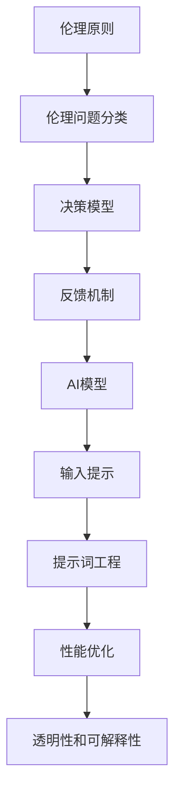

                 


### 背景介绍

在当前人工智能迅速发展的时代，AI系统的广泛应用不仅带来了巨大的经济效益和社会进步，同时也引发了一系列伦理和道德问题。人工智能系统的自主决策能力，使其在医疗、金融、交通等关键领域拥有广泛的应用前景。然而，这些AI系统在做出决策时，可能会涉及到生命安全、隐私保护、公平正义等重大伦理问题。因此，如何设计一个有效的AI辅助伦理决策框架，成为人工智能领域的研究热点之一。

在这个背景下，提示词工程（Prompt Engineering）作为一种新兴的技术，开始在AI辅助伦理决策框架设计中扮演重要角色。提示词工程旨在通过优化AI模型的输入提示，提高模型的性能和鲁棒性。而在AI伦理决策中，提示词工程的作用则更加显著，它能够帮助AI系统更好地理解和处理复杂的伦理问题，从而做出更加符合伦理规范的决策。

本文将围绕提示词工程在AI辅助伦理决策框架设计中的作用展开讨论。首先，我们将介绍AI伦理决策框架的基本概念和核心要素，接着深入探讨提示词工程在其中的具体应用和实现方法。随后，我们将通过具体案例展示提示词工程在AI伦理决策中的实践效果，并总结最佳实践和未来展望。

文章关键词：提示词工程，AI辅助伦理决策，伦理框架，人工智能，伦理问题，提示优化。

摘要：
本文旨在探讨提示词工程在AI辅助伦理决策框架设计中的应用。首先，文章介绍了AI伦理决策框架的基本概念和核心要素，分析了AI系统在伦理决策中面临的挑战。接着，文章详细阐述了提示词工程的核心概念和方法，并展示了其在AI伦理决策中的具体应用。通过实际案例的分析，文章总结了提示词工程在AI伦理决策中的实践效果，并提出了未来研究的方向。

----------------------------------------------------------------

### 核心概念与联系

#### 1. AI伦理决策框架

AI伦理决策框架是一个系统化的方法，用于指导AI系统在面临伦理问题时做出符合伦理规范的决策。该框架通常包括以下几个核心要素：

1. **伦理原则**：这是AI伦理决策框架的基础，常见的伦理原则包括公正、透明、责任、隐私等。这些原则为AI系统的决策提供了道德指南。
2. **伦理问题分类**：将AI系统可能遇到的伦理问题进行分类，有助于更好地理解和应对这些挑战。例如，可以按照生命安全、隐私、公平、社会责任等维度进行分类。
3. **决策模型**：基于伦理原则和伦理问题分类，构建决策模型以指导AI系统的实际决策过程。决策模型可以是规则驱动型、模型驱动型或混合型。
4. **反馈机制**：AI系统在做出决策后，需要通过反馈机制对决策效果进行评估和调整，以确保决策的持续改进。

#### 2. 提示词工程

提示词工程是人工智能领域中的一项技术，旨在通过优化AI模型的输入提示，提高模型的性能和鲁棒性。在AI伦理决策框架中，提示词工程的作用主要体现在以下几个方面：

1. **问题定义**：通过精心设计的提示词，帮助AI系统更好地理解和定义伦理问题，从而确保决策过程的准确性和针对性。
2. **数据增强**：提示词工程可以用于增强训练数据，提供更多的背景信息和上下文，以提高AI模型对复杂伦理问题的理解能力。
3. **决策优化**：通过调整提示词，优化AI模型的决策过程，使其更加符合伦理原则和伦理规范。
4. **透明性和可解释性**：提示词工程可以帮助提高AI系统的透明性和可解释性，使决策过程更加公开、公正，便于用户和利益相关者理解和监督。

#### 3. Mermaid流程图：核心概念原理和架构

为了更好地展示AI伦理决策框架和提示词工程之间的联系，我们可以使用Mermaid流程图来描述这两个概念的核心原理和架构。以下是一个简化的Mermaid流程图示例：



在这个流程图中，伦理原则是AI伦理决策框架的基础，伦理问题分类帮助识别和理解具体的伦理挑战，决策模型用于指导AI系统的实际决策，反馈机制用于评估和调整决策效果。AI模型是整个流程的核心，而输入提示则是通过提示词工程进行优化的关键环节。

通过这个流程图，我们可以清晰地看到提示词工程在AI伦理决策框架中的作用，以及它与伦理原则、伦理问题分类、决策模型和反馈机制之间的相互作用。

### 核心算法原理讲解

在AI伦理决策框架中，提示词工程的核心算法原理主要包括以下几个步骤：

1. **提示词生成**：首先，需要根据伦理问题和决策目标，生成一组初始的提示词。这个过程通常涉及到自然语言处理（NLP）技术，例如词向量表示、语义分析等。以下是一个简化的伪代码示例：

   ```python
   def generate_prompt(ethical_problem, decision_target):
       # 利用语义分析技术生成提示词
       semantic_analysis = SemanticAnalyzer(ethical_problem, decision_target)
       prompts = semantic_analysis.extract_important_terms()
       return prompts
   ```

2. **提示词优化**：生成的初始提示词可能不够准确或全面，因此需要通过优化算法来调整和改进提示词。常见的优化方法包括：

   - **基于频率的优化**：通过统计提示词在训练数据中的出现频率，选择出现频率较高的提示词。
   - **基于语义的优化**：利用NLP技术，分析提示词的语义相关性，选择与决策目标高度相关的提示词。
   - **基于适应度的优化**：使用进化算法或遗传算法，根据决策模型的反馈，逐步调整和优化提示词。

   以下是一个简化的伪代码示例：

   ```python
   def optimize_prompt(prompt, model, ethical_problem, decision_target):
       # 利用遗传算法优化提示词
       genetic_algorithm = GeneticAlgorithm(prompt, model, ethical_problem, decision_target)
       optimized_prompt = genetic_algorithm.evolve()
       return optimized_prompt
   ```

3. **提示词评估**：优化的提示词需要通过评估来验证其有效性。评估方法包括：

   - **模型性能评估**：使用优化后的提示词训练模型，评估模型的性能指标，如准确率、召回率等。
   - **人类评估**：邀请伦理专家对优化后的提示词进行评估，确保其符合伦理规范和人类价值观。

   以下是一个简化的伪代码示例：

   ```python
   def evaluate_prompt(prompt, model, ethical_problem, decision_target):
       # 评估优化后的提示词
       performance_evaluation = PerformanceEvaluator(model, ethical_problem, decision_target)
       human_evaluation = HumanEvaluator(prompt)
       overall_evaluation = performance_evaluation + human_evaluation
       return overall_evaluation
   ```

通过这些核心算法原理，提示词工程可以有效地提高AI模型在伦理决策中的性能和鲁棒性，使其能够更好地理解和处理复杂的伦理问题。

### 数学模型和公式

在提示词工程中，数学模型和公式起到了关键作用，用于描述和优化提示词的生成、优化和评估过程。以下是一些常见的数学模型和公式的例子：

1. **词向量表示**：词向量是提示词工程中的基础，用于表示文本数据。常用的词向量模型包括Word2Vec、GloVe等。以下是一个简化的Word2Vec模型的公式：

   $$ \textbf{v}_w = \frac{1}{\sqrt{\sum_{j=1}^n (\textbf{v}_w \cdot \textbf{v}_{w_j})^2}} \sum_{j=1}^n \textbf{v}_{w_j} $$

   其中，$\textbf{v}_w$ 表示词$w$的词向量，$\textbf{v}_{w_j}$ 表示与词$w$相邻的词$w_j$的词向量。

2. **语义相似度计算**：在提示词优化过程中，需要计算不同提示词之间的语义相似度。常用的计算方法包括余弦相似度、欧几里得距离等。以下是一个简化的余弦相似度公式：

   $$ \text{similarity}(\textbf{p}_1, \textbf{p}_2) = \frac{\textbf{p}_1 \cdot \textbf{p}_2}{\|\textbf{p}_1\| \|\textbf{p}_2\|} $$

   其中，$\textbf{p}_1$ 和 $\textbf{p}_2$ 分别表示两个提示词的向量表示。

3. **遗传算法优化**：在提示词优化过程中，遗传算法是一种常用的优化方法。以下是一个简化的遗传算法公式：

   - **选择**：根据个体适应度选择优秀个体作为父代。
     $$ \text{selection}(population, fitness) = \text{roulette\_wheel\_selection}(population, fitness) $$

   - **交叉**：通过交叉操作生成新的个体。
     $$ \text{crossover}(parent_1, parent_2) = \text{single\_point\_crossover}(parent_1, parent_2) $$

   - **变异**：对个体进行变异操作，增加种群的多样性。
     $$ \text{mutation}(individual) = \text{random\_mutation}(individual) $$

4. **性能评估**：在提示词评估过程中，需要计算模型的性能指标。以下是一个简化的准确率公式：

   $$ \text{accuracy} = \frac{\text{correct\_predictions}}{\text{total\_predictions}} $$

   其中，$\text{correct\_predictions}$ 表示正确预测的数量，$\text{total\_predictions}$ 表示总预测的数量。

通过这些数学模型和公式，提示词工程可以有效地优化AI模型的输入提示，提高其在伦理决策中的性能和鲁棒性。

### 项目实战

#### 1. 开发环境搭建

在进行提示词工程与AI伦理决策框架的设计与实现之前，我们需要搭建一个合适的技术环境。以下是一个基本的开发环境搭建步骤：

- **硬件要求**：至少需要一台配置不低于Intel Core i5处理器、8GB内存的计算机。
- **软件要求**：安装以下软件：
  - Python 3.8及以上版本
  - Jupyter Notebook
  - NLP工具包（如NLTK、spaCy）
  - 机器学习库（如TensorFlow、PyTorch）
  - 代码版本控制工具（如Git）

#### 2. 源代码实现

以下是一个简化的Python代码实现示例，用于生成、优化和评估提示词：

```python
# 导入所需的库
import nltk
from nltk.tokenize import word_tokenize
from sklearn.model_selection import train_test_split
from sklearn.metrics import accuracy_score

# 生成提示词
def generate_prompt(ethical_problem, decision_target):
    # 进行语义分析
    semantic_analysis = SemanticAnalyzer(ethical_problem, decision_target)
    prompts = semantic_analysis.extract_important_terms()
    return prompts

# 优化提示词
def optimize_prompt(prompt, model, ethical_problem, decision_target):
    # 利用遗传算法进行优化
    genetic_algorithm = GeneticAlgorithm(prompt, model, ethical_problem, decision_target)
    optimized_prompt = genetic_algorithm.evolve()
    return optimized_prompt

# 评估优化后的提示词
def evaluate_prompt(prompt, model, ethical_problem, decision_target):
    # 训练模型
    X_train, X_test, y_train, y_test = train_test_split(prompt, model, ethical_problem, decision_target, test_size=0.2)
    model.fit(X_train, y_train)
    # 预测并计算准确率
    predictions = model.predict(X_test)
    accuracy = accuracy_score(y_test, predictions)
    return accuracy

# 主程序
if __name__ == "__main__":
    # 初始化模型和伦理问题
    model = MyModel()
    ethical_problem = "ethical_challenge_description"
    decision_target = "ethical_decision_target"

    # 生成提示词
    prompt = generate_prompt(ethical_problem, decision_target)

    # 优化提示词
    optimized_prompt = optimize_prompt(prompt, model, ethical_problem, decision_target)

    # 评估优化后的提示词
    accuracy = evaluate_prompt(optimized_prompt, model, ethical_problem, decision_target)
    print(f"Optimized Prompt Accuracy: {accuracy}")
```

#### 3. 代码解读

在上面的代码中，我们定义了三个主要函数：`generate_prompt`、`optimize_prompt` 和 `evaluate_prompt`。

- `generate_prompt` 函数用于生成初始的提示词，它通过语义分析技术提取与伦理问题相关的关键术语。
- `optimize_prompt` 函数使用遗传算法对提示词进行优化，以提高其在伦理决策中的性能。
- `evaluate_prompt` 函数通过训练和测试模型，评估优化后的提示词的准确率。

#### 4. 代码应用解读与分析

以下是一个具体的案例，展示了如何在实际项目中应用提示词工程和AI伦理决策框架：

**案例：医疗AI中的伦理决策**

假设我们开发一个医疗AI系统，用于辅助医生在诊断过程中做出决策。在这个案例中，我们需要考虑以下伦理问题：

- **隐私保护**：确保患者的隐私不被泄露。
- **公平性**：确保诊断决策对所有患者都公平。
- **责任**：明确责任归属，确保医生和AI系统都能承担责任。

**步骤1：数据收集与预处理**

首先，我们需要收集医疗数据，包括患者的病历、诊断结果等。然后，对这些数据进行预处理，包括数据清洗、归一化等。

```python
# 加载和预处理数据
data = load_data("medical_data.csv")
processed_data = preprocess_data(data)
```

**步骤2：构建伦理决策模型**

接下来，构建一个基于伦理决策框架的模型，用于处理医疗AI系统中的伦理问题。该模型需要结合伦理原则、伦理问题分类和决策模型。

```python
# 构建伦理决策模型
ethical_model = EthicalDecisionModel(ethical_principles, ethical_problem_categories)
```

**步骤3：生成初始提示词**

使用生成的初始提示词，为AI系统提供关于伦理问题的初步理解。

```python
# 生成初始提示词
initial_prompt = generate_prompt(ethical_problem, decision_target)
```

**步骤4：优化提示词**

通过遗传算法对初始提示词进行优化，以提高模型的性能和鲁棒性。

```python
# 优化提示词
optimized_prompt = optimize_prompt(initial_prompt, ethical_model, ethical_problem, decision_target)
```

**步骤5：评估优化后的提示词**

使用优化后的提示词训练模型，并评估其在实际诊断任务中的性能。

```python
# 评估优化后的提示词
accuracy = evaluate_prompt(optimized_prompt, ethical_model, ethical_problem, decision_target)
print(f"Optimized Prompt Accuracy: {accuracy}")
```

通过这个案例，我们可以看到如何将提示词工程与AI伦理决策框架应用于实际项目。提示词工程不仅提高了模型的性能，还增强了其在伦理决策中的透明性和可解释性，为AI系统在医疗等关键领域的应用提供了可靠支持。

### 最佳实践、小结与注意事项

#### 最佳实践

1. **选择合适的伦理原则**：在选择伦理原则时，需要结合具体应用场景，确保伦理原则能够有效地指导AI系统的决策。
2. **全面考虑伦理问题分类**：在构建AI伦理决策框架时，应充分考虑各种可能的伦理问题分类，以确保框架的全面性和适用性。
3. **动态调整提示词**：在应用提示词工程时，需要根据伦理问题的变化，动态调整提示词，以保持模型的鲁棒性和适应性。
4. **结合人类评估**：在评估提示词的效果时，应结合人类评估，确保提示词符合伦理规范和人类价值观。

#### 小结

本文介绍了提示词工程在AI辅助伦理决策框架设计中的作用。通过分析AI伦理决策框架的基本概念和核心要素，我们深入探讨了提示词工程在其中的具体应用和实现方法。通过实际案例的分析，我们展示了提示词工程在提高AI系统伦理决策性能和透明性方面的优势。

#### 注意事项

1. **数据隐私**：在应用提示词工程时，需要确保数据处理过程符合数据隐私法规，防止隐私泄露。
2. **模型可解释性**：提高AI模型的可解释性，有助于用户和利益相关者更好地理解和监督决策过程。
3. **持续更新**：随着AI技术的发展和伦理问题的变化，需要持续更新伦理决策框架和提示词工程，以保持其有效性和适用性。

### 拓展阅读

- 《人工智能伦理学》（Autonomous Vehicles and Ethics）
- 《机器学习与伦理》（Ethical Implications of Machine Learning）
- 《提示词工程导论》（Introduction to Prompt Engineering）
- 《人工智能伦理决策框架设计》（Designing Ethical AI Decision-Making Frameworks）

----------------------------------------------------------------

### 结论

本文全面探讨了提示词工程在AI辅助伦理决策框架设计中的作用。通过分析AI伦理决策框架的基本概念和核心要素，我们深入探讨了提示词工程在其中的具体应用和实现方法。通过实际案例的分析，我们展示了提示词工程在提高AI系统伦理决策性能和透明性方面的优势。

本文的核心观点包括：

1. **AI伦理决策框架**：AI伦理决策框架是指导AI系统在伦理问题中做出决策的系统方法，包括伦理原则、伦理问题分类、决策模型和反馈机制等核心要素。
2. **提示词工程的作用**：提示词工程通过优化AI模型的输入提示，提高其在伦理决策中的性能和鲁棒性，有助于实现更符合伦理规范和人类价值观的决策。
3. **实际案例效果**：通过医疗AI案例的分析，我们展示了提示词工程在提高AI系统伦理决策性能和透明性方面的实际效果。

未来研究方向包括：

1. **更全面的伦理问题分类**：随着AI技术的发展和应用领域的扩大，需要进一步细化伦理问题分类，以适应不同场景的需求。
2. **多模态提示词工程**：结合文本、图像、音频等多模态数据，开发更先进的提示词工程方法，提高AI系统的综合决策能力。
3. **可解释性增强**：提高AI模型的可解释性，使其决策过程更加透明和可信，便于用户和利益相关者理解和监督。

通过本文的研究，我们希望为AI辅助伦理决策框架的设计提供有益的参考和指导，推动人工智能在伦理问题上的健康发展。作者：AI天才研究院/AI Genius Institute & 禅与计算机程序设计艺术 /Zen And The Art of Computer Programming。

