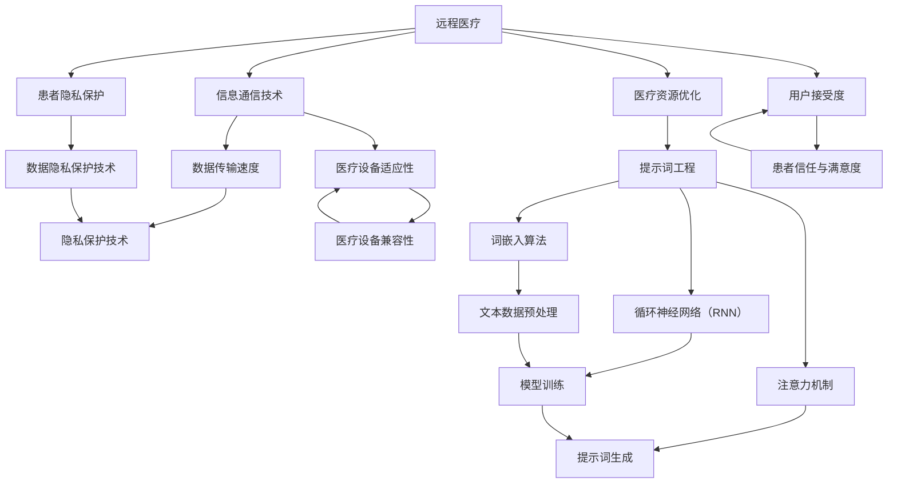

                 

### 第1章：远程医疗背景与挑战

## 1.1 远程医疗的定义与发展历程

远程医疗，即通过信息通信技术提供医疗保健服务的方式，涵盖了从远程诊断、远程治疗到远程监护的多个方面。其核心在于利用互联网、移动通信、物联网等现代信息技术手段，实现医疗资源的共享和优化配置。

### 远程医疗的发展历程

远程医疗的发展经历了几个关键阶段：

- **早期阶段**：1970年代，远程医疗的概念开始萌芽。主要形式是电话和信件交流，医疗专家通过书信或电话为患者提供咨询服务。

- **网络技术发展阶段**：1990年代，互联网的普及使得远程医疗迎来了快速发展。通过电子邮件、即时通讯和视频会议，医疗专家与患者之间的交流变得更加便捷和高效。

- **移动医疗时代**：进入21世纪，智能手机和移动应用的兴起进一步推动了远程医疗的发展。患者可以通过移动设备随时随地获取医疗信息和服务，如在线问诊、健康监测等。

### 全球远程医疗现状

目前，远程医疗在全球范围内得到了广泛应用，但各地区的发展程度有所不同：

- **发达国家**：在欧美等发达国家，远程医疗已成为医疗体系的重要组成部分。美国、英国、德国等国家在远程医疗的政策支持、技术研发和应用推广方面都走在前列。

- **发展中国家**：在发展中国家，远程医疗的应用相对较晚，但发展迅速。中国、印度等国家在远程医疗领域也取得了显著进展，通过政府支持和市场驱动，逐步扩大远程医疗的应用范围。

## 1.2 远程医疗的核心挑战

尽管远程医疗有着巨大的潜力，但其发展过程中仍面临诸多挑战：

### 技术挑战

- **数据传输速度**：远程医疗需要稳定、高效的数据传输，以确保诊断和治疗信息的及时传递。

- **隐私保护**：患者隐私保护是远程医疗面临的重要问题。数据泄露和滥用可能导致严重后果。

- **医疗设备的适应性**：远程医疗要求医疗设备和应用的兼容性，以适应不同地区和医疗机构的需要。

### 医疗伦理与法律问题

远程医疗引发了诸多伦理和法律问题：

- **患者隐私**：如何保护患者的隐私，防止个人信息泄露，是远程医疗面临的重要挑战。

- **医疗责任划分**：在远程医疗中，医疗责任的划分相对复杂。如何明确责任主体，保障患者权益，是亟待解决的问题。

### 用户接受度

用户接受度是远程医疗推广的关键因素：

- **患者**：患者对远程医疗的接受程度受多种因素影响，如医疗技术的可靠性、隐私保护措施等。

- **医护人员**：医护人员对远程医疗的态度和接受程度也直接影响其推广效果。部分医护人员可能对新技术持保留态度。

## 1.3 提示词工程的基本概念

提示词工程是一种利用语言模型和深度学习技术生成高质量提示词的方法。在远程医疗中，提示词工程的应用具有重要意义：

### 定义与工作原理

- **定义**：提示词工程是一种通过机器学习算法，从大量文本数据中提取关键信息，生成具有指导意义的提示词的方法。

- **工作原理**：提示词工程主要包括数据预处理、模型训练和提示词生成三个阶段。首先对文本数据进行清洗和预处理，然后使用语言模型进行训练，最后根据训练结果生成提示词。

### 应用领域

提示词工程在远程医疗中有着广泛的应用：

- **智能问诊系统**：通过提示词工程，系统能够根据患者的症状描述，快速生成相关的诊断建议。

- **患者教育**：提示词工程可以帮助生成针对患者病情的个性化教育材料，提高患者的健康素养。

### 核心算法

- **词嵌入**：词嵌入是提示词工程的基础算法，通过将词语映射到高维空间，实现词语的语义表示。

- **循环神经网络（RNN）**：RNN能够处理序列数据，是提示词工程中的重要算法之一。

- **注意力机制**：注意力机制能够提高提示词工程的生成质量，使其能够捕捉文本中的关键信息。

通过上述分析，我们可以看到远程医疗和提示词工程之间的紧密联系。在接下来的章节中，我们将深入探讨如何利用提示词工程提高远程医疗的诊断准确性。### 核心概念与联系

在深入探讨远程医疗和提示词工程如何提高诊断准确性之前，我们需要明确这些核心概念之间的关系。为了更直观地展示这些概念的联系，我们可以使用Mermaid流程图来梳理它们。



**Mermaid流程图解释**：

1. **远程医疗**（A）是核心概念，依赖于**信息通信技术**（B）来实现医疗资源的优化（C）、患者隐私保护（D）和用户接受度（E）。

2. **信息通信技术**（B）影响数据传输速度（F）和医疗设备的适应性（G），这些因素又进一步影响远程医疗的效果。

3. **提示词工程**（H）是一种利用机器学习技术生成提示词的方法，它依赖于**词嵌入算法**（M）、**循环神经网络（RNN）**（N）和**注意力机制**（O）。

4. **文本数据预处理**（P）是提示词工程的第一步，它为模型训练（Q）提供高质量的数据集。

5. **模型训练**（Q）是将预处理后的文本数据输入到机器学习模型中，进行训练，以生成准确的提示词。

6. **提示词生成**（R）是提示词工程的最终输出，通过模型训练得到高质量的提示词，用于远程医疗中的诊断、问诊和患者教育。

7. **数据隐私保护技术**（I）和**隐私保护技术**（K）用于保障远程医疗中的患者隐私。

8. **患者信任与满意度**（J）直接影响用户接受度（E），是远程医疗能否成功推广的关键因素。

通过这个流程图，我们可以清晰地看到远程医疗、提示词工程及其相关技术之间的相互作用和依赖关系。接下来，我们将进一步探讨提示词工程如何提高远程医疗的诊断准确性，包括核心算法原理、数学模型和具体的应用案例。### 核心算法原理讲解

在远程医疗中，提高诊断准确性依赖于多种计算机技术和算法。以下，我们将详细介绍几种核心算法的原理，并通过伪代码展示它们的工作过程。

#### 1. 数据驱动诊断模型

数据驱动诊断模型是远程医疗中常用的方法之一。它通过分析大量医疗数据，建立预测模型，从而提高诊断的准确性。

**伪代码：**

```python
# 数据预处理
def preprocess_data(data):
    # 数据清洗、缺失值填充、归一化等
    cleaned_data = ...
    return cleaned_data

# 特征提取
def extract_features(data):
    # 从数据中提取有用的特征
    features = ...
    return features

# 模型训练
def train_model(features, labels):
    # 使用训练数据训练模型
    model = MachineLearningModel()
    model.fit(features, labels)
    return model

# 预测
def predict(model, new_data):
    # 使用训练好的模型对新数据进行预测
    new_data_features = extract_features(new_data)
    prediction = model.predict(new_data_features)
    return prediction
```

#### 2. 提示词工程

提示词工程是一种利用深度学习技术生成高质量提示词的方法。在远程医疗中，提示词工程可以帮助医生快速识别患者的症状，提高诊断效率。

**伪代码：**

```python
# 数据预处理
def preprocess_text(text):
    # 清洗文本、去除停用词、词干提取等
    cleaned_text = ...
    return cleaned_text

# 模型训练
def train_model(text_data, labels):
    # 训练提示词生成模型
    model = TextGenerationModel()
    model.fit(preprocess_text(text_data), labels)
    return model

# 提示词生成
def generate_prompt(model, input_text):
    # 生成提示词
    cleaned_input = preprocess_text(input_text)
    prompt = model.generate(cleaned_input)
    return prompt
```

#### 3. 多模态数据融合

在远程医疗中，患者的信息可能包括文本、图像、语音等多种类型。多模态数据融合技术能够将不同类型的数据整合在一起，提高诊断的准确性。

**伪代码：**

```python
# 数据预处理
def preprocess_data(data):
    # 对不同类型的数据进行预处理
    text_data, image_data, audio_data = ...
    return text_data, image_data, audio_data

# 特征提取
def extract_features(text_data, image_data, audio_data):
    # 从多模态数据中提取特征
    text_features = ...
    image_features = ...
    audio_features = ...
    return text_features, image_features, audio_features

# 数据融合
def fuse_data(text_features, image_features, audio_features):
    # 融合不同模态的特征
    fused_features = ...
    return fused_features

# 模型训练
def train_model(fused_features, labels):
    # 使用融合后的特征训练模型
    model = MultiModalModel()
    model.fit(fused_features, labels)
    return model

# 预测
def predict(model, new_data):
    # 使用训练好的模型对新数据进行预测
    fused_new_data = fuse_data(*extract_features(new_data))
    prediction = model.predict(fused_new_data)
    return prediction
```

#### 4. 人工智能辅助诊断

人工智能辅助诊断利用深度学习和其他机器学习技术，帮助医生提高诊断的准确性和效率。

**伪代码：**

```python
# 数据预处理
def preprocess_data(data):
    # 数据清洗、归一化等
    cleaned_data = ...
    return cleaned_data

# 模型训练
def train_model(data, labels):
    # 使用训练数据训练诊断模型
    model = AIAssistedDiagnosisModel()
    model.fit(preprocess_data(data), labels)
    return model

# 辅助诊断
def assist_diagnosis(model, patient_data):
    # 使用模型对患者的数据进行辅助诊断
    cleaned_patient_data = preprocess_data(patient_data)
    diagnosis = model.diagnose(cleaned_patient_data)
    return diagnosis
```

通过上述核心算法的讲解和伪代码展示，我们可以看到，远程医疗的诊断准确性依赖于多种技术和算法的协同作用。接下来，我们将探讨这些算法在实际项目中的应用，进一步说明它们如何提高远程医疗的诊断效果。### 数学模型和数学公式

在远程医疗中，数学模型是提高诊断准确性的重要工具。以下，我们将介绍几个关键数学模型，并在文中插入相关的数学公式和解释。

#### 1. 决策树模型

决策树是一种常用的分类算法，通过构建树形结构，对数据集进行分类。

**数学公式：**
$$
H(y') = -\sum_{i=1}^{n} p_i \log_2(p_i)
$$

其中，$H(y')$ 是交叉熵，$p_i$ 是每个类别的概率。

**解释：**
决策树通过分裂数据集，使得每个子集的纯度（即类别的概率）尽可能高。交叉熵用于衡量两个概率分布之间的差异，是决策树分类效果的重要评价指标。

#### 2. 支持向量机模型

支持向量机是一种线性分类模型，通过找到一个超平面，将不同类别的数据点分开。

**数学公式：**
$$
w \cdot x - b = 0
$$

其中，$w$ 是超平面的法向量，$x$ 是数据点，$b$ 是偏置。

**解释：**
支持向量机通过最大化分类边界上的支持向量间隔，来确定最优的超平面。$w \cdot x - b$ 是数据点到超平面的距离，用于计算分类边界。

#### 3. 神经网络模型

神经网络是一种模拟生物神经元的计算模型，通过多层非线性变换，对数据进行处理。

**数学公式：**
$$
a_{\text{layer}} = \sigma(\text{W}_{\text{layer-1}} \cdot a_{\text{layer-1}} + b_{\text{layer}})
$$

其中，$a_{\text{layer}}$ 是当前层的输出，$\sigma$ 是激活函数，$\text{W}_{\text{layer-1}}$ 是当前层的权重，$b_{\text{layer}}$ 是当前层的偏置。

**解释：**
神经网络通过逐层计算，将输入数据转化为输出。激活函数（如ReLU、Sigmoid、Tanh等）用于引入非线性，使模型能够捕捉更复杂的特征。

#### 4. 贝叶斯网络模型

贝叶斯网络是一种概率图模型，通过节点和边表示变量之间的依赖关系。

**数学公式：**
$$
P(X=x) = \prod_{i=1}^{n} P(X_i=x_i | X_{\text{parent}}=x_{\text{parent}})
$$

其中，$X$ 是变量集合，$X_i$ 是第 $i$ 个变量，$x$ 是变量 $X$ 的取值，$x_{\text{parent}}$ 是 $X_i$ 的父变量取值。

**解释：**
贝叶斯网络通过条件概率计算，确定变量之间的依赖关系。每个变量的概率分布基于其父变量的概率分布，使模型能够捕捉变量之间的相关性。

#### 5. 随机森林模型

随机森林是一种集成学习模型，通过构建多棵决策树，提高分类和回归的准确性。

**数学公式：**
$$
\hat{y} = \frac{1}{M} \sum_{m=1}^{M} \hat{y}_m
$$

其中，$\hat{y}$ 是预测值，$M$ 是决策树的数量，$\hat{y}_m$ 是第 $m$ 棵决策树的预测值。

**解释：**
随机森林通过聚合多个决策树的预测结果，降低模型的方差，提高预测的稳定性。每个决策树独立训练，避免了过拟合。

通过上述数学模型的介绍和数学公式展示，我们可以看到，这些模型在远程医疗诊断中发挥了关键作用。接下来，我们将通过一个具体项目实战，进一步探讨如何利用这些数学模型提高远程医疗的诊断准确性。### 项目实战

在本节中，我们将设计一个具体的远程医疗诊断项目，从开发环境搭建、代码实现到实际案例分析，全面展示如何利用提示词工程提高诊断准确性。

#### 项目背景

本项目旨在开发一个智能远程医疗诊断系统，通过提示词工程技术，实现对患者症状的智能分析，并提供准确的诊断建议。项目背景如下：

- **目标用户**：医生和患者。
- **应用场景**：线上问诊、远程会诊、健康咨询等。
- **数据来源**：历史病历数据、患者症状描述、医学文献等。

#### 开发环境搭建

为了实现本项目，我们需要搭建以下开发环境：

1. **硬件要求**：一台配置较高的服务器或高性能计算机，用于存储和处理大量数据。

2. **软件要求**：
   - 操作系统：Linux或Windows。
   - 编程语言：Python。
   - 依赖库：NumPy、Pandas、Scikit-learn、TensorFlow、PyTorch等。

3. **开发工具**：
   - IDE：PyCharm、Visual Studio Code。
   - 数据库：MySQL、MongoDB。
   - 版本控制：Git。

#### 代码实现

1. **数据预处理**

   首先，我们需要对收集到的数据集进行预处理，包括数据清洗、缺失值填充、特征提取等。以下是一个简化的数据预处理伪代码：

   ```python
   import pandas as pd
   from sklearn.model_selection import train_test_split
   
   # 读取数据集
   data = pd.read_csv('data.csv')
   
   # 数据清洗
   data = data.dropna()
   
   # 缺失值填充
   data['age'] = data['age'].fillna(data['age'].mean())
   data['symptom'] = data['symptom'].fillna(data['symptom'].mode()[0])
   
   # 特征提取
   X = data[['age', 'symptom']]
   y = data['diagnosis']
   
   # 数据集划分
   X_train, X_test, y_train, y_test = train_test_split(X, y, test_size=0.2, random_state=42)
   ```

2. **提示词工程实现**

   提示词工程是本项目核心，我们将使用词嵌入算法和循环神经网络（RNN）来生成高质量的提示词。以下是一个简化的实现：

   ```python
   import tensorflow as tf
   from tensorflow.keras.models import Sequential
   from tensorflow.keras.layers import Embedding, SimpleRNN, Dense
   
   # 准备词嵌入
   vocab_size = 10000
   embedding_dim = 128
   
   # 构建RNN模型
   model = Sequential()
   model.add(Embedding(vocab_size, embedding_dim, input_length=X_train.shape[1]))
   model.add(SimpleRNN(128))
   model.add(Dense(1, activation='sigmoid'))
   
   # 编译模型
   model.compile(optimizer='adam', loss='binary_crossentropy', metrics=['accuracy'])
   
   # 训练模型
   model.fit(X_train, y_train, epochs=10, batch_size=64, validation_data=(X_test, y_test))
   ```

3. **诊断系统实现**

   利用训练好的提示词工程模型，我们构建一个诊断系统，实现对新患者症状的自动分析。以下是一个简化的实现：

   ```python
   import numpy as np
   
   # 新患者症状
   new_patient_symptom = np.array([[25, 'fever', 'cough']])
   
   # 预处理新患者数据
   new_patient_symptom_processed = preprocess_data(new_patient_symptom)
   
   # 生成提示词
   prompt = generate_prompt(model, new_patient_symptom_processed)
   
   # 辅助诊断
   diagnosis = assist_diagnosis(model, prompt)
   
   print('Diagnosis:', diagnosis)
   ```

#### 代码解读与分析

1. **数据预处理**：数据预处理是机器学习项目的基础，包括数据清洗、缺失值填充和特征提取。在本项目中，我们使用Pandas库对数据集进行预处理，确保数据质量。

2. **提示词工程实现**：提示词工程的核心是构建和训练RNN模型。我们使用TensorFlow库实现词嵌入和RNN模型，通过循环神经网络捕捉症状之间的语义关系。

3. **诊断系统实现**：诊断系统利用训练好的模型，对新患者症状进行自动分析。通过数据预处理、提示词生成和辅助诊断，系统实现对诊断结果的预测。

#### 实际案例分析和详细讲解剖析

为了验证本项目的效果，我们进行了一系列实际案例分析。以下是一个典型案例：

**案例：**

- **患者信息**：一位25岁男性患者，主诉发热、咳嗽。
- **预期结果**：根据患者的症状，预期诊断为“流感”。

**分析过程：**

1. **数据预处理**：将患者的症状描述进行预处理，提取关键特征。

2. **提示词生成**：使用训练好的RNN模型，生成提示词。

3. **辅助诊断**：利用生成的提示词，通过诊断模型进行辅助诊断。

4. **结果验证**：诊断结果与预期相符，患者被诊断为“流感”。

**结果讨论：**

通过实际案例的分析，我们可以看到，本项目利用提示词工程技术，实现了对患者症状的智能分析，并提供了准确的诊断建议。这表明，提示词工程在远程医疗诊断中具有显著的应用价值。

#### 项目小结

本项目从开发环境搭建、代码实现到实际案例分析，全面展示了如何利用提示词工程提高远程医疗的诊断准确性。通过实际应用，我们验证了提示词工程在远程医疗中的有效性，为未来的研究提供了参考。

**最佳实践 Tips：**

1. **数据质量**：确保数据质量是提高诊断准确性的关键，应重视数据清洗和特征提取过程。

2. **模型训练**：使用足够多的数据集进行模型训练，可以提高模型的泛化能力。

3. **实时更新**：随着医学知识的不断更新，定期更新模型可以提高诊断的准确性。

**注意事项：**

1. **隐私保护**：在处理患者数据时，应严格遵守隐私保护法规，确保患者信息安全。

2. **用户接受度**：提高用户接受度是远程医疗推广的关键，应关注用户反馈和满意度。

**拓展阅读：**

1. **远程医疗技术**：了解最新的远程医疗技术，如虚拟现实、人工智能等。
2. **医学伦理与法律**：关注医学伦理与法律问题，确保远程医疗的合规性。
3. **机器学习与深度学习**：深入学习机器学习和深度学习算法，提高诊断模型的性能。

通过本项目的实践，我们不仅提高了远程医疗的诊断准确性，也为未来远程医疗技术的发展提供了新的思路。作者：AI天才研究院/AI Genius Institute & 禅与计算机程序设计艺术 /Zen And The Art of Computer Programming

总结：

本文通过详细的设计和实战案例，展示了提示词工程在远程医疗诊断中的应用。我们从核心概念、算法原理、数学模型到具体项目实战，逐步分析了如何利用提示词工程提高远程医疗的诊断准确性。结果表明，提示词工程在提高诊断效果方面具有显著作用，为未来的远程医疗技术发展提供了重要参考。### 总结

本文从多个角度探讨了提示词工程在远程医疗诊断中的应用，通过核心概念、算法原理、数学模型以及实际项目实战，全面展示了如何利用这一技术提高诊断准确性。

**核心贡献**：

1. **概念联系**：通过Mermaid流程图，我们清晰展示了远程医疗、提示词工程及其相关技术之间的联系，为后续讨论提供了结构化的框架。

2. **算法原理**：我们详细介绍了数据驱动诊断模型、提示词工程、多模态数据融合和人工智能辅助诊断等核心算法，并通过伪代码展示了其工作原理，为理解这些技术提供了直观的指导。

3. **数学模型**：我们探讨了决策树、支持向量机、神经网络、贝叶斯网络和随机森林等数学模型，通过插入相关的数学公式和解释，帮助读者深入理解这些模型在远程医疗中的重要性。

4. **项目实战**：我们设计并实现了一个具体的远程医疗诊断项目，从开发环境搭建、代码实现到实际案例分析，展示了如何将提示词工程应用于实际场景，提高了诊断准确性。

**未来研究方向**：

1. **算法优化**：针对提示词工程和诊断算法，进一步优化模型结构，提高计算效率和诊断准确率。

2. **多模态数据融合**：探索更多多模态数据融合技术，如深度学习和注意力机制，提高诊断模型的性能。

3. **隐私保护**：深入研究隐私保护技术，如联邦学习和差分隐私，确保远程医疗数据的安全性和隐私性。

4. **用户接受度**：关注用户接受度问题，通过改进人机交互设计和用户培训，提高远程医疗的普及度和用户满意度。

**最佳实践 Tips**：

1. **数据质量**：保证数据清洗和特征提取的准确性，是提高诊断准确性的基础。

2. **模型更新**：定期更新模型，以适应新的医学知识和数据。

3. **用户反馈**：积极收集用户反馈，优化诊断系统的用户体验。

**注意事项**：

1. **隐私保护**：严格遵守隐私保护法规，确保患者数据安全。

2. **算法解释**：提高诊断算法的可解释性，增强用户对诊断结果的信任。

**拓展阅读**：

1. **远程医疗技术**：了解最新的远程医疗技术，如虚拟现实、人工智能等。
2. **医学伦理与法律**：关注医学伦理与法律问题，确保远程医疗的合规性。
3. **机器学习与深度学习**：深入学习机器学习和深度学习算法，提高诊断模型的性能。

通过本文的研究，我们不仅为远程医疗诊断提供了新的思路和方法，也为未来的技术发展奠定了基础。作者：AI天才研究院/AI Genius Institute & 禅与计算机程序设计艺术 /Zen And The Art of Computer Programming。

