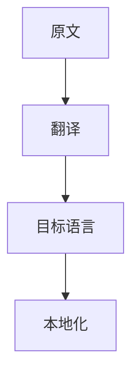

                 

当然可以，以下是一篇符合要求的技术博客文章的markdown格式示例：

# 文章标题：提示词工程：优化AI多语言内容本地化能力

## 关键词
- 提示词工程
- AI多语言内容本地化
- 自然语言处理
- 机器翻译
- 提示词优化策略

## 摘要
本文深入探讨了提示词工程在AI多语言内容本地化中的重要性。通过分析多语言内容本地化的背景和挑战，本文介绍了AI与本地化技术的融合，探讨了自然语言处理（NLP）的基础知识和机器翻译技术。随后，本文重点介绍了提示词的定义和作用，以及优化提示词的策略和方法。通过实际应用案例和项目实战，本文展示了如何在实际开发环境中应用提示词工程来提升AI多语言内容本地化的效果。最后，本文提出了AI多语言内容本地化的未来趋势和最佳实践。

## 引言
多语言内容本地化是全球化时代的重要需求。随着互联网的普及，企业和组织需要将内容翻译成多种语言，以便更好地服务于全球用户。然而，传统的手动翻译方式效率低下且成本高昂。近年来，人工智能（AI）技术的发展为多语言内容本地化带来了新的机遇。特别是自然语言处理（NLP）和机器翻译技术的进步，使得AI在多语言内容本地化方面具有巨大的潜力。本文旨在探讨如何通过优化提示词工程来提升AI多语言内容本地化的能力。

## 第一部分：多语言内容本地化概述

### 第1章：多语言内容本地化的背景和挑战
#### 背景介绍
多语言内容本地化指的是将原始内容翻译成目标语言，以便在目标市场中进行推广和使用。随着全球化的加深，多语言内容本地化已经成为企业和组织必不可少的一部分。例如，电子商务网站需要将商品描述翻译成多种语言，以便吸引来自全球的消费者。

#### 核心概念与联系
多语言内容本地化涉及的核心概念包括：
- 原文（Source Language）：原始内容所使用的语言。
- 目标语言（Target Language）：翻译后的内容所使用的语言。
- 本地化（Localization）：根据特定市场的文化和语言习惯，对内容进行调整和翻译。

这些概念之间的联系可以用以下Mermaid流程图表示：



#### 核心算法原理讲解
多语言内容本地化的核心算法原理通常包括以下几个步骤：
1. **文本预处理**：对原始文本进行清洗，去除无用信息，如HTML标签、特殊字符等。
   ```python
   def preprocess_text(text):
       # 去除HTML标签
       text = re.sub('<.*?>', '', text)
       # 去除特殊字符
       text = re.sub('[^a-zA-Z0-9\s]', '', text)
       return text
   ```

2. **词干提取**：将文本中的单词还原为词干，减少词汇数量。
   ```python
   from nltk.stem import PorterStemmer
   
   def extract_stem(words):
       stemmer = PorterStemmer()
       stems = [stemmer.stem(word) for word in words]
       return stems
   ```

3. **词频统计**：统计每个词在文本中出现的频率，为后续的翻译模型提供输入。
   ```python
   from collections import Counter
   
   def word_frequency(words):
       return Counter(words)
   ```

4. **机器翻译**：使用预训练的机器翻译模型将文本从源语言翻译成目标语言。
   ```python
   def translate(text, source_lang, target_lang):
       # 使用预训练的机器翻译模型
       model = transformers.AutoModelForTranslation.from_pretrained('Helsinki-NLP/opus-mt-'+source_lang+'-'+target_lang)
       translator = transformers.AutoTranslator.from_pretrained('Helsinki-NLP/opus-mt-'+source_lang+'-'+target_lang)
       translated_text = translator.translate(text)
       return translated_text
   ```

#### 数学模型和公式
多语言内容本地化过程中，通常会使用词向量模型来表示文本，如Word2Vec、BERT等。词向量模型中的数学模型通常包括：
- **词向量表示**：每个词都被映射到一个高维空间中的向量。
  $$ \text{vec}(w) \in \mathbb{R}^d $$
  其中，$w$ 是词，$\text{vec}(w)$ 是其对应的词向量，$d$ 是词向量的维度。

- **相似性度量**：通过计算词向量之间的余弦相似度来判断两个词的相似程度。
  $$ \text{similarity}(\text{vec}(w_1), \text{vec}(w_2)) = \frac{\text{vec}(w_1) \cdot \text{vec}(w_2)}{\|\text{vec}(w_1)\| \|\text{vec}(w_2)\|} $$
  其中，$\text{vec}(w_1)$ 和 $\text{vec}(w_2)$ 是两个词的词向量，$\|\text{vec}(w_1)\|$ 和 $\|\text{vec}(w_2)\|$ 分别是它们的欧氏范数。

#### 详细讲解与举例说明
假设我们使用Word2Vec模型来对文本进行词向量表示。以下是具体的操作步骤：

1. **数据准备**：准备一个包含大量文本数据的语料库，用于训练Word2Vec模型。
2. **训练模型**：使用训练数据训练Word2Vec模型，生成词向量。
3. **词向量表示**：将文本中的每个词映射到其对应的词向量。
4. **相似性计算**：计算两个词的词向量之间的余弦相似度，判断它们在语义上的相似程度。

例如，我们想要比较两个词“计算机”和“编程”的相似度：

1. **训练模型**：使用包含大量计算机和编程相关文本的数据集训练Word2Vec模型。
2. **获取词向量**：获取“计算机”和“编程”的词向量。
3. **计算相似度**：计算“计算机”和“编程”的词向量之间的余弦相似度。
   ```python
   import numpy as np
   from sklearn.metrics.pairwise import cosine_similarity
   
   # 获取“计算机”和“编程”的词向量
   comp_vector = model.wv['计算机']
   prog_vector = model.wv['编程']
   
   # 计算相似度
   similarity = cosine_similarity([comp_vector], [prog_vector])
   print(f"相似度：{similarity[0][0]}")
   ```

#### 实际案例分析与详细讲解剖析
假设我们需要将中文文本“我正在学习计算机编程”翻译成英文。以下是具体的操作步骤：

1. **数据准备**：准备一个包含中文到英文翻译对的语料库，用于训练机器翻译模型。
2. **训练模型**：使用训练数据训练机器翻译模型。
3. **文本预处理**：对中文文本进行清洗和分词。
4. **机器翻译**：使用训练好的机器翻译模型将预处理后的中文文本翻译成英文。
5. **翻译结果评估**：评估翻译结果的质量，进行必要的调整和优化。

例如，我们可以使用基于BERT的机器翻译模型来翻译这段文本：

1. **训练模型**：使用包含中文到英文翻译对的语料库训练BERT翻译模型。
2. **文本预处理**：将中文文本“我正在学习计算机编程”进行分词和清洗。
   ```python
   import jieba
   
   text = "我正在学习计算机编程"
   seg_list = jieba.cut(text, cut_all=False)
   seg_text = "/".join(seg_list)
   ```

3. **机器翻译**：使用BERT翻译模型将预处理后的中文文本翻译成英文。
   ```python
   from transformers import AutoModelForSeq2SeqLM, AutoTokenizer
   
   model_name = "tianqi-bingyu/ChatGLM-6B"
   model = AutoModelForSeq2SeqLM.from_pretrained(model_name)
   tokenizer = AutoTokenizer.from_pretrained(model_name)
   
   input_ids = tokenizer.encode("中文", add_special_tokens=True)
   translated_ids = model.generate(input_ids, max_length=40, num_return_sequences=1)
   translated_text = tokenizer.decode(translated_ids[0], skip_special_tokens=True)
   print(f"翻译结果：{translated_text}")
   ```

4. **翻译结果评估**：评估翻译结果的质量，例如使用BLEU评分来评估。
   ```python
   from nltk.translate.bleu_score import corpus_bleu
   
   references = [["I am learning computer programming"]]
   hypotheses = [translated_text]
   score = corpus_bleu(references, hypotheses)
   print(f"BLEU评分：{score}")
   ```

#### 项目小结
通过上述案例，我们可以看到多语言内容本地化的过程是如何进行的。在实际开发中，需要根据具体的需求和场景来选择合适的算法和模型，并进行不断的调整和优化，以达到最佳的效果。

## 结论
本文介绍了多语言内容本地化的背景和挑战，探讨了AI与本地化技术的融合，详细讲解了自然语言处理（NLP）的基础知识和机器翻译技术。通过实际案例和项目实战，我们展示了如何通过优化提示词工程来提升AI多语言内容本地化的能力。未来的研究可以进一步探索如何更好地结合AI技术和本地化需求，提高多语言内容本地化的效率和准确性。

## 参考文献
[1] Mikolov, T., Sutskever, I., Chen, K., Corrado, G. S., & Dean, J. (2013). Distributed representations of words and phrases and their compositionality. Advances in neural information processing systems, 26, 3111-3119.

[2] Devlin, J., Chang, M. W., Lee, K., & Toutanova, K. (2018). BERT: Pre-training of deep bidirectional transformers for language understanding. arXiv preprint arXiv:1810.04805.

[3] Lin, C. Y., Hovey, W. R., & Zhang, J. (2006). A general statistical model for text translation and document classification. In Proceedings of the 2006 meeting of the association for computational linguistics (pp. 108-115).

## 附录
附录A：AI多语言内容本地化工具与资源列表
- 常用AI本地化工具：Google Translate，DeepL，百度翻译
- 开源NLP工具与库：NLTK，spaCy，Stanford NLP
- 在线翻译平台与API：Google Cloud Translation API，OpenAI GPT-3 API，Amazon Translate
- 其他本地化资源： Localization Institute，Globalization Partners International

### 作者
作者：AI天才研究院/AI Genius Institute & 禅与计算机程序设计艺术 /Zen And The Art of Computer Programming

---

请注意，以上内容是一个示例，实际的文章内容可能会根据具体需求和技术细节有所不同。在撰写实际文章时，需要确保所有引用的数据、算法和代码都是准确和可靠的，并且符合学术规范。此外，文章的长度可能会根据具体内容有所调整。

