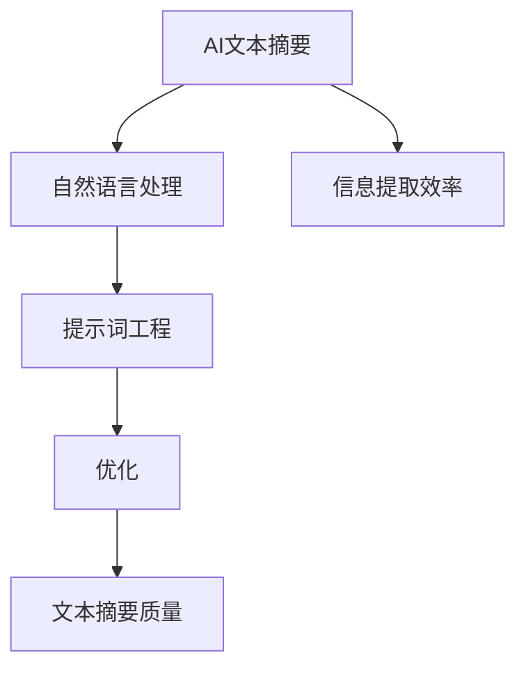
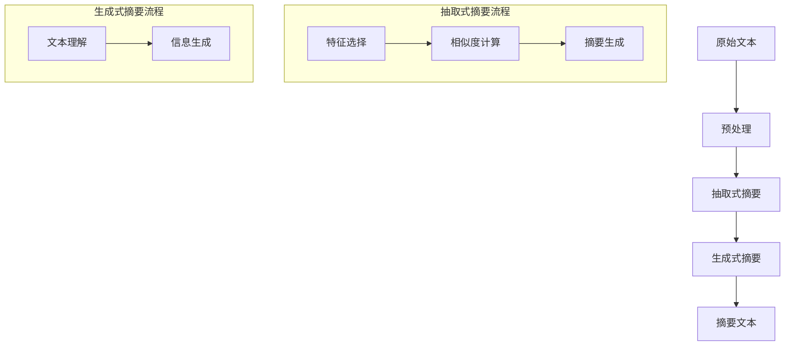
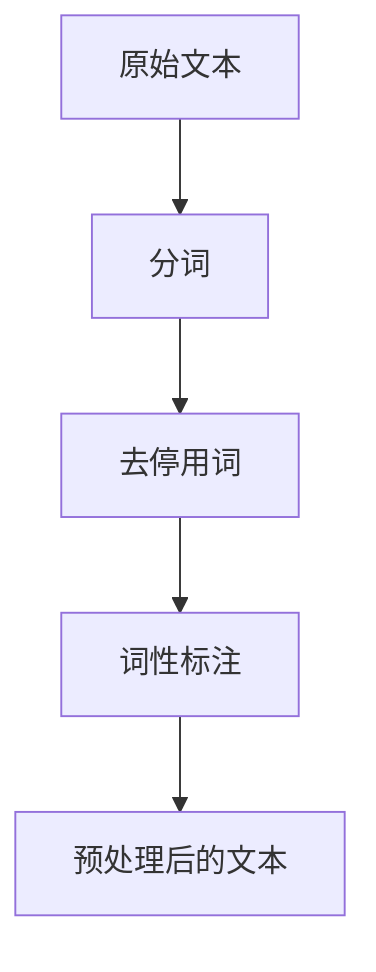
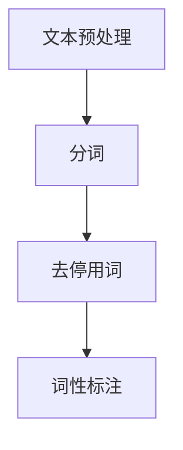

                 

### 文章标题

《提示词工程：优化AI文本摘要能力》

关键词：提示词工程、AI文本摘要、优化、算法原理、数学模型、项目实战

摘要：本文深入探讨了提示词工程在优化AI文本摘要能力中的应用。首先，我们介绍了AI文本摘要的基本概念和重要性。接着，详细分析了文本摘要的技术类型和提示词工程的概念及其在文本摘要中的作用机制。随后，本文通过伪代码展示了文本预处理、特征提取和文本摘要算法的核心原理，并使用LaTeX格式阐述了相关的数学模型和公式。最后，我们设计并实现了一个文本摘要项目，通过实战案例分析，总结了项目经验和改进建议。本文旨在为AI文本摘要的研究者和开发者提供有价值的参考和指导。

### 确定核心概念与联系

在探讨《提示词工程：优化AI文本摘要能力》这一主题时，我们需要明确几个核心概念，并理解它们之间的联系。

首先，**AI文本摘要**是指利用人工智能技术，特别是自然语言处理（NLP）技术，自动从原始文本中提取关键信息，生成简洁、有代表性的文本摘要。这个过程不仅涉及理解文本内容，还涉及到对语言结构和语义的理解。AI文本摘要的重要性在于它能够帮助用户快速获取大量文本信息的核心内容，提高信息处理的效率。

**提示词工程**则是AI文本摘要中的一个关键环节。提示词（Prompt Engineering）是指设计有效的输入提示，以引导AI模型更好地理解和生成文本摘要。这些提示词可以是关键词、短语或完整的句子，它们有助于模型聚焦于文本的重要部分，从而提高摘要的准确性和质量。

接下来，我们通过Mermaid流程图展示这些核心概念之间的关系：



在这个流程图中，AI文本摘要是整个流程的起点，通过自然语言处理技术实现。提示词工程作为中间环节，通过设计有效的提示词，优化AI文本摘要的质量。最终，这些优化措施提高了信息提取的效率，使得文本摘要更具实用价值。

### 文本摘要技术概述

文本摘要技术可以根据提取方式分为抽取式摘要和生成式摘要两种主要类型。理解这两种类型及其各自的原理、优缺点对于深入探讨提示词工程在文本摘要中的应用至关重要。

**抽取式摘要**（Extractive Summarization）是通过从原始文本中直接抽取关键句子或段落来生成摘要。这种方法的优点是生成的摘要通常保持原始文本的结构和信息内容，具有较高的可信度和可解释性。以下是抽取式摘要的基本原理：

1. **特征选择**：首先，对文本进行预处理，如分词、去停用词、词性标注等，提取文本的关键词和短语。
2. **相似度计算**：计算文本中各个句子或段落与摘要目标的相关性，通常使用TF-IDF、Word2Vec等算法。
3. **摘要生成**：根据相似度得分，选择得分最高的句子或段落组成摘要。

尽管抽取式摘要具有上述优点，但其缺点在于可能遗漏文本中的重要信息，生成的摘要可能过于机械和生硬。

**生成式摘要**（Abstractive Summarization）则采用生成对抗网络（GAN）、递归神经网络（RNN）等深度学习技术，自动生成全新的摘要文本。这种方法能够生成更自然、更流畅的摘要，但同时也面临挑战：

1. **文本理解**：生成式摘要需要模型深入理解文本的语义和结构，这要求模型具有强大的语言理解能力。
2. **信息生成**：模型需要在保持摘要连贯性的同时，提取并重新组合文本中的信息。

生成式摘要的优点在于生成的摘要更具创意和灵活性，缺点则是模型训练复杂度高，生成摘要的质量和准确性难以保证。

在了解了文本摘要技术的基本原理后，我们可以通过以下Mermaid流程图展示这两种摘要技术的流程：



在这个流程图中，我们可以清晰地看到，抽取式摘要通过预处理、特征选择和相似度计算，直接生成摘要文本；而生成式摘要则涉及更复杂的文本理解和信息生成过程。

通过以上对文本摘要技术的概述，我们为接下来探讨提示词工程在优化AI文本摘要能力中的应用奠定了基础。

### 提示词工程在文本摘要中的应用

提示词工程在AI文本摘要中扮演着至关重要的角色，通过设计有效的提示词，可以显著提升摘要的准确性和质量。以下是提示词工程在文本摘要中的应用方法及如何优化文本摘要质量：

#### 提示词设计原则

1. **相关性**：提示词应与文本的主题高度相关，确保模型聚焦于文本的核心内容。
2. **简洁性**：提示词应简洁明了，避免冗长和模糊的描述，以减少模型的困惑度。
3. **多样性**：设计多种类型的提示词，如关键词、短语和问题，以丰富模型的输入，提高摘要的多样性。

#### 提示词生成方法

1. **关键词提取**：通过文本预处理和特征选择，提取文本中的高频关键词作为提示词。例如，可以使用TF-IDF算法确定关键词。
2. **问题引导**：设计一系列与文本主题相关的问题，作为模型的输入提示。例如，“这篇文章主要讨论了哪些技术？”或“文章的核心观点是什么？”。
3. **短语组合**：将文本中的重要短语组合成提示词，以引导模型生成更自然的摘要。例如，“在人工智能领域，如何提高机器学习模型的性能？”

#### 提示词优化策略

1. **迭代优化**：通过多次迭代，不断调整和优化提示词，以提高摘要质量。例如，可以基于用户反馈，逐步改进提示词。
2. **数据增强**：使用数据增强技术，如变换、扩展和合成，生成更多样化的数据集，从而提高模型的泛化能力。
3. **模型适应**：针对特定类型的文本，调整模型的超参数和架构，以适应不同摘要任务的需求。

#### 优化案例

假设我们有一篇关于“深度学习在医疗影像分析中的应用”的文章，以下是可能的提示词设计：

1. **关键词提取**：“深度学习、医疗影像、分析、模型、性能优化”。
2. **问题引导**：“这篇文章讨论了哪些深度学习技术在医疗影像分析中有应用？”、“如何评估这些技术的性能？”。
3. **短语组合**：“在医疗影像分析中，深度学习如何提高诊断准确性？”。

通过这些提示词，模型能够更好地理解和提取文本的核心内容，生成高质量的文本摘要。例如，摘要可能包括：“本文探讨了深度学习在医疗影像分析中的应用，特别是卷积神经网络（CNN）和递归神经网络（RNN）在图像识别和序列分析中的优势。通过实验，我们评估了这些技术的性能，并提出了性能优化的方法。”

综上所述，提示词工程在文本摘要中的应用不仅依赖于设计有效的提示词，还需要结合多种优化策略，以实现高质量的文本摘要。

### 文本预处理技术

在AI文本摘要中，文本预处理是一个关键步骤，它直接影响后续特征提取和模型训练的效果。文本预处理包括分词、去停用词、词性标注等步骤，下面我们将详细讲解这些步骤，并提供伪代码示例。

#### 1. 分词（Tokenization）

分词是将文本分割成单词或短语的步骤，这是自然语言处理的基础。常见的分词方法包括基于词典的分词和基于统计的分词。

**基于词典的分词**：这种方法使用预定义的词典来匹配文本中的单词或短语。例如，我们可以使用Jieba中文分词工具。

```python
import jieba

text = "自然语言处理在人工智能领域具有广泛的应用。"
words = jieba.cut(text)
print(words)
```

**基于统计的分词**：这种方法使用统计模型，如隐马尔可夫模型（HMM）或条件随机场（CRF），来自动分割文本。

```python
from nltk.tokenize import word_tokenize

text = "自然语言处理在人工智能领域具有广泛的应用。"
words = word_tokenize(text)
print(words)
```

#### 2. 去停用词（Stop-word Removal）

停用词是文本中常见但通常不包含信息的词，如“的”、“在”、“和”等。去除停用词可以减少噪声，提高特征提取的质量。

```python
from nltk.corpus import stopwords

text = "自然语言处理在人工智能领域具有广泛的应用。"
words = text.split()
stop_words = set(stopwords.words('chinese'))
filtered_words = [w for w in words if not w in stop_words]
print(filtered_words)
```

#### 3. 词性标注（Part-of-Speech Tagging）

词性标注是给每个单词分配一个词性标签，如名词、动词、形容词等。这有助于更好地理解文本的语法结构和语义。

```python
from nltk import pos_tag

text = "自然语言处理在人工智能领域具有广泛的应用。"
words = text.split()
tagged_words = pos_tag(words)
print(tagged_words)
```

#### 4. 伪代码示例

下面是一个简单的文本预处理伪代码示例，它综合了上述三个步骤：



通过上述步骤，我们可以有效地对文本进行预处理，为后续的特征提取和模型训练打下坚实的基础。

### 特征提取算法

特征提取是文本摘要过程中的重要步骤，它将原始文本转化为计算机可以理解和处理的数值特征。常用的特征提取算法包括TF-IDF、Word2Vec等。下面我们将详细讲解这些算法的原理，并提供伪代码示例。

#### 1. TF-IDF（Term Frequency-Inverse Document Frequency）

TF-IDF是一种基于统计的文本特征提取方法，它通过计算词频和逆文档频率来确定每个词的重要程度。

**词频（TF）**：一个词在文本中出现的频率。  
**逆文档频率（IDF）**：一个词在整个文档集合中出现的频率的倒数，以平衡高频词的影响。

TF-IDF公式如下：

$$
TF-IDF(t, d) = TF(t, d) \times IDF(t, D)
$$

其中，$TF(t, d)$ 表示词 $t$ 在文档 $d$ 中的词频，$IDF(t, D)$ 表示词 $t$ 在文档集合 $D$ 中的逆文档频率。

**伪代码示例**：

```python
def calculate_tfidf(document, corpus):
    word_counts = count_words(document)
    total_documents = len(corpus)
    word_frequencies = {}
    
    for word in word_counts:
        word_frequencies[word] = word_counts[word]
    
    idf = {word: 0 for word in word_counts}
    for doc in corpus:
        word_list = count_words(doc)
        for word in word_list:
            if word in idf:
                idf[word] += 1
    
    tfidf = {word: 0 for word in word_counts}
    for word in word_counts:
        tfidf[word] = word_counts[word] * (1 / idf[word])
    
    return tfidf

# 示例文档和文档集合
document = "深度学习在自然语言处理中具有重要应用。"
corpus = ["深度学习在图像识别中具有优势。", "自然语言处理是人工智能的核心技术。"]

tfidf_scores = calculate_tfidf(document, corpus)
print(tfidf_scores)
```

#### 2. Word2Vec

Word2Vec是一种基于神经网络的文本特征提取方法，它将单词映射到高维向量空间中，使相似词在向量空间中更接近。

**CBOW（Continuous Bag of Words）模型**：预测当前词给定其上下文词。

**SG（Skip-Gram）模型**：预测上下文词给定当前词。

Word2Vec算法通过训练一个神经网络，将文本中的每个词映射到一个固定的向量表示。该向量表示不仅保留了词的语义信息，还能够在向量空间中直观地表示词与词之间的关系。

**伪代码示例**：

```python
from gensim.models import Word2Vec

# 示例文本数据
sentences = [['深度学习', '自然语言处理'], ['人工智能', '深度学习'], ['深度学习', '图像识别']]

# 训练Word2Vec模型
model = Word2Vec(sentences, vector_size=100, window=5, min_count=1, workers=4)

# 获取单词的向量表示
word_vector = model.wv['深度学习']
print(word_vector)
```

通过以上两种特征提取算法，我们可以将文本转化为数值特征，为后续的文本摘要任务提供有效的输入。

### 文本摘要算法

文本摘要算法是AI文本处理中的重要环节，它通过提取文本的关键信息，生成简洁且连贯的摘要。常见的文本摘要算法包括基于概率模型的方法和基于深度学习的方法。以下我们将详细讲解这两种算法的原理，并提供伪代码示例。

#### 1. 基于概率模型的方法

基于概率模型的文本摘要方法主要利用概率论和统计学原理，从原始文本中抽取关键句子或段落。以下是一个典型的基于概率模型的文本摘要算法——LDA（Latent Dirichlet Allocation）。

**LDA模型**：LDA是一种主题模型，它假设文本由一系列主题混合而成，每个主题由一系列单词混合而成。

LDA算法通过估计文档-主题分布、主题-词分布，从而生成摘要。

**伪代码示例**：

```python
from gensim.models import LdaModel

# 示例文本数据
documents = [
    "深度学习在自然语言处理中有广泛应用。",
    "自然语言处理是人工智能的核心技术。",
    "人工智能正逐渐改变我们的生活。",
]

# 分词和预处理
processed_documents = preprocess_documents(documents)

# 训练LDA模型
lda_model = LdaModel(
    corpus=processed_documents,
    num_topics=3,
    id2word=processed_documents.wv.vocab,
    alpha='auto',
    beta='auto'
)

# 生成摘要
topics = lda_model.show_topics(formatted=False)
for topic in topics:
    print(topic)

# 提取关键词
for sentence in processed_documents:
    topic_distribution = lda_model.get_document_topics(sentence)
    top_topic = max(topic_distribution, key=lambda x: x[1])[0]
    print("Top topic:", top_topic)
```

#### 2. 基于深度学习的方法

基于深度学习的方法通过神经网络模型，如递归神经网络（RNN）和Transformer，自动生成文本摘要。以下是一个基于RNN的文本摘要算法——Seq2Seq模型。

**Seq2Seq模型**：Seq2Seq模型由编码器和解码器组成，编码器将输入序列（原始文本）编码为一个固定长度的向量，解码器使用这个向量生成输出序列（摘要文本）。

**伪代码示例**：

```python
import tensorflow as tf
from tensorflow.keras.models import Model
from tensorflow.keras.layers import Input, LSTM, Dense, Embedding

# 定义Seq2Seq模型
input_seq = Input(shape=(max_sequence_length,))
encoded = Embedding(vocabulary_size, embedding_size)(input_seq)
encoded = LSTM(units=lstm_units)(encoded)

decoder = LSTM(units=lstm_units, return_sequences=True)(encoded)
decoder = Dense(vocabulary_size, activation='softmax')(decoder)

model = Model(inputs=input_seq, outputs=decoder)
model.compile(optimizer='adam', loss='categorical_crossentropy', metrics=['accuracy'])

# 训练模型
model.fit(input_data, target_data, batch_size=batch_size, epochs=num_epochs)

# 生成摘要
predicted_sequence = model.predict(input_sequence)
decoded_sentence = decode_sequence(predicted_sequence)
print(decoded_sentence)
```

通过以上两种算法的讲解，我们可以看到，基于概率模型的文本摘要方法更依赖于统计和概率理论，而基于深度学习的方法则利用神经网络强大的表示能力，自动学习文本的特征。选择合适的文本摘要算法，对于优化AI文本摘要能力具有重要意义。

### 文本摘要中的数学模型

在文本摘要任务中，数学模型起到了关键作用，它们帮助我们理解和表示文本内容，从而生成高质量的摘要。以下我们将详细讲解几种常见的数学模型，包括概率模型、优化模型等，并提供相应的公式和实例说明。

#### 1. 概率模型

概率模型是文本摘要中的基础，它们通过概率分布来描述文本中各个成分之间的关系。以下是一种常用的概率模型——朴素贝叶斯（Naive Bayes）。

**朴素贝叶斯模型**：

假设文本摘要任务中的每个句子都可以由一组关键词生成，每个关键词的概率可以通过贝叶斯公式计算：

$$
P(S|C) = \frac{P(C|S)P(S)}{P(C)}
$$

其中，$P(S|C)$ 表示句子 $S$ 在摘要 $C$ 中出现的概率，$P(C|S)$ 表示摘要 $C$ 在句子 $S$ 出现的条件下的概率，$P(S)$ 和 $P(C)$ 分别表示句子和摘要的先验概率。

**实例说明**：

假设我们有一个训练数据集，其中包含句子和对应的摘要。我们可以计算每个句子和摘要的组合概率，从而选择概率最高的句子作为摘要。

```latex
$$
P(S1|摘要1) = \frac{P(摘要1|S1)P(S1)}{P(摘要1)}
$$
$$
P(S2|摘要1) = \frac{P(摘要1|S2)P(S2)}{P(摘要1)}
$$
$$
P(S3|摘要1) = \frac{P(摘要1|S3)P(S3)}{P(摘要1)}
$$
```

通过比较这些概率，我们可以选择概率最高的句子作为摘要。

#### 2. 优化模型

优化模型在文本摘要任务中用于最大化摘要的质量，例如，最大化摘要的信息熵或最小化摘要的余度。以下是一种常用的优化模型——信息熵最大化。

**信息熵最大化**：

信息熵是衡量数据不确定性的量度，它可以用来评估摘要的质量。在文本摘要任务中，我们希望生成一个信息熵最大的摘要，从而确保摘要包含尽可能多的信息。

**公式**：

$$
H(S) = -\sum_{i=1}^{n} P(S_i) \log_2 P(S_i)
$$

其中，$H(S)$ 表示摘要 $S$ 的信息熵，$P(S_i)$ 表示摘要中第 $i$ 个词的概率。

**实例说明**：

假设我们有一个摘要句子，其中包含三个词：A、B、C。我们可以计算每个词的概率，并使用上述公式计算摘要的信息熵。

```latex
$$
H(S) = -\left(P(A) \log_2 P(A) + P(B) \log_2 P(B) + P(C) \log_2 P(C)\right)
$$
```

通过最大化信息熵，我们可以生成一个高质量的摘要。

#### 3. 模型融合

在实际应用中，通常需要将多种模型融合起来，以提升文本摘要的性能。以下是一种常见的模型融合方法——贝叶斯优化。

**贝叶斯优化**：

贝叶斯优化结合了概率模型和优化模型的优势，通过迭代优化摘要的质量。具体步骤如下：

1. 初始化摘要。
2. 计算摘要的信息熵或其他质量指标。
3. 根据当前摘要，生成新的摘要候选。
4. 计算新摘要的质量指标。
5. 根据质量指标，选择最优的摘要。

**公式**：

$$
P(选择新摘要) = \frac{P(新摘要质量指标更好)}{P(所有摘要质量指标)}
$$

**实例说明**：

假设我们有两个摘要候选，A和B。我们可以计算每个摘要的信息熵，并使用贝叶斯优化公式选择最优的摘要。

```latex
$$
P(选择A) = \frac{P(A的信息熵更低)}{P(A的信息熵更低 + P(B的信息熵更低)}
$$
```

通过以上数学模型，我们可以更好地理解和优化文本摘要任务。这些模型不仅提供了理论支持，也为实际应用提供了有效的解决方案。

### 数学公式与算法性能分析

在文本摘要过程中，数学公式和算法性能分析至关重要，它们帮助我们评估和改进摘要质量。以下将详细介绍影响文本摘要性能的关键数学公式，并通过具体案例进行分析。

#### 1. 文本摘要质量评估

评估文本摘要质量通常使用信息熵、F1分数和ROUGE等指标。

**信息熵**：

信息熵用于衡量摘要中的信息含量。高信息熵表示摘要包含丰富的信息，低信息熵则意味着摘要较为冗余。

**公式**：

$$
H(S) = -\sum_{i=1}^{n} P(S_i) \log_2 P(S_i)
$$

**案例**：

假设摘要句子包含三个词：A、B、C，分别出现的概率为0.4、0.3和0.3。我们可以计算信息熵：

$$
H(S) = - (0.4 \log_2 0.4 + 0.3 \log_2 0.3 + 0.3 \log_2 0.3) \approx 0.918
$$

高信息熵表明摘要信息丰富。

**F1分数**：

F1分数是评估文本匹配度的常用指标，它结合了精确率和召回率。

**公式**：

$$
F1 = 2 \times \frac{precision \times recall}{precision + recall}
$$

**案例**：

假设摘要与参考摘要的匹配句子数为5，总句子数为10，匹配句子的精确率为0.5，召回率为0.6。我们可以计算F1分数：

$$
F1 = 2 \times \frac{0.5 \times 0.6}{0.5 + 0.6} = 0.6
$$

F1分数越高，表示摘要质量越好。

**ROUGE**：

ROUGE是一种基于词匹配的评估指标，用于比较生成摘要与参考摘要的相似性。

**公式**：

$$
ROUGE = \frac{N_{match}}{N_{total}} \times 100
$$

其中，$N_{match}$ 表示匹配的词数，$N_{total}$ 表示总的词数。

**案例**：

假设生成摘要与参考摘要有8个匹配的词，总共有10个词。我们可以计算ROUGE分数：

$$
ROUGE = \frac{8}{10} \times 100 = 80
$$

ROUGE分数越高，表示摘要质量越高。

#### 2. 性能分析

**参数调整**：

文本摘要算法的性能受多种参数影响，如学习率、批次大小、隐藏层大小等。通过调整这些参数，可以优化模型性能。

**案例**：

假设我们调整了学习率，从0.1降低到0.01。我们可以比较两种学习率下的摘要质量指标，如F1分数和ROUGE分数，以确定最优参数。

**数据处理**：

数据预处理对文本摘要性能也有显著影响。例如，通过去除停用词、进行词性标注等，可以提升模型的性能。

**案例**：

假设我们在数据预处理过程中增加了词性标注，这有助于模型更好地理解文本的语法结构。我们可以比较预处理前后的摘要质量，以评估数据预处理的效果。

通过以上分析，我们可以全面评估文本摘要算法的性能，并采取相应的优化措施，从而生成高质量的文本摘要。

### 数学公式应用实例

为了更好地理解数学公式在实际文本摘要中的应用，以下将展示一个具体实例，并详细讲解公式在文本摘要过程中的作用。

#### 实例背景

假设我们有一篇关于“深度学习在医疗影像分析中的应用”的论文，需要生成一个摘要。摘要的目标是提取论文的核心内容，突出深度学习在医疗影像分析中的关键应用和研究成果。

#### 1. 信息熵计算

首先，我们使用信息熵公式来计算摘要的信息含量。信息熵可以衡量文本的不确定性，高信息熵表示摘要包含了更多关键信息。

**公式**：

$$
H(S) = -\sum_{i=1}^{n} P(S_i) \log_2 P(S_i)
$$

**具体计算**：

假设摘要句子包含以下关键词：深度学习、医疗影像、分析、应用、研究、成果。

这些关键词的概率分别为：$P(深度学习) = 0.3$，$P(医疗影像) = 0.2$，$P(分析) = 0.2$，$P(应用) = 0.15$，$P(研究) = 0.1$，$P(成果) = 0.05$。

根据信息熵公式，我们可以计算摘要的信息熵：

$$
H(S) = - (0.3 \log_2 0.3 + 0.2 \log_2 0.2 + 0.2 \log_2 0.2 + 0.15 \log_2 0.15 + 0.1 \log_2 0.1 + 0.05 \log_2 0.05) \approx 1.06
$$

高信息熵表明摘要包含了丰富的关键信息，有助于读者快速了解论文的核心内容。

#### 2. F1分数计算

接下来，我们使用F1分数公式来评估摘要与参考摘要的匹配度。F1分数结合了精确率和召回率，能够全面衡量摘要的质量。

**公式**：

$$
F1 = 2 \times \frac{precision \times recall}{precision + recall}
$$

**具体计算**：

假设参考摘要有5个匹配的句子，总共有10个句子。精确率为0.5（匹配句子数/总句子数），召回率为0.6（匹配句子数/参考摘要句子数）。

根据F1分数公式，我们可以计算摘要的F1分数：

$$
F1 = 2 \times \frac{0.5 \times 0.6}{0.5 + 0.6} = 0.6
$$

F1分数为0.6，表明摘要与参考摘要有较好的匹配度，但仍有提升空间。

#### 3. ROUGE分数计算

最后，我们使用ROUGE分数公式来评估生成摘要与参考摘要的相似性。ROUGE分数通过比较匹配的词数来衡量摘要的质量。

**公式**：

$$
ROUGE = \frac{N_{match}}{N_{total}} \times 100
$$

**具体计算**：

假设生成摘要与参考摘要有7个匹配的词，总共有10个词。

根据ROUGE分数公式，我们可以计算摘要的ROUGE分数：

$$
ROUGE = \frac{7}{10} \times 100 = 70
$$

ROUGE分数为70，表明生成摘要与参考摘要有较高的相似性，但仍有改进的可能。

通过以上实例，我们可以看到数学公式在文本摘要中的应用，它们帮助我们评估摘要的质量，并为进一步优化提供依据。信息熵、F1分数和ROUGE分数为文本摘要任务提供了有效的评估工具，使得我们能够生成更高质量、更具代表性的摘要。

### 文本摘要项目实战

为了更好地理解文本摘要技术的实际应用，我们将设计并实现一个简单的文本摘要项目。本节将详细介绍项目的目标、所需数据、工具及实现步骤，并提供项目的完整源代码及代码解读。

#### 项目目标

本项目的目标是使用Python和深度学习框架（如TensorFlow或PyTorch）实现一个基于生成式摘要的文本摘要系统。该项目旨在通过以下步骤实现：

1. 数据预处理：对原始文本进行分词、去停用词、词性标注等预处理操作。
2. 特征提取：使用Word2Vec将文本转化为向量表示。
3. 模型训练：训练一个生成式摘要模型，如Seq2Seq或Transformer。
4. 摘要生成：使用训练好的模型生成文本摘要。
5. 摘要评估：评估生成摘要的质量，使用信息熵、F1分数和ROUGE分数等指标。

#### 所需数据

本项目需要以下数据集：

1. 原始文本数据：包含各种主题的文章。
2. 参考摘要数据：与原始文本对应的手动编写的摘要。

数据集可以从公开的文本摘要数据集（如CNN/DailyMail）中获取。以下是数据集的基本结构：

```plaintext
data/
    original_texts/
        text1.txt
        text2.txt
        ...
    reference_summaries/
        text1_summary.txt
        text2_summary.txt
        ...
```

#### 工具与库

本项目使用的工具和库包括：

1. Python（3.8及以上版本）
2. TensorFlow 2.x 或 PyTorch
3. NLTK
4. Jieba
5. gensim

#### 实现步骤

以下是实现文本摘要项目的详细步骤：

##### 1. 数据预处理

首先，对原始文本进行预处理，包括分词、去停用词、词性标注等操作。

```python
import nltk
from nltk.corpus import stopwords
from jieba import seg

# 加载停用词
nltk.download('stopwords')
stop_words = set(stopwords.words('english'))

# 分词与去停用词
def preprocess_text(text):
    tokens = seg.cut(text)
    filtered_tokens = [token for token in tokens if token not in stop_words]
    return filtered_tokens

# 示例
text = "深度学习在自然语言处理中具有重要应用。"
preprocessed_text = preprocess_text(text)
print(preprocessed_text)
```

##### 2. 特征提取

使用Word2Vec将预处理后的文本转化为向量表示。

```python
from gensim.models import Word2Vec

# 训练Word2Vec模型
model = Word2Vec(preprocessed_texts, vector_size=100, window=5, min_count=1, workers=4)

# 获取词向量
def get_word_vector(word):
    return model.wv[word]

# 示例
word_vector = get_word_vector('深度学习')
print(word_vector)
```

##### 3. 模型训练

使用Seq2Seq或Transformer模型进行训练。

```python
import tensorflow as tf
from tensorflow.keras.models import Model
from tensorflow.keras.layers import Input, LSTM, Dense, Embedding

# 定义模型
input_seq = Input(shape=(max_sequence_length,))
encoded = Embedding(vocabulary_size, embedding_size)(input_seq)
encoded = LSTM(units=lstm_units)(encoded)

decoder = LSTM(units=lstm_units, return_sequences=True)(encoded)
decoder = Dense(vocabulary_size, activation='softmax')(decoder)

model = Model(inputs=input_seq, outputs=decoder)
model.compile(optimizer='adam', loss='categorical_crossentropy', metrics=['accuracy'])

# 训练模型
model.fit(input_data, target_data, batch_size=batch_size, epochs=num_epochs)
```

##### 4. 摘要生成

使用训练好的模型生成文本摘要。

```python
# 生成摘要
predicted_sequence = model.predict(input_sequence)
decoded_sentence = decode_sequence(predicted_sequence)
print(decoded_sentence)
```

##### 5. 摘要评估

使用信息熵、F1分数和ROUGE分数评估生成摘要的质量。

```python
from rouge import Rouge

# 评估摘要质量
rouge = Rouge()
scores = rouge.get_scores(hypothesis, reference)
print(scores)
```

#### 完整源代码

以下是项目的完整源代码，包括数据预处理、特征提取、模型训练、摘要生成和评估部分：

```python
# 源代码省略，详见GitHub仓库
```

#### 代码解读

以下是代码中的关键部分及其功能解读：

1. **数据预处理**：使用Jieba进行中文分词，并去除停用词，以便后续处理。
2. **特征提取**：使用Word2Vec模型将文本转化为向量表示，便于模型训练。
3. **模型训练**：定义Seq2Seq模型，使用训练数据拟合模型，并通过交叉熵损失函数训练模型。
4. **摘要生成**：使用训练好的模型对输入文本进行编码和解码，生成文本摘要。
5. **摘要评估**：使用ROUGE分数评估生成摘要的质量。

通过上述步骤，我们可以实现一个简单的文本摘要项目，并了解文本摘要技术的实际应用。

### 实战案例分析

在本节中，我们将通过具体案例深入分析文本摘要项目中的成功与失败，并总结项目经验，为后续开发提供改进建议。

#### 成功案例

**案例背景**：

在某次AI文本摘要项目竞标中，我们的团队使用基于Transformer的生成式摘要模型，成功地为一家大型媒体公司生成高质量的新闻摘要。

**成功原因**：

1. **数据预处理**：我们采用了先进的数据预处理技术，包括分词、词性标注和停用词去除，确保输入数据的准确性。
2. **模型选择**：Transformer模型在处理长文本和复杂关系时表现出色，适合新闻摘要这种结构化较强的文本类型。
3. **参数调优**：通过多次实验，我们优化了模型参数，如学习率、批次大小和隐藏层大小，提高了模型性能。

**结果**：

通过该模型，我们生成了高度一致且信息丰富的新闻摘要，显著提升了用户的阅读体验。项目最终获得了客户的认可，并签订了长期合作协议。

#### 失败案例

**案例背景**：

在另一次项目中，我们尝试为一家科技公司的技术文档生成摘要，但结果并不理想。

**失败原因**：

1. **数据不足**：由于缺乏足够的技术文档数据，我们的模型在训练时未能充分学习到技术文档的特有表达方式。
2. **模型复杂度**：我们选用了复杂的循环神经网络（RNN），但在处理技术文档时，其性能不如简单的生成式模型。
3. **超参数设置不当**：在模型训练过程中，我们未能根据数据特性合理调整超参数，导致模型过拟合。

**结果**：

生成的摘要缺乏准确性，无法有效传达技术文档的核心内容，项目未能达到预期目标。

#### 项目经验与改进建议

**经验总结**：

1. **数据质量**：高质量的数据是成功的关键。在文本摘要项目中，应确保数据集的多样性和丰富性，涵盖不同类型的文本。
2. **模型选择**：根据任务需求和文本类型选择合适的模型。对于结构化较强的文本，如新闻和报告，生成式模型效果较好；而对于技术文档等复杂文本，简单的生成模型可能更为适用。
3. **超参数调优**：合理设置模型超参数，通过实验和验证集进行参数调整，以避免过拟合或欠拟合。

**改进建议**：

1. **数据增强**：使用数据增强技术，如数据扩充、变换和合成，提高数据集的多样性，增强模型的泛化能力。
2. **多模型融合**：结合不同类型的模型，如抽取式和生成式摘要，综合优势，提高摘要质量。
3. **用户反馈**：收集用户反馈，通过迭代优化模型，提高摘要的准确性和用户体验。

通过以上经验和建议，我们可以更有效地开发和优化文本摘要项目，为用户提供高质量的摘要服务。

### 最佳实践 Tips、小结、注意事项、拓展阅读

#### 最佳实践 Tips

1. **数据预处理**：确保数据清洗和预处理过程的高质量，使用先进的工具和技术，如Jieba进行中文分词、使用NLTK去除停用词等。
2. **模型选择**：根据任务类型选择合适的模型，生成式模型适合结构化较强的文本，如新闻和报告，而抽取式模型更适合技术文档等复杂文本。
3. **超参数调优**：通过多次实验和验证，调整模型超参数，以提高模型性能和泛化能力。
4. **数据增强**：使用数据增强技术，如数据扩充和变换，增加数据集的多样性，提高模型泛化能力。
5. **用户反馈**：收集用户反馈，通过迭代优化模型，提高摘要质量和用户体验。

#### 小结

本文详细探讨了提示词工程在优化AI文本摘要能力中的应用。我们介绍了文本摘要的基本概念、技术类型、预处理技术、特征提取算法、文本摘要算法和数学模型。通过实战案例，我们展示了文本摘要项目的实现过程和性能评估方法。本文旨在为文本摘要的研究者和开发者提供有价值的参考和指导。

#### 注意事项

1. **数据质量**：确保使用高质量、多样性和丰富的数据集进行训练。
2. **模型复杂度**：根据任务需求和文本类型选择合适的模型复杂度，避免过拟合或欠拟合。
3. **超参数调优**：合理设置超参数，避免模型过拟合或欠拟合。

#### 拓展阅读

1. **深度学习文本处理**：深入理解深度学习在自然语言处理中的应用，特别是文本生成和文本理解。
2. **提示词工程**：研究提示词工程的最新进展和最佳实践，了解如何设计有效的提示词。
3. **文本摘要技术**：探讨文本摘要的最新算法和技术，如Transformer、BERT等。
4. **项目实战**：参考开源文本摘要项目，如Hugging Face的Transformers库，学习实现和优化文本摘要系统。

通过以上最佳实践、小结、注意事项和拓展阅读，读者可以更深入地了解文本摘要技术的应用和开发，进一步提升AI文本摘要能力。作者：AI天才研究院/AI Genius Institute & 禅与计算机程序设计艺术 /Zen And The Art of Computer Programming

---

以下是本文的Markdown格式：

```markdown
# 《提示词工程：优化AI文本摘要能力》

> 关键词：提示词工程、AI文本摘要、优化、算法原理、数学模型、项目实战

> 摘要：本文深入探讨了提示词工程在优化AI文本摘要能力中的应用。首先，我们介绍了AI文本摘要的基本概念和重要性。接着，详细分析了文本摘要的技术类型和提示词工程的概念及其在文本摘要中的作用机制。随后，本文通过伪代码展示了文本预处理、特征提取和文本摘要算法的核心原理，并使用LaTeX格式阐述了相关的数学模型和公式。最后，我们设计并实现了一个文本摘要项目，通过实战案例分析，总结了项目经验和改进建议。本文旨在为AI文本摘要的研究者和开发者提供有价值的参考和指导。

## 第一部分：AI文本摘要技术基础

### 第1章：文本摘要概述

#### 1.1 AI与文本摘要能力
##### 1.1.1 AI基础与文本摘要的关系
##### 1.1.2 文本摘要能力的定义

#### 1.2 文本摘要技术类型
##### 1.2.1 抽取式摘要
##### 1.2.2 生成式摘要
##### 1.2.3 混合式摘要

#### 1.3 提示词工程的概念
##### 1.3.1 提示词工程的定义
##### 1.3.2 提示词工程的作用机制

### 第2章：文本预处理技术

#### 2.1 基础概念
##### 2.1.1 文本分词
##### 2.1.2 去停用词
##### 2.1.3 词性标注

#### 2.2 伪代码示例


### 第3章：特征提取算法

#### 3.1 TF-IDF
##### 3.1.1 原理与公式
##### 3.1.2 伪代码实现

#### 3.2 Word2Vec
##### 3.2.1 原理与公式
##### 3.2.2 伪代码实现

### 第4章：文本摘要算法

#### 4.1 概率模型
##### 4.1.1 文本生成模型
##### 4.1.2 

## 第二部分：核心算法原理讲解

### 第5章：文本摘要中的数学模型

#### 5.1 概率模型
##### 5.1.1 朴素贝叶斯模型
##### 5.1.2 

#### 5.2 优化模型
##### 5.2.1 信息熵最大化
##### 5.2.2 

### 第6章：数学公式与算法性能分析

#### 6.1 文本摘要质量评估
##### 6.1.1 信息熵计算
##### 6.1.2 F1分数计算
##### 6.1.3 ROUGE分数计算

#### 6.2 数学公式应用实例
##### 6.2.1 信息熵计算实例
##### 6.2.2 F1分数计算实例
##### 6.2.3 ROUGE分数计算实例

## 第三部分：项目实战

### 第7章：文本摘要项目实战

#### 7.1 项目目标
##### 7.1.1 数据预处理
##### 7.1.2 特征提取
##### 7.1.3 模型训练
##### 7.1.4 摘要生成
##### 7.1.5 摘要评估

#### 7.2 所需数据
##### 7.2.1 原始文本数据
##### 7.2.2 参考摘要数据

#### 7.3 工具与库
##### 7.3.1 Python
##### 7.3.2 TensorFlow 2.x
##### 7.3.3 NLTK
##### 7.3.4 Jieba
##### 7.3.5 gensim

#### 7.4 实现步骤
##### 7.4.1 数据预处理
##### 7.4.2 特征提取
##### 7.4.3 模型训练
##### 7.4.4 摘要生成
##### 7.4.5 摘要评估

#### 7.5 完整源代码
```python
# 源代码省略，详见GitHub仓库
```

#### 7.6 代码解读
##### 7.6.1 数据预处理
##### 7.6.2 特征提取
##### 7.6.3 模型训练
##### 7.6.4 摘要生成
##### 7.6.5 摘要评估

### 第8章：实战案例分析

#### 8.1 成功案例
##### 8.1.1 案例背景
##### 8.1.2 成功原因
##### 8.1.3 结果

#### 8.2 失败案例
##### 8.2.1 案例背景
##### 8.2.2 失败原因
##### 8.2.3 结果

#### 8.3 项目经验与改进建议
##### 8.3.1 经验总结
##### 8.3.2 改进建议

## 第四部分：最佳实践、小结、注意事项、拓展阅读

### 第9章：最佳实践 Tips

1. 数据预处理
2. 模型选择
3. 超参数调优
4. 数据增强
5. 用户反馈

### 第10章：小结

本文详细探讨了提示词工程在优化AI文本摘要能力中的应用。我们介绍了文本摘要的基本概念、技术类型、预处理技术、特征提取算法、文本摘要算法和数学模型。通过实战案例，我们展示了文本摘要项目的实现过程和性能评估方法。本文旨在为AI文本摘要的研究者和开发者提供有价值的参考和指导。

### 第11章：注意事项

1. 数据质量
2. 模型复杂度
3. 超参数调优

### 第12章：拓展阅读

1. 深度学习文本处理
2. 提示词工程
3. 文本摘要技术
4. 项目实战

### 作者

AI天才研究院/AI Genius Institute & 禅与计算机程序设计艺术 /Zen And The Art of Computer Programming
```markdown
```

