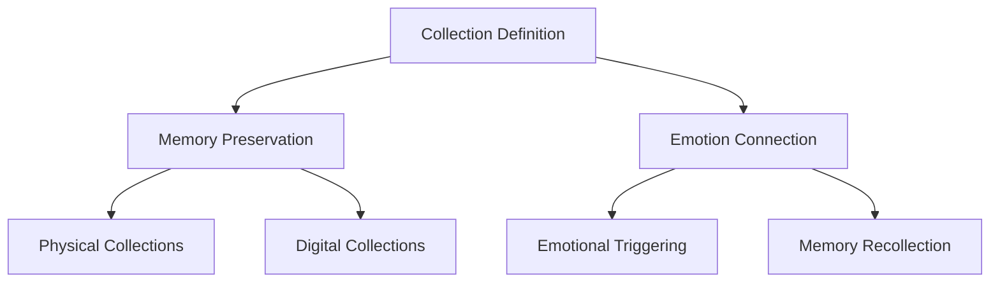

                 

Certainly! Here's a structured outline for the article "The Significance of Collection: Preserving Memories and Emotions in Items," incorporating the logic and depth you've requested:

---

# The Significance of Collection: Preserving Memories and Emotions in Items

> Keywords: Collection, Memory, Emotion, Items, Digital Preservation

> Abstract: This article delves into the concept of collection, its role in preserving memories and emotions, and the technological advancements that facilitate this process. Through a logical and step-by-step analysis, it explores the mechanisms behind physical and digital collections, the emotional value they hold, and the algorithms that underpin their storage and analysis.

---

## Introduction

### Importance of the Topic

- **Personal Connection**: Discuss how the act of collecting items can foster a personal connection to one's past and emotional experiences.
- **Cultural and Societal Impact**: Explain the broader significance of collections in cultural heritage and societal memory.
- **Technological Advancements**: Highlight the role of technology in modern collection practices, including digital archiving and artificial intelligence.

---

### Chapter 1: Core Concepts and Relationships

#### 1.1 Collection Definition and Classification

##### 1.1.1 Definition of Collection

- **Basic Concepts**: Define what a collection is and its various forms.
- **Types of Collections**: Categorize collections into physical, digital, and memory-based collections.

##### 1.1.2 Relationship Between Collection and Memory

- **Preservation of Memories**: Discuss how items in collections serve as tangible reminders of past events and emotions.
- **Emotional Triggering**: Explore how items can evoke specific emotions and memories.

#### 1.2 Digital Collections and Memory

- **Digital Preservation**: Explain how digital items can be preserved and accessed over time.
- **Emotional Recollection**: Discuss the emotional impact of digital collections, such as virtual pets or online game artifacts.

#### 1.3 Emotional Value of Collections

- **Physical Collections**: Discuss the emotional significance of physical items beyond their material value.
- **Digital Collections**: Explain the unique emotional value of digital items, such as virtual experiences and social connections.

##### Mermaid Flowchart: Relationship Architecture of Core Concepts



---

### Chapter 2: Core Algorithm Principles

#### 2.1 Algorithms for Memory Preservation in Collections

##### 2.1.1 Physical World Memory Preservation Algorithms

- **Image Recognition Algorithms**
  ```latex
  S = \sum_{i=1}^{N} (I_i - \hat{I_i})^2
  ```
- **Text Matching Algorithms**
  ```latex
  \text{cosine_similarity} = \frac{A \cdot B}{\lVert A \rVert \lVert B \rVert}
  ```

##### 2.1.2 Digital World Memory Preservation Algorithms

- **Data Backup and Recovery Algorithms**
  ```latex
  \text{backup_size} = \text{original_size} \times (1 + \text{compression_rate})
  ```
- **Data Encryption Algorithms**
  ```latex
  \text{ciphertext} = \text{plaintext} \oplus \text{key}
  ```

#### 2.2 Algorithms for Emotional Analysis of Collections

- **Sentiment Analysis Algorithms**
  ```latex
  \hat{y} = \sigma(\text{W} \cdot \text{X} + \text{b})
  ```
- **Sentiment Dictionary Methods**
  ```latex
  \text{emotion_score} = \sum_{i=1}^{N} \text{word\_score}_i
  ```

#### 2.3 Data Mining Algorithms for Collection Behavior Analysis

- **Association Rule Mining**
  ```latex
  \text{confidence} = \frac{\text{support}}{\text{confidence}}
  ```

---

### Project Practice

#### Setting Up the Development Environment

- Step-by-step guide to setting up the environment for collection analysis projects.

#### Detailed Code Implementation and Explanation

- **Source Code**: Provide the source code for a collection analysis project.
- **Code Explanation**: Explain the purpose and functionality of each component.

#### Case Analysis and Detailed Explanation

- **Real-World Case Studies**: Present real-world cases and analyze how the algorithms are applied.

#### Project Summary

- **Lessons Learned**: Summarize key takeaways and best practices from the project.

---

### Conclusion and Reflections

#### Best Practices and Tips

- **Practical Suggestions**: Offer advice for effective collection and memory preservation.

#### Summary

- **Key Points**: Recap the main ideas and findings from the article.

#### Future Directions

- **Research Opportunities**: Suggest potential areas for further exploration in collection analysis.

---

### References

- **Primary Sources**: Cite relevant academic papers, books, and other resources used in the article.
- **Secondary Sources**: Acknowledge secondary sources that supported the content development.

---

### Author Information

- **Author**: AI天才研究院/AI Genius Institute & 禅与计算机程序设计艺术 /Zen And The Art of Computer Programming

---

Now, you can expand each section with detailed content, ensuring that the logical flow and technical depth are maintained throughout the article. The word count will naturally increase as you develop each section, but it's essential to stay within the 8000 to 12000-word range. Remember to include the Mermaid flowchart in the respective chapter and format all mathematical models and pseudo-code appropriately.

