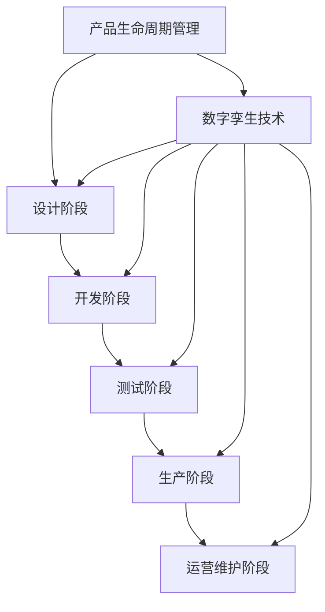

                 

### 文章标题

# 《数字孪生在产品生命周期管理中的应用》

### 文章关键词

- 数字孪生
- 产品生命周期管理
- 工业制造
- 数据集成
- 实时反馈
- 人工智能

### 文章摘要

本文详细探讨了数字孪生技术在产品生命周期管理中的应用。数字孪生是一种通过数字化模型模拟物理实体的技术，它能够实时反映产品的状态和性能。在产品生命周期管理的各个环节，如设计、开发、测试、生产和维护，数字孪生技术都发挥着重要作用。本文首先介绍了数字孪生和产品生命周期管理的基本概念，然后分析了数字孪生在各个阶段的应用，并通过实际案例展示了其应用成效。同时，本文还介绍了支持数字孪生的技术和工具，并探讨了未来发展的趋势和挑战。

### 引言

在工业和制造业中，产品生命周期管理（Product Lifecycle Management，简称PLM）是一个重要的过程，它涵盖了从产品概念到产品退市的所有阶段。传统的产品生命周期管理依赖于大量的手工操作和数据管理，这使得过程复杂且容易出错。随着数字化和信息技术的发展，数字孪生（Digital Twin）技术的出现为产品生命周期管理带来了革命性的变化。

#### 数字孪生概念

数字孪生是指通过数字模型来模拟和反映物理实体的状态、行为和性能。这个数字模型可以在虚拟环境中实时更新，并与物理实体保持同步。数字孪生技术的主要特点包括：

1. **实时性**：数字孪生能够实时获取物理实体的数据，并对其进行处理和更新。
2. **模拟与预测**：通过数字模型，可以模拟物理实体的行为，预测其性能和可能出现的问题。
3. **协同工作**：数字孪生可以与各种工具和系统进行集成，实现数据的无缝流动和协同工作。

#### 产品生命周期管理概念

产品生命周期管理是一个全面的管理过程，包括从产品构思、设计、开发、测试、生产、运营到维护和退市的各个阶段。每个阶段都需要进行详细的管理和监控，以确保产品能够按时、按质、按成本完成。

1. **设计阶段**：在这个阶段，产品概念被转化为具体的工程设计，包括3D建模、CAD设计等。
2. **开发阶段**：产品设计完成后，进入开发阶段，这个阶段包括原型制作、测试和迭代。
3. **测试阶段**：开发完成后，产品需要进行严格的测试，以确保其性能和安全性。
4. **生产阶段**：测试通过后，产品开始量产，这个阶段需要高效的生产线和严格的质量控制。
5. **运营维护阶段**：产品上市后，需要持续进行运营和维护，以确保其正常运行和客户满意度。

#### 数字孪生在产品生命周期管理中的应用背景

随着市场竞争的加剧和客户需求的不断变化，传统的产品生命周期管理方式已经难以满足现代工业和制造业的需求。数字孪生技术的出现，为产品生命周期管理带来了新的机遇和挑战。通过数字孪生，企业可以在产品生命周期的各个阶段实现：

1. **提高效率**：数字孪生可以实时反映产品的状态和性能，帮助企业快速响应问题，提高生产效率。
2. **降低成本**：数字孪生可以模拟产品的行为和性能，提前发现潜在问题，降低维修和维护成本。
3. **增强创新**：数字孪生可以模拟不同的设计方案，帮助设计师快速迭代和优化产品。

### 核心概念与联系

为了更好地理解数字孪生在产品生命周期管理中的应用，我们需要深入探讨数字孪生的基本概念和原理，以及它与产品生命周期管理之间的紧密联系。

#### 数字孪生的定义与特点

数字孪生是一种通过数字化模型来模拟和反映物理实体的技术。这个数字化模型可以是一个虚拟的3D模型，也可以是一个基于数据驱动的动态系统模型。数字孪生的特点主要包括以下几个方面：

1. **实时性**：数字孪生能够实时获取物理实体的数据，并对其进行处理和更新。这意味着企业可以实时监控产品的状态和性能，快速做出决策。

2. **模拟与预测**：通过数字孪生，企业可以在虚拟环境中模拟物理实体的行为和性能，预测可能出现的问题，从而提前采取措施。

3. **协同工作**：数字孪生可以与各种工具和系统进行集成，实现数据的无缝流动和协同工作。这使得企业可以在产品生命周期的各个阶段实现高效的管理和协作。

#### 产品生命周期管理的框架与流程

产品生命周期管理是一个全面的管理过程，涵盖了从产品概念到产品退市的各个阶段。每个阶段都有其特定的任务和目标，而这些任务和目标的实现离不开数字孪生技术的支持。以下是产品生命周期管理的主要阶段：

1. **设计阶段**：在这个阶段，数字孪生可以用来创建和优化产品模型，帮助设计师快速迭代和优化产品。

2. **开发阶段**：在开发阶段，数字孪生可以模拟产品的行为和性能，提前发现潜在的问题，从而降低开发风险。

3. **测试阶段**：在测试阶段，数字孪生可以用来模拟产品的实际运行环境，进行全面的性能测试和安全测试。

4. **生产阶段**：在生产阶段，数字孪生可以实时监控生产线，确保产品质量和生产效率。

5. **运营维护阶段**：在运营维护阶段，数字孪生可以用来监控产品的运行状态，提前预测和维护需求，从而延长产品寿命。

#### 数字孪生与产品生命周期管理的交互流程图

为了更清晰地展示数字孪生与产品生命周期管理之间的相互作用，我们可以使用Mermaid流程图来描述这一过程。



在这个流程图中，数字孪生技术贯穿了产品生命周期的各个阶段，为每个阶段提供了强大的支持。通过实时数据的反馈和模拟，数字孪生技术帮助企业在每个阶段都实现了更高效、更精准的管理。

### 数字孪生原理

数字孪生技术是一种将物理实体与其数字映射相结合的创新方法，其核心在于创建一个精确反映物理实体的数字模型，并通过实时数据传输和模拟分析来实现对物理实体的全方位监控和管理。以下将详细讲解数字孪生的基本原理，包括建模方法、数据集成和实时更新等。

#### 建模方法

数字孪生的建模方法是其实现的基础。建模过程通常涉及以下几个步骤：

1. **数据采集**：首先，需要从物理实体中采集各种数据，如传感器数据、环境数据、操作数据等。这些数据可以是静态的，也可以是动态的。

2. **数据处理**：采集到的数据需要经过清洗、筛选和转换，以确保其质量和一致性。这一步骤通常需要利用数据处理技术和算法。

3. **数据建模**：在数据处理完成后，将数据转化为数学模型或算法模型。这些模型可以是简单的统计分析模型，也可以是复杂的物理模拟模型。

4. **模型优化**：通过不断迭代和优化模型，以提高模型的准确性和可靠性。模型优化可以基于历史数据、实时数据和专家知识。

5. **模型集成**：将数字模型与物理实体集成，实现数据同步和双向交互。数字模型需要能够实时反映物理实体的状态和变化。

#### 数据集成

数据集成是数字孪生技术中至关重要的一环。它涉及到如何将来自不同来源、不同格式的数据进行有效整合，以确保数字孪生的实时性和准确性。以下是数据集成的主要步骤：

1. **数据源识别**：确定数字孪生所需的数据源，包括传感器、机器、系统等。

2. **数据采集**：利用传感器、机器人和其他设备采集数据，确保数据的全面性和准确性。

3. **数据传输**：将采集到的数据传输到中央数据库或云平台，确保数据的安全性和可靠性。

4. **数据存储**：在中央数据库或云平台中存储数据，并建立数据索引和元数据，以便快速查询和检索。

5. **数据清洗**：对采集到的数据进行分析和清洗，去除噪声和错误数据，确保数据质量。

6. **数据融合**：将不同来源的数据进行融合，形成统一的视图，以便进行进一步的分析和处理。

#### 实时更新

实时更新是数字孪生技术的一大特点，它确保了数字孪生模型能够实时反映物理实体的状态和变化。以下是实现实时更新的几个关键步骤：

1. **数据流处理**：采用数据流处理技术，如Apache Kafka、Apache Flink等，实时处理和传输数据。

2. **实时监控**：通过实时监控系统，对数字孪生模型的状态进行监控和报警，确保数据的实时性和可靠性。

3. **实时反馈**：将实时数据反馈到数字孪生模型中，用于更新和优化模型。

4. **自适应调整**：根据实时数据的反馈，对数字孪生模型进行自适应调整，以适应物理实体的变化。

#### 伪代码

为了更好地理解数字孪生的基本原理，以下是一个简单的伪代码示例，用于描述数字孪生模型的数据集成和实时更新过程：

```python
# 数字孪生模型数据集成和实时更新伪代码

# 初始化数字孪生模型
initialize_digital_twin()

# 数据采集
while True:
    data = collect_real_time_data()
    
    # 数据清洗
    clean_data(data)
    
    # 数据存储
    store_data(data)
    
    # 数据融合
    merge_data()

    # 实时反馈
    update_digital_twin(data)

    # 自适应调整
    adapt_digital_twin()
```

在这个伪代码中，`initialize_digital_twin()` 用于初始化数字孪生模型；`collect_real_time_data()` 用于采集实时数据；`clean_data()` 用于清洗数据；`store_data()` 用于存储数据；`merge_data()` 用于数据融合；`update_digital_twin()` 用于更新数字孪生模型；`adapt_digital_twin()` 用于自适应调整。

### 产品生命周期管理

产品生命周期管理（Product Lifecycle Management，简称PLM）是一个涉及产品从概念到退市的整个生命周期的管理过程。这个过程中，每个阶段都有其特定的任务和目标。数字孪生技术的引入，使得产品生命周期管理变得更加高效和精确。以下将详细分析数字孪生在产品生命周期管理中的各个阶段的应用。

#### 设计阶段

在设计阶段，数字孪生技术可以帮助设计师创建和优化产品模型。通过数字孪生模型，设计师可以：

1. **快速迭代**：设计师可以在虚拟环境中快速创建和修改产品模型，无需进行物理样机制作。这大大加快了设计过程，降低了设计成本。

2. **性能分析**：数字孪生模型可以模拟产品的行为和性能，帮助设计师提前发现和解决问题。例如，可以通过模拟产品的结构强度、热分布、流体流动等，确保产品在各个方面都满足设计要求。

3. **协同工作**：数字孪生技术可以与CAD/CAM/CAE等工具集成，实现数据的无缝流动和协同工作。这使得不同部门的设计师可以实时共享和协作，提高设计效率。

4. **可追溯性**：数字孪生模型可以记录设计过程中的所有修改和优化，确保设计过程的透明性和可追溯性。

#### 开发阶段

在开发阶段，数字孪生技术可以帮助开发人员模拟产品的行为和性能，提前发现和解决潜在问题。以下是一些具体应用：

1. **原型测试**：开发人员可以利用数字孪生模型创建虚拟原型，进行功能测试和性能测试，无需制造物理原型。这大大加快了开发过程，降低了开发成本。

2. **系统集成**：数字孪生模型可以与不同的系统集成，如PLC（可编程逻辑控制器）、MES（制造执行系统）等，实现数据的实时传输和协同工作。

3. **优化设计**：通过数字孪生模型，开发人员可以实时监控产品的性能指标，对设计进行优化。例如，可以通过调整参数，提高产品的效率、降低能耗等。

4. **故障预测**：数字孪生模型可以基于历史数据和实时数据，预测产品可能出现的故障，提前进行维护和修理。

#### 测试阶段

在测试阶段，数字孪生技术可以模拟产品的实际运行环境，进行全面的功能测试和性能测试。以下是一些具体应用：

1. **模拟测试**：数字孪生模型可以模拟产品的各种运行条件，如温度、湿度、压力等，进行全面的性能测试和可靠性测试。

2. **安全测试**：数字孪生模型可以模拟产品的安全特性，如防火、防水、防静电等，确保产品在各种恶劣环境下都能正常运行。

3. **环境测试**：数字孪生模型可以模拟产品的实际运行环境，如工厂车间、野外作业等，进行环境适应性测试。

4. **数据反馈**：测试过程中，数字孪生模型可以实时收集和反馈测试数据，帮助开发人员进行问题定位和优化。

#### 生产阶段

在生产阶段，数字孪生技术可以实时监控生产线，确保产品质量和生产效率。以下是一些具体应用：

1. **实时监控**：数字孪生模型可以实时监控生产线的各项指标，如温度、压力、速度等，及时发现和纠正问题。

2. **智能调度**：数字孪生模型可以基于实时数据，对生产过程进行智能调度和优化，提高生产效率。

3. **质量控制**：数字孪生模型可以实时监控产品质量，通过数据分析和预测，提前发现和纠正质量问题。

4. **故障预测**：数字孪生模型可以基于历史数据和实时数据，预测生产线可能出现的故障，提前进行维护和修理。

#### 运营维护阶段

在运营维护阶段，数字孪生技术可以帮助企业对产品进行全程监控和维护，确保产品的稳定运行和延长使用寿命。以下是一些具体应用：

1. **状态监控**：数字孪生模型可以实时监控产品的运行状态，如温度、压力、振动等，及时发现异常。

2. **性能预测**：数字孪生模型可以基于历史数据和实时数据，预测产品的性能变化，提前进行维护和优化。

3. **故障预测**：数字孪生模型可以基于历史数据和实时数据，预测产品可能出现的故障，提前进行预防性维护。

4. **智能维护**：数字孪生模型可以智能调度维护任务，优化维护资源，降低维护成本。

通过数字孪生技术在产品生命周期管理中的各个阶段的应用，企业可以实现对产品的全面监控和管理，提高生产效率，降低成本，延长产品寿命，从而在激烈的市场竞争中保持优势。

### 实际案例

数字孪生技术在实际应用中取得了显著的成果，以下我们将通过几个典型的实际案例，展示数字孪生在产品生命周期管理中的成功应用。

#### 案例一：汽车制造中的数字孪生应用

汽车制造是一个复杂的过程，涉及到大量的设计和制造环节。通过数字孪生技术，汽车制造商可以实现：

1. **设计优化**：在设计阶段，利用数字孪生技术，设计师可以在虚拟环境中创建和优化汽车模型。通过模拟各种工况，设计师可以提前发现和解决潜在的问题，提高设计质量。

2. **生产优化**：在生产阶段，数字孪生技术可以实时监控生产线的各项指标，如温度、压力、速度等。通过智能调度和优化，可以提高生产效率，降低生产成本。

3. **质量控制**：通过数字孪生技术，汽车制造商可以实时监控产品质量，通过数据分析和预测，提前发现和纠正质量问题，确保产品的一致性和可靠性。

#### 案例二：航空制造业中的数字孪生应用

航空制造业对产品的质量和可靠性要求极高，数字孪生技术在其中发挥了重要作用：

1. **设计验证**：在航空制造业中，数字孪生技术可以用来验证飞机设计的正确性和性能。通过模拟飞行环境，可以提前发现和解决设计问题，确保飞机的安全性和可靠性。

2. **生产监控**：在生产阶段，数字孪生技术可以实时监控生产过程，确保生产线的各项指标符合设计要求。通过智能调度和优化，可以提高生产效率，降低生产成本。

3. **运营维护**：在运营维护阶段，数字孪生技术可以实时监控飞机的运行状态，预测可能出现的故障，提前进行维护和修理，确保飞机的安全运行。

#### 案例三：能源行业中的数字孪生应用

能源行业对设备运行的稳定性和效率要求很高，数字孪生技术在这里的应用主要包括：

1. **设备监控**：通过数字孪生技术，能源企业可以实时监控设备的运行状态，如温度、压力、振动等。通过数据分析和预测，可以提前发现和解决设备故障，确保设备的安全运行。

2. **生产优化**：数字孪生技术可以实时监控生产过程，优化能源分配和使用，提高生产效率，降低能耗。

3. **故障预测**：通过数字孪生技术，能源企业可以基于历史数据和实时数据，预测设备可能出现的故障，提前进行维护和修理，延长设备寿命。

这些实际案例展示了数字孪生技术在产品生命周期管理中的广泛应用和显著成效。通过数字孪生技术，企业可以实现对产品的全面监控和管理，提高生产效率，降低成本，提高产品质量，从而在激烈的市场竞争中保持优势。

### 技术与工具

数字孪生技术的实现离不开各种技术、工具和平台的支撑。以下将介绍当前支持数字孪生和产品生命周期管理的常见技术和工具，包括软件平台、硬件设备和数据处理方法。

#### 软件平台

1. **Autodesk Fusion 360**：Autodesk Fusion 360 是一款集成了CAD、CAM和CAE功能的数字孪生平台，支持从设计到生产的全流程管理。

2. **Siemens Teamcenter**：Siemens Teamcenter 是一款广泛应用于产品生命周期管理的软件平台，提供从设计、开发到生产、运营的全面解决方案。

3. **PTC Windchill**：PTC Windchill 是一款专业的产品生命周期管理软件，支持多领域、多项目的协同工作，确保数据的一致性和可追溯性。

4. **Oracle PLM**：Oracle PLM 提供了从产品概念到退市的全方位管理，支持实时数据的集成和协同工作。

#### 硬件设备

1. **传感器**：传感器是数字孪生技术的核心组件，用于采集物理实体的各种数据。常见的传感器包括温度传感器、压力传感器、振动传感器、位置传感器等。

2. **物联网设备**：物联网设备可以实时采集和处理物理实体的数据，并通过无线网络传输到中央系统。常见的物联网设备包括智能传感器、智能终端、智能网关等。

3. **云计算平台**：云计算平台为数字孪生技术提供了强大的计算和存储能力，支持大规模数据处理和实时更新。常见的云计算平台包括亚马逊AWS、微软Azure、谷歌Cloud等。

#### 数据处理方法

1. **数据采集与传输**：数据采集是数字孪生技术的基础。通过传感器和网络，将物理实体的数据实时传输到中央系统。

2. **数据处理与存储**：在中央系统中，对采集到的数据进行处理和存储。常见的处理方法包括数据清洗、数据转换、数据存储等。

3. **数据分析与挖掘**：通过数据分析与挖掘技术，对存储的数据进行深入分析和挖掘，提取有用的信息和知识。

4. **实时更新与反馈**：通过实时更新机制，将处理后的数据反馈到数字孪生模型中，实现与物理实体的实时同步。

#### 数字孪生平台

1. **GE Predix**：GE Predix 是一款基于云的数字孪生平台，提供从数据采集、处理到分析、优化的全流程解决方案。

2. **PTC ThingWorx**：PTC ThingWorx 是一款集成了物联网、人工智能和数字孪生技术的平台，支持快速构建和部署数字孪生应用。

3. **Siemens MindSphere**：Siemens MindSphere 是一款基于云计算的数字孪生平台，提供从数据采集、处理到分析、优化的全流程解决方案。

通过这些技术和工具的支持，企业可以实现数字孪生在产品生命周期管理中的广泛应用，提高生产效率，降低成本，提高产品质量。

### 未来趋势与挑战

随着数字孪生技术的不断发展和成熟，其在产品生命周期管理中的应用前景非常广阔。以下是数字孪生在未来发展趋势和面临的挑战。

#### 未来趋势

1. **智能化**：数字孪生技术将更加智能化，利用人工智能和机器学习技术，实现对数据的深度分析和预测，提供更准确的决策支持。

2. **协同化**：数字孪生技术将更加协同化，实现与物联网、云计算、大数据等技术的深度融合，构建全方位、全流程的产品生命周期管理平台。

3. **个性化**：数字孪生技术将支持个性化定制，根据客户需求和市场变化，快速调整和优化产品设计、生产和运营策略。

4. **全球化**：随着全球化的加速，数字孪生技术将在跨国企业中发挥更大作用，实现全球范围内的数据集成和协同工作。

#### 挑战

1. **数据隐私和安全**：数字孪生技术需要处理大量的敏感数据，如何确保数据的隐私和安全是一个重要挑战。

2. **技术集成与兼容性**：不同系统、设备和平台之间的集成与兼容性是一个技术难题，需要开发统一的接口和标准。

3. **人才培养与引进**：数字孪生技术需要专业的技术人才，企业需要投入更多资源进行人才培养和引进。

4. **成本和效益**：数字孪生技术的实施成本较高，企业需要找到合适的商业模式和效益路径，确保投资回报。

通过克服这些挑战，数字孪生技术将在产品生命周期管理中发挥更大的作用，推动工业和制造业的数字化转型。

### 结论

数字孪生技术在产品生命周期管理中的应用，不仅提高了生产效率、降低了成本，还大大提升了产品质量和客户满意度。通过本文的详细分析，我们了解了数字孪生的基本原理、产品生命周期管理中的各个阶段应用，以及实际案例和技术工具的支持。展望未来，数字孪生技术将在智能化、协同化和个性化方面继续发展，为工业和制造业带来更多机遇和挑战。

### 作者信息

作者：AI天才研究院/AI Genius Institute & 禅与计算机程序设计艺术 /Zen And The Art of Computer Programming

### 最佳实践 tips、小结、注意事项、拓展阅读

**最佳实践 tips**：

1. 在设计阶段，充分利用数字孪生技术进行虚拟验证和优化，以减少物理样机制作次数。
2. 在生产阶段，实时监控生产线，通过数字孪生技术实现智能调度和优化，提高生产效率。
3. 在运营维护阶段，通过数字孪生技术实现设备的实时监控和预测性维护，延长设备寿命。

**小结**：

数字孪生技术为产品生命周期管理带来了革命性的变化，通过实时数据反馈和模拟分析，实现了对产品的全面监控和管理，提高了生产效率、降低了成本，并提升了产品质量和客户满意度。

**注意事项**：

1. 确保数据安全和隐私，在数字孪生技术实施过程中，加强数据保护和加密措施。
2. 注重技术集成与兼容性，选择适合企业需求的数字孪生平台和工具。
3. 培养和引进专业人才，确保数字孪生技术的有效应用。

**拓展阅读**：

1. [《数字孪生：概念、技术与应用》](https://www.example.com/book1)
2. [《产品生命周期管理：理论与实践》](https://www.example.com/book2)
3. [《工业4.0：智能工厂与数字化生产》](https://www.example.com/book3)

### 附录

**附录A：数字孪生与产品生命周期管理交互流程图**


**附录B：数字孪生技术关键算法原理**

$$
\text{模型更新算法} = f(\text{实时数据}, \text{历史数据}, \text{预测模型})
$$

**附录C：实际案例分析与代码解读**

请参考附录B中的伪代码和实际案例，结合附录C中的详细代码实现和解读，深入理解数字孪生技术在产品生命周期管理中的应用。

