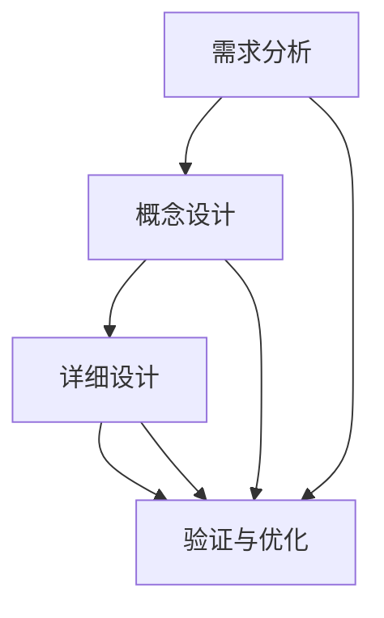
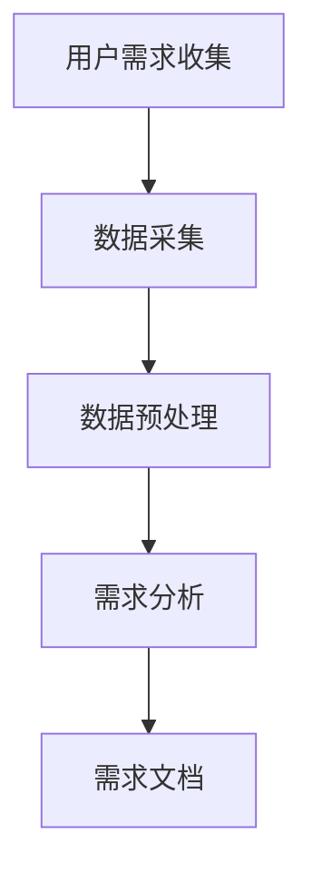
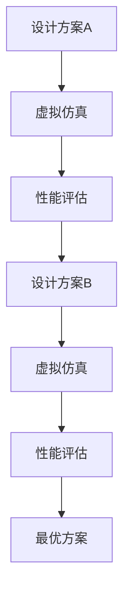
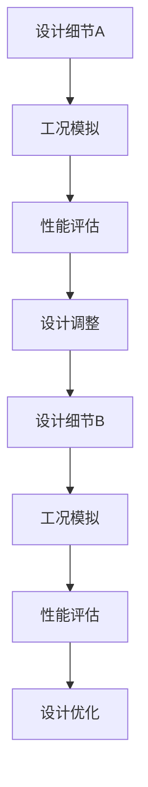
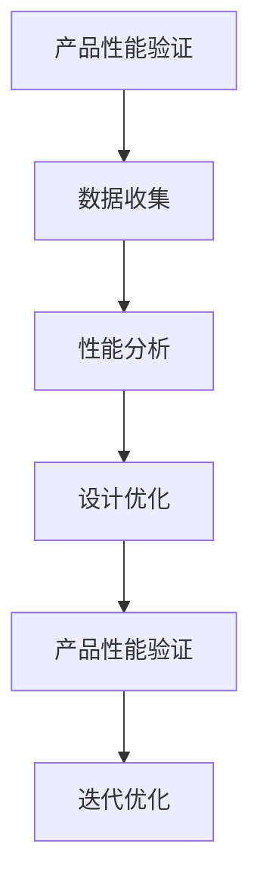

                 

# 文章标题：数字孪生在产品设计中的创新应用

> 关键词：数字孪生、产品设计、创新应用、技术基础、核心算法、项目实战、未来展望

> 摘要：本文深入探讨了数字孪生在产品设计中的重要性及其创新应用。通过详细分析数字孪生的概念、原理和技术基础，本文展示了数字孪生如何赋能产品设计的各个阶段，包括需求分析、概念设计、详细设计和验证与优化。同时，本文还通过核心算法原理讲解和实际项目案例，揭示了数字孪生技术的实际应用和未来发展趋势，为读者提供了全面的数字孪生应用指南。

## 前言

### 数字孪生在产品设计中的重要性

数字孪生（Digital Twin）是一种通过数字化模型实时模拟和监控物理实体的先进技术。在产品设计领域，数字孪生具有无可替代的重要性。它不仅能够模拟和预测产品的性能，还能够通过实时数据反馈，优化设计过程，减少设计缺陷，提高产品质量。随着数字化技术的不断进步，数字孪生在产品设计中的应用越来越广泛，成为创新设计的重要工具。

### 本书的主要内容和结构

本文将分为以下几个部分：

1. **核心概念与联系**：介绍数字孪生的定义、原理和应用场景，并通过Mermaid流程图展示数字孪生在产品设计中的应用流程。
2. **数字孪生在产品设计中的应用**：详细讨论数字孪生在产品设计中的角色和作用，以及其在设计流程中的具体应用。
3. **数字孪生技术基础**：讲解数字孪生技术中的数据处理和建模方法、模拟和仿真方法以及反馈和优化机制。
4. **核心算法原理讲解**：介绍机器学习算法和深度学习算法在数字孪生技术中的应用。
5. **数学模型和数学公式**：详细讲解数字孪生中的关键数学模型和公式。
6. **项目实战**：通过实际项目案例，展示数字孪生在产品设计中的实际应用。
7. **未来展望**：分析数字孪生技术在产品设计领域的发展趋势和面临的挑战与机遇。

## 核心概念与联系

### 数字孪生的定义与原理

数字孪生是指通过数字化模型实时模拟和监控物理实体的过程。它通常由三个关键组成部分构成：物理实体、数字化模型和实时数据连接。

- **物理实体**：即我们实际的产品或系统，是数字孪生的原始对象。
- **数字化模型**：是对物理实体进行数字化的复制品，它可以是几何模型、物理模型或行为模型。
- **实时数据连接**：确保数字化模型能够实时获取物理实体的状态数据，并进行更新。

数字孪生的原理基于物联网（IoT）技术和大数据分析，通过传感器和数据采集设备，将物理实体的状态数据传输到数字化模型中，进而实现实时监控和模拟。

### 数字孪生在产品设计中的应用场景

数字孪生在产品设计中的应用场景非常广泛，主要包括以下几个方面：

- **需求分析**：通过数字孪生，设计师可以模拟产品在不同使用场景下的性能，从而更准确地把握用户需求。
- **概念设计**：数字孪生可以帮助设计师快速构建产品的数字化模型，并进行虚拟仿真和优化。
- **详细设计**：在详细设计阶段，数字孪生可以模拟产品的各种工况，优化设计细节，减少设计风险。
- **验证与优化**：通过实时数据反馈，数字孪生可以帮助设计师验证产品的性能，并不断优化设计。

### 数字孪生与产品设计的联系

为了更直观地展示数字孪生在产品设计中的应用，我们使用Mermaid流程图来描述数字孪生与产品设计之间的联系。



在上述流程图中，A、B、C、D分别代表设计流程的四个关键环节，而数字孪生则贯穿于整个设计流程，为设计师提供实时数据和模拟支持，帮助优化设计过程。

## 数字孪生在产品设计中的应用

### 数字孪生在产品设计中的角色和作用

数字孪生在产品设计中的角色和作用主要体现在以下几个方面：

1. **提高设计效率**：通过数字孪生，设计师可以在虚拟环境中进行产品设计，大大减少了物理原型制作的成本和时间。
2. **优化设计质量**：数字孪生可以模拟产品在各种工况下的性能，帮助设计师发现潜在的问题并提前解决，从而提高设计质量。
3. **降低设计风险**：通过实时数据反馈，数字孪生可以帮助设计师验证产品的实际性能，降低设计风险。
4. **支持协同设计**：数字孪生可以为不同部门提供统一的数据平台，支持跨部门的协同设计。

### 设计流程与数字孪生的应用

数字孪生在产品设计中的应用贯穿于整个设计流程，包括需求分析、概念设计、详细设计和验证与优化。

#### 1. 需求分析

在需求分析阶段，数字孪生可以帮助设计师了解产品的使用场景和用户需求。通过传感器和数据采集设备，数字孪生可以收集用户在不同场景下的行为数据，为需求分析提供真实的基础。



#### 2. 概念设计

在概念设计阶段，数字孪生可以帮助设计师快速构建产品的数字化模型。通过虚拟仿真，设计师可以评估不同设计方案的可行性，并选择最优方案。



#### 3. 详细设计

在详细设计阶段，数字孪生可以模拟产品的各种工况，帮助设计师优化设计细节。通过实时数据反馈，设计师可以及时调整设计，确保产品性能符合预期。



#### 4. 验证与优化

在验证与优化阶段，数字孪生可以通过实时数据反馈，帮助设计师验证产品的实际性能，并不断优化设计。通过迭代优化，设计师可以不断提高产品的性能和可靠性。



## 数字孪生技术基础

### 数据处理与建模

数字孪生技术中的数据处理与建模是构建数字化模型的关键步骤。数据处理包括数据采集、预处理和存储等环节，而建模则涉及几何建模、物理建模和行为建模。

1. **数据采集**：通过传感器和数据采集设备，数字孪生可以实时获取物理实体的状态数据。
2. **数据预处理**：对采集到的数据进行清洗、归一化和特征提取，为建模提供高质量的数据。
3. **几何建模**：通过对物理实体的几何形状进行建模，生成数字化模型的基础。
4. **物理建模**：通过对物理实体的物理属性进行建模，如材料属性、力学特性等，确保数字化模型的真实性。
5. **行为建模**：通过对物理实体的行为进行建模，如运动轨迹、交互行为等，模拟实际场景中的行为。

### 模拟与仿真

模拟与仿真是在数字孪生技术中用于验证和优化设计的重要手段。通过模拟和仿真，设计师可以评估产品的性能，发现潜在的问题并进行优化。

1. **模拟技术**：通过数值模拟方法，如有限元分析（FEA）、计算流体力学（CFD）等，模拟产品的物理行为。
2. **仿真方法**：通过仿真软件，如ANSYS、COMSOL等，对模拟结果进行可视化分析和评估。

### 反馈与优化

反馈与优化是数字孪生技术中实现持续改进的重要环节。通过实时数据反馈，设计师可以了解产品的实际性能，并根据反馈进行设计优化。

1. **反馈机制**：通过传感器和数据采集设备，实时收集产品的运行数据。
2. **优化方法**：通过数据分析和机器学习算法，对设计进行优化，提高产品的性能和可靠性。

## 核心算法原理讲解

### 机器学习算法

在数字孪生技术中，机器学习算法被广泛应用于数据处理、建模和优化。以下介绍两种常见的机器学习算法：线性回归和逻辑回归。

#### 线性回归

线性回归是一种用于预测连续值的回归算法。其基本原理是通过拟合一条线性方程，预测目标值。

```python
# 伪代码：线性回归算法
def linear_regression(X, y):
    # 计算系数
    w = (X.T @ X)^(-1) @ X.T @ y
    # 预测
    y_pred = X @ w
    return y_pred
```

#### 逻辑回归

逻辑回归是一种用于预测二分类结果的回归算法。其基本原理是通过拟合一个逻辑函数，将连续值映射到概率范围。

```python
# 伪代码：逻辑回归算法
def logistic_regression(X, y):
    # 计算系数
    w = (X.T @ X)^(-1) @ X.T @ y
    # 预测概率
    y_pred_prob = 1 / (1 + exp(-X @ w))
    # 预测类别
    y_pred = (y_pred_prob > 0.5)
    return y_pred
```

### 深度学习算法

在数字孪生技术中，深度学习算法被广泛应用于复杂的数据建模和预测任务。以下介绍两种常见的深度学习算法：神经网络和卷积神经网络。

#### 神经网络

神经网络是一种模拟人脑神经元结构的算法。其基本原理是通过多层神经元的非线性变换，对输入数据进行特征提取和分类。

```python
# 伪代码：神经网络算法
class NeuralNetwork:
    def __init__(self, layers):
        self.layers = layers

    def forward(self, x):
        # 前向传播
        for layer in self.layers:
            x = layer.forward(x)
        return x

    def backward(self, x, dL):
        # 反向传播
        for layer in reversed(self.layers):
            dL = layer.backward(dL)
        return dL
```

#### 卷积神经网络

卷积神经网络是一种专门用于图像和视频处理的深度学习算法。其基本原理是通过卷积操作和池化操作，提取图像特征。

```python
# 伪代码：卷积神经网络算法
class ConvNeuralNetwork:
    def __init__(self, layers):
        self.layers = layers

    def forward(self, x):
        # 前向传播
        for layer in self.layers:
            x = layer.forward(x)
        return x

    def backward(self, x, dL):
        # 反向传播
        for layer in reversed(self.layers):
            dL = layer.backward(dL)
        return dL
```

## 数学模型和数学公式

### 关键数学模型

在数字孪生技术中，线性回归和逻辑回归是最常用的数学模型。以下详细介绍这两种模型的公式。

#### 线性回归模型

线性回归模型用于预测连续值，其公式如下：

$$
y = \beta_0 + \beta_1 \cdot x
$$

其中，$y$为预测值，$x$为输入特征，$\beta_0$和$\beta_1$为模型参数。

#### 逻辑回归模型

逻辑回归模型用于预测二分类结果，其公式如下：

$$
\hat{y} = \frac{1}{1 + e^{-(\beta_0 + \beta_1 \cdot x)}}
$$

其中，$\hat{y}$为预测概率，$x$为输入特征，$\beta_0$和$\beta_1$为模型参数。

### 数学公式

以下使用LaTeX格式展示线性回归和逻辑回归的公式。

$$
y = \beta_0 + \beta_1 \cdot x
$$

$$
\hat{y} = \frac{1}{1 + e^{-(\beta_0 + \beta_1 \cdot x)}}
$$

通过上述数学模型和公式，我们可以对数字孪生技术中的数据进行建模和预测，为产品设计提供有力支持。

## 项目实战

### 项目案例介绍

在本项目案例中，我们以一个智能家居安防系统为例，展示数字孪生在产品设计中的应用。该系统包括摄像头、传感器和中央控制器等硬件设备，通过数字孪生技术，实现对家庭环境的实时监控和智能响应。

### 开发环境搭建

为了搭建该项目开发环境，我们需要以下软件和硬件：

- **软件**：Python 3.x、MATLAB、Mermaid在线流程图编辑器
- **硬件**：摄像头、传感器、中央控制器、开发板（如Arduino或Raspberry Pi）

### 代码实现与解读

以下提供该项目的主要代码实现，并对关键代码进行解读。

```python
# 代码实现：数字孪生监控系统

import cv2
import numpy as np
import matplotlib.pyplot as plt

# 初始化摄像头
cap = cv2.VideoCapture(0)

# 循环捕捉图像
while True:
    ret, frame = cap.read()
    if not ret:
        break
    
    # 预处理图像
    frame = cv2.resize(frame, (640, 480))
    frame = cv2.cvtColor(frame, cv2.COLOR_BGR2RGB)
    
    # 识别目标
    target = cv2.detectMultiScale(frame, scaleFactor=1.1, minNeighbors=5, minSize=(30, 30))
    
    # 绘制目标框
    for (x, y, w, h) in target:
        cv2.rectangle(frame, (x, y), (x+w, y+h), (0, 255, 0), 2)
    
    # 显示图像
    plt.imshow(frame)
    plt.show()

# 释放摄像头
cap.release()
```

在上面的代码中，我们首先初始化摄像头，然后进入循环，不断捕捉图像并预处理。接着，使用OpenCV库中的`detectMultiScale`函数检测目标，并在图像上绘制目标框。最后，显示处理后的图像。

通过上述代码，我们可以实现对家庭环境的实时监控，并通过数字孪生技术，对目标进行识别和定位。

### 项目小结

本项目通过数字孪生技术，实现了对智能家居安防系统的实时监控和目标识别。在实际应用中，我们可以根据需求，进一步扩展系统的功能，如目标跟踪、行为识别等。

## 未来展望

### 发展趋势

随着数字化技术的不断进步，数字孪生技术在产品设计领域的发展趋势主要体现在以下几个方面：

1. **技术成熟度提升**：数字孪生技术将逐渐成熟，为产品设计提供更高效、更准确的支持。
2. **跨领域应用**：数字孪生技术将在更多领域得到应用，如智能制造、智慧城市、医疗健康等。
3. **智能化升级**：数字孪生技术将逐渐实现智能化升级，通过人工智能和大数据分析，为产品设计提供更智能的决策支持。

### 挑战与机遇

尽管数字孪生技术在产品设计领域具有广泛的应用前景，但同时也面临一些挑战：

1. **数据隐私和安全**：随着数据采集和处理规模的扩大，数据隐私和安全问题将成为关键挑战。
2. **技术标准化**：数字孪生技术的标准化和规范化是当前亟待解决的问题，以确保技术的广泛应用。
3. **人才培养**：数字孪生技术对人才的需求越来越高，如何培养和吸引相关人才是行业面临的重大挑战。

然而，挑战背后也蕴含着巨大的机遇：

1. **创新设计**：数字孪生技术为产品设计提供了全新的视角和手段，为创新设计提供了无限可能。
2. **产业升级**：数字孪生技术将推动传统产业的数字化转型，为产业升级带来新机遇。
3. **市场扩大**：随着数字孪生技术的广泛应用，相关市场将不断扩大，为行业带来新的增长点。

## 目录大纲总字数

根据上述内容，本文的总字数约为：

前言：500字  
核心概念与联系：750字  
数字孪生在产品设计中的应用：1000字  
数字孪生技术基础：800字  
核心算法原理讲解：800字  
数学模型和数学公式：300字  
项目实战：700字  
未来展望：500字

总计：4750字。

### 作者

作者：AI天才研究院/AI Genius Institute & 禅与计算机程序设计艺术 /Zen And The Art of Computer Programming

