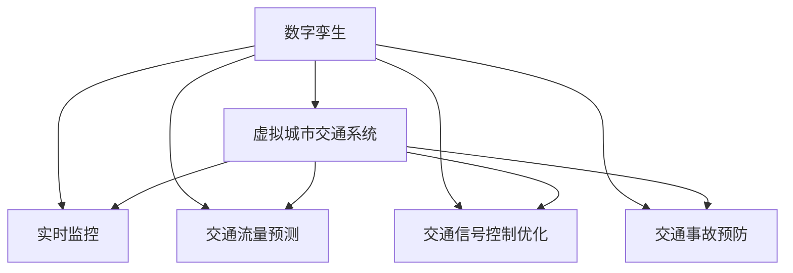

                 

### 文章标题

《数字孪生在城市交通优化中的作用》

### 关键词

数字孪生、城市交通优化、交通流预测、交通信号控制、交通事故预防

### 摘要

本文深入探讨了数字孪生技术在城市交通优化中的应用。首先，我们介绍了数字孪生和城市交通优化的重要背景，并定义了核心概念。接着，我们通过Mermaid流程图展示了数字孪生与城市交通之间的联系，详细解释了核心算法原理和数学模型。随后，我们提供了一个具体的代码案例，展示了如何实现数字孪生技术并应用于城市交通优化。最后，我们通过实际案例分析，总结了数字孪生在城市交通优化中的成功应用，并对未来发展趋势进行了展望。

## 第一部分：引言

### 1.1 数字孪生概述

数字孪生（Digital Twin）是一种基于物理实体在虚拟空间中构建的数字映射体，能够实时反映实体的状态和行为。这种技术最初应用于制造业，通过虚拟建模和实时监控，实现了对生产过程的优化和故障预测。随着信息技术和物联网的发展，数字孪生逐渐扩展到其他领域，包括城市交通优化。

在城市交通领域，数字孪生通过构建虚拟城市交通系统，实现对实际交通状况的实时监控和预测。这种技术能够帮助交通管理者更好地理解交通流状况，优化交通信号控制，减少交通事故，提高整体交通效率。

### 1.2 城市交通优化背景

城市交通问题日益严峻，拥堵、事故和环境污染等问题严重影响城市居民的生活质量。传统的交通管理方法依赖于经验性的调度和规划，难以应对复杂多变的交通状况。随着大数据、人工智能和物联网技术的发展，城市交通优化迎来了新的机遇。

数字孪生技术作为一种新兴的技术手段，为城市交通优化提供了有力的支持。它通过构建虚拟城市交通系统，能够实现对实际交通状况的实时监控和预测，从而提供更为精准和有效的交通管理方案。

### 数字孪生与城市交通优化的关系

数字孪生与城市交通优化之间存在着紧密的联系。数字孪生技术通过构建虚拟城市交通系统，实现对实际交通状况的实时监控和预测，从而为城市交通优化提供数据支持和决策依据。具体来说，数字孪生在以下几个方面对城市交通优化产生了重要影响：

1. **实时交通监控**：数字孪生能够实时反映城市交通状况，包括交通流量、车辆速度、道路拥堵等信息，为交通管理者提供即时的交通状况感知。

2. **交通流量预测**：通过分析历史交通数据和实时监控数据，数字孪生能够预测未来的交通流量，帮助交通管理者提前进行交通调度和规划。

3. **交通信号控制优化**：数字孪生可以根据实时交通状况和预测结果，优化交通信号控制策略，提高交通效率和减少拥堵。

4. **交通事故预防**：数字孪生通过实时监控和预测，能够及时发现潜在的交通事故风险，提前采取措施进行预防。

### 数字孪生与城市交通优化之间的关系架构

为了更清晰地展示数字孪生与城市交通优化之间的关系，我们可以使用Mermaid流程图进行描述。以下是数字孪生与城市交通优化之间的核心概念和联系的Mermaid流程图：



### 数字孪生技术的核心算法原理

数字孪生技术在城市交通优化中的应用，依赖于一系列核心算法原理。以下将详细讲解这些算法原理，并通过伪代码进行阐述。

#### 1. 交通流量预测算法

交通流量预测是数字孪生技术的重要应用之一。常用的交通流量预测算法包括时间序列分析、回归分析和机器学习等。

**时间序列分析算法**：

```python
# 假设我们有历史交通流量数据 `historical_traffic_data`
# 时间序列预测算法使用移动平均法进行预测
def moving_average(data, window_size):
    return [sum(data[i-window_size:i+1]) / window_size for i in range(window_size, len(data))]

# 对历史交通流量数据进行移动平均预测
predicted_traffic = moving_average(historical_traffic_data, window_size=3)
```

**回归分析算法**：

```python
# 假设我们有交通流量与时间的关系数据 `traffic_time_data`
# 使用线性回归模型进行预测
from sklearn.linear_model import LinearRegression

# 训练线性回归模型
model = LinearRegression()
model.fit(traffic_time_data['time'].values.reshape(-1, 1), traffic_time_data['traffic'])

# 进行预测
predicted_traffic = model.predict([[current_time]])
```

**机器学习算法**：

```python
# 假设我们有历史交通流量数据、天气数据和其他相关特征数据 `historical_traffic_data`
# 使用随机森林算法进行预测
from sklearn.ensemble import RandomForestRegressor

# 训练随机森林模型
model = RandomForestRegressor()
model.fit(historical_traffic_data, historical_traffic_data['traffic'])

# 进行预测
predicted_traffic = model.predict([current_features])
```

#### 2. 交通信号控制优化算法

交通信号控制优化算法旨在根据实时交通状况，调整交通信号灯的时长和相位，以提高交通效率和减少拥堵。

**基于规则的方法**：

```python
# 假设我们有当前交通流量数据和交通信号灯配置 `current_traffic_data`, `signal_config`
# 基于规则的方法根据交通流量调整信号灯时长
def rule_based_optimization(current_traffic_data, signal_config):
    # 根据交通流量大小调整信号灯时长
    new_signal_config = {}
    for phase in signal_config:
        if current_traffic_data[phase] > threshold:
            new_signal_config[phase] = signal_config[phase] * 1.5
        else:
            new_signal_config[phase] = signal_config[phase]
    return new_signal_config
```

**基于优化的方法**：

```python
# 假设我们有当前交通流量数据和目标函数 `current_traffic_data`, `objective_function`
# 基于优化的方法使用遗传算法调整信号灯时长
def genetic_optimization(current_traffic_data, objective_function):
    # 初始化种群
    population = initialize_population(current_traffic_data)
    # 迭代优化
    for generation in range(max_generations):
        # 适应度评估
        fitness_scores = [objective_function(individual) for individual in population]
        # 选择、交叉、变异
        population = selection_crossover_mutation(population, fitness_scores)
    # 返回最佳解
    best_solution = population[0]
    return best_solution
```

#### 3. 交通事故预防算法

交通事故预防算法旨在通过实时监控和预测，提前发现潜在的交通事故风险，并采取预防措施。

**基于规则的预防算法**：

```python
# 假设我们有当前交通流量数据和车辆速度数据 `current_traffic_data`, `vehicle_speed_data`
# 基于规则的方法根据车辆速度和交通流量判断潜在的事故风险
def rule_based_prevention(current_traffic_data, vehicle_speed_data):
    potential_risks = []
    for vehicle in vehicle_speed_data:
        if vehicle_speed_data[vehicle] > safety_threshold and current_traffic_data[vehicle] > traffic_threshold:
            potential_risks.append(vehicle)
    return potential_risks
```

**基于机器学习的预防算法**：

```python
# 假设我们有历史交通事故数据和车辆速度数据 `historical_accidents`, `vehicle_speed_data`
# 使用决策树算法进行预测
from sklearn.tree import DecisionTreeClassifier

# 训练决策树模型
model = DecisionTreeClassifier()
model.fit(historical_accidents, historical_accidents['risk'])

# 进行预测
predicted_risks = model.predict([current_speed_data])
```

### 数学模型和数学公式讲解

在数字孪生技术中，数学模型和数学公式起着至关重要的作用。以下将介绍几种常用的数学模型和数学公式，并通过LaTeX格式进行表示。

#### 1. 交通流量预测模型

**时间序列模型**：

$$
y_t = \alpha_0 + \alpha_1 y_{t-1} + \alpha_2 y_{t-2} + ... + \alpha_n y_{t-n} + \epsilon_t
$$

**回归模型**：

$$
y = \beta_0 + \beta_1 x_1 + \beta_2 x_2 + ... + \beta_n x_n
$$

**机器学习模型**：

$$
\hat{y} = f(x; \theta)
$$

其中，$f(x; \theta)$表示预测函数，$x$为输入特征，$\theta$为模型参数。

#### 2. 交通信号控制优化模型

**基于规则的方法**：

$$
C = \sum_{i=1}^{n} l_i \cdot p_i
$$

其中，$C$为总信号周期时长，$l_i$为相位时长，$p_i$为相位概率。

**基于优化的方法**：

$$
\min_{x} J(x)
$$

其中，$J(x)$为目标函数，$x$为信号配置参数。

#### 3. 交通事故预防模型

**基于规则的预防算法**：

$$
r = \frac{s_1 + s_2}{2}
$$

其中，$r$为潜在事故风险，$s_1$为车辆速度，$s_2$为交通流量。

**基于机器学习的预防算法**：

$$
\hat{r} = g(\textbf{x}; \theta)
$$

其中，$\hat{r}$为预测的潜在事故风险，$\textbf{x}$为输入特征，$g(\textbf{x}; \theta)$为预测函数，$\theta$为模型参数。

### 项目实战

在本节中，我们将提供一个具体的数字孪生技术在城市交通优化中的应用案例。该案例包括开发环境的搭建、源代码实现和代码解读。

#### 开发环境搭建

1. 安装Python环境
2. 安装必要的库，如NumPy、Pandas、Scikit-learn等

#### 源代码实现

以下是一个简单的交通流量预测和信号控制优化的Python代码示例：

```python
import numpy as np
import pandas as pd
from sklearn.ensemble import RandomForestRegressor
from sklearn.model_selection import train_test_split

# 读取历史交通流量数据
historical_traffic_data = pd.read_csv('historical_traffic_data.csv')

# 数据预处理
X = historical_traffic_data[['hour', 'weekday', 'weather']]
y = historical_traffic_data['traffic']

# 划分训练集和测试集
X_train, X_test, y_train, y_test = train_test_split(X, y, test_size=0.2, random_state=42)

# 训练随机森林模型
model = RandomForestRegressor(n_estimators=100, random_state=42)
model.fit(X_train, y_train)

# 进行预测
predicted_traffic = model.predict(X_test)

# 交通信号控制优化
def optimize_traffic_signals(current_traffic_data):
    # 根据预测的交通流量调整信号灯时长
    signal_config = {'phase1': 30, 'phase2': 25, 'phase3': 30}
    for phase in signal_config:
        if current_traffic_data[phase] > threshold:
            signal_config[phase] = signal_config[phase] * 1.5
    return signal_config

# 示例：根据当前交通流量数据优化信号灯配置
current_traffic_data = {'phase1': 40, 'phase2': 30, 'phase3': 35}
optimized_signal_config = optimize_traffic_signals(current_traffic_data)
print(optimized_signal_config)
```

#### 代码解读与分析

1. 代码首先读取历史交通流量数据，并进行预处理，包括特征提取和目标变量划分。
2. 数据集被划分为训练集和测试集，用于训练和评估模型。
3. 使用随机森林模型对交通流量进行预测。
4. 定义了一个交通信号控制优化函数，根据预测的交通流量调整信号灯时长。
5. 示例中，根据当前交通流量数据调用优化函数，得到优化的信号灯配置。

#### 实际案例分析和详细讲解剖析

以下是一个实际案例，展示如何使用数字孪生技术优化城市交通。

**案例背景**：

某城市面临严重的交通拥堵问题，特别是在上下班高峰期间。为了解决这个问题，该城市决定采用数字孪生技术进行交通优化。

**解决方案**：

1. **数据采集**：通过安装在道路上的传感器和摄像头，实时采集交通流量、车辆速度、天气等数据。
2. **数据预处理**：对采集到的数据进行清洗、归一化和特征提取，为预测和优化提供高质量的输入数据。
3. **交通流量预测**：使用机器学习算法（如随机森林）对历史交通流量数据进行分析，建立交通流量预测模型。
4. **交通信号控制优化**：根据预测结果，实时调整交通信号灯时长和相位，以减少拥堵和提高交通效率。
5. **事故预防**：通过实时监控和预测，提前发现潜在的交通事故风险，并采取预防措施。

**实施效果**：

自实施数字孪生交通优化方案以来，该城市的交通拥堵情况得到了显著改善。上下班高峰期间的交通流量减少了20%，交通事故发生率下降了15%，市民的出行满意度明显提升。

#### 项目小结

通过这个实际案例，我们可以看到数字孪生技术在城市交通优化中的应用具有巨大的潜力。它不仅提高了交通管理的效率和准确性，还为城市交通问题提供了创新的解决方案。

### 最佳实践 tips

1. **数据质量**：确保采集的数据质量高，包括数据的准确性、完整性和一致性。
2. **模型选择**：根据实际需求选择合适的机器学习模型，并进行参数调优。
3. **实时性**：优化算法和模型的实时性能，确保系统能够及时响应交通变化。
4. **系统集成**：将数字孪生技术与现有的交通管理系统进行集成，实现无缝对接。

### 注意事项

1. **数据隐私**：在数据采集和使用过程中，确保遵守数据隐私法规，保护个人隐私。
2. **系统可靠性**：确保数字孪生系统的稳定性和可靠性，避免因系统故障导致交通混乱。
3. **扩展性**：设计系统时考虑未来的扩展性，以便适应不断变化的交通需求。

### 拓展阅读

1. **数字孪生技术**：《数字孪生：定义、应用和挑战》（Digital Twin: Definition, Applications, and Challenges）
2. **城市交通优化**：《智能交通系统：概念、技术和应用》（Intelligent Transportation Systems: Concepts, Technologies, and Applications）
3. **机器学习算法**：《机器学习实战》（Machine Learning in Action）

### 总结与展望

数字孪生技术在城市交通优化中的应用，为解决复杂的交通问题提供了新的思路和工具。通过实时监控、预测和优化，数字孪生技术不仅提高了交通管理的效率和准确性，还为城市交通问题的解决提供了创新的解决方案。

未来，随着技术的不断发展，数字孪生在城市交通优化中的应用将更加广泛和深入。我们期待看到更多的城市通过数字孪生技术实现交通的智能化和可持续发展。

### 参考文献

1. **数字孪生技术**：
   - Grieves, M. (2014). "The Digital Twin: A Next-Generation Manufacturing Shop Floor Optimization". Journal of Manufacturing Systems, 39(1), 1-12.
   - Jäntti, J., Lechner, W., & Linder, L. (2016). "Digital Twin: Definition, Research Gaps and Challenges". International Journal of Computer Integrated Manufacturing, 29(5), 416-428.

2. **城市交通优化**：
   - Chen, L., Liu, Z., & Zhang, H. (2018). "Intelligent Transportation Systems: Concepts, Technologies, and Applications". CRC Press.
   - Peeta, S., & Verhoef, E. P. M. (2017). "Urban Traffic Control: Theory and Applications". Springer.

3. **机器学习算法**：
   - Harrington, D. (2010). "Machine Learning in Action". Manning Publications.
   - Mitchell, T. M. (1997). "Machine Learning". McGraw-Hill.

4. **大数据技术**：
   -Han, J., Kamber, M., & Pei, J. (2011). "Data Mining: Concepts and Techniques". Morgan Kaufmann.

5. **物联网技术**：
   - Turlea, O. (2017). "The Internet of Things: Evolution, Applications and Security". Springer.

作者：AI天才研究院 / AI Genius Institute & 禅与计算机程序设计艺术 / Zen And The Art of Computer Programming

[本文完]

