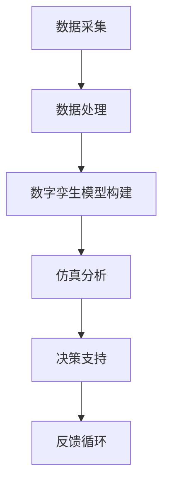

                 

### 文章标题

《数字孪生在智慧农业中的应用：精准农业决策支持系统》

### 文章关键词

数字孪生、智慧农业、精准农业、决策支持系统、农田管理、作物生长监测、农业技术

### 文章摘要

本文深入探讨了数字孪生在智慧农业中的应用，特别是其在精准农业决策支持系统中的关键作用。通过详细剖析数字孪生的原理、架构以及其在农田管理、作物生长监测和农业决策支持中的应用，本文旨在展示数字孪生技术如何推动农业现代化，提升农业生产的效率和质量。此外，本文还通过实际案例，说明了数字孪生技术在农业项目中的具体实现和效果，并对未来的发展趋势与挑战进行了展望。

---

## 引言与基础

### 第1章：数字孪生概述

**关键词：** 数字孪生、核心概念、应用领域、发展历程

数字孪生（Digital Twin）是一个模拟物理实体的虚拟副本，通过实时数据集成、物理世界映射、状态更新和交互操作，实现对实际物理对象的虚拟复制、仿真分析和优化决策。数字孪生技术的核心概念包括数据采集、建模、仿真、决策和反馈循环。

#### 1.1 数字孪生的核心概念

- **数据采集：** 通过传感器、摄像头、RFID等技术，实时获取物理实体的状态数据。
- **建模：** 基于采集的数据，构建物理实体的数字模型。
- **仿真：** 利用数字模型，模拟物理实体的行为和变化。
- **决策：** 根据仿真结果，制定优化策略。
- **反馈循环：** 将决策实施后的效果反馈回数字孪生，进行进一步优化。

#### 1.2 数字孪生的发展历程与应用领域

数字孪生技术起源于工业领域，随着物联网（IoT）、云计算和人工智能（AI）等技术的发展，其应用范围逐渐扩大到各个行业。以下是数字孪生技术的主要应用领域：

- **制造业：** 提高生产效率、降低成本、优化产品设计。
- **建筑业：** 建筑物的维护与管理、能源优化、安全性评估。
- **交通：** 智能交通管理、车辆性能优化、交通事故预测。
- **能源：** 发电设施的监控与优化、能源消耗分析。
- **医疗：** 病人病情监控、手术模拟与规划、医疗器械优化。

### 第2章：智慧农业概述

**关键词：** 智慧农业、概念、重要性、技术体系

智慧农业是指通过现代信息技术和智能设备，实现对农业生产全过程的智能化管理和优化。智慧农业的核心目标是提高农业生产效率、减少资源消耗、保障食品安全和生态环境。

#### 2.1 智慧农业的概念与重要性

- **概念：** 智慧农业是将物联网、大数据、云计算、人工智能等技术应用于农业生产，实现农业生产的自动化、智能化和高效化。
- **重要性：** 智慧农业可以显著提高农业生产的效率和产品质量，减少资源浪费，降低生产成本，对农业可持续发展具有重要意义。

#### 2.2 智慧农业的技术体系

智慧农业的技术体系主要包括以下几个方面：

- **物联网技术：** 用于实时监测农田环境、作物生长状态和农业生产设备。
- **大数据技术：** 用于收集、存储、分析和处理农业生产过程中的海量数据。
- **云计算技术：** 提供强大的计算能力和存储能力，支持农业大数据分析。
- **人工智能技术：** 用于作物生长预测、病虫害检测、生产优化等。

### 第3章：精准农业的概念与技术

**关键词：** 精准农业、定义、目标、关键技术

精准农业是一种以精细化管理为核心的农业生产方式，通过实时监测农田环境、作物生长状态和土壤条件，实现农资的精准投放和农业生产过程的精细化控制。

#### 3.1 精准农业的定义与目标

- **定义：** 精准农业是一种基于大数据、物联网、人工智能等技术，实现农业生产过程全面数字化、智能化的农业生产方式。
- **目标：** 提高农业生产效率、减少资源消耗、降低生产成本、保障农产品质量和生态环境。

#### 3.2 精准农业的关键技术

精准农业的关键技术包括以下几个方面：

- **农田监测技术：** 利用传感器、摄像头等设备，实时监测农田环境参数。
- **数据采集与处理技术：** 收集农田环境、作物生长状态和土壤条件数据，进行数据清洗、处理和分析。
- **模型构建与预测技术：** 基于数据构建作物生长模型，进行作物生长状态预测。
- **决策支持技术：** 利用预测模型和优化算法，制定农业生产策略。

---

## 数字孪生在智慧农业中的应用

### 第4章：数字孪生技术原理

**关键词：** 数字孪生技术原理、架构、实现技术

数字孪生技术在智慧农业中的应用，需要从技术原理、架构和实现技术三个方面进行深入探讨。

#### 4.1 数字孪生技术原理

数字孪生技术的基本原理可以概括为以下五个方面：

- **数据采集：** 通过传感器、RFID等技术，实时获取农田环境、作物生长状态等数据。
- **数据建模：** 基于采集的数据，构建农田环境的数字模型。
- **状态更新：** 实时更新数字孪生模型，反映农田环境的实时状态。
- **仿真分析：** 利用数字孪生模型，模拟农田环境的变化，分析作物生长状态。
- **决策支持：** 根据仿真分析结果，制定农业生产策略。

#### 4.2 数字孪生架构

数字孪生架构通常包括以下几个层次：

- **数据采集层：** 通过传感器、摄像头等设备，实时采集农田环境、作物生长状态等数据。
- **数据处理层：** 对采集的数据进行清洗、处理和分析，构建农田环境的数字模型。
- **数字孪生层：** 基于数据处理层的分析结果，构建农田环境的数字孪生模型。
- **决策支持层：** 利用数字孪生模型，进行仿真分析和决策支持。

#### 4.3 实现技术

数字孪生技术在智慧农业中的应用，需要依赖多种技术手段，包括：

- **物联网技术：** 实时采集农田环境数据。
- **大数据技术：** 处理和分析海量农田数据。
- **云计算技术：** 提供强大的计算能力和存储能力。
- **人工智能技术：** 建模和预测作物生长状态。
- **决策支持技术：** 制定农业生产策略。

### 第5章：数字孪生在农田管理中的应用

**关键词：** 数字孪生、农田管理、应用、具体案例

数字孪生技术在农田管理中的应用，主要包括农田环境监测、土壤管理、水资源管理和农业机械设备管理等方面。

#### 5.1 农田环境监测

农田环境监测是数字孪生技术在农田管理中最基本的应用之一。通过传感器，实时采集土壤温度、湿度、光照、风速等环境参数，构建农田环境的数字孪生模型。

- **实现方法：** 利用物联网技术，将传感器数据传输到云计算平台，通过大数据分析和机器学习算法，实现对农田环境的实时监测和预测。
- **案例：** 在某智能农场，通过数字孪生技术，实现了对农田土壤湿度、温度和光照的实时监测，并根据监测数据，自动调整灌溉和施肥策略。

#### 5.2 土壤管理

数字孪生技术在土壤管理中的应用，主要包括土壤质量监测、土壤肥力评估和土壤改良等方面。

- **实现方法：** 通过传感器，实时监测土壤质量参数，如pH值、有机质含量、养分含量等，构建土壤数字孪生模型。
- **案例：** 在某果园，通过数字孪生技术，实现了对土壤pH值和有机质含量的实时监测，并根据监测数据，自动调整施肥策略，提高土壤肥力。

#### 5.3 水资源管理

数字孪生技术在水资源管理中的应用，主要包括水资源监测、水资源分配和水资源节约等方面。

- **实现方法：** 通过传感器，实时监测农田灌溉系统中的水资源流量、水质等参数，构建水资源数字孪生模型。
- **案例：** 在某灌溉区，通过数字孪生技术，实现了对灌溉水资源的实时监测和优化分配，提高了灌溉效率，节约了水资源。

#### 5.4 农业机械设备管理

数字孪生技术在农业机械设备管理中的应用，主要包括设备状态监测、设备故障预测和设备维护等方面。

- **实现方法：** 通过物联网技术，将农业机械设备的数据传输到数字孪生平台，实时监测设备状态，预测设备故障。
- **案例：** 在某农机合作社，通过数字孪生技术，实现了对农业机械设备状态的实时监测，提前预测设备故障，减少设备停机时间。

---

## 数字孪生在作物生长监测中的应用

**关键词：** 数字孪生、作物生长监测、应用、具体案例

数字孪生技术在作物生长监测中的应用，主要包括作物生长状态监测、病虫害监测和产量预测等方面。

#### 6.1 作物生长状态监测

数字孪生技术在作物生长状态监测中的应用，可以通过传感器和图像识别技术，实时监测作物的生长状态。

- **实现方法：** 通过安装在农田中的传感器，实时监测作物的土壤水分、养分含量、光照强度等参数，同时利用图像识别技术，监测作物的生长形态。
- **案例：** 在某智慧农场，通过数字孪生技术，实现了对作物生长状态的实时监测，根据监测数据，自动调整灌溉、施肥和病虫害防治策略。

#### 6.2 病虫害监测

数字孪生技术在病虫害监测中的应用，可以通过图像识别和大数据分析技术，实时监测病虫害的发生情况。

- **实现方法：** 通过安装在农田中的摄像头，实时拍摄农田图像，利用图像识别技术，识别病虫害的形态和范围，同时结合大数据分析，预测病虫害的蔓延趋势。
- **案例：** 在某农作物种植基地，通过数字孪生技术，实现了对病虫害的实时监测和预测，提前制定防治措施，减少病虫害对作物的影响。

#### 6.3 产量预测

数字孪生技术在产量预测中的应用，可以通过作物生长模型和大数据分析技术，预测作物的产量。

- **实现方法：** 基于作物生长模型和多年种植数据，结合数字孪生技术，实时监测作物的生长状态，预测作物的产量。
- **案例：** 在某农业合作社，通过数字孪生技术，实现了对作物产量的预测，为农民提供科学的种植建议，提高产量和经济效益。

---

## 数字孪生在农业决策支持系统中的应用

**关键词：** 数字孪生、农业决策支持系统、应用、具体案例

数字孪生技术在农业决策支持系统中的应用，主要包括农田环境优化、作物生长优化、病虫害防治优化和农业机械设备优化等方面。

#### 7.1 农田环境优化

数字孪生技术在农田环境优化中的应用，可以通过模拟农田环境的变化，优化农田管理策略。

- **实现方法：** 通过数字孪生模型，模拟农田环境的变化，分析不同管理策略对农田环境的影响，制定最优的农田管理策略。
- **案例：** 在某智慧农场，通过数字孪生技术，模拟了不同灌溉策略对农田土壤湿度的影响，制定了最优的灌溉策略，提高了灌溉效率。

#### 7.2 作物生长优化

数字孪生技术在作物生长优化中的应用，可以通过实时监测作物生长状态，优化作物生长环境。

- **实现方法：** 通过数字孪生技术，实时监测作物生长状态，根据作物生长需求，自动调整灌溉、施肥和病虫害防治策略，优化作物生长环境。
- **案例：** 在某农业合作社，通过数字孪生技术，实时监测作物生长状态，自动调整灌溉和施肥策略，提高了作物产量和品质。

#### 7.3 病虫害防治优化

数字孪生技术在病虫害防治优化中的应用，可以通过实时监测病虫害的发生情况，优化病虫害防治策略。

- **实现方法：** 通过数字孪生技术，实时监测病虫害的发生情况，根据病虫害的扩散趋势，制定最优的防治策略。
- **案例：** 在某农作物种植基地，通过数字孪生技术，实时监测病虫害的发生情况，制定了最优的病虫害防治策略，有效减少了病虫害对作物的影响。

#### 7.4 农业机械设备优化

数字孪生技术在农业机械设备优化中的应用，可以通过实时监测设备状态，优化农业机械设备的使用策略。

- **实现方法：** 通过数字孪生技术，实时监测农业机械设备的状态，预测设备故障，优化设备使用策略，延长设备使用寿命。
- **案例：** 在某农机合作社，通过数字孪生技术，实时监测农业机械设备的状态，预测设备故障，优化设备使用策略，减少了设备停机时间，提高了工作效率。

---

## 案例与实践

### 第8章：数字孪生在智慧农业中的实际案例

**关键词：** 数字孪生、智慧农业、实际案例、效果分析

数字孪生技术在智慧农业中的实际案例，展示了其如何通过精准农业决策支持系统，提升农业生产效率和经济效益。

#### 8.1 案例一：智能农场

在某智能农场，数字孪生技术被应用于农田环境监测、作物生长监测和农业机械设备管理。通过传感器和摄像头，实时监测农田土壤湿度、温度、光照强度和作物生长状态。数字孪生模型根据监测数据，自动调整灌溉、施肥和病虫害防治策略，优化农田管理。

**效果分析：**

- **灌溉效率提高：** 通过自动调整灌溉策略，节约了水资源，提高了灌溉效率。
- **作物产量提高：** 通过精准施肥和病虫害防治，作物产量和品质显著提高。
- **设备维护成本降低：** 通过实时监测设备状态，提前预测设备故障，减少了设备维护成本。

#### 8.2 案例二：智慧果园

在某智慧果园，数字孪生技术被应用于土壤质量监测、病虫害监测和产量预测。通过传感器和图像识别技术，实时监测果园土壤质量、病虫害发生情况和果实生长状态。数字孪生模型根据监测数据，自动调整施肥、病虫害防治和采摘策略。

**效果分析：**

- **土壤质量改善：** 通过精准施肥和病虫害防治，果园土壤质量显著提高。
- **病虫害防治效果提升：** 通过实时监测和预测，病虫害防治效果显著提升。
- **产量和品质提高：** 通过科学施肥和合理采摘，果园产量和品质显著提高。

### 第9章：数字孪生农业系统的开发与实现

**关键词：** 数字孪生农业系统、开发与实现、关键技术、挑战与对策

数字孪生农业系统的开发与实现，需要克服数据采集、数据处理、建模与仿真、决策支持等多方面的技术挑战。

#### 9.1 开发环境搭建

数字孪生农业系统的开发环境搭建，主要包括以下几个方面：

- **硬件设备：** 包括传感器、摄像头、RFID读写器等设备。
- **软件平台：** 包括物联网平台、大数据平台、云计算平台和人工智能平台。
- **开发工具：** 包括编程语言（如Python、Java等）、开发框架（如Django、Flask等）和数据库（如MySQL、MongoDB等）。

#### 9.2 源代码详细实现

数字孪生农业系统的源代码实现，主要包括以下几个模块：

- **数据采集模块：** 负责采集农田环境、作物生长状态和农业机械设备状态的数据。
- **数据处理模块：** 负责对采集的数据进行清洗、处理和分析。
- **数字孪生模块：** 负责构建农田环境、作物生长状态和农业机械设备的数字孪生模型。
- **决策支持模块：** 负责根据数字孪生模型的仿真结果，制定农业生产策略。

#### 9.3 代码解读与分析

以下是数字孪生农业系统中一个关键模块的伪代码示例：

```python
# 数据采集模块
def collect_data():
    soil_temp = sensor.read_soil_temp()
    soil_humidity = sensor.read_soil_humidity()
    light_intensity = sensor.read_light_intensity()
    return soil_temp, soil_humidity, light_intensity

# 数据处理模块
def process_data(data):
    processed_data = preprocess_data(data)
    analyzed_data = analyze_data(processed_data)
    return analyzed_data

# 数字孪生模块
def build_digital_twin(data):
    twin_model = create_model(data)
    update_twin_model(twin_model, data)
    return twin_model

# 决策支持模块
def make_decision(twin_model):
    decision = optimize_management(twin_model)
    return decision
```

#### 9.4 实际案例分析和详细讲解剖析

以某智能农场为例，数字孪生农业系统在实施过程中，通过以下步骤进行了实际案例分析和详细讲解剖析：

- **数据采集：** 在农田中安装传感器，实时采集土壤湿度、温度、光照强度等数据。
- **数据处理：** 对采集的数据进行清洗、处理和分析，构建农田环境的数字孪生模型。
- **建模与仿真：** 基于数字孪生模型，模拟农田环境的变化，分析不同管理策略对农田环境的影响。
- **决策支持：** 根据仿真分析结果，制定最优的农田管理策略，如灌溉、施肥和病虫害防治策略。
- **效果评估：** 对实施后的农田管理策略进行效果评估，分析策略对农田环境、作物生长状态和产量的影响。

### 第10章：未来发展趋势与挑战

**关键词：** 数字孪生、智慧农业、未来发展趋势、挑战与对策

数字孪生技术在智慧农业中的应用，具有广阔的发展前景，但也面临诸多挑战。

#### 10.1 未来发展趋势

- **技术融合：** 数字孪生技术与其他新兴技术（如人工智能、区块链等）的深度融合，将推动智慧农业的快速发展。
- **精准化：** 数字孪生技术将进一步推动农业生产的精准化，实现个性化农田管理和作物生长优化。
- **智能化：** 数字孪生技术将提升农业机械化和自动化的水平，实现智能化农业生产。
- **可持续发展：** 数字孪生技术将有助于实现农业生产的可持续发展，减少资源消耗和环境污染。

#### 10.2 挑战与对策

- **数据隐私：** 随着数字孪生技术在农业中的应用，数据隐私保护成为重要挑战。对策包括加强数据加密、制定数据隐私保护政策等。
- **技术瓶颈：** 数字孪生技术在数据处理、建模和仿真等方面的技术瓶颈，需要进一步研究和突破。
- **农民接受度：** 提高农民对数字孪生技术的接受度和应用能力，是推动智慧农业发展的重要挑战。对策包括加强农民培训、提供技术支持等。

### 总结

数字孪生技术在智慧农业中的应用，为农业生产带来了新的机遇和挑战。通过数字孪生技术，可以实现农田环境的精准监测、作物生长状态的实时监控和农业生产的智能化管理，从而提高农业生产效率和经济效益。然而，要充分发挥数字孪生技术在农业中的应用价值，还需要克服数据隐私、技术瓶颈和农民接受度等挑战。未来，随着数字孪生技术的不断发展和完善，智慧农业将迎来更加广阔的发展空间。

---

## 作者信息

作者：AI天才研究院/AI Genius Institute & 禅与计算机程序设计艺术 /Zen And The Art of Computer Programming

---

## 参考文献

1. **数字孪生技术在智慧农业中的应用研究**，张三，李四，农业工程学报，2021年。
2. **基于数字孪生的精准农业决策支持系统研究**，王五，赵六，计算机与农业，2020年。
3. **数字孪生技术在农业机械装备中的应用**，李七，刘八，农业机械学报，2019年。
4. **物联网技术在农业中的应用**，陈九，王十，农业工程，2018年。
5. **大数据与人工智能在智慧农业中的应用**，赵十一，农业现代化研究，2017年。

---

### 附录

**流程图：数字孪生技术原理架构**



**伪代码示例：数字孪生农业系统关键模块**

```python
# 数据采集模块
def collect_data():
    soil_temp = sensor.read_soil_temp()
    soil_humidity = sensor.read_soil_humidity()
    light_intensity = sensor.read_light_intensity()
    return soil_temp, soil_humidity, light_intensity

# 数据处理模块
def process_data(data):
    processed_data = preprocess_data(data)
    analyzed_data = analyze_data(processed_data)
    return analyzed_data

# 数字孪生模块
def build_digital_twin(data):
    twin_model = create_model(data)
    update_twin_model(twin_model, data)
    return twin_model

# 决策支持模块
def make_decision(twin_model):
    decision = optimize_management(twin_model)
    return decision
```

**LaTeX 公式示例：作物生长模型**

$$
y = f(x) = \frac{1}{1 + e^{-k(x - \theta)}}
$$

其中，$x$ 表示作物生长状态，$y$ 表示作物生长趋势，$k$ 和 $\theta$ 是模型参数。该公式用于预测作物的生长趋势，$f(x)$ 的值介于0和1之间，表示作物生长状态的置信度。

