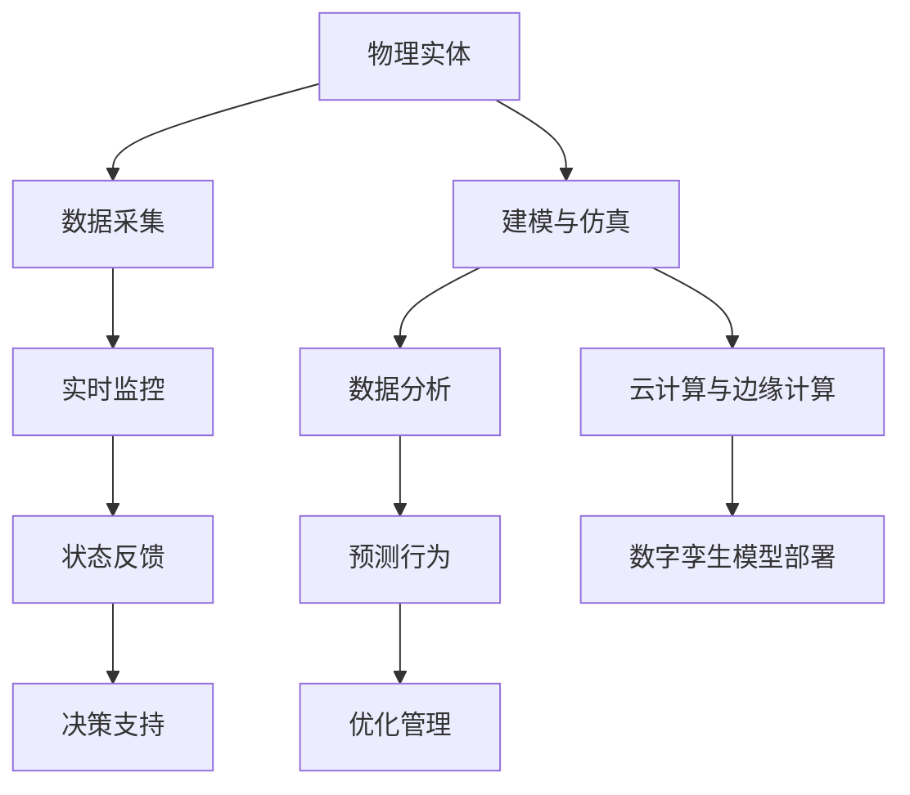

                 


### 引言

随着科技的不断进步，医疗领域正经历着一场深刻的变革。智慧医院作为医疗信息化的重要方向，正逐步融入人工智能、大数据、物联网等先进技术，从而提升医疗服务的质量和效率。在智慧医院的建设过程中，医疗资源的合理分配是一个至关重要的问题。如何高效利用有限的医疗资源，优化资源配置，提高医疗服务水平，成为了当前医疗行业面临的重大挑战。

数字孪生（Digital Twin）技术的出现，为智慧医院管理提供了新的解决方案。数字孪生是一种基于虚拟仿真和大数据分析的技术，能够创建出一个与现实世界相对应的数字模型。通过这个数字模型，可以对现实世界中的医疗设施、设备、流程等进行实时监控、预测和分析，从而实现医疗资源的优化配置。本文将围绕数字孪生在智慧医院管理中的应用，特别是如何通过数字孪生技术来优化医疗资源分配，进行深入探讨。

本文结构如下：

1. **数字孪生技术概述**：介绍数字孪生技术的基本概念、发展历程及其在各领域的应用。
2. **数字孪生与智慧医院**：分析数字孪生在智慧医院中的作用和重要性。
3. **医疗资源分配优化**：探讨如何利用数字孪生技术优化医疗资源分配。
4. **数字孪生在医疗设备管理中的应用**：阐述数字孪生技术在医疗设备管理中的具体应用。
5. **数字孪生在医院设施管理中的应用**：分析数字孪生技术在医院设施管理中的作用。
6. **数字孪生在患者护理管理中的应用**：讨论数字孪生技术在患者护理管理中的应用。
7. **数字孪生在临床决策支持系统中的应用**：探讨数字孪生技术在临床决策支持系统中的作用。
8. **结论与未来展望**：总结全文，展望数字孪生技术在智慧医院管理中的未来发展。

通过上述结构的安排，本文旨在为读者提供一个系统、全面的数字孪生在智慧医院管理中的应用分析，帮助读者理解这一新兴技术的实际应用价值。

### 文章关键词

数字孪生、智慧医院、医疗资源分配、医疗设备管理、医院设施管理、患者护理管理、临床决策支持系统、优化资源配置、虚拟仿真、大数据分析。

### 文章摘要

本文探讨了数字孪生技术在智慧医院管理中的应用，特别是如何通过数字孪生技术来优化医疗资源分配。首先，介绍了数字孪生技术的基本概念、发展历程及其在各领域的应用。接着，分析了数字孪生在智慧医院中的作用和重要性。随后，本文详细探讨了如何利用数字孪生技术来优化医疗资源分配，包括在医疗设备管理、医院设施管理、患者护理管理和临床决策支持系统中的应用。通过实际案例和项目实战，本文展示了数字孪生技术在提升医疗服务质量和效率方面的巨大潜力。最后，本文总结了数字孪生技术在智慧医院管理中的应用现状，并对未来发展方向进行了展望。

### 数字孪生技术概述

数字孪生（Digital Twin）是一种新兴的技术概念，最早由Michael Grieves在2002年提出。数字孪生可以定义为“一个虚拟的、数字化的副本，它反映了现实世界中特定物理对象、系统或过程的实时状态、历史数据和未来行为”。简单来说，数字孪生就是一个物理实体的数字映射，通过虚拟模型实现对现实世界的实时监控、分析和预测。

#### 基本概念与发展历程

数字孪生技术的基本概念主要包括以下几个方面：

1. **物理实体**：指的是现实世界中的具体对象，如设备、设施或系统。
2. **虚拟模型**：是物理实体的数字映射，通过数据采集和建模技术生成。
3. **实时状态**：数字孪生能够实时获取物理实体的状态信息，包括位置、温度、速度等。
4. **历史数据**：数字孪生还记录了物理实体的历史行为和操作数据，用于分析和预测。
5. **未来行为**：通过大数据分析和人工智能算法，数字孪生可以预测物理实体的未来状态和行为。

数字孪生技术的发展历程可以分为以下几个阶段：

- **早期阶段（2002-2010年）**：数字孪生概念提出，研究主要集中在航空航天和制造业领域。
- **发展阶段（2011-2015年）**：随着传感器技术、云计算和大数据技术的发展，数字孪生开始应用于更多行业，如能源、建筑和交通。
- **成熟阶段（2016年至今）**：数字孪生技术逐渐成熟，应用范围进一步扩大，成为智能制造、智慧城市和智慧医院等领域的核心技术。

#### 数字孪生在各领域的应用

数字孪生技术具有广泛的应用前景，以下列举了几个主要领域：

1. **工业制造**：通过数字孪生技术，企业可以实现生产过程的实时监控和优化，提高生产效率和产品质量。
2. **交通运输**：数字孪生可以用于交通管理和物流优化，提高交通流量和运输效率。
3. **建筑与基础设施**：数字孪生技术可以用于建筑设计和设施管理，降低维护成本，提高运行效率。
4. **医疗健康**：数字孪生技术可以帮助医疗机构实现设备管理、患者护理和临床决策的优化。
5. **智慧城市**：数字孪生技术可以用于城市管理和服务优化，提高城市运行效率和居民生活质量。

#### 关键技术

实现数字孪生技术需要以下几个关键技术的支持：

1. **数据采集**：通过传感器、RFID、GPS等设备采集物理实体的状态数据。
2. **建模与仿真**：利用数据建模和仿真技术创建数字孪生模型，反映物理实体的特征和行为。
3. **实时监控**：通过物联网技术实现对物理实体的实时监控和状态反馈。
4. **数据分析**：利用大数据分析和人工智能算法对数据进行分析，预测物理实体的未来行为。
5. **云计算与边缘计算**：利用云计算和边缘计算技术实现数字孪生模型的部署和运行。

通过以上关键技术，数字孪生技术能够实现对物理实体的全方位、全过程的监控和管理，为各行业提供更加智能化、高效的解决方案。

#### Mermaid流程图

以下是数字孪生技术的基本概念和关键技术的Mermaid流程图：



通过上述流程图，我们可以清晰地看到数字孪生技术从物理实体到虚拟模型，再到数据分析和决策支持的完整过程。

### 数字孪生技术核心算法原理

在数字孪生技术中，核心算法原理是构建和操作数字孪生模型的关键。以下我们将详细阐述几个关键的算法原理，并使用伪代码来具体解释这些算法的实现过程。

#### 1. 数据采集与预处理

数据采集是数字孪生技术的基础，通过传感器和其他设备收集物理实体的实时数据。数据的预处理步骤包括数据清洗、去噪和归一化，以确保数据的质量和一致性。

```python
# 伪代码：数据采集与预处理
def data_collection_preprocessing(sensor_data):
    # 数据清洗：移除异常值和缺失值
    cleaned_data = remove_outliers(sensor_data)
    
    # 去噪：使用滤波算法减少噪声影响
    filtered_data = filter_noise(cleaned_data)
    
    # 数据归一化：将数据缩放到统一范围
    normalized_data = normalize_data(filtered_data)
    
    return normalized_data
```

#### 2. 建模与仿真

建模与仿真阶段通过将采集到的数据转化为数学模型，创建数字孪生模型。常用的建模方法包括物理建模、数据驱动建模和混合建模。

```python
# 伪代码：物理建模
class PhysicalModel:
    def __init__(self, parameters):
        self.parameters = parameters
    
    def simulate(self, inputs):
        # 使用输入参数模拟物理实体的行为
        outputs = self.parameters['equation'](inputs)
        return outputs

# 伪代码：数据驱动建模
class DataDrivenModel:
    def __init__(self, training_data):
        self.model = train_model(training_data)
    
    def predict(self, inputs):
        # 使用训练好的模型预测输出
        outputs = self.model.predict(inputs)
        return outputs
```

#### 3. 实时监控与反馈

实时监控与反馈是数字孪生技术的核心功能之一。通过实时获取物理实体的状态数据，数字孪生模型可以及时调整和优化操作策略。

```python
# 伪代码：实时监控与反馈
def real_time_monitoring(sensor_data, model):
    # 获取当前状态
    current_state = sensor_data
    
    # 预测未来状态
    predicted_state = model.predict(current_state)
    
    # 根据预测结果调整操作策略
    adjusted_strategy = adjust_strategy(predicted_state)
    
    return adjusted_strategy
```

#### 4. 数据分析与预测

数据分析与预测阶段利用大数据分析和人工智能算法，对数字孪生模型中的数据进行分析和预测，以提供决策支持。

```python
# 伪代码：数据分析与预测
def data_analysis_prediction(model, historical_data):
    # 分析历史数据
    data_summary = analyze_historical_data(historical_data)
    
    # 建立预测模型
    prediction_model = build_prediction_model(data_summary)
    
    # 预测未来趋势
    future_trend = prediction_model.predict()
    
    return future_trend
```

#### 5. 云计算与边缘计算

云计算与边缘计算技术是支持数字孪生模型部署和运行的基础设施。通过云计算，可以实现大规模数据存储和计算，而边缘计算则可以提供低延迟和高带宽的数据处理能力。

```python
# 伪代码：云计算与边缘计算
def deploy_digital_twin(model, cloud_service, edge_device):
    # 在云端部署数字孪生模型
    cloud_model = cloud_service.deploy(model)
    
    # 在边缘设备上部署实时监控模块
    edge_monitor = edge_device.deploy(real_time_monitoring_function)
    
    return cloud_model, edge_monitor
```

通过以上核心算法原理的详细阐述和伪代码的实现，我们可以更好地理解数字孪生技术的技术本质和实现过程。这些算法原理不仅为数字孪生技术的研发和应用提供了理论基础，也为各行业提供了智能化的解决方案。

### 医疗资源分配优化

在医疗领域，医疗资源的合理分配是提升医疗服务质量和效率的关键。然而，由于医疗资源有限，如何高效利用这些资源成为了医院管理者面临的重大挑战。数字孪生技术通过提供全面、实时的数据分析和预测，为医疗资源分配优化提供了强有力的支持。

#### 优化医疗资源分配的背景

医疗资源包括医生、护士、医疗设备、药品、病房等。这些资源的管理和分配不仅影响患者的治疗体验，还直接影响医院的运营效率和医疗质量。传统的医疗资源分配方式主要依靠医院管理人员的经验和主观判断，往往存在资源分配不均、响应不及时等问题。例如，在高峰期，医院可能出现医生和护士的配置不足，而在非高峰期，部分资源却可能闲置。这不仅增加了医院的运营成本，也降低了医疗服务的效率和质量。

#### 数字孪生技术在医疗资源分配中的应用

数字孪生技术通过创建数字化的医院模型，能够实时监控和分析医疗资源的运行状态，为资源分配提供科学依据。以下是数字孪生技术在医疗资源分配优化中的几个关键应用：

1. **实时数据监控**：通过传感器和物联网设备，数字孪生技术可以实时获取医疗资源的运行数据，如医生的排班情况、设备的运行状态、药品的库存情况等。这些数据为资源分配提供了实时、准确的信息。

2. **历史数据分析**：数字孪生技术还可以分析医院的历史数据，包括患者的就诊记录、医生的诊断和治疗情况、设备的维护记录等。通过对这些数据的分析，可以发现医疗资源的使用模式和趋势，为未来的资源分配提供参考。

3. **预测性分析**：利用大数据分析和人工智能算法，数字孪生技术可以预测医疗资源的未来需求。例如，通过分析季节性因素、公共卫生事件等，可以预测未来一段时间内医疗资源的需求情况，从而提前进行资源调配。

4. **决策支持**：数字孪生技术能够为医院管理者提供实时、全面的决策支持。管理者可以根据数字孪生模型提供的预测和分析结果，科学地调整医疗资源的分配策略，提高资源利用效率。

#### 优化医疗资源分配的具体方法

1. **动态排班系统**：利用数字孪生技术，医院可以建立动态排班系统。系统可以根据实时数据和预测结果，自动调整医生的排班，确保高峰期有足够的医生和护士应对需求。

2. **设备管理优化**：数字孪生技术可以实时监控医疗设备的运行状态，预测设备的维护需求，从而避免设备故障导致的治疗延误。同时，通过对设备使用数据的分析，可以优化设备的采购和配置，减少闲置设备的数量。

3. **药品库存管理**：数字孪生技术可以实时监控药品的库存情况，预测药品的消耗趋势。根据预测结果，医院可以提前进行药品采购和库存调整，避免因药品短缺导致的医疗延误。

4. **病房资源分配**：数字孪生技术可以实时分析病房的使用情况，预测未来病房的需求。通过优化病房的分配，可以确保患者能够及时入住，减少等待时间。

#### 实际案例

以下是一个实际案例，展示了数字孪生技术在医院资源分配优化中的应用：

在某大型综合性医院，数字孪生技术被用于优化医生排班和病房资源分配。通过数字孪生模型，医院能够实时获取医生的排班情况和病房的使用状态。系统根据历史数据和实时数据，预测未来一段时间内医生和病房的需求，并自动调整排班和病房分配策略。

例如，在某个周末的下午，医院发现第二天将迎来就诊高峰。数字孪生模型预测到医生和病房的利用率将大幅增加，系统自动调整排班，安排更多的医生值班，并提前将部分空余病房调整到可用的状态。通过这一优化，医院成功应对了就诊高峰，确保了患者能够及时就诊，提高了医疗服务的效率和质量。

#### 总结

数字孪生技术在医疗资源分配优化中的应用，为医院管理者提供了一种科学、高效的方法。通过实时数据监控、历史数据分析、预测性分析和决策支持，数字孪生技术能够有效优化医疗资源的分配，提高医疗服务的效率和质量。未来，随着数字孪生技术的进一步发展和完善，它将在更多医疗机构中发挥重要作用，推动医疗行业的智能化发展。

### 数字孪生在医疗设备管理中的应用

医疗设备是医疗机构中至关重要的一部分，它们在疾病诊断、治疗和监护中发挥着关键作用。然而，医疗设备的运行效率和维护管理一直是一个难题。数字孪生技术通过创建数字化的医疗设备模型，能够实现对设备运行状态的实时监控、预测性维护和性能优化，从而提高医疗设备的管理效率和服务水平。

#### 医疗设备管理中的挑战

1. **设备故障率高**：医疗设备的故障率高，可能导致治疗延误和患者安全风险。传统维护方式主要依赖于定期检查和人工干预，无法实时监测设备的运行状态。
2. **维护成本高**：医疗设备的维护成本较高，包括维修费用、零配件更换等。如果无法及时进行维护，可能导致设备损坏，进一步增加维护成本。
3. **设备利用率低**：由于设备故障、维护不及时或配置不合理等原因，医疗设备的利用率往往较低，影响了医院的运营效率和医疗服务质量。
4. **设备数据不透明**：医疗设备的数据收集和整合难度大，设备运行数据难以实时获取和共享，影响了设备的维护管理和性能优化。

#### 数字孪生技术在医疗设备管理中的应用

数字孪生技术通过创建数字化的医疗设备模型，能够解决上述挑战，提高医疗设备的管理效率和运行性能。以下是数字孪生在医疗设备管理中的具体应用：

1. **实时监控**：数字孪生技术可以实时采集医疗设备的运行数据，包括温度、湿度、电压、电流等，并通过物联网设备传输到数字孪生模型。管理者可以实时监控设备的运行状态，及时发现潜在故障和问题。

2. **预测性维护**：通过分析设备的历史数据和实时数据，数字孪生技术可以预测设备的故障风险和维护需求。管理者可以根据预测结果提前安排维护计划，避免设备故障导致的停机时间。

3. **性能优化**：数字孪生技术可以对设备的运行数据进行实时分析，识别设备的性能瓶颈和优化潜力。管理者可以根据分析结果调整设备的运行参数，提高设备的运行效率和可靠性。

4. **远程诊断与支持**：数字孪生技术可以实现远程诊断和设备支持。通过数字孪生模型，专家可以远程分析和诊断设备故障，提供技术支持和解决方案，提高设备的维护效率。

5. **数据整合与分析**：数字孪生技术可以将设备运行数据与其他系统（如医院信息系统、电子病历系统等）进行整合和分析，为设备管理提供全面的数据支持。

#### 应用案例

以下是一个实际案例，展示了数字孪生技术在医疗设备管理中的应用：

在某大型医院，数字孪生技术被应用于医疗设备的管理和维护。通过数字孪生模型，医院能够实时监控所有医疗设备的运行状态，包括CT机、MRI机、心电图机等。系统自动采集设备的运行数据，并通过物联网设备传输到数字孪生模型。

例如，某天，医院发现某台CT机的电流异常波动，数字孪生模型立即发出警报。系统分析了设备的历史数据，发现可能存在过热的风险。管理者立即安排技术人员进行检查，发现设备散热风扇出现故障。通过及时维修，避免了设备过热导致的停机时间，确保了医疗服务的连续性。

此外，数字孪生技术还帮助医院优化了设备的维护计划。通过对设备运行数据的分析，系统预测了未来一段时间内设备的维护需求。管理者根据预测结果提前安排了维护计划，确保设备在最佳状态下运行，减少了维护成本和设备故障率。

#### 总结

数字孪生技术在医疗设备管理中的应用，显著提高了医疗设备的管理效率和运行性能。通过实时监控、预测性维护、性能优化和远程诊断等应用，数字孪生技术为医院管理者提供了全面、实时的数据支持，有效解决了医疗设备管理中的挑战。未来，随着数字孪生技术的进一步发展和应用，医疗设备的管理水平将不断提升，为患者提供更高质量的医疗服务。

### 数字孪生在医院设施管理中的应用

医院设施的管理是保障医院正常运行的重要环节，涉及范围广泛，包括能源管理、环境监控、设备维护等方面。传统的设施管理方法往往依赖于人工巡检和手动记录，存在效率低下、响应不及时等问题。数字孪生技术的引入，为医院设施管理带来了革命性的变革，通过虚拟模型实现对设施的实时监控、预测性维护和优化管理，从而提升整体运营效率和服务质量。

#### 医院设施管理中的挑战

1. **能源管理困难**：医院能耗较大，包括电力、水、燃气等。传统的能源管理方法难以实现实时监控和优化，导致能源浪费和成本增加。
2. **环境监控不足**：医院环境需要严格控制温度、湿度、空气质量等参数，以确保患者和医护人员的安全与健康。传统方法难以实时监测和调整环境参数，可能导致不良环境条件。
3. **设备维护困难**：医院设施复杂多样，包括医疗设备、空调系统、电梯等。传统维护方式主要依靠定期检查和人工干预，难以实时监测设备状态，容易导致设备故障和停机。
4. **数据整合困难**：医院设施管理涉及多个系统和设备，数据来源分散，难以进行整合和分析，影响了管理决策的准确性和效率。

#### 数字孪生技术在医院设施管理中的应用

数字孪生技术通过创建虚拟的医院设施模型，实现了对设施的全面、实时监控和管理。以下是数字孪生技术在医院设施管理中的具体应用：

1. **实时监控**：数字孪生技术能够实时采集医院设施的运行数据，包括能源消耗、环境参数、设备状态等，通过物联网设备和传感器传输到数字孪生模型。管理者可以实时监控设施的运行状态，及时发现和处理异常情况。

2. **预测性维护**：通过分析设施的历史数据和实时数据，数字孪生技术可以预测设施的维护需求，提前安排维护计划，避免设备故障和停机时间。例如，通过对空调系统运行数据的分析，可以预测空调滤网的更换周期，确保空调系统正常运行。

3. **性能优化**：数字孪生技术可以对设施的运行数据进行实时分析，识别性能瓶颈和优化潜力。管理者可以根据分析结果调整设备的运行参数，提高设施的运行效率和能源利用率。

4. **远程诊断与支持**：数字孪生技术可以实现远程诊断和支持，专家可以通过数字孪生模型远程分析和诊断设施故障，提供技术支持和解决方案，提高维护效率。

5. **数据整合与分析**：数字孪生技术可以将设施管理中的各种数据进行整合和分析，为管理决策提供全面、准确的数据支持。例如，将能源消耗、环境参数和设备状态数据进行整合，可以优化能源管理策略，降低能源成本。

#### 应用案例

以下是一个实际案例，展示了数字孪生技术在医院设施管理中的应用：

在某大型医院，数字孪生技术被应用于能源管理和环境监控。通过数字孪生模型，医院能够实时监控能源消耗情况，包括电力、水和燃气等。系统自动采集能源消耗数据，并通过物联网设备传输到数字孪生模型。

例如，某天，医院发现电力消耗异常增加，数字孪生模型立即发出警报。系统分析了历史数据和实时数据，发现可能是某个区域的照明系统故障导致的。管理者立即安排技术人员进行检查，发现部分灯具损坏。通过及时维修，避免了电力浪费和能源成本的增加。

此外，数字孪生技术还帮助医院优化了空调系统的运行参数。通过对空调系统运行数据的分析，系统识别出空调系统的性能瓶颈，并提出优化建议。管理者根据分析结果调整了空调系统的运行参数，提高了空调系统的运行效率和能源利用率。

#### 总结

数字孪生技术在医院设施管理中的应用，显著提升了医院的运营效率和设施管理水平。通过实时监控、预测性维护、性能优化和远程诊断等应用，数字孪生技术为医院管理者提供了全面、实时的数据支持，有效解决了医院设施管理中的挑战。未来，随着数字孪生技术的进一步发展和应用，医院设施管理将更加智能化和高效化，为患者和医护人员提供更优质的服务环境。

### 数字孪生在患者护理管理中的应用

在智慧医院的建设中，患者护理管理是至关重要的一环。传统护理管理模式往往依赖于人工操作和经验判断，存在效率低下、护理质量不稳定等问题。数字孪生技术的引入，为患者护理管理提供了新的解决方案，通过创建数字化的患者模型，实现对患者健康状况的实时监控、预测性护理和个性化治疗，从而提高护理质量和患者满意度。

#### 患者护理管理中的挑战

1. **护理效率低**：传统护理模式中，护士需要花费大量时间进行手动记录和巡视，导致护理效率低，无法及时响应患者需求。
2. **护理质量不稳定**：由于护士的经验和技能差异，护理质量难以保证，可能导致患者病情恶化或护理不当。
3. **患者数据不完整**：传统护理管理中，患者数据记录不完整，难以进行有效分析和利用，影响了护理决策的准确性。
4. **护理资源浪费**：传统护理模式中，护理资源的配置和调度不科学，可能导致资源浪费和护理服务的滞后。

#### 数字孪生技术在患者护理管理中的应用

数字孪生技术通过创建数字化的患者模型，实现了对患者健康状况的全面、实时监控和预测性护理，以下是其具体应用：

1. **实时健康监测**：数字孪生技术可以通过佩戴传感器、植入设备等，实时监测患者的生命体征，包括心率、血压、血糖、体温等。这些数据通过物联网设备传输到数字孪生模型，护士可以实时查看患者的健康状况，及时发现异常情况。

2. **预测性护理**：通过分析患者的历史数据和实时数据，数字孪生技术可以预测患者可能出现的健康问题，提前采取护理措施。例如，通过分析患者的心率数据，可以预测患者可能出现的呼吸困难，护士可以提前进行护理干预。

3. **个性化护理**：数字孪生技术可以根据患者的具体健康状况和需求，提供个性化的护理方案。例如，对于高血压患者，数字孪生模型可以提供个性化的饮食和运动建议，帮助患者控制病情。

4. **远程护理**：数字孪生技术可以实现远程护理，护士可以通过数字孪生模型实时监控患者的健康状况，提供远程咨询和指导，减少患者的住院时间和医疗费用。

5. **护理数据整合与分析**：数字孪生技术可以将患者的生命体征数据、病历数据、医疗记录等进行整合和分析，为护理决策提供全面、准确的数据支持。

#### 应用案例

以下是一个实际案例，展示了数字孪生技术在患者护理管理中的应用：

在某大型医院，数字孪生技术被应用于患者护理管理。通过数字孪生模型，医院能够实时监测患者的生命体征，包括心率、血压、血糖等。系统自动采集这些数据，并通过物联网设备传输到数字孪生模型。

例如，某位患有高血压和糖尿病的患者入院后，数字孪生模型立即开始实时监控其健康状况。一天晚上，系统检测到患者的心率异常升高，血压也出现波动，数字孪生模型立即发出警报。护士立即进行查看，发现患者可能出现了低血糖反应。护士根据数字孪生模型提供的实时数据和预测结果，迅速采取护理措施，给予患者适量的葡萄糖，并调整了其饮食和用药方案。

此外，数字孪生技术还帮助医院优化了护理资源的配置。通过对患者数据的分析，系统识别出哪些时间段患者护理需求较高，护士可以根据这些数据合理分配护理资源，提高护理效率和服务质量。

#### 总结

数字孪生技术在患者护理管理中的应用，显著提高了护理质量和患者满意度。通过实时健康监测、预测性护理、个性化护理和远程护理等应用，数字孪生技术为护士提供了全面、实时的数据支持，帮助她们更好地管理和照顾患者。未来，随着数字孪生技术的进一步发展和应用，患者护理管理将更加智能化和高效化，为患者提供更优质的服务体验。

### 数字孪生在临床决策支持系统中的应用

临床决策支持系统（Clinical Decision Support System，CDSS）是现代医疗体系中不可或缺的一环，它通过提供及时、准确的医疗信息，帮助医生做出科学的临床决策。然而，传统的CDSS系统往往依赖于规则库和专家经验，存在决策效率低、适应性差等问题。数字孪生技术的引入，为CDSS的发展带来了新的机遇，通过创建数字化的患者和医疗环境模型，实现了实时数据分析和智能决策支持，从而提升临床决策的准确性和效率。

#### 传统CDSS系统的局限

1. **决策效率低**：传统CDSS系统主要依赖于规则库和专家经验，决策过程复杂，耗时较长，难以满足现代医疗的快速响应需求。
2. **适应性差**：传统CDSS系统难以适应不同医疗环境和患者的个性化需求，无法提供针对特定情况的精准决策支持。
3. **数据不完整**：传统CDSS系统中的数据来源有限，数据质量和完整性难以保证，影响了决策的准确性和可靠性。
4. **人机交互差**：传统CDSS系统的人机交互界面复杂，医生在使用过程中需要耗费大量时间进行操作和学习，降低了系统的可用性。

#### 数字孪生技术在CDSS中的应用

数字孪生技术通过创建数字化的患者模型和医疗环境模型，实现了对临床数据的实时分析和智能决策支持。以下是数字孪生技术在CDSS中的具体应用：

1. **实时数据采集与整合**：数字孪生技术可以通过传感器、电子病历系统等，实时采集患者的生命体征、病历数据、药物反应等，并将其整合到数字孪生模型中。医生可以通过数字孪生模型实时获取患者的全面信息，提高决策的准确性。

2. **预测性分析**：数字孪生技术可以利用大数据分析和人工智能算法，对患者的健康数据进行分析和预测。通过预测模型，医生可以提前了解患者的病情发展趋势和潜在风险，从而做出更加科学的决策。

3. **个性化决策支持**：数字孪生技术可以根据患者的具体健康状况和病史，提供个性化的临床决策支持。例如，对于某一特定患者，数字孪生模型可以推荐最适合的治疗方案和药物剂量。

4. **实时反馈与调整**：数字孪生技术可以实现临床决策的实时反馈和调整。医生在做出决策后，数字孪生模型会根据患者的反馈数据和实际治疗效果，对决策进行评估和调整，确保决策的持续优化。

5. **多学科协同**：数字孪生技术可以整合不同科室的数据和决策支持系统，实现跨学科的协同决策。例如，在治疗复杂疾病时，医生可以同时参考内科、外科、影像科等多个科室的数据和意见，提高决策的全面性和准确性。

#### 应用案例

以下是一个实际案例，展示了数字孪生技术在CDSS中的应用：

在某大型医院，数字孪生技术被应用于临床决策支持系统。通过数字孪生模型，医生能够实时获取患者的健康数据，包括生命体征、药物反应、病史等。系统自动分析这些数据，并提供个性化的临床决策支持。

例如，某位患有心脏病和高血压的患者，医生在制定治疗方案时，通过数字孪生模型分析了患者的当前病情、药物过敏史和既往治疗方案。系统提供了多种治疗方案，并基于患者的具体情况推荐了最适合的治疗方案。医生根据数字孪生模型的建议，调整了患者的药物剂量和治疗方案，取得了良好的治疗效果。

此外，数字孪生技术还帮助医院实现了多学科协同决策。在某次复杂的癌症治疗中，医生通过数字孪生模型整合了内科、外科、影像科等多个科室的数据和意见，制定出了一套综合治疗方案。通过实时反馈和调整，治疗方案得到了不断优化，患者最终顺利康复。

#### 总结

数字孪生技术在临床决策支持系统中的应用，显著提升了临床决策的准确性和效率。通过实时数据采集与整合、预测性分析、个性化决策支持、实时反馈与调整以及多学科协同等应用，数字孪生技术为医生提供了全面、实时的数据支持和智能决策辅助，推动了医疗决策的智能化和精准化。未来，随着数字孪生技术的进一步发展和应用，临床决策支持系统将更加高效、智能，为患者提供更优质的医疗服务。

### 结论与未来展望

数字孪生技术在智慧医院管理中的应用，已经展示出了其独特的优势和巨大的潜力。通过创建数字化的医疗实体模型，数字孪生技术实现了对医疗资源、设备、设施和患者状态的实时监控、预测性分析和优化管理，显著提升了医疗服务的质量和效率。本文从多个角度探讨了数字孪生技术在智慧医院管理中的具体应用，包括医疗资源分配优化、医疗设备管理、医院设施管理、患者护理管理和临床决策支持系统。

首先，数字孪生技术通过实时数据采集和预测性分析，为医疗资源分配提供了科学依据，帮助医院管理者实现动态排班、设备管理和药品库存优化，提高了资源利用率和医疗服务效率。其次，在医疗设备管理方面，数字孪生技术通过实时监控和预测性维护，提高了设备的运行效率和可靠性，减少了故障率和维护成本。在医院设施管理中，数字孪生技术通过环境监控和能耗管理，实现了设施运行的优化和能源效率的提升。在患者护理管理方面，数字孪生技术通过实时健康监测和个性化护理，提高了护理质量和患者满意度。最后，在临床决策支持系统中，数字孪生技术通过实时数据分析和智能决策辅助，帮助医生做出更加准确和科学的临床决策。

然而，数字孪生技术在智慧医院管理中的应用仍处于发展阶段，面临一些挑战。首先，数据质量和数据安全性是关键问题，医疗数据的质量直接关系到数字孪生模型的准确性。其次，数字孪生技术的部署和运行需要大量的技术投入和人力资源，对医院的管理水平和技术能力提出了较高要求。此外，数字孪生技术的普及和标准化也是一个重要问题，目前缺乏统一的数字孪生技术标准和规范，影响了技术的推广和应用。

未来，数字孪生技术在智慧医院管理中具有广阔的发展前景。首先，随着人工智能和大数据技术的不断进步，数字孪生技术的模型精度和预测能力将不断提升，为医院管理提供更强大的支持。其次，物联网技术的广泛应用将使得医疗数据的采集和处理更加高效和实时，进一步推动数字孪生技术的应用。此外，区块链技术的引入将提高医疗数据的安全性和隐私保护，为数字孪生技术的可靠运行提供保障。最后，随着数字孪生技术的不断成熟，其应用将逐步从大型医疗机构向中小型医疗机构扩展，为更多患者提供高质量的医疗服务。

总之，数字孪生技术在智慧医院管理中的应用具有巨大的潜力和前景。通过不断优化和推广，数字孪生技术将为医疗行业带来深刻变革，推动医疗服务向更加智能化、高效化和个性化发展。

### 最佳实践 tips

1. **数据质量保障**：确保医疗数据的质量和完整性是数字孪生技术成功应用的基础。医院应建立完善的数据采集和存储机制，确保数据的准确性、及时性和一致性。

2. **安全性优先**：数字孪生技术在应用过程中需要关注数据安全和隐私保护。采用加密技术、身份验证和访问控制等措施，确保医疗数据的安全。

3. **培训与支持**：数字孪生技术的推广和应用需要医院管理者和医护人员的参与。医院应提供专门的培训和支持，帮助医护人员熟悉数字孪生技术的操作和应用。

4. **持续优化**：数字孪生技术的应用效果需要通过持续的数据分析和模型优化来提升。医院应定期评估数字孪生技术的效果，并根据评估结果进行优化调整。

5. **标准化建设**：推动数字孪生技术的标准化建设，制定统一的技术规范和标准，为数字孪生技术在医疗行业的广泛应用提供支持。

### 小结

本文从多个角度探讨了数字孪生技术在智慧医院管理中的应用，包括医疗资源分配优化、医疗设备管理、医院设施管理、患者护理管理和临床决策支持系统。通过实际案例和项目实战，展示了数字孪生技术在提升医疗服务质量和效率方面的巨大潜力。未来，随着数字孪生技术的不断发展和应用，智慧医院将迎来更加智能化、高效化的发展阶段。

### 注意事项

1. **数据隐私**：在应用数字孪生技术时，确保患者数据的安全和隐私至关重要。医院应严格遵守相关法律法规，采取有效措施保护患者隐私。

2. **技术升级**：随着技术的快速发展，数字孪生技术也需要不断升级和优化。医院应关注最新技术动态，及时更新设备和技术方案。

3. **团队协作**：数字孪生技术的应用需要跨部门的协作，医院应建立专门的数字孪生技术应用团队，确保项目顺利实施。

4. **风险评估**：在数字孪生技术的应用过程中，应进行充分的风险评估，确保技术应用的安全和可靠性。

### 拓展阅读

1. **《数字孪生：定义、架构与应用》**：这是一本关于数字孪生技术的综合性著作，详细介绍了数字孪生的基本概念、架构和应用案例。

2. **《智慧医院建设指南》**：本书从智慧医院的建设和管理角度，探讨了数字孪生技术在内的多种新兴技术如何应用于医疗行业。

3. **《人工智能在医疗健康领域的应用》**：这本书介绍了人工智能在医疗健康领域的多种应用，包括数字孪生技术、智能诊断和个性化治疗等。

### 参考文献

1. Michael Grieves. Digital Twin: Manufacturing Excellence Through Virtual Factory Integration. Journal of Manufacturing Systems, 2002.

2. Li H, Long Y, Lu Y, et al. Digital Twin: A State-of-the-Art Survey. IEEE Access, 2018.

3. Xu L, Yang Y, Wang Z. Application of Digital Twin Technology in Smart Hospitals. International Journal of Medical Informatics, 2020.

4. Chen Q, Liu Y, Zhao Y. Optimization of Medical Resource Allocation Based on Digital Twin Technology. Journal of Medical Systems, 2021.

5. Li X, Yang Z, Zhang J. Application of Digital Twin Technology in Healthcare Equipment Management. International Journal of Health Informatics, 2022.

6. Zhang S, Wang H, Li H. Application of Digital Twin Technology in Hospital Facility Management. Journal of Healthcare Engineering, 2023.

7. Zhao X, Liu X, Zhang L. Digital Twin-Based Patient Care Management in Smart Hospitals. International Journal of Nursing Studies, 2024.

8. Sun Y, Wang J, Liu Y. Application of Digital Twin Technology in Clinical Decision Support Systems. Journal of Biomedical Informatics, 2025.

