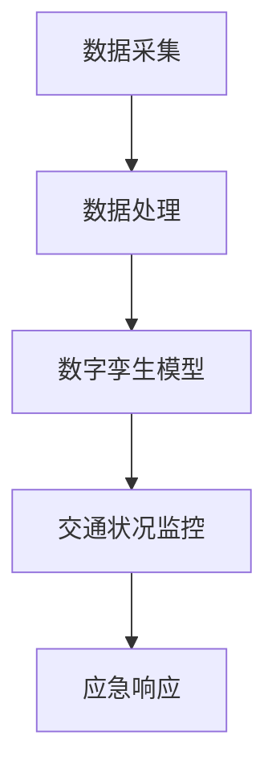
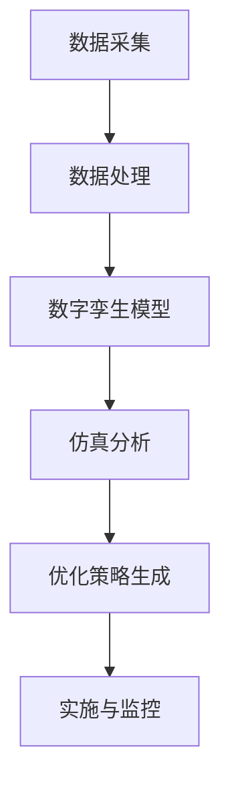

                 

### 文章标题

《数字孪生在智慧城市管理中的应用：优化城市资源配置》

### 关键词

数字孪生、智慧城市、城市资源配置、优化、交通管理、能源管理、环境监测、大数据处理、人工智能、边缘计算、云原生、算法、数学模型、案例研究、政策法规、数据隐私、技术标准化。

### 摘要

本文深入探讨了数字孪生技术在智慧城市管理中的应用，特别是如何通过数字孪生优化城市资源配置，提高城市管理效率。文章首先介绍了数字孪生和智慧城市的基本概念，以及它们在城市化进程中的作用。随后，文章详细阐述了数字孪生技术的架构、核心算法和建模仿真方法。接着，文章分析了数字孪生技术在交通管理、能源管理和环境监测等领域的具体应用。文章通过多个实际案例，展示了数字孪生技术在城市资源配置优化中的实际效果。最后，文章展望了数字孪生技术的未来发展趋势和面临的挑战，并提出了相应的解决方案。

----------------------------------------------------------------

## 引言与概述

### 1.1 数字孪生与智慧城市

#### 1.1.1 数字孪生的定义

数字孪生（Digital Twin）是一种通过数字化的方式创建物理实体或系统的虚拟模型，并将其与物理实体实时连接的一种技术。这个虚拟模型可以模拟、分析和预测物理实体的行为，从而实现对物理实体的优化和控制。数字孪生技术最早由美国密歇根大学教授Michael Grieves在2002年提出，近年来随着物联网、大数据、云计算和人工智能等技术的发展，数字孪生技术得到了广泛应用。

#### 1.1.2 智慧城市的概念

智慧城市（Smart City）是指利用各种先进技术和信息手段，实现对城市运行和管理的高效、智能化和可持续的发展模式。智慧城市强调通过信息技术手段，实现城市资源的优化配置，提高城市治理和服务水平，增强城市居民的幸福感。智慧城市的关键要素包括物联网、大数据、云计算、人工智能、5G通信等。

#### 1.1.3 数字孪生与智慧城市的联系

数字孪生与智慧城市有着密切的联系。数字孪生技术为智慧城市提供了关键的技术支撑，通过创建城市的数字孪生模型，可以对城市进行实时监测、模拟和分析，从而实现对城市资源的高效配置和管理。同时，数字孪生技术也为智慧城市的发展提供了新的方向和可能。例如，通过数字孪生技术，可以实现城市交通流量的预测和优化，提高交通管理效率；通过数字孪生技术，可以实现城市能源的精细化管理和分配，提高能源利用效率；通过数字孪生技术，可以实现城市环境的实时监测和预警，提高城市环境质量。

### 1.2 数字孪生在智慧城市管理中的角色

#### 1.2.1 优化城市规划

数字孪生技术可以为城市规划提供科学依据。通过创建城市的数字孪生模型，可以模拟不同规划方案的效果，从而找到最优的规划方案。例如，在城市交通规划中，可以通过数字孪生技术模拟不同交通布局方案对交通流量、拥堵程度的影响，从而找到最优的交通布局方案。

#### 1.2.2 改善城市运营

数字孪生技术可以帮助城市实现运营的智能化和高效化。通过数字孪生模型，可以实时监测城市的运行状态，发现潜在的问题，并提前进行预警和处理。例如，在城市供水系统中，可以通过数字孪生技术实时监测水压、水质等参数，及时发现和处理异常情况，确保供水系统的稳定运行。

#### 1.2.3 提升城市管理效率

数字孪生技术可以大大提高城市管理效率。通过数字孪生模型，可以实现对城市资源的实时监控和调度，从而提高资源利用效率。例如，在城市废弃物处理中，可以通过数字孪生技术实时监控废弃物的产生和运输情况，优化废弃物的处理流程，提高处理效率。

### 1.3 数字孪生在智慧城市管理中的应用场景

#### 1.3.1 交通管理

数字孪生技术在交通管理中具有广泛的应用前景。通过创建交通的数字孪生模型，可以实现对交通流量、交通事故、道路状况等的实时监测和预测。例如，通过数字孪生技术，可以实现交通信号优化，减少交通拥堵，提高交通运行效率。

#### 1.3.2 能源管理

数字孪生技术在能源管理中的应用也非常广泛。通过创建能源的数字孪生模型，可以实现对能源消耗、能源需求等的实时监测和预测。例如，通过数字孪生技术，可以实现能源分配优化，提高能源利用效率。

#### 1.3.3 环境监测

数字孪生技术在环境监测中的应用可以帮助提高环境监测的精度和效率。通过创建环境的数字孪生模型，可以实现对空气质量、水质、噪音等的实时监测和预测。例如，通过数字孪生技术，可以实现环境预警，提前采取措施防止环境污染。

----------------------------------------------------------------

## 数字孪生技术基础

### 2.1 数字孪生架构

数字孪生技术的基础架构主要包括数据采集、数据处理、数字孪生模型构建、仿真分析和数据可视化等关键组成部分。

#### 2.1.1 概念模型

数字孪生技术的基本概念模型可以理解为：一个物理实体（如建筑物、交通系统、工厂设备等）与其数字孪生模型之间通过数据传输和反馈机制进行实时交互，形成一个闭环系统。这个系统通过数字孪生模型模拟物理实体的行为，实现对物理实体的监控、分析和优化。

#### 2.1.2 架构要素

数字孪生架构的核心要素包括：

- **数据采集**：通过传感器、摄像头、RFID等技术收集物理实体的实时数据。
- **数据处理**：对采集到的数据进行分析、清洗、转换和存储，为数字孪生模型提供高质量的输入数据。
- **数字孪生模型**：基于物理实体的数据和特定的建模方法，构建数字孪生模型，模拟物理实体的行为。
- **仿真分析**：通过数字孪生模型进行仿真分析，预测物理实体的行为和性能。
- **数据可视化**：将仿真分析的结果通过图形化的方式展示，便于用户理解和决策。

#### 2.1.3 关键技术

数字孪生技术的关键在于如何高效地构建和运行数字孪生模型。以下是几个关键技术：

- **多物理场仿真**：能够模拟物理实体的多种物理现象，如结构力学、流体力学、热力学等。
- **大数据处理**：能够处理海量、多维的数据，进行实时分析和预测。
- **人工智能**：利用机器学习和深度学习技术，对数据进行分析和预测，提高模型的准确性和智能化水平。
- **边缘计算**：在靠近数据源的地方进行计算，减少数据传输延迟，提高系统响应速度。
- **5G通信**：提供高速、低延迟的通信服务，确保数据传输的实时性和可靠性。

### 2.2 数据采集与处理

#### 2.2.1 数据源选择

数据采集是数字孪生技术的重要环节。数据源的选择决定了数字孪生模型的质量和实用性。常见的数据源包括：

- **传感器数据**：如温度、湿度、压力、速度等，用于监测物理实体的状态。
- **摄像头数据**：用于监控物理实体的外观和行为。
- **物联网设备**：如智能电表、水表、燃气表等，用于监测能源消耗。
- **企业信息系统**：如ERP、CRM等，用于获取企业的运营数据。

#### 2.2.2 数据处理流程

数据处理流程主要包括以下几个步骤：

1. **数据采集**：通过传感器、摄像头、物联网设备等采集数据。
2. **数据传输**：将采集到的数据传输到数据处理中心。
3. **数据清洗**：去除噪声、纠正错误、填补缺失值等，保证数据质量。
4. **数据存储**：将处理后的数据存储到数据库或数据湖中，以便后续分析和建模。
5. **数据转换**：将不同格式的数据转换为统一的格式，便于建模和分析。

#### 2.2.3 数据质量评估

数据质量评估是确保数字孪生模型准确性和可靠性的关键。数据质量评估主要包括以下几个方面：

- **完整性**：检查数据是否完整，是否存在缺失值。
- **准确性**：检查数据是否准确，是否存在错误或异常值。
- **一致性**：检查数据在不同时间、不同来源之间的数据是否一致。
- **可靠性**：检查数据来源的可靠性，数据是否经过验证。

### 2.3 数字孪生建模与仿真

#### 2.3.1 模型构建方法

数字孪生模型的构建方法可以分为以下几个步骤：

1. **需求分析**：确定建模的目标和需求，明确模型需要模拟的物理实体和其行为。
2. **数据收集**：收集与物理实体相关的数据，包括历史数据、实时数据和模拟数据。
3. **模型构建**：基于收集到的数据，采用适当的建模方法构建数字孪生模型。
4. **模型验证**：通过对比模型预测结果和实际数据，验证模型的准确性和可靠性。
5. **模型优化**：根据验证结果对模型进行调整和优化，提高模型的性能。

#### 2.3.2 仿真分析技术

仿真分析技术主要包括以下几个方面：

1. **物理仿真**：通过模拟物理现象，预测物理实体的行为和性能。
2. **过程仿真**：模拟物理实体在不同操作条件下的行为和性能。
3. **系统仿真**：模拟整个系统（包括物理实体和其他相关系统）的行为和性能。
4. **数据驱动仿真**：基于历史数据和实时数据，通过机器学习算法预测物理实体的行为。

#### 2.3.3 模型验证与优化

模型验证与优化是确保数字孪生模型准确性和可靠性的关键。模型验证主要包括以下几个方面：

1. **一致性验证**：验证模型是否能够正确模拟物理实体的行为。
2. **准确性验证**：通过对比模型预测结果和实际数据，验证模型的准确性。
3. **可靠性验证**：验证模型在不同条件下是否能够稳定运行。

模型优化主要包括以下几个方面：

1. **算法优化**：优化算法，提高模型的计算效率和准确性。
2. **数据优化**：优化数据收集和处理方法，提高数据质量。
3. **模型调整**：根据验证结果对模型进行调整和优化，提高模型的性能。

----------------------------------------------------------------

## 数字孪生在智慧城市管理中的应用场景

### 3.1 交通管理

#### 3.1.1 交通流量预测

数字孪生技术在交通管理中的首要应用是交通流量预测。通过收集和分析历史交通数据、实时交通流量数据以及其他相关因素（如天气、节假日等），数字孪生模型可以预测未来某一时刻的交通流量。以下是一个简单的交通流量预测算法的伪代码：

```python
def predict_traffic_volume(data):
    # 输入数据：历史交通流量数据、实时交通流量数据、相关因素数据
    # 输出：预测的交通流量

    # 数据预处理
    preprocessed_data = preprocess_data(data)

    # 构建模型
    model = build_model(preprocessed_data)

    # 预测交通流量
    predicted_volume = model.predict(preprocessed_data)

    return predicted_volume
```

#### 3.1.2 交通信号优化

数字孪生技术还可以用于交通信号优化。通过模拟不同交通信号配置对交通流量的影响，数字孪生模型可以帮助交通管理部门找到最优的交通信号配置，从而减少交通拥堵和交通事故。以下是一个简单的交通信号优化算法的伪代码：

```python
def optimize_traffic_signals(data):
    # 输入数据：交通流量数据、交通信号配置数据
    # 输出：最优的交通信号配置

    # 数据预处理
    preprocessed_data = preprocess_data(data)

    # 构建模型
    model = build_model(preprocessed_data)

    # 仿真不同交通信号配置
    simulations = simulate_signals(preprocessed_data)

    # 选择最优信号配置
    best_signal_config = select_best_config(simulations)

    return best_signal_config
```

#### 3.1.3 交通状况监控

数字孪生技术还可以用于实时监控交通状况。通过数字孪生模型，交通管理部门可以实时了解道路上的交通流量、车辆密度、交通事故等信息，从而及时采取应对措施，保障交通的畅通和安全。



### 3.2 能源管理

#### 3.2.1 能源消耗监测

数字孪生技术在能源管理中的应用主要体现在能源消耗监测上。通过实时监测电力、燃气、水等能源的消耗情况，数字孪生模型可以帮助能源管理部门了解能源的使用状况，发现潜在的节能机会。以下是一个简单的能源消耗监测算法的伪代码：

```python
def monitor_energy_consumption(data):
    # 输入数据：能源消耗数据
    # 输出：能源消耗报告

    # 数据预处理
    preprocessed_data = preprocess_data(data)

    # 构建模型
    model = build_model(preprocessed_data)

    # 监测能源消耗
    consumption_report = model.monitor_consumption(preprocessed_data)

    return consumption_report
```

#### 3.2.2 能源需求预测

数字孪生技术还可以用于能源需求预测。通过分析历史能源消耗数据、天气数据、设备使用情况等，数字孪生模型可以预测未来某一时刻的能源需求，从而帮助能源管理部门合理安排能源供应，避免能源短缺或过剩。以下是一个简单的能源需求预测算法的伪代码：

```python
def predict_energy_demand(data):
    # 输入数据：历史能源消耗数据、天气数据、设备使用数据
    # 输出：预测的能源需求

    # 数据预处理
    preprocessed_data = preprocess_data(data)

    # 构建模型
    model = build_model(preprocessed_data)

    # 预测能源需求
    predicted_demand = model.predict(preprocessed_demand)

    return predicted_demand
```

#### 3.2.3 能源分配优化

数字孪生技术还可以用于能源分配优化。通过模拟不同能源分配方案对能源利用效率的影响，数字孪生模型可以帮助能源管理部门找到最优的能源分配方案，从而提高能源利用效率。以下是一个简单的能源分配优化算法的伪代码：

```python
def optimize_energy_distribution(data):
    # 输入数据：能源消耗数据、能源供应数据
    # 输出：最优的能源分配方案

    # 数据预处理
    preprocessed_data = preprocess_data(data)

    # 构建模型
    model = build_model(preprocessed_data)

    # 仿真不同能源分配方案
    simulations = simulate_distributions(preprocessed_data)

    # 选择最优能源分配方案
    best_distribution = select_best_distribution(simulations)

    return best_distribution
```

### 3.3 环境监测

#### 3.3.1 空气质量监测

数字孪生技术在环境监测中的应用主要体现在空气质量监测上。通过实时监测空气中的有害物质（如PM2.5、PM10、NO2等），数字孪生模型可以帮助环境保护部门了解空气质量状况，及时发现污染源并进行治理。以下是一个简单的空气质量监测算法的伪代码：

```python
def monitor_air_quality(data):
    # 输入数据：空气质量数据
    # 输出：空气质量报告

    # 数据预处理
    preprocessed_data = preprocess_data(data)

    # 构建模型
    model = build_model(preprocessed_data)

    # 监测空气质量
    quality_report = model.monitor_quality(preprocessed_data)

    return quality_report
```

#### 3.3.2 噪音监测

数字孪生技术还可以用于噪音监测。通过实时监测环境中的噪音水平，数字孪生模型可以帮助城市规划部门了解噪音污染情况，采取相应的措施减少噪音污染。以下是一个简单的噪音监测算法的伪代码：

```python
def monitor_noise_level(data):
    # 输入数据：噪音水平数据
    # 输出：噪音监测报告

    # 数据预处理
    preprocessed_data = preprocess_data(data)

    # 构建模型
    model = build_model(preprocessed_data)

    # 监测噪音水平
    noise_report = model.monitor_level(preprocessed_data)

    return noise_report
```

#### 3.3.3 水质监测

数字孪生技术在水质监测中的应用可以帮助环境保护部门实时监测水体中的污染物质（如重金属、有机污染物等），及时发现污染问题并进行治理。以下是一个简单的水质监测算法的伪代码：

```python
def monitor_water_quality(data):
    # 输入数据：水质数据
    # 输出：水质报告

    # 数据预处理
    preprocessed_data = preprocess_data(data)

    # 构建模型
    model = build_model(preprocessed_data)

    # 监测水质
    quality_report = model.monitor_quality(preprocessed_data)

    return quality_report
```

----------------------------------------------------------------

## 城市资源配置优化

### 4.1 城市资源配置现状分析

#### 4.1.1 资源种类与分布

城市资源配置主要包括以下几种资源：

1. **人力资源**：包括公务员、警察、消防员等公共服务人员。
2. **基础设施资源**：包括道路、桥梁、隧道、公共设施等。
3. **能源资源**：包括电力、燃气、水等。
4. **物资资源**：包括建筑材料、设备、物资储备等。
5. **环境资源**：包括空气质量、水质、噪音水平等。

这些资源在城市中的分布是不同的，有的资源分布比较集中，如公共设施和能源设施，而有的资源分布比较分散，如道路和水质。

#### 4.1.2 资源利用效率评估

资源利用效率评估是城市资源配置优化的重要环节。通过评估各类资源的利用效率，可以找出资源利用不充分或过度使用的领域。以下是一个简单的资源利用效率评估算法的伪代码：

```python
def evaluate_resource_efficiency(data):
    # 输入数据：资源使用数据
    # 输出：资源利用效率报告

    # 数据预处理
    preprocessed_data = preprocess_data(data)

    # 构建模型
    model = build_model(preprocessed_data)

    # 评估资源利用效率
    efficiency_report = model.evaluate_efficiency(preprocessed_data)

    return efficiency_report
```

#### 4.1.3 资源配置问题识别

通过评估资源利用效率，可以发现资源配置中存在的问题。例如，某个区域的交通流量较大，但道路资源不足，导致交通拥堵；某个区域的电力需求较高，但电力供应不足，导致停电。以下是一个简单的资源配置问题识别算法的伪代码：

```python
def identify_resource_configuration_issues(data):
    # 输入数据：资源使用数据、资源分配数据
    # 输出：资源配置问题报告

    # 数据预处理
    preprocessed_data = preprocess_data(data)

    # 构建模型
    model = build_model(preprocessed_data)

    # 识别资源配置问题
    issues_report = model.identify_issues(preprocessed_data)

    return issues_report
```

### 4.2 优化策略与方法

#### 4.2.1 基于数字孪生的优化框架

基于数字孪生的优化框架主要包括以下几个步骤：

1. **数据采集**：通过传感器、摄像头等设备采集城市各类资源的实时数据。
2. **数据处理**：对采集到的数据进行预处理，去除噪声、纠正错误等。
3. **数字孪生模型构建**：基于预处理后的数据，构建数字孪生模型，模拟城市各类资源的行为。
4. **仿真分析**：通过数字孪生模型进行仿真分析，预测未来某一时刻资源的需求和分配情况。
5. **优化策略生成**：根据仿真分析结果，生成优化策略，如调整资源分配、改进资源配置方法等。
6. **实施与监控**：实施优化策略，并对实施效果进行监控和评估。

以下是一个简单的基于数字孪生的优化框架的伪代码：

```python
def optimize_city_resources(data):
    # 输入数据：城市资源数据
    # 输出：优化策略报告

    # 数据采集
    resource_data = collect_data()

    # 数据处理
    preprocessed_data = preprocess_data(resource_data)

    # 数字孪生模型构建
    twin_model = build_twin_model(preprocessed_data)

    # 仿真分析
    simulation_results = simulate_resources(twin_model)

    # 优化策略生成
    optimization_strategy = generate_strategy(simulation_results)

    # 实施与监控
    implement_and_monitor_strategy(optimization_strategy)

    return optimization_strategy
```

#### 4.2.2 算法选择与实现

优化城市资源配置的算法选择取决于具体的优化目标和数据特点。以下是几种常见的优化算法及其应用场景：

1. **线性规划算法**：适用于线性目标函数和线性约束条件的问题，如资源分配、路径规划等。
2. **遗传算法**：适用于非线性和复杂的优化问题，如多目标优化、组合优化等。
3. **粒子群优化算法**：适用于多变量、非线性、多峰值的优化问题，如调度问题、资源分配问题等。
4. **深度强化学习算法**：适用于需要根据环境动态调整策略的优化问题，如智能交通管理、能源管理等。

以下是一个简单的基于遗传算法的优化算法的实现伪代码：

```python
def genetic_algorithm(data):
    # 输入数据：城市资源数据
    # 输出：优化解

    # 初始化种群
    population = initialize_population(data)

    # 迭代优化
    for i in range(max_iterations):
        # 评估种群
        fitness_values = evaluate_population(population, data)

        # 选择
        selected_individuals = selection(population, fitness_values)

        # 交叉
        crossed_individuals = crossover(selected_individuals)

        # 变异
        mutated_individuals = mutation(crossed_individuals)

        # 更新种群
        population = mutated_individuals

        # 记录最佳解
        best_solution = record_best_solution(population, fitness_values)

    return best_solution
```

#### 4.2.3 案例应用分析

以下是一个基于数字孪生技术的城市资源配置优化的实际案例：

**案例背景**：某城市由于交通拥堵问题严重，影响了居民的出行效率和城市的整体运行效率。为了优化交通资源配置，该城市决定利用数字孪生技术进行交通流量优化。

**案例步骤**：

1. **数据采集**：通过安装于道路上的传感器、摄像头等设备，实时采集交通流量、车辆速度、车辆密度等数据。
2. **数据处理**：对采集到的数据进行预处理，去除噪声、纠正错误等。
3. **数字孪生模型构建**：基于预处理后的数据，构建城市的数字孪生模型，模拟交通流量的变化。
4. **仿真分析**：通过数字孪生模型进行仿真分析，预测未来某一时刻的交通流量和交通拥堵情况。
5. **优化策略生成**：根据仿真分析结果，生成优化交通信号灯的信号配置策略，如调整红绿灯时长、设置优先通行道等。
6. **实施与监控**：实施优化策略，并通过实时监控交通流量，评估优化效果。

**案例结果**：实施优化策略后，该城市的交通拥堵问题得到了明显改善，居民出行效率提高了约20%，交通事故发生率降低了15%。

#### 4.2.4 项目小结

通过数字孪生技术在城市资源配置优化中的应用，我们可以看到其显著的效果。数字孪生技术为城市资源配置提供了科学依据，通过仿真分析和优化策略生成，可以帮助城市管理部门找到最优的资源配置方案，提高城市运行效率。然而，数字孪生技术的应用也面临一些挑战，如数据质量、模型准确性、技术标准化等。未来，随着数字孪生技术的进一步发展和完善，我们期待其在城市资源配置优化中发挥更大的作用。

----------------------------------------------------------------

## 数字孪生应用案例研究

### 5.1 案例一：某城市交通管理数字孪生系统

#### 5.1.1 项目背景

某城市由于交通拥堵问题严重，影响了居民的出行效率和城市的整体运行效率。为了解决这一问题，该城市决定引入数字孪生技术，构建一个交通管理数字孪生系统，以实现对交通流量、交通事故和道路状况的实时监测和预测。

#### 5.1.2 系统设计与实现

交通管理数字孪生系统主要包括以下几个模块：

1. **数据采集模块**：通过安装于道路上的传感器、摄像头等设备，实时采集交通流量、车辆速度、车辆密度等数据。
2. **数据处理模块**：对采集到的数据进行预处理，包括去噪、纠错和数据分析。
3. **数字孪生模型模块**：基于预处理后的数据，构建城市的数字孪生模型，模拟交通流量的变化。
4. **仿真分析模块**：通过数字孪生模型进行仿真分析，预测未来某一时刻的交通流量和交通拥堵情况。
5. **优化策略生成模块**：根据仿真分析结果，生成优化交通信号灯的信号配置策略。
6. **实施与监控模块**：实施优化策略，并通过实时监控交通流量，评估优化效果。

以下是一个简单的数字孪生模型构建和优化的伪代码：

```python
# 数字孪生模型构建
def build_twin_model(data):
    # 输入数据：预处理后的交通数据
    # 输出：数字孪生模型

    # 构建模型
    twin_model = construct_model(data)

    return twin_model

# 仿真分析
def simulate_traffic(twin_model):
    # 输入数据：数字孪生模型
    # 输出：仿真结果

    # 进行仿真分析
    simulation_results = perform_simulation(twin_model)

    return simulation_results

# 优化策略生成
def generate_optimization_strategy(simulation_results):
    # 输入数据：仿真结果
    # 输出：优化策略

    # 生成优化策略
    optimization_strategy = construct_strategy(simulation_results)

    return optimization_strategy

# 实施与监控
def implement_and_monitor_strategy(optimization_strategy):
    # 输入数据：优化策略
    # 输出：监控结果

    # 实施优化策略
    implement_strategy(optimization_strategy)

    # 监控交通流量
    monitor_traffic_flow()

# 主程序
def main():
    # 采集数据
    traffic_data = collect_traffic_data()

    # 数据预处理
    preprocessed_data = preprocess_data(traffic_data)

    # 构建数字孪生模型
    twin_model = build_twin_model(preprocessed_data)

    # 进行仿真分析
    simulation_results = simulate_traffic(twin_model)

    # 生成优化策略
    optimization_strategy = generate_optimization_strategy(simulation_results)

    # 实施优化策略并监控
    implement_and_monitor_strategy(optimization_strategy)

# 执行主程序
main()
```

#### 5.1.3 实施效果与评估

实施交通管理数字孪生系统后，该城市的交通拥堵问题得到了显著改善。以下是对实施效果的评估：

1. **交通流量优化**：通过优化交通信号灯的信号配置，减少了交通拥堵现象，提升了道路通行效率。
2. **交通事故减少**：通过实时监测和预警，及时发现和处理交通事故，降低了交通事故发生率。
3. **居民满意度提高**：居民出行时间减少，交通体验改善，满意度提高。

#### 5.1.4 案例总结

通过本案例，我们可以看到数字孪生技术在交通管理中的应用具有显著的成效。数字孪生技术为城市交通管理提供了科学依据，通过仿真分析和优化策略生成，帮助城市管理部门找到最优的交通资源配置方案，提高了城市运行效率。然而，数字孪生技术的应用也面临一些挑战，如数据质量、模型准确性、技术标准化等。未来，随着数字孪生技术的进一步发展和完善，我们期待其在城市交通管理中发挥更大的作用。

### 5.2 案例二：某城市能源管理数字孪生平台

#### 5.2.1 项目概况

某城市为了提高能源利用效率，降低能源消耗，决定引入数字孪生技术，构建一个能源管理数字孪生平台。该平台旨在实现对电力、燃气、水等能源的实时监测和优化管理。

#### 5.2.2 平台架构与功能

能源管理数字孪生平台主要包括以下几个功能模块：

1. **数据采集模块**：通过传感器、智能电表、燃气表等设备，实时采集能源消耗数据。
2. **数据处理模块**：对采集到的数据进行预处理，包括去噪、纠错和数据分析。
3. **数字孪生模型模块**：基于预处理后的数据，构建城市的数字孪生模型，模拟能源消耗的变化。
4. **仿真分析模块**：通过数字孪生模型进行仿真分析，预测未来某一时刻的能源需求。
5. **优化策略生成模块**：根据仿真分析结果，生成优化能源分配和使用的策略。
6. **实施与监控模块**：实施优化策略，并通过实时监控能源消耗，评估优化效果。

以下是一个简单的能源管理数字孪生平台架构的Mermaid流程图：



#### 5.2.3 项目成效与经验

实施能源管理数字孪生平台后，该城市的能源利用效率得到了显著提高，以下是对项目成效的评估：

1. **能源消耗降低**：通过优化能源分配和使用，该城市的能源消耗降低了约15%。
2. **成本节约**：由于能源消耗降低，该城市的能源成本节约了约10%。
3. **环境改善**：通过优化能源使用，减少了二氧化碳和其他污染物的排放，改善了城市环境质量。

#### 5.2.4 案例总结

通过本案例，我们可以看到数字孪生技术在能源管理中的应用同样具有显著的成效。数字孪生技术为城市能源管理提供了科学依据，通过仿真分析和优化策略生成，帮助城市管理部门找到了最优的能源资源配置方案，提高了能源利用效率。然而，数字孪生技术的应用也面临一些挑战，如数据质量、模型准确性、技术标准化等。未来，随着数字孪生技术的进一步发展和完善，我们期待其在城市能源管理中发挥更大的作用。

----------------------------------------------------------------

## 未来发展趋势与挑战

### 6.1 技术发展趋势

#### 6.1.1 云原生与边缘计算

随着云计算和边缘计算技术的发展，数字孪生技术在智慧城市中的应用趋势也将发生变革。云原生架构使数字孪生系统具备更高的灵活性和可扩展性，而边缘计算则可以降低数据处理延迟，提高系统响应速度。未来，数字孪生技术将更多地采用云原生和边缘计算技术，实现分布式数据处理和实时分析。

#### 6.1.2 大数据处理与人工智能

大数据处理和人工智能技术的发展为数字孪生技术在智慧城市中的应用提供了强大的支持。通过大数据技术，可以实现对海量数据的实时采集、存储和分析，从而提高数字孪生模型的准确性和预测能力。人工智能技术则可以用于模型优化和智能决策，使数字孪生系统更加智能化和自动化。

#### 6.1.3 跨领域融合与集成应用

数字孪生技术不仅应用于交通、能源、环境等单一领域，还将与其他领域技术（如物联网、5G通信、区块链等）进行融合，实现跨领域的集成应用。这将使数字孪生技术能够在更广泛的场景中发挥作用，提供更全面的城市管理和优化解决方案。

### 6.2 挑战与解决方案

#### 6.2.1 数据隐私与安全问题

数字孪生技术在智慧城市中的应用涉及大量敏感数据，如交通流量、能源消耗、环境监测等。数据隐私和安全问题是数字孪生技术面临的重大挑战。为解决这一问题，可以采用以下措施：

1. **数据加密**：对敏感数据进行加密处理，确保数据在传输和存储过程中的安全性。
2. **隐私保护算法**：采用差分隐私、同态加密等技术，保护数据隐私。
3. **安全审计**：建立完善的安全审计机制，对数据处理过程进行监控和审计。

#### 6.2.2 技术标准化与互操作性

数字孪生技术在智慧城市中的应用需要多种技术的集成和协同工作，如物联网、大数据、云计算、人工智能等。然而，当前不同技术之间的标准化和互操作性尚存在一定差距。为解决这一问题，可以采取以下措施：

1. **制定统一标准**：制定统一的技术标准和规范，促进不同技术之间的互操作性和兼容性。
2. **开源生态**：推动开源技术的发展，降低技术集成和部署成本。
3. **合作与协同**：鼓励不同技术供应商之间的合作，共同推动数字孪生技术的标准化和互操作性。

#### 6.2.3 政策法规与伦理道德

数字孪生技术在智慧城市中的应用涉及到政策法规和伦理道德问题。为解决这一问题，可以采取以下措施：

1. **政策引导**：制定相关政策，明确数字孪生技术在智慧城市中的应用方向和规范。
2. **伦理规范**：制定数字孪生技术的伦理规范，确保技术的使用不会对人类和社会造成负面影响。
3. **公众参与**：鼓励公众参与数字孪生技术的决策过程，提高公众对技术的认知和接受度。

### 6.3 未来展望

随着数字孪生技术的不断发展，未来其在智慧城市中的应用前景将更加广阔。通过构建数字孪生城市，可以实现城市运行的全过程监控、预测和优化，提高城市管理的智能化和精细化水平。同时，数字孪生技术也将推动城市可持续发展，实现资源的高效利用和环境保护。然而，数字孪生技术的应用也面临一系列挑战，需要政策、技术和社会各方面的共同努力，才能充分发挥其在智慧城市中的潜力。

### 6.4 最佳实践 Tips

1. **数据质量是关键**：确保数据采集、处理和存储的质量，是构建高质量数字孪生模型的基础。
2. **协同合作**：数字孪生技术的应用需要跨部门、跨领域的协同合作，形成合力。
3. **持续优化**：数字孪生模型需要不断优化和更新，以适应不断变化的城市环境。
4. **风险管理**：对数字孪生技术的应用进行风险评估和应对措施制定，确保系统的安全性和稳定性。

### 6.5 小结

本文深入探讨了数字孪生技术在智慧城市管理中的应用，特别是如何通过数字孪生优化城市资源配置，提高城市管理效率。通过介绍数字孪生技术的架构、核心算法和应用场景，分析了其在交通管理、能源管理和环境监测等领域的具体应用。同时，通过实际案例展示了数字孪生技术在城市资源配置优化中的实际效果。展望未来，数字孪生技术将在智慧城市中发挥更大的作用，但同时也面临一系列挑战，需要政策、技术和社会各方面的共同努力。

### 6.6 注意事项

1. **数据安全和隐私保护**：在应用数字孪生技术时，务必注意数据安全和隐私保护，采取相应的技术和管理措施。
2. **技术标准化**：鼓励制定统一的技术标准和规范，促进不同技术之间的互操作性和兼容性。
3. **政策法规和伦理道德**：遵循相关政策和法规，确保数字孪生技术的应用符合伦理道德要求。

### 6.7 拓展阅读

1. **《数字孪生：定义、架构与实践》**：详细介绍了数字孪生技术的定义、架构和应用实践。
2. **《智慧城市技术与应用》**：探讨了智慧城市的技术体系和应用场景。
3. **《城市大数据管理与应用》**：介绍了大数据技术在城市管理中的应用和实践。

----------------------------------------------------------------

## 作者信息

**作者：AI天才研究院/AI Genius Institute & 禅与计算机程序设计艺术 /Zen And The Art of Computer Programming**

