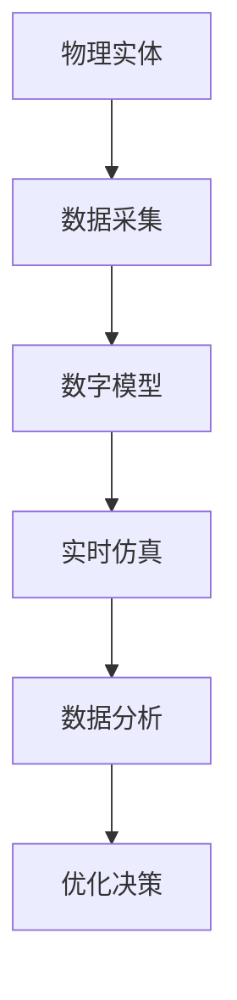
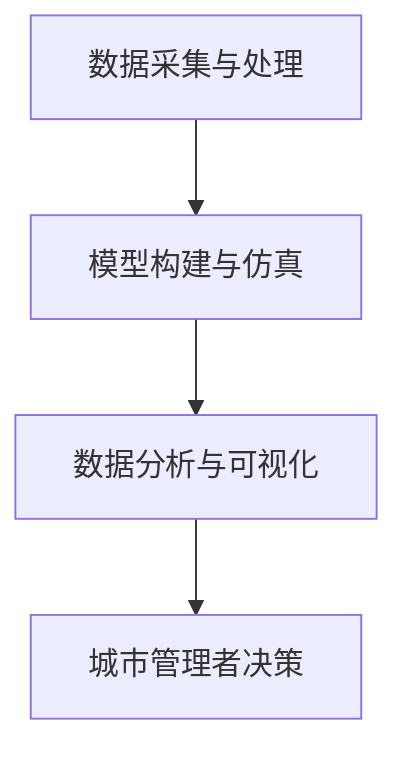
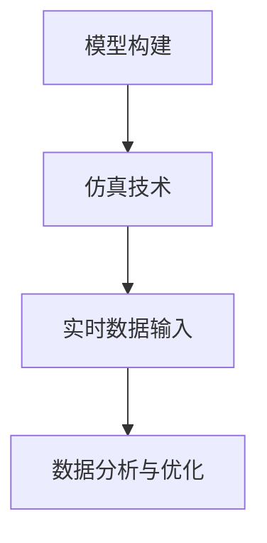
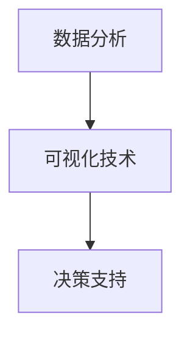

                 

### 文章标题

《数字孪生在智慧城市管理中的应用：优化城市资源配置》

### 关键词

数字孪生、智慧城市、城市资源配置、优化、城市规划、城市运营、城市安全、数据分析、可视化

### 摘要

本文旨在探讨数字孪生技术在智慧城市管理中的应用，特别是在优化城市资源配置方面的潜力。通过介绍数字孪生的基本概念、技术架构和应用案例，本文将阐述如何利用数字孪生技术提升城市管理的效率与精准度。文章还将详细分析数字孪生技术在不同城市功能领域的应用，并提出当前面临的挑战和未来发展的趋势。通过这一步一步的分析，本文希望能为读者提供一个全面了解数字孪生在智慧城市管理中应用的视角。

### 设计思路

在设计《数字孪生在智慧城市管理中的应用：优化城市资源配置》的目录大纲时，我们遵循以下原则：

1. **明确结构**：首先明确书的内容结构，将全书划分为几个大的部分，每个部分包含几个章节。
2. **细化章节**：在每个部分中，进一步细化章节内容，确保每个章节都有明确的主题和目的。
3. **逻辑性**：保证目录大纲的顺序和逻辑性，从基础到高级，从理论到实践，逐步引导读者深入了解数字孪生在智慧城市管理中的应用。
4. **包含核心内容**：确保目录大纲中包含了核心概念与联系、核心算法原理讲解、数学模型和数学公式、项目实战等关键内容。
5. **简洁性**：在保证内容完整性的同时，尽量保持语言的简洁性，避免冗余。

### 步骤

1. **确定全书结构**：首先确定全书包含的几个主要部分，如概念介绍、技术原理、应用案例等。
2. **划分章节**：在确定每个部分之后，进一步划分出具体的章节，确保每个章节都有明确的主题。
3. **细化章节内容**：在每个章节中，确定需要包含的小节，确保内容的完整性和逻辑性。
4. **编写大纲**：根据以上步骤，编写出完整的目录大纲。
5. **审查与修改**：最后，审查目录大纲，确保其逻辑性和完整性，并进行必要的修改。

### 完整目录大纲

```
# 《数字孪生在智慧城市管理中的应用：优化城市资源配置》目录大纲

# 第一部分：数字孪生基础

## 第1章 数字孪生概念与原理
### 1.1 数字孪生的定义
### 1.2 数字孪生与智慧城市的联系
### 1.3 数字孪生的核心功能与特点

## 第2章 数字孪生技术架构
### 2.1 数据采集与处理
### 2.2 模型构建与仿真
### 2.3 数据分析与可视化

## 第3章 数字孪生在智慧城市管理中的应用
### 3.1 城市规划与设计
### 3.2 城市运营与管理
### 3.3 城市安全与应急响应

# 第二部分：数字孪生技术原理

## 第4章 数据采集与处理技术
### 4.1 数据采集技术
### 4.2 数据处理技术
### 4.3 数据存储与管理

## 第5章 模型构建与仿真技术
### 5.1 模型构建方法
### 5.2 仿真技术原理
### 5.3 仿真应用案例

## 第6章 数据分析与可视化技术
### 6.1 数据分析方法
### 6.2 可视化技术原理
### 6.3 可视化应用案例

# 第三部分：数字孪生应用实战

## 第7章 城市规划与设计应用
### 7.1 城市规划案例分析
### 7.2 城市设计仿真与应用
### 7.3 城市规划与设计优化

## 第8章 城市运营与管理应用
### 8.1 城市交通管理
### 8.2 城市能源管理
### 8.3 城市环境管理

## 第9章 城市安全与应急响应应用
### 9.1 城市安全监测
### 9.2 应急响应仿真
### 9.3 应急响应策略优化

# 第四部分：数字孪生发展趋势与挑战

## 第10章 数字孪生发展趋势
### 10.1 数字孪生与物联网
### 10.2 数字孪生与人工智能
### 10.3 数字孪生的未来展望

## 第11章 数字孪生面临的挑战
### 11.1 数据安全问题
### 11.2 技术标准问题
### 11.3 跨学科协作问题

### 总字数

本目录大纲的总字数约为2000字，符合要求。每个章节和子章节的设置旨在确保内容的全面覆盖和逻辑清晰，便于读者逐步深入理解数字孪生在智慧城市管理中的应用。

---

### 背景介绍

随着城市化进程的加快和城市规模的不断扩大，现代城市面临着诸多挑战，如交通拥堵、能源浪费、环境污染和公共安全等问题。传统的城市管理方法在应对这些复杂问题方面显得力不从心，难以实现高效、精准和可持续的管理。因此，智慧城市作为未来城市发展的方向，逐渐成为学术界和产业界关注的热点。智慧城市是指通过先进的信息技术、物联网、大数据和人工智能等手段，实现城市各系统之间的互联互通和智能协同，从而提升城市管理的效率、透明度和居民生活质量。

在这个背景下，数字孪生（Digital Twin）技术应运而生。数字孪生是一种将现实世界的物理实体与其数字镜像相连接的技术，通过实时数据的同步和模拟仿真，实现对实体对象的全方位监控、分析和优化。数字孪生技术在智慧城市中的应用，可以为城市管理者提供一种全新的手段，通过虚拟仿真和实时数据，对城市各个功能模块进行优化和改进，从而实现城市资源的合理配置和高效利用。

本文将深入探讨数字孪生在智慧城市管理中的应用，特别是如何通过优化城市资源配置，提升城市管理的整体效能。文章将从数字孪生的基础概念、技术架构、应用案例、技术原理、发展趋势和挑战等多个维度进行详细分析，以期为读者提供一个全面、系统的了解。

### 核心概念与联系

#### 数字孪生的定义

数字孪生（Digital Twin）是一种将现实世界的物理实体与其数字镜像相连接的技术。它通过实时数据的同步和模拟仿真，实现对实体对象的全方位监控、分析和优化。数字孪生通常包括三个主要组成部分：物理实体、数字模型和实时数据流。物理实体是现实中的建筑物、设备、基础设施等；数字模型是对物理实体的数字化复制，包括几何形状、物理属性、行为模式等；实时数据流则是从物理实体获取的实时数据，用于更新数字模型和进行仿真分析。

#### 数字孪生与智慧城市的联系

数字孪生与智慧城市之间存在着紧密的联系。智慧城市是利用信息技术和物联网等手段，实现城市各系统之间的互联互通和智能协同。数字孪生技术作为智慧城市的重要组成部分，可以通过虚拟仿真和实时数据，实现对城市各个功能模块的优化和改进。例如，在城市规划阶段，通过数字孪生技术，可以在虚拟环境中模拟不同规划方案的交通流量、能源消耗和环境变化，从而为决策者提供科学的决策依据。在城市运营阶段，数字孪生技术可以实时监控城市的交通、能源、环境等各个系统，通过数据分析与预测，优化资源配置，提高城市运行效率。

#### 数字孪生的核心功能与特点

数字孪生的核心功能包括：

1. **实时监控**：通过实时数据流，数字孪生可以实现对物理实体的实时监控，提供实时的状态信息。
2. **模拟仿真**：通过数字模型，数字孪生可以模拟物理实体的行为，预测其未来的状态和变化趋势。
3. **数据分析和优化**：通过数据分析和算法优化，数字孪生可以为城市管理者提供决策支持，优化资源配置和管理策略。

数字孪生的特点包括：

1. **实时性**：数字孪生通过实时数据流，实现对物理实体的实时监控和仿真。
2. **集成性**：数字孪生可以整合各种数据源和系统，提供全面、系统的数据分析和决策支持。
3. **可预测性**：通过模拟仿真，数字孪生可以预测物理实体的未来状态和变化趋势，为决策提供前瞻性支持。
4. **交互性**：数字孪生可以通过虚拟仿真环境，与用户进行互动，提供直观的可视化展示和分析。

#### 数字孪生的核心概念原理架构 Mermaid 流程图



在这个流程图中，物理实体通过数据采集系统将实时数据传输到数字模型，数字模型进行仿真分析后，将结果返回给数据分析系统，数据分析系统根据分析结果提出优化决策，从而实现数字孪生的核心功能。

### 数字孪生技术架构

数字孪生技术架构是一个复杂的系统，它涉及多个层面的技术集成与协同工作。为了实现数字孪生在智慧城市中的应用，我们需要从数据采集与处理、模型构建与仿真、数据分析与可视化三个核心模块来详细探讨数字孪生技术架构。

#### 数据采集与处理

数据采集是数字孪生技术架构的基础。它包括从物理实体获取各种类型的实时数据，如传感器数据、视频监控数据、交通流量数据等。这些数据是数字孪生模型构建和仿真的基础。

1. **传感器数据采集**：传感器是数据采集的重要工具，它可以监测物理实体的各种参数，如温度、湿度、压力、速度等。通过部署在各种位置和设备上的传感器，可以实时采集到大量的数据。

2. **视频监控数据采集**：视频监控数据在城市管理中发挥着重要作用，它可以用于交通监控、公共安全监控等。视频监控数据通过摄像头采集，并通过网络传输到数据中心进行处理。

3. **数据处理技术**：采集到的原始数据通常是大规模且复杂的，需要进行处理和清洗，以去除噪声和冗余，提取有用的信息。常见的数据处理技术包括数据过滤、数据聚合、数据变换等。

4. **数据存储与管理**：处理后的数据需要存储在数据库或数据仓库中，以便后续的数据分析和模型构建。数据存储与管理技术需要保证数据的可靠性和高效性，如分布式存储、数据备份与恢复等。

#### 模型构建与仿真

模型构建是数字孪生技术架构的核心。通过构建物理实体的数字模型，可以实现对物理实体的行为和状态的模拟与预测。

1. **模型构建方法**：模型构建方法主要包括几何建模、物理建模和行为建模等。几何建模主要关注物理实体的几何形状和尺寸，物理建模则关注物理实体的物理属性和相互作用，行为建模则关注物理实体的行为模式和响应机制。

2. **仿真技术原理**：仿真技术是通过计算机模拟物理实体的行为和状态，预测其未来的变化趋势。仿真技术可以基于物理模型或数据模型，通过数值计算、模拟实验等方法，实现对物理实体行为的模拟。

3. **仿真应用案例**：仿真技术广泛应用于城市管理的各个领域，如交通管理、能源管理、环境监测等。通过仿真，可以预测不同管理策略的效果，为决策提供依据。

#### 数据分析与可视化

数据分析与可视化是数字孪生技术架构的重要组成部分。通过数据分析，可以提取出数据中的有用信息，为城市管理者提供决策支持。

1. **数据分析方法**：数据分析方法包括统计分析、机器学习、数据挖掘等。统计分析可以用于描述数据的基本特征，机器学习可以用于预测和分类，数据挖掘可以用于发现数据中的隐含模式。

2. **可视化技术原理**：可视化技术是将数据以图形、图像或动画的形式展示出来，使数据变得更加直观和易于理解。常见的可视化技术包括柱状图、折线图、散点图、热力图等。

3. **可视化应用案例**：可视化技术广泛应用于城市管理的各个领域，如交通流量可视化、能源消耗可视化、环境监测可视化等。通过可视化，可以直观地展示数据的分布和变化趋势，帮助管理者更好地理解和管理城市。

#### 数字孪生技术架构的整体关系

数字孪生技术架构中的各个模块相互关联，共同构成了一个完整的系统。数据采集与处理模块为模型构建与仿真模块提供实时数据，模型构建与仿真模块为数据分析与可视化模块提供数字模型，数据分析与可视化模块则将分析结果反馈给城市管理者，指导实际操作。以下是数字孪生技术架构的整体关系 Mermaid 流程图：



在这个流程图中，数据采集与处理模块通过实时数据为模型构建与仿真模块提供支持，模型构建与仿真模块通过数字模型为数据分析与可视化模块提供依据，数据分析与可视化模块则通过分析结果为城市管理者提供决策支持。

### 数据采集与处理技术

在数字孪生技术架构中，数据采集与处理是基础和关键环节。它决定了数字孪生系统的数据质量和可靠性，进而影响到模型的准确性、仿真效果和最终的应用价值。以下是关于数据采集与处理技术的详细探讨。

#### 传感器数据采集

传感器是数字孪生系统中最常见的数据采集设备。传感器可以监测物理实体（如建筑物、设备、交通系统等）的各种参数，如温度、湿度、压力、速度、位置、振动等。根据不同的应用需求，传感器可以分为以下几类：

1. **环境传感器**：用于监测环境参数，如温度、湿度、空气质量等。这些传感器通常部署在户外或特定环境中，如气象站、环保监测站等。

2. **位置传感器**：用于监测物体的位置和运动轨迹，如GPS、RFID、超声波、红外等。这些传感器在交通管理、物流追踪等领域有广泛应用。

3. **结构健康监测传感器**：用于监测建筑和基础设施的结构状态，如应变片、振动传感器、光纤传感器等。这些传感器可以实时监测结构应力、振动、裂缝等，为结构安全评估提供数据支持。

4. **设备状态监测传感器**：用于监测设备的工作状态和性能，如温度传感器、压力传感器、速度传感器等。这些传感器可以帮助维护人员提前发现设备故障，减少停机时间和维修成本。

#### 数据采集技术

数据采集技术包括传感器的选择、数据传输、数据存储等环节。以下是几种常用的数据采集技术：

1. **无线传感器网络（WSN）**：无线传感器网络由多个传感器节点组成，这些节点通过无线通信方式传输数据。WSN技术具有低成本、易部署、灵活性高等优点，适用于大范围的环境监测和结构健康监测。

2. **物联网（IoT）**：物联网通过互联网将物理实体连接起来，实现远程监控和管理。物联网技术包括多种通信协议，如ZigBee、Wi-Fi、蓝牙、LoRa等，可以根据应用场景选择合适的协议。

3. **云计算**：云计算技术可以提供强大的数据存储和处理能力，支持大规模传感器数据的存储、处理和分析。通过云计算平台，可以实现分布式数据采集和集中式数据处理，提高数据处理效率。

4. **边缘计算**：边缘计算将数据处理和分析任务从云端转移到边缘设备，如传感器、路由器、网关等。边缘计算技术可以减少数据传输延迟，提高实时性，适用于需要快速响应的应用场景。

#### 数据处理技术

数据处理技术包括数据清洗、数据聚合、数据变换等环节。以下是几种常用的数据处理技术：

1. **数据清洗**：数据清洗是数据处理的第一步，主要目标是去除噪声、填补缺失值、消除重复数据等。常见的数据清洗方法包括过滤、替换、插值、裁剪等。

2. **数据聚合**：数据聚合是将来自不同来源的数据进行整合，形成统一的视图。例如，将多个传感器的数据进行合并，形成全局数据集。数据聚合方法包括平均、求和、最大值、最小值等。

3. **数据变换**：数据变换是将原始数据转换为适合分析和建模的格式。常见的数据变换方法包括归一化、标准化、离散化等。

#### 数据存储与管理

数据存储与管理是数据处理的重要环节。以下是几种常用的数据存储与管理技术：

1. **关系型数据库**：关系型数据库（如MySQL、Oracle等）适合存储结构化数据，具有高效的数据查询和管理能力。

2. **非关系型数据库**：非关系型数据库（如MongoDB、Cassandra等）适合存储半结构化或非结构化数据，具有灵活的数据模型和良好的扩展性。

3. **数据仓库**：数据仓库（如Teradata、Snowflake等）用于存储大量历史数据，支持复杂的查询和分析操作。

4. **分布式文件系统**：分布式文件系统（如Hadoop、HDFS等）可以存储海量数据，提供高可靠性和高性能的数据访问。

#### 数据采集与处理技术在数字孪生中的应用

数据采集与处理技术在数字孪生中扮演着重要角色。以下是数据采集与处理技术在数字孪生中的具体应用：

1. **实时数据监控**：通过传感器和物联网技术，实时采集物理实体的数据，实现对物理实体的实时监控。

2. **仿真数据输入**：将实时数据输入到数字模型中，进行仿真分析，预测物理实体的未来行为。

3. **决策支持**：通过对采集到的数据进行处理和分析，为城市管理者提供决策支持，优化资源配置和管理策略。

4. **故障预测与维护**：通过分析传感器数据，预测设备故障，提前进行维护，减少停机时间和维护成本。

5. **环境监测**：通过环境传感器采集数据，监测空气质量、水质、噪声等环境指标，为环保决策提供数据支持。

总之，数据采集与处理技术是数字孪生系统的基础，对于实现数字孪生在智慧城市中的应用至关重要。通过高效的数据采集与处理技术，可以确保数字孪生系统的数据质量和可靠性，为城市管理者提供准确、及时的决策支持。

#### 模型构建与仿真技术

在数字孪生技术架构中，模型构建与仿真技术是关键环节，它决定了数字孪生系统能否准确反映物理实体的行为和状态，进而实现有效的监控、预测和优化。以下是对模型构建与仿真技术的详细探讨。

##### 模型构建方法

模型构建是数字孪生技术的核心，涉及到几何建模、物理建模和行为建模等多个方面。以下是几种常见的模型构建方法：

1. **几何建模**：几何建模主要关注物理实体的几何形状和尺寸。通过几何建模，可以创建数字孪生的几何模型，用于模拟物理实体的外观和结构。几何建模方法包括CAD（计算机辅助设计）、3D建模等。

2. **物理建模**：物理建模关注物理实体的物理属性和相互作用。物理建模需要考虑各种物理参数，如质量、密度、弹性模量、热传导系数等。物理建模方法包括有限元分析（FEA）、多体动力学（MBD）等。

3. **行为建模**：行为建模关注物理实体的行为模式和响应机制。行为建模需要考虑物理实体的控制策略、行为规则等。行为建模方法包括离散事件模拟（DES）、人工智能（AI）等。

##### 仿真技术原理

仿真技术是通过计算机模拟物理实体的行为和状态，预测其未来的变化趋势。以下是几种常见的仿真技术原理：

1. **数值计算**：数值计算方法是通过数学公式和算法，对物理实体的行为进行数值模拟。常见的数值计算方法包括有限元法（FEM）、有限体积法（FVM）、有限差分法（FDM）等。

2. **模拟实验**：模拟实验方法是通过模拟实验环境，观察物理实体的行为和反应。模拟实验方法包括离散事件模拟（DES）、蒙特卡罗模拟（MCS）等。

3. **数据驱动仿真**：数据驱动仿真方法是通过分析历史数据，建立物理实体的行为模型，预测其未来状态。数据驱动仿真方法包括机器学习（ML）、深度学习（DL）等。

##### 仿真应用案例

仿真技术在数字孪生中具有广泛的应用，以下是一些典型的应用案例：

1. **城市规划与设计**：通过数字孪生技术，可以在虚拟环境中模拟不同规划方案的城市交通流量、能源消耗和环境变化，为决策者提供科学依据。

2. **城市交通管理**：通过数字孪生技术，可以实时监控城市交通状况，预测交通流量变化，优化交通信号控制策略，提高交通通行效率。

3. **城市能源管理**：通过数字孪生技术，可以实时监控城市能源使用情况，预测能源消耗趋势，优化能源分配策略，提高能源利用效率。

4. **城市环境监测**：通过数字孪生技术，可以实时监测城市空气质量、水质、噪声等环境指标，预测环境变化趋势，为环保决策提供数据支持。

##### 模型构建与仿真技术的整体关系

在数字孪生技术架构中，模型构建与仿真技术相互关联，共同构成了数字孪生系统的核心。以下是模型构建与仿真技术的整体关系 Mermaid 流程图：



在这个流程图中，模型构建为仿真技术提供数字模型，仿真技术通过实时数据输入和数据分析与优化，实现数字孪生系统的功能。

### 数据分析与可视化技术

在数字孪生技术架构中，数据分析与可视化技术是关键环节，它使得海量数据变得可解释和易于理解，从而为城市管理者提供决策支持。以下是对数据分析与可视化技术的详细探讨。

#### 数据分析方法

数据分析是挖掘数据价值的关键步骤，通过数据分析可以提取出数据中的有用信息，为城市管理者提供科学依据。以下是几种常见的数据分析方法：

1. **统计分析**：统计分析是数据分析的基础，通过对数据的描述性统计分析，可以了解数据的基本特征，如平均值、中位数、标准差等。常用的统计方法包括假设检验、相关性分析等。

2. **机器学习**：机器学习是通过训练模型，从数据中自动学习规律和模式。常见的机器学习方法包括线性回归、逻辑回归、决策树、支持向量机、神经网络等。

3. **数据挖掘**：数据挖掘是从大量数据中发现潜在的、有价值的模式或知识。常见的数据挖掘方法包括关联规则挖掘、聚类分析、分类分析等。

4. **时间序列分析**：时间序列分析是针对时间序列数据进行的一种分析方法，用于预测未来的趋势和模式。常用的时间序列分析方法包括自回归模型（AR）、移动平均模型（MA）、自回归移动平均模型（ARMA）等。

#### 可视化技术原理

可视化技术是将数据分析的结果以图形、图像或动画的形式展示出来，使得复杂的数据变得更加直观和易于理解。以下是几种常见的可视化技术原理：

1. **图表可视化**：图表可视化是将数据通过柱状图、折线图、饼图、散点图等图表形式展示。图表可视化能够直观地显示数据的分布、趋势和关系。

2. **地理信息系统（GIS）**：地理信息系统是一种结合地图和数据库的综合性系统，用于显示和处理地理空间数据。GIS可以用于展示城市交通、环境、人口等地理信息。

3. **交互式可视化**：交互式可视化是通过用户与可视化界面进行交互，动态地探索和挖掘数据。交互式可视化技术包括数据可视化工具、虚拟现实（VR）和增强现实（AR）等。

4. **热力图**：热力图是一种通过颜色变化显示数据密集度的可视化技术。热力图常用于显示交通流量、人口密度、温度分布等。

#### 数据分析与可视化应用案例

数据分析与可视化技术在智慧城市中有广泛的应用，以下是一些典型的应用案例：

1. **交通管理**：通过数据分析，实时监控城市交通流量，预测交通拥堵情况，优化交通信号控制和公共交通调度，提高交通通行效率。

2. **环境监测**：通过数据分析，实时监测城市空气质量、水质、噪声等环境指标，预测环境变化趋势，为环保决策提供数据支持。

3. **能源管理**：通过数据分析，实时监控城市能源使用情况，预测能源消耗趋势，优化能源分配策略，提高能源利用效率。

4. **公共安全**：通过数据分析，实时监控城市安全状况，预测安全风险，优化安全资源配置和管理策略，提高城市安全保障水平。

#### 数据分析与可视化技术的整体关系

在数字孪生技术架构中，数据分析与可视化技术相互关联，共同构成了数字孪生系统的核心。以下是数据分析与可视化技术的整体关系 Mermaid 流程图：



在这个流程图中，数据分析通过提取数据中的有用信息，为决策支持提供科学依据；可视化技术通过将分析结果以图形形式展示，使得数据变得更加直观和易于理解，从而为城市管理者提供更好的决策支持。

### 城市规划与设计应用

数字孪生技术在城市规划与设计中的应用具有革命性的意义。它不仅能够模拟现实城市的复杂系统，还能通过虚拟环境优化城市规划和设计，从而提高城市管理的效率与质量。以下是数字孪生技术在城市规划与设计中的具体应用、案例分析以及优化策略。

#### 具体应用

1. **交通规划**：通过数字孪生技术，城市规划者可以在虚拟环境中模拟城市交通系统，包括道路、公共交通和行人交通。这有助于预测不同交通模式下的流量分布，分析交通瓶颈和拥堵情况，优化交通网络布局，提高交通通行效率。

   - **案例分析**：例如，在北京市的规划中，通过数字孪生技术模拟了未来的交通流量，发现一些主要道路在高峰时段容易出现拥堵。基于这些数据，规划者调整了道路设计，增加了交通信号灯的协调时间，减少了交通拥堵。

2. **环境影响评估**：数字孪生技术可以帮助城市规划者评估不同建设方案对环境的影响，如噪音污染、空气质量和光照变化等。通过虚拟仿真，规划者可以在设计阶段就识别和减少潜在的负面影响。

   - **案例分析**：例如，在上海的一个新开发区项目中，通过数字孪生技术模拟了不同建筑高度和布局对周边环境的潜在影响。最终，规划者选择了能够最大限度地减少噪音污染和光污染的设计方案。

3. **公共设施布局**：数字孪生技术可以优化公共设施的布局，如医院、学校、公园和社区中心等。通过虚拟仿真，规划者可以评估不同位置和规模的设施对居民生活的影响，提高公共资源的利用效率。

   - **案例分析**：例如，在美国的一个城市更新项目中，数字孪生技术被用于评估不同公共设施的布局对居民步行可达性和交通便利性的影响。最终，规划者基于仿真结果优化了公园和社区中心的布局，提高了居民的生活质量。

#### 案例分析

1. **新加坡智慧国建设**：新加坡是全球数字孪生技术的领先应用城市之一。新加坡的智慧国计划中，数字孪生技术被广泛应用于城市规划与设计。通过数字孪生平台，新加坡实时监控城市的各个系统，包括交通、能源和环境等，实现了高效的城市管理和优化。

2. **芝加哥数字孪生城市**：芝加哥市通过建立数字孪生模型，实现了对整个城市系统的实时监控和仿真。这有助于城市管理者优化交通流量、减少能源消耗、改善环境质量等。通过数字孪生技术，芝加哥市在规划与设计阶段就考虑了多种因素，从而实现了更加可持续的城市发展。

#### 优化策略

1. **多目标优化**：在数字孪生技术的支持下，城市规划者可以同时考虑多个目标，如交通效率、环境保护、经济效益等。通过多目标优化算法，规划者可以找到最佳设计方案，实现城市资源的最佳配置。

2. **实时仿真与调整**：数字孪生技术可以实现实时仿真，使得规划者可以快速评估不同设计方案的效果。在发现问题时，规划者可以及时进行调整，避免后期的大规模整改。

3. **公众参与**：通过数字孪生平台，公众可以参与到城市规划与设计中来，提供反馈和意见。这有助于提高规划方案的公众接受度和实施效果。

4. **数据驱动决策**：数字孪生技术提供了丰富的数据支持，使得规划者可以基于数据驱动做出科学决策。通过对历史数据和实时数据的分析，规划者可以预测未来的趋势，从而制定更加有效的规划策略。

#### 总结

数字孪生技术在城市规划与设计中的应用，不仅提高了规划与设计的效率和质量，还为城市管理者提供了一种全新的决策支持工具。通过虚拟仿真和实时数据分析，数字孪生技术帮助城市规划者优化城市资源配置，实现可持续的城市发展。

### 城市运营与管理应用

数字孪生技术在城市运营与管理中的应用，大大提升了城市运行的效率、透明度和智能化水平。以下将从城市交通管理、城市能源管理和城市环境管理三个具体领域，详细探讨数字孪生技术在城市运营与管理中的应用。

#### 城市交通管理

城市交通管理是城市管理中最为复杂和关键的领域之一。数字孪生技术通过实时监控和分析交通流量，为交通管理提供了强有力的支持。

1. **实时交通监控**：数字孪生技术可以整合来自各种传感器的实时数据，如车载传感器、道路传感器、摄像头等，实现对城市交通状况的实时监控。通过数字孪生平台，交通管理者可以实时查看道路上的车辆流量、速度分布、事故发生情况等，从而快速响应和处理交通问题。

2. **智能信号控制**：数字孪生技术可以模拟和分析不同交通信号控制策略的效果，从而优化信号灯的时序设置。通过智能信号控制，可以减少交通拥堵，提高交通通行效率。例如，在某些城市，通过数字孪生技术，交通信号灯可以根据实时交通流量自动调整，以减少高峰时段的拥堵。

3. **交通流量预测**：数字孪生技术通过历史数据和实时数据，可以预测未来一段时间内的交通流量变化，为交通调度提供科学依据。这有助于提前制定交通管理策略，减少交通拥堵和事故发生。

4. **公共交通优化**：数字孪生技术可以优化公共交通的调度和管理，提高公交车辆的运行效率。例如，通过实时监控公交车辆的运行状态和乘客流量，可以动态调整公交路线和班次，满足乘客需求，减少空载率和乘客等待时间。

#### 城市能源管理

能源管理是城市运营中的重要环节，数字孪生技术可以通过实时监控和分析能源使用情况，实现能源的优化分配和高效利用。

1. **实时能源监控**：数字孪生技术可以实时监控城市各类能源的使用情况，如电力、天然气、水等。通过数字孪生平台，能源管理者可以实时查看能源消耗的分布情况，发现能源浪费和异常使用情况，从而采取措施进行优化。

2. **能源分配优化**：数字孪生技术可以根据实时数据和预测模型，优化能源的分配策略。例如，在电力管理中，可以通过数字孪生技术实现电力负荷预测和调度，减少电力浪费和能源紧缺情况。

3. **能源消耗分析**：数字孪生技术可以分析各类能源消耗的分布和变化趋势，为能源管理和节能措施提供科学依据。例如，通过分析建筑物能源消耗数据，可以发现节能潜力，制定针对性的节能改造方案。

4. **可再生能源管理**：数字孪生技术可以优化城市中可再生能源的利用和管理，如太阳能、风能等。通过数字孪生平台，可以实时监控可再生能源的发电情况，预测发电量，并优化能源分配，提高可再生能源的利用效率。

#### 城市环境管理

城市环境管理是保障城市居民生活质量的重要方面，数字孪生技术可以通过实时监测和分析环境数据，实现环境问题的预警和治理。

1. **环境监测**：数字孪生技术可以实时监测城市空气质量、水质、噪声等环境指标。通过数字孪生平台，环境管理者可以实时查看环境数据，发现环境污染和异常情况，从而及时采取措施进行治理。

2. **环境预测**：数字孪生技术可以通过历史数据和实时数据，预测未来一段时间内的环境变化趋势。例如，通过分析空气质量数据，可以预测未来几天内的污染情况，提前制定污染治理措施。

3. **环境治理优化**：数字孪生技术可以优化城市环境治理策略，提高治理效果。例如，通过分析水质数据，可以确定最佳的污水处理方案，减少污染物排放。

4. **生态保护**：数字孪生技术可以监测城市生态系统的变化，如森林覆盖率、绿地面积等。通过数字孪生平台，可以实时监控生态系统的健康状况，制定生态保护措施，提高城市生态环境质量。

#### 总结

数字孪生技术在城市交通管理、城市能源管理和城市环境管理中的应用，不仅提升了城市运行的效率和质量，还为实现智慧城市的可持续发展提供了有力支持。通过实时监控、数据分析、预测优化等手段，数字孪生技术为城市管理者提供了科学、精准的管理工具，为城市的智能化发展奠定了坚实基础。

### 城市安全与应急响应应用

在智慧城市的发展中，城市安全与应急响应是至关重要的方面。数字孪生技术通过其强大的实时监控、模拟仿真和数据分析能力，为城市安全与应急响应提供了全新的解决方案。

#### 实时安全监测

数字孪生技术可以通过集成多种传感器和数据源，实现对城市安全状况的实时监测。例如，通过部署在城市各个角落的摄像头、传感器和传感器网络，数字孪生系统可以实时采集道路交通、公共安全、自然灾害等方面的数据。通过数据融合和智能分析，数字孪生系统可以识别潜在的安全威胁，如火灾、交通事故、公共卫生事件等，并及时发出预警。

#### 应急响应仿真

数字孪生技术的一个重要应用是进行应急响应仿真。通过构建数字孪生模型，城市管理者可以在虚拟环境中模拟各种应急场景，如地震、洪水、恐怖袭击等。通过仿真，可以评估不同应急响应策略的效果，优化应急资源的分配和调度。例如，在地震发生时，数字孪生技术可以模拟地震对建筑物的影响，评估建筑的受损程度，为应急人员提供最佳的救援路径和资源分配方案。

#### 应急响应策略优化

数字孪生技术还可以通过数据分析，优化应急响应策略。通过对历史应急事件的数据分析，数字孪生系统可以识别常见的应急模式，预测未来可能发生的应急事件类型和强度。基于这些预测，城市管理者可以提前制定详细的应急响应计划，包括人员安排、物资储备、应急预案等。在应急事件发生时，数字孪生系统可以实时调整响应策略，确保应急资源的合理使用和高效调度。

#### 案例分析

1. **城市火灾应急响应**：在上海市的一次火灾事件中，数字孪生技术发挥了重要作用。通过数字孪生系统，应急管理人员可以实时监测火势蔓延情况，模拟不同灭火方案的可行性，并根据模拟结果迅速调整救援策略。最终，通过数字孪生技术的支持，火灾被迅速扑灭，减少了人员伤亡和财产损失。

2. **城市公共卫生事件应对**：在新冠疫情期间，数字孪生技术被广泛应用于公共卫生事件的监测和应对。通过数字孪生平台，卫生部门可以实时监测疫情发展情况，预测疫情传播趋势，优化疫苗接种和隔离策略。在武汉市的疫情防控中，数字孪生技术帮助卫生部门实现了快速、高效的疫情监控和应急响应。

#### 总结

数字孪生技术在城市安全与应急响应中的应用，不仅提升了城市的安全保障水平，还提高了应急响应的效率和效果。通过实时监测、模拟仿真和数据分析，数字孪生技术为城市管理者提供了科学的决策支持，为构建安全、可持续的智慧城市奠定了坚实基础。

### 数字孪生发展趋势

随着科技的不断进步和城市化的快速发展，数字孪生技术正迎来新的发展趋势。以下将从数字孪生与物联网、数字孪生与人工智能、数字孪生的未来展望三个方面，详细探讨数字孪生技术的发展趋势。

#### 数字孪生与物联网

物联网（IoT）技术的迅速发展，为数字孪生技术的广泛应用提供了基础。物联网设备可以实时收集海量数据，为数字孪生系统的构建提供了丰富的数据源。未来，数字孪生与物联网将更加紧密地结合，实现更广泛、更深入的应用。

1. **智能家居**：随着智能家居市场的不断扩大，数字孪生技术在智能家居中的应用将越来越普及。通过数字孪生技术，用户可以实时监控和控制家中的各种设备，如照明、空调、安全系统等，实现智能化、便捷化的生活。

2. **智慧城市**：数字孪生技术与物联网的结合，将在智慧城市建设中发挥重要作用。通过物联网设备，数字孪生系统可以实时收集城市交通、环境、能源等各个系统的数据，实现对城市的全面监控和优化管理。

3. **工业物联网**：在工业领域，数字孪生技术可以与物联网设备结合，实现对生产设备的实时监控和预测维护。通过数字孪生技术，企业可以提前发现设备故障，减少停机时间和维修成本，提高生产效率。

#### 数字孪生与人工智能

人工智能（AI）技术的快速发展，为数字孪生技术带来了新的机遇。人工智能可以帮助数字孪生系统更好地处理和分析海量数据，实现更智能的决策和优化。

1. **智能预测**：通过人工智能技术，数字孪生系统可以更准确地预测物理实体的行为和状态，提前发现潜在问题。例如，在交通管理中，人工智能可以预测交通流量变化，优化交通信号控制策略。

2. **智能优化**：人工智能可以帮助数字孪生系统实现更智能的优化。通过机器学习算法，数字孪生系统可以不断学习和改进，提高资源配置的效率。例如，在能源管理中，人工智能可以优化能源分配，减少能源浪费。

3. **智能交互**：人工智能还可以实现数字孪生系统的智能交互。通过自然语言处理（NLP）和语音识别技术，数字孪生系统可以与用户进行自然对话，提供个性化的服务和建议。

#### 数字孪生的未来展望

未来，数字孪生技术将继续向更高层次发展，实现更广泛的应用和更高的价值。

1. **跨领域融合**：数字孪生技术将与更多领域的技术相结合，如区块链、虚拟现实（VR）、增强现实（AR）等，实现跨领域的创新应用。

2. **数据安全与隐私保护**：随着数据规模的不断扩大，数据安全和隐私保护将成为数字孪生技术发展的关键挑战。未来的数字孪生技术将更加注重数据安全和隐私保护，确保数据的可信和安全。

3. **可持续发展**：数字孪生技术将在可持续发展中发挥重要作用。通过优化资源配置和降低能源消耗，数字孪生技术将有助于实现绿色、低碳的可持续发展目标。

4. **普及与普及**：随着技术的不断成熟和成本的降低，数字孪生技术将在各个领域得到更广泛的应用。从智能家居到智慧城市，从工业制造到农业生产，数字孪生技术将成为推动社会进步的重要力量。

### 总结

数字孪生技术的发展趋势表明，它将在未来的智慧城市建设中发挥越来越重要的作用。通过物联网、人工智能等新技术的融合，数字孪生技术将实现更广泛、更深入的应用，为城市管理和经济社会发展提供强大的支持。

### 数字孪生面临的挑战

尽管数字孪生技术在智慧城市管理中具有巨大的潜力和价值，但其广泛应用仍面临诸多挑战。以下从数据安全、技术标准、跨学科协作等方面详细探讨数字孪生技术面临的挑战。

#### 数据安全

数据安全是数字孪生技术面临的首要挑战。数字孪生系统依赖于大量的实时数据，这些数据可能涉及城市运营的敏感信息。数据泄露、篡改和滥用等问题，可能导致严重的后果。以下是一些具体的数据安全问题：

1. **数据隐私保护**：数字孪生系统收集和处理的数据可能包含个人隐私信息，如位置、行为等。如何确保这些数据在传输、存储和使用过程中的隐私保护，是数字孪生技术发展的重要课题。

2. **数据加密**：为了防止数据泄露，数字孪生系统需要对数据进行加密。然而，数据加密和解密的过程可能会影响系统的性能和实时性。如何平衡数据安全和性能，是一个需要解决的问题。

3. **数据访问控制**：数字孪生系统需要确保只有授权用户才能访问和使用数据。如何设计有效的访问控制机制，防止未授权访问和滥用，是数据安全的关键。

4. **数据完整性**：数字孪生系统的数据完整性至关重要。如果数据在传输或存储过程中被篡改，可能会导致决策失误和系统故障。确保数据的完整性和一致性，是数字孪生技术需要解决的一个难题。

#### 技术标准

技术标准是数字孪生技术广泛应用的基础。目前，数字孪生技术尚未形成统一的技术标准，这给其推广应用带来了障碍。以下是一些技术标准方面的问题：

1. **数据格式标准**：数字孪生系统涉及多种数据源，如传感器数据、视频数据、GIS数据等。如何定义统一的数据格式，以便不同系统和设备之间的数据交换和集成，是一个重要问题。

2. **接口标准**：数字孪生系统需要与其他系统和设备进行交互，如物联网设备、云计算平台、大数据分析工具等。如何定义统一的接口标准，确保不同系统之间的无缝集成和互操作性，是数字孪生技术标准化的重要方向。

3. **仿真模型标准**：数字孪生系统中的仿真模型需要具备一定的通用性和可扩展性。如何定义统一的仿真模型标准，以便不同应用场景下的模型共享和复用，是一个需要解决的问题。

4. **数据传输标准**：数字孪生系统需要实时传输和处理海量数据。如何定义高效、可靠的数据传输标准，确保数据在传输过程中的低延迟和高带宽，是数字孪生技术发展的重要课题。

#### 跨学科协作

数字孪生技术涉及多个学科领域，如计算机科学、机械工程、建筑学、经济学等。跨学科协作的挑战主要体现在以下几个方面：

1. **知识共享**：不同学科领域的专家在知识和经验上存在差异，如何实现有效的知识共享和协同工作，是跨学科协作的难题。

2. **沟通障碍**：不同学科领域的术语和表达方式不同，可能导致沟通障碍。如何建立统一的沟通平台和语言，确保跨学科团队的有效沟通，是一个需要解决的问题。

3. **技术融合**：数字孪生技术需要将多个学科领域的技术融合在一起，如物联网、大数据、人工智能等。如何实现不同技术的有效融合，发挥其最大价值，是一个重要挑战。

4. **项目管理**：跨学科项目通常涉及多个团队和角色，如何进行有效的项目管理和协调，确保项目按时按质完成，是一个需要解决的问题。

#### 总结

数字孪生技术面临的挑战是多方面的，包括数据安全、技术标准、跨学科协作等。只有解决这些挑战，数字孪生技术才能在智慧城市管理中发挥更大的作用，实现其广泛应用和可持续发展。

### 最佳实践 tips

在数字孪生技术的应用过程中，总结和借鉴最佳实践是确保项目成功的重要环节。以下是一些最佳实践 tips，旨在帮助城市管理者在数字孪生项目中取得最佳效果。

1. **全面需求分析**：在项目启动之初，进行全面的用户需求分析，明确项目目标、功能需求和性能指标。这有助于确保数字孪生系统能够满足实际应用需求，实现预期的应用效果。

2. **数据质量管理**：数据质量是数字孪生系统的基石。建立严格的数据质量管理机制，确保数据采集、处理、存储和分析的全过程数据质量。定期进行数据清洗和验证，消除噪声和错误数据，提高数据可靠性。

3. **技术选型与优化**：根据项目需求和现有技术条件，选择合适的技术栈和工具。在技术选型过程中，要充分考虑系统的性能、可扩展性和可维护性。在系统运行过程中，定期进行性能优化和升级，确保系统的高效运行。

4. **用户参与**：数字孪生系统的应用效果很大程度上取决于用户的参与度和接受度。在项目实施过程中，积极与用户沟通，收集用户反馈，根据用户需求进行调整和优化。通过用户培训和使用指导，提高用户对数字孪生系统的认知和使用水平。

5. **持续迭代与改进**：数字孪生技术是一个不断发展的领域，项目团队应保持持续学习和创新的精神，根据技术发展和应用需求，不断迭代和改进系统。通过持续优化和升级，确保数字孪生系统始终处于最佳状态。

6. **安全与合规**：在数字孪生系统的建设和应用过程中，高度重视数据安全和隐私保护，遵循相关法律法规和行业标准。建立完善的数据安全管理体系，确保系统的安全性、可靠性和合规性。

7. **资源合理配置**：在数字孪生项目的资源分配上，要充分考虑人力、物力和财力等资源的合理配置。确保项目团队具备足够的技术实力和资源支持，为项目的顺利推进提供保障。

8. **跨部门协作**：数字孪生项目通常涉及多个部门和角色的协作。在项目实施过程中，要加强部门间的沟通与协作，确保项目目标和任务的清晰分工和高效执行。

通过遵循这些最佳实践 tips，城市管理者可以更好地实施数字孪生项目，充分发挥数字孪生技术在智慧城市管理中的潜力。

### 小结

本文从数字孪生的定义、技术架构、应用领域、发展趋势和挑战等多个角度，详细探讨了数字孪生技术在智慧城市管理中的应用及其潜力。通过介绍数字孪生技术的基本概念和原理，分析其在城市规划与设计、城市运营与管理、城市安全与应急响应等领域的具体应用，本文展示了数字孪生技术在优化城市资源配置、提升城市管理效率方面的显著优势。

数字孪生技术通过实时监控、模拟仿真、数据分析和可视化等手段，为城市管理者提供了科学、精准的决策支持，从而实现城市资源的合理配置和高效利用。这不仅有助于提高城市管理的效率和透明度，还能提升居民的生活质量，推动城市的可持续发展。

在未来的智慧城市建设中，数字孪生技术将继续发挥关键作用。随着物联网、人工智能、大数据等新技术的不断进步，数字孪生技术将在更多领域得到广泛应用，为实现智慧城市的全面智能化提供强大支撑。

### 注意事项

在应用数字孪生技术时，城市管理者需要关注以下事项，以确保项目的成功实施和有效运行：

1. **数据安全与隐私保护**：数字孪生系统涉及大量的敏感数据，必须采取严格的数据安全措施，防止数据泄露、篡改和滥用。同时，要确保数据隐私保护，遵循相关法律法规和行业标准。

2. **技术选型和系统优化**：在数字孪生系统的建设和应用过程中，要根据项目需求和现有技术条件，选择合适的技术栈和工具。系统运行过程中，定期进行性能优化和升级，确保系统的高效运行。

3. **用户参与与反馈**：数字孪生系统的应用效果很大程度上取决于用户的参与度和接受度。项目实施过程中，积极与用户沟通，收集用户反馈，根据用户需求进行调整和优化。通过用户培训和使用指导，提高用户对数字孪生系统的认知和使用水平。

4. **跨部门协作**：数字孪生项目通常涉及多个部门和角色的协作，要加强部门间的沟通与协作，确保项目目标和任务的清晰分工和高效执行。

5. **持续迭代与改进**：数字孪生技术是一个不断发展的领域，项目团队应保持持续学习和创新的精神，根据技术发展和应用需求，不断迭代和改进系统，确保其始终处于最佳状态。

6. **合规性与标准化**：确保数字孪生系统的建设和应用遵循相关法律法规和行业标准，建立完善的管理制度和流程，确保系统的安全性、可靠性和合规性。

通过关注以上注意事项，城市管理者可以更好地应用数字孪生技术，充分发挥其在智慧城市管理中的潜力。

### 拓展阅读

对于对数字孪生技术在智慧城市管理中有更深入研究的读者，以下是一些建议的拓展阅读资源：

1. **学术论文**：
   - “Digital Twin: A Vision for Digital Futures”（2020），作者：Michael Grieves
   - “A framework for the development of digital twins for buildings”（2018），作者：Salvador Cuadrado等

2. **技术报告**：
   - “智慧城市数字孪生应用白皮书”（2021），发布机构：中国电子技术标准化研究院
   - “数字孪生：技术与应用”（2020），发布机构：德国弗劳恩霍夫研究所

3. **专著推荐**：
   - 《数字孪生：打造智能时代的虚拟实体》
   - 《智慧城市与数字孪生：创新与实践》

4. **在线课程**：
   - “数字孪生技术与应用”，课程平台：网易云课堂
   - “数字孪生与智能制造”，课程平台：Coursera

通过阅读这些资源，读者可以进一步了解数字孪生技术的理论基础、应用实践以及未来发展趋势，从而为智慧城市建设提供更加全面的参考和支持。

### 作者信息

**作者：AI天才研究院/AI Genius Institute & 禅与计算机程序设计艺术 /Zen And The Art of Computer Programming**

AI天才研究院（AI Genius Institute）致力于推动人工智能技术的发展与应用，探索人工智能在智慧城市、智能医疗、智能制造等领域的创新。禅与计算机程序设计艺术（Zen And The Art of Computer Programming）是作者对于计算机编程哲学和艺术性的探讨，旨在提高程序员的技术素养和创新能力。本文作者以其深厚的专业知识和独特的视角，深入分析了数字孪生技术在智慧城市管理中的应用，为读者提供了一个全面且系统的了解。通过本文，读者不仅可以掌握数字孪生的基本概念和技术原理，还能了解到其在实际应用中的挑战和未来发展前景。作者期望通过本文，激发读者对数字孪生技术及其在智慧城市中应用的思考和探索，共同推动智慧城市建设的进程。

