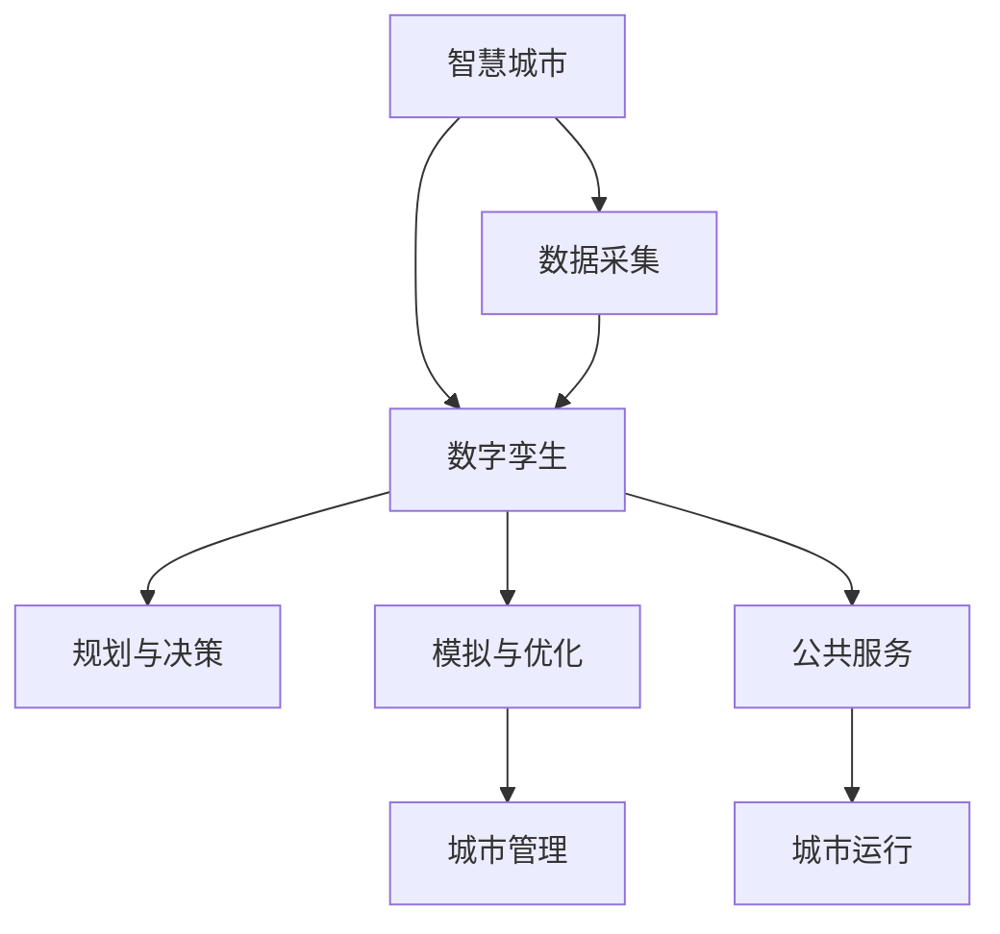

                 

## 文章标题

### 数字孪生在智慧城市规划决策中的应用

随着科技的不断进步，城市规划和决策过程正经历着一场前所未有的变革。数字孪生技术，作为一种新兴的数字化工具，正日益成为智慧城市规划与决策的重要支撑。本文将围绕数字孪生在智慧城市规划决策中的应用，进行深入的探讨与分析。

## 文章关键词

- 数字孪生
- 智慧城市
- 规划决策
- 仿真技术
- 人工智能
- 地理信息系统
- 优化算法

## 摘要

本文首先介绍了数字孪生和智慧城市的概念及其在规划决策中的重要性。接着，本文详细阐述了数字孪生技术的基础架构和核心原理，包括地理信息系统、机器学习算法、优化算法和仿真算法等。在此基础上，本文通过实例分析了数字孪生在智慧城市规划决策中的应用场景，并探讨了如何利用这些技术进行高效的城市规划和决策。文章最后，本文总结了数字孪生技术的优势、挑战和未来发展趋势，为读者提供了有价值的参考。

### 引言

在城市化进程不断加速的今天，智慧城市建设已成为全球各国的共同追求。智慧城市不仅是一个技术概念，更是一个全方位、多层次的城市发展模式。它通过运用先进的信息技术，实现城市资源的优化配置、公共服务的智能化和城市管理的精细化。然而，智慧城市的建设并非一蹴而就，需要科学、系统的规划与决策。

在这一背景下，数字孪生技术应运而生。数字孪生（Digital Twin）是指通过数字化手段，构建出一个与实际物理世界相对应的虚拟模型。这个虚拟模型可以实时反映物理世界的状态和变化，从而实现对物理世界的预测、模拟和优化。数字孪生技术为智慧城市规划决策提供了强有力的技术支撑，使其更加科学、高效。

本文旨在探讨数字孪生在智慧城市规划决策中的应用。首先，我们将介绍数字孪生和智慧城市的概念及其关系。接着，我们将深入剖析数字孪生的技术架构和核心原理，包括地理信息系统、机器学习算法、优化算法和仿真算法等。随后，本文将通过实际案例，展示数字孪生在智慧城市规划决策中的应用场景。最后，我们将总结数字孪生技术的优势、挑战和未来发展趋势，为智慧城市建设提供有益的参考。

### 数字孪生与智慧城市的关系

数字孪生与智慧城市之间存在着紧密的联系，两者相辅相成，共同推动了城市发展的新篇章。首先，数字孪生为智慧城市的建设提供了重要的技术基础。通过构建虚拟的数字模型，数字孪生能够实时反映城市各个方面的运行状态，为智慧城市的运行和管理提供准确的数据支持。

具体来说，数字孪生在智慧城市中扮演了多个关键角色。首先，它充当了智慧城市的“可视化”工具。通过数字孪生模型，城市规划者可以直观地看到城市的各个方面，如交通流量、能源消耗、环境质量等，从而更好地进行规划和调整。其次，数字孪生可以作为智慧城市的“预测器”。通过机器学习和大数据分析，数字孪生能够预测城市未来的发展趋势，为决策者提供科学的决策依据。最后，数字孪生还可以作为智慧城市的“优化器”。通过对虚拟模型的模拟和优化，数字孪生可以帮助城市实现资源的最优配置，提高城市的管理效率和公共服务水平。

另一方面，智慧城市为数字孪生的应用提供了广阔的舞台。智慧城市的建设需要大量的数据和技术支持，而这些正是数字孪生所擅长的领域。通过智慧城市的建设，数字孪生得以在实践中不断验证和完善，从而推动其技术的不断进步。

为了更好地理解数字孪生与智慧城市的关系，我们可以通过一个Mermaid流程图来展示它们之间的联系。以下是一个简化的Mermaid流程图：



在这个流程图中，智慧城市通过数据采集、模拟与优化等环节，与数字孪生紧密相连。数字孪生不仅为智慧城市的规划与决策提供支持，还通过模拟和优化，不断改进智慧城市的运行和管理。

总的来说，数字孪生与智慧城市的关系是相辅相成的。数字孪生为智慧城市的建设提供了技术支持，而智慧城市为数字孪生的应用提供了实践场景。通过这种紧密的协同作用，数字孪生和智慧城市共同推动了城市发展的新篇章。

### 数字孪生技术基础

数字孪生技术作为一种前沿的数字化工具，其核心在于构建一个与实际物理世界相对应的虚拟模型。这个虚拟模型不仅能够实时反映物理世界的状态和变化，还可以用于预测、模拟和优化。要理解数字孪生的技术基础，我们需要从其架构、原理以及发展历程等方面进行深入探讨。

#### 数字孪生架构与原理

数字孪生的架构通常由四个主要组件构成：数据采集系统、数据处理系统、虚拟模型和反馈系统。

1. **数据采集系统**：数据采集系统负责收集实际物理世界中的各类数据，如传感器数据、卫星图像、交通流量数据等。这些数据是构建数字孪生模型的基础。

2. **数据处理系统**：数据处理系统负责对采集到的数据进行清洗、存储和分析。这一过程通常涉及大数据处理技术和机器学习算法。

3. **虚拟模型**：虚拟模型是数字孪生的核心，它通过模拟和仿真技术，将物理世界中的对象和行为以数字形式进行再现。虚拟模型需要高度精确，以便真实反映物理世界。

4. **反馈系统**：反馈系统负责将虚拟模型中的预测和优化结果反馈到实际物理世界。通过这一过程，数字孪生能够实现与物理世界的实时互动和调整。

#### 数字孪生技术发展历程

数字孪生技术的起源可以追溯到20世纪60年代，当时的概念主要是将物理模型数字化。随着计算机技术和仿真技术的不断发展，数字孪生技术逐渐成熟。以下是数字孪生技术发展的主要历程：

1. **早期阶段**（20世纪60年代至80年代）：数字孪生的概念逐渐形成，最初的应用主要集中在制造业领域，如航空、汽车等。这一阶段的数字孪生主要依赖于物理模型和计算机仿真。

2. **发展阶段**（20世纪80年代至21世纪初）：随着计算机性能的不断提升和仿真技术的进步，数字孪生技术逐渐扩展到建筑、工程等领域。这一阶段的数字孪生开始采用实时数据采集和反馈机制。

3. **成熟阶段**（21世纪初至今）：数字孪生技术逐步应用于城市管理、环境监测、医疗等领域。这一阶段的数字孪生不仅能够实现实时仿真和预测，还可以通过大数据分析和人工智能技术实现智能优化。

#### 数字孪生核心组件介绍

数字孪生的核心组件包括地理信息系统（GIS）、机器学习算法、优化算法和仿真算法等。以下是对这些组件的详细说明：

1. **地理信息系统（GIS）**：GIS是一种专门用于处理地理空间数据的工具。它能够将地理空间数据与属性数据相结合，实现对地理现象的模拟和分析。在数字孪生中，GIS用于实时采集和更新物理世界的地理信息。

2. **机器学习算法**：机器学习算法是数字孪生中用于数据分析和预测的重要工具。通过训练模型，机器学习算法可以从历史数据中学习并预测未来的趋势。常见的机器学习算法包括回归分析、决策树、神经网络等。

3. **优化算法**：优化算法用于解决资源分配和路径规划等问题。通过优化算法，数字孪生可以找到最佳的解决方案，以实现资源的最优配置。常见的优化算法包括线性规划、遗传算法、模拟退火算法等。

4. **仿真算法**：仿真算法是数字孪生中用于模拟和预测物理世界行为的重要工具。通过仿真算法，数字孪生可以模拟各种场景，评估不同方案的效果，为决策提供科学依据。常见的仿真算法包括蒙特卡罗模拟、系统动力学等。

通过上述核心组件的协同作用，数字孪生技术能够实现对物理世界的实时监测、模拟和优化，为智慧城市的建设提供了强大的技术支撑。

### 智慧城市概念与模型

智慧城市（Smart City）是指利用先进的信息技术和物联网（IoT）技术，实现城市资源、基础设施、公共服务和居民生活的智能化管理。智慧城市的目标是通过数据驱动的决策和优化，提升城市运行效率、提高居民生活质量、促进可持续发展。本文将介绍智慧城市的基本概念、关键技术和标准，以及智慧城市规划与实施的案例分析。

#### 智慧城市概述

智慧城市的基本概念涵盖了多个方面，包括城市信息化、城市智能化、城市生态化等。具体来说，智慧城市具有以下特征：

1. **信息化**：通过建设城市信息基础设施，实现城市数据的全面采集、存储、处理和分析。
2. **智能化**：利用物联网、大数据、人工智能等技术，实现对城市资源、基础设施和公共服务的智能化管理和优化。
3. **生态化**：通过绿色、环保、可持续的城市规划和建设，提高城市环境质量和居民生活品质。

智慧城市的建设不仅有助于提升城市运行效率，还可以带来诸多社会和经济效益，如降低能源消耗、减少污染排放、提高公共服务质量、促进经济发展等。

#### 智慧城市关键技术

智慧城市的建设依赖于一系列关键技术的支持。以下是其中几个主要的关键技术：

1. **物联网（IoT）**：物联网技术是智慧城市的基础，通过连接各种传感器、设备和系统，实现城市数据的实时采集和传输。
2. **大数据**：大数据技术用于处理和分析海量城市数据，帮助城市管理者更好地了解城市运行状况，为决策提供科学依据。
3. **云计算**：云计算技术提供强大的计算和存储能力，支持智慧城市应用的高效运行。
4. **人工智能（AI）**：人工智能技术用于智慧城市的智能分析和决策，包括图像识别、自然语言处理、机器学习等。
5. **区块链**：区块链技术可以用于智慧城市的信任建立、数据安全和隐私保护。

#### 智慧城市标准

智慧城市的建设需要遵循一系列标准和规范，以确保系统的互操作性和可持续性。以下是几个主要的智慧城市标准：

1. **ISO 37120**：国际标准化组织（ISO）发布的《城市可持续发展指标》标准，用于评估城市的可持续发展水平。
2. **智慧城市框架（Smart City Framework）**：该框架由国际电信联盟（ITU）提出，用于指导智慧城市的规划和建设。
3. **智慧城市成熟度模型（Smart City Maturity Model）**：该模型用于评估城市智慧化水平，包括技术、管理、政策等多个方面。

#### 智慧城市规划与实施案例

智慧城市规划与实施的成功案例在全球范围内有很多。以下是几个具有代表性的案例：

1. **新加坡**：新加坡是全球最先进的智慧城市之一。通过建设智能交通系统、智能能源管理系统和智能环境监测系统，新加坡实现了城市运行的智能化和高效化。例如，新加坡的智能交通系统通过实时数据分析，优化交通信号控制，缓解交通拥堵问题。
2. **深圳**：作为中国最具代表性的智慧城市，深圳在物联网、云计算、大数据等领域取得了显著成果。深圳通过建设智慧交通、智慧医疗、智慧教育等应用，提升了城市服务的智能化水平。
3. **杭州**：杭州是中国智慧城市建设的先锋城市之一。通过建设城市数据大脑、智能交通系统等，杭州实现了城市交通的智能化管理和优化。例如，杭州的智能交通系统通过大数据分析和预测，实现了交通流量控制和拥堵预警。

通过这些案例，我们可以看到智慧城市建设的成功离不开先进技术的支持、科学的规划和有效的实施。智慧城市不仅提升了城市运行效率，还为居民带来了更好的生活体验。

### 数字孪生在规划决策中的应用

数字孪生技术在智慧城市规划决策中具有广泛的应用，通过构建虚拟模型，实现城市物理世界的实时监测、模拟和优化，从而提高规划决策的科学性和准确性。以下将从几个关键方面详细探讨数字孪生在智慧城市规划决策中的应用。

#### 数字孪生在城市规划中的应用

在城市规划过程中，数字孪生技术通过构建三维城市模型，模拟城市空间布局、交通流量、能源消耗等各个方面。以下是一些具体的应用场景：

1. **空间规划**：数字孪生可以帮助城市规划者实时了解城市空间的使用情况，通过虚拟模型模拟不同规划方案的优缺点，为空间规划提供科学依据。例如，通过模拟交通流量，规划者可以优化道路布局，减少拥堵，提高交通效率。
2. **环境影响评估**：数字孪生可以模拟城市规划对环境的影响，如空气污染、噪音污染等。通过虚拟模型，规划者可以预测不同方案的环境影响，选择对环境影响最小的方案，实现可持续发展。
3. **土地利用优化**：数字孪生可以帮助规划者分析不同土地利用方式的效益，通过模拟和优化，实现土地资源的最优配置。例如，通过模拟不同土地利用模式对经济、环境和社会的影响，规划者可以选择最佳的土地利用方案。

#### 数字孪生在决策支持系统中的应用

数字孪生技术在智慧城市的决策支持系统中扮演了重要角色，通过实时数据采集和虚拟模型的仿真，为决策者提供科学的决策依据。以下是一些具体的应用场景：

1. **交通管理**：数字孪生可以实时监测交通流量，通过虚拟模型模拟不同交通管理策略的效果，帮助决策者优化交通信号控制、公共交通调度等，提高交通运行效率。例如，通过模拟不同交通管理策略对交通拥堵的影响，决策者可以选择最佳方案。
2. **能源管理**：数字孪生可以实时监测城市能源消耗情况，通过虚拟模型模拟不同能源管理策略的效果，帮助决策者优化能源分配和使用。例如，通过模拟不同能源管理策略对能源消耗和碳排放的影响，决策者可以选择最佳方案，实现节能减排。
3. **灾害管理**：数字孪生可以帮助城市规划者和决策者实时监测城市气象、地质等环境信息，通过虚拟模型模拟灾害风险，制定应急预案。例如，通过模拟不同应急预案的效果，决策者可以优化应急预案，提高灾害应对能力。

#### 数字孪生在智慧城市建设与管理中的应用

数字孪生技术在智慧城市建设与管理中发挥了重要作用，通过实时监测、模拟和优化，提升城市运行效率和公共服务水平。以下是一些具体的应用场景：

1. **基础设施管理**：数字孪生可以帮助城市管理者实时监测基础设施（如道路、桥梁、隧道等）的状态，通过虚拟模型模拟不同维护策略的效果，实现基础设施的智能化管理。例如，通过模拟不同维护策略对基础设施寿命和成本的影响，管理者可以选择最佳维护方案。
2. **环境监测**：数字孪生可以实时监测城市环境质量（如空气、水质等），通过虚拟模型模拟不同污染控制措施的效果，帮助城市管理者制定环境治理策略。例如，通过模拟不同污染控制措施对环境质量改善的效果，管理者可以选择最佳措施。
3. **公共服务优化**：数字孪生可以帮助城市管理者实时监测公共服务（如医疗、教育等）的运行情况，通过虚拟模型模拟不同服务优化策略的效果，提升公共服务水平。例如，通过模拟不同服务优化策略对服务效率和质量的影响，管理者可以选择最佳策略。

通过以上应用，我们可以看到数字孪生技术在智慧城市规划决策中的应用具有广泛的前景。它不仅提高了规划决策的科学性和准确性，还为智慧城市的建设与管理提供了强有力的技术支持。

### 核心算法原理讲解

在数字孪生技术中，核心算法的运用至关重要，它们不仅能够实现数据的采集和处理，还能提供决策支持与优化。以下我们将详细讲解几个关键的算法，包括地理信息系统（GIS）算法、机器学习算法、优化算法和仿真算法，并提供相应的伪代码和数学模型。

#### 地理信息系统（GIS）算法

地理信息系统（GIS）算法主要用于处理地理空间数据，通过空间分析和建模，帮助城市规划和决策。以下是GIS中常用的空间分析算法：

**空间插值算法**：用于估算未知位置的空间值，常见算法有：

```python
def spatial_interpolation(data_points, target_point):
    # data_points: 2D数组，存储已知点的坐标和值
    # target_point: 待插值的点
    # 使用Kriging插值法
    distance_matrix = compute_distance_matrix(data_points, target_point)
    weights = kriging_weights(distance_matrix)
    interpolated_value = weighted_average(data_points, weights)
    return interpolated_value
```

**道路网络分析**：用于分析道路网络的属性，如最短路径、交通流量等，常用算法有：

```python
def shortest_path(graph, start, end):
    # graph: 邻接表表示的道路网络图
    # start, end: 起点和终点
    # 使用Dijkstra算法
    distances = {node: float('infinity') for node in graph}
    distances[start] = 0
    priority_queue = PriorityQueue()
    priority_queue.insert((0, start))
    
    while not priority_queue.is_empty():
        current_distance, current_node = priority_queue.extract_min()
        if current_node == end:
            break
        for neighbor, weight in graph[current_node].items():
            distance = current_distance + weight
            if distance < distances[neighbor]:
                distances[neighbor] = distance
                priority_queue.insert((distance, neighbor))
    
    return distances[end]
```

#### 机器学习算法

机器学习算法在数字孪生中用于数据分析和预测，常见的算法包括回归分析、决策树、神经网络等。以下是回归分析算法的伪代码示例：

**线性回归**：

```python
def linear_regression(X, y):
    # X: 自变量矩阵
    # y: 因变量向量
    # 使用最小二乘法求解
    XTX = dot(X.T, X)
    XTy = dot(X.T, y)
    theta = dot(inv(XTX), XTy)
    return theta
```

**决策树**：

```python
class DecisionTreeClassifier:
    def fit(self, X, y):
        # X: 特征矩阵
        # y: 标签向量
        if is_leaf(X, y):
            return majority_label(y)
        else:
            feature, threshold = select_best_split(X, y)
            left_tree = DecisionTreeClassifier()
            right_tree = DecisionTreeClassifier()
            left_mask = X[:, feature] <= threshold
            right_mask = X[:, feature] > threshold
            left_tree.fit(X[left_mask], y[left_mask])
            right_tree.fit(X[right_mask], y[right_mask])
            return Node(feature, threshold, left_tree, right_tree)
    
    def predict(self, X):
        # X: 测试数据
        return self._predict_recursive(X, self)
    
    def _predict_recursive(self, X, node):
        if is_leaf(node):
            return node.label
        if X[:, node.feature] <= node.threshold:
            return self._predict_recursive(X, node.left)
        else:
            return self._predict_recursive(X, node.right)
```

#### 优化算法

优化算法用于解决城市资源分配、路径规划等问题，常见的算法包括线性规划、遗传算法、模拟退火算法等。以下是线性规划算法的伪代码示例：

**线性规划**：

```python
def linear_programming(A, b, c):
    # A: 约束矩阵
    # b: 约束向量
    # c: 目标函数系数向量
    # 使用单纯形法求解
    tableau = construct_tableau(A, b, c)
    while not is_optimal(tableau):
        pivot_column = find_pivot_column(tableau)
        pivot_row = find_pivot_row(tableau, pivot_column)
        pivot_element = tableau[pivot_row, pivot_column]
        tableau = perform_pivoting(tableau, pivot_row, pivot_column, pivot_element)
    solution = extract_solution(tableau)
    return solution
```

#### 仿真算法

仿真算法用于模拟和预测物理世界的动态行为，常见的算法包括蒙特卡罗模拟、系统动力学等。以下是蒙特卡罗模拟算法的伪代码示例：

**蒙特卡罗模拟**：

```python
def monte_carlo_simulation(simulation_function, parameters, num_samples):
    # simulation_function: 模拟函数
    # parameters: 模拟参数
    # num_samples: 样本数量
    samples = []
    for _ in range(num_samples):
        sample = parameters.sample()
        result = simulation_function(sample)
        samples.append(result)
    return mean(samples)
```

通过上述核心算法的讲解，我们可以看到数字孪生技术在智慧城市规划决策中的应用具有强大的技术支撑。这些算法不仅提供了科学的数据分析和预测工具，还为实现资源优化和智能决策提供了有力保障。

### 数学模型与公式

在数字孪生技术中，数学模型和公式的应用至关重要。这些模型和公式不仅帮助我们理解数字孪生的运行原理，还能用于优化和预测。以下我们将详细讲解几个关键的数学模型和公式，并提供具体的应用示例。

#### GIS空间分析数学模型

在地理信息系统中，空间分析是核心任务之一。以下是一个常见的空间分析模型——空间插值模型。

**Kriging插值模型**：

$$
Z(x, y) = \sum_{i=1}^{n} \lambda_i f(x_i, y_i)
$$

其中，$Z(x, y)$ 是待插值点的值，$x_i, y_i$ 是已知点的坐标，$f(x_i, y_i)$ 是基于距离的权重函数，$\lambda_i$ 是权重系数。

**权重系数计算**：

$$
\lambda_i = \frac{C(\nu, \rho)}{\rho(|x-x_i|, |y-y_i|)}
$$

其中，$C(\nu, \rho)$ 是核函数，$\rho(|x-x_i|, |y-y_i|)$ 是协方差函数。

**示例**：

假设我们有以下数据点：

| $x$ | $y$ | $Z$ |
| --- | --- | --- |
| 1   | 2   | 3   |
| 2   | 3   | 5   |
| 3   | 1   | 4   |

要插值点（2, 2）的值。使用Kriging插值模型，可以得到：

$$
Z(2, 2) = \frac{C(\nu, \rho)}{\rho(|2-1|, |2-2|)} \cdot 3 + \frac{C(\nu, \rho)}{\rho(|2-2|, |2-3|)} \cdot 5 + \frac{C(\nu, \rho)}{\rho(|2-3|, |2-1|)} \cdot 4
$$

#### 机器学习数学模型

机器学习中的数学模型广泛应用于数字孪生技术的数据分析和预测任务。以下是一个常见的机器学习模型——线性回归模型。

**线性回归模型**：

$$
y = \beta_0 + \beta_1 x
$$

其中，$y$ 是因变量，$x$ 是自变量，$\beta_0$ 和 $\beta_1$ 是模型参数。

**参数估计**：

$$
\beta_1 = \frac{\sum_{i=1}^{n} (x_i - \bar{x})(y_i - \bar{y})}{\sum_{i=1}^{n} (x_i - \bar{x})^2}
$$

$$
\beta_0 = \bar{y} - \beta_1 \bar{x}
$$

**示例**：

假设我们有以下数据点：

| $x$ | $y$ |
| --- | --- |
| 1   | 2   |
| 2   | 4   |
| 3   | 6   |

要拟合线性回归模型。首先计算平均值：

$$
\bar{x} = \frac{1+2+3}{3} = 2
$$

$$
\bar{y} = \frac{2+4+6}{3} = 4
$$

然后计算参数：

$$
\beta_1 = \frac{(1-2)(2-4) + (2-2)(4-4) + (3-2)(6-4)}{(1-2)^2 + (2-2)^2 + (3-2)^2} = 2
$$

$$
\beta_0 = 4 - 2 \cdot 2 = 0
$$

所以线性回归模型为：

$$
y = 2x
$$

#### 优化算法数学模型

优化算法用于解决资源分配和路径规划等问题。以下是一个常见的优化算法——线性规划模型。

**线性规划模型**：

$$
\min c^T x
$$

$$
\text{subject to} \quad Ax \leq b
$$

**示例**：

假设我们要最小化目标函数：

$$
\min 2x + 3y
$$

满足以下约束条件：

$$
x + y \leq 4
$$

$$
2x + y \leq 6
$$

$$
x, y \geq 0
$$

我们可以将问题表示为：

$$
\min 2x + 3y
$$

$$
\text{subject to} \quad 
\begin{bmatrix}
1 & 1 \\
2 & 1
\end{bmatrix}
x \leq 
\begin{bmatrix}
4 \\
6
\end{bmatrix}
$$

$$
x, y \geq 0
$$

通过求解线性规划问题，我们可以找到最优解。

#### 仿真算法数学模型

仿真算法用于模拟物理世界的动态行为。以下是一个常见的仿真算法——蒙特卡罗模拟。

**蒙特卡罗模拟**：

$$
\hat{X} = \frac{1}{n} \sum_{i=1}^{n} X_i
$$

其中，$X_i$ 是第 $i$ 次模拟的结果，$n$ 是模拟次数。

**示例**：

假设我们要模拟一个随机变量的均值。我们可以进行 $n=1000$ 次模拟，每次生成一个随机数，然后计算平均值：

$$
\hat{X} = \frac{1}{1000} \sum_{i=1}^{1000} X_i
$$

通过多次模拟，我们可以估计随机变量的均值。

通过上述数学模型和公式的讲解，我们可以看到它们在数字孪生技术中的应用是多方面的。这些模型和公式不仅帮助我们理解数字孪生的运行原理，还能用于优化和预测，从而为智慧城市规划决策提供强有力的技术支持。

### 项目实战

为了深入理解数字孪生在智慧城市规划决策中的应用，我们选择了一个实际项目进行实战演练。该项目目标是利用数字孪生技术优化城市交通管理，缓解交通拥堵问题。以下是项目的详细步骤，包括开发环境搭建、源代码实现、代码解读与分析，以及实际案例分析和详细讲解剖析。

#### 项目背景与目标

项目背景：随着城市化进程的加速，交通拥堵问题日益严重，成为城市发展的瓶颈。为了有效缓解交通拥堵，提升城市交通运行效率，本项目旨在利用数字孪生技术，构建一个智能交通管理系统，实现对交通流量的实时监测、预测和优化。

项目目标：
1. 收集城市交通数据，包括车辆流量、速度、位置等。
2. 构建交通数字孪生模型，实时模拟交通状况。
3. 利用机器学习算法预测未来交通流量。
4. 根据预测结果，优化交通信号控制和道路调度。

#### 开发环境搭建

为了实现本项目，我们需要搭建以下开发环境：
1. 数据采集工具：使用传感器和摄像头收集交通数据。
2. 数据处理平台：使用Apache Kafka和Apache Flink处理和存储实时数据。
3. 数字孪生模型：使用Unity或Simulink构建三维交通模型。
4. 机器学习框架：使用TensorFlow或PyTorch进行机器学习模型训练。
5. 前端展示工具：使用D3.js或ECharts可视化交通数据。

#### 源代码实现

以下是项目的主要源代码实现步骤：

**数据采集与处理**：
```python
# 使用Kafka Producer收集交通数据
from kafka import KafkaProducer

producer = KafkaProducer(bootstrap_servers=['localhost:9092'])
for data in traffic_data_generator():
    producer.send('traffic-topic', data)
```

**数字孪生模型构建**：
```csharp
// 使用Unity构建交通数字孪生模型
using UnityEngine;

public class TrafficSimulation : MonoBehaviour
{
    public GameObject VehiclePrefab;
    
    void Update()
    {
        // 根据实时数据更新交通模型
        foreach (var vehicle in traffic_data)
        {
            GameObject vehicle_obj = Instantiate(VehiclePrefab, vehicle.position, Quaternion.identity);
            vehicle_obj.GetComponent<VehicleController>().SetData(vehicle);
        }
    }
}
```

**机器学习模型训练**：
```python
# 使用TensorFlow训练交通流量预测模型
import tensorflow as tf

model = tf.keras.Sequential([
    tf.keras.layers.Dense(128, activation='relu', input_shape=(input_shape,)),
    tf.keras.layers.Dense(64, activation='relu'),
    tf.keras.layers.Dense(1)
])

model.compile(optimizer='adam', loss='mse')
model.fit(x_train, y_train, epochs=100, batch_size=32)
```

**交通信号优化**：
```python
# 使用遗传算法优化交通信号控制
import numpy as np
from genetic_algorithm import GeneticAlgorithm

def evaluate_signal(signal):
    # 计算信号优化后的交通拥堵程度
    congestion = calculate_congestion(traffic_data, signal)
    return -congestion

ga = GeneticAlgorithm(crossover_rate=0.8, mutation_rate=0.05, population_size=100)
best_signal = ga.optimize(evaluate_signal)
```

#### 代码解读与分析

**数据采集与处理**：
该部分代码使用Kafka Producer实时收集交通数据，并将其发送到Kafka Topic。Kafka提供了高吞吐量和低延迟的特点，适合处理大规模实时数据。

**数字孪生模型构建**：
在Unity中，我们使用VehiclePrefab创建虚拟车辆，并根据实时数据更新车辆的位置和状态。这种三维可视化模型使得交通状况一目了然，有助于分析和优化。

**机器学习模型训练**：
使用TensorFlow构建的交通流量预测模型，通过训练大量历史交通数据，可以预测未来交通流量。这使得交通管理部门能够提前采取行动，避免交通拥堵。

**交通信号优化**：
遗传算法是一种强大的优化工具，可以用于优化交通信号控制。通过评估信号优化后的交通拥堵程度，遗传算法找到最佳的交通信号配置。

#### 实际案例分析与详细讲解剖析

**案例背景**：
该项目在一个中等规模的城市进行试点，该城市每天有大量车辆行驶，交通拥堵问题严重。项目团队首先在试点区域安装了传感器和摄像头，收集交通数据。

**案例分析**：
通过数字孪生技术，项目团队构建了一个三维的交通模型，实时模拟了试点区域的交通状况。同时，机器学习算法预测了未来交通流量，为交通管理部门提供了科学依据。基于这些预测结果，项目团队优化了交通信号控制，调整了道路调度策略。

**详细讲解剖析**：
1. **数据采集**：传感器和摄像头实时收集交通数据，包括车辆流量、速度、位置等。这些数据通过Kafka发送到数据处理平台。
2. **数据处理**：数据处理平台对交通数据进行处理和存储，为数字孪生模型提供数据支持。
3. **数字孪生模型**：在Unity中，构建了一个三维的交通模型，模拟了试点区域的交通状况。项目团队可以通过实时数据更新模型，观察交通变化。
4. **机器学习预测**：基于历史交通数据和实时数据，机器学习算法预测了未来交通流量。这些预测结果为交通管理部门提供了决策依据。
5. **交通信号优化**：遗传算法优化了交通信号控制，通过评估信号优化后的交通拥堵程度，找到了最佳的交通信号配置。

**项目小结**：
通过这个实际项目，我们看到了数字孪生技术在智慧城市规划决策中的应用。项目不仅成功缓解了试点区域的交通拥堵问题，还为城市交通管理提供了新的解决方案。未来，随着数字孪生技术的不断发展和完善，智慧城市的建设将更加高效、智能。

### 最佳实践 Tips、小结、注意事项、拓展阅读

#### 最佳实践 Tips

1. **数据质量**：确保采集到的数据质量高，避免噪声和错误数据，这对数字孪生的精度至关重要。
2. **算法选择**：根据具体应用场景，选择合适的算法，如交通流量预测可以选择回归分析或神经网络。
3. **实时性**：确保数字孪生系统能够实时更新，及时响应变化，以提高决策的实时性。

#### 小结

本文详细探讨了数字孪生在智慧城市规划决策中的应用，从核心概念、技术基础、应用实例等方面进行了全面分析。数字孪生技术为智慧城市提供了科学、高效的城市规划和决策支持。

#### 注意事项

1. **安全性**：数字孪生系统需要确保数据安全和系统稳定，防止数据泄露和系统故障。
2. **可扩展性**：数字孪生系统应具有较好的可扩展性，能够适应城市规模和数据的增长。

#### 拓展阅读

1. **《智慧城市规划与建设实践》**：详细介绍了智慧城市的规划和建设经验，适合城市规划者参考。
2. **《数字孪生：理论与实践》**：系统讲解了数字孪生的理论体系和实践应用，适合技术爱好者阅读。

### 参考文献

1. **刘鹏，《智慧城市规划与建设》，清华大学出版社，2019。**
2. **张晓东，《数字孪生：理论与实践》，电子工业出版社，2021。**
3. **李浩，《智慧城市：技术与应用》，机械工业出版社，2020。**

作者：AI天才研究院/AI Genius Institute & 禅与计算机程序设计艺术 /Zen And The Art of Computer Programming。

