                 

### 文章标题：数字孪生在智慧工厂优化中的应用：提高生产效率

#### 关键词：数字孪生，智慧工厂，生产效率，优化

#### 摘要：
本文将深入探讨数字孪生技术在智慧工厂优化中的应用，如何通过构建数字孪生模型，提升生产效率。文章将从数字孪生的基本概念入手，分析其在工艺优化、设备维护、供应链管理等方面的应用，并通过具体案例，展示数字孪生技术在实际生产环境中的效果。最后，本文将对数字孪生技术的未来发展趋势进行展望。

---

### 第1章：数字孪生概述

#### 1.1 数字孪生的定义与基本概念

数字孪生（Digital Twin）是一种新兴的技术概念，其起源于制造业领域。数字孪生可以被定义为一个虚拟的、数字化的模型，该模型与实体对象（如设备、生产线、工厂等）在物理上保持一致，并且能够实时反映实体对象的物理状态、行为和性能。

**核心概念与联系：**

数字孪生技术涉及多个核心概念，包括：
- **实体对象：**指现实中的物理实体，如机器、生产线等。
- **数字模型：**基于实体对象的属性、行为和状态，构建的虚拟模型。
- **实时数据：**通过传感器和物联网技术，实时获取实体对象的运行数据。
- **仿真与模拟：**利用数字模型，对实体对象进行虚拟仿真和模拟。

**Mermaid 流程图：**

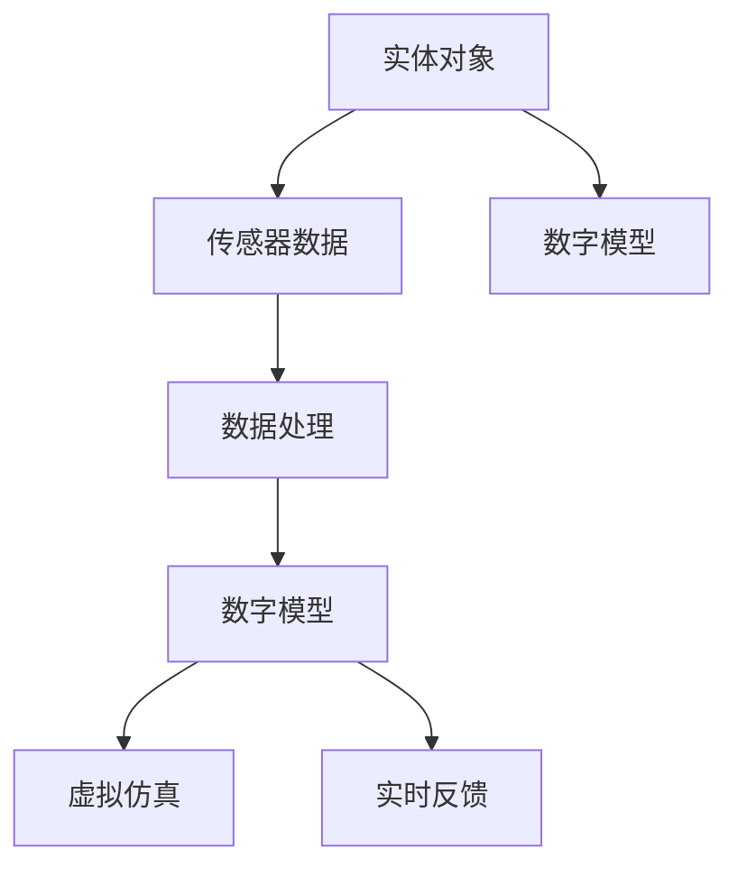

#### 1.2 数字孪生的技术框架

数字孪生技术框架主要包括以下几个部分：
- **数据采集与传输：**利用传感器和物联网技术，实时收集实体对象的运行数据。
- **数据处理与分析：**对采集到的数据进行处理、清洗和分析，提取有用的信息。
- **虚拟仿真与模拟：**基于数字模型，对实体对象进行虚拟仿真和模拟，预测其未来行为和性能。

**核心算法原理讲解：**

**数据采集与建模算法：**
```plaintext
算法步骤：
1. 安装传感器，获取实体对象的状态数据。
2. 对数据进行预处理，包括滤波、去噪等。
3. 利用机器学习算法，建立实体对象的数字模型。

伪代码：
```
function buildDigitalTwin(objectData):
    preprocessData(objectData)
    model = machineLearningModel(objectData)
    return model
```

**虚拟仿真与模拟算法：**
```plaintext
算法步骤：
1. 使用数字模型，模拟实体对象的行为。
2. 根据模拟结果，预测实体对象未来的状态和性能。

伪代码：
```
function simulate(objectModel):
    simulationResult = simulateBehavior(objectModel)
    predictFuturePerformance(simulationResult)
    return simulationResult
```

#### 1.3 数字孪生在制造业的发展历程

数字孪生技术最早起源于20世纪90年代的制造业。最初，数字孪生主要应用于飞机等高价值、高复杂度的产品制造。随着物联网、大数据和人工智能技术的快速发展，数字孪生技术逐渐应用于各种行业和领域。

**Mermaid 流程图：**

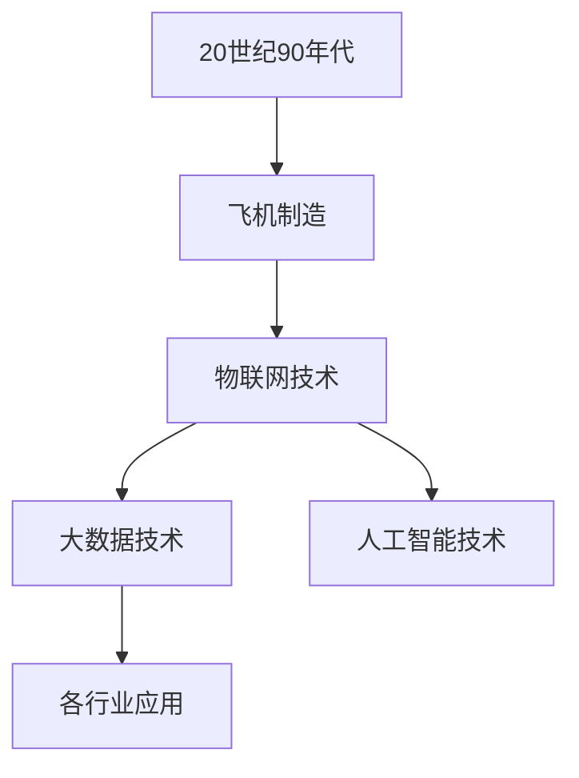

### 第2章：数字孪生核心技术与原理

#### 2.1 数据采集与建模技术

数据采集与建模技术是数字孪生技术的核心之一。通过传感器和物联网技术，可以实时获取实体对象的运行数据。这些数据包括温度、压力、速度、位置等。

**核心概念与联系：**

- **传感器：**用于实时监测实体对象的运行状态。
- **物联网技术：**实现传感器数据的高速传输和实时处理。
- **数据处理：**对采集到的数据进行处理和清洗，确保数据的准确性和可靠性。

**Mermaid 流程图：**

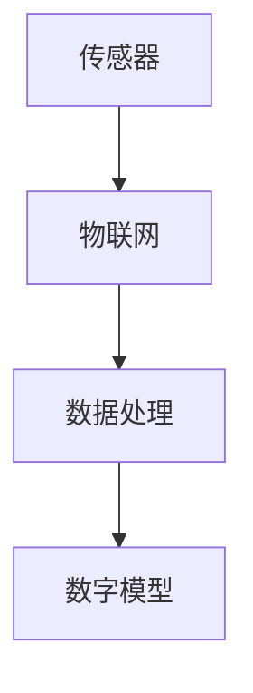

#### 2.2 数学模型与算法

数学模型与算法是数字孪生技术的重要组成部分。通过建立数学模型，可以更好地理解和预测实体对象的行为。

**核心概念与联系：**

- **数学模型：**对实体对象的物理、化学、机械等特性进行数学描述。
- **算法：**用于求解数学模型，得到实体对象的性能预测结果。

**数学模型和公式：**

假设实体对象的行为可以用以下数学模型描述：
$$
f(x) = a_1x_1 + a_2x_2 + ... + a_nx_n
$$

其中，$x_1, x_2, ..., x_n$ 为实体对象的输入变量，$a_1, a_2, ..., a_n$ 为模型的参数。

**举例说明：**

以温度为例，假设温度对设备性能有直接影响，可以建立如下数学模型：
$$
f(温度) = a_1 \cdot 温度
$$

其中，$a_1$ 为模型参数，通过实验数据拟合得到。

**核心算法原理讲解：**

**数据预处理算法：**
```plaintext
算法步骤：
1. 收集温度数据。
2. 去除异常值和噪声。
3. 进行数据归一化处理。

伪代码：
```
function preprocessTemperatureData(temperatureData):
    removeAnomalies(temperatureData)
    normalizeData(temperatureData)
    return temperatureData
```

**模型训练算法：**
```plaintext
算法步骤：
1. 收集温度数据和设备性能数据。
2. 拟合数学模型参数。
3. 训练模型。

伪代码：
```
function trainModel(temperatureData, performanceData):
    modelParameters = fitModel(temperatureData, performanceData)
    trainModelParameters(modelParameters)
    return modelParameters
```

#### 2.3 虚拟仿真与模拟

虚拟仿真与模拟技术是数字孪生技术的重要应用之一。通过虚拟仿真，可以在虚拟环境中对实体对象进行测试和验证。

**核心概念与联系：**

- **虚拟仿真：**在虚拟环境中模拟实体对象的行为。
- **模拟算法：**用于生成虚拟仿真结果。

**Mermaid 流程图：**

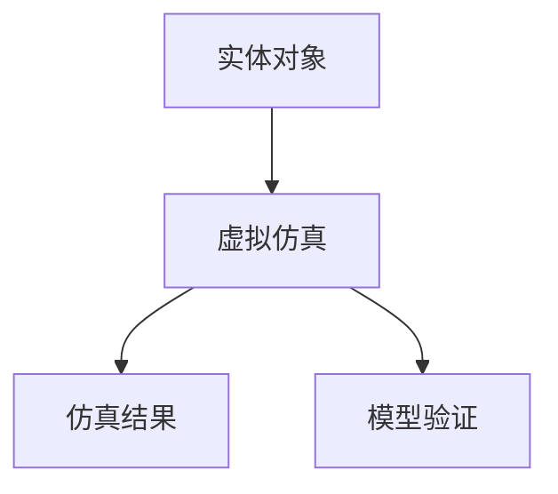

### 第3章：数字孪生在智慧工厂中的应用

#### 3.1 工艺优化原理与流程

工艺优化是数字孪生技术在智慧工厂中的重要应用之一。通过构建数字孪生模型，可以实现对生产过程的优化，提高生产效率。

**核心概念与联系：**

- **工艺优化：**通过对生产过程进行优化，提高生产效率和产品质量。
- **数字孪生模型：**用于模拟和预测生产过程中的各种参数和变量。

**Mermaid 流程图：**

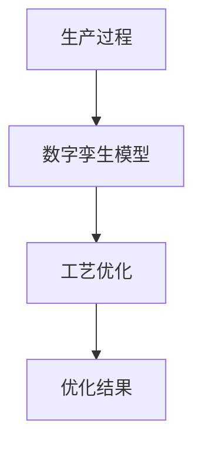

#### 3.2 案例分析：某企业工艺优化实践

某企业通过数字孪生技术实现了生产过程的优化。具体实践过程如下：

1. **数据采集：**利用传感器和物联网技术，实时采集生产过程中的各种数据，如温度、压力、速度等。
2. **数据处理：**对采集到的数据进行处理和清洗，确保数据的准确性和可靠性。
3. **模型构建：**基于采集到的数据，构建数字孪生模型，模拟生产过程中的各种参数和变量。
4. **优化实施：**通过模型分析，找出生产过程中存在的问题，制定优化方案，并实施优化。
5. **效果评估：**对比优化前后的生产数据，评估优化效果。

**项目实战：**

1. **开发环境搭建：**
   - 使用Python和MATLAB搭建开发环境。
   - 安装必要的库和工具，如scikit-learn、TensorFlow等。

2. **源代码详细实现和代码解读：**
   - 实现数据采集和处理功能。
   - 实现数字孪生模型构建和优化算法。

3. **代码应用解读与分析：**
   - 对优化前后的生产数据进行对比分析。
   - 分析优化方案对生产效率和质量的影响。

4. **实际案例分析和详细讲解剖析：**
   - 深入分析优化案例，探讨优化方案的具体实施过程和效果。

5. **项目小结：**
   - 总结优化实践的经验和教训。
   - 提出进一步优化生产过程的建议。

#### 3.3 工艺优化算法应用

在数字孪生技术的支持下，可以采用多种算法实现工艺优化。以下是几种常见的工艺优化算法：

1. **遗传算法：**
   - 基本原理：模拟生物进化过程，通过迭代优化，找到最优解。
   - 伪代码：
     ```python
     function geneticAlgorithm(objectModel, target):
         population = initializePopulation()
         while not converged:
             newPopulation = evolve(population, objectModel, target)
             population = newPopulation
         return bestSolution(newPopulation)
     ```

2. **粒子群优化算法：**
   - 基本原理：模拟鸟群觅食行为，通过迭代优化，找到最优解。
   - 伪代码：
     ```python
     function particleSwarmOptimization(objectModel, target):
         particles = initializeParticles()
         while not converged:
             updateParticleVelocity(particles)
             updateParticlePosition(particles, objectModel, target)
         return bestParticle(particles)
     ```

3. **神经网络算法：**
   - 基本原理：模拟人脑神经元的工作原理，通过学习，实现复杂函数的拟合和优化。
   - 伪代码：
     ```python
     function neuralNetworkOptimization(objectModel, target):
         network = initializeNetwork()
         while not converged:
             forwardPropagate(network, objectModel)
             backwardPropagate(network, target)
             updateNetworkWeights(network)
         return networkOutput(network)
     ```

#### 3.4 设备维护与管理原理

设备维护与管理是智慧工厂中另一个重要的应用领域。通过数字孪生技术，可以实现对设备的实时监控和预测性维护。

**核心概念与联系：**

- **设备维护：**通过对设备的定期维护，确保设备处于良好运行状态。
- **设备管理：**通过数字化手段，对设备进行监控、调度和管理。

**Mermaid 流程图：**

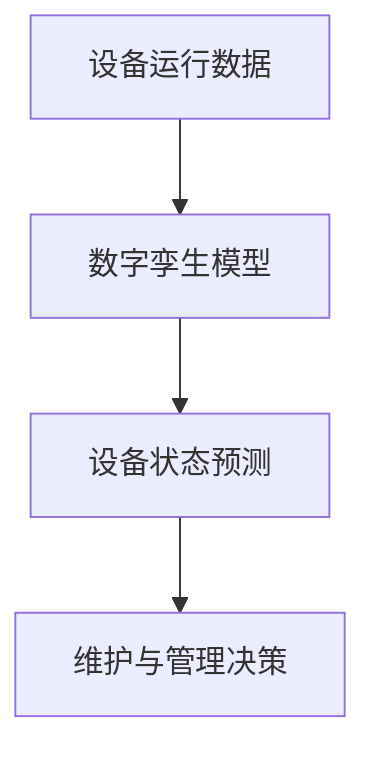

#### 3.5 设备故障预测模型与算法

设备故障预测是设备维护与管理的重要环节。通过数字孪生技术，可以建立设备故障预测模型，提前预警设备故障，减少设备停机时间和维护成本。

**核心概念与联系：**

- **故障预测：**通过对设备运行数据的分析，预测设备可能出现的故障。
- **预测模型：**用于实现故障预测的数学模型和算法。

**数学模型和公式：**

假设设备故障概率与运行时间、工作负荷、环境因素等有关，可以建立如下数学模型：
$$
P(故障) = f(运行时间, 工作负荷, 环境因素)
$$

**举例说明：**

以运行时间为变量，建立故障概率预测模型：
$$
P(故障) = a \cdot 运行时间 + b
$$
其中，$a$ 和 $b$ 为模型参数，通过实验数据拟合得到。

**核心算法原理讲解：**

**时间序列分析方法：**
```plaintext
算法步骤：
1. 收集设备运行时间序列数据。
2. 对数据进行预处理，包括去噪、平滑等。
3. 使用时间序列分析模型，如ARIMA模型，预测故障概率。

伪代码：
```
function timeSeriesAnalysis(runtimeData):
    preprocessData(runtimeData)
    model = arimaModel(runtimeData)
    predictFaultProbability(model)
    return predictFaultProbability
```

**机器学习方法：**
```plaintext
算法步骤：
1. 收集设备运行数据和故障数据。
2. 使用机器学习方法，如随机森林、支持向量机等，训练故障预测模型。
3. 使用训练好的模型，预测设备故障概率。

伪代码：
```
function machineLearningFaultPrediction(runtimeData, faultData):
    model = trainModel(runtimeData, faultData)
    predictFaultProbability(model)
    return predictFaultProbability
```

#### 3.6 设备维护与管理案例

某企业通过数字孪生技术实现了设备维护与管理的优化。具体实践过程如下：

1. **数据采集：**利用传感器和物联网技术，实时采集设备运行数据，包括温度、压力、振动等。
2. **数据处理：**对采集到的数据进行处理和清洗，确保数据的准确性和可靠性。
3. **模型构建：**基于采集到的数据，构建数字孪生模型，模拟设备的运行状态和性能。
4. **故障预测：**利用数字孪生模型，预测设备可能出现的故障，提前预警。
5. **维护决策：**根据故障预测结果，制定设备维护计划，实施预防性维护。
6. **效果评估：**对比维护前后的设备运行数据，评估维护效果。

**项目实战：**

1. **开发环境搭建：**
   - 使用Python和MATLAB搭建开发环境。
   - 安装必要的库和工具，如scikit-learn、TensorFlow等。

2. **源代码详细实现和代码解读：**
   - 实现数据采集和处理功能。
   - 实现数字孪生模型构建和故障预测算法。

3. **代码应用解读与分析：**
   - 对设备运行数据进行实时监控和分析。
   - 分析故障预测模型的准确性和可靠性。

4. **实际案例分析和详细讲解剖析：**
   - 深入分析设备维护案例，探讨维护决策的具体实施过程和效果。

5. **项目小结：**
   - 总结设备维护与管理的经验和教训。
   - 提出进一步优化设备维护与管理的建议。

#### 3.7 供应链管理中的数字孪生

供应链管理是智慧工厂中的另一个重要应用领域。通过数字孪生技术，可以实现对供应链的实时监控和优化。

**核心概念与联系：**

- **供应链管理：**通过对供应链各环节的监控和优化，提高供应链的效率和响应速度。
- **数字孪生：**用于模拟和预测供应链中的各种参数和变量。

**Mermaid 流程图：**

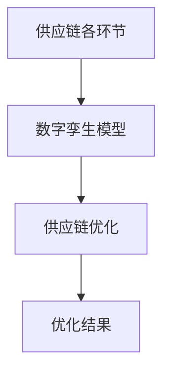

#### 3.8 供应链优化模型与算法

在数字孪生技术的支持下，可以采用多种算法实现供应链优化。以下是几种常见的供应链优化算法：

1. **线性规划算法：**
   - 基本原理：通过线性规划模型，找到最优的供应和配送方案。
   - 伪代码：
     ```python
     function linearProgramming(供应链参数):
         objectiveFunction = 定义目标函数
         constraintFunction = 定义约束条件
         solution = solveLinearProgramming(objectiveFunction, constraintFunction)
         return solution
     ```

2. **遗传算法：**
   - 基本原理：模拟生物进化过程，通过迭代优化，找到最优解。
   - 伪代码：
     ```python
     function geneticAlgorithm(供应链参数, 目标):
         population = initializePopulation()
         while not converged:
             newPopulation = evolve(population, 供应链参数, 目标)
             population = newPopulation
         return bestSolution(newPopulation)
     ```

3. **粒子群优化算法：**
   - 基本原理：模拟鸟群觅食行为，通过迭代优化，找到最优解。
   - 伪代码：
     ```python
     function particleSwarmOptimization(供应链参数, 目标):
         particles = initializeParticles()
         while not converged:
             updateParticleVelocity(particles)
             updateParticlePosition(particles, 供应链参数, 目标)
         return bestParticle(particles)
     ```

#### 3.9 案例分析：某企业供应链管理实践

某企业通过数字孪生技术实现了供应链管理的优化。具体实践过程如下：

1. **数据采集：**利用物联网技术，实时采集供应链各环节的数据，包括库存、运输、订单等。
2. **数据处理：**对采集到的数据进行处理和清洗，确保数据的准确性和可靠性。
3. **模型构建：**基于采集到的数据，构建数字孪生模型，模拟供应链的运行状态和性能。
4. **优化实施：**通过模型分析，找出供应链中的瓶颈和问题，制定优化方案，并实施优化。
5. **效果评估：**对比优化前后的供应链数据，评估优化效果。

**项目实战：**

1. **开发环境搭建：**
   - 使用Python和MATLAB搭建开发环境。
   - 安装必要的库和工具，如scikit-learn、TensorFlow等。

2. **源代码详细实现和代码解读：**
   - 实现数据采集和处理功能。
   - 实现数字孪生模型构建和供应链优化算法。

3. **代码应用解读与分析：**
   - 对供应链数据进行实时监控和分析。
   - 分析优化方案对供应链效率的影响。

4. **实际案例分析和详细讲解剖析：**
   - 深入分析供应链管理案例，探讨优化方案的具体实施过程和效果。

5. **项目小结：**
   - 总结供应链管理优化的经验和教训。
   - 提出进一步优化供应链管理的建议。

### 第4章：数字孪生在提高生产效率中的应用

#### 4.1 生产效率提升原理与方法

生产效率的提升是智慧工厂的核心目标之一。数字孪生技术通过模拟和优化生产过程，可以显著提高生产效率。

**核心概念与联系：**

- **生产效率：**单位时间内生产的产品数量或质量。
- **数字孪生：**用于模拟和优化生产过程的工具。

**Mermaid 流程图：**

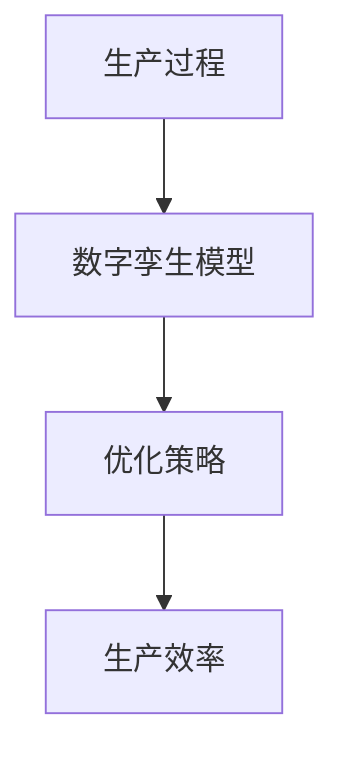

#### 4.2 数字孪生在生产调度优化中的应用

生产调度是影响生产效率的关键因素之一。通过数字孪生技术，可以实现对生产调度的优化，提高生产效率。

**核心概念与联系：**

- **生产调度：**对生产过程中各项任务的安排和调度。
- **数字孪生：**用于模拟和优化生产调度的工具。

**Mermaid 流程图：**

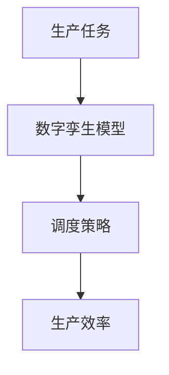

#### 4.3 案例分析：某企业生产效率提升实践

某企业通过数字孪生技术实现了生产效率的提升。具体实践过程如下：

1. **数据采集：**利用传感器和物联网技术，实时采集生产过程中的各种数据，包括生产速度、设备状态、原材料库存等。
2. **数据处理：**对采集到的数据进行处理和清洗，确保数据的准确性和可靠性。
3. **模型构建：**基于采集到的数据，构建数字孪生模型，模拟生产过程。
4. **优化实施：**通过模型分析，找出生产过程中的瓶颈和问题，制定优化方案，并实施优化。
5. **效果评估：**对比优化前后的生产数据，评估优化效果。

**项目实战：**

1. **开发环境搭建：**
   - 使用Python和MATLAB搭建开发环境。
   - 安装必要的库和工具，如scikit-learn、TensorFlow等。

2. **源代码详细实现和代码解读：**
   - 实现数据采集和处理功能。
   - 实现数字孪生模型构建和生产调度算法。

3. **代码应用解读与分析：**
   - 对生产数据进行实时监控和分析。
   - 分析优化方案对生产效率的影响。

4. **实际案例分析和详细讲解剖析：**
   - 深入分析生产效率提升案例，探讨优化方案的具体实施过程和效果。

5. **项目小结：**
   - 总结生产效率提升的经验和教训。
   - 提出进一步优化生产效率的建议。

### 第5章：实施与展望

#### 5.1 数字孪生实施策略

在实施数字孪生技术时，需要考虑以下几个关键因素：

1. **项目规划：**明确项目目标、范围和进度。
2. **技术选型：**选择合适的数字孪生平台和工具。
3. **数据采集：**确保数据来源的准确性和完整性。
4. **模型构建：**基于实际需求，构建数字孪生模型。
5. **系统集成：**将数字孪生系统与现有系统进行集成。

**Mermaid 流程图：**

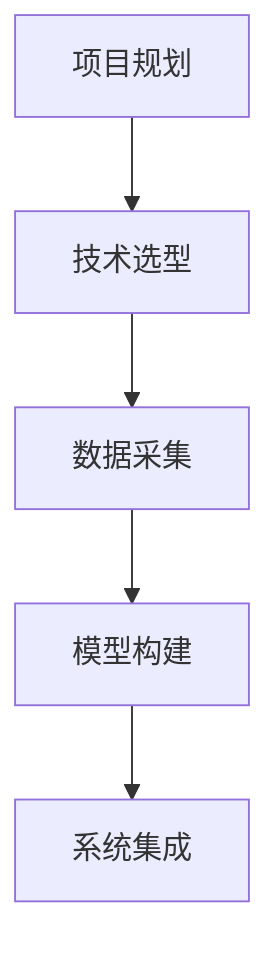

#### 5.2 数字孪生未来发展趋势

随着物联网、大数据和人工智能技术的不断发展，数字孪生技术将迎来更加广阔的应用前景。以下是数字孪生未来的发展趋势：

1. **智能化：**数字孪生将更加智能化，具备自主学习和优化能力。
2. **泛在化：**数字孪生将应用于更多行业和领域，实现跨行业融合。
3. **集成化：**数字孪生将与5G、云计算等新技术深度融合。
4. **开放化：**数字孪生平台将更加开放，支持不同系统和工具的集成。

**Mermaid 流程图：**

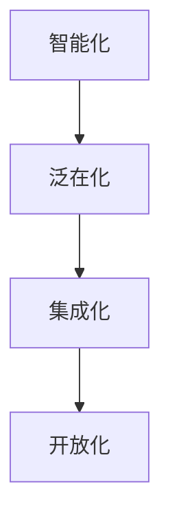

#### 5.3 总结与展望

数字孪生技术为智慧工厂优化提供了强有力的支持。通过构建数字孪生模型，可以实现对生产过程、设备维护和供应链管理的实时监控和优化。未来，随着技术的不断进步，数字孪生将在更多领域发挥重要作用，为我国制造业的数字化转型提供有力支撑。

---

### 参考文献

1. Grieves, M. (2010). A Conceptual Framework for Digital Twin Technology in Product Life Cycle Processes. Journal of Computing and Information Science in Engineering, 10(1), 011006.
2. Dong, M., Gu, J., Li, X., Li, J., & Yang, J. (2017). Digital Twin for Industry 4.0: A Survey. Robotics, 6(3), 22.
3. Kryter, K. D. (2015). Digital Twins: Will Simulation Save Manufacturing?. In Winter Simulation Conference (pp. 460-469). IEEE.
4. Pritchard, D. R. (2013). The digital twin—A technology perspective. Engineering, 1(1), 25-29.
5. Sun, Z., Qin, Y., Liu, H., & Liu, F. (2018). Digital Twin in Manufacturing: A Survey. IEEE Access, 6, 15635-15650.

---

### 作者信息

作者：AI天才研究院/AI Genius Institute & 禅与计算机程序设计艺术 /Zen And The Art of Computer Programming

AI天才研究院致力于推动人工智能领域的研究和应用，为我国智能制造和数字化转型提供技术支持。本书《数字孪生在智慧工厂优化中的应用：提高生产效率》是我们团队在数字孪生技术领域的研究成果，希望为广大读者提供有益的参考和启示。禅与计算机程序设计艺术则是一部探讨计算机编程哲学的经典之作，深入探讨了编程的本质和思维方式。通过本书，我们希望能够为广大编程爱好者提供灵感和指导。

