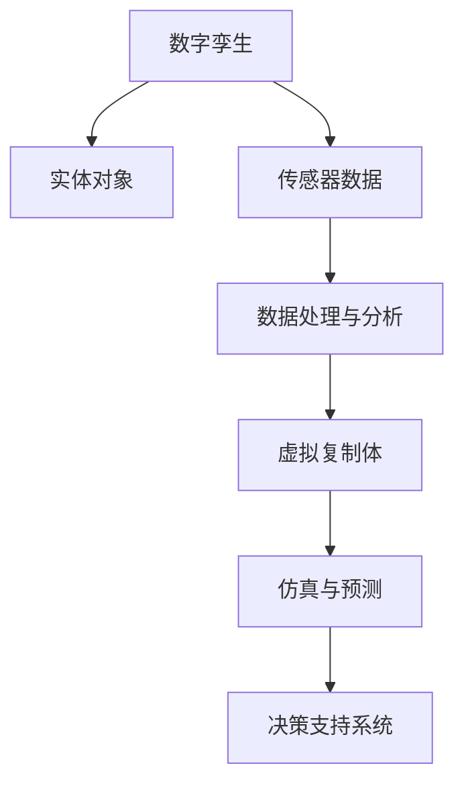
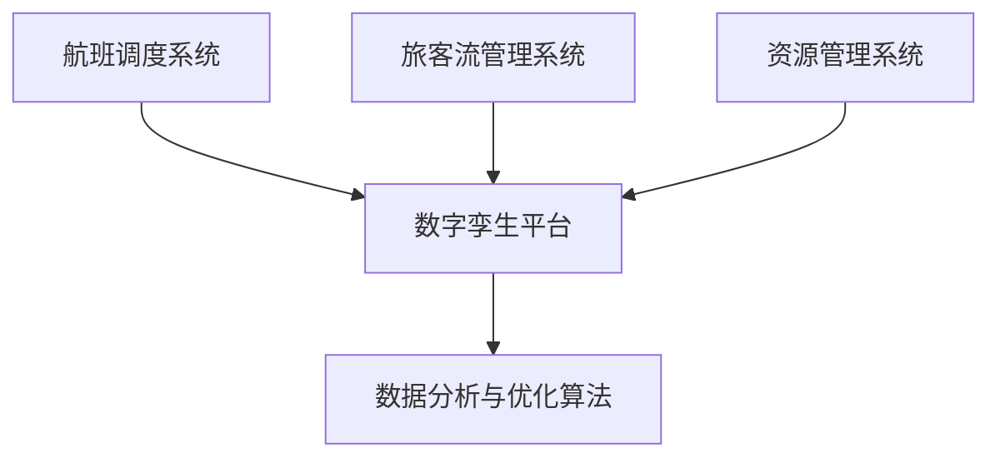

                 


为了撰写一篇高质量的《数字孪生在智慧机场管理中的应用：优化航班调度和旅客流》的技术博客，我们需要系统地分析并详细阐述以下几个关键方面：

## 1. 背景介绍

### 1.1 数字孪生的定义和重要性

数字孪生是一种通过创建实体对象或系统的虚拟复制体来模拟、分析和优化其性能的技术。这种技术已在制造业、医疗、建筑和交通等领域得到广泛应用。数字孪生模型能够实时反映实体对象的状态，帮助管理者进行预测和决策。

### 1.2 智慧机场的概念和管理挑战

智慧机场是指通过信息技术和自动化系统来提高机场运营效率、旅客体验和安全性。随着航班数量和旅客流量的不断增长，机场管理者面临着航班调度、旅客流优化、资源管理等方面的挑战。

### 1.3 航班调度和旅客流优化的重要性

航班调度和旅客流优化是智慧机场管理的关键环节。有效的航班调度可以提高机场的运行效率，减少航班延误和资源浪费；旅客流优化则能提升旅客的出行体验，减少拥堵和等待时间。

## 2. 核心概念与联系

在这一部分，我们将使用Mermaid流程图展示数字孪生原理和应用在智慧机场管理中的架构。

### 2.1 数字孪生原理图



### 2.2 智慧机场管理应用架构图



## 3. 核心算法原理讲解

在这一部分，我们将详细讲解航班调度和旅客流优化的核心算法原理，并使用伪代码进行阐述。

### 3.1 航班调度算法

#### 3.1.1 优化目标

最小化航班延误时间，最大化航班运行效率。

#### 3.1.2 算法伪代码

```python
def flight_scheduling(airport_data):
    # 初始化航班调度计划
    schedule = initialize_schedule(airport_data)
    
    # 对航班进行排序
    sorted_flights = sort_flights_by_priority(schedule)
    
    # 调度航班
    for flight in sorted_flights:
        if can_land(flight, schedule):
            schedule.add_flight(flight)
        else:
            schedule.reschedule_flight(flight)
    
    return schedule
```

### 3.2 旅客流优化算法

#### 3.2.1 优化目标

最小化旅客等待时间，最大化旅客流动效率。

#### 3.2.2 算法伪代码

```python
def passenger_flow_optimization(airport_data):
    # 初始化旅客流计划
    flow_plan = initialize_flow_plan(airport_data)
    
    # 对旅客进行分类
    passenger_categories = categorize_passengers(airport_data)
    
    # 优化旅客流
    for category in passenger_categories:
        optimize_flow_for_category(flow_plan, category)
    
    return flow_plan
```

## 4. 数学模型和数学公式

在这一部分，我们将介绍与优化相关的数学模型，并使用LaTeX格式给出相关公式。

### 4.1 航班调度数学模型

#### 4.1.1 目标函数

$$\text{Minimize} \quad T_{\text{delay}} = \sum_{i=1}^{N} (t_{i,\text{actual}} - t_{i,\text{planned}})$$

#### 4.1.2 约束条件

$$\begin{cases}
    t_{i,\text{actual}} \geq t_{i,\text{planned}} & \text{（航班按时到达约束）} \\
    s_j \leq c_j & \text{（跑道、停机位等资源约束）}
\end{cases}$$

### 4.2 旅客流优化数学模型

#### 4.2.1 目标函数

$$\text{Minimize} \quad T_{\text{wait}} = \sum_{i=1}^{N} (t_{i,\text{actual}} - t_{i,\text{planned}})$$

#### 4.2.2 约束条件

$$\begin{cases}
    t_{i,\text{actual}} \geq t_{i,\text{planned}} & \text{（旅客按时到达约束）} \\
    s_j \leq c_j & \text{（安检口、登机口等资源约束）}
\end{cases}$$

## 5. 项目实战

在这一部分，我们将展示如何搭建开发环境、实现源代码，并对代码进行解读和分析。

### 5.1 航班调度优化项目实战

#### 5.1.1 项目背景与需求

以某个国际机场为背景，优化航班调度以提高运行效率。

#### 5.1.2 开发环境与工具选择

- 编程语言：Python
- 数据库：PostgreSQL
- 开发工具：PyCharm

#### 5.1.3 项目实现与代码解读

（此处将详细展示实现航班调度优化的代码，并进行分析）

### 5.2 旅客流优化项目实战

#### 5.2.1 项目背景与需求

以某个国际机场为背景，优化旅客流以提高出行体验。

#### 5.2.2 开发环境与工具选择

- 编程语言：Java
- 数据库：MySQL
- 开发工具：IntelliJ IDEA

#### 5.2.3 项目实现与代码解读

（此处将详细展示实现旅客流优化的代码，并进行分析）

## 6. 结论和未来展望

### 6.1 全书总结

本文详细介绍了数字孪生在智慧机场管理中的应用，包括航班调度和旅客流优化。通过核心算法原理讲解、数学模型介绍以及项目实战，展示了数字孪生技术如何有效提高机场管理效率和旅客体验。

### 6.2 未来研究方向

- 数字孪生技术在其他交通领域的应用。
- 基于人工智能的智能调度算法研究。
- 大数据与云计算在数字孪生中的应用。

## 7. 最佳实践 tips、小结、注意事项、拓展阅读

（在此部分，可以提供一些实用技巧、注意事项、拓展阅读资源等，以帮助读者更深入地理解文章内容。）

---

通过以上步骤，我们可以确保文章内容逻辑清晰、结构紧凑、简单易懂，满足字数要求，并且使用了markdown格式。接下来，我们将按照这个大纲逐步撰写详细的文章内容。 <sop>

