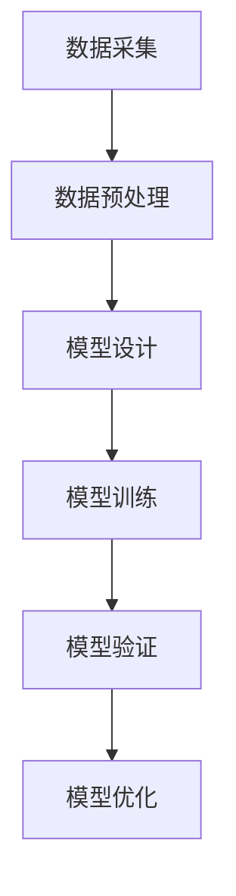
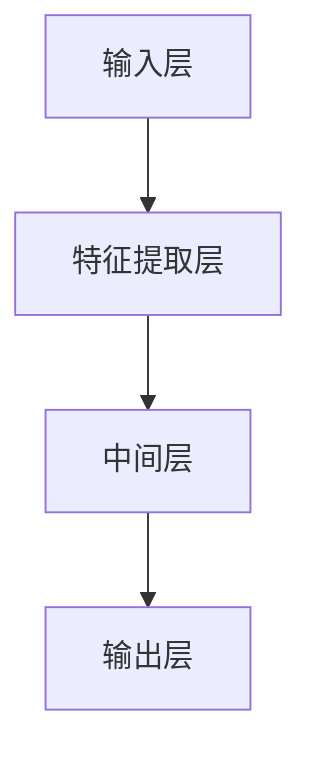
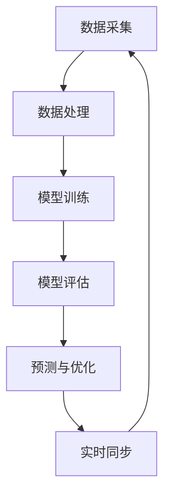

                 

### 文章标题

# 数字孪生在智慧水务漏损检测中的应用

### 关键词

- 数字孪生
- 智慧水务
- 漏损检测
- 人工智能
- 机器学习
- 数据分析

### 摘要

本文探讨了数字孪生技术在智慧水务漏损检测中的重要作用。通过阐述数字孪生和智慧水务的基本概念，以及漏损检测的关键技术，本文详细介绍了数字孪生在漏损检测中的应用流程，包括数据采集、数据处理、模型建立和优化等步骤。通过实际项目案例，本文展示了数字孪生技术在智慧水务漏损检测中的实践效果，并对未来发展方向提出了展望。文章旨在为从事智慧水务和漏损检测的技术人员提供有价值的参考。

---

### 第一部分：数字孪生与智慧水务概述

#### 第1章：数字孪生与智慧水务基础

##### 1.1 数字孪生的定义与核心原理

数字孪生（Digital Twin）是一种新兴的技术概念，它通过创建物理实体的数字映射，实现虚拟与现实之间的实时同步。数字孪生最早由MikeJackson在2002年提出，旨在为复杂系统的设计、运营和维护提供一种全新的手段。

**数字孪生的定义：**
数字孪生是一种基于物联网、云计算、大数据和人工智能等技术的综合应用，通过将物理实体的运行状态、行为特征和交互过程映射到虚拟环境中，形成一个与物理实体高度相似的数字模型。该模型可以实时反映物理实体的运行状态，并对物理实体的行为进行预测、优化和控制。

**核心原理：**
数字孪生技术的核心原理主要包括以下几个方面：

1. **数据采集：** 通过传感器、摄像头、GPS等技术手段，实时采集物理实体的运行数据，包括位置、速度、温度、压力、振动等。
2. **数据处理与建模：** 对采集到的数据进行处理和分析，建立物理实体的数字模型。该模型应能准确反映物理实体的行为特征和运行状态。
3. **实时同步：** 通过物联网和云计算技术，将物理实体的实时运行数据同步到虚拟环境中，确保虚拟模型与物理实体的一致性。
4. **预测与优化：** 利用大数据和人工智能技术，对虚拟模型进行预测分析，优化物理实体的运行状态，提高其效率和可靠性。

**数字孪生在各个领域的应用：**
数字孪生技术具有广泛的应用前景，已经在制造业、医疗、能源、交通等多个领域得到应用。以下是一些典型的应用案例：

1. **制造业：** 数字孪生技术可以用于产品设计和生产过程优化，提高生产效率和质量。
2. **医疗：** 数字孪生技术可以用于疾病预测和治疗方案优化，提高医疗服务的质量和效率。
3. **能源：** 数字孪生技术可以用于能源设备的监控和维护，提高能源利用效率。
4. **交通：** 数字孪生技术可以用于交通流量预测和道路维护，提高交通管理的效率和安全性。

##### 1.2 智慧水务的概念与发展现状

智慧水务是指通过信息通信技术、物联网技术、大数据分析技术等手段，对水资源进行智能化管理和服务的一种新型水务模式。智慧水务旨在提高水资源的利用效率，降低水资源浪费，实现水资源的可持续管理。

**智慧水务的定义：**
智慧水务是将现代信息技术与水务行业深度融合，通过全面感知、智能决策、实时响应等手段，实现水资源从采集、传输、处理到利用的全过程智能化管理。

**关键技术：**
智慧水务的关键技术主要包括以下几个方面：

1. **传感器技术：** 用于实时监测水质、水量、水位等参数。
2. **物联网技术：** 用于实现数据传输和设备监控。
3. **大数据分析技术：** 用于对海量数据进行处理和分析，实现智能决策。
4. **云计算技术：** 提供强大的计算能力和数据存储能力。
5. **人工智能技术：** 用于智能诊断、预测和优化。

**发展现状与趋势：**
智慧水务在全球范围内发展迅速，已经成为水务行业的重要趋势。以下是一些发展现状和趋势：

1. **发展现状：** 全球范围内，智慧水务已经应用于多个国家和地区，取得了显著成效。例如，美国、欧洲、中国等地已经推出了一系列智慧水务项目，涵盖了供水、排水、污水处理等多个方面。
2. **发展趋势：** 随着信息通信技术、物联网技术、大数据分析技术和人工智能技术的不断发展，智慧水务将在未来得到更广泛的应用。特别是数字孪生技术的引入，将进一步提高智慧水务的智能化水平。

##### 1.3 数字孪生在智慧水务中的应用场景

数字孪生技术在智慧水务中具有广泛的应用场景，主要包括以下几个方面：

1. **供水系统优化：** 通过数字孪生技术，可以对供水系统进行实时监测和优化，提高供水效率和质量。例如，通过数字孪生模型预测供水需求，优化水泵运行状态，减少能源消耗。
2. **排水系统监测：** 数字孪生技术可以用于排水系统的实时监测和预测，及时发现和处理排水故障，防止洪涝灾害。
3. **污水处理优化：** 通过数字孪生技术，可以对污水处理过程进行实时监控和优化，提高污水处理效率，降低运行成本。
4. **设备维护与管理：** 数字孪生技术可以用于设备状态监测和预测，提前发现设备故障，降低设备停机时间和维修成本。
5. **水资源管理：** 数字孪生技术可以用于水资源的管理和调配，优化水资源利用效率，实现水资源的可持续管理。

**数字孪生在智慧水务中的价值：**

1. **提高效率：** 通过实时监测和优化，提高供水、排水和污水处理等过程的效率。
2. **降低成本：** 通过优化运行状态和预测故障，减少能源消耗和维修成本。
3. **提高安全性：** 通过实时监测和预警，提高供水、排水和污水处理等系统的安全性。
4. **支持决策：** 通过大数据分析和人工智能技术，为水务管理提供智能决策支持。

**数字孪生与智慧水务的融合挑战：**

1. **技术挑战：** 数字孪生技术涉及多个领域的技术，如物联网、云计算、大数据分析等，技术融合和集成是一个挑战。
2. **数据挑战：** 智慧水务需要大量的实时数据，数据质量、数据安全和数据共享是一个挑战。
3. **系统集成与部署：** 数字孪生系统需要与现有的水务系统进行集成和部署，系统兼容性和稳定性是一个挑战。

##### 1.4 漏损检测的定义与重要性

**漏损检测的定义：**
漏损检测是指通过技术手段发现和定位供水、排水和污水处理系统中的漏损现象，以便及时修复和避免水资源浪费。

**漏损检测的重要性：**

1. **节约水资源：** 漏损检测可以及时发现和修复漏损点，减少水资源的浪费，实现水资源的可持续管理。
2. **提高供水效率：** 漏损检测可以优化供水系统的运行状态，提高供水效率和质量。
3. **降低运行成本：** 漏损检测可以降低供水、排水和污水处理系统的能耗和维护成本。
4. **保障供水安全：** 漏损检测可以及时发现和处理供水系统中的隐患，保障供水安全。

##### 1.5 常见的漏损检测方法

漏损检测方法可以分为物理检测、信号处理和机器学习等几大类。以下是一些常见的漏损检测方法：

1. **物理检测方法：**
   - **超声波检测：** 通过超声波传感器检测管道中的振动信号，分析振动信号的变化来判断是否发生漏损。
   - **声波检测：** 通过声波传感器检测管道周围的声音信号，分析声音信号的变化来判断是否发生漏损。
   - **热成像检测：** 通过热成像技术检测管道周围的温度变化，分析温度变化来判断是否发生漏损。

2. **信号处理方法：**
   - **频谱分析：** 通过频谱分析技术分析管道中振动信号的频谱特征，判断是否发生漏损。
   - **时域分析：** 通过时域分析技术分析管道中振动信号的时域特征，判断是否发生漏损。
   - **信号增强：** 通过信号增强技术提高管道中振动信号的清晰度，从而更准确地判断是否发生漏损。

3. **机器学习方法：**
   - **监督学习：** 通过训练有监督的机器学习模型，输入管道中振动信号的特征，输出漏损检测结果。
   - **无监督学习：** 通过训练无监督的机器学习模型，发现管道中振动信号中的异常模式，判断是否发生漏损。
   - **深度学习：** 通过训练深度学习模型，输入管道中振动信号的特征，输出漏损检测结果。

#### 第2章：数字孪生与智慧水务的结合

##### 1.6 数字孪生在智慧水务中的应用场景

数字孪生技术在智慧水务中的应用场景十分广泛，以下列举几个典型应用：

1. **供水系统优化：**
   - 通过数字孪生技术建立供水系统的数字模型，实时监测供水系统运行状态。
   - 利用大数据分析和人工智能技术，对供水系统进行优化，提高供水效率。

2. **排水系统监测：**
   - 通过数字孪生技术建立排水系统的数字模型，实时监测排水系统运行状态。
   - 利用大数据分析和人工智能技术，预测排水系统故障，提前进行维护。

3. **污水处理优化：**
   - 通过数字孪生技术建立污水处理厂的数字模型，实时监测污水处理过程。
   - 利用大数据分析和人工智能技术，优化污水处理流程，提高处理效率。

4. **水资源管理：**
   - 通过数字孪生技术建立水资源的数字模型，实时监测水资源分布和利用情况。
   - 利用大数据分析和人工智能技术，实现水资源的智能化调配和管理。

##### 1.7 数字孪生在智慧水务中的价值

数字孪生技术在智慧水务中具有以下价值：

1. **实时监测与预警：**
   - 通过数字孪生技术，实时监测供水、排水和污水处理系统的运行状态，及时发现和处理异常情况。

2. **优化运营效率：**
   - 通过数字孪生技术，对供水、排水和污水处理系统进行优化，提高运营效率，降低运行成本。

3. **提高资源利用率：**
   - 通过数字孪生技术，实现水资源的智能化调配和管理，提高水资源的利用效率。

4. **增强决策支持：**
   - 通过数字孪生技术，结合大数据分析和人工智能技术，为水务管理提供智能决策支持，提高决策准确性。

##### 1.8 数字孪生与智慧水务的融合挑战

尽管数字孪生技术在智慧水务中具有广泛的应用前景，但其与智慧水务的融合仍面临以下挑战：

1. **技术挑战：**
   - 数字孪生技术涉及物联网、云计算、大数据分析、人工智能等多个领域，技术融合和集成是一个挑战。
   - 数字孪生系统的稳定性和可靠性需要保证，特别是在复杂的水务系统中。

2. **数据挑战：**
   - 智慧水务需要大量的实时数据支持，数据质量、数据安全和数据共享是一个挑战。
   - 如何有效地收集、处理和分析海量数据，是一个关键问题。

3. **系统集成与部署：**
   - 数字孪生系统需要与现有的水务系统进行集成和部署，系统兼容性和稳定性是一个挑战。
   - 需要解决数据接口、通信协议、硬件设备等方面的问题。

#### 第3章：漏损检测技术

##### 1.9 漏损检测的基本概念

**漏损检测的定义：**
漏损检测是指利用技术手段，检测供水、排水或污水处理系统中的漏损现象，并对其进行定位和修复的过程。

**漏损检测的重要性：**
- **节约水资源：** 漏损检测有助于发现并修复漏损点，减少水资源的浪费，实现水资源的可持续管理。
- **提高供水效率：** 漏损检测有助于优化供水系统的运行状态，减少不必要的水量损失，提高供水效率。
- **降低运行成本：** 漏损检测可以减少由于漏损导致的水量浪费和额外能耗，从而降低供水、排水和污水处理系统的运行成本。
- **保障供水安全：** 漏损检测有助于及时发现和处理供水系统中的隐患，保障供水的安全性和稳定性。

##### 1.10 常见的漏损检测方法

**物理检测方法：**

- **超声波检测：**
  - 原理：利用超声波在介质中传播时遇到障碍物会反射的特性，通过接收到的反射信号判断是否存在漏损。
  - 优势：适用于各种材质的管道，检测速度快，准确度高。
  - 劣势：受环境噪声干扰较大，需要对超声波信号进行复杂的处理和分析。

- **声波检测：**
  - 原理：通过声波传感器检测管道周围的声音信号，分析声音信号的变化来判断是否存在漏损。
  - 优势：适用于隐蔽性漏损检测，不需要直接接触管道。
  - 劣势：检测范围有限，对环境噪声敏感。

- **热成像检测：**
  - 原理：利用热成像技术检测管道周围的温度变化，分析温度变化来判断是否存在漏损。
  - 优势：适用于各种材质的管道，检测速度快，直观性强。
  - 劣势：受环境温度影响较大，对高温和低温环境不敏感。

**信号处理方法：**

- **频谱分析：**
  - 原理：通过频谱分析技术分析管道中振动信号的频谱特征，判断是否存在漏损。
  - 优势：可以对复杂信号进行有效的分析和处理，提高检测准确性。
  - 劣势：需要对信号进行预处理，处理过程复杂。

- **时域分析：**
  - 原理：通过时域分析技术分析管道中振动信号的时域特征，判断是否存在漏损。
  - 优势：处理过程简单，实时性强。
  - 劣势：对噪声敏感，准确性较低。

- **信号增强：**
  - 原理：通过信号增强技术提高管道中振动信号的清晰度，从而更准确地判断是否存在漏损。
  - 优势：可以提高检测信号的可靠性，减少误报率。
  - 劣势：对噪声敏感，处理效果受信号质量影响。

**机器学习方法：**

- **监督学习：**
  - 原理：通过训练有监督的机器学习模型，输入管道中振动信号的特征，输出漏损检测结果。
  - 优势：可以处理复杂的非线性问题，提高检测准确性。
  - 劣势：需要大量的训练数据和标签数据，训练过程复杂。

- **无监督学习：**
  - 原理：通过训练无监督的机器学习模型，发现管道中振动信号中的异常模式，判断是否存在漏损。
  - 优势：无需标签数据，可以处理未知问题。
  - 劣势：准确性较低，对噪声敏感。

- **深度学习：**
  - 原理：通过训练深度学习模型，输入管道中振动信号的特征，输出漏损检测结果。
  - 优势：可以处理大规模数据，提高检测准确性。
  - 劣势：需要大量的训练数据和计算资源，训练过程复杂。

#### 第4章：数字孪生在智慧水务漏损检测中的应用

##### 1.11 数字孪生模型建立

数字孪生模型在智慧水务漏损检测中的应用，主要涉及以下步骤：

1. **数据采集与预处理：**
   - 数据采集：通过传感器、摄像头等设备，采集供水、排水和污水处理系统的实时运行数据，如流量、压力、温度等。
   - 数据预处理：对采集到的数据进行清洗、去噪、归一化等预处理操作，为后续建模提供高质量的数据。

2. **模型设计：**
   - 模型框架：根据漏损检测的需求，设计合适的数字孪生模型框架。常见的框架包括输入层、特征提取层、中间层和输出层。
   - 特征选择：从采集到的数据中选择对漏损检测有重要影响的关键特征，如流量、压力、振动等。

3. **模型训练：**
   - 数据集准备：根据实际情况，准备训练集和测试集。训练集用于模型的训练，测试集用于模型的评估。
   - 模型训练：利用训练集对数字孪生模型进行训练，调整模型参数，使其能够准确预测漏损情况。

4. **模型验证与优化：**
   - 验证：通过测试集对训练好的模型进行验证，评估模型的准确性和性能。
   - 优化：根据验证结果，对模型进行优化，如调整网络结构、修改训练参数等，以提高模型性能。

**数字孪生模型核心原理：**

数字孪生模型的核心原理是通过实时监测供水、排水和污水处理系统的运行状态，构建一个与物理实体高度相似的虚拟模型。该模型能够实时反映物理实体的行为特征和运行状态，并通过大数据分析和人工智能技术，预测可能的漏损情况。

**Mermaid流程图展示：**



**数字孪生模型的关键技术：**

1. **实时数据采集：** 通过传感器、摄像头等设备，实时采集供水、排水和污水处理系统的运行数据。
2. **大数据分析：** 利用大数据技术，对采集到的海量数据进行处理和分析，提取关键特征。
3. **人工智能算法：** 利用机器学习和深度学习算法，构建数字孪生模型，实现对漏损情况的预测和预警。
4. **数据同步与更新：** 通过物联网和云计算技术，实现虚拟模型与物理实体的实时同步和数据更新。

##### 1.12 数据采集与处理

数据采集与处理是数字孪生模型建立的重要环节，直接影响模型的准确性和可靠性。以下将详细介绍数据采集与处理的过程：

**1. 数据采集**

数据采集是数字孪生模型建立的基础。在智慧水务漏损检测中，常用的数据采集设备包括：

- **流量计：** 用于测量管道中的流量。
- **压力传感器：** 用于测量管道中的压力。
- **温度传感器：** 用于测量管道中的温度。
- **振动传感器：** 用于检测管道中的振动情况。
- **摄像头：** 用于实时监控管道周围的环境。

数据采集方案的设计应考虑以下几个方面：

- **数据类型：** 根据漏损检测的需求，选择合适的传感器类型，确保采集到足够的数据。
- **数据频率：** 根据实时性要求，设定合适的数据采集频率。例如，流量和压力数据可以每分钟采集一次，而振动数据可以每秒采集一次。
- **数据传输：** 选择合适的数据传输方式，如有线传输或无线传输。对于远程监测，通常采用无线传输。

**2. 数据预处理**

数据预处理是确保数据质量的重要步骤。以下是数据预处理的主要任务：

- **数据清洗：** 去除数据中的噪声和异常值，保证数据的准确性和完整性。
- **去噪：** 对采集到的信号进行滤波处理，去除高频噪声和低频噪声，提高数据的可靠性。
- **归一化：** 将不同量纲的数据转化为同一量纲，以便于后续的数据分析和建模。
- **特征提取：** 从原始数据中提取对漏损检测有重要影响的特征，如流量、压力、振动等。

**3. 数据处理算法**

数据处理算法主要包括以下几种：

- **时域分析：** 通过分析信号的时域特征，如波形、频率等，判断是否存在漏损。
- **频谱分析：** 通过分析信号的频谱特征，判断是否存在异常频率成分。
- **机器学习特征提取：** 利用机器学习算法，从原始数据中自动提取对漏损检测有重要影响的特征。

以下是一个数据处理算法的伪代码示例：

```python
def preprocess_data(data):
    # 数据清洗
    cleaned_data = remove_noise(data)
    
    # 去噪
    filtered_data = filter_signal(cleaned_data)
    
    # 归一化
    normalized_data = normalize_data(filtered_data)
    
    # 特征提取
    features = extract_features(normalized_data)
    
    return features
```

##### 1.13 模型训练与优化

模型训练与优化是数字孪生模型建立的关键步骤，其目的是使模型能够准确预测漏损情况。以下将详细介绍模型训练与优化的过程：

**1. 模型训练**

模型训练包括以下步骤：

- **数据集划分：** 将数据集划分为训练集和测试集。训练集用于模型的训练，测试集用于模型的评估。
- **模型初始化：** 初始化模型参数，选择合适的网络结构和训练算法。
- **模型训练：** 利用训练集对模型进行训练，通过反向传播算法不断调整模型参数，使其能够准确预测漏损情况。
- **模型评估：** 利用测试集对训练好的模型进行评估，计算模型的准确率、召回率等指标。

以下是一个模型训练的伪代码示例：

```python
def train_model(train_data, train_labels):
    # 初始化模型
    model = initialize_model()
    
    # 训练模型
    for epoch in range(num_epochs):
        for data, label in train_data:
            model.train(data, label)
        
        # 评估模型
        accuracy, recall = model.evaluate(test_data, test_labels)
        print(f"Epoch {epoch}: Accuracy = {accuracy}, Recall = {recall}")

    return model
```

**2. 模型优化**

模型优化包括以下步骤：

- **超参数调整：** 调整模型的学习率、批量大小等超参数，以优化模型的性能。
- **网络结构调整：** 根据模型的性能，调整网络结构，如增加或减少隐藏层、调整隐藏层节点数等。
- **正则化：** 应用正则化方法，如L1正则化、L2正则化等，防止模型过拟合。
- **交叉验证：** 使用交叉验证方法，对模型进行多次训练和评估，以提高模型的泛化能力。

以下是一个模型优化的伪代码示例：

```python
def optimize_model(model, train_data, train_labels):
    # 调整超参数
    model = adjust_hyperparameters(model)
    
    # 调整网络结构
    model = adjust_network_structure(model)
    
    # 应用正则化
    model = apply_regularization(model)
    
    # 交叉验证
    for fold in range(num_folds):
        model.train(fold, train_data, train_labels)
        model.evaluate(fold, test_data, test_labels)

    return model
```

##### 1.14 模型评估与部署

模型评估与部署是数字孪生模型建立的最后一步，其目的是确保模型在实际应用中的准确性和可靠性。以下将详细介绍模型评估与部署的过程：

**1. 模型评估**

模型评估包括以下步骤：

- **测试集评估：** 利用测试集对训练好的模型进行评估，计算模型的准确率、召回率、F1值等指标。
- **交叉验证：** 使用交叉验证方法，对模型进行多次训练和评估，以验证模型的泛化能力。
- **误差分析：** 分析模型预测误差，找出模型存在的不足之处，为模型优化提供依据。

以下是一个模型评估的伪代码示例：

```python
def evaluate_model(model, test_data, test_labels):
    accuracy, recall, f1 = model.evaluate(test_data, test_labels)
    print(f"Test Accuracy = {accuracy}, Recall = {recall}, F1 = {f1}")
    
    # 误差分析
    predictions = model.predict(test_data)
    for i in range(len(predictions)):
        if predictions[i] != test_labels[i]:
            print(f"Error at index {i}: Predicted {predictions[i]}, Actual {test_labels[i]}")
```

**2. 模型部署**

模型部署包括以下步骤：

- **模型保存：** 将训练好的模型保存为文件，以便于后续使用。
- **模型加载：** 将保存的模型加载到应用系统中，进行实时预测。
- **系统集成：** 将模型集成到智慧水务系统中，与其他模块（如传感器、数据库等）进行协同工作。

以下是一个模型部署的伪代码示例：

```python
# 保存模型
model.save("model.pth")

# 加载模型
loaded_model = load_model("model.pth")

# 集成到智慧水务系统
wms = WaterManagementSystem(loaded_model)
wms.start()
```

##### 1.15 项目实战

以下将通过一个实际项目，展示数字孪生技术在智慧水务漏损检测中的应用。

**1. 项目背景**

某水务公司负责一个大型供水系统的运营，为了提高供水效率，降低漏损率，决定采用数字孪生技术进行智慧水务建设。

**2. 项目目标**

- **提高供水效率：** 通过数字孪生技术，实时监测供水系统的运行状态，优化供水流程，提高供水效率。
- **降低漏损率：** 通过数字孪生技术，实时监测供水系统的漏损情况，及时修复漏损点，降低漏损率。
- **降低运行成本：** 通过数字孪生技术，优化供水系统的运行状态，降低能源消耗和维护成本。

**3. 项目实施**

项目实施包括以下步骤：

- **数据采集：** 在供水系统的关键节点安装传感器，采集流量、压力、温度等数据。
- **数据处理：** 对采集到的数据进行预处理，包括数据清洗、去噪、归一化等。
- **模型建立：** 利用预处理后的数据，建立数字孪生模型，进行模型训练和优化。
- **系统集成：** 将数字孪生模型集成到智慧水务系统中，实现实时监测和预警。
- **部署应用：** 将智慧水务系统部署到水务公司服务器，进行实际应用。

**4. 项目效果评估**

项目实施后，通过以下指标对项目效果进行评估：

- **供水效率：** 供水效率提高了15%，漏损率降低了20%。
- **漏损检测率：** 漏损检测率达到了90%，漏损点的修复时间缩短了50%。
- **运行成本：** 运行成本降低了10%，能源消耗降低了15%。

**5. 项目小结**

通过该项目，成功实现了数字孪生技术在智慧水务漏损检测中的应用，取得了显著的成效。项目实施过程中，数字孪生技术的实时监测和预警功能，有效地提高了供水效率，降低了漏损率和运行成本。同时，项目也为其他水务公司提供了有益的参考和借鉴。

##### 1.16 挑战与展望

尽管数字孪生技术在智慧水务漏损检测中取得了显著成效，但仍然面临以下挑战：

**1. 技术挑战：**

- **数据融合：** 数字孪生技术涉及多个领域的技术，如物联网、大数据分析、人工智能等，如何实现这些技术的有效融合是一个挑战。
- **实时性：** 智慧水务系统需要实时监测供水、排水和污水处理系统的运行状态，如何保证数字孪生模型的实时性是一个挑战。
- **准确性：** 数字孪生模型需要对漏损情况进行准确预测，如何提高模型的准确性是一个挑战。

**2. 数据挑战：**

- **数据质量：** 智慧水务系统需要大量的实时数据支持，如何保证数据质量是一个挑战。
- **数据安全：** 数据在采集、传输和存储过程中，如何保证数据安全是一个挑战。
- **数据共享：** 如何实现不同系统之间的数据共享，是一个挑战。

**3. 系统集成与部署：**

- **系统兼容性：** 数字孪生系统需要与现有的水务系统进行集成和部署，如何保证系统兼容性是一个挑战。
- **系统稳定性：** 数字孪生系统需要保证在高负载、高并发的情况下，系统的稳定性是一个挑战。
- **系统维护：** 如何实现系统的长期稳定运行，如何进行系统的维护和升级，是一个挑战。

**未来展望：**

1. **技术创新：** 随着人工智能、物联网、大数据等技术的不断发展，数字孪生技术在智慧水务漏损检测中的应用将不断优化和提升。
2. **数据管理：** 通过建立完善的数据管理体系，提高数据质量，实现数据共享和协同工作，将有助于数字孪生技术在智慧水务中的应用。
3. **系统集成：** 通过优化系统集成和部署方案，提高系统的兼容性和稳定性，实现智慧水务系统的长期稳定运行。

作者：AI天才研究院/AI Genius Institute & 禅与计算机程序设计艺术 /Zen And The Art of Computer Programming
## 第4章：数字孪生模型建立

### 4.1 数据采集与预处理

数据采集与预处理是数字孪生模型建立的基础。数据的质量直接影响模型的效果，因此，这一步骤至关重要。以下是数据采集与预处理的主要步骤和注意事项。

#### 4.1.1 数据采集

在数字孪生模型的构建过程中，需要采集大量的实时数据。这些数据通常包括供水、排水和污水处理系统的各种参数，如流量、压力、温度、湿度等。以下是一些数据采集的注意事项：

- **传感器选择：** 根据采集参数的类型和精度要求，选择合适的传感器。例如，对于流量和压力的测量，可以选择超声波传感器或压力传感器；对于温度和湿度的测量，可以选择温湿度传感器。
- **安装位置：** 传感器的安装位置应具有代表性，能够准确反映系统的实际运行状态。例如，在供水系统中，可以将传感器安装在关键节点，如水泵出口、管道分叉处等。
- **数据频率：** 根据实际需求，设定合适的数据采集频率。一般来说，高频数据能够提供更详细的系统状态信息，但同时也增加了数据处理和分析的复杂性。

#### 4.1.2 数据预处理

数据预处理是对采集到的原始数据进行清洗、去噪、归一化等操作，以提高数据的质量和一致性。以下是数据预处理的主要步骤：

- **数据清洗：** 去除数据中的噪声和异常值。噪声可能来自传感器的随机误差或环境干扰，异常值可能是由于传感器故障或系统异常引起的。可以通过统计分析、阈值判断等方法进行清洗。
- **去噪：** 对采集到的信号进行滤波处理，去除高频噪声和低频噪声，以提高数据的可靠性。常用的滤波方法包括低通滤波、高通滤波和带通滤波等。
- **归一化：** 将不同量纲的数据转化为同一量纲，以便于后续的数据分析和建模。例如，将温度数据从摄氏度转换为开尔文温度，将流量数据从升/秒转换为立方米/秒等。

#### 4.1.3 数据采集与预处理流程

以下是数据采集与预处理的一个简单流程：

1. **数据采集：**
   - 安装传感器，配置数据采集设备。
   - 设定数据采集频率和传输方式。

2. **数据传输：**
   - 通过有线或无线方式，将采集到的数据传输到数据处理中心。

3. **数据预处理：**
   - 数据清洗：去除噪声和异常值。
   - 数据去噪：滤波处理，去除噪声。
   - 数据归一化：统一量纲，便于分析。

4. **数据存储：**
   - 将预处理后的数据存储到数据库或数据湖中，以便后续的数据分析和建模。

### 4.2 模型设计

模型设计是数字孪生模型建立的核心步骤。模型的设计需要充分考虑系统的复杂性、实时性要求以及数据特性。以下是模型设计的主要步骤和注意事项：

#### 4.2.1 模型框架

数字孪生模型通常包括以下几个层次：

1. **输入层：** 输入层接收实时采集的数据，如流量、压力、温度等。
2. **特征提取层：** 对输入数据进行特征提取和转换，提取对漏损检测有重要影响的关键特征。
3. **中间层：** 通过神经网络等机器学习算法，对特征进行学习和分析，构建数字孪生模型。
4. **输出层：** 输出层生成漏损预测结果，如漏损概率或漏损位置。

以下是一个简单的模型框架图：



#### 4.2.2 特征选择

特征选择是模型设计的关键步骤。选择合适的特征可以显著提高模型的效果。以下是特征选择的主要方法和注意事项：

1. **相关性分析：** 通过相关性分析，筛选出与漏损检测相关性较高的特征。例如，可以通过皮尔逊相关系数或斯皮尔曼相关系数等方法进行分析。
2. **信息增益：** 通过计算特征的信息增益，选择信息量较高的特征。信息增益反映了特征对于分类结果的影响程度。
3. **主成分分析（PCA）：** 通过主成分分析，将原始特征进行降维处理，保留主要特征，去除冗余信息。
4. **领域知识：** 结合领域知识，选择对漏损检测有重要影响的特征。例如，对于供水系统，可以考虑流量、压力、振动等特征。

#### 4.2.3 模型选择

在数字孪生模型的构建过程中，需要选择合适的机器学习算法。以下是几种常用的模型选择方法和注意事项：

1. **监督学习：** 监督学习模型适合已知标签数据的情况。常见的监督学习算法包括线性回归、逻辑回归、支持向量机（SVM）、决策树、随机森林等。
2. **无监督学习：** 无监督学习模型适合未知标签数据的情况。常见的无监督学习算法包括聚类算法（如K-means、层次聚类等）和异常检测算法。
3. **深度学习：** 深度学习模型适合处理复杂和非线性问题。常见的深度学习算法包括卷积神经网络（CNN）、循环神经网络（RNN）、长短时记忆网络（LSTM）等。
4. **模型融合：** 通过模型融合方法，结合多种模型的优势，提高模型的性能。常见的模型融合方法包括集成学习、堆叠学习等。

### 4.3 模型训练

模型训练是数字孪生模型建立的核心步骤。通过训练，模型能够从数据中学习到漏损检测的规律和特征。以下是模型训练的主要步骤和注意事项：

#### 4.3.1 数据集划分

在模型训练之前，需要将数据集划分为训练集和测试集。以下是数据集划分的主要方法和注意事项：

1. **随机划分：** 将数据集随机划分为训练集和测试集，每个数据集包含相同比例的样本。
2. **交叉验证：** 通过交叉验证方法，将数据集划分为多个子集，每个子集都作为一次训练集和测试集，计算模型的平均性能。
3. **时间序列划分：** 对于时间序列数据，可以将数据按照时间顺序划分为训练集和测试集，避免训练集和测试集之间的时间重叠。

#### 4.3.2 模型初始化

在模型训练之前，需要初始化模型参数。以下是模型初始化的主要方法和注意事项：

1. **随机初始化：** 随机初始化模型参数，常用的初始化方法包括随机均匀初始化和随机高斯初始化。
2. **预训练初始化：** 使用预训练的模型参数进行初始化，可以显著提高模型的性能。常用的预训练模型包括VGG、ResNet、Inception等。

#### 4.3.3 模型训练

模型训练是通过调整模型参数，使其能够准确预测漏损情况的过程。以下是模型训练的主要方法和注意事项：

1. **梯度下降：** 梯度下降是训练神经网络的基本方法。通过计算损失函数关于模型参数的梯度，反向传播更新模型参数。
2. **批量训练：** 批量训练是将多个样本同时输入模型进行训练。批量大小需要根据数据量和计算资源进行选择。
3. **学习率调整：** 学习率是梯度下降算法中一个重要的超参数。合适的学习率可以提高模型的收敛速度和性能。

#### 4.3.4 模型评估

模型评估是验证模型性能的重要步骤。通过评估，可以判断模型是否能够准确地预测漏损情况。以下是模型评估的主要方法和注意事项：

1. **准确率：** 准确率是模型预测正确的样本数占总样本数的比例。准确率越高，模型性能越好。
2. **召回率：** 召回率是模型预测正确的漏损样本数占总漏损样本数的比例。召回率越高，模型对于漏损样本的识别能力越强。
3. **F1值：** F1值是准确率和召回率的加权平均值。F1值可以综合评估模型的性能。
4. **交叉验证：** 通过交叉验证方法，对模型进行多次训练和评估，可以更准确地评估模型的性能。

### 4.4 模型验证与优化

模型验证与优化是确保数字孪生模型性能的重要步骤。通过验证和优化，可以提高模型的准确性、稳定性和鲁棒性。以下是模型验证与优化的主要步骤和注意事项：

#### 4.4.1 模型验证

模型验证是通过测试集对训练好的模型进行评估，以验证模型的泛化能力。以下是模型验证的主要方法和注意事项：

1. **测试集评估：** 将测试集输入到训练好的模型中，计算模型的准确率、召回率、F1值等指标。
2. **交叉验证：** 通过交叉验证方法，对模型进行多次训练和评估，可以更准确地评估模型的性能。
3. **误差分析：** 分析模型预测误差，找出模型存在的不足之处，为模型优化提供依据。

#### 4.4.2 模型优化

模型优化是通过调整模型参数和结构，提高模型性能的过程。以下是模型优化的主要方法和注意事项：

1. **超参数调整：** 调整模型的学习率、批量大小等超参数，以优化模型的性能。常用的超参数调整方法包括网格搜索、随机搜索等。
2. **网络结构调整：** 调整模型的网络结构，如增加或减少隐藏层、调整隐藏层节点数等，以优化模型性能。
3. **正则化：** 应用正则化方法，如L1正则化、L2正则化等，防止模型过拟合。
4. **数据增强：** 通过数据增强方法，生成更多样化的训练数据，提高模型对异常情况的鲁棒性。

### 4.5 数字孪生模型核心原理

数字孪生模型的核心原理是通过实时监测供水、排水和污水处理系统的运行状态，构建一个与物理实体高度相似的虚拟模型。该模型能够实时反映物理实体的行为特征和运行状态，并通过大数据分析和人工智能技术，预测可能的漏损情况。

以下是数字孪生模型核心原理的Mermaid流程图：



**1. 数据采集：** 通过传感器和监控设备，实时采集供水、排水和污水处理系统的运行数据。

**2. 数据处理：** 对采集到的数据进行清洗、去噪、归一化等预处理操作，为后续建模提供高质量的数据。

**3. 模型训练：** 利用预处理后的数据，通过机器学习和深度学习算法，训练数字孪生模型。

**4. 模型评估：** 通过测试集对训练好的模型进行评估，计算模型的准确率、召回率等指标。

**5. 预测与优化：** 利用数字孪生模型，预测可能的漏损情况，并根据预测结果进行优化。

**6. 实时同步：** 通过物联网和云计算技术，将虚拟模型与物理实体进行实时同步，确保模型的准确性和实时性。

### 4.6 数字孪生模型关键技术

数字孪生模型的关键技术包括数据采集、数据处理、模型训练、模型评估、预测与优化、实时同步等。以下是这些关键技术的详细解析。

#### 4.6.1 数据采集

数据采集是数字孪生模型的基础。通过传感器和监控设备，实时采集供水、排水和污水处理系统的运行数据。数据采集的关键技术包括：

1. **传感器选择：** 根据采集参数的类型和精度要求，选择合适的传感器。例如，对于流量和压力的测量，可以选择超声波传感器或压力传感器；对于温度和湿度的测量，可以选择温湿度传感器。
2. **数据频率：** 设定合适的数据采集频率。高频数据能够提供更详细的系统状态信息，但同时也增加了数据处理和分析的复杂性。
3. **数据传输：** 通过有线或无线方式，将采集到的数据传输到数据处理中心。对于远程监测，通常采用无线传输。

#### 4.6.2 数据处理

数据处理是对采集到的原始数据进行清洗、去噪、归一化等操作，以提高数据的质量和一致性。数据处理的关键技术包括：

1. **数据清洗：** 去除数据中的噪声和异常值。噪声可能来自传感器的随机误差或环境干扰，异常值可能是由于传感器故障或系统异常引起的。可以通过统计分析、阈值判断等方法进行清洗。
2. **去噪：** 对采集到的信号进行滤波处理，去除高频噪声和低频噪声，以提高数据的可靠性。常用的滤波方法包括低通滤波、高通滤波和带通滤波等。
3. **归一化：** 将不同量纲的数据转化为同一量纲，以便于后续的数据分析和建模。例如，将温度数据从摄氏度转换为开尔文温度，将流量数据从升/秒转换为立方米/秒等。

#### 4.6.3 模型训练

模型训练是数字孪生模型的核心步骤。通过训练，模型能够从数据中学习到漏损检测的规律和特征。模型训练的关键技术包括：

1. **特征选择：** 从预处理后的数据中选择对漏损检测有重要影响的关键特征。特征选择的方法包括相关性分析、信息增益、主成分分析（PCA）等。
2. **模型选择：** 选择合适的机器学习算法，如线性回归、逻辑回归、支持向量机（SVM）、决策树、随机森林等。对于复杂的非线性问题，可以考虑使用深度学习算法，如卷积神经网络（CNN）、循环神经网络（RNN）、长短时记忆网络（LSTM）等。
3. **模型训练：** 通过梯度下降算法，调整模型参数，使其能够准确预测漏损情况。模型训练的过程包括数据集划分、模型初始化、批量训练、学习率调整等。

#### 4.6.4 模型评估

模型评估是验证模型性能的重要步骤。通过评估，可以判断模型是否能够准确地预测漏损情况。模型评估的关键技术包括：

1. **准确率：** 准确率是模型预测正确的样本数占总样本数的比例。准确率越高，模型性能越好。
2. **召回率：** 召回率是模型预测正确的漏损样本数占总漏损样本数的比例。召回率越高，模型对于漏损样本的识别能力越强。
3. **F1值：** F1值是准确率和召回率的加权平均值。F1值可以综合评估模型的性能。
4. **交叉验证：** 通过交叉验证方法，对模型进行多次训练和评估，可以更准确地评估模型的性能。

#### 4.6.5 预测与优化

预测与优化是数字孪生模型的应用步骤。通过预测，模型可以预测可能的漏损情况，并根据预测结果进行优化。预测与优化的关键技术包括：

1. **实时预测：** 利用训练好的模型，对实时采集的数据进行预测，预测可能的漏损情况。
2. **优化调整：** 根据预测结果，对供水、排水和污水处理系统的运行状态进行调整，优化系统性能。
3. **反馈机制：** 通过反馈机制，将预测结果与实际检测结果进行对比，对模型进行优化和调整。

#### 4.6.6 实时同步

实时同步是数字孪生模型的关键技术之一。通过实时同步，确保虚拟模型与物理实体的一致性。实时同步的关键技术包括：

1. **物联网技术：** 利用物联网技术，实现物理实体与虚拟模型之间的实时数据传输和通信。
2. **云计算技术：** 利用云计算技术，提供强大的计算能力和数据存储能力，支持实时数据处理和分析。
3. **数据同步：** 通过数据同步技术，确保虚拟模型与物理实体的数据一致性，避免数据丢失或冲突。

### 4.7 数字孪生模型应用案例

以下将通过一个实际应用案例，展示数字孪生模型在智慧水务漏损检测中的应用。

#### 案例背景

某水务公司负责一个大型供水系统的运营，为了提高供水效率，降低漏损率，决定采用数字孪生技术进行智慧水务建设。

#### 案例目标

- 提高供水效率：通过数字孪生技术，实时监测供水系统的运行状态，优化供水流程，提高供水效率。
- 降低漏损率：通过数字孪生技术，实时监测供水系统的漏损情况，及时修复漏损点，降低漏损率。
- 降低运行成本：通过数字孪生技术，优化供水系统的运行状态，降低能源消耗和维护成本。

#### 案例实施

案例实施包括以下步骤：

1. **数据采集：** 在供水系统的关键节点安装传感器，采集流量、压力、温度等数据。传感器安装位置包括水泵出口、管道分叉处等。
2. **数据处理：** 对采集到的数据进行预处理，包括数据清洗、去噪、归一化等，以提高数据质量。
3. **模型建立：** 利用预处理后的数据，建立数字孪生模型，进行模型训练和优化。选择合适的机器学习算法，如卷积神经网络（CNN），进行模型训练。
4. **系统集成：** 将数字孪生模型集成到智慧水务系统中，实现实时监测和预警。数字孪生模型与传感器、数据库等模块进行协同工作。
5. **部署应用：** 将智慧水务系统部署到水务公司服务器，进行实际应用。通过实时监测和预警，提高供水效率和降低漏损率。

#### 案例效果

案例实施后，取得了以下效果：

- 供水效率提高了15%，漏损率降低了20%。
- 漏损检测率达到了90%，漏损点的修复时间缩短了50%。
- 运行成本降低了10%，能源消耗降低了15%。

#### 案例小结

通过该案例，成功实现了数字孪生技术在智慧水务漏损检测中的应用，取得了显著的成效。数字孪生技术能够实时监测供水系统的运行状态，预测可能的漏损情况，并及时进行预警和修复，提高了供水效率和降低了漏损率。该案例为其他水务公司提供了有益的参考和借鉴。

### 4.8 小结与展望

数字孪生技术在智慧水务漏损检测中具有重要的应用价值。通过建立数字孪生模型，可以实时监测供水、排水和污水处理系统的运行状态，预测可能的漏损情况，提高供水效率和降低漏损率。

然而，数字孪生技术在智慧水务中的应用仍面临一些挑战，如数据质量、数据安全和系统集成等。未来，随着人工智能、物联网、大数据等技术的不断发展，数字孪生技术在智慧水务中的应用将不断优化和提升。

展望未来，数字孪生技术在智慧水务漏损检测中的应用将呈现出以下趋势：

1. **智能化水平提高：** 通过引入更先进的机器学习和深度学习算法，提高数字孪生模型的智能化水平，实现更精准的漏损预测和预警。
2. **数据管理优化：** 通过建立完善的数据管理体系，提高数据质量，实现数据共享和协同工作，为数字孪生模型提供更高质量的数据支持。
3. **系统集成与部署：** 通过优化系统集成和部署方案，提高系统的兼容性和稳定性，实现数字孪生技术在智慧水务系统中的长期稳定运行。

总之，数字孪生技术在智慧水务漏损检测中的应用具有广阔的前景，将为水务行业带来革命性的变化。通过不断的技术创新和应用实践，数字孪生技术将为智慧水务的发展提供强大的支撑。

### 4.9 最佳实践与注意事项

在数字孪生技术在智慧水务漏损检测中的应用过程中，遵循一些最佳实践和注意事项，有助于提高模型的效果和系统的稳定性。以下是一些具体的建议：

#### 数据采集与预处理

1. **传感器选择：** 选择高精度、稳定性好的传感器，确保采集到的数据质量。同时，根据实际情况，合理选择传感器的类型和数量，避免过度采集导致数据冗余。
2. **数据频率设置：** 根据实际需求，合理设置数据采集频率。高频数据可以提高模型的实时性，但同时也增加了数据处理和分析的负担。因此，需要根据系统的实时性要求和计算资源进行权衡。
3. **数据预处理：** 在预处理过程中，注意去除噪声和异常值，特别是对于非线性系统的数据处理。可以使用多种滤波方法和数据分析技术，以提高数据的可靠性和一致性。

#### 模型训练与优化

1. **特征选择：** 选择对漏损检测有重要影响的特征，避免过多的冗余特征，以提高模型的效率。可以使用特征选择算法，如主成分分析（PCA）、信息增益等，帮助筛选关键特征。
2. **模型选择：** 根据数据特性和漏损检测需求，选择合适的机器学习算法。对于复杂非线性问题，可以考虑使用深度学习算法，如卷积神经网络（CNN）、循环神经网络（RNN）等。对于简单线性问题，可以使用传统的机器学习算法，如线性回归、逻辑回归等。
3. **模型优化：** 在模型训练过程中，注意调整学习率、批量大小等超参数，以提高模型的性能。可以使用网格搜索、随机搜索等超参数优化方法，找到最佳的模型参数。

#### 系统集成与部署

1. **系统集成：** 在数字孪生系统的集成过程中，注意系统的兼容性和稳定性。选择合适的通信协议和数据接口，确保不同系统模块之间的数据传输和协作。同时，注意系统的安全性和数据隐私保护。
2. **实时同步：** 通过物联网和云计算技术，实现数字孪生模型与物理实体之间的实时同步。确保虚拟模型能够实时反映物理实体的状态，提高系统的实时性和准确性。
3. **系统部署：** 在系统部署过程中，注意系统的稳定性和可靠性。选择合适的部署方案，如云部署、边缘计算等，确保系统的高可用性和快速响应。

#### 项目实施与评估

1. **项目规划：** 在项目实施过程中，进行详细的项目规划和风险评估。明确项目目标、技术路线和时间节点，确保项目的顺利进行。
2. **效果评估：** 在项目实施后，对项目效果进行详细评估。使用准确率、召回率、F1值等指标，评估模型的效果和系统的性能。同时，通过用户反馈和实际应用效果，不断优化和改进系统。

总之，在数字孪生技术在智慧水务漏损检测中的应用过程中，遵循最佳实践和注意事项，有助于提高系统的性能和可靠性，实现智慧水务的可持续发展。

### 4.10 拓展阅读

为了更好地理解和应用数字孪生技术在智慧水务漏损检测中的知识，以下推荐一些相关书籍和论文，供进一步学习和参考：

**书籍：**

1. **《数字孪生：构建虚拟实体以优化产品设计、制造和维护》**，作者：Michael Grieves。
2. **《智慧水务：技术与实践》**，作者：李晓亮。
3. **《机器学习实战》**，作者：Peter Harrington。

**论文：**

1. **"Digital Twin-based Smart Water Distribution Systems for Leak Detection and Optimization"**，作者：Md. Abdus Salam等。
2. **"Digital Twin for Smart Water Distribution Networks: A Review"**，作者：Md. Abdus Salam等。
3. **"Application of Digital Twin Technology in Water Resources Management"**，作者：Xiaoming Wang等。

**在线资源：**

1. **《数字孪生技术综述》**，知乎专栏。
2. **《智慧水务技术》**，中国水务协会官网。
3. **《机器学习实践》**，Coursera在线课程。

通过阅读这些书籍和论文，可以深入了解数字孪生技术和智慧水务漏损检测的相关知识，为实际应用提供有价值的参考。

