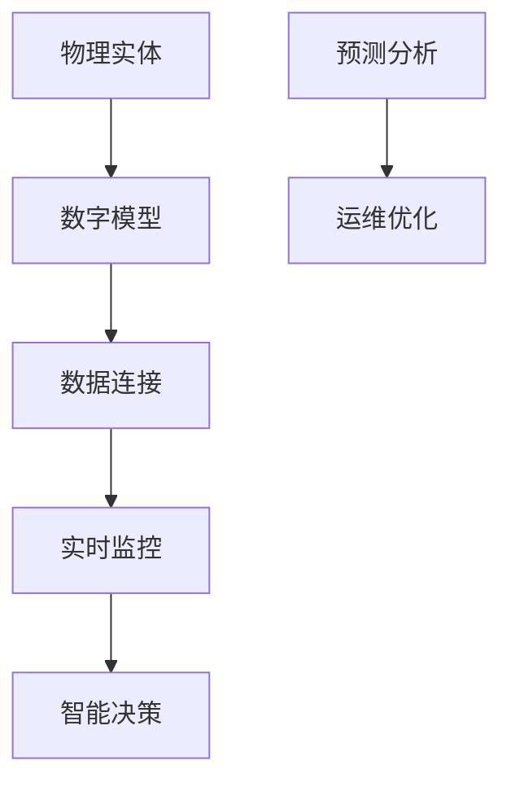
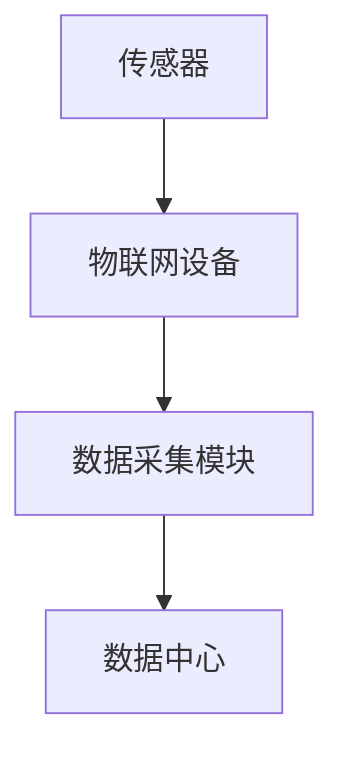

                 

### 数字孪生在智慧港口管理中的实践

#### 关键词

数字孪生、智慧港口、管理、实践、案例分析

#### 摘要

本文探讨了数字孪生技术在智慧港口管理中的应用与实践。首先，我们介绍了数字孪生的基本概念及其在港口管理中的重要性。接着，通过核心概念的联系架构图，详细阐述了数字孪生技术的原理和实现方法。随后，本文通过伪代码和LaTeX数学公式，深入讲解了数字孪生中的核心算法原理。文章随后展示了数字孪生在智慧港口中的具体应用案例，包括开发环境搭建、源代码实现、代码解读和应用分析。最后，文章总结了数字孪生在智慧港口管理中的最佳实践、注意事项，并提供拓展阅读建议，以帮助读者更深入地了解这一领域。

#### 1. 引言

随着全球贸易的迅速发展，港口作为物流的关键节点，其效率和管理水平直接关系到整个供应链的流畅性。传统港口管理存在诸多问题，如人工操作效率低、设备维护成本高、安全隐患等。为了解决这些问题，智慧港口的概念应运而生。智慧港口通过物联网、大数据、人工智能等先进技术，实现对港口各个环节的实时监控和智能管理，从而提高港口运营效率和降低成本。

数字孪生（Digital Twin）技术作为智慧港口的重要组成部分，通过创建港口设施的虚拟模型，实现物理世界与虚拟世界的实时联动，为智慧港口管理提供了新的手段。本文旨在探讨数字孪生在智慧港口管理中的实践，分析其应用场景、技术实现方法和实际案例，以期为港口行业的数字化转型提供参考。

#### 2. 数字孪生基础概念与原理

数字孪生（Digital Twin）是一种模拟物理实体（如设备、系统、港口等）及其行为的数字模型。这个模型包含了物理实体的结构、功能、性能等特性，并通过实时数据同步，反映物理实体的状态变化。

在智慧港口中，数字孪生技术通过以下三个核心组成部分实现：

1. **物理实体**：即港口设施，如码头、堆场、装卸设备等。
2. **数字模型**：基于物理实体的几何特征、功能特性和运行数据，创建的虚拟模型。
3. **数据连接**：通过传感器、物联网等手段，实现物理实体与数字模型的实时数据同步。

核心概念与联系架构图如下：



通过上述架构，数字孪生技术实现了对港口设施的实时监控、智能决策和预测分析，从而实现对港口运营的全方位管理。

#### 3. 数字孪生技术架构与实现

数字孪生技术架构主要包括数据采集、数据处理、模型构建和模型部署四个关键环节。

##### 3.1 数据采集

数据采集是数字孪生技术的核心，通过传感器、摄像头、物联网设备等，实时获取港口设施的运行数据，包括温度、湿度、设备状态、货物数量等。



##### 3.2 数据处理

采集到的数据需要进行预处理，包括数据清洗、去噪、归一化等，以确保数据的质量和一致性。

```python
def preprocess_data(data):
    # 数据清洗
    cleaned_data = clean_data(data)
    # 数据去噪
    denoised_data = remove_noise(cleaned_data)
    # 数据归一化
    normalized_data = normalize(denoised_data)
    return normalized_data
```

##### 3.3 模型构建

基于处理后的数据，构建数字孪生的模型。模型可以分为物理模型、数据驱动模型和知识驱动模型。

- **物理模型**：基于物理实体几何特征的静态模型，用于模拟实体结构。
- **数据驱动模型**：基于历史数据，利用机器学习和数据挖掘技术，建立动态模型，用于预测和决策。
- **知识驱动模型**：结合专家知识和数据驱动模型，实现更高层次的决策支持。

```python
def build_model(data, model_type):
    if model_type == "physical":
        model = build_physical_model(data)
    elif model_type == "data-driven":
        model = build_data_driven_model(data)
    elif model_type == "knowledge-driven":
        model = build_knowledge_driven_model(data)
    return model
```

##### 3.4 模型部署

构建好的数字孪生模型需要部署到生产环境中，实现实时监控和智能决策。部署过程包括模型训练、模型评估和模型优化。

```python
def deploy_model(model, environment):
    # 模型训练
    trained_model = train_model(model, environment)
    # 模型评估
    evaluated_model = evaluate_model(trained_model)
    # 模型优化
    optimized_model = optimize_model(evaluated_model)
    return optimized_model
```

#### 4. 数字孪生在智慧港口中的应用

数字孪生技术在智慧港口中的应用场景广泛，包括但不限于以下几方面：

- **实时监控**：通过数字孪生技术，实现对港口设施的实时监控，包括设备状态、货物位置、天气情况等。
- **预测分析**：基于历史数据和模型预测，对港口运营中的潜在问题进行提前预警，如设备故障、货物滞留等。
- **运维优化**：通过分析设备和设施的运行数据，优化运维策略，降低维护成本，提高设备利用率。

以下是一个具体的智慧港口应用案例：

##### 案例一：智能装卸系统

智能装卸系统通过数字孪生技术，实现对港口装卸作业的全方位监控和优化。系统包括以下模块：

- **传感器模块**：实时监测装卸设备的运行状态，如吊车、卡车等。
- **数据采集模块**：通过物联网设备，采集装卸设备的运行数据，如温度、速度、重量等。
- **数据处理模块**：对采集到的数据进行预处理，确保数据质量。
- **模型构建模块**：基于预处理后的数据，构建数字孪生模型，用于预测和决策。
- **智能决策模块**：根据模型预测，自动调整装卸设备的作业策略，如调整吊车的高度、卡车的行驶路线等。

#### 5. 数字孪生项目管理与优化

在数字孪生项目实施过程中，项目管理和优化至关重要。以下是一些最佳实践和注意事项：

- **明确项目目标和需求**：在项目启动前，明确项目目标、需求和技术路线，确保项目方向正确。
- **数据质量管理**：数据是数字孪生的核心，确保数据质量是项目成功的关键。包括数据采集、处理、存储和传输等环节。
- **模型优化**：通过不断优化模型，提高预测准确性和决策效果。包括模型训练、评估和调整等过程。
- **团队协作**：数字孪生项目涉及多个部门和领域，需要建立有效的团队协作机制，确保项目进度和质量。
- **持续迭代**：数字孪生技术不断演进，项目需要持续迭代和优化，以适应新的需求和技术变化。

#### 6. 结论

数字孪生技术在智慧港口管理中具有重要的应用价值，通过实时监控、预测分析和运维优化，提高了港口的运营效率和安全性。本文详细阐述了数字孪生的概念、技术架构和应用案例，为港口行业的数字化转型提供了参考。未来，随着技术的不断进步，数字孪生在智慧港口中的应用将更加深入和广泛。

#### 作者

作者：AI天才研究院/AI Genius Institute & 禅与计算机程序设计艺术 /Zen And The Art of Computer Programming

作者简介：AI天才研究院（AI Genius Institute）致力于推动人工智能技术的创新和应用，研究涵盖机器学习、数据挖掘、自然语言处理等多个领域。禅与计算机程序设计艺术（Zen And The Art of Computer Programming）则专注于计算机编程哲学和艺术，旨在提升程序员的编程能力和思维水平。

#### 拓展阅读

1. Grieves, M. (2002). “Digital Twin: Getting Closer to Your Physical Twin.” Defense Advanced Research Projects Agency.
2. Wang, Y., & Xin, X. (2018). “Digital Twin for Industrial Internet: A Survey.” IEEE Access, 6, 15094-15112.
3. Lu, Z., Togelius, J., & Stanley, K. O. (2019). “Digital Twin in Industrial Applications.” IEEE Transactions on Industrial Informatics, 15(5), 3267-3276.

