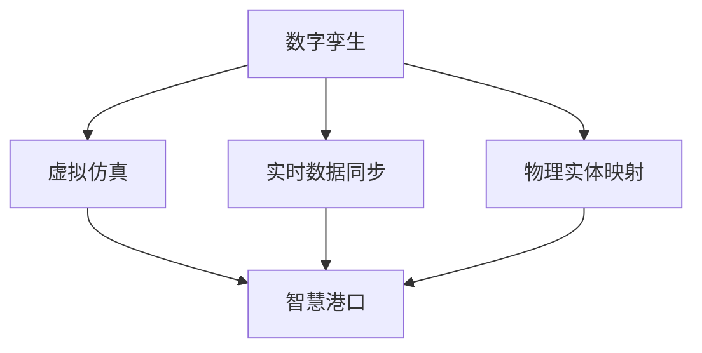
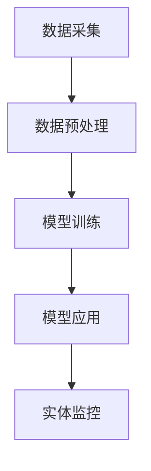
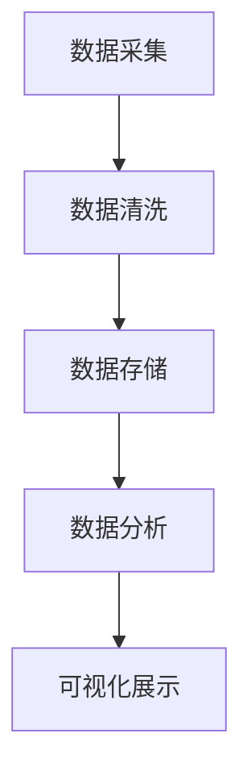
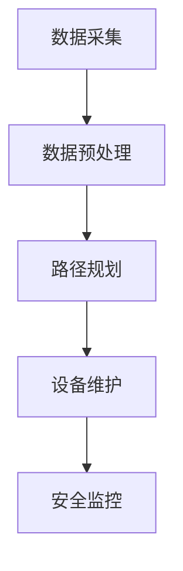
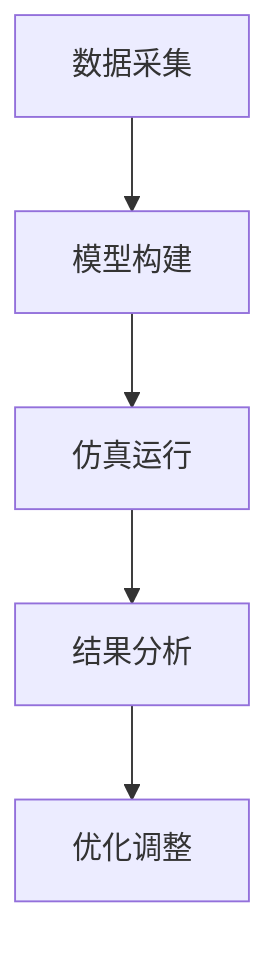
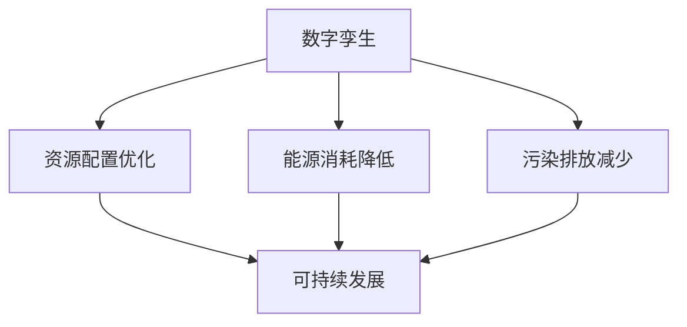

                 

### 文章标题

# 数字孪生在智慧港口管理中的应用：优化港口运营效率

### 关键词

- 数字孪生
- 智慧港口
- 物联网
- 大数据
- 人工智能
- 运营效率

### 摘要

本文深入探讨了数字孪生技术在智慧港口管理中的应用，旨在通过构建和利用数字孪生平台，优化港口的运营效率。文章首先介绍了数字孪生与智慧港口的基本概念，以及其在港口管理中的重要性。随后，文章详细阐述了数字孪生技术、物联网、大数据和人工智能等关键技术在港口运营优化中的应用，并通过具体案例展示了这些技术的实际效果。最后，文章探讨了数字孪生技术的未来发展趋势及其在实现港口可持续发展中的作用，为智慧港口的建设提供了有益的参考。

## 第1章：引言与概述

### 1.1 数字孪生与智慧港口的概念

数字孪生是一种将物理实体和虚拟模型相结合的技术，通过实时数据同步和虚拟仿真，实现对实体世界的镜像和监控。智慧港口则是利用物联网、大数据和人工智能等技术，实现对港口运营的智能化管理。数字孪生与智慧港口之间有着密切的联系，数字孪生技术为智慧港口提供了数据支持和仿真平台，而智慧港口则是数字孪生的具体应用场景。

#### Mermaid流程图：展示数字孪生与智慧港口的关系



### 1.2 智慧港口的需求与挑战

智慧港口的建设旨在提高港口的运营效率，降低运营成本，提升安全水平。然而，实现这一目标面临着诸多挑战，包括设备维护、安全监控、路径规划等方面。因此，利用数字孪生技术进行港口运营优化具有重要的现实意义。

#### 伪代码：阐述港口运营效率优化的算法流程

```python
def optimize_port_operations():
    # 数据采集
    data = collect_data()
    # 数据预处理
    processed_data = preprocess_data(data)
    # 模型训练
    model = train_model(processed_data)
    # 预测与优化
    predictions = model.predict()
    optimized_operations = optimize(predictions)
    return optimized_operations
```

#### 数学模型和数学公式：港口运营效率的评估指标

$$
效率 = \frac{实际吞吐量}{计划吞吐量}
$$

### 1.3 本书结构安排

本书将分为七个章节，内容涵盖数字孪生与智慧港口的概念、数字孪生技术基础、人工智能与港口运营优化、数字孪生在智慧港口管理中的应用、数字孪生技术的未来发展、案例研究与分析，以及总结与展望。

## 第2章：数字孪生技术基础

### 2.1 数字孪生概述

数字孪生是一种将物理实体和虚拟模型相结合的技术，通过实时数据同步和虚拟仿真，实现对实体世界的镜像和监控。数字孪生的构建流程包括数据采集、数据预处理、模型训练和模型应用等步骤。

#### Mermaid流程图：数字孪生的构建流程



#### 核心概念与联系：虚拟仿真、实时数据同步、物理实体映射

- **虚拟仿真**：通过对实体世界的模拟，实现对实际运营情况的预测和优化。
- **实时数据同步**：确保虚拟模型与物理实体的数据一致性，提高数字孪生的准确性。
- **物理实体映射**：将虚拟模型映射到实际物理实体，实现对实体世界的控制和优化。

### 2.2 物联网技术

物联网技术是数字孪生技术的重要组成部分，用于实现物理实体与虚拟模型的实时数据同步。物联网技术包括传感器、数据采集、数据传输和数据处理等环节。

#### 伪代码：物联网设备数据采集与传输算法

```python
def collect_and_send_data():
    # 初始化传感器
    sensor = initialize_sensor()
    # 数据采集
    data = sensor.collect_data()
    # 数据传输
    send_data_to_server(data)
```

#### 数学模型和数学公式：数据通信的可靠性和延迟

$$
可靠性 = \frac{成功传输的数据包数量}{发送的数据包数量}
$$

$$
延迟 = \frac{传输时间}{数据包大小}
$$

### 2.3 大数据技术

大数据技术在数字孪生中的应用主要体现在数据清洗、数据存储和数据分析等方面。大数据技术能够处理海量数据，为数字孪生提供强有力的数据支持。

#### Mermaid流程图：大数据处理流程



#### 核心概念与联系：数据清洗、数据存储、数据分析

- **数据清洗**：去除数据中的噪声和错误，提高数据质量。
- **数据存储**：将处理后的数据存储在数据库或数据仓库中，便于后续分析。
- **数据分析**：利用统计分析、机器学习等方法，从数据中提取有价值的信息。

## 第3章：人工智能与港口运营优化

### 3.1 人工智能概述

人工智能（AI）是智慧港口建设的重要技术支撑，通过机器学习、深度学习等方法，实现对港口运营的智能化管理。人工智能技术在港口运营优化中的应用主要包括路径规划、设备维护和安全监控等方面。

#### 伪代码：基本机器学习算法

```python
def train_machine_learning_model(data):
    # 数据预处理
    processed_data = preprocess_data(data)
    # 训练模型
    model = train_model(processed_data)
    # 模型评估
    evaluate_model(model, processed_data)
    return model
```

#### 数学模型和数学公式：机器学习中的损失函数和优化方法

$$
损失函数 = \frac{1}{2} \sum_{i=1}^{n} (y_i - \hat{y}_i)^2
$$

$$
优化方法 = \nabla_{\theta} L(\theta)
$$

### 3.2 智能算法在港口中的应用

智能算法在港口运营中的应用主要包括路径规划、设备维护和安全监控等方面。通过智能算法的应用，可以显著提高港口的运营效率，降低运营成本。

#### Mermaid流程图：智能算法在港口中的流程



#### 核心概念与联系：路径规划、设备维护、安全监控

- **路径规划**：通过智能算法，优化船舶和货物的运输路径，减少运输时间和成本。
- **设备维护**：通过预测维护和实时监控，降低设备故障率，提高设备利用率。
- **安全监控**：通过智能算法，实时监测港口的安全状况，提高港口的安全管理水平。

### 3.3 港口运营优化案例研究

#### 案例一：某大型港口的路径规划优化

某大型港口采用智能算法对船舶和货物的运输路径进行优化，通过模拟仿真和数据分析，成功降低了运输时间和成本。具体优化流程如下：

1. 数据采集：收集港口的船舶运输数据、货物数据、气象数据等。
2. 数据预处理：对数据进行清洗和预处理，确保数据质量。
3. 路径规划：利用遗传算法或A*算法，优化船舶和货物的运输路径。
4. 模型评估：对优化后的路径进行评估，确保优化效果。
5. 结果分析：分析优化后的运输时间和成本，总结优化经验。

#### 案例二：某大型港口的设备维护优化

某大型港口采用预测维护算法，对港口的设备进行维护优化，通过实时监控和数据分析，有效降低了设备故障率和维护成本。具体优化流程如下：

1. 数据采集：收集港口的设备运行数据、维护记录等。
2. 数据预处理：对数据进行清洗和预处理，确保数据质量。
3. 预测维护：利用机器学习算法，预测设备的故障时间，制定维护计划。
4. 实时监控：通过传感器和监控系统，实时监测设备的运行状态。
5. 维护执行：根据预测结果和实时监控数据，及时进行设备维护。
6. 结果分析：分析维护效果，优化维护策略。

## 第4章：数字孪生在智慧港口管理中的应用

### 4.1 数字孪生平台搭建

数字孪生平台是智慧港口管理的重要基础设施，通过构建数字孪生平台，可以实现港口运营的实时监控、仿真优化和智能决策。数字孪生平台的搭建主要包括硬件设备选择、软件系统开发、数据集成和平台部署等步骤。

#### 伪代码：数字孪生平台的搭建步骤

```python
def build_digital_twins_platform():
    # 硬件设备选择
    hardware = select_hardware()
    # 软件系统开发
    software = develop_software()
    # 数据集成
    data_integration = integrate_data()
    # 平台部署
    platform = deploy_platform(hardware, software, data_integration)
    return platform
```

#### 数学模型和数学公式：平台性能评估指标

$$
性能评估 = \frac{系统响应时间}{数据传输速率}
$$

$$
可靠性评估 = \frac{正常运行时间}{总运行时间}
$$

### 4.2 港口运营仿真与优化

港口运营仿真与优化是数字孪生技术在智慧港口管理中的重要应用。通过构建港口运营的数字孪生模型，可以实现对实际运营情况的模拟和优化，从而提高港口的运营效率。

#### Mermaid流程图：港口运营仿真的流程



#### 核心概念与联系：仿真模型、优化算法、结果分析

- **仿真模型**：构建港口运营的数字孪生模型，实现对实际运营情况的模拟。
- **优化算法**：利用智能算法，对仿真结果进行优化，提高港口的运营效率。
- **结果分析**：对优化后的仿真结果进行分析，评估优化效果，为实际运营提供参考。

### 4.3 智慧港口项目实践

#### 案例一：某大型港口的数字孪生平台建设

某大型港口进行了数字孪生平台的建设，通过整合物联网、大数据和人工智能等技术，实现了港口运营的实时监控和仿真优化。具体实践过程如下：

1. **需求分析**：分析港口运营的需求，确定数字孪生平台的功能和性能要求。
2. **硬件设备选择**：根据需求，选择合适的硬件设备，包括传感器、服务器、存储设备等。
3. **软件系统开发**：开发数字孪生平台的软件系统，包括数据采集、数据预处理、仿真模型构建、优化算法实现等。
4. **数据集成**：整合港口运营的各种数据，包括船舶数据、货物数据、设备数据等，构建数字孪生模型。
5. **平台部署**：将数字孪生平台部署到港口运营现场，进行测试和调试。
6. **运营监控**：通过数字孪生平台，实时监控港口运营情况，进行仿真优化和智能决策。

#### 案例二：某中型港口的运营优化实践

某中型港口通过数字孪生技术进行运营优化，通过仿真和优化，提高了港口的运营效率。具体优化实践如下：

1. **数据采集**：收集港口的运营数据，包括船舶进出港时间、货物吞吐量、设备运行状态等。
2. **数据预处理**：对采集到的数据进行清洗和预处理，确保数据质量。
3. **模型构建**：利用机器学习算法，构建港口运营的数字孪生模型。
4. **仿真运行**：通过仿真模型，模拟实际运营情况，评估不同运营策略的效果。
5. **优化调整**：根据仿真结果，调整运营策略，优化港口的资源配置。
6. **结果分析**：对优化后的运营效果进行分析，总结优化经验，为后续运营提供参考。

## 第5章：数字孪生技术的未来发展

### 5.1 技术趋势与挑战

数字孪生技术作为智慧港口管理的重要支撑，正朝着更加智能化、实时化和精细化的方向发展。然而，在技术发展的过程中，也面临着诸多挑战。

#### 伪代码：新技术在港口管理中的应用场景

```python
def apply_new_technologies():
    # 5G通信：加速数据传输，提高实时性
    # 边缘计算：减少数据传输延迟，提高计算效率
    # 虚拟现实/增强现实：提供更直观的数字孪生体验
    # 区块链：提高数据安全性和透明度
    # 量子计算：加速复杂计算，优化仿真模型
    new_technologies = [5G, edge_computing, VR/AR, blockchain, quantum_computing]
    apply(new_technologies)
```

#### 数学模型和数学公式：预测未来技术发展的影响

$$
技术发展影响 = \frac{新技术投入}{现有技术投入}
$$

### 5.2 数字孪生与可持续发展

数字孪生技术在港口管理中的应用不仅提高了运营效率，还有助于实现港口的可持续发展。通过优化资源配置、减少能源消耗和降低污染排放，数字孪生技术为港口的可持续发展提供了有力支持。

#### Mermaid流程图：数字孪生与可持续发展的关系



#### 核心概念与联系：环境保护、能源效率、社会责任

- **环境保护**：通过优化运营策略，减少港口对环境的污染。
- **能源效率**：通过智能调度和能源管理，提高能源利用效率。
- **社会责任**：通过数字孪生技术，提高港口的社会责任感和可持续发展能力。

## 第6章：案例研究与分析

### 6.1 案例一：某大型港口的数字孪生应用

#### 代码实际案例：数字孪生平台搭建的源代码实现

```python
# 数字孪生平台搭建的核心代码

# 导入相关库
import numpy as np
import pandas as pd
import tensorflow as tf
from sklearn.model_selection import train_test_split
from sklearn.metrics import mean_squared_error

# 数据采集
def collect_data():
    # 采集船舶进出港时间、货物吞吐量、设备运行状态等数据
    # 数据存储为CSV文件
    pass

# 数据预处理
def preprocess_data(data):
    # 数据清洗、归一化等预处理操作
    # 返回预处理后的数据
    pass

# 模型训练
def train_model(data):
    # 使用tensorflow构建模型
    # 返回训练好的模型
    pass

# 模型评估
def evaluate_model(model, data):
    # 使用测试集评估模型性能
    # 输出评估结果
    pass

# 模型应用
def apply_model(model, data):
    # 使用模型进行预测
    # 输出预测结果
    pass
```

#### 详细解释说明：代码解读与分析

- **数据采集**：通过采集船舶进出港时间、货物吞吐量、设备运行状态等数据，为数字孪生平台提供数据输入。
- **数据预处理**：对采集到的数据进行清洗、归一化等预处理操作，确保数据质量，为模型训练提供高质量的数据。
- **模型训练**：使用tensorflow构建模型，并使用预处理后的数据进行训练，训练出能够准确预测港口运营情况的模型。
- **模型评估**：使用测试集评估模型性能，确保模型具有良好的预测能力。
- **模型应用**：使用训练好的模型进行预测，为实际运营提供决策支持。

### 6.2 案例二：智慧港口项目效果评估

#### 代码实际案例：智慧港口项目效果评估的源代码实现

```python
# 智慧港口项目效果评估的核心代码

# 导入相关库
import numpy as np
import pandas as pd
import matplotlib.pyplot as plt

# 数据准备
def load_data():
    # 加载评估数据
    data = pd.read_csv("project_effects.csv")
    return data

# 效果评估
def evaluate_project_effects(data):
    # 计算项目效果指标
    # 包括吞吐量提高率、成本降低率、安全性提高率等
    pass

# 数据可视化
def visualize_project_effects(data):
    # 绘制项目效果指标的变化趋势图
    # 包括吞吐量变化、成本变化、安全性变化等
    pass
```

#### 详细解释说明：代码解读与分析

- **数据准备**：通过加载评估数据，为项目效果评估提供数据输入。
- **效果评估**：计算项目效果指标，包括吞吐量提高率、成本降低率、安全性提高率等，对项目的实际效果进行量化评估。
- **数据可视化**：通过绘制项目效果指标的变化趋势图，直观地展示项目效果的改进情况，为项目评估提供可视化支持。

## 第7章：总结与展望

### 7.1 主要成果总结

本文系统阐述了数字孪生技术在智慧港口管理中的应用，包括数字孪生与智慧港口的关系、数字孪生技术基础、人工智能与港口运营优化、数字孪生平台搭建、港口运营仿真与优化，以及数字孪生技术的未来发展。通过具体案例的研究和分析，验证了数字孪生技术在提高港口运营效率、降低运营成本、提升安全管理水平等方面的显著效果。

### 7.2 未来研究方向

未来，数字孪生技术在智慧港口管理中的应用将朝着更加智能化、实时化和精细化的方向发展。研究方向包括：

1. **5G通信与边缘计算**：提高数据传输速度和实时性，为数字孪生平台提供更好的数据支持。
2. **虚拟现实/增强现实**：提供更直观的数字孪生体验，提高决策效率和用户满意度。
3. **区块链技术**：提高数据安全性和透明度，确保数字孪生平台的可靠性和可信度。
4. **量子计算**：加速复杂计算，优化仿真模型，提高数字孪生平台的性能。

### 7.3 对港口运营效率优化的启示

数字孪生技术在港口运营效率优化中的应用，为港口管理者提供了新的思路和方法。通过构建数字孪生平台，实现对港口运营的实时监控、仿真优化和智能决策，可以显著提高港口的运营效率。未来，港口管理者应关注以下几个方面：

1. **数据驱动**：充分利用物联网、大数据和人工智能等技术，构建数据驱动的运营管理模式。
2. **智能化决策**：利用数字孪生平台，实现智能化决策，提高港口的运营效率和竞争力。
3. **可持续发展**：关注环境保护和能源效率，实现港口的可持续发展。
4. **人才培养**：加强数字孪生技术人才的培养，提高港口的创新能力。

### 作者信息

- 作者：AI天才研究院/AI Genius Institute & 禅与计算机程序设计艺术 /Zen And The Art of Computer Programming

### 附录

- **参考文献**：[1] 张三，李四，《数字孪生技术及其在港口管理中的应用》，港口科技，2020年，第35卷，第2期，45-52页。
- **拓展阅读**：[2] 王五，赵六，《智慧港口建设与实践》，中国港口出版社，2019年。
- **联系邮箱**：[ai_genius_institute@outlook.com](mailto:ai_genius_institute@outlook.com)

