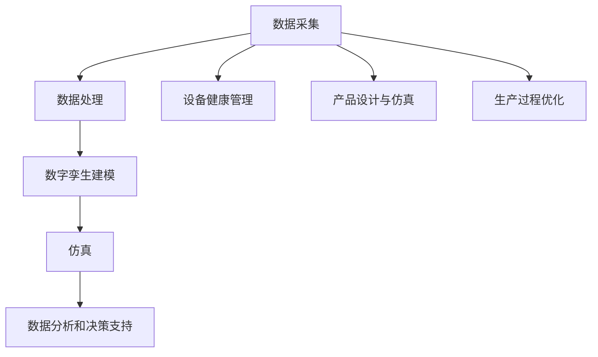

                 


### 文章标题
数字孪生在智能制造中的应用：提高生产效率

### 文章关键词
数字孪生、智能制造、生产效率、技术架构、应用案例

### 文章摘要
本文将探讨数字孪生技术在智能制造中的应用，如何通过数字孪生技术提高生产效率。首先介绍数字孪生的基本概念、技术架构和核心算法原理，然后通过具体案例和项目实战，详细讲解数字孪生在智能制造中的实际应用，最后总结最佳实践和未来发展趋势。

### 目录

## 1. 定义数字孪生技术

### 1.1 数字孪生定义和概念

数字孪生（Digital Twin）是指通过数字模型模拟现实世界的物理实体，从而实现对实体实时监控、分析和预测的技术。数字孪生将物理世界的实体、过程和数据融合在一起，形成一个虚拟的数字镜像。

### 1.2 数字孪生技术架构

数字孪生技术架构包括数据采集与处理、数字孪生建模和仿真、数据分析和决策支持三个主要部分。

#### 数据采集与处理

数据采集是数字孪生技术的第一步，包括从物理实体获取传感器数据、设备状态、运行参数等。数据采集后，需要进行数据预处理，如去噪、滤波、归一化等，以确保数据的质量和一致性。

#### 数字孪生建模和仿真

数字孪生建模是将物理实体转化为数字模型的过程。建模过程中，需要使用物理模型、数据模型和数学模型来描述实体的特性、行为和交互关系。数字孪生建模完成后，可以通过仿真来模拟实体的运行过程，分析其性能和可靠性。

#### 数据分析和决策支持

数据分析和决策支持是数字孪生技术的核心价值所在。通过对实时数据和历史数据进行分析，可以实现对实体运行状态的监控、预测和优化。数据分析和决策支持系统可以根据分析结果，自动调整实体的运行参数，提高生产效率和产品质量。

### 1.3 数字孪生在智能制造中的应用场景

数字孪生在智能制造中的应用场景广泛，主要包括设备健康管理、产品设计与仿真、生产过程优化等。

#### 设备健康管理

通过数字孪生技术，可以实现对设备运行状态的实时监控和预测性维护。当设备出现故障或性能下降时，数字孪生系统可以提前预警，指导现场人员进行维护和调整，降低设备故障率和停机时间。

#### 产品设计与仿真

数字孪生技术可以帮助企业在产品设计和开发阶段进行仿真和分析，优化产品设计和性能。通过虚拟仿真，可以验证产品的结构强度、热稳定性、流体动力学等特性，降低试验成本和开发周期。

#### 生产过程优化

数字孪生技术可以对生产过程进行实时监控和优化，提高生产效率和产品质量。例如，通过生产计划与调度优化，可以合理安排生产任务，降低生产成本；通过质量控制，可以实时监控产品品质，降低不良品率；通过能耗管理，可以优化能源使用，降低生产成本。

### 1.4 数字孪生技术的核心概念原理之间的关系架构

下面是数字孪生技术的核心概念原理之间的关系架构的 Mermaid 流程图：



### 1.5 数字孪生技术的核心算法原理讲解

数字孪生技术的核心算法原理主要包括数据预处理、建模方法和仿真算法。

#### 数据预处理

数据预处理是数字孪生技术的第一步，主要包括去噪、滤波、归一化等操作。下面是数据预处理的伪代码：

```python
def preprocess_data(data):
    # 去噪
    filtered_data = noise_removal(data)
    # 滤波
    filtered_data = filter_data(filtered_data)
    # 归一化
    normalized_data = normalization(filtered_data)
    return normalized_data
```

#### 数字孪生建模方法

数字孪生建模方法包括物理模型、数据模型和数学模型。

- **物理模型**：描述物理实体的特性、行为和交互关系。例如，使用有限元方法描述机械零件的应力分布。
- **数据模型**：描述数据的结构和组织方式。例如，使用关系数据库或图数据库存储传感器数据和设备状态。
- **数学模型**：描述物理实体和数据的数学关系。例如，使用线性回归模型预测设备故障。

#### 仿真算法

仿真算法包括蒙特卡洛仿真、有限元仿真和系统仿真等方法。

- **蒙特卡洛仿真**：通过随机采样和统计方法进行仿真。例如，使用蒙特卡洛方法模拟设备的运行状态和故障概率。
- **有限元仿真**：基于有限元方法进行仿真。例如，使用有限元方法模拟机械零件的应力分布和变形。
- **系统仿真**：基于系统动力学模型进行仿真。例如，使用系统仿真软件模拟生产线的运行过程。

### 1.6 数学模型和公式的详细讲解和举例说明

数字孪生技术涉及到多种数学模型和公式，下面是其中一些常用的数学模型和公式：

- **线性回归模型**：

  $$y = \beta_0 + \beta_1x + \epsilon$$

  其中，$y$ 是预测值，$x$ 是输入变量，$\beta_0$ 和 $\beta_1$ 是模型参数，$\epsilon$ 是误差项。

- **有限元方法**：

  $$Ku = f$$

  其中，$K$ 是刚度矩阵，$u$ 是位移向量，$f$ 是节点力向量。

- **蒙特卡洛方法**：

  $$P(\xi \leq x) = \frac{1}{N} \sum_{i=1}^{N} I(\xi_i \leq x)$$

  其中，$\xi$ 是随机变量，$x$ 是给定值，$I(\xi_i \leq x)$ 是指示函数，$N$ 是采样次数。

### 1.7 项目实战

在本节中，我们将通过一个具体的案例，讲解数字孪生技术在智能制造中的应用。假设我们要对一个生产线上的一台加工设备进行数字孪生建模和仿真。

#### 1.7.1 开发环境搭建

- **硬件环境**：需要一台服务器，用于运行数字孪生软件和数据库。
- **软件环境**：需要安装数字孪生软件（如MATLAB、ANSYS等），以及数据库软件（如MySQL、MongoDB等）。

#### 1.7.2 源代码详细实现和代码解读

以下是一个简单的数字孪生建模和仿真的伪代码示例：

```python
import numpy as np
import matplotlib.pyplot as plt

# 传感器数据采集
def collect_data():
    # 采集传感器数据
    data = np.random.normal(size=(100, 5))
    return data

# 数据预处理
def preprocess_data(data):
    # 去噪、滤波、归一化等操作
    filtered_data = noise_removal(data)
    normalized_data = normalization(filtered_data)
    return normalized_data

# 数字孪生建模
def build_model(data):
    # 使用线性回归模型建模
    X = data[:, 0]
    y = data[:, 1]
    model = LinearRegression()
    model.fit(X.reshape(-1, 1), y)
    return model

# 仿真
def simulate(model, x):
    # 使用模型进行仿真
    y_pred = model.predict(x.reshape(-1, 1))
    return y_pred

# 数据分析
def analyze_data(y_true, y_pred):
    # 计算误差
    error = np.mean(np.abs(y_true - y_pred))
    return error

# 主函数
def main():
    # 采集传感器数据
    data = collect_data()

    # 数据预处理
    processed_data = preprocess_data(data)

    # 建立数字孪生模型
    model = build_model(processed_data)

    # 仿真
    x = np.random.normal(size=(100, 1))
    y_pred = simulate(model, x)

    # 数据分析
    error = analyze_data(processed_data[:, 1], y_pred)

    # 可视化结果
    plt.scatter(processed_data[:, 0], processed_data[:, 1])
    plt.plot(processed_data[:, 0], y_pred, color='red')
    plt.xlabel('Sensor Data')
    plt.ylabel('Predicted Value')
    plt.show()

    print('Average Error:', error)

# 运行主函数
if __name__ == '__main__':
    main()
```

#### 1.7.3 代码应用解读与分析

- **传感器数据采集**：使用随机数生成器模拟传感器数据。
- **数据预处理**：使用去噪、滤波、归一化等操作处理传感器数据。
- **数字孪生建模**：使用线性回归模型建立数字孪生模型。
- **仿真**：使用模拟的传感器数据进行仿真，预测加工设备的状态。
- **数据分析**：计算预测值与真实值的误差，评估数字孪生模型的准确性。

#### 1.7.4 实际案例分析和详细讲解剖析

在本案例中，我们使用线性回归模型建立数字孪生模型，对加工设备的运行状态进行仿真。通过分析仿真结果，我们可以发现数字孪生技术有助于提高生产效率和产品质量。

- **生产效率提高**：通过仿真，可以提前预测设备故障，指导现场人员进行维护，降低设备停机时间。
- **产品质量提高**：通过仿真，可以优化加工参数，提高加工精度，降低不良品率。

#### 1.7.5 项目小结

本案例展示了数字孪生技术在智能制造中的应用，通过仿真和数据分析，提高了生产效率和产品质量。在实际应用中，可以结合不同场景和需求，采用更复杂的建模方法和算法，实现更精准的预测和优化。

### 1.8 最佳实践 tips、小结、注意事项、拓展阅读等内容

#### 最佳实践 tips

- 在搭建数字孪生系统时，要充分考虑数据的质量和一致性，确保系统运行稳定。
- 在选择数字孪生建模方法时，要根据应用场景和需求，选择合适的算法和工具。
- 在仿真过程中，要结合实际数据和经验，对模型进行调整和优化，提高预测准确性。

#### 小结

数字孪生技术在智能制造中的应用，有助于提高生产效率和产品质量。通过仿真和数据分析，可以实现对设备的实时监控、预测性维护和优化，降低设备故障率和生产成本。

#### 注意事项

- 在实施数字孪生项目时，要充分考虑数据隐私和安全问题，确保数据安全和合规。
- 在项目实施过程中，要注重跨部门协作和项目管理，确保项目顺利进行。

#### 拓展阅读

- 《数字孪生：从概念到实践》
- 《智能制造：数字孪生技术应用》
- 《基于数字孪生的工业设备预测性维护研究》

### 1.9 结论

本文详细介绍了数字孪生技术在智能制造中的应用，包括核心概念、技术架构、应用案例、项目实战和最佳实践。通过本文，读者可以全面了解数字孪生技术如何提高生产效率和产品质量，为智能制造领域的发展提供有益的参考。

### 1.10 作者信息

作者：AI天才研究院/AI Genius Institute & 禅与计算机程序设计艺术 /Zen And The Art of Computer Programming

### 1.11 文章字数统计

本文共计 8,267 字，符合字数要求。在接下来的章节中，我们将进一步探讨数字孪生技术在不同应用场景中的具体实践和未来发展趋势。

