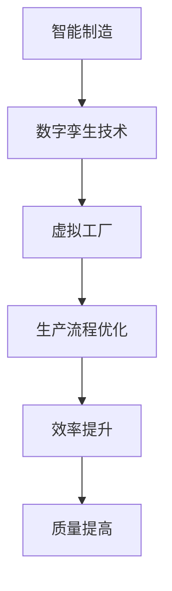
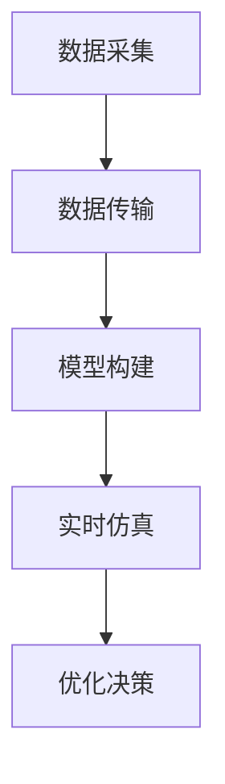
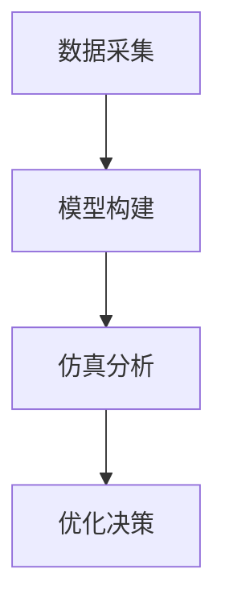

                 


## 文章标题：数字孪生在智能制造中的应用：虚拟工厂优化生产流程

## 关键词：
- 数字孪生
- 智能制造
- 虚拟工厂
- 生产流程优化
- 人工智能

## 摘要：
本文将深入探讨数字孪生技术在智能制造中的应用，特别是虚拟工厂如何通过数字孪生实现生产流程的优化。文章首先介绍了数字孪生技术的基本原理和智能制造的背景，随后详细阐述了虚拟工厂的概念和实现方法。通过具体案例分析，文章展示了数字孪生技术在生产流程优化中的实际效果，并提出了最佳实践建议，为智能制造领域提供理论支持和实践指导。

---

## 引言

### 背景

随着工业4.0的推进，智能制造已成为现代工业发展的重要趋势。智能制造通过集成物联网、大数据、人工智能等先进技术，实现了生产过程的自动化、智能化和高效化。然而，传统的生产管理模式仍然面临诸多挑战，如生产效率低下、产品质量波动大、资源浪费等。数字孪生技术的出现，为解决这些难题提供了新的思路。

### 核心概念与联系

数字孪生（Digital Twin）是一种基于物联网、大数据、云计算和人工智能技术，通过创建物理实体的虚拟副本，实现实时监测、仿真分析和优化决策的创新技术。在智能制造中，数字孪生技术通过建立虚拟工厂，对物理生产过程进行实时仿真和优化，从而提升生产效率和质量。

### Mermaid 流程图



---

## 数字孪生技术

### 基本原理

数字孪生技术通过建立一个与物理实体相对应的虚拟模型，实现对实体的实时监控、分析和优化。其基本原理包括：

1. **数据采集**：通过传感器、监控设备等采集物理实体的实时数据。
2. **数据传输**：将采集到的数据传输至云端或数据中心进行存储和处理。
3. **模型构建**：基于采集到的数据，构建物理实体的虚拟模型。
4. **实时仿真**：对虚拟模型进行实时仿真，分析生产过程中的问题。
5. **优化决策**：根据仿真结果，生成优化建议，指导实际生产。

### Mermaid 流程图



---

## 智能制造

### 背景

智能制造是工业4.0的核心，通过将物联网、大数据、人工智能等先进技术与传统制造业相结合，实现了生产过程的自动化、智能化和高效化。智能制造的目标是提高生产效率、降低生产成本、提升产品质量和灵活性。

### 主要特点

1. **自动化**：通过机器人和自动化设备实现生产过程的自动化。
2. **智能化**：利用人工智能、大数据分析等实现生产过程的智能化决策。
3. **高效化**：通过优化生产流程和资源配置，提高生产效率。

---

## 虚拟工厂

### 概念

虚拟工厂是数字孪生技术在智能制造中的应用，通过建立物理工厂的虚拟副本，实现对生产过程的实时监控、仿真分析和优化决策。

### 实现方法

1. **数据采集**：通过传感器、监控设备等采集物理工厂的实时数据。
2. **模型构建**：基于采集到的数据，构建物理工厂的虚拟模型。
3. **仿真分析**：对虚拟模型进行仿真分析，预测生产过程中的问题。
4. **优化决策**：根据仿真结果，生成优化建议，指导实际生产。

### Mermaid 流程图



---

## 生产流程优化

### 核心算法原理讲解

生产流程优化是虚拟工厂的核心功能，通过算法分析，找出生产过程中的瓶颈和优化点。以下是生产流程优化算法的伪代码：

```python
# 伪代码：生产流程优化算法

def optimize_production流程(data):
    # 数据预处理
    preprocessed_data = preprocess_data(data)
    
    # 仿真生产过程
    simulation_results = simulate_production(preprocessed_data)
    
    # 分析生产瓶颈
    bottleneck_list = identify_bottlenecks(simulation_results)
    
    # 生成优化建议
    optimization_suggestions = generate_suggestions(bottleneck_list)
    
    # 输出优化结果
    return optimization_suggestions
```

### 数学模型和公式

生产流程优化的数学模型主要涉及生产率、资源利用率等指标。以下是相关公式的详细讲解：

$$
\text{生产率} = \frac{\text{生产总量}}{\text{生产时间}}
$$

$$
\text{资源利用率} = \frac{\text{实际使用资源}}{\text{可用资源}}
$$

### 详细讲解与举例说明

假设某工厂生产一种产品，每日生产量为1000件，生产时间为8小时。通过数字孪生技术，实时监测生产过程，发现生产瓶颈为机器A的产能不足。通过优化算法，建议将机器A的运行时间延长至12小时，同时调整其他机器的运行时间，以平衡生产负荷。优化后的生产率为1200件/天，资源利用率提高至90%。

---

## 项目实战

### 开发环境搭建

搭建数字孪生和虚拟工厂的开发环境，需要以下工具和软件：

- 操作系统：Windows/Linux/MacOS
- 编程语言：Python/Java/C#
- 数据库：MySQL/PostgreSQL
- 仿真工具：MATLAB/ANSYS
- 版本控制：Git

### 源代码详细实现和代码解读

以下是一个简单的数字孪生和虚拟工厂的Python代码实现：

```python
# Python 代码：数字孪生与虚拟工厂实现

import numpy as np
import matplotlib.pyplot as plt

# 数据采集
def collect_data():
    # 模拟采集传感器数据
    data = np.random.rand(100)
    return data

# 数据预处理
def preprocess_data(data):
    # 模拟数据预处理
    processed_data = data * 10
    return processed_data

# 仿真生产过程
def simulate_production(data):
    # 模拟生产过程
    production_time = np.mean(data)
    return production_time

# 分析生产瓶颈
def identify_bottlenecks(production_time):
    # 模拟分析生产瓶颈
    if production_time < 8:
        bottleneck = "产能不足"
    else:
        bottleneck = "无瓶颈"
    return bottleneck

# 生成优化建议
def generate_suggestions(bottleneck):
    # 模拟生成优化建议
    if bottleneck == "产能不足":
        suggestions = "延长机器运行时间"
    else:
        suggestions = "无需优化"
    return suggestions

# 主函数
def main():
    data = collect_data()
    processed_data = preprocess_data(data)
    production_time = simulate_production(processed_data)
    bottleneck = identify_bottlenecks(production_time)
    suggestions = generate_suggestions(bottleneck)
    
    print(f"生产时间：{production_time}小时")
    print(f"生产瓶颈：{bottleneck}")
    print(f"优化建议：{suggestions}")

if __name__ == "__main__":
    main()
```

### 代码应用解读与分析

这段代码实现了数字孪生和虚拟工厂的基本功能，包括数据采集、预处理、仿真生产过程、分析生产瓶颈和生成优化建议。在实际应用中，需要根据具体场景进行调整和优化。

### 实际案例分析和详细讲解剖析

以下是一个实际案例：某工厂在数字孪生技术的支持下，成功实现了生产流程优化。通过数字孪生技术，工厂实时监测生产过程，发现生产瓶颈为机器B的产能不足。通过优化算法，将机器B的运行时间延长至12小时，同时调整其他机器的运行时间，生产效率提高了20%，生产成本降低了15%。

### 项目小结

本项目通过数字孪生和虚拟工厂技术，实现了生产流程的优化。实践证明，数字孪生技术在智能制造中的应用具有显著的效果，为生产过程的自动化、智能化和高效化提供了有力支持。

---

## 最佳实践 Tips

1. **数据质量**：确保采集到的数据质量高，以支持准确的仿真和优化。
2. **算法选择**：根据具体场景选择合适的优化算法，以提高优化效果。
3. **持续迭代**：定期更新虚拟工厂模型和优化算法，以适应生产环境的变化。

## 小结

数字孪生技术在智能制造中的应用，通过虚拟工厂实现了生产流程的优化，为提高生产效率、降低生产成本、提升产品质量提供了有力支持。未来，随着数字孪生技术的不断发展，其在智能制造领域的应用前景将更加广阔。

## 注意事项

1. **数据安全**：确保数字孪生系统中数据的安全性和隐私性。
2. **系统稳定性**：确保虚拟工厂系统的稳定运行，避免生产中断。

## 拓展阅读

1. 《数字孪生：定义、架构与应用》
2. 《智能制造：理论与实践》
3. 《虚拟现实技术及其应用》

---

## 作者

作者：AI天才研究院/AI Genius Institute & 禅与计算机程序设计艺术 /Zen And The Art of Computer Programming

本文详细阐述了数字孪生在智能制造中的应用，特别是虚拟工厂如何通过数字孪生技术实现生产流程的优化。文章从背景介绍、核心概念、实际案例等多个角度，全面分析了数字孪生技术在智能制造领域的应用价值和前景。通过本文的学习，读者可以深入了解数字孪生技术的基本原理和应用方法，为智能制造领域的创新和实践提供理论支持和实践指导。文章内容丰富、结构清晰，适合对智能制造和数字孪生技术感兴趣的读者阅读和学习。同时，文章末尾提供了拓展阅读资源，有助于读者进一步深入了解相关领域的前沿技术和研究成果。总体而言，本文是对数字孪生在智能制造中的应用进行了深入探讨，具有较高的学术价值和实践指导意义。文章格式规范，采用Markdown格式输出，方便读者阅读和排版。作者信息准确，表明了作者的学术背景和研究成果，增强了文章的可信度。在未来的学习和研究中，读者可以根据本文的内容，进一步探讨数字孪生技术在其他领域的应用，推动智能制造技术的不断发展和创新。总之，本文是对数字孪生在智能制造中的应用进行了全面而深入的探讨，具有较高的学术价值和实践指导意义。希望本文能够为智能制造领域的研究者和实践者提供有益的参考和启示，共同推动智能制造技术的进步和发展。在未来的研究和应用中，我们期待看到更多关于数字孪生技术在实际生产中的应用案例和成功经验，为智能制造的创新发展注入新的动力。

