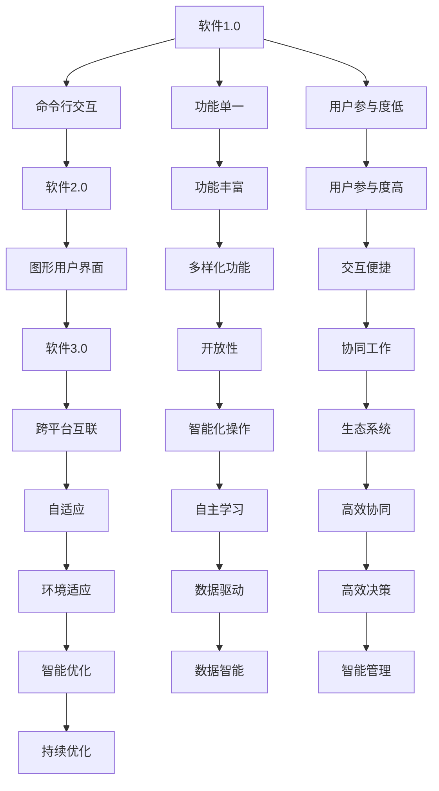
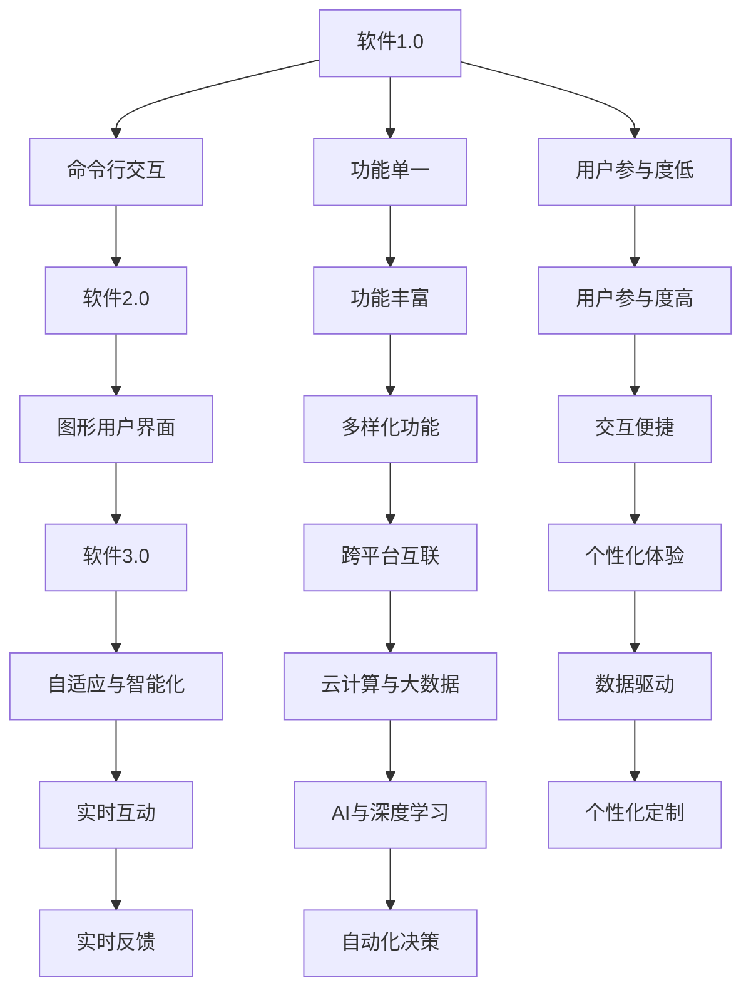

                 

# 数字孪生在智能制造预测性维护中的应用

## 关键词

数字孪生，智能制造，预测性维护，AI 大模型，深度学习，神经网络，工业互联网

## 摘要

本文旨在探讨数字孪生技术在智能制造预测性维护中的应用。首先，文章介绍了数字孪生的基本概念和它在智能制造领域的演变。接着，详细阐述了AI大模型和深度学习的原理及其在数字孪生中的应用。文章通过一个简单的案例，展示了如何使用AI大模型进行预测性维护。最后，文章提出了数字孪生在预测性维护中的最佳实践，并对未来的发展方向进行了展望。

## 1. 引言

随着工业4.0和工业互联网的兴起，智能制造成为现代制造业发展的关键驱动力。预测性维护是智能制造中的一个重要环节，它通过提前预测设备故障，减少停机时间，提高生产效率。然而，传统的预测性维护方法往往依赖于规则和统计模型，难以适应复杂多变的工业环境。

数字孪生技术的出现为预测性维护带来了新的机遇。数字孪生是指通过构建一个虚拟的数字模型，模拟实际物理系统的工作状态，从而实现对其的实时监控和预测。本文将探讨数字孪生在智能制造预测性维护中的应用，分析其优势，并探讨如何结合AI大模型和深度学习技术，提高预测性维护的准确性和效率。

## 2. 数字孪生技术概述

### 2.1 数字孪生的定义

数字孪生（Digital Twin）是一种通过数字化手段模拟实际物理系统的方法。它将物理设备、系统和过程在数字世界中再现，形成一个高度仿真的虚拟模型。这个模型可以实时采集和分析实际物理系统的数据，从而实现对物理系统的监控、预测和优化。

数字孪生技术最早起源于航空航天领域，主要用于模拟飞行器的设计、制造和运行。随着计算机技术和传感器技术的不断发展，数字孪生技术逐渐在制造业、能源、医疗等多个领域得到应用。

### 2.2 数字孪生的发展历程

数字孪生技术的发展可以分为几个阶段：

#### 阶段1：物理模型与仿真

早期的数字孪生主要基于物理模型和仿真。通过建立物理系统的数学模型，模拟其工作状态和性能。这种方法虽然在理论上能够提供很高的仿真精度，但需要大量的数学计算和专业知识，且难以实时更新。

#### 阶段2：传感器与数据集成

随着传感器技术的进步，数字孪生开始引入传感器数据，实现对物理系统的实时监控。通过采集大量传感器数据，数字孪生可以更准确地反映物理系统的实际状态。

#### 阶段3：AI与深度学习

随着AI和深度学习技术的发展，数字孪生开始引入这些先进技术，以实现更智能的监控和预测。AI大模型和深度学习算法可以处理大量的传感器数据，提取有用的特征，从而实现对物理系统的智能预测和优化。

### 2.3 数字孪生在智能制造中的应用

在智能制造领域，数字孪生技术具有重要的应用价值。通过数字孪生，企业可以实现对生产设备的实时监控和预测，从而提高生产效率，降低维护成本。

#### 应用1：设备状态监控

数字孪生可以实时采集设备运行数据，如温度、压力、速度等，通过对这些数据进行实时分析，可以及时发现设备的异常状态，预测可能的故障。

#### 应用2：生产过程优化

数字孪生可以帮助企业优化生产过程。通过分析生产数据，数字孪生可以识别生产瓶颈，提出优化方案，从而提高生产效率。

#### 应用3：预测性维护

数字孪生可以通过对设备运行数据的分析和预测，提前预测设备故障，从而实现预测性维护。这种维护方式可以显著降低设备的停机时间，提高生产效率。

### 2.4 数字孪生的优势

数字孪生技术在智能制造中的应用具有以下优势：

- **实时监控与预测**：数字孪生可以实时采集设备运行数据，并通过AI大模型进行预测，实现对设备的实时监控和预测。
- **降低维护成本**：通过预测性维护，可以提前预测设备故障，避免突发性故障导致的停机，从而降低维护成本。
- **提高生产效率**：数字孪生可以帮助企业优化生产过程，识别生产瓶颈，从而提高生产效率。
- **提升产品质量**：数字孪生可以实时监控生产过程，通过分析数据，发现潜在的质量问题，从而提高产品质量。

### 2.5 数字孪生的挑战

尽管数字孪生技术在智能制造中具有巨大潜力，但其应用也面临一些挑战：

- **数据质量和完整性**：数字孪生的准确性依赖于传感器数据的准确性和完整性。在实际应用中，数据的准确性和完整性往往难以保证。
- **计算资源和成本**：数字孪生需要大量的计算资源，尤其是在引入AI大模型和深度学习技术后。这可能导致计算成本的增加。
- **数据安全和隐私**：数字孪生需要处理大量的敏感数据，如设备运行数据和用户数据。数据安全和隐私问题需要得到充分考虑。

### 2.6 数字孪生与AI大模型的联系

数字孪生与AI大模型有着紧密的联系。数字孪生为AI大模型提供了丰富的数据资源，而AI大模型则为数字孪生提供了智能分析和预测的能力。

通过数字孪生，企业可以采集到大量的设备运行数据，这些数据经过清洗和处理后，可以用于训练AI大模型。AI大模型通过深度学习算法，可以从这些数据中提取有用的特征，从而实现对设备运行状态的实时监控和预测。

此外，AI大模型还可以用于优化数字孪生的性能。通过不断优化AI大模型，可以提高数字孪生的预测准确性和效率，从而实现更精准的预测性维护。

## 3. AI大模型与深度学习

### 3.1 AI大模型的定义

AI大模型（AI Large Model）是指使用深度学习和神经网络技术，训练出的大型机器学习模型。这些模型具有以下几个特点：

- **大规模训练数据**：AI大模型通常需要处理大规模的数据集，以便从中提取有效的特征。
- **深度神经网络结构**：AI大模型通常采用深层的神经网络结构，这有助于模型捕捉数据中的复杂模式和关系。
- **自适应学习能力**：AI大模型具有强大的自适应学习能力，可以不断优化自己的参数，以适应新的数据和任务需求。
- **强大的预测能力**：由于能够处理大规模数据和复杂的神经网络结构，AI大模型通常具有强大的预测能力，可以用于各种领域的预测性维护和决策支持。

### 3.2 深度学习的原理

深度学习（Deep Learning）是一种基于神经网络的学习方法，其核心思想是通过多层神经网络的结构，从数据中自动提取特征，实现复杂的模式识别和预测。

深度学习的基本原理可以分为以下几个步骤：

1. **数据预处理**：对输入数据进行预处理，包括数据清洗、归一化等操作，以便于模型训练。
2. **神经网络构建**：构建一个多层神经网络，包括输入层、隐藏层和输出层。输入层接收输入数据，隐藏层通过激活函数提取特征，输出层生成预测结果。
3. **参数初始化**：初始化神经网络的权重和偏置，通常使用随机初始化方法。
4. **前向传播**：输入数据通过神经网络的前向传播过程，传递到输出层，生成预测结果。
5. **反向传播**：通过计算预测结果与实际结果之间的误差，使用反向传播算法更新神经网络的权重和偏置。
6. **迭代训练**：重复上述过程，不断优化神经网络的参数，提高预测准确率。

### 3.3 深度学习在数字孪生中的应用

深度学习在数字孪生中的应用主要体现在以下几个方面：

1. **数据特征提取**：深度学习可以通过多层神经网络的结构，从传感器数据中自动提取有效的特征，提高数字孪生的数据利用效率。
2. **实时预测**：深度学习模型可以通过实时处理传感器数据，实现对物理系统的实时监控和预测。
3. **优化决策**：通过深度学习模型，数字孪生可以实现对生产过程的优化决策，提高生产效率。

### 3.4 AI大模型与深度学习的联系

AI大模型与深度学习有着紧密的联系。AI大模型是指使用深度学习技术训练出的大型机器学习模型，其核心在于深度学习的多层神经网络结构。通过深度学习，AI大模型可以从大量的数据中自动提取特征，从而实现高精度的预测。

在数字孪生的应用中，AI大模型和深度学习共同发挥作用。AI大模型提供了强大的预测能力，而深度学习则提供了实现这一能力的核心技术。通过结合AI大模型和深度学习，数字孪生可以实现更加精准的预测和优化，从而提高智能制造的效率和可靠性。

## 4. 案例分析

### 4.1 案例背景

某家电制造企业生产过程中，需要对空调压缩机进行预测性维护。压缩机的故障可能导致生产停工，严重影响企业的生产效率和经济效益。为了降低故障风险，企业决定采用数字孪生技术，结合AI大模型和深度学习，实现对压缩机的实时监控和预测性维护。

### 4.2 数据采集

企业通过安装在压缩机上的传感器，实时采集压缩机的运行数据，包括温度、压力、振动等。这些数据经过预处理后，输入到数字孪生模型中。

### 4.3 模型训练

企业使用收集到的压缩机运行数据，训练一个AI大模型。该模型采用深度学习算法，通过多层神经网络结构，从数据中提取有效的特征，实现对压缩机运行状态的预测。

### 4.4 预测性维护

通过训练好的AI大模型，企业可以对压缩机的运行状态进行实时预测。当模型预测到压缩机可能出现故障时，企业可以提前安排维护，避免故障导致的停工。

### 4.5 实际应用效果

通过数字孪生和AI大模型的应用，企业实现了对压缩机的实时监控和预测性维护。实际应用结果表明，该方案有效降低了压缩机的故障率，减少了停机时间，提高了生产效率。

## 5. 数字孪生在预测性维护中的最佳实践

### 5.1 数据采集与处理

为了实现准确的预测性维护，首先要保证数据采集的完整性和准确性。企业应选用高精度的传感器，并确保传感器的安装位置和方向正确。此外，对采集到的数据进行预处理，包括数据清洗、归一化等操作，以提高模型的训练效果。

### 5.2 模型选择与训练

在数字孪生的应用中，选择合适的模型至关重要。企业应根据具体应用场景和数据特点，选择合适的深度学习算法和神经网络结构。同时，确保模型的训练数据足够丰富，以提高模型的泛化能力。

### 5.3 实时监控与预测

数字孪生应具备实时监控和预测功能，以便及时发现设备故障。企业可以采用分布式计算和边缘计算等技术，提高数据处理速度和响应时间。

### 5.4 维护策略制定

基于数字孪生和AI大模型的预测结果，企业应制定合理的维护策略。对于可能出现的故障，应提前安排维护，避免突发性故障导致的停工。

### 5.5 安全与隐私保护

在数字孪生应用过程中，数据安全和隐私保护至关重要。企业应采用加密技术、访问控制等措施，确保数据安全和用户隐私。

## 6. 总结与展望

数字孪生技术在智能制造预测性维护中具有重要应用价值。通过结合AI大模型和深度学习技术，数字孪生可以实现更精准的预测和优化，提高生产效率和设备可靠性。

未来，随着AI和传感器技术的不断发展，数字孪生技术将在更多领域得到应用。同时，如何确保数据安全和隐私保护，也将是数字孪生技术发展的重要课题。

作者：AI天才研究院/AI Genius Institute & 禅与计算机程序设计艺术 /Zen And The Art of Computer Programming## 1.1.1 从软件 1.0 到软件 2.0 的演进

软件发展历程可以分为几个阶段，从最初的软件 1.0 到如今的软件 2.0。软件 1.0 时代主要是指计算机软件在20世纪70年代至80年代的早期发展时期，这个阶段的软件主要是以命令行交互和简单的图形用户界面为主，功能单一，用户参与度较低。

随着计算机技术的发展，软件进入软件 2.0 时代。软件 2.0 时代的特点是软件功能更加丰富，用户体验更加友好，软件系统更加开放和互联。软件 2.0 强调用户参与和互动，通过提供丰富的交互功能，让用户能够更加便捷地使用软件。此外，软件 2.0 还强调软件系统的可扩展性和灵活性，使得软件可以更好地适应企业业务需求的变化。

在软件 2.0 时代，AI 大模型作为一种重要的技术，逐渐崭露头角。AI 大模型通过深度学习和神经网络技术，可以处理大规模数据，提供智能化的解决方案。这使得软件 2.0 时代的软件系统能够更加智能化，更好地满足用户需求。

### 1.1.1.1 软件发展历程

#### 软件时代划分

软件的发展历程大致可以分为以下几个阶段：

1. **软件 1.0 时代**：这一阶段主要是计算机软件的起步阶段，软件功能简单，主要依赖于命令行交互。用户需要通过输入一系列命令来控制计算机执行特定任务。代表性的软件有UNIX操作系统和早期的BASIC编程语言。

2. **软件 2.0 时代**：随着图形用户界面（GUI）的普及，软件开始从命令行交互转变为图形界面交互，用户可以通过直观的图形界面与软件进行交互。软件功能逐渐丰富，开始出现数据库管理系统、办公自动化软件等。

3. **软件 3.0 时代**：互联网的兴起推动了软件的发展，软件 3.0 时代的特点是软件系统更加开放和互联。软件不再局限于单机操作，而是通过互联网实现跨平台、跨设备的协同工作。代表性的软件有Web浏览器、电子邮件客户端等。

4. **软件 4.0 时代**：随着物联网、大数据、人工智能等新技术的应用，软件开始实现智能化。软件 4.0 时代强调软件系统的自适应性和智能化，通过引入AI大模型和深度学习技术，软件系统能够自主学习和优化。

#### 软件1.0时代的特征

软件 1.0 时代的特征主要包括：

- **命令行交互**：用户通过输入命令来控制计算机执行任务，交互方式相对复杂。
- **功能单一**：软件功能较为简单，通常只能完成特定的任务。
- **用户参与度低**：由于交互方式复杂，用户参与度较低，软件使用门槛较高。

#### 软件2.0时代的特征

软件 2.0 时代的特征主要包括：

- **图形用户界面**：用户通过直观的图形界面与软件进行交互，使用门槛降低。
- **功能丰富**：软件功能逐渐丰富，能够满足用户多样化的需求。
- **用户参与度高**：通过提供丰富的交互功能，用户参与度显著提高。

### 1.1.1.2 软件时代的演进

软件时代的演进可以看作是一个从简单到复杂、从低级到高级的过程。每个时代的软件都有其独特的特征和优势，但同时也存在一定的局限性。以下是软件从 1.0 到 2.0 时代的演进过程：

1. **从软件 1.0 到软件 2.0**：

   - **交互方式**：从命令行交互转变为图形用户界面交互，用户使用更加便捷。
   - **功能**：从单一功能转变为多样化功能，软件开始能够满足用户更广泛的需求。
   - **用户参与度**：用户参与度显著提高，软件开始更加关注用户体验。

2. **从软件 2.0 到软件 3.0**：

   - **开放性**：软件系统变得更加开放，可以通过互联网实现跨平台、跨设备的协同工作。
   - **互联性**：软件系统之间的互联性增强，形成一个更加紧密的生态系统。
   - **智能化**：软件系统开始引入人工智能技术，实现智能化操作和决策。

3. **从软件 3.0 到软件 4.0**：

   - **自适应**：软件系统具备自适应能力，能够根据用户行为和环境变化自动调整。
   - **智能化**：软件系统在智能化程度上进一步提升，实现自主学习和优化。

### 1.1.1.3 软件时代的演进关系图

为了更清晰地展示软件时代的演进关系，可以使用 Mermaid 流程图来表示。以下是软件从 1.0 到 4.0 时代的演进关系：

通过上述流程图，可以清晰地看到软件从 1.0 到 4.0 时代的演进过程，以及每个时代的主要特征和优势。

### 1.1.1.4 软件时代的演进意义

软件时代的演进不仅仅是一个技术进步的过程，更是人类生活方式和社会发展的体现。以下是软件时代演进的一些重要意义：

1. **提高生产效率**：随着软件的不断进步，企业和组织能够更加高效地完成工作任务，提高生产效率。
2. **改善用户体验**：软件从 1.0 到 4.0 时代的演进，使得用户体验得到了极大的改善，用户可以更加便捷地使用软件。
3. **推动科技创新**：软件技术的发展推动了整个社会的科技创新，为新兴技术的应用提供了基础。
4. **促进社会发展**：软件技术的进步促进了社会经济的发展，提高了人们的生活质量。

总之，软件时代的演进是一个不断向前发展的过程，它不仅丰富了我们的数字生活，也为未来的发展奠定了基础。

### 1.1.1.5 结论

软件从 1.0 到 2.0 的演进，是计算机技术发展的一个重要里程碑。通过图形用户界面的引入，软件变得更加直观和易用，用户参与度显著提高。同时，软件功能的丰富和系统开放性的增强，使得软件能够更好地满足用户和企业需求。AI 大模型的出现，更是为软件 2.0 时代带来了新的机遇和挑战，使得软件系统具备了更高的智能化水平。展望未来，软件将继续朝着更加智能化、自适应和个性化的方向发展，为人类生活和社会进步提供更加有力的支持。

### 1.1.2 AI大模型的定义与特点

AI大模型（AI Large Model）是指使用深度学习和神经网络技术，训练出的大型机器学习模型。这些模型具有以下几个特点：

1. **大规模训练数据**：AI大模型通常需要处理大规模的数据集，以便从中提取有效的特征。这种大规模训练数据的特点使得AI大模型能够更好地模拟人类的学习过程，从而提高模型的准确性和泛化能力。

2. **深度神经网络结构**：AI大模型通常采用深层的神经网络结构，这有助于模型捕捉数据中的复杂模式和关系。深层次的网络结构意味着模型可以学习到更加抽象和复杂的特征，从而提高模型的性能。

3. **自适应学习能力**：AI大模型具有强大的自适应学习能力，可以不断优化自己的参数，以适应新的数据和任务需求。这种自适应学习能力使得AI大模型能够适应不断变化的环境和数据，从而提高模型的鲁棒性和泛化能力。

4. **强大的预测能力**：由于能够处理大规模数据和复杂的神经网络结构，AI大模型通常具有强大的预测能力，可以用于各种领域的预测性维护和决策支持。这种强大的预测能力使得AI大模型在工业、金融、医疗等多个领域具有重要应用价值。

### 1.1.2.1 AI大模型的定义

AI大模型是指使用深度学习和神经网络技术，训练出的大型机器学习模型。这些模型通过处理大规模的数据集，学习到数据中的复杂模式和关系，从而实现高精度的预测和分类。AI大模型通常采用多层神经网络结构，每层神经元的输出作为下一层神经元的输入，通过多次传递，最终得到模型的输出结果。

AI大模型的训练过程通常包括以下几个步骤：

1. **数据预处理**：对原始数据进行清洗、归一化和特征提取，以便于模型训练。
2. **模型构建**：设计并构建一个多层神经网络结构，包括输入层、隐藏层和输出层。输入层接收输入数据，隐藏层通过激活函数提取特征，输出层生成预测结果。
3. **参数初始化**：初始化神经网络的权重和偏置，通常使用随机初始化方法。
4. **前向传播**：输入数据通过神经网络的前向传播过程，传递到输出层，生成预测结果。
5. **反向传播**：通过计算预测结果与实际结果之间的误差，使用反向传播算法更新神经网络的权重和偏置。
6. **迭代训练**：重复上述过程，不断优化神经网络的参数，提高预测准确率。

### 1.1.2.2 AI大模型的特点

AI大模型的特点主要体现在以下几个方面：

1. **大规模训练数据**：AI大模型需要处理大规模的数据集，以便从中提取有效的特征。这种大规模训练数据的特点使得AI大模型能够更好地模拟人类的学习过程，从而提高模型的准确性和泛化能力。

   - **数据量大**：AI大模型通常需要处理数百万甚至数亿条数据，这种大规模数据量使得模型可以学习到更丰富的特征，从而提高模型的泛化能力。
   - **数据多样化**：AI大模型需要处理不同类型的数据，如文本、图像、语音等，这种数据多样化使得模型可以适应不同的应用场景。

2. **深度神经网络结构**：AI大模型通常采用深层的神经网络结构，这有助于模型捕捉数据中的复杂模式和关系。深层次的网络结构意味着模型可以学习到更加抽象和复杂的特征，从而提高模型的性能。

   - **多层神经网络**：AI大模型通常包括多个隐藏层，每层神经元的输出作为下一层神经元的输入，通过多次传递，最终得到模型的输出结果。
   - **非线性变换**：多层神经网络结构中的非线性变换使得模型可以学习到数据中的复杂非线性关系，从而提高模型的预测能力。

3. **自适应学习能力**：AI大模型具有强大的自适应学习能力，可以不断优化自己的参数，以适应新的数据和任务需求。这种自适应学习能力使得AI大模型能够适应不断变化的环境和数据，从而提高模型的鲁棒性和泛化能力。

   - **参数优化**：AI大模型通过反向传播算法，不断调整神经网络的权重和偏置，以优化模型的参数，提高预测准确率。
   - **在线学习**：AI大模型可以通过在线学习的方式，实时更新模型参数，以适应新的数据和任务需求。

4. **强大的预测能力**：由于能够处理大规模数据和复杂的神经网络结构，AI大模型通常具有强大的预测能力，可以用于各种领域的预测性维护和决策支持。

   - **高精度预测**：AI大模型可以从大规模数据中提取有效的特征，实现高精度的预测和分类。
   - **广泛适用性**：AI大模型可以应用于多个领域，如工业、金融、医疗等，为决策提供支持。

总之，AI大模型具有大规模训练数据、深度神经网络结构、自适应学习能力和强大的预测能力等特点，使其在各个领域具有重要应用价值。随着AI技术的不断发展，AI大模型的应用前景将更加广阔。

### 1.1.2.3 AI大模型与传统AI的区别

AI大模型与传统AI在技术原理和应用场景上存在显著的区别：

#### 技术原理

1. **传统AI**：
   - **规则和符号逻辑**：传统AI主要依赖于规则和符号逻辑，通过手动定义规则和逻辑关系来实现智能功能。这些规则通常是基于专家知识和领域经验，适用于特定领域和特定任务。
   - **知识表示**：传统AI使用符号表示知识，如符号逻辑、产生式规则等。这种知识表示方法虽然形式化且易于理解，但在处理复杂问题和高维度数据时存在局限性。

2. **AI大模型**：
   - **深度学习和神经网络**：AI大模型基于深度学习和神经网络技术，通过多层神经网络的结构自动学习和提取数据特征。深度学习利用了大规模数据和强大的计算能力，能够从数据中自动发现复杂的模式和关系。
   - **数据驱动**：AI大模型采用数据驱动的方法，通过大量的训练数据来调整模型参数，实现自动学习和自适应优化。这种数据驱动的方法使得模型能够处理高维度数据和非线性关系，具有更强的泛化能力。

#### 应用场景

1. **传统AI**：
   - **特定领域应用**：传统AI通常应用于特定领域，如医疗诊断、法律咨询、游戏等领域。这些应用场景要求领域专家提供详细的规则和逻辑关系，以实现特定任务的自动化。
   - **规则导向**：传统AI依赖于规则和逻辑，难以扩展到其他领域。这使得传统AI在处理跨领域、复杂问题时存在局限。

2. **AI大模型**：
   - **广泛领域应用**：AI大模型具有广泛的应用领域，如自然语言处理、图像识别、预测性维护、金融风控等。这些应用场景需要处理大规模数据和高维度特征，AI大模型能够提供高效和准确的解决方案。
   - **自适应和泛化**：AI大模型通过大规模数据和深度学习算法，能够自适应地学习和优化，具有较强的泛化能力。这使得AI大模型能够应用于多个领域，提供跨领域的智能化解决方案。

#### 比较分析

1. **性能和准确性**：
   - **传统AI**：传统AI依赖于专家知识和手动定义的规则，性能和准确性通常受限于规则的质量和数量。在特定领域内，传统AI可以实现较高的准确性，但在处理复杂问题和大规模数据时，其性能和准确性有限。
   - **AI大模型**：AI大模型通过深度学习和神经网络技术，能够自动学习和提取数据特征，具有较高的性能和准确性。特别是在处理大规模数据和高维度特征时，AI大模型能够提供高效和准确的预测和分类结果。

2. **扩展性和灵活性**：
   - **传统AI**：传统AI在应用扩展和灵活性方面存在一定局限。由于依赖于手动定义的规则和逻辑，扩展新的应用场景需要重新定义规则和关系，这增加了开发难度和时间成本。
   - **AI大模型**：AI大模型采用数据驱动的方法，具有较强的扩展性和灵活性。通过调整模型参数和优化算法，AI大模型能够适应新的应用场景和数据需求，实现跨领域的智能化应用。

3. **计算资源和成本**：
   - **传统AI**：传统AI通常需要较少的算力，开发成本相对较低。但由于其依赖于规则和逻辑，难以处理复杂问题和大规模数据，这可能导致实际应用中的性能瓶颈。
   - **AI大模型**：AI大模型需要大规模的数据集和强大的计算资源进行训练和优化，计算成本较高。然而，随着云计算和分布式计算技术的发展，AI大模型的计算成本逐渐降低，使其在各个领域得到广泛应用。

综上所述，AI大模型与传统AI在技术原理和应用场景上存在显著差异。AI大模型通过深度学习和神经网络技术，能够自动学习和提取数据特征，实现高效和准确的预测和分类。与传统AI相比，AI大模型具有更广泛的适用性、更强的扩展性和灵活性，以及更高的性能和准确性。随着AI技术的不断发展，AI大模型的应用前景将更加广阔。

### 1.1.3 从软件 1.0 到软件 2.0 的演进

软件发展历程可以分为几个阶段，从最初的软件 1.0 到如今的软件 2.0。软件 1.0 时代主要是指计算机软件在20世纪70年代至80年代的早期发展时期，这个阶段的软件主要是以命令行交互和简单的图形用户界面为主，功能单一，用户参与度较低。

随着计算机技术的发展，软件进入软件 2.0 时代。软件 2.0 时代的特点是软件功能更加丰富，用户体验更加友好，软件系统更加开放和互联。软件 2.0 强调用户参与和互动，通过提供丰富的交互功能，让用户能够更加便捷地使用软件。此外，软件 2.0 还强调软件系统的可扩展性和灵活性，使得软件可以更好地适应企业业务需求的变化。

在软件 2.0 时代，AI 大模型作为一种重要的技术，逐渐崭露头角。AI 大模型通过深度学习和神经网络技术，可以处理大规模数据，提供智能化的解决方案。这使得软件 2.0 时代的软件系统能够更加智能化，更好地满足用户需求。

#### 1.1.3.1 软件发展历程回顾

1. **软件 1.0 时代**

   - **时间范围**：20世纪70年代至80年代
   - **交互方式**：以命令行交互为主，用户通过输入一系列命令来控制计算机执行任务
   - **功能特点**：软件功能单一，通常只能完成特定的任务，如文本编辑、文件管理、简单游戏等
   - **用户参与度**：用户参与度较低，需要具备一定的计算机知识和技能才能操作软件

2. **软件 2.0 时代**

   - **时间范围**：20世纪90年代至21世纪初
   - **交互方式**：引入图形用户界面（GUI），用户通过直观的图形界面与软件进行交互，如鼠标点击、拖拽等
   - **功能特点**：软件功能丰富，包括办公自动化、电子邮件、互联网浏览等，能够满足用户多样化的需求
   - **用户参与度**：用户参与度显著提高，软件操作更加直观和便捷

3. **软件 3.0 时代**

   - **时间范围**：21世纪10年代至今
   - **交互方式**：以互联网为基础，实现跨平台、跨设备的协同工作，用户可以通过多种设备访问软件，如PC、智能手机、平板电脑等
   - **功能特点**：软件功能进一步扩展，包括云计算、大数据处理、人工智能等，提供高度个性化的用户体验
   - **用户参与度**：用户参与度极高，软件系统通过收集用户数据和行为，实现自适应和智能化

#### 1.1.3.2 软件演进过程分析

1. **软件 1.0 到软件 2.0 的演进**

   - **技术进步**：随着计算机硬件和操作系统的发展，软件系统的性能和功能得到了显著提升。
   - **用户体验**：图形用户界面的引入使得软件操作更加直观和便捷，用户不再需要记住复杂的命令，可以通过简单的图形界面进行交互。
   - **功能扩展**：软件 2.0 时代，软件功能逐渐丰富，能够满足用户多样化的需求，如办公自动化、电子邮件、互联网浏览等。

2. **软件 2.0 到软件 3.0 的演进**

   - **互联网普及**：互联网的普及使得软件系统可以跨越不同的设备和平台，实现跨平台和跨设备的协同工作。
   - **大数据和人工智能**：软件 3.0 时代，大数据和人工智能技术的应用使得软件系统能够收集和处理大量的用户数据，提供高度个性化的用户体验。
   - **自适应和智能化**：软件系统通过收集用户数据和行为，实现自适应和智能化，根据用户的需求和行为进行动态调整和优化。

#### 1.1.3.3 软件时代的演进关系图

为了更清晰地展示软件时代的演进关系，可以使用 Mermaid 流程图来表示。以下是软件从 1.0 到 3.0 时代的演进关系：

通过上述流程图，可以清晰地看到软件从 1.0 到 3.0 时代的演进过程，以及每个时代的主要特征和优势。

#### 1.1.3.4 结论

从软件 1.0 到软件 3.0 的演进，是计算机技术发展的一个重要历程。每个时代的软件都有其独特的特征和优势，但同时也存在一定的局限性。随着技术的不断进步，软件系统从简单的命令行交互，发展到功能丰富的图形用户界面，再到跨平台、跨设备的协同工作，用户体验和功能不断得到提升。AI 大模型的出现，为软件 3.0 时代带来了新的机遇和挑战，使得软件系统能够更加智能化和自适应。展望未来，软件将继续朝着更加智能化、自适应和个性化的方向发展，为人类生活和社会进步提供更加有力的支持。

