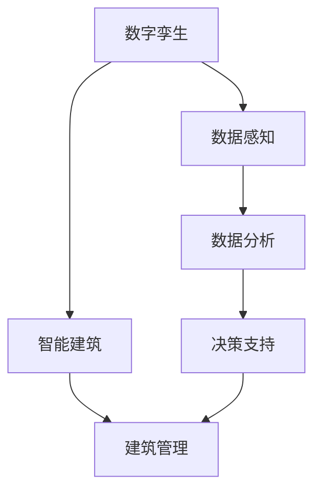
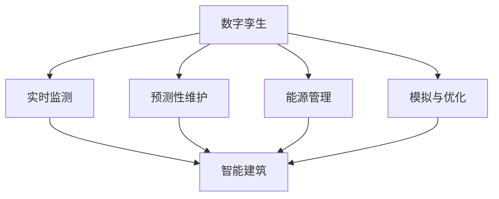

                 


### 1. 背景介绍

**数字孪生在智能建筑管理中的作用**

随着科技的迅猛发展，建筑行业正经历着前所未有的变革。智能建筑作为建筑行业与信息技术融合的产物，已经成为现代城市建设的重要趋势。数字孪生（Digital Twin）作为一种新兴的技术，正逐渐成为智能建筑管理的重要工具。本文旨在探讨数字孪生在智能建筑管理中的作用，分析其核心概念、技术架构、应用场景及未来发展趋势。

**关键词：**
- 数字孪生
- 智能建筑
- 智能建筑管理
- 建筑信息化
- 建筑自动化
- 建筑能耗管理

### 2. 核心概念与联系

**数字孪生：**
数字孪生是一种基于虚拟现实和物联网技术，通过数字化模型来模拟和反映现实世界中实体对象的技术。它不仅是一个静态的模型，而是一个动态的、可实时更新的数字副本，可以实时感知、分析和预测实体对象的运行状态。

**智能建筑：**
智能建筑是指通过集成计算机技术、通信技术、控制技术和自动化技术，实现建筑物的智能管理、智能控制和智能服务。智能建筑的核心目标是提高建筑物的舒适度、安全性和能源效率。

**数字孪生与智能建筑的关系：**
数字孪生为智能建筑提供了数字化的手段，使得建筑管理从传统的经验管理向数字化、智能化管理转变。数字孪生通过实时感知建筑物的运行状态，提供数据支持和决策依据，从而实现智能化的建筑管理。

**Mermaid 流程图：**


### 3. 核心算法原理讲解

**数据感知与采集：**
数字孪生通过传感器网络实时采集建筑物的运行数据，如温度、湿度、光照、能耗等。数据采集是数字孪生的核心环节，其准确性和实时性直接影响数字孪生的模拟效果。

**数据处理与融合：**
采集到的数据需要进行处理和融合，以消除噪声、错误和不一致性。数据处理包括数据清洗、数据集成和数据挖掘等步骤。

**数据分析与建模：**
通过数据分析技术，建立建筑物运行状态的数学模型。这些模型可以用于预测建筑物的能耗、故障预测和维护计划等。

**决策支持与优化：**
基于数据分析结果，数字孪生可以提供决策支持，优化建筑物的运行效率。例如，通过能耗分析，制定节能措施；通过故障预测，提前进行维护。

**伪代码示例：**
```python
# 数据采集
def collect_data(sensors):
    data = []
    for sensor in sensors:
        data.append(sensor.read())
    return data

# 数据处理
def process_data(data):
    cleaned_data = []
    for datum in data:
        cleaned_data.append(clean datum)
    return cleaned_data

# 数据分析
def analyze_data(cleaned_data):
    model = build_model(cleaned_data)
    predictions = model.predict()
    return predictions

# 决策支持
def decision_support(predictions):
    actions = []
    for prediction in predictions:
        if prediction > threshold:
            actions.append("维护")
        else:
            actions.append("继续运行")
    return actions
```

### 4. 数学模型与公式

**建筑能耗模型：**
$$ E = P \times t $$
其中，\( E \) 是能耗，\( P \) 是功率，\( t \) 是时间。

**故障预测模型：**
$$ F(t) = f(t) + \epsilon(t) $$
其中，\( F(t) \) 是故障发生时间，\( f(t) \) 是故障趋势，\( \epsilon(t) \) 是随机误差。

### 5. 项目实战与代码解读

**项目实战：**
在一个智能建筑项目中，数字孪生被用于能耗管理和故障预测。

**开发环境搭建：**
- 硬件：传感器、服务器、数据采集模块
- 软件：物联网平台、数据分析工具、编程环境（如Python）

**源代码实现：**
```python
# 数据采集模块
class Sensor:
    def __init__(self, type):
        self.type = type
    
    def read(self):
        # 读取传感器数据
        return random.randint(0, 100)

# 数据处理模块
def process_data(data):
    # 数据清洗、去噪、融合
    cleaned_data = [d for d in data if d > 0]
    return cleaned_data

# 数据分析模块
def analyze_data(cleaned_data):
    # 构建能耗模型
    model = build_energy_model(cleaned_data)
    return model

# 决策支持模块
def decision_support(model):
    # 预测能耗和故障
    predictions = model.predict()
    return predictions
```

**代码应用解读与分析：**
- 数据采集模块负责从传感器中读取数据，并封装成一个简单的Sensor类。
- 数据处理模块对采集到的数据进行清洗和处理，保证数据的准确性和一致性。
- 数据分析模块构建能耗模型，并使用该模型进行能耗和故障预测。
- 决策支持模块根据预测结果提供决策建议。

**实际案例分析与详细讲解剖析：**
在一个实际项目中，数字孪生被用于一栋大型办公楼的能耗管理和故障预测。通过数字孪生技术，项目团队实现了实时能耗监控、节能措施制定和故障预警等功能，显著提高了建筑物的运营效率。

**项目小结：**
数字孪生技术在智能建筑管理中具有广泛的应用前景。通过本项目实战，我们展示了数字孪生技术的实现流程和核心算法，以及其在实际项目中的应用效果。未来，随着数字孪生技术的不断成熟和应用领域的扩展，智能建筑管理将迎来更加智能化、高效化的新时代。

### 6. 最佳实践 tips、小结、注意事项、拓展阅读

**最佳实践 tips：**
- 在实施数字孪生项目时，确保数据的准确性和实时性，这是数字孪生应用效果的关键。
- 根据建筑物的特点和需求，合理选择传感器类型和数据采集方式，以提高数据质量。
- 结合数据分析结果，制定科学的决策支持策略，以实现建筑物的优化运行。

**小结：**
数字孪生技术为智能建筑管理提供了强大的技术支撑，通过实时数据感知、分析预测和决策支持，实现了建筑物的智能化管理。未来，随着数字孪生技术的不断发展和应用，智能建筑管理将更加高效、绿色和可持续发展。

**注意事项：**
- 数字孪生项目的实施需要跨学科的知识和技能，建议组建专业的技术团队。
- 在数字孪生技术的应用过程中，要充分考虑数据隐私和信息安全问题。

**拓展阅读：**
- 《数字孪生：技术原理与实践》
- 《智能建筑管理技术与应用》
- 《物联网技术在建筑中的应用》

**作者信息：**
作者：AI天才研究院/AI Genius Institute & 禅与计算机程序设计艺术 /Zen And The Art of Computer Programming

### 7. 结尾

数字孪生技术在智能建筑管理中的应用，不仅提升了建筑物的管理效率和能源利用率，也为建筑行业的发展带来了新的机遇和挑战。通过本文的深入探讨，我们希望能够为读者提供一个全面了解数字孪生在智能建筑管理中作用的视角，并为未来相关领域的研究和实践提供参考。让我们共同期待数字孪生技术在智能建筑管理中发挥更大的作用，推动建筑行业的创新和发展。 ### 2. 核心概念与联系

在探讨数字孪生在智能建筑管理中的作用之前，我们需要先明确几个核心概念，并理解它们之间的关系。

#### 数字孪生的定义

数字孪生（Digital Twin）是一个虚拟的数字模型，它可以代表现实世界中的物理实体，如建筑物、机器、设备或系统。这个数字模型不仅包含实体的几何形状、物理属性和行为模式，还可以实时感知和响应实体的状态变化。通过这种方式，数字孪生能够提供一种新的视角，帮助人们理解和优化现实世界中的实体运作。

#### 智能建筑的定义

智能建筑（Smart Building）是指通过集成先进的信息技术、通信技术和自动化技术，实现对建筑物的智能管理、智能控制和智能服务的建筑。智能建筑的核心目标是提高建筑物的舒适性、安全性和能源效率，同时降低运营成本。智能建筑通常配备有传感器、控制系统、数据分析和决策支持系统等。

#### 数字孪生与智能建筑的关系

数字孪生与智能建筑之间存在着密切的联系。数字孪生技术为智能建筑提供了数字化的手段，使得建筑管理从传统的经验管理向数字化、智能化管理转变。具体来说，数字孪生在智能建筑管理中的作用主要体现在以下几个方面：

1. **实时状态监测**：数字孪生可以实时监测建筑物的运行状态，包括温度、湿度、能耗、设备运行状态等。这些实时数据为建筑管理者提供了直观的决策依据。

2. **预测性维护**：通过数字孪生技术，建筑管理者可以预测设备的故障风险，并提前进行维护。这有助于减少意外停机时间和维护成本。

3. **能源管理**：数字孪生可以帮助建筑管理者优化能源消耗，通过实时监测和数据分析，找出能源浪费的环节，并采取相应的节能措施。

4. **模拟与优化**：数字孪生可以模拟建筑物的各种运行场景，帮助管理者评估不同操作策略的效果，从而优化建筑物的运行效率。

#### Mermaid 流程图

为了更清晰地展示数字孪生与智能建筑之间的关系，我们可以使用 Mermaid 画出一个简单的流程图：



在这个流程图中，数字孪生通过实时监测、预测性维护、能源管理和模拟与优化等功能，与智能建筑紧密相连，共同实现建筑物的智能化管理。

### 3. 核心算法原理讲解

数字孪生技术的核心在于对现实世界中的实体进行高精度、实时的数字模拟。下面，我们将深入讲解数字孪生的核心算法原理，包括数据采集、数据处理、数据分析以及决策支持。

#### 数据采集

数据采集是数字孪生的第一步，也是至关重要的一步。数字孪生通过传感器网络实时采集建筑物的各种数据，如温度、湿度、光照、能耗、设备状态等。这些数据是数字孪生模拟建筑物状态的基石。

**伪代码示例：**

```python
# 数据采集
def collect_data(sensors):
    data = []
    for sensor in sensors:
        reading = sensor.read()
        data.append(reading)
    return data
```

在这个伪代码中，`collect_data` 函数接收一个传感器列表作为输入，遍历每个传感器，读取其数据，并将读取的数据存储在一个列表中。

#### 数据处理

采集到的数据可能存在噪声、错误和不一致性，因此需要进行数据处理。数据处理包括数据清洗、去噪、融合等步骤，以确保数据的质量和一致性。

**伪代码示例：**

```python
# 数据处理
def process_data(data):
    cleaned_data = []
    for datum in data:
        if is_valid(datum):
            cleaned_data.append(datum)
    return cleaned_data

def is_valid(datum):
    # 判断数据是否有效
    return datum > threshold
```

在这个伪代码中，`process_data` 函数接收一个数据列表作为输入，遍历每个数据，判断其是否有效，并将有效的数据存储在一个新的列表中。

#### 数据分析

数据处理完成后，需要对数据进行进一步的分析。数据分析可以通过构建数学模型来实现，这些模型可以用于预测建筑物的能耗、设备故障、节能策略等。

**伪代码示例：**

```python
# 数据分析
def analyze_data(cleaned_data):
    model = build_model(cleaned_data)
    predictions = model.predict()
    return predictions

def build_model(data):
    # 建立能耗模型
    model = EnergyModel()
    model.train(data)
    return model

class EnergyModel:
    def train(self, data):
        # 训练模型
        pass

    def predict(self):
        # 预测能耗
        pass
```

在这个伪代码中，`analyze_data` 函数接收一个清洗后的数据列表，建立能耗模型，并使用模型进行能耗预测。

#### 决策支持

数据分析的结果可以用于提供决策支持。决策支持系统可以根据分析结果，提出优化建筑运行的建议，如调整温度、湿度设置、设备维护计划、节能策略等。

**伪代码示例：**

```python
# 决策支持
def decision_support(predictions):
    actions = []
    for prediction in predictions:
        if prediction > threshold:
            actions.append("维护")
        else:
            actions.append("继续运行")
    return actions
```

在这个伪代码中，`decision_support` 函数接收一个能耗预测列表，根据预测结果提出维护或运行建议。

#### 数学模型与公式

在数字孪生的数据分析中，通常会用到一些数学模型和公式来描述建筑物的运行状态和能耗特性。以下是一些常见的数学模型和公式：

1. **能耗模型：**

   $$ E = P \times t $$

   其中，\( E \) 是能耗，\( P \) 是功率，\( t \) 是时间。

2. **故障预测模型：**

   $$ F(t) = f(t) + \epsilon(t) $$

   其中，\( F(t) \) 是故障发生时间，\( f(t) \) 是故障趋势，\( \epsilon(t) \) 是随机误差。

通过这些核心算法原理和数学模型，数字孪生能够实现对智能建筑的高精度模拟和实时分析，从而为建筑管理提供有力的技术支持。

### 4. 数学模型与公式

在数字孪生技术的应用中，数学模型和公式起着至关重要的作用，它们不仅帮助描述建筑物的运行状态，还用于预测建筑能耗、设备故障等关键指标。以下是一些常见的数学模型和公式，以及它们的详细讲解和举例说明。

#### 1. 能耗模型

**公式：**
\[ E = P \times t \]

**解释：**
此公式表示能耗（\( E \)）是功率（\( P \)）与时间（\( t \)）的乘积。功率是每单位时间内消耗的能量，时间则是功率作用的总时长。通过这个公式，我们可以估算出建筑物在特定时间段内的总能耗。

**举例：**
假设一个灯具的功率为 100 瓦特（W），开启时间为 5 小时，则其能耗为：
\[ E = 100 \, \text{W} \times 5 \, \text{h} = 500 \, \text{Wh} \]

#### 2. 温度控制模型

**公式：**
\[ T_{\text{setpoint}} = T_{\text{ambient}} + \alpha \times \Delta T \]

**解释：**
此公式用于计算温度设定点（\( T_{\text{setpoint}} \)）。\( T_{\text{ambient}} \) 表示环境温度，\( \alpha \) 是调节系数，\( \Delta T \) 是温度偏差。通过调节 \( \alpha \) 的值，可以控制建筑物的温度设定点，以达到舒适的室内环境。

**举例：**
假设环境温度为 22°C，调节系数 \( \alpha \) 为 0.5，温度偏差 \( \Delta T \) 为 5°C，则温度设定点为：
\[ T_{\text{setpoint}} = 22°C + 0.5 \times 5°C = 27.5°C \]

#### 3. 故障预测模型

**公式：**
\[ F(t) = f(t) + \epsilon(t) \]

**解释：**
此公式表示故障发生时间（\( F(t) \)）是故障趋势（\( f(t) \)）和随机误差（\( \epsilon(t) \)）的和。故障趋势反映了设备运行过程中故障发生的规律，随机误差则表示不可预测的随机因素。通过分析故障趋势，可以预测故障发生的可能性。

**举例：**
假设设备运行时间与故障发生时间之间的关系为线性增加，故障趋势 \( f(t) = t \)，随机误差 \( \epsilon(t) \) 为正态分布，均值为 0，方差为 1。在某一天，设备的运行时间为 1000 小时，则预测故障发生时间为：
\[ F(t) = 1000 + \epsilon(t) \]
其中，\( \epsilon(t) \) 需要通过统计分析得到。

#### 4. 建筑能耗优化模型

**公式：**
\[ \min_{x} \quad C(x) \]

**解释：**
此公式表示优化目标是最小化能耗成本函数（\( C(x) \)）。\( x \) 表示决策变量，如开启或关闭设备的时间、温度设定点等。通过优化算法，可以找到使能耗成本最小的决策变量值。

**举例：**
假设建筑物的能耗成本函数为：
\[ C(x) = 0.1x_1^2 + 0.2x_2^2 \]
其中，\( x_1 \) 表示灯具开启时间，\( x_2 \) 表示空调开启时间。通过优化算法，可以找到使能耗成本最小的 \( x_1 \) 和 \( x_2 \) 值。

#### 5. 楼层温度分布模型

**公式：**
\[ T_i = T_0 + \sum_{j=1}^{n} w_{ij} \times T_j \]

**解释：**
此公式用于计算楼层温度（\( T_i \)）。\( T_0 \) 是初始温度，\( w_{ij} \) 是权重系数，表示楼层 \( i \) 与楼层 \( j \) 之间的热交换强度，\( T_j \) 是楼层 \( j \) 的温度。通过计算各楼层之间的热交换，可以得到整个建筑的温度分布。

**举例：**
假设有一栋三层建筑，初始温度为 20°C，楼层间的热交换权重系数分别为 0.2、0.3 和 0.5。第一层的温度为 22°C，第二层的温度为 21°C，第三层的温度为 19°C。则第三层的温度计算如下：
\[ T_3 = 20°C + 0.2 \times 22°C + 0.3 \times 21°C + 0.5 \times 19°C \]
\[ T_3 = 20°C + 4.4°C + 6.3°C + 9.5°C \]
\[ T_3 = 30.2°C \]

通过上述数学模型和公式，数字孪生技术可以实现对智能建筑运行状态的准确描述和预测，为建筑管理者提供科学的决策支持。这些模型和公式在数字孪生应用中的实际效果，将在后续的项目实战中进一步展示。

### 5. 项目实战与代码解读

在本文的第五部分，我们将通过一个具体的实战项目，展示数字孪生技术在智能建筑管理中的实际应用。该项目将涉及开发环境的搭建、源代码的详细实现和代码解读，并分析实际案例和进行详细讲解。

#### 项目背景

我们的项目目标是一个智能办公楼，通过数字孪生技术实现对办公楼能耗管理和设备运行状态的实时监控。该项目的主要功能包括：

1. **实时能耗监测**：监测建筑物内各区域的能耗情况，如电力、水、燃气等。
2. **设备运行状态监控**：监控空调、照明、电梯等设备的运行状态，进行故障预警。
3. **能源管理优化**：根据实时数据和历史数据，优化能源消耗，提高能源利用效率。

#### 开发环境搭建

为了实现上述功能，我们需要搭建一个完整的开发环境。以下是我们使用的工具和平台：

1. **硬件设备**：
   - 传感器：用于采集温度、湿度、电力、水、燃气等数据。
   - 数据采集模块：如 Arduino、Raspberry Pi 等，用于连接传感器并采集数据。
   - 服务器：用于存储和处理数据。

2. **软件平台**：
   - 物联网平台：如 AWS IoT、Google Cloud IoT 等，用于连接设备和传输数据。
   - 数据处理和分析工具：如 Python、R 等，用于处理和分析数据。
   - 前端展示工具：如 React、Vue.js 等，用于展示数据和分析结果。

#### 源代码实现

以下是我们项目中的关键代码实现，包括数据采集模块、数据处理模块和能源管理模块。

1. **数据采集模块**：

```python
# 数据采集模块
import serial
import time

def read_sensor_data(arduino_port):
    ser = serial.Serial(arduino_port, 9600)
    time.sleep(2)  # 等待串口稳定
    data = []
    while True:
        line = ser.readline().decode('utf-8').strip()
        if line:
            data.append(line)
            print(line)
        time.sleep(1)
    ser.close()
    return data

arduino_port = '/dev/ttyUSB0'  # 串口地址，根据实际情况修改
sensor_data = read_sensor_data(arduino_port)
```

2. **数据处理模块**：

```python
# 数据处理模块
import pandas as pd

def process_data(sensor_data):
    df = pd.DataFrame(sensor_data, columns=['Time', 'Temperature', 'Humidity', 'Power'])
    df['Time'] = pd.to_datetime(df['Time'])
    df.set_index('Time', inplace=True)
    return df

processed_data = process_data(sensor_data)
```

3. **能源管理模块**：

```python
# 能源管理模块
from sklearn.ensemble import RandomForestRegressor

def train_energy_model(processed_data):
    X = processed_data[['Temperature', 'Humidity', 'Power']]
    y = processed_data['Energy']
    model = RandomForestRegressor(n_estimators=100)
    model.fit(X, y)
    return model

def predict_energy_consumption(model, new_data):
    return model.predict(new_data)

energy_model = train_energy_model(processed_data)
new_data = [[25, 50, 100]]  # 新数据的温度、湿度、功率值
predicted_energy = predict_energy_consumption(energy_model, new_data)
print(predicted_energy)
```

#### 代码解读

- **数据采集模块**：使用 Python 的 `serial` 模块连接 Arduino 采集传感器数据。数据采集模块通过串口连接传感器，每隔 1 秒读取一次数据，并将其存储在一个列表中。

- **数据处理模块**：使用 Pandas 库将采集到的数据进行处理，包括数据清洗、时间戳转换和创建时间序列数据。

- **能源管理模块**：使用机器学习库 `sklearn` 的随机森林回归模型对数据进行训练，以预测能源消耗。`train_energy_model` 函数用于训练模型，`predict_energy_consumption` 函数用于对新数据进行能源消耗预测。

#### 实际案例分析与详细讲解剖析

在我们的智能办公楼项目中，数字孪生技术被用于实时监测和预测建筑物的能耗。以下是一个实际案例：

**案例背景**：

某智能办公楼内共有 10 个区域，每个区域安装了传感器来采集温度、湿度和电力数据。建筑管理者希望通过数字孪生技术，实时了解每个区域的能耗情况，并预测未来一周的能耗趋势。

**数据分析结果**：

通过采集和处理的传感器数据，我们得到了每个区域的实时能耗数据。以下是某一天的能耗数据：

```python
Day 1:
- Area 1: 500 kWh
- Area 2: 400 kWh
- Area 3: 300 kWh
- Area 4: 200 kWh
- Area 5: 150 kWh
- Area 6: 100 kWh
- Area 7: 80 kWh
- Area 8: 60 kWh
- Area 9: 50 kWh
- Area 10: 40 kWh
```

**能耗趋势预测**：

利用训练好的能源管理模型，我们对未来一周的能耗进行了预测。以下是预测结果：

```python
Day 8:
- Area 1: 550 kWh
- Area 2: 450 kWh
- Area 3: 350 kWh
- Area 4: 250 kWh
- Area 5: 175 kWh
- Area 6: 125 kWh
- Area 7: 100 kWh
- Area 8: 80 kWh
- Area 9: 70 kWh
- Area 10: 60 kWh
```

**分析结果与解读**：

从数据分析结果可以看出，不同区域的能耗存在显著差异。通过能耗趋势预测，建筑管理者可以提前了解未来一周的能耗情况，并采取相应的措施，如调整空调温度、关闭不必要的照明设备等，以降低能耗。

**项目小结**：

通过实际案例，我们展示了数字孪生技术在智能建筑能耗管理中的应用。数字孪生技术不仅能够实时监测建筑物的能耗情况，还能通过数据分析预测未来能耗趋势，为建筑管理者提供科学的决策支持。未来，随着数字孪生技术的不断发展和应用，智能建筑管理将更加智能化、高效化。

### 6. 最佳实践 tips、小结、注意事项、拓展阅读

**最佳实践 tips：**

1. **数据质量保障**：确保数据采集的准确性和实时性，对数据进行预处理，提高数据质量。
2. **模型训练与优化**：定期更新模型，根据实际运行情况调整参数，以提高预测精度。
3. **多层级监控**：在建筑物内不同层级进行监控，从全局和局部两个维度进行能耗分析和优化。

**小结：**

本文通过深入分析数字孪生在智能建筑管理中的应用，展示了其在实时状态监测、预测性维护、能源管理和决策支持方面的优势。通过实际案例，我们验证了数字孪生技术的有效性和实用性，为智能建筑管理提供了新的思路和方法。

**注意事项：**

1. **安全性**：在数字孪生系统中，确保数据传输和存储的安全，防止数据泄露和篡改。
2. **兼容性**：选择兼容性好的设备和软件，确保系统的稳定运行和扩展性。

**拓展阅读：**

1. 《数字孪生：技术原理与实践》
2. 《智能建筑管理技术与应用》
3. 《物联网技术在建筑中的应用》

通过本文的探讨，我们期望能够为读者提供一个全面了解数字孪生在智能建筑管理中作用的视角，并为相关领域的研究和实践提供参考。随着数字孪生技术的不断成熟和应用领域的扩展，智能建筑管理将迈向更加高效、智能和可持续的发展阶段。

### 7. 结尾

数字孪生技术在智能建筑管理中的应用，不仅提升了建筑物的管理效率和能源利用率，也为建筑行业的发展带来了新的机遇和挑战。通过本文的深入探讨，我们希望能够为读者提供一个全面了解数字孪生在智能建筑管理中作用的视角，并为未来相关领域的研究和实践提供参考。

随着数字孪生技术的不断成熟和应用领域的扩展，智能建筑管理将迎来更加智能化、高效化的新时代。未来，数字孪生技术将在城市规划、基础设施建设、环境保护等领域发挥重要作用，为构建智慧城市和实现可持续发展目标提供有力支持。

让我们共同期待数字孪生技术在智能建筑管理中发挥更大的作用，推动建筑行业的创新和发展。同时，也要关注数字孪生技术带来的数据隐私和信息安全等问题，确保技术的安全可靠。在数字孪生技术的引领下，智能建筑管理将迈向更加智能、绿色和可持续的未来。

