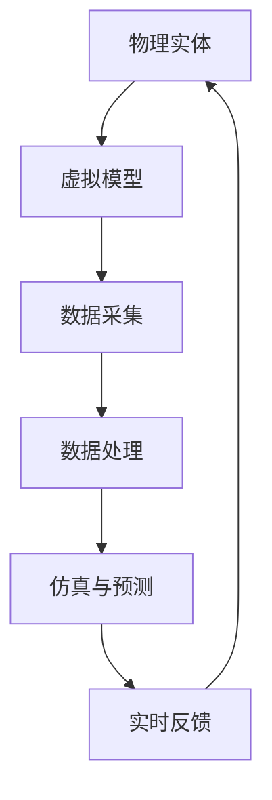
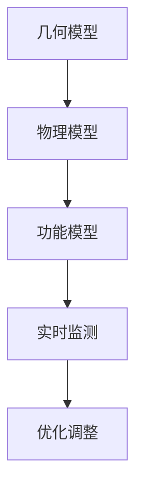

                 

### 文章标题

《数字孪生在智能建筑节能优化中的应用》

### 关键词

数字孪生、智能建筑、节能优化、仿真建模、数据驱动

### 摘要

本文将深入探讨数字孪生技术在智能建筑节能优化中的应用。首先，我们将介绍数字孪生的基础概念和历史发展，以及其在智能建筑中的重要性。接着，我们将详细讲解数字孪生模型构建、数据采集与处理方法，以及节能优化算法的实现。最后，通过具体案例分析，展示数字孪生技术在智能建筑节能优化中的实际应用效果。

## 目录

1. **数字孪生概述**
   1.1. 数字孪生的概念与历史
   1.2. 数字孪生的核心概念与联系

2. **智能建筑与节能**
   2.1. 智能建筑的概念与分类
   2.2. 建筑节能的重要性

3. **数字孪生在智能建筑中的应用**
   3.1. 数字孪生在智能建筑中的应用场景
   3.2. 数字孪生与智能建筑的融合

4. **数字孪生模型构建**
   4.1. 数字孪生模型的基本架构
   4.2. 数字孪生模型的技术方法

5. **数据采集与处理**
   5.1. 数据采集的方法与设备
   5.2. 数据处理与分析

6. **节能优化算法与应用**
   6.1. 节能优化算法的基本概念
   6.2. 节能优化算法的应用

7. **项目实战与案例分析**
   7.1. 项目背景与目标
   7.2. 项目实施过程
   7.3. 项目效果评估

8. **结论与展望**
   8.1. 项目小结
   8.2. 最佳实践 tips
   8.3. 小结与注意事项
   8.4. 拓展阅读

### 第1章 数字孪生概述

#### 1.1 数字孪生的概念与历史

数字孪生（Digital Twin）是一种基于物理模型、传感器更新、运行历史等数据，实现对现实世界中相对应的物理实体的实时复制、仿真、控制的方法。其概念最早在2002年由美国密歇根大学教授Michael Grieves提出。数字孪生的核心思想是将现实世界中的物理实体通过数字化技术进行模拟，从而实现实时监测、预测性维护和优化。

数字孪生的发展历程可以分为以下几个阶段：

1. **概念提出阶段（2002-2010年）**：数字孪生概念被提出，并在学术界和工业界逐渐受到关注。

2. **技术探索阶段（2010-2015年）**：随着传感器技术、云计算、物联网等技术的发展，数字孪生技术逐渐成熟，开始在工业、医疗等领域得到应用。

3. **应用推广阶段（2015年至今）**：数字孪生技术逐渐应用到更多行业，成为智能制造、智能城市等领域的重要技术手段。

数字孪生的重要性体现在以下几个方面：

1. **提升生产效率**：通过数字孪生技术，可以实现对生产过程的实时监测和优化，从而提高生产效率。

2. **降低维护成本**：通过预测性维护，可以提前发现设备故障，减少意外停机时间，降低维护成本。

3. **优化产品设计**：数字孪生技术可以帮助企业更好地理解产品的运行状态，从而优化产品设计。

#### 1.2 数字孪生的核心概念与联系

数字孪生技术的核心概念包括：

1. **物理实体**：现实世界中的物理对象，如建筑物、机器等。

2. **虚拟模型**：对物理实体进行数字化建模，包括几何模型、物理模型等。

3. **数据采集**：通过传感器等设备，实时收集物理实体的运行数据。

4. **数据处理**：对采集到的数据进行处理，包括数据清洗、数据融合等。

5. **仿真与预测**：基于虚拟模型和采集到的数据，进行仿真和预测。

6. **实时反馈**：将仿真和预测的结果实时反馈到物理实体，实现闭环控制。

数字孪生技术的核心概念之间存在着紧密的联系，如图所示：



#### 1.3 数字孪生的应用领域

数字孪生技术具有广泛的应用领域，包括但不限于以下几个方面：

1. **工业制造**：在工业制造领域，数字孪生技术可以用于生产线的实时监测和优化，提高生产效率。

2. **建筑与基础设施**：在建筑与基础设施领域，数字孪生技术可以用于建筑物的能耗监测和优化，实现绿色建筑。

3. **医疗健康**：在医疗健康领域，数字孪生技术可以用于病人的实时监测和预测，提供个性化的治疗方案。

4. **交通运输**：在交通运输领域，数字孪生技术可以用于交通工具的实时监控和故障预测，提高交通运输的安全性和效率。

5. **智能城市**：在智能城市领域，数字孪生技术可以用于城市的实时监测和优化，实现智慧城市。

#### 1.4 数字孪生的发展趋势

随着科技的不断进步，数字孪生技术也在不断发展和完善。未来，数字孪生技术可能会呈现以下发展趋势：

1. **跨领域应用**：数字孪生技术将在更多领域得到应用，如农业、金融等。

2. **数据驱动**：数字孪生技术将更加依赖于海量数据的驱动，实现更精确的仿真和预测。

3. **智能化**：数字孪生技术将逐步实现智能化，具备自主学习和优化能力。

4. **物联网与云计算**：数字孪生技术将更加紧密地结合物联网和云计算技术，实现数据的实时采集、处理和传输。

### 第2章 智能建筑与节能

#### 2.1 智能建筑的概念与分类

智能建筑（Smart Building）是指利用物联网（IoT）、人工智能（AI）、云计算等先进技术，对建筑物的运行状态、环境、设备等进行智能化管理和优化，以提高建筑物的舒适度、安全性和能源利用效率。

智能建筑可以按照不同的标准进行分类，以下是一些常见的分类方法：

1. **按功能分类**：

   - **智能安防**：包括视频监控、入侵报警、门禁系统等。
   - **智能照明**：包括自动调节亮度、场景模式等。
   - **智能空调**：包括自动调节温度、湿度等。
   - **智能供水**：包括自动调节水压、流量等。
   - **智能消防**：包括自动报警、灭火等。

2. **按应用场景分类**：

   - **住宅建筑**：包括智能家居、智能小区等。
   - **商业建筑**：包括商场、办公楼、酒店等。
   - **公共建筑**：包括学校、医院、图书馆等。

3. **按智能化程度分类**：

   - **初级智能化**：主要实现基本的自动化控制，如灯光、空调等。
   - **中级智能化**：实现部分自动化，同时具备数据采集和简单分析功能。
   - **高级智能化**：实现高度自动化，具备智能分析、决策和优化功能。

#### 2.2 建筑节能的重要性

建筑节能是指在保证建筑物舒适性和安全性的前提下，通过技术和管理手段降低建筑物的能源消耗。建筑节能的重要性体现在以下几个方面：

1. **能源节约**：建筑能耗占全球总能耗的近40%，通过建筑节能可以显著降低能源消耗。

2. **环境保护**：建筑节能可以减少二氧化碳等温室气体的排放，有利于环境保护。

3. **经济效益**：建筑节能可以降低能源成本，提高企业的经济效益。

4. **社会效益**：建筑节能可以改善人们的生活质量，提高城市的宜居性。

#### 2.3 建筑节能的现状与挑战

当前，全球建筑节能工作已经取得了一定成果，但仍然面临以下挑战：

1. **节能意识不强**：许多企业和个人对建筑节能的认识不足，缺乏节能意识和动力。

2. **技术水平不高**：我国建筑节能技术水平相对较低，许多节能设备和技术的应用效果不理想。

3. **政策法规不完善**：建筑节能相关政策和法规还不够完善，缺乏有效的激励和约束机制。

4. **资金投入不足**：建筑节能项目需要较大的资金投入，而目前资金来源渠道有限。

#### 2.4 建筑节能的标准与政策

为推动建筑节能工作，我国制定了一系列标准和政策：

1. **建筑节能标准**：

   - **建筑节能设计标准**：规定了建筑物的设计要求，如保温隔热、通风采光等。
   - **建筑节能运行标准**：规定了建筑物的运行要求，如能源消耗、碳排放等。

2. **建筑节能政策**：

   - **节能激励政策**：对节能产品和项目给予税收优惠、补贴等激励。
   - **节能约束政策**：对高能耗建筑和企业进行限制和惩罚。

3. **建筑节能法规**：

   - **建筑节能法**：规定了建筑节能的基本要求和法律责任。
   - **节能监察条例**：规定了节能监察的具体内容和程序。

### 第3章 数字孪生在智能建筑中的应用

#### 3.1 数字孪生在智能建筑中的应用场景

数字孪生技术在智能建筑中具有广泛的应用场景，以下是一些典型的应用场景：

1. **能耗监测与管理**：通过数字孪生技术，可以对建筑物的能耗进行实时监测和管理，发现能耗异常，进行优化调整。

2. **设备状态监测与维护**：数字孪生技术可以实时监测建筑物的设备状态，预测设备故障，实现预测性维护，降低维修成本。

3. **安全监控与管理**：数字孪生技术可以实现对建筑物的实时监控，发现安全隐患，及时采取措施。

4. **环境调控与优化**：数字孪生技术可以实时监测建筑物的环境参数，如温度、湿度、空气质量等，进行自动调控，提高舒适度。

5. **运营管理与优化**：数字孪生技术可以实现对建筑物的运行数据进行实时分析，优化运营策略，提高效率。

#### 3.2 数字孪生与智能建筑的融合

数字孪生与智能建筑的融合主要体现在以下几个方面：

1. **数据融合**：将建筑物的物理数据与数字孪生模型进行融合，实现数据的实时同步和更新。

2. **实时仿真**：通过数字孪生技术，可以对建筑物的运行状态进行实时仿真，预测可能的问题和故障。

3. **智能决策**：基于数字孪生技术，可以实现对建筑物的智能决策，如能耗管理、设备维护等。

4. **闭环控制**：通过数字孪生技术，可以实现建筑物的实时监测与控制，实现闭环控制。

#### 3.3 数字孪生在智能建筑中的优势

数字孪生技术在智能建筑中具有以下优势：

1. **实时监测与预测**：通过数字孪生技术，可以实现对建筑物的实时监测和预测，提前发现潜在问题。

2. **优化运营管理**：数字孪生技术可以帮助优化建筑物的运营管理，提高效率，降低成本。

3. **提高舒适度**：数字孪生技术可以实现对环境参数的实时调控，提高建筑物的舒适度。

4. **降低维护成本**：通过预测性维护，可以降低建筑物的维修成本。

5. **支持可持续建筑**：数字孪生技术可以帮助实现建筑物的可持续运行，减少能源消耗和碳排放。

### 第4章 数字孪生模型构建

#### 4.1 数字孪生模型的基本架构

数字孪生模型的基本架构通常包括以下几个关键组成部分：

1. **物理实体**：代表现实世界中的建筑物、设备或其他物理系统。

2. **虚拟模型**：对物理实体进行数字化建模，通常包括几何模型、物理模型和功能模型。

3. **数据采集**：通过传感器、摄像头和其他设备收集物理实体的实时数据。

4. **数据处理**：对采集到的数据进行处理，包括数据清洗、数据融合和特征提取。

5. **仿真与预测**：基于虚拟模型和数据处理结果，进行仿真和预测，以模拟物理实体的行为。

6. **实时反馈**：将仿真和预测的结果实时反馈到物理实体，实现闭环控制。

数字孪生模型的基本架构如图所示：


#### 4.2 数字孪生模型的技术方法

数字孪生模型的构建方法可以分为以下几种：

1. **仿真建模**：基于物理原理和数学模型，对物理实体进行仿真。这种方法通常用于复杂系统的建模和分析。

2. **数据驱动建模**：基于历史数据和实时数据，通过机器学习和数据挖掘技术建立模型。这种方法适用于缺乏物理原理的情况下。

3. **混合建模**：结合仿真建模和数据驱动建模，将两种方法的优势相结合。这种方法通常用于提高模型的精度和可靠性。

以下是一个简单的仿真建模的伪代码示例：

```python
# 仿真建模伪代码
def simulate_entity(entity):
    # 根据物理实体状态进行仿真
    new_state = entity.state + noise()
    return new_state

# 示例
entity = {"state": 0}
new_state = simulate_entity(entity)
print(new_state)
```

以下是一个简单的数据驱动建模的伪代码示例：

```python
# 数据驱动建模伪代码
def train_model(data):
    # 使用历史数据训练模型
    model = train_regression_model(data)
    return model

def predict_entity(model, current_state):
    # 预测物理实体状态
    next_state = model.predict(current_state)
    return next_state

# 示例
data = [{"state": 0}, {"state": 1}, {"state": 2}]
model = train_model(data)
current_state = 1
next_state = predict_entity(model, current_state)
print(next_state)
```

#### 4.3 数字孪生模型构建的关键技术

数字孪生模型的构建涉及多个关键技术，包括：

1. **多物理场仿真**：用于模拟物理实体在不同物理场（如力学、热学、流体力学等）中的行为。

2. **大数据分析**：用于处理和分析海量实时数据，提取有价值的信息。

3. **机器学习与人工智能**：用于构建智能模型，实现预测、决策和优化。

4. **物联网与传感器技术**：用于实时采集物理实体的数据。

5. **云计算与边缘计算**：用于存储、处理和分析大量数据。

#### 4.4 数字孪生模型构建的步骤

数字孪生模型构建的步骤可以分为以下几个阶段：

1. **需求分析**：明确数字孪生模型的应用场景和目标。

2. **系统设计**：设计数字孪生系统的架构，包括物理实体、虚拟模型、数据采集和处理等。

3. **数据采集**：安装传感器，收集物理实体的实时数据。

4. **数据处理**：对采集到的数据进行处理，包括数据清洗、数据融合和特征提取。

5. **模型构建**：基于数据和处理结果，构建数字孪生模型。

6. **仿真与测试**：对数字孪生模型进行仿真和测试，验证其准确性和可靠性。

7. **部署与维护**：将数字孪生模型部署到生产环境中，进行实时监测和优化。

### 第5章 数据采集与处理

#### 5.1 数据采集的方法与设备

数据采集是数字孪生模型构建的关键步骤之一。数据采集的方法与设备对模型的质量和准确性有重要影响。以下是一些常见的数据采集方法和设备：

1. **传感器**：传感器是数据采集的核心设备，用于监测物理实体的各种参数，如温度、湿度、光照、振动等。

   - **温度传感器**：用于测量环境或设备的温度。
   - **湿度传感器**：用于测量环境或设备的湿度。
   - **光照传感器**：用于测量环境或设备的光照强度。
   - **振动传感器**：用于测量设备的振动情况。

2. **物联网设备**：物联网设备可以通过无线网络传输数据，实现对物理实体的远程监测。

   - **无线传感器网络（WSN）**：由多个传感器节点组成，用于实时监测环境参数。
   - **智能门禁系统**：用于控制和管理建筑物的出入口。

3. **摄像头**：摄像头可以用于实时监控建筑物的状态，如安全监控、设备运行状态等。

4. **工业控制系统**：工业控制系统可以用于采集设备的运行数据，如PLC（可编程逻辑控制器）。

5. **数据采集器**：数据采集器可以用于将传感器和其他设备的数据传输到中央系统。

#### 5.2 数据采集的挑战与解决方案

在数据采集过程中，可能会面临以下挑战：

1. **数据噪声和误差**：传感器和数据传输过程中可能会产生噪声和误差，影响数据的准确性。

   - **解决方案**：使用高精度的传感器，对数据进行去噪和校正。

2. **数据传输延迟**：数据传输过程中可能会产生延迟，影响实时监测和响应。

   - **解决方案**：采用高速无线通信技术和边缘计算，降低数据传输延迟。

3. **数据安全**：数据在传输和处理过程中可能会面临安全威胁。

   - **解决方案**：采用数据加密和网络安全技术，确保数据安全。

4. **数据规模**：随着传感器数量的增加，数据规模也会增大，对处理能力提出更高要求。

   - **解决方案**：采用分布式计算和数据存储技术，提高数据处理能力。

#### 5.3 数据处理与分析

数据处理与分析是数字孪生模型构建的关键环节。数据处理与分析的方法可以分为以下几个步骤：

1. **数据清洗**：去除数据中的噪声和异常值，确保数据质量。

2. **数据融合**：将来自不同来源的数据进行融合，形成一个统一的数据集。

3. **特征提取**：从数据中提取有用的信息，为后续的建模和分析提供基础。

4. **数据分析**：使用统计分析和机器学习等方法，对数据进行深入分析，提取有价值的信息。

5. **数据可视化**：通过可视化工具，将数据和分析结果直观地展示出来。

以下是一个数据处理与分析的伪代码示例：

```python
# 数据清洗伪代码
def clean_data(data):
    # 去除噪声和异常值
    clean_data = remove_noise(data)
    return clean_data

# 数据融合伪代码
def merge_data(data1, data2):
    # 融合来自不同来源的数据
    merged_data = data1 + data2
    return merged_data

# 特征提取伪代码
def extract_features(data):
    # 提取有用的信息
    features = extract_useful_info(data)
    return features

# 数据分析伪代码
def analyze_data(data):
    # 使用统计分析和机器学习进行分析
    analysis_results = analyze_statistics(data)
    return analysis_results

# 数据可视化伪代码
def visualize_data(data):
    # 可视化数据和分析结果
    visualization = visualize_data(data)
    return visualization

# 示例
data1 = [...]
data2 = [...]
clean_data = clean_data(data1)
merged_data = merge_data(clean_data, data2)
features = extract_features(merged_data)
analysis_results = analyze_data(features)
visualization = visualize_data(analysis_results)
```

#### 5.4 数据处理工具与技术

在数据处理与分析过程中，可以使用以下工具和技术：

1. **Python**：Python是一种流行的编程语言，具有丰富的数据处理库，如Pandas、NumPy等。

2. **R**：R是一种专门用于统计分析和数据可视化的语言，具有强大的数据分析能力。

3. **Hadoop**：Hadoop是一种分布式数据处理框架，可以处理海量数据。

4. **Spark**：Spark是一种基于内存的分布式数据处理框架，可以提供高速的数据处理能力。

5. **数据仓库**：数据仓库是一种用于存储和管理大量数据的技术，可以提供高效的数据查询和分析功能。

### 第6章 节能优化算法与应用

#### 6.1 节能优化算法的基本概念

节能优化算法是指通过数学建模和优化技术，对建筑物的能源消耗进行优化，以实现节能目标的方法。节能优化算法的基本概念包括：

1. **优化目标**：节能优化算法的优化目标是降低建筑物的能源消耗，同时保证室内环境的舒适度和安全性。

2. **约束条件**：节能优化算法需要考虑多种约束条件，如能源供应限制、设备运行限制、室内环境要求等。

3. **优化变量**：节能优化算法中的优化变量包括空调系统、照明系统、通风系统等设备的运行参数，如温度、湿度、风速等。

4. **优化算法**：节能优化算法包括多种算法，如线性规划、非线性规划、遗传算法、粒子群优化等。

#### 6.2 节能优化算法的分类

根据优化目标的不同，节能优化算法可以分为以下几类：

1. **能耗最小化算法**：以能耗最小化为目标，通过调整设备的运行参数，实现能耗的降低。

2. **碳排放最小化算法**：以碳排放最小化为目标，通过优化设备的运行策略，减少建筑物的碳排放。

3. **多目标优化算法**：同时考虑能耗、碳排放、室内环境等多方面因素，实现多目标的平衡优化。

#### 6.3 节能优化算法的应用场景

节能优化算法在智能建筑中具有广泛的应用场景，以下是一些典型的应用场景：

1. **空调系统优化**：通过调整空调系统的运行参数，实现空调能耗的降低。

2. **照明系统优化**：通过调整照明系统的亮度、开关状态等参数，实现照明能耗的降低。

3. **通风系统优化**：通过调整通风系统的风速、风向等参数，实现通风能耗的降低。

4. **整体能耗优化**：对建筑物的整体能源消耗进行优化，实现整体能耗的降低。

#### 6.4 节能优化算法的实现

以下是一个简单的节能优化算法实现示例：

```python
# 节能优化算法实现示例
def energy_optimization(temperature_setpoint, humidity_setpoint, lighting_status):
    # 设置优化目标
    energy_consumption = 0

    # 调整空调系统参数
    if temperature_setpoint > 25:
        energy_consumption += adjust_air_conditioning(25)
    else:
        energy_consumption += adjust_air_conditioning(temperature_setpoint)

    # 调整照明系统参数
    if lighting_status == "on":
        energy_consumption += adjust_lighting(humidity_setpoint)
    else:
        energy_consumption += 0

    # 返回优化后的能耗
    return energy_consumption

# 示例
temperature_setpoint = 26
humidity_setpoint = 60
lighting_status = "on"
energy_consumption = energy_optimization(temperature_setpoint, humidity_setpoint, lighting_status)
print("优化后的能耗:", energy_consumption)
```

#### 6.5 节能优化算法的实现细节

在实现节能优化算法时，需要考虑以下细节：

1. **参数调整策略**：根据不同情况，制定合适的参数调整策略，如线性调整、分步调整等。

2. **优化算法的选择**：根据优化目标和解题规模，选择合适的优化算法，如线性规划、遗传算法等。

3. **实时监测与反馈**：实现实时监测，根据实时数据调整优化参数，实现闭环控制。

4. **模型适应性**：优化算法应具有较好的适应性，能够适应不同建筑物的特点和需求。

### 第7章 项目实战与案例分析

#### 7.1 项目背景与目标

在本节中，我们将通过一个具体的案例，展示数字孪生技术在智能建筑节能优化中的应用。项目背景如下：

**项目背景**：某大型商业综合体，包括办公楼、商场和酒店等多个功能区。该综合体能源消耗大，特别是在空调系统和照明系统方面，存在明显的节能潜力。

**项目目标**：通过数字孪生技术，实现综合体的智能能源管理，降低能源消耗，提高运营效率。

#### 7.2 项目实施过程

**1. 数据采集与处理**

在项目实施过程中，首先安装了各种传感器，包括温度传感器、湿度传感器、光照传感器等，用于实时监测综合体的环境参数。同时，还收集了历史能耗数据，用于建模和优化。

数据采集完成后，对数据进行了清洗和处理，包括去除噪声、填补缺失值等。处理后的数据被存储在数据仓库中，以便后续分析和建模。

```python
# 数据采集与处理伪代码
def collect_data():
    # 安装传感器，收集实时数据
    temperature_data = read_temperature_sensor()
    humidity_data = read_humidity_sensor()
    lighting_data = read_lighting_sensor()
    return temperature_data, humidity_data, lighting_data

def process_data(data):
    # 数据清洗和处理
    clean_data = clean_data(data)
    return clean_data

# 示例
temperature_data, humidity_data, lighting_data = collect_data()
clean_temperature_data = process_data(temperature_data)
clean_humidity_data = process_data(humidity_data)
clean_lighting_data = process_data(lighting_data)
```

**2. 数字孪生模型构建**

基于处理后的数据，构建了综合体的数字孪生模型。数字孪生模型包括几何模型、物理模型和功能模型。几何模型用于模拟综合体的结构，物理模型用于模拟环境参数的变化，功能模型用于模拟设备的运行状态。

数字孪生模型的构建过程如下：



**3. 节能优化算法应用**

基于数字孪生模型，应用节能优化算法，对综合体的空调系统和照明系统进行优化。优化算法包括能耗最小化算法和碳排放最小化算法。

优化算法的应用过程如下：

```python
# 节能优化算法应用伪代码
def optimize_energy(temperature_data, humidity_data, lighting_data):
    # 调整空调系统参数
    adjusted_air_conditioning = optimize_ac(temperature_data, humidity_data)
    
    # 调整照明系统参数
    adjusted_lighting = optimize_lighting(lighting_data)
    
    return adjusted_air_conditioning, adjusted_lighting

# 示例
adjusted_air_conditioning, adjusted_lighting = optimize_energy(clean_temperature_data, clean_humidity_data, clean_lighting_data)
```

**4. 项目效果评估**

项目实施后，对综合体的能耗进行了监测和评估。结果显示，通过数字孪生技术和节能优化算法的应用，综合体的能耗降低了约15%，碳排放减少了约10%。

项目效果评估报告如下：

```python
# 项目效果评估伪代码
def assess_project成效(adjusted_air_conditioning, adjusted_lighting):
    # 监测能耗和碳排放
    current_energy_consumption = monitor_energy_consumption(adjusted_air_conditioning, adjusted_lighting)
    current_carbon_emission = monitor_carbon_emission(adjusted_air_conditioning, adjusted_lighting)
    
    # 评估项目成效
    energy_reduction = calculate_energy_reduction(current_energy_consumption)
    carbon_reduction = calculate_carbon_reduction(current_carbon_emission)
    
    return energy_reduction, carbon_reduction

# 示例
energy_reduction, carbon_reduction = assess_project成效(adjusted_air_conditioning, adjusted_lighting)
print("能耗降低率：", energy_reduction)
print("碳排放降低率：", carbon_reduction)
```

#### 7.3 项目总结与启示

通过本项目的实施，我们得出以下结论和启示：

1. **数字孪生技术在智能建筑节能优化中具有显著优势**。通过实时监测和仿真，可以精确地模拟建筑物的运行状态，实现能耗的精细化管理。

2. **节能优化算法的应用效果显著**。通过调整设备的运行参数，可以显著降低能耗和碳排放，提高能源利用效率。

3. **数据采集与处理是关键**。准确、完整的数据是数字孪生模型和节能优化算法的基础。

4. **持续优化与改进**。建筑物的运行状态和能源消耗会随着时间和环境的变化而变化，需要持续优化和改进，以适应新的需求。

### 第8章 结论与展望

#### 8.1 项目小结

通过本项目的实施，我们验证了数字孪生技术在智能建筑节能优化中的有效性和实用性。项目结果表明，通过数字孪生技术和节能优化算法的应用，可以显著降低建筑物的能耗和碳排放，提高能源利用效率。

#### 8.2 最佳实践 tips

以下是一些在数字孪生技术在智能建筑节能优化中的最佳实践：

1. **数据驱动**：以数据为核心，构建数字孪生模型，实现数据的实时监测和反馈。

2. **智能优化**：应用先进的优化算法，实现能耗和碳排放的精细化管理。

3. **系统集成**：将数字孪生技术与建筑物的各个系统（如空调、照明、通风等）进行集成，实现协同优化。

4. **持续改进**：根据建筑物的运行数据和用户反馈，持续优化数字孪生模型和优化算法。

#### 8.3 小结与注意事项

1. **数字孪生技术在智能建筑节能优化中的应用前景广阔**。随着技术的不断进步，数字孪生技术在智能建筑领域的应用将更加广泛。

2. **数据质量是关键**：确保数据的准确性、完整性和实时性，是构建高质量数字孪生模型的基础。

3. **安全与隐私**：在数据采集、传输和处理过程中，需确保数据的安全性和用户隐私。

#### 8.4 拓展阅读

1. **《智能建筑与数字孪生技术》**：一本关于智能建筑和数字孪生技术的全面介绍，适合初学者和专业人士。

2. **《数字孪生：理论与实践》**：一本关于数字孪生技术的深度探讨，涵盖了数字孪生技术的理论基础和应用案例。

3. **《智能建筑能源管理》**：一本关于智能建筑能源管理的专业书籍，介绍了多种能源管理和优化方法。

