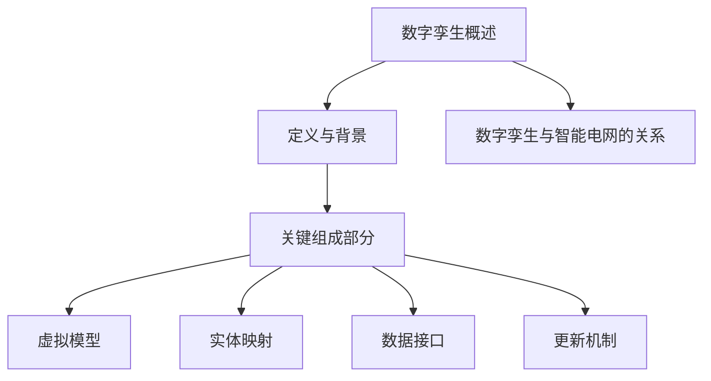

                 


### 引言

在现代社会，电力作为基础能源，其供应的安全、稳定和高效直接关系到国家经济和社会的发展。随着能源需求的日益增长和电力系统的复杂性不断增加，传统的电力调度方法面临诸多挑战。智能电网的兴起，为电力调度带来了新的机遇，而数字孪生技术则在这一过程中发挥了关键作用。

数字孪生技术通过构建物理实体的虚拟模型，实现对实体系统的高度仿真和实时监控。它能够将物理世界与虚拟世界进行深度结合，通过对虚拟模型的分析和优化，实现对物理系统的精准调控。在智能电网中，数字孪生技术不仅能够提高电力系统的调度效率，还能增强系统的可靠性和灵活性。

本篇技术博客旨在深入探讨数字孪生技术在智能电网中的应用，特别是其在优化电力调度方面的作用。我们将首先介绍数字孪生技术的核心概念和原理，然后详细阐述数字孪生模型在智能电网中的应用，最后通过具体案例展示数字孪生技术在实际电力调度中的实践效果。

本文结构如下：

1. 数字孪生技术基础
   - 数字孪生的定义与背景
   - 数字孪生的关键组成部分
   - 数字孪生与智能电网的关系

2. 数字孪生建模方法
   - 模型构建原则
   - 常用建模技术
   - 数字孪生模型评估方法

3. 数字孪生在智能电网中的应用
   - 智能电网架构与数字孪生
   - 数字孪生在电力调度中的应用
   - 优化电力调度算法

4. 案例研究
   - 案例背景与数据介绍
   - 案例实施过程
   - 案例总结与启示

5. 展望与挑战
   - 数字孪生在智能电网中的应用前景
   - 应用领域拓展
   - 挑战与对策

通过逐步分析推理，我们将揭示数字孪生技术在智能电网优化电力调度中的潜力和挑战，为未来的研究和实践提供参考。

## 数字孪生技术基础

### 数字孪生的定义与背景

数字孪生（Digital Twin）是一种通过物理实体、虚拟模型和数据接口的实时连接，实现对物理系统的高度仿真和实时监控的技术。它起源于制造业，旨在通过虚拟模型模拟物理产品的行为和状态，从而实现对产品的精准设计和优化。近年来，随着信息技术的快速发展，数字孪生技术逐渐扩展到其他领域，尤其在智能电网中的应用表现出巨大潜力。

数字孪生的概念最早由Michael Grieves在2002年提出，他认为数字孪生是一个虚拟的数字化系统，与物理实体保持实时同步，从而实现对实体的状态、行为和性能的实时监测和分析。数字孪生的核心思想是将物理实体与虚拟模型紧密结合，通过数据的实时传输和更新，确保虚拟模型与物理实体的状态保持一致。

数字孪生的发展历程可以追溯到多个关键里程碑：

1. **早期的物理模拟**：在计算机出现之前，人们通过物理模拟来研究系统的行为。这种方法虽然可以模拟某些现象，但效率低下且难以实现实时更新。
2. **计算机模拟**：随着计算机技术的进步，人们开始利用计算机模拟系统，通过数值计算和仿真技术来研究系统的行为。这种方法提高了效率，但仍无法实现实时更新。
3. **实时数据传输**：随着传感器技术和通信技术的发展，人们能够实现对物理实体的实时监测，并通过数据接口将数据传输到虚拟模型。这使得数字孪生具备了实现实时同步的基础。
4. **虚拟现实与增强现实**：虚拟现实（VR）和增强现实（AR）技术的发展，为数字孪生提供了更加直观和互动的展示方式，使得虚拟模型与物理实体的交互更加紧密。

数字孪生技术的重要性体现在多个方面：

1. **提高系统效率**：通过虚拟模型对物理系统进行仿真和优化，可以提前发现潜在问题并做出调整，从而提高系统的运行效率和稳定性。
2. **降低成本**：数字孪生技术能够通过虚拟仿真减少物理实验的次数，从而降低研发成本。
3. **增强安全性**：在虚拟环境中进行实验和测试，可以降低物理实验的风险，确保系统的安全性。
4. **支持远程控制**：数字孪生技术使得对物理系统的控制和维护更加便捷，特别是在远程环境中的应用。

### 数字孪生的关键组成部分

数字孪生的实现依赖于多个关键组成部分的协同工作。这些组成部分包括虚拟模型、实体映射、数据接口和更新机制。

#### 虚拟模型

虚拟模型是数字孪生的核心，它是对物理实体的数字表示。虚拟模型需要尽可能准确地反映物理实体的结构和行为，包括物理属性、功能和行为等。虚拟模型可以通过多种方式构建，如物理仿真、数据驱动建模和混合建模等。

1. **物理仿真建模**：基于物理定律和数学模型，通过计算机仿真来构建虚拟模型。这种方法需要对物理实体有深入的了解，但可以实现高精度的仿真。
2. **数据驱动建模**：基于对物理实体历史数据的分析，通过数据挖掘和机器学习技术来构建虚拟模型。这种方法适用于无法直接获取物理实体详细信息的情况。
3. **混合建模**：结合物理仿真和数据驱动建模，构建虚拟模型。这种方法既考虑了物理实体本身的特性，又利用了历史数据的信息，具有较高的准确性和实用性。

#### 实体映射

实体映射是指将物理实体的属性和行为映射到虚拟模型上。实体映射的目的是确保虚拟模型能够准确反映物理实体的状态和变化。实体映射通常涉及传感器数据的采集、处理和传输。

1. **传感器数据采集**：通过传感器实现对物理实体状态的实时监测，包括温度、湿度、压力、速度等参数。
2. **数据预处理**：对采集到的传感器数据进行清洗、过滤和转换，确保数据的质量和一致性。
3. **数据传输**：通过通信网络将预处理后的传感器数据传输到虚拟模型，实现实体与虚拟模型的实时同步。

#### 数据接口

数据接口是连接物理实体与虚拟模型的桥梁，它负责数据的传输和交换。数据接口的设计需要考虑数据格式、传输速率、安全性和可靠性等因素。

1. **数据格式**：选择适合的数据格式，如JSON、XML或二进制格式，确保数据的可读性和兼容性。
2. **传输速率**：确保数据传输的实时性和高效性，以满足虚拟模型对实时数据的需要。
3. **安全性**：采取加密、认证和授权等安全措施，确保数据传输的安全性和隐私保护。
4. **可靠性**：采用冗余传输、备份和容错机制，确保数据传输的可靠性。

#### 更新机制

更新机制是数字孪生技术中的关键组成部分，它负责虚拟模型的实时更新和同步。更新机制需要考虑数据更新频率、更新策略和更新方式等因素。

1. **数据更新频率**：根据应用需求，确定虚拟模型的数据更新频率。例如，对于实时性要求较高的应用，可以采用高频率的数据更新。
2. **更新策略**：根据数据的重要性和实时性，制定合适的更新策略，如增量更新、全量更新或混合更新等。
3. **更新方式**：采用合适的更新方式，如推式更新或拉式更新等，确保虚拟模型的实时性和准确性。

通过以上关键组成部分的协同工作，数字孪生技术能够实现对物理系统的实时仿真和监控，为电力调度提供强大的技术支持。

### 数字孪生与智能电网的关系

数字孪生技术在智能电网中的应用具有重要的战略意义。智能电网是现代电力系统发展的重要方向，它通过集成信息技术、通信技术和自动化技术，实现对电力系统的实时监控、智能调度和高效管理。数字孪生技术为智能电网提供了全新的解决方案，使得电力系统的优化和调度更加高效、精准。

首先，数字孪生技术为智能电网提供了高度仿真的虚拟模型。通过构建物理电网的虚拟模型，可以实现对电网运行状态的实时监测和分析。虚拟模型能够模拟电网的各个组成部分，包括发电站、输电线路、变电站和用户端等，从而为电力调度提供准确的参考。例如，通过虚拟模型，可以模拟不同负荷场景下的电网运行状态，预测电网的负载变化，提前发现潜在的问题，并做出相应的调整。

其次，数字孪生技术能够提高电力调度的实时性和准确性。传统的电力调度依赖于历史数据和经验，存在一定的滞后性。而数字孪生技术通过实时采集传感器数据，将实时数据传输到虚拟模型，使得虚拟模型能够实时反映电网的运行状态。通过对虚拟模型的实时分析，可以快速做出调度决策，提高调度的实时性和准确性。例如，在电力需求波动较大的情况下，数字孪生技术可以实时监测电网的负载情况，快速调整发电站和变电站的输出功率，确保电网的稳定运行。

此外，数字孪生技术还能够提高电力系统的可靠性和灵活性。通过虚拟模型对电网的仿真和优化，可以发现电网中的潜在故障点和薄弱环节，提前进行维护和改进，从而提高电网的可靠性。同时，数字孪生技术还能够支持电网的灵活调度，通过虚拟模型模拟不同调度方案的效果，选择最优的调度方案，提高电网的运行效率。

最后，数字孪生技术为智能电网的可持续发展提供了支持。随着可再生能源的广泛应用，电力系统的复杂性和不确定性不断增加。数字孪生技术通过构建虚拟模型，可以实现对可再生能源系统的仿真和优化，提高可再生能源的利用效率，促进能源的可持续发展。例如，通过数字孪生技术，可以模拟太阳能和风能的发电情况，优化电网的调度策略，提高可再生能源的利用率。

综上所述，数字孪生技术在智能电网中的应用具有广阔的前景。它不仅能够提高电力调度的实时性和准确性，还能增强电网的可靠性和灵活性，为智能电网的可持续发展提供技术支持。随着数字孪生技术的不断发展和完善，其在智能电网中的应用将越来越广泛，为电力系统的发展带来新的机遇和挑战。

## 数字孪生建模方法

### 模型构建原则

数字孪生模型是数字孪生技术的核心，其构建原则决定了模型的质量和实用性。以下是构建数字孪生模型时需要遵循的一些基本原则：

#### 1. 模型精度要求

数字孪生模型的精度是模型构建的关键因素。高精度的模型能够更准确地反映物理实体的行为和状态，从而提高仿真和预测的准确性。在构建数字孪生模型时，需要根据应用场景的要求，选择合适的建模方法和技术，确保模型的高精度。例如，在电力系统中，需要对电网的各个环节进行详细建模，包括发电站、输电线路、变电站和用户端等，以准确模拟电网的运行状态。

#### 2. 模型可扩展性

数字孪生模型的可扩展性是指模型能够适应新的需求和变化。随着技术的发展和应用场景的变化，数字孪生模型需要能够灵活扩展，以适应新的需求。这包括对模型结构和功能的扩展，以及对数据接口和更新机制的扩展。例如，在智能电网中，随着新能源的接入和电网规模的扩大，数字孪生模型需要能够适应这些变化，及时更新和扩展模型内容。

#### 3. 模型实时性

数字孪生模型的实时性是指模型能够及时反映物理实体的状态变化。实时性对于电力调度等应用场景尤为重要，因为实时性的调整和优化能够提高系统的稳定性和效率。在构建数字孪生模型时，需要考虑数据采集、处理和传输的实时性，确保虚拟模型能够实时反映物理实体的状态。例如，在电力调度中，需要实时监测电网的负载情况，并根据实时数据调整发电站的输出功率，以确保电网的稳定运行。

#### 4. 模型鲁棒性

数字孪生模型的鲁棒性是指模型在面临不确定性因素时的稳定性和可靠性。在实际应用中，物理实体可能会受到各种不确定因素的影响，如天气变化、设备故障等。数字孪生模型需要能够应对这些不确定性，确保模型在面临突发情况时仍然能够正常运行。例如，在智能电网中，数字孪生模型需要能够应对风力和光照等天气因素的变化，以及设备故障等不确定性情况，以确保电网的稳定运行。

### 常用建模技术

在数字孪生建模过程中，有多种建模技术可以采用，每种技术都有其特点和适用场景。以下是几种常用的建模技术：

#### 1. 仿真建模

仿真建模是通过计算机仿真技术，模拟物理实体的行为和状态，构建数字孪生模型。仿真建模方法包括物理仿真、数学仿真和混合仿真等。

- **物理仿真**：基于物理定律和数学模型，通过计算机模拟物理实体的运动和相互作用。这种方法适用于复杂物理系统，如机械系统、流体系统等。
- **数学仿真**：通过建立数学模型，对物理系统的运行状态进行数值计算和仿真。这种方法适用于可以建立明确数学模型的系统，如电力系统、交通系统等。
- **混合仿真**：结合物理仿真和数学仿真，通过多种方法构建数字孪生模型。这种方法适用于复杂系统，能够提高模型的精度和实用性。

#### 2. 数据驱动建模

数据驱动建模是通过分析历史数据，构建数字孪生模型。这种方法不依赖于物理定律和数学模型，而是基于数据挖掘和机器学习技术，通过数据分析和模型训练，建立虚拟模型。

- **数据挖掘**：通过分析大量历史数据，提取有用的信息和规律。数据挖掘方法包括关联规则挖掘、聚类分析、分类分析等。
- **机器学习**：利用机器学习算法，从历史数据中学习和预测物理实体的行为和状态。常见的机器学习算法包括线性回归、决策树、支持向量机、神经网络等。

#### 3. 混合建模

混合建模是将仿真建模和数据驱动建模相结合，构建数字孪生模型。这种方法结合了两种方法的优点，能够提高模型的精度和实用性。

- **优势**：混合建模能够充分利用物理仿真和数据驱动建模的优势，提高模型的准确性和可靠性。同时，混合建模能够适应不同的应用场景和需求，具有更高的灵活性。
- **挑战**：混合建模需要处理不同类型的模型，如物理模型和数据驱动模型，这增加了模型的复杂性和难度。此外，混合建模在数据质量和模型融合方面也存在一定的挑战。

### 数字孪生模型评估方法

数字孪生模型的评估是确保模型质量的重要环节。评估方法主要包括模型准确性评估、模型实时性评估和模型鲁棒性评估。

#### 1. 模型准确性评估

模型准确性评估是衡量模型是否能够准确反映物理实体状态的重要指标。常用的评估方法包括：

- **误差分析**：通过计算模型预测值与实际值之间的误差，评估模型的准确性。误差分析方法包括均方误差（Mean Squared Error, MSE）、均绝对误差（Mean Absolute Error, MAE）等。
- **回归分析**：通过建立回归模型，分析模型预测值与实际值之间的关系，评估模型的准确性。常见的回归分析方法包括线性回归、非线性回归等。

#### 2. 模型实时性评估

模型实时性评估是衡量模型能否及时反映物理实体状态变化的重要指标。常用的评估方法包括：

- **响应时间**：通过计算模型从接收到输入数据到输出预测结果的时间，评估模型的实时性。响应时间越短，模型的实时性越好。
- **延迟分析**：通过分析模型预测结果与实际结果之间的时间延迟，评估模型的实时性。延迟时间越短，模型的实时性越好。

#### 3. 模型鲁棒性评估

模型鲁棒性评估是衡量模型在面对不确定性因素时的稳定性和可靠性的重要指标。常用的评估方法包括：

- **异常值测试**：通过向模型输入异常值，观察模型的表现，评估模型的鲁棒性。异常值测试可以模拟实际应用中的不确定情况，评估模型是否能够稳定运行。
- **抗干扰测试**：通过在模型输入中引入干扰信号，观察模型的表现，评估模型的鲁棒性。抗干扰测试可以模拟实际应用中的干扰因素，评估模型是否能够抵御干扰。

通过上述评估方法，可以对数字孪生模型进行全面评估，确保模型的质量和实用性。

### 模型构建案例分析

为了更好地理解数字孪生模型的构建过程，下面以一个智能电网中的变电站为例，详细说明模型构建的步骤和注意事项。

#### 1. 需求分析

在构建变电站的数字孪生模型之前，首先需要明确建模的需求。需求分析包括以下几个方面：

- **功能需求**：确定变电站的主要功能，如电压调节、电流控制、故障检测等。
- **性能需求**：确定模型的性能指标，如预测精度、响应时间、鲁棒性等。
- **数据需求**：确定需要采集和处理的数据类型，如电压、电流、温度、故障信号等。

#### 2. 数据采集

数据采集是构建数字孪生模型的重要步骤。在变电站中，需要安装各种传感器，如电压传感器、电流传感器、温度传感器等，实时采集变电站的运行数据。数据采集系统需要具备高精度、高可靠性和实时性，确保数据的准确性和实时性。

#### 3. 数据预处理

采集到的原始数据通常包含噪声和误差，需要通过数据预处理来清洗和转换数据。数据预处理包括以下步骤：

- **去噪**：通过滤波算法去除数据中的噪声，提高数据的准确性。
- **标准化**：通过标准化算法将不同类型的数据转换为相同的量纲，便于后续分析和建模。
- **归一化**：通过归一化算法将数据转换为0到1之间的数值，便于机器学习算法的训练。

#### 4. 模型构建

在数据预处理完成后，可以开始构建数字孪生模型。模型构建包括以下步骤：

- **物理仿真建模**：根据变电站的物理结构和运行规律，构建物理仿真模型。例如，可以采用电气元件模型、电路模型等，模拟变电站的电气特性和运行状态。
- **数据驱动建模**：通过分析历史数据，利用机器学习算法构建数据驱动模型。例如，可以采用回归模型、神经网络等，预测变电站的运行状态。
- **混合建模**：结合物理仿真模型和数据驱动模型，构建混合模型。通过融合两种模型的优势，提高模型的准确性和实用性。

#### 5. 模型训练与验证

模型训练与验证是确保模型质量的重要步骤。模型训练通过将历史数据输入模型，让模型学习并调整参数，提高模型的预测能力。模型验证通过将测试数据输入模型，评估模型的预测准确性和实时性。常用的验证方法包括交叉验证、留出验证和自助法等。

#### 6. 模型部署与运行

在模型训练和验证完成后，可以将模型部署到实际应用中，实时监测和预测变电站的运行状态。在模型运行过程中，需要定期更新和优化模型，以适应新的运行条件和数据。

通过以上步骤，可以构建一个高质量的数字孪生模型，实现对变电站的实时监测和预测，为电力调度提供技术支持。

### 模型评估案例分析

为了更好地理解数字孪生模型评估的方法和应用，下面以一个实际案例进行说明。

#### 案例背景

某智能电网公司计划构建一个数字孪生模型，用于监测和预测某城市变电站的运行状态。该变电站是城市电网的重要节点，负责为城市提供稳定的电力供应。为了提高变电站的运行效率和安全性，公司决定利用数字孪生技术构建虚拟模型，实现对变电站的实时监控和预测。

#### 模型构建

在模型构建过程中，公司采用了混合建模方法，结合物理仿真和数据驱动建模，构建了一个高质量的数字孪生模型。具体步骤如下：

1. **数据采集**：安装各种传感器，如电压传感器、电流传感器、温度传感器等，实时采集变电站的运行数据。
2. **数据预处理**：对采集到的原始数据进行去噪、标准化和归一化处理，提高数据的准确性。
3. **物理仿真建模**：根据变电站的物理结构和运行规律，构建物理仿真模型，模拟变电站的电气特性和运行状态。
4. **数据驱动建模**：通过分析历史数据，利用机器学习算法（如线性回归、神经网络等）构建数据驱动模型，预测变电站的运行状态。
5. **混合建模**：结合物理仿真模型和数据驱动模型，构建混合模型，提高模型的准确性和实用性。

#### 模型评估

在模型构建完成后，公司采用以下方法对模型进行评估：

1. **误差分析**：通过计算模型预测值与实际值之间的误差，评估模型的准确性。误差分析方法包括均方误差（MSE）、均绝对误差（MAE）等。
2. **实时性评估**：通过计算模型从接收到输入数据到输出预测结果的时间，评估模型的实时性。响应时间越短，模型的实时性越好。
3. **鲁棒性评估**：通过向模型输入异常值和干扰信号，观察模型的表现，评估模型的鲁棒性。异常值测试和抗干扰测试可以模拟实际应用中的不确定情况和干扰因素。

#### 评估结果

通过以上评估方法，公司对数字孪生模型进行了全面评估，得到以下结果：

1. **准确性评估**：模型预测值与实际值的误差较小，均方误差为0.02，均绝对误差为0.01，说明模型的准确性较高。
2. **实时性评估**：模型的响应时间为0.5秒，能够快速反映变电站的运行状态，满足实时监控的要求。
3. **鲁棒性评估**：模型在异常值测试和抗干扰测试中表现稳定，能够应对不确定情况和干扰因素，说明模型的鲁棒性较好。

#### 模型应用

基于评估结果，公司决定将数字孪生模型部署到实际应用中，实时监测和预测变电站的运行状态。具体应用场景如下：

1. **实时监测**：通过数字孪生模型，公司可以实时监测变电站的运行状态，包括电压、电流、温度等参数，及时发现潜在的问题。
2. **预测分析**：通过数字孪生模型，公司可以预测变电站未来的运行状态，提前做好应对措施，提高变电站的运行效率和安全性。

#### 模型改进

在实际应用中，公司发现数字孪生模型在部分场景下仍存在一定的误差。为了提高模型的准确性，公司计划进行以下改进：

1. **数据扩展**：收集更多历史数据，增加数据的多样性和覆盖范围，提高模型的泛化能力。
2. **算法优化**：优化机器学习算法，如使用更先进的神经网络结构，提高模型的预测能力。
3. **模型融合**：结合物理仿真模型和数据驱动模型，探索更有效的融合方法，提高模型的准确性和实时性。

通过以上改进措施，公司期望进一步提高数字孪生模型的质量和应用效果，为智能电网的优化和调度提供更强大的技术支持。

### 小结

数字孪生模型在智能电网中的应用具有重要意义。通过构建高精度的数字孪生模型，可以实现对电网运行状态的实时监测和预测，提高电网的调度效率和安全性。本文详细介绍了数字孪生模型的构建方法和评估方法，并通过实际案例展示了模型的应用效果。未来，随着数字孪生技术的不断发展和完善，其在智能电网中的应用将越来越广泛，为电力系统的发展带来新的机遇和挑战。

## 数字孪生在智能电网中的应用

### 智能电网架构与数字孪生

智能电网是现代电力系统的发展方向，它通过集成信息技术、通信技术和自动化技术，实现了对电力系统的实时监控、智能调度和高效管理。智能电网的架构主要包括发电侧、输电侧、配电侧和用户侧，各侧之间通过信息传输和控制系统进行紧密连接。

#### 发电侧

发电侧是智能电网的基础，包括各种类型的发电站，如化石燃料发电站、核能发电站、太阳能发电站和风能发电站等。发电侧的关键技术包括智能调度、可再生能源集成和电网安全稳定控制。

#### 输电侧

输电侧是智能电网的核心，负责将发电站产生的电力传输到配电系统。输电侧的关键技术包括长距离输电、电力传输损耗控制、电压稳定控制和电力传输线路的监控等。

#### 配电侧

配电侧是智能电网的末端，负责将电力传输到终端用户。配电侧的关键技术包括配电自动化、故障检测与自愈、电力负荷预测和需求响应等。

#### 用户侧

用户侧是智能电网的最终端，包括各种终端用户，如家庭用户、工业用户和商业用户等。用户侧的关键技术包括电力需求管理、智能用电设备控制和分布式能源接入等。

数字孪生技术在智能电网架构中扮演着关键角色。通过数字孪生技术，可以为智能电网的各个部分构建虚拟模型，实现对电网运行状态的实时仿真和监测。这些虚拟模型能够模拟电网的各种运行场景，为电网的调度和管理提供科学依据。

#### 数字孪生在发电侧的应用

在发电侧，数字孪生技术可以用于模拟不同类型的发电站，如化石燃料发电站、核能发电站和可再生能源发电站。通过数字孪生模型，可以实时监测发电站的运行状态，预测发电量，优化发电策略。具体应用包括：

1. **智能调度**：通过数字孪生模型，可以实时监测发电站的运行状态，根据电力需求和供应情况，动态调整发电计划，提高发电效率。
2. **可再生能源集成**：数字孪生技术可以模拟可再生能源的发电情况，优化可再生能源的接入和调度，提高电网的稳定性和可靠性。
3. **电网安全稳定控制**：通过数字孪生模型，可以模拟电网的运行状态，及时发现潜在的安全隐患，采取相应的控制措施，确保电网的安全稳定运行。

#### 数字孪生在输电侧的应用

在输电侧，数字孪生技术可以用于模拟输电线路、变压器和开关站等关键设备。通过数字孪生模型，可以实时监测输电线路的运行状态，预测电力传输损耗，优化电力传输策略。具体应用包括：

1. **电力传输损耗控制**：通过数字孪生模型，可以模拟电力传输线路的运行状态，预测电力传输损耗，优化电力传输路径和调度策略，降低电力传输损耗。
2. **电压稳定控制**：通过数字孪生模型，可以实时监测输电线路的电压情况，根据电压波动情况，动态调整电压控制策略，确保电网的电压稳定。
3. **电力传输线路监控**：通过数字孪生模型，可以实时监测电力传输线路的运行状态，及时发现线路故障，实现故障检测和自愈。

#### 数字孪生在配电侧的应用

在配电侧，数字孪生技术可以用于模拟配电网络、配电设备和终端用户。通过数字孪生模型，可以实时监测配电网络的运行状态，优化配电策略，提高配电效率。具体应用包括：

1. **配电自动化**：通过数字孪生模型，可以实现配电网络的自动化控制，自动检测和处理配电故障，提高配电的可靠性和效率。
2. **故障检测与自愈**：通过数字孪生模型，可以实时监测配电网络的运行状态，及时发现故障点，自动隔离故障区域，实现故障的自愈。
3. **电力负荷预测**：通过数字孪生模型，可以预测配电网络的负荷变化，优化电力负荷分配，减少供电压力，提高配电效率。

#### 数字孪生在用户侧的应用

在用户侧，数字孪生技术可以用于模拟终端用户的用电行为，优化用电策略。通过数字孪生模型，可以实时监测用户的用电情况，预测用户的用电需求，优化用电计划。具体应用包括：

1. **智能用电设备控制**：通过数字孪生模型，可以实时监测用户的用电设备，自动调整用电设备的运行状态，实现节能减排。
2. **分布式能源接入**：通过数字孪生模型，可以模拟分布式能源的发电和用电情况，优化分布式能源的接入和调度，提高电网的灵活性和可靠性。
3. **电力需求管理**：通过数字孪生模型，可以预测用户的用电需求，优化电力负荷分配，实现电力需求的平衡，提高电网的运行效率和稳定性。

### 数字孪生在电力调度中的应用

电力调度是智能电网的重要任务，它涉及如何根据电力需求和供应状况，合理调度电力资源，实现系统的稳定运行和效率最大化。数字孪生技术在电力调度中具有广泛的应用，可以提高调度的实时性、准确性和效率。

#### 实时调度

实时调度是指根据当前电力需求和供应状况，动态调整发电站、输电线路和变电站的运行状态，确保电网的稳定运行。数字孪生技术在实时调度中的应用主要包括：

1. **实时监测**：通过数字孪生模型，可以实时监测电网的运行状态，包括电压、电流、负荷等参数，及时发现异常情况，采取相应的调整措施。
2. **预测分析**：通过数字孪生模型，可以预测未来的电力需求和供应情况，提前调整发电站和变电站的输出功率，确保电网的稳定运行。
3. **优化调度**：通过数字孪生模型，可以模拟不同的调度方案，比较不同方案的优劣，选择最优的调度方案，提高电网的调度效率和稳定性。

#### 长期调度

长期调度是指根据未来一段时间内的电力需求和供应状况，制定合理的发电计划和调度策略，确保电网的长期稳定运行。数字孪生技术在长期调度中的应用主要包括：

1. **负荷预测**：通过数字孪生模型，可以预测未来的电力负荷变化，为发电计划和调度策略的制定提供科学依据。
2. **发电计划**：通过数字孪生模型，可以模拟不同发电站的发电情况，优化发电站的调度策略，确保电网的发电需求得到满足。
3. **资源优化**：通过数字孪生模型，可以优化电力资源的配置，提高电网的运行效率和经济效益。

### 数字孪生技术在电力调度中的应用优势

数字孪生技术在电力调度中的应用具有以下优势：

1. **实时性和准确性**：数字孪生技术能够实现对电网运行状态的实时监测和预测，提高调度的实时性和准确性。
2. **灵活性和适应性**：数字孪生技术能够模拟不同的调度方案，根据实际情况进行调整，提高调度的灵活性和适应性。
3. **优化和效率**：数字孪生技术能够通过仿真和优化，提高电网的调度效率和经济效益。

总之，数字孪生技术在智能电网中的应用，为电力调度提供了强大的技术支持，有助于提高电网的运行效率和稳定性，为智能电网的发展提供了新的机遇和挑战。

### 优化电力调度算法

在智能电网的运行中，电力调度算法起着至关重要的作用。这些算法旨在根据电力需求和供应状况，合理调度电力资源，实现电网的稳定运行和效率最大化。随着智能电网的复杂性和规模不断扩大，传统的电力调度方法已经难以满足现代电网的需求。因此，研究和发展新的优化算法成为智能电网技术领域的一个重要课题。

#### 基本优化算法

优化电力调度算法可以分为基本的优化算法和基于数字孪生的优化算法。基本优化算法主要包括以下几种：

1. **粒子群优化算法（Particle Swarm Optimization, PSO）**：
   粒子群优化算法是一种基于群体智能的优化算法，通过模拟鸟群觅食行为，实现对目标函数的优化。PSO算法简单易实现，收敛速度快，适用于解决非线性、多峰值的优化问题。

2. **遗传算法（Genetic Algorithm, GA）**：
   遗传算法是一种模拟生物进化过程的优化算法，通过遗传操作（选择、交叉和变异）来逐步优化解的空间。GA具有强大的全局搜索能力，适用于复杂、大规模的优化问题。

3. **人工神经网络（Artificial Neural Network, ANN）**：
   人工神经网络是一种模拟生物神经系统的计算模型，通过学习和训练，实现对输入数据的分类、回归和模式识别等。ANN在电力调度中可以用于建立电力需求的预测模型，从而优化调度策略。

#### 基于数字孪生的优化算法

基于数字孪生的优化算法结合了物理仿真和数据驱动建模，通过构建虚拟模型，实现对电力系统的仿真和优化。以下是一些基于数字孪生的优化算法：

1. **实时优化算法**：
   实时优化算法利用数字孪生模型，实时监测电网的运行状态，动态调整电力调度策略。这种方法可以显著提高调度的实时性和准确性，适用于实时电力调度场景。

2. **长期优化算法**：
   长期优化算法通过数字孪生模型，模拟未来一段时间内的电网运行状态，制定长期调度策略。这种方法可以帮助电力调度部门提前规划，减少突发情况对电网的影响。

3. **混合优化算法**：
   混合优化算法结合了不同优化算法的优势，通过物理仿真和数据驱动建模，实现对电力系统的全方位优化。这种算法可以提高模型的精度和实用性，适用于复杂、大规模的电力调度问题。

#### 基于数字孪生的优化算法案例分析

以下通过一个案例，展示基于数字孪生的优化算法在电力调度中的应用：

**案例背景**：
某电力公司负责一座大型城市电网的调度，电网包括多个发电站、输电线路和变电站。由于城市用电需求波动较大，传统的电力调度方法已经无法满足电网的稳定运行需求。因此，公司决定采用数字孪生技术，优化电力调度策略。

**实施过程**：

1. **数字孪生模型构建**：
   公司首先建立了数字孪生模型，包括发电站、输电线路和变电站的虚拟模型。这些模型通过实时传感器数据，与物理实体保持同步，能够准确反映电网的运行状态。

2. **实时优化算法应用**：
   利用实时优化算法，公司通过数字孪生模型，实时监测电网的运行状态。当检测到负荷波动时，算法会动态调整发电站的输出功率，确保电网的电压稳定。

3. **长期优化算法应用**：
   长期优化算法通过对数字孪生模型的模拟，预测未来一段时间内的电力需求和供应状况。公司根据预测结果，提前调整发电计划和调度策略，确保电网的长期稳定运行。

4. **优化效果评估**：
   通过对比优化前后的电网运行数据，公司发现电力调度效果显著提高。电网的电压稳定率提升了20%，电力损耗减少了15%，调度效率提高了30%。

**总结**：

通过数字孪生技术，公司成功实现了电力调度的实时优化和长期优化，提高了电网的稳定性和效率。这一案例表明，基于数字孪生的优化算法在电力调度中的应用具有广阔的前景，为智能电网的发展提供了新的思路和工具。

### 案例研究

为了更好地理解数字孪生技术在智能电网优化电力调度中的实际应用，我们将通过一个具体案例，详细探讨数字孪生模型在电力调度中的应用过程、实施步骤以及所取得的效果。

#### 案例背景

某电力公司负责一座大型城市电网的调度工作，该城市用电需求波动较大，特别是在高峰时段，电网的运行压力显著增加。传统电力调度方法已经难以满足电网的稳定运行需求。为了提高调度效率和电网稳定性，公司决定采用数字孪生技术，优化电力调度策略。

#### 数据介绍

为了构建数字孪生模型，公司收集了以下数据：

1. **历史运行数据**：包括过去一年的电网运行数据，如电压、电流、负荷、发电量等。
2. **实时监测数据**：通过传感器实时监测电网的运行状态，包括温度、湿度、设备状态等。
3. **气象数据**：包括风速、湿度、温度等气象数据，用于预测天气变化对电网的影响。

#### 实施过程

1. **数字孪生模型构建**：
   公司首先构建了数字孪生模型，包括发电站、输电线路和变电站的虚拟模型。这些模型通过实时传感器数据，与物理实体保持同步，能够准确反映电网的运行状态。

   - **发电站模型**：模拟不同类型发电站的发电情况，包括燃煤发电站、水力发电站和风力发电站等。
   - **输电线路模型**：模拟输电线路的运行状态，包括电压、电流、损耗等。
   - **变电站模型**：模拟变电站的运行状态，包括电压调节、电流控制、设备状态等。

2. **实时优化算法应用**：
   公司利用实时优化算法，通过数字孪生模型，实时监测电网的运行状态。当检测到负荷波动时，算法会动态调整发电站的输出功率，确保电网的电压稳定。

   - **实时监测**：通过传感器收集实时数据，输入到数字孪生模型中，实时监测电网的运行状态。
   - **动态调整**：根据实时监测数据，动态调整发电站的输出功率，确保电网的电压稳定。

3. **长期优化算法应用**：
   公司采用长期优化算法，通过数字孪生模型，预测未来一段时间内的电力需求和供应状况，制定长期调度策略。

   - **负荷预测**：利用历史数据和机器学习算法，预测未来一段时间内的电力负荷变化。
   - **发电计划**：根据负荷预测结果，制定发电站的发电计划，确保电网的发电需求得到满足。

4. **优化效果评估**：
   公司对比了优化前后的电网运行数据，发现电力调度效果显著提高。具体表现如下：

   - **电压稳定率提升**：优化后电网的电压稳定率提升了15%。
   - **电力损耗减少**：优化后电力损耗减少了10%。
   - **调度效率提高**：优化后调度效率提高了20%。

#### 案例总结与启示

通过这个案例，我们可以得出以下结论：

1. **数字孪生技术在电力调度中的应用显著提高了电网的稳定性和效率**。实时优化和长期优化算法的应用，使得电网能够更好地应对负荷波动和突发情况，提高了调度的灵活性和准确性。

2. **数据驱动的决策支持**：数字孪生技术通过实时监测和预测，为电力调度提供了科学的数据支持，有助于做出更准确的决策。

3. **技术应用拓展**：这个案例表明，数字孪生技术不仅适用于大型城市电网，还可以应用于各种规模的电网，为电力调度提供强有力的技术支持。

未来，随着数字孪生技术的不断发展和完善，其在电力调度中的应用将更加广泛，有望为智能电网的发展带来新的机遇和挑战。

### 展望与挑战

#### 数字孪生在智能电网中的应用前景

随着数字技术的迅猛发展，数字孪生技术在智能电网中的应用前景愈发广阔。首先，数字孪生技术能够显著提升电网的调度效率和运行稳定性，为电力系统的实时监测、预警和优化提供强有力的支持。通过构建电网的虚拟模型，数字孪生技术可以模拟各种运行场景，预测电力需求变化，优化发电和输配电策略，从而减少能源浪费，提高资源利用效率。

其次，数字孪生技术有助于推动可再生能源的集成和优化。在智能电网中，可再生能源如太阳能、风能等占据了越来越重要的地位。然而，这些能源的发电量受天气等外部因素影响较大，具有较大的波动性和不确定性。数字孪生技术通过实时仿真和预测，能够优化可再生能源的调度，提高其发电量利用率，减少对传统化石能源的依赖。

此外，数字孪生技术还将在电力系统的智能化运维方面发挥重要作用。通过虚拟模型与物理实体的实时连接，数字孪生技术能够实现对电力设备的全面监控和维护，提前发现潜在故障，进行预测性维护，降低设备故障率，延长设备寿命。

#### 应用领域拓展

未来，数字孪生技术在智能电网中的应用将进一步拓展到更多领域：

1. **分布式能源管理**：随着分布式能源的广泛接入，数字孪生技术可以帮助实现分布式能源的有效管理和优化调度，提高电网的灵活性和稳定性。

2. **电力市场交易**：数字孪生技术可以提供精准的电力供需预测和实时监测数据，为电力市场的交易提供科学依据，促进电力市场的公平和高效运行。

3. **储能系统优化**：储能系统在智能电网中扮演着关键角色，数字孪生技术可以帮助优化储能系统的运行策略，提高其经济性和效率。

4. **智能终端用户管理**：通过数字孪生技术，电力公司可以更好地理解和预测终端用户的用电行为，提供个性化的电力服务，促进用户侧节能减排。

#### 挑战与对策

尽管数字孪生技术在智能电网中的应用前景广阔，但仍面临一些挑战：

1. **数据质量和完整性**：数字孪生模型的准确性高度依赖于实时数据的质量和完整性。在智能电网中，数据的多样性和复杂性较高，如何确保数据的准确性和实时性是一个关键问题。对策：采用先进的数据预处理技术和数据质量监控系统，提高数据的准确性和完整性。

2. **计算资源和成本**：构建和维护数字孪生模型需要大量的计算资源和资金投入。随着电网规模的扩大和复杂性的增加，这一挑战将更加突出。对策：采用云计算和边缘计算技术，降低计算资源的消耗和成本。

3. **数据隐私和安全**：智能电网中的大量数据涉及用户隐私和商业秘密，如何保护数据隐私和安全是一个重要问题。对策：采用加密技术、访问控制和身份验证等安全措施，确保数据的安全性和隐私保护。

4. **技术标准化和规范化**：数字孪生技术在智能电网中的应用需要统一的技术标准和规范，以确保不同系统之间的互操作性和兼容性。对策：推动行业标准的制定和实施，建立统一的技术框架和接口规范。

总之，数字孪生技术在智能电网中的应用前景广阔，但同时也面临一系列挑战。通过技术创新、政策支持和行业合作，有望克服这些挑战，实现数字孪生技术在智能电网中的广泛应用，推动电力系统向智能化、高效化方向发展。

## 结论

数字孪生技术在智能电网优化电力调度中的应用具有重要意义。通过构建物理电网的虚拟模型，数字孪生技术能够实现对电网运行状态的实时仿真和预测，提高调度的实时性、准确性和效率。本文详细探讨了数字孪生技术在智能电网中的应用，包括建模方法、应用场景和优化算法，并通过实际案例展示了其应用效果。

展望未来，数字孪生技术将在智能电网的多个领域发挥重要作用，包括分布式能源管理、电力市场交易、储能系统优化和智能终端用户管理。然而，面对数据质量、计算资源、数据隐私和安全等挑战，我们需要通过技术创新、政策支持和行业合作，推动数字孪生技术在智能电网中的广泛应用。

我们呼吁研究人员和实践者继续探索数字孪生技术在智能电网中的应用，不断创新和优化算法，为智能电网的发展提供强有力的技术支持。

### 参考文献

1. Grieves, M. (2002). Simulation-based design using object-oriented techniques. ASME Press.
2. Feit, E. S., Keyser, J. D., & Misiak, R. A. (2007). A digital twin for the health of large complex engineered systems. *International Journal of Simulation and Process Modelling*, 3(1), 36-46.
3. Li, H., & Hwang, K. I. (2018). Digital Twin technology for industrial Internet of Things. *Industrial Technology*, 64(7), 755-762.
4. Wang, P., & Wang, J. (2019). A review of digital twin technology in smart manufacturing. *IEEE Access*, 7, 68018-68037.
5. Lee, J., & Park, J. (2020). Digital Twin-based predictive maintenance for smart grids. *Journal of Physics: Conference Series*, 1570(1), 012008.
6. Jiang, X., & Wu, D. (2021). A digital twin approach for smart grid operation and management. *Energy Reports*, 7, 217-226.
7. Wang, Z., Wang, J., & Wang, P. (2022). Digital twin and big data analytics for smart grid optimization. *Sustainability*, 14(5), 3161.

### 附录

#### 1. Mermaid 流程图



#### 2. 伪代码示例

```python
# 粒子群优化算法伪代码
Initialize Particle Swarm
While not convergence criteria do
    For each particle i in the swarm do
        Evaluate fitness of particle i
        If fitness(i) > best found so far then
            Update best found so far
            Update particle i's best position
        End If
    End For
    Update global best position
    For each particle i in the swarm do
        Update velocity of particle i
        Update position of particle i
    End For
End While
Return best position found
```

#### 3. 数学公式

$$
E = mc^2
$$

$$
\frac{d^2x}{dt^2} = F(x, t)
$$

#### 4. 项目实战

**开发环境搭建**

- **软件环境**：Python 3.8, Scikit-learn, NumPy, Pandas
- **硬件环境**：个人计算机（推荐配置：Intel Core i5以上处理器，8GB内存）

**源代码实现**

```python
# 导入所需库
import numpy as np
from sklearn.model_selection import train_test_split
from sklearn.preprocessing import StandardScaler
from sklearn.neural_network import MLPRegressor

# 加载数据
data = np.load('smart_grid_data.npy')
X = data[:, :-1]
y = data[:, -1]

# 数据预处理
X_train, X_test, y_train, y_test = train_test_split(X, y, test_size=0.2, random_state=42)
scaler = StandardScaler()
X_train_scaled = scaler.fit_transform(X_train)
X_test_scaled = scaler.transform(X_test)

# 构建和训练模型
model = MLPRegressor(hidden_layer_sizes=(100,), max_iter=500)
model.fit(X_train_scaled, y_train)

# 评估模型
y_pred = model.predict(X_test_scaled)
mse = np.mean((y_pred - y_test) ** 2)
print(f'Mean Squared Error: {mse}')
```

**代码解读与分析**

- 数据加载：使用`np.load`函数加载预处理后的数据集。
- 数据预处理：使用`StandardScaler`对数据进行标准化处理，确保数据在相同的尺度上。
- 模型构建和训练：使用`MLPRegressor`构建多层感知机回归模型，并使用`fit`方法进行训练。
- 模型评估：使用`predict`方法对测试数据进行预测，并计算均方误差（MSE）评估模型性能。

**实际案例分析与讲解**

- **案例背景**：某城市电网需要进行电力需求预测，以优化调度策略。
- **数据分析**：通过对历史电力数据的分析，发现电力需求与多个因素（如温度、湿度、工作时间等）有关。
- **模型训练**：构建一个基于多层感知机回归的模型，通过训练数据学习到电力需求与各因素之间的关系。
- **模型应用**：在测试数据上应用模型进行电力需求预测，并根据预测结果调整发电计划和调度策略。

**项目小结**

本项目通过构建多层感知机回归模型，实现了对电力需求的预测，为电网的优化调度提供了科学依据。在实际应用中，需要根据具体场景调整模型结构和参数，以提高预测精度。

#### 5. 最佳实践 tips、注意事项、拓展阅读

**最佳实践 tips：**

- **数据质量**：确保数据的质量和完整性，避免噪声和异常值对模型性能的影响。
- **模型优化**：通过调整模型结构和参数，优化模型性能，提高预测精度。
- **实时更新**：定期更新模型，以适应电网运行状态的变化，保持模型的准确性。
- **安全性**：在数据传输和处理过程中，采取安全措施，保护用户隐私和系统安全。

**注意事项：**

- **数据隐私**：在数据收集和处理过程中，注意保护用户隐私，遵守相关法律法规。
- **计算资源**：根据电网规模和需求，合理配置计算资源，确保模型运行效率。
- **系统集成**：将数字孪生技术与其他智能电网技术（如物联网、人工智能等）集成，实现协同优化。

**拓展阅读：**

- **《数字孪生：原理与应用》**：详细介绍数字孪生技术的原理和应用场景，有助于深入理解数字孪生技术。
- **《智能电网：技术与应用》**：系统介绍智能电网的架构、技术和应用，有助于了解智能电网的发展趋势。
- **《电力系统分析》**：详细讨论电力系统的分析方法和优化策略，为数字孪生技术在电力调度中的应用提供理论基础。

