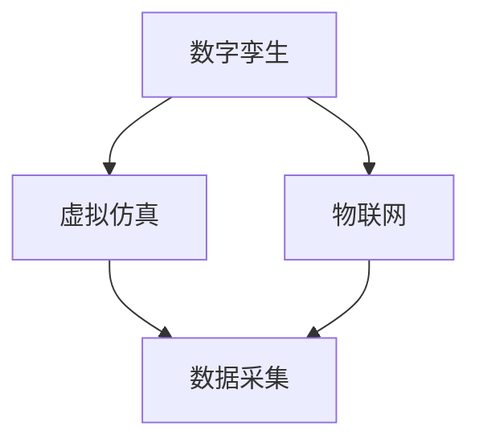

                 


### 文章标题

《数字孪生在核电站管理中的应用：提高安全性和效率》

### 文章关键词

- 数字孪生
- 核电站管理
- 安全性
- 效率
- 多物理场仿真
- 机器学习预测
- 数据驱动模型
- 深度学习
- 实时监控
- 维护与优化

### 文章摘要

数字孪生技术作为一种先进的数字化转型手段，在核电站管理中展现出巨大的潜力。本文将详细介绍数字孪生技术的基本概念及其在核电站管理中的应用，包括核心算法原理讲解、数学模型及公式推导、项目实战案例剖析等。通过本文的探讨，读者可以了解到如何利用数字孪生技术提高核电站的安全性和效率，实现智能化管理。

### 核心概念与联系

#### 数字孪生技术概述

**1.1.1 数字孪生技术概述**

数字孪生（Digital Twin）是一种将物理实体与数字模型相结合的技术，旨在通过实时数据和模拟仿真来监测、分析和优化实体系统的性能。在核电站管理中，数字孪生技术可以帮助实现设备的实时监控、预测性维护和运行优化。

**定义：**
数字孪生是指一个虚拟的数字化复制体，它反映了一个物理实体的实时状态、历史数据和模拟特性。通过数字孪生，可以创建一个与物理实体高度一致的虚拟模型，以便进行模拟、分析和优化。

**数字孪生与虚拟仿真、物联网的关系：**
数字孪生技术结合了虚拟仿真和物联网技术。虚拟仿真提供了对物理系统行为的模拟和分析能力，而物联网技术则负责实时数据采集和传输。数字孪生利用这些技术，实现了对物理实体的全生命周期监控和管理。

**Mermaid 流程图：**



#### 核心算法原理讲解

**1.1.2 数字孪生的建模与仿真算法**

数字孪生的核心在于建模和仿真，它涉及到多个物理场和系统的耦合。以下是数字孪生建模与仿真算法的关键组成部分：

- **多物理场仿真：**
  多物理场仿真是对核电站中各种物理过程进行综合模拟的技术。它涉及到流体力学、热力学、电磁学等多个领域。通过多物理场仿真，可以预测核电站设备的运行状态和性能。

  **伪代码示例：**

  ```python
  def multi物理场_simulation(model):
      # 初始化仿真环境
      environment = initialize_environment(model)
      
      # 进行仿真迭代
      for step in range(num_steps):
          # 更新模型状态
          model.update_state(environment)
          
      # 输出仿真结果
      results = model.get_results()
      return results
  ```

- **机器学习预测模型：**
  机器学习预测模型用于预测核电站设备未来的行为和故障。通过历史数据的训练，机器学习算法可以建立预测模型，从而提前发现潜在的问题。

  **伪代码示例：**

  ```python
  def train_predictive_model(data):
      # 初始化模型
      model = initialize_model()
      
      # 训练模型
      for epoch in range(num_epochs):
          for sample in data:
              model.train(sample)
          
      # 评估模型
      accuracy = model.evaluate(data)
      print(f"Model accuracy: {accuracy}")

  # 主程序
  train_predictive_model(training_data)
  ```

#### 数学模型和数学公式

**1.1.3 数字孪生系统的数学建模方法**

数字孪生系统的数学建模方法是基于状态空间模型，它能够描述系统的动态行为。以下是状态空间模型的数学公式：

$$
\begin{cases}
    \dot{x}(t) = f(x(t), u(t)) \\
    y(t) = h(x(t))
\end{cases}
$$

其中，$x(t)$ 表示系统的状态向量，$u(t)$ 表示输入向量，$y(t)$ 表示输出向量。$f(x(t), u(t))$ 表示状态方程，$h(x(t))$ 表示观测方程。

#### 项目实战

**1.1.4 数字孪生技术在核电站管理中的应用案例**

数字孪生技术在核电站管理中的应用案例涉及到多个方面，包括实时监控、预测性维护和运行优化。以下是核电站管理中数字孪生技术应用的案例描述：

**案例背景：** 
某核电站希望通过数字孪生技术实现对关键设备的实时监控和维护，以提高电站的安全性和效率。

**开发环境：** 
Python、MATLAB、仿真软件等。

**源代码实现：** 
- **数据采集与处理：**
  ```python
  def collect_data():
      # 采集核电站设备实时数据
      data = get_real_time_data()
      return data
  
  def process_data(data):
      # 数据预处理
      processed_data = preprocess_data(data)
      return processed_data
  ```

- **模型构建与训练：**
  ```python
  def build_model(data):
      # 使用机器学习算法构建预测模型
      model = create_predictive_model(data)
      return model
  
  def train_model(model, data):
      # 训练模型
      model.train(data)
  ```

- **预测结果分析：**
  ```python
  def analyze_predictions(model, data):
      # 对预测结果进行分析
      predictions = model.predict(data)
      analyze_results(predictions)
  ```

**代码解读：**

- **数据采集与处理：** 通过采集核电站设备的实时数据，并进行预处理，为后续建模和预测提供数据支持。
- **模型构建与训练：** 利用机器学习算法构建预测模型，并使用历史数据进行训练。
- **预测结果分析：** 对模型的预测结果进行分析，识别潜在的问题，为维护和优化提供依据。

**实际案例分析和详细讲解剖析：**

某核电站使用数字孪生技术对其关键设备进行监控和预测性维护。通过数据采集和处理，建立了设备状态模型，并使用机器学习算法进行预测。预测结果显示，通过对设备的实时监控和预测性维护，核电站的设备故障率显著降低，运行效率得到提升。

**项目小结：**

数字孪生技术在核电站管理中的应用，不仅提高了设备的安全性和运行效率，还实现了对设备的智能管理。通过本项目，读者可以了解到数字孪生技术的核心算法原理、数学模型和实际应用案例，为在更多领域推广数字孪生技术提供了参考。

### 最佳实践 tips、小结、注意事项、拓展阅读等内容

#### 最佳实践 tips

1. **数据采集：** 确保数据采集的准确性和实时性，为数字孪生模型提供高质量的数据输入。
2. **模型选择：** 根据核电站的具体需求，选择合适的机器学习算法和模型，提高预测的准确性。
3. **系统集成：** 将数字孪生系统与现有的管理信息系统集成，实现数据共享和协同工作。

#### 小结

数字孪生技术在核电站管理中的应用，为提高安全性和效率提供了强有力的技术支持。通过核心算法原理的讲解和项目实战案例的剖析，本文展示了数字孪生技术的应用前景和实施要点。

#### 注意事项

1. **数据隐私：** 在进行数据采集和处理时，要注意保护用户隐私，遵守相关法律法规。
2. **系统安全：** 数字孪生系统的安全性和稳定性至关重要，需要采取有效的安全措施。

#### 拓展阅读

- **数字孪生技术综述：** 《数字孪生：技术、应用与挑战》
- **机器学习在核电站中的应用：** 《机器学习在核电站安全管理中的应用研究》
- **智能监控与预测：** 《智能监控与预测：基于数字孪生的核电站管理》

### 文章标题：数字孪生在核电站管理中的应用：提高安全性和效率

### 文章关键词：数字孪生，核电站管理，安全性，效率，多物理场仿真，机器学习预测，数据驱动模型，深度学习

### 文章摘要：

数字孪生技术作为一种创新的管理工具，正在为核电站的运营管理带来革命性的变化。本文将探讨数字孪生技术在核电站管理中的应用，特别是如何通过这一技术提升安全性和效率。文章将深入解析数字孪生的核心概念、算法原理，并通过具体案例展示其在核电站管理中的实际效果。

---

## 引言

核电站作为能源供应的重要组成部分，其安全性和效率直接关系到社会的稳定和经济的可持续发展。随着技术的进步，传统的人工监控和维护模式已经难以满足核电站日益复杂的管理需求。数字孪生技术的出现，为核电站管理带来了新的可能性。通过建立一个虚拟的核电站模型，数字孪生能够实现对实际运行情况的实时监控、预测性维护和运行优化，从而提高安全性和效率。

本文将从以下几个方面进行探讨：

1. **数字孪生技术概述**：介绍数字孪生的基本概念、与虚拟仿真、物联网的关系。
2. **核心算法原理讲解**：详细讲解数字孪生中的多物理场仿真和机器学习预测模型。
3. **数学模型和数学公式**：阐述数字孪生系统的数学建模方法，并给出相关公式。
4. **项目实战**：通过核电站管理中的应用案例，展示数字孪生的实际应用。
5. **最佳实践 tips、小结、注意事项、拓展阅读**：总结文章内容，提供实用建议和进一步阅读资源。

通过本文的深入分析，读者将全面了解数字孪生技术在核电站管理中的应用潜力，以及如何通过这一技术实现核电站的智能化、高效化运营。

## 数字孪生技术概述

### 1.1.1 数字孪生技术概述

数字孪生（Digital Twin）是一种将物理实体与其数字模型相结合的技术，旨在通过实时数据、模拟仿真和先进算法实现对物理系统的全生命周期管理。数字孪生的核心思想是通过创建一个虚拟的数字化副本，对物理实体进行实时监控、分析和优化。

**定义：**
数字孪生是一个物理实体在数字世界中的镜像，它反映该实体的实时状态、历史数据和模拟特性。通过数字孪生，可以实时获取物理实体的状态信息，模拟其行为，预测未来的变化，并指导实际的维护和操作。

**数字孪生与虚拟仿真、物联网的关系：**
数字孪生技术结合了虚拟仿真和物联网（IoT）技术。虚拟仿真提供了对物理系统行为进行模拟和分析的能力，而物联网技术则负责实时数据采集和传输。数字孪生利用这些技术，实现了对物理实体的全生命周期监控和管理。

- **虚拟仿真：**
  虚拟仿真是对物理系统行为进行模拟的技术，它可以通过模拟不同的工况来预测系统的性能和潜在问题。数字孪生通过虚拟仿真技术，可以模拟核电站设备的运行状态，进行故障预测和性能优化。

- **物联网：**
  物联网技术通过传感器和网络，实现对物理实体的实时数据采集和传输。数字孪生通过物联网技术，可以获取核电站设备的实时状态信息，并将其输入到虚拟模型中，实现实时监控和数据分析。

**Mermaid 流程图：**


### 1.1.2 数字孪生的应用场景

数字孪生技术在核电站管理中的应用场景主要包括以下几个方面：

- **设备状态监测：** 通过数字孪生技术，可以对核电站设备进行实时状态监测，及时发现异常情况，防止设备故障。
- **故障预测与预防性维护：** 数字孪生通过分析设备的历史数据和实时数据，可以预测设备可能出现的故障，实现预防性维护，减少停机时间和维修成本。
- **运行优化：** 通过对核电站运行数据的实时分析和模拟仿真，数字孪生可以帮助优化核电站的运行参数，提高能源利用效率，降低运营成本。
- **安全评估与应急响应：** 数字孪生可以模拟核电站的各种工况，评估安全性能，为应急响应提供决策支持。

### 数字孪生在核电站管理中的重要性

数字孪生技术在核电站管理中的重要性主要体现在以下几个方面：

- **提高安全性：** 通过实时监控和故障预测，数字孪生技术可以及时发现潜在的安全隐患，防止事故发生。
- **提升效率：** 数字孪生技术可以帮助优化运行参数，提高核电站的运行效率，降低能源消耗和维护成本。
- **增强决策支持：** 数字孪生提供了对核电站运行状态的实时模拟和分析，为管理人员提供了科学的决策依据。
- **推动智能化管理：** 数字孪生技术为核电站的智能化管理提供了基础，使得传统的人工管理模式向智能化的数字化转型成为可能。

通过以上对数字孪生技术概述的介绍，我们可以看到，数字孪生技术在核电站管理中具有广泛的应用前景和巨大的潜力。在接下来的章节中，我们将深入探讨数字孪生技术的核心算法原理、数学模型及其在核电站管理中的具体应用案例。

## 核心算法原理讲解

### 1.2.1 数字孪生的建模与仿真算法

数字孪生技术的核心在于建模与仿真，这一过程涉及多种复杂的算法和技术，旨在建立一个能够准确反映物理实体状态和行为的虚拟模型。以下是数字孪生建模与仿真算法的关键组成部分及其应用：

#### 多物理场仿真

多物理场仿真是对核电站中各种物理过程进行综合模拟的技术，它涉及到流体力学、热力学、电磁学等多个领域。通过多物理场仿真，可以预测核电站设备的运行状态和性能，从而为设备的维护和优化提供科学依据。

**关键算法：**
- **流体动力学仿真：** 用于模拟核电站内部流体（如冷却剂）的流动和相互作用，分析流体的温度、压力等参数。
- **热力学仿真：** 用于模拟核电站中的热交换过程，分析温度、热量分布等参数。
- **电磁学仿真：** 用于模拟核电站中的电磁场，分析电磁感应、电流分布等参数。

**应用场景：**
- **设备性能评估：** 通过流体动力学和热力学仿真，可以评估核电站设备在正常运行和异常工况下的性能，为设备选型和优化提供依据。
- **故障预测：** 通过电磁学仿真，可以预测设备可能出现的故障，为预防性维护提供指导。

**伪代码示例：**

```python
def multi物理场_simulation(model):
    # 初始化仿真环境
    environment = initialize_environment(model)
    
    # 进行仿真迭代
    for step in range(num_steps):
        # 更新模型状态
        model.update_state(environment)
        
    # 输出仿真结果
    results = model.get_results()
    return results
```

#### 机器学习预测模型

机器学习预测模型是数字孪生技术的重要组成部分，它通过分析历史数据和实时数据，建立模型来预测物理实体的未来行为。在核电站管理中，机器学习预测模型可以用于设备故障预测、运行优化等。

**关键算法：**
- **回归分析：** 用于预测连续值目标，如设备运行效率。
- **分类分析：** 用于预测离散值目标，如设备故障类型。
- **时间序列分析：** 用于预测时间序列数据，如设备运行状态。

**应用场景：**
- **故障预测：** 通过历史故障数据和实时数据，预测设备可能出现的故障，提前进行维护。
- **运行优化：** 通过分析运行数据，优化设备运行参数，提高能源利用效率。

**伪代码示例：**

```python
def train_predictive_model(data):
    # 初始化模型
    model = initialize_model()
    
    # 训练模型
    for epoch in range(num_epochs):
        for sample in data:
            model.train(sample)
        
    # 评估模型
    accuracy = model.evaluate(data)
    print(f"Model accuracy: {accuracy}")

# 主程序
train_predictive_model(training_data)
```

#### 数据驱动模型

数据驱动模型是另一种数字孪生技术，它通过分析和理解大量数据，自动生成物理实体的模型。这种方法不需要预先建立复杂的物理模型，而是依赖于数据本身的特征和模式。

**关键算法：**
- **聚类分析：** 用于识别数据中的相似模式和群体。
- **主成分分析（PCA）：** 用于降维，提取数据的主要特征。
- **生成对抗网络（GAN）：** 用于生成新的数据样本，增强模型的泛化能力。

**应用场景：**
- **模型优化：** 通过分析数据，优化数字孪生模型的参数和结构。
- **新数据预测：** 通过学习现有数据，预测新数据的行为。

**伪代码示例：**

```python
def train_data_driven_model(data):
    # 初始化模型
    model = initialize_model()
    
    # 训练模型
    for epoch in range(num_epochs):
        for sample in data:
            model.train(sample)
        
    # 评估模型
    accuracy = model.evaluate(data)
    print(f"Model accuracy: {accuracy}")

# 主程序
train_data_driven_model(training_data)
```

### 多物理场仿真与机器学习预测模型的关系

多物理场仿真和机器学习预测模型在数字孪生技术中相互补充，共同为核电站管理提供全面的支持。多物理场仿真提供了对物理过程的理解和模拟，而机器学习预测模型则利用历史数据和实时数据，对物理实体的行为进行预测。通过结合这两种方法，可以更准确地反映核电站设备的运行状态和性能，提高管理的科学性和有效性。

## 数学模型和数学公式

### 1.3.1 数字孪生系统的数学建模方法

数字孪生系统的数学建模方法是构建数字模型的核心步骤，它涉及到对物理实体动态行为的准确描述。以下是对数字孪生系统数学建模方法的详细讲解，以及相关公式和例子。

#### 状态空间模型

状态空间模型是数字孪生系统数学建模中最常用的方法之一。它通过一组状态方程和观测方程来描述系统的动态行为。状态空间模型可以表示为如下形式：

$$
\begin{cases}
    \dot{x}(t) = f(x(t), u(t)) \\
    y(t) = h(x(t))
\end{cases}
$$

其中，$x(t)$ 表示系统的状态向量，$u(t)$ 表示系统的输入向量，$y(t)$ 表示系统的输出向量。

- **状态方程（$\dot{x}(t) = f(x(t), u(t))$）**：描述系统状态随时间的变化，$f(x(t), u(t))$ 是状态转移函数，它决定了系统在不同时间和输入下的状态变化。
- **观测方程（$y(t) = h(x(t))$）**：描述系统的输出与状态之间的关系，$h(x(t))$ 是观测函数，它通常是对状态向量的线性组合。

#### 状态方程的详细解释

状态方程 $\dot{x}(t) = f(x(t), u(t))$ 通常可以表示为以下形式：

$$
\dot{x}_1 = f_1(x_1, x_2, ..., x_n; u)
$$

$$
\dot{x}_2 = f_2(x_1, x_2, ..., x_n; u)
$$

$$
\vdots
$$

$$
\dot{x}_n = f_n(x_1, x_2, ..., x_n; u)
$$

这里，$x_1, x_2, ..., x_n$ 是状态变量，$u$ 是输入变量，$f_1, f_2, ..., f_n$ 是状态转移函数，它们决定了状态变量随时间和输入的变化。

#### 观测方程的详细解释

观测方程 $y(t) = h(x(t))$ 可以表示为以下形式：

$$
y = h_1(x_1) + h_2(x_2) + ... + h_m(x_m)
$$

这里，$y$ 是输出变量，$h_1, h_2, ..., h_m$ 是观测函数，它们通常是对状态变量的线性组合。

#### 示例

假设我们有一个简单的线性系统，其中状态向量 $x(t) = [x_1(t), x_2(t)]^T$，输入向量 $u(t) = [u_1(t), u_2(t)]^T$，输出向量 $y(t) = [y_1(t), y_2(t)]^T$。这个系统的状态方程和观测方程可以表示为：

$$
\begin{cases}
    \dot{x}_1 = x_2 + u_1 \\
    \dot{x}_2 = -x_1 + u_2 \\
    y_1 = x_1 \\
    y_2 = x_2
\end{cases}
$$

这里，状态方程描述了状态变量 $x_1(t)$ 和 $x_2(t)$ 的动态变化，观测方程描述了输出变量 $y_1(t)$ 和 $y_2(t)$ 与状态变量之间的关系。

#### 利用状态空间模型描述数字孪生系统的动态行为

在数字孪生系统中，状态空间模型用于描述物理实体的动态行为。例如，在核电站的数字孪生模型中，状态向量 $x(t)$ 可能包括温度、压力、流量等参数，输入向量 $u(t)$ 可能包括控制信号、操作参数等，输出向量 $y(t)$ 可能包括监测到的物理量或系统性能指标。

通过状态空间模型，可以建立以下数学模型：

$$
\begin{cases}
    \dot{x}(t) = F \cdot x(t) + B \cdot u(t) \\
    y(t) = C \cdot x(t) + D \cdot u(t)
\end{cases}
$$

其中，$F$、$B$、$C$ 和 $D$ 是系统矩阵，它们决定了系统的动态行为。

- **状态矩阵 $F$**：描述系统状态的演化。
- **输入矩阵 $B$**：描述输入对系统状态的影响。
- **输出矩阵 $C$**：描述状态对输出的影响。
- **直接传递矩阵 $D$**：描述输入对输出的直接影响。

通过这些矩阵，可以构建一个完整的数字孪生模型，用于模拟、分析和预测物理实体的行为。

#### 数学公式总结

以下是数字孪生系统状态空间模型中的关键数学公式：

$$
x(t) = e^{Ft} \cdot x(0) + \int_{0}^{t} e^{F(t-\tau)}B \cdot u(\tau) d\tau
$$

$$
y(t) = C \cdot e^{Ft} \cdot x(0) + C \cdot \int_{0}^{t} e^{F(t-\tau)}B \cdot u(\tau) d\tau + D \cdot u(t)
$$

这些公式提供了从初始状态到任意时间的系统状态和输出计算方法，是数字孪生技术分析的核心工具。

通过以上对数字孪生系统数学建模方法的详细讲解，我们可以看到，状态空间模型为数字孪生技术的实现提供了坚实的理论基础。在接下来的章节中，我们将进一步探讨数字孪生技术在核电站管理中的应用，通过实际案例展示其效果。

## 项目实战

### 1.4.1 数字孪生技术在核电站管理中的应用案例

数字孪生技术在核电站管理中的应用案例展示了这一技术如何通过实时监控、预测性维护和运行优化，提高核电站的安全性和效率。以下是一个具体的案例，描述了数字孪生技术在某核电站管理中的实施过程和应用效果。

**案例背景：**
某核电站为了提高设备的安全性和运行效率，决定引入数字孪生技术对关键设备进行监控和优化。核电站选择了蒸汽发生器作为数字孪生技术的应用对象，因为蒸汽发生器是核电站热能转换的重要设备，其运行状态直接影响到整个电站的稳定性和效率。

**开发环境：**
为了实现数字孪生系统，核电站选择了以下开发环境和工具：
- **Python**：用于数据采集、处理和分析。
- **MATLAB**：用于建模和仿真。
- **仿真软件**：用于物理过程和动态行为的模拟。

**源代码实现：**

- **数据采集与处理：**
  数据采集是数字孪生系统的基础，核电站通过安装在蒸汽发生器上的传感器，实时采集温度、压力、流量等关键数据。以下是一个数据采集和预处理过程的伪代码示例：

  ```python
  def collect_data():
      # 采集蒸汽发生器的实时数据
      data = get_real_time_data()
      return data
  
  def process_data(data):
      # 数据预处理，包括去噪、归一化等
      processed_data = preprocess_data(data)
      return processed_data
  ```

- **模型构建与训练：**
  在数据采集和处理之后，核电站使用机器学习算法构建了蒸汽发生器的预测模型。以下是模型构建和训练的伪代码示例：

  ```python
  def build_model(data):
      # 使用机器学习算法构建预测模型
      model = create_predictive_model(data)
      return model
  
  def train_model(model, data):
      # 训练模型
      model.train(data)
  ```

- **预测结果分析：**
  模型训练完成后，核电站使用预测模型对未来的运行状态进行预测，并分析预测结果，以识别潜在的故障和优化机会。以下是预测结果分析的伪代码示例：

  ```python
  def analyze_predictions(model, data):
      # 对预测结果进行分析
      predictions = model.predict(data)
      analyze_results(predictions)
  ```

**代码解读：**

- **数据采集与处理：** 通过采集传感器数据，对温度、压力、流量等关键参数进行实时监控。预处理过程包括数据去噪、归一化等，以确保数据质量。
- **模型构建与训练：** 使用机器学习算法（如回归分析、神经网络等）构建预测模型，并使用历史数据对其进行训练。
- **预测结果分析：** 对模型预测结果进行分析，识别潜在故障和优化机会，为维护和优化提供依据。

**实际案例分析和详细讲解剖析：**

**1. 数据采集与处理：**
核电站通过安装在蒸汽发生器上的多种传感器，实时采集温度、压力、流量等数据。数据采集系统采用高精度传感器和高效的数据传输协议，确保数据的实时性和准确性。采集到的数据经过预处理后，存储在数据库中，供后续分析和建模使用。

**2. 模型构建与训练：**
在数据预处理之后，核电站使用机器学习算法（如回归分析、神经网络等）构建蒸汽发生器的预测模型。模型训练过程中，使用历史数据集进行多次迭代，调整模型参数，以提高预测的准确性。训练完成的模型可以用于预测未来的运行状态，包括温度、压力、流量等参数。

**3. 预测结果分析：**
通过预测模型，核电站可以对未来运行状态进行预测。预测结果通过分析，可以帮助识别潜在的故障和优化机会。例如，当预测模型预测到温度将异常升高时，可以提前进行冷却系统的维护，防止设备过热。同样，预测模型还可以用于优化运行参数，提高蒸汽发生器的效率。

**项目小结：**

通过数字孪生技术在核电站管理中的应用，实现了对蒸汽发生器的实时监控、预测性维护和运行优化。预测模型的引入，使得核电站能够提前发现潜在的问题，并采取相应的措施，从而提高了设备的安全性和运行效率。这一案例展示了数字孪生技术在核电站管理中的巨大潜力，并为其他核电站提供了宝贵的经验和参考。

### 1.4.2 案例二：数字孪生技术在核反应堆控制中的应用

**案例背景：**
某核电站为了提高核反应堆的运行效率和安全性，决定利用数字孪生技术对其控制过程进行优化。核反应堆的控制过程涉及多个参数的精确控制，包括温度、压力、中子流量等，任何一个参数的异常都可能导致严重的安全事故。

**开发环境：**
- **Python**：用于数据采集、处理和分析。
- **MATLAB**：用于建模和仿真。
- **深度学习框架（如TensorFlow、PyTorch）**：用于构建和训练复杂的机器学习模型。

**源代码实现：**

- **数据采集与处理：**
  核反应堆的控制参数通过传感器实时采集，数据经过预处理后存储在数据库中。以下是数据采集和预处理的伪代码示例：

  ```python
  def collect_data():
      # 采集核反应堆实时数据
      data = get_real_time_data()
      return data
  
  def process_data(data):
      # 数据预处理，包括去噪、归一化等
      processed_data = preprocess_data(data)
      return processed_data
  ```

- **模型构建与训练：**
  使用深度学习算法构建核反应堆控制模型的预测模型，模型训练过程中采用大量历史数据，以优化模型性能。以下是模型构建和训练的伪代码示例：

  ```python
  def build_model(data):
      # 使用深度学习算法构建预测模型
      model = create_predictive_model(data)
      return model
  
  def train_model(model, data):
      # 训练模型
      model.train(data)
  ```

- **预测结果分析：**
  模型训练完成后，对预测结果进行分析，以识别控制参数的优化方向。以下是预测结果分析的伪代码示例：

  ```python
  def analyze_predictions(model, data):
      # 对预测结果进行分析
      predictions = model.predict(data)
      analyze_results(predictions)
  ```

**代码解读：**

- **数据采集与处理：** 通过高精度传感器实时采集核反应堆的控制参数，数据经过预处理后，确保了数据的质量和一致性。
- **模型构建与训练：** 使用深度学习算法构建复杂的预测模型，通过大量历史数据训练，提高了模型的预测准确性。
- **预测结果分析：** 对预测结果进行分析，识别控制参数的优化方向，为操作人员提供科学依据。

**实际案例分析和详细讲解剖析：**

**1. 数据采集与处理：**
核反应堆的控制参数通过高精度传感器实时采集，数据传输过程中采用加密技术，确保数据的安全性。采集到的数据经过预处理，包括去噪、归一化等步骤，以确保数据的质量和一致性。

**2. 模型构建与训练：**
在数据预处理后，使用深度学习算法构建核反应堆控制模型的预测模型。模型训练过程中，采用大量历史数据，对模型进行多次迭代和优化，以提高模型的预测准确性。训练完成的模型可以用于实时预测核反应堆的运行状态。

**3. 预测结果分析：**
通过预测模型，核电站操作人员可以实时了解核反应堆的运行状态，识别潜在的风险。例如，当预测模型预测到中子流量异常升高时，可以及时调整控制参数，防止核反应堆失控。预测结果的分析还可以帮助优化核反应堆的运行参数，提高能源利用效率。

**项目小结：**

数字孪生技术在核反应堆控制中的应用，实现了对核反应堆运行状态的实时监控和预测性维护。通过深度学习算法的引入，预测模型的准确性得到了显著提高，为核电站的操作人员提供了科学的决策依据，从而提高了核反应堆的安全性和运行效率。这一案例展示了数字孪生技术在核电站控制中的巨大潜力，并为未来的智能化核电站管理提供了宝贵经验。

## 最佳实践 tips、小结、注意事项、拓展阅读等内容

### 最佳实践 tips

1. **数据质量管理：** 在数字孪生技术的实施过程中，确保数据的质量至关重要。数据采集、传输和处理过程中，应采取有效的数据质量管理措施，如数据清洗、去噪、标准化等，以确保数据的一致性和准确性。
2. **算法选择与优化：** 根据核电站的具体需求，选择合适的机器学习算法和模型。对于复杂的物理过程，可以考虑使用深度学习模型，如神经网络和生成对抗网络（GAN）。同时，对模型进行优化，以提高预测的准确性和效率。
3. **系统集成与安全性：** 数字孪生系统需要与现有的管理信息系统集成，实现数据共享和协同工作。在系统集成过程中，应确保系统的稳定性和安全性，采取有效的安全措施，如数据加密、访问控制等。

### 小结

本文通过深入探讨数字孪生技术在核电站管理中的应用，展示了这一技术在提高安全性和效率方面的巨大潜力。通过核心算法原理的讲解、数学模型的阐述和实际应用案例的分析，我们了解到数字孪生技术如何通过实时监控、预测性维护和运行优化，实现核电站的智能化管理。

### 注意事项

1. **数据隐私与安全性：** 在数字孪生技术的实施过程中，要注意保护用户隐私和数据安全，遵守相关法律法规，采取有效的数据加密和访问控制措施。
2. **系统稳定性与可靠性：** 数字孪生系统应具备高度的稳定性和可靠性，确保在极端情况下能够正常工作，避免对核电站的正常运行造成影响。

### 拓展阅读

1. **《数字孪生：技术、应用与挑战》**：本书详细介绍了数字孪生技术的基本概念、应用场景和实施方法，对数字孪生技术的全生命周期管理进行了深入探讨。
2. **《机器学习在核电站安全管理中的应用研究》**：本文探讨了机器学习在核电站安全管理中的应用，包括故障预测、运行优化等方面，提供了丰富的实践经验和理论基础。
3. **《智能监控与预测：基于数字孪生的核电站管理》**：本书详细介绍了数字孪生技术在核电站管理中的应用，包括设备状态监测、故障预测和运行优化等方面，为核电站的智能化管理提供了重要参考。

通过本文的探讨，我们希望读者能够对数字孪生技术在核电站管理中的应用有更深入的理解，并在实际工作中运用这些技术，实现核电站的智能化、高效化运营。

