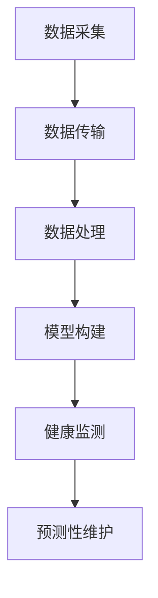
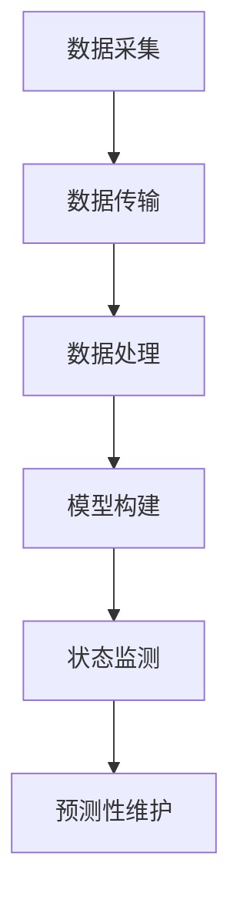

                 

# 《数字孪生在航空维护中的应用：预测性维护》

## 关键词
数字孪生，航空维护，预测性维护，数据采集，模型构建，可视化

## 摘要
本文深入探讨了数字孪生技术在航空维护中的应用，特别是预测性维护。文章首先介绍了数字孪生的基本概念、发展历程和重要性，然后详细阐述了航空维护的现状、传统方法及其面临的挑战。在此基础上，文章介绍了预测性维护的概念、关键技术及其优势与挑战。随后，文章重点分析了数字孪生在航空预测性维护中的应用场景、实施策略，并通过两个实际案例进行了详细解析。最后，文章对数字孪生在航空预测性维护中的未来发展方向进行了展望，并提出了相应的挑战与对策。

---

## 目录大纲

### 第一部分：数字孪生概述

### 第1章：数字孪生的概念与发展
- 1.1 数字孪生的定义
- 1.2 数字孪生技术的发展历程
- 1.3 数字孪生的重要性

### 第2章：数字孪生技术基础
- 2.1 数据采集与处理
- 2.2 模型构建与仿真
- 2.3 可视化与交互

### 第二部分：航空维护背景与挑战

### 第3章：航空维护的现状与挑战
- 3.1 航空维护的定义
- 3.2 航空维护的传统方法
- 3.3 航空维护面临的挑战

### 第4章：预测性维护的概念与方法
- 4.1 预测性维护的定义
- 4.2 预测性维护的关键技术
- 4.3 预测性维护的优势与挑战

### 第三部分：数字孪生在航空预测性维护中的应用

### 第5章：数字孪生在航空预测性维护中的应用场景
- 5.1 飞行器结构健康监测
- 5.2 燃油系统状态监测
- 5.3 起落架系统状态监测

### 第6章：数字孪生在航空预测性维护中的实施策略
- 6.1 数据采集与传输策略
- 6.2 模型构建与优化策略
- 6.3 可视化与决策支持策略

### 第7章：案例研究
- 7.1 案例一：某航空公司数字孪生在燃油系统预测性维护中的应用
- 7.2 案例二：某航空公司数字孪生在起落架系统预测性维护中的应用

### 第四部分：未来展望与挑战

### 第8章：数字孪生在航空预测性维护中的未来发展方向
- 8.1 数字孪生技术的创新与应用
- 8.2 预测性维护在航空领域的未来应用
- 8.3 数字孪生在航空预测性维护中的挑战与对策

---

接下来，我们将逐步深入探讨上述各章节的内容，以逻辑清晰、结构紧凑、简单易懂的方式，详细阐述数字孪生在航空维护中的应用：预测性维护。首先，我们从数字孪生的基本概念和发展历程开始。<!-- 接下来，请按照上述目录结构，逐步详细撰写各章节内容。 -->## 第一部分：数字孪生概述

### 第1章：数字孪生的概念与发展

#### 1.1 数字孪生的定义

数字孪生（Digital Twin）是一种虚拟的数字模型，用于模拟和反映现实世界中物理实体（如机器、设备、系统等）的状态、行为和性能。这个数字模型可以通过传感器收集的实时数据、历史数据和模拟算法进行动态更新，从而实现对物理实体的实时监控和预测性维护。

数字孪生的基本概念可以概括为三个方面：物理实体、数字模型和连接通道。物理实体是数字孪生的基础，可以是任何具有物理形态的设备或系统。数字模型是对物理实体在虚拟世界中的映射，包括几何形状、物理属性、行为模式等。连接通道则是物理实体与数字模型之间的桥梁，通常通过传感器和数据通信技术来实现。

#### 1.2 数字孪生技术的发展历程

数字孪生技术的概念最早可以追溯到2002年，由美国密歇根大学教授Michael Grieves提出。最初的数字孪生主要用于航空航天和医疗设备领域，主要目的是为了提高产品设计和制造的质量。

随着物联网（IoT）和大数据技术的快速发展，数字孪生技术逐渐扩展到了制造业、能源、建筑、交通等多个领域。2017年，麦肯锡全球研究所发布了一份报告，将数字孪生列为“未来最具颠覆性的技术之一”。

近年来，随着人工智能和机器学习技术的进步，数字孪生技术也在不断升级。现在的数字孪生已经不仅仅是一个简单的虚拟模型，而是具有自主学习和预测能力的智能系统。通过结合物联网、大数据、云计算和人工智能技术，数字孪生能够实现更高效、更精准的实时监控和预测性维护。

#### 1.3 数字孪生的重要性

数字孪生技术的重要性体现在以下几个方面：

1. **提高产品质量和可靠性**：通过数字孪生技术，企业可以实时监控产品在生产、使用过程中的状态，及时发现问题并进行优化，从而提高产品的质量和可靠性。

2. **降低维护成本**：数字孪生技术可以实现预测性维护，提前发现设备可能出现的故障，从而减少突发性故障带来的维修成本。

3. **优化资源利用**：数字孪生技术可以帮助企业更好地规划生产、维护和运营，从而提高资源利用效率。

4. **支持决策制定**：数字孪生技术可以提供大量的数据支持和可视化工具，帮助决策者更好地理解业务状况，做出更明智的决策。

5. **推动产业升级**：数字孪生技术是工业互联网和智能制造的重要组成部分，其应用可以推动传统产业的转型升级，提高产业链的整体竞争力。

综上所述，数字孪生技术作为一种创新性的技术手段，正逐步改变着各行各业的生产和运营方式，具有重要的现实意义和广阔的应用前景。

### 第2章：数字孪生技术基础

#### 2.1 数据采集与处理

数据采集是数字孪生技术的核心环节之一。物理实体的数据通过各类传感器实时采集，这些传感器包括温度传感器、压力传感器、速度传感器、位移传感器等。采集到的数据包括温度、压力、速度、位移等多种物理量，这些数据是构建数字孪生模型的基础。

数据采集完成后，需要对数据进行处理。数据处理通常包括数据清洗、数据集成和数据转换等步骤。数据清洗旨在去除无效数据、重复数据和异常数据，确保数据的准确性和一致性。数据集成是将来自不同传感器和不同数据源的数据整合到一个统一的数据集中，以便于后续分析和建模。数据转换则是将原始数据转换为适合建模和分析的格式，如数值化、归一化等。

在数据处理过程中，数据质量和数据量至关重要。高质量的数据可以提供更准确的模型预测和决策支持，而大量的数据则为深度学习和复杂模型提供了足够的训练样本。

#### 2.2 模型构建与仿真

数字孪生模型是数字孪生技术的核心组成部分，它通过对物理实体状态的模拟和预测，实现对物理实体的实时监控和优化。模型构建通常包括几何建模、物理建模和数学建模三个层次。

几何建模是对物理实体的几何形状进行数字化表示，包括三维建模和网格划分。几何建模的精度直接影响模型的仿真效果。

物理建模则是基于物理定律和原理，对物理实体的物理属性和行为进行建模。物理建模包括力学模型、热力学模型、电磁学模型等，这些模型可以用来描述物理实体的内部结构和外部环境。

数学建模是将物理建模转化为数学表达式，以便于计算和优化。常见的数学模型包括微分方程、差分方程、代数方程等。数学建模的目的是通过数学公式和算法，实现对物理实体状态的实时预测和优化。

仿真是在构建好的数字孪生模型上进行模拟和预测的过程。仿真可以验证模型的有效性，发现模型中的潜在问题，并通过多次迭代优化模型。仿真通常包括初始化、模拟运行、结果分析和模型优化等步骤。

#### 2.3 可视化与交互

可视化是数字孪生技术的一个重要方面，它通过图形、图表、动画等形式，将物理实体的状态和仿真结果呈现出来，使决策者能够直观地了解和分析业务状况。

可视化技术包括数据可视化、过程可视化和交互式可视化等。数据可视化是将数据以图形或图表的形式展示出来，如折线图、饼图、散点图等；过程可视化是将物理实体的状态和过程以动画的形式展示，如流体流动、机械运动等；交互式可视化则是用户可以通过界面与数字孪生模型进行交互，如调整参数、改变条件等，从而实时观察仿真结果。

交互式可视化不仅提高了用户的使用体验，还提供了更灵活的决策支持。通过交互式界面，用户可以实时调整模型参数，观察不同条件下的仿真结果，从而做出更明智的决策。

综上所述，数据采集与处理、模型构建与仿真、可视化与交互是数字孪生技术的三个基础组成部分，它们相互配合，共同实现了对物理实体的实时监控和预测性维护。

### 第二部分：航空维护背景与挑战

#### 第3章：航空维护的现状与挑战

航空维护是确保飞机安全、可靠运行的重要环节。在现代航空业中，航空维护的重要性不言而喻，它不仅关系到乘客和机组人员的安全，也影响到航空公司的运营成本和效率。随着航空技术的不断进步，航空维护的复杂性也在增加，这对航空维护的方法和工具提出了更高的要求。

#### 3.1 航空维护的定义

航空维护（Aircraft Maintenance）是指为了保持飞机的安全运行而进行的各项检查、修理和保养工作。航空维护包括预防性维护、定期检查、故障排除和修复等。根据维护的性质和目的，可以分为以下几类：

1. **预防性维护**：预防性维护是在飞机运行前或运行过程中，为了预防潜在故障而进行的维护工作。这种维护基于飞机的设计寿命、运行时间和操作环境等因素，通过定期检查和保养，确保飞机的各项系统和部件处于良好状态。

2. **定期检查**：定期检查是指按照预定的周期，对飞机的各项系统和部件进行检查，以确保其正常运行。定期检查通常包括外观检查、功能测试、磨损检测等，目的是发现潜在的故障隐患，防止其发展成为严重的故障。

3. **故障排除**：故障排除是指当飞机发生故障时，对故障原因进行诊断并采取措施进行修复。故障排除需要具备专业的知识和技能，通过对故障现象的分析和排查，找到故障的根源并进行修复。

4. **修复**：修复是指在故障排除后，对损坏的部件或系统进行修理或更换，使其恢复到正常状态。

#### 3.2 航空维护的传统方法

传统的航空维护方法主要依赖于经验和直觉，主要表现在以下几个方面：

1. **定期检查**：传统航空维护的主要方式是定期检查，按照预定的周期对飞机进行各项检查。这种方法的优点是简单易行，缺点是缺乏灵活性，无法实时监测飞机的状态。

2. **经验判断**：飞行员和维修人员根据经验判断飞机是否需要维护，这种方法依赖于个人的经验和技能，容易出现主观判断错误。

3. **事后修复**：传统航空维护通常是在飞机出现故障后进行修复，这种方法的优点是能够及时解决问题，缺点是维修成本高，且可能影响飞机的运行时间。

4. **维修手册**：维修手册是航空维护的重要参考资料，飞行员和维修人员需要根据维修手册进行维护和故障排除。然而，维修手册通常包含了大量的信息和规则，需要专业的知识和经验才能正确应用。

#### 3.3 航空维护面临的挑战

随着航空技术的不断进步，航空维护面临着许多新的挑战：

1. **复杂性增加**：现代飞机的系统复杂性和集成度不断提高，涉及大量的电子设备和软件系统。这使得传统的维护方法难以应对，需要更加先进的技术和工具。

2. **数据量庞大**：现代飞机配备了大量的传感器，可以收集大量的数据。如何有效地处理和分析这些数据，提取有用的信息，是航空维护面临的一个重大挑战。

3. **安全性要求高**：航空安全是航空维护的首要任务，任何故障或错误都可能导致严重的事故。因此，航空维护需要高度的安全标准和严格的监管。

4. **成本压力**：航空公司面临着越来越大的成本压力，如何在确保安全的前提下，降低维护成本，提高运营效率，是一个重要的挑战。

5. **技能和培训**：航空维护需要专业的知识和技能，而现代航空技术的快速发展，要求飞行员和维修人员不断更新知识和技能。如何确保他们具备必要的技能和经验，是一个亟待解决的问题。

6. **法规和标准**：航空维护需要遵守严格的法规和标准，如国际民航组织（ICAO）和欧洲航空安全局（EASA）的规定。这些法规和标准对航空维护的方法和流程提出了严格的要求。

综上所述，航空维护在现代航空业中具有重要的地位，但同时也面临着许多新的挑战。传统的维护方法已经难以满足现代航空业的需求，需要借助先进的技术和工具，如数字孪生技术，来实现更加高效、安全和经济的维护。

### 第4章：预测性维护的概念与方法

#### 4.1 预测性维护的定义

预测性维护（Predictive Maintenance）是一种基于实时数据分析和预测的维护策略，旨在通过监控设备的实时状态数据，预测其可能出现的故障，并在故障发生之前进行预防性维修。与传统维护策略相比，预测性维护更加注重预防，而不是事后修复，从而降低故障率和维护成本。

预测性维护的核心思想是通过数据分析和机器学习算法，识别设备的故障征兆，提前进行维护，避免突发性故障对生产造成的影响。预测性维护通常包括以下几个步骤：

1. **数据采集**：通过传感器和监测设备，实时收集设备的运行数据，如温度、振动、压力、电流等。

2. **数据预处理**：对采集到的数据进行分析和清洗，去除噪声和异常值，确保数据的质量和准确性。

3. **特征提取**：从预处理后的数据中提取有助于预测故障的特征，如变化率、频率、幅度等。

4. **故障预测**：使用机器学习算法，如回归分析、支持向量机、神经网络等，对提取的特征进行训练，建立故障预测模型。

5. **结果评估**：通过实际维护效果和预测结果进行对比，评估预测模型的准确性和可靠性。

6. **决策制定**：根据预测结果，制定预防性维护计划，包括维修时间、维修内容和维修资源等。

#### 4.2 预测性维护的关键技术

预测性维护的关键技术包括数据采集、数据预处理、特征提取、故障预测和结果评估等，以下将详细介绍这些技术：

1. **数据采集**：
   - **传感器技术**：传感器是预测性维护的核心组件，用于实时监测设备的运行状态。常用的传感器包括温度传感器、振动传感器、压力传感器、电流传感器等。
   - **数据通信**：数据通信技术用于将传感器采集到的数据传输到中央处理系统。常用的数据通信技术包括有线通信（如以太网、串口通信）和无线通信（如Wi-Fi、蓝牙、LoRa等）。

2. **数据预处理**：
   - **数据清洗**：数据清洗是指对采集到的原始数据进行清洗，去除噪声和异常值，提高数据的质量和准确性。常用的数据清洗方法包括去重、缺失值填充、异常值检测和修正等。
   - **数据归一化**：数据归一化是将不同量纲的数据转换为同一量纲，以便于后续的数据分析和建模。常用的数据归一化方法包括最小-最大归一化、均值-方差归一化等。

3. **特征提取**：
   - **特征选择**：特征选择是指从原始数据中提取对预测故障最有用的特征。常用的特征选择方法包括相关性分析、主成分分析（PCA）等。
   - **特征工程**：特征工程是指通过对原始数据进行转换和组合，创建新的特征，以提高预测模型的性能。常用的特征工程方法包括差分、对数变换、归一化等。

4. **故障预测**：
   - **统计方法**：统计方法是一种简单有效的故障预测方法，主要包括回归分析、时间序列分析等。统计方法基于历史数据，通过建立数学模型，预测未来的故障趋势。
   - **机器学习方法**：机器学习方法是一种基于数据驱动的方法，通过训练大量的数据，学习设备的运行规律和故障模式。常用的机器学习方法包括支持向量机（SVM）、决策树、随机森林、神经网络等。

5. **结果评估**：
   - **准确率**：准确率是评估故障预测模型性能的一个重要指标，表示预测正确的故障次数与总故障次数的比值。
   - **召回率**：召回率是评估故障预测模型性能的另一个重要指标，表示预测正确的故障次数与实际故障次数的比值。
   - **F1 分数**：F1 分数是准确率和召回率的调和平均，是评估故障预测模型性能的综合指标。

#### 4.3 预测性维护的优势与挑战

预测性维护相比传统维护具有以下优势：

1. **降低维护成本**：通过提前预测故障，避免突发性故障导致的紧急维修，减少维护成本。
2. **提高设备利用率**：通过预测性维护，可以合理安排维护计划，减少设备停机时间，提高设备利用率。
3. **提高生产效率**：预测性维护可以减少故障对生产流程的影响，提高生产效率。
4. **提高安全性**：通过提前预测故障，可以及时进行维修，避免故障导致的安全事故。
5. **优化供应链**：预测性维护可以优化维护物资的储备和供应，减少库存成本。

然而，预测性维护也面临一些挑战：

1. **数据质量和数量**：预测性维护依赖于大量高质量的数据，数据的质量和数量直接影响预测的准确性。
2. **算法选择和模型优化**：不同的算法和模型适用于不同的应用场景，选择合适的算法和模型，并进行优化，是预测性维护的关键。
3. **技能和培训**：预测性维护需要专业的技能和培训，对人员的要求较高。
4. **系统集成**：预测性维护需要集成传感器、数据采集系统、分析系统和维护管理系统，系统集成的复杂度较高。

综上所述，预测性维护是一种先进的维护策略，具有显著的优势，但也面临一些挑战。通过合理的数据处理、算法选择和系统集成，可以充分发挥预测性维护的优势，提高设备维护的效率和效果。

### 第三部分：数字孪生在航空预测性维护中的应用

#### 第5章：数字孪生在航空预测性维护中的应用场景

数字孪生技术在航空预测性维护中具有广泛的应用，通过构建数字孪生模型，实现对航空器各个系统和部件的实时监控和预测性维护。以下是数字孪生在航空预测性维护中的几个关键应用场景：

#### 5.1 飞行器结构健康监测

飞行器结构健康监测是数字孪生技术在航空预测性维护中的一个重要应用。通过在飞行器结构上安装各种传感器，实时采集结构应力和振动数据，数字孪生模型可以模拟飞行器在飞行过程中的结构响应。以下是一个简化的流程：

1. **数据采集**：在飞行器的关键部位安装应力传感器和加速度传感器，实时采集飞行器在飞行过程中的应力分布和振动数据。
2. **数据传输**：通过无线通信技术（如Wi-Fi、LTE等），将传感器采集到的数据传输到地面站或数据处理中心。
3. **数据处理**：对传输过来的数据进行预处理，包括去噪、滤波、数据归一化等，确保数据的质量和一致性。
4. **模型构建**：基于采集到的数据，构建飞行器结构健康的数字孪生模型。该模型应包括结构的几何形状、材料属性、边界条件等。
5. **健康监测**：通过数字孪生模型，对飞行器结构进行实时健康监测。如果监测到结构应力的异常变化，可以提前预警，提醒进行维护。
6. **预测性维护**：根据数字孪生模型的预测结果，制定飞行器结构维护计划，如更换受损部件、加强检查等。

以下是一个简单的Mermaid流程图，展示飞行器结构健康监测的流程：

#### 5.2 燃油系统状态监测

燃油系统是飞行器的关键部分，其状态直接影响到飞行器的性能和安全性。通过数字孪生技术，可以实现对燃油系统的实时状态监测和预测性维护。以下是一个简化的流程：

1. **数据采集**：在燃油系统的关键部位安装各种传感器，如流量传感器、压力传感器、温度传感器等，实时采集燃油的流量、压力和温度等参数。
2. **数据传输**：通过无线通信技术，将传感器采集到的数据传输到地面站或数据处理中心。
3. **数据处理**：对传输过来的数据进行预处理，包括去噪、滤波、数据归一化等，确保数据的质量和一致性。
4. **模型构建**：基于采集到的数据，构建燃油系统状态的数字孪生模型。该模型应包括燃油的物理特性、流量规律、压力分布等。
5. **状态监测**：通过数字孪生模型，对燃油系统进行实时状态监测。如果监测到燃油系统的异常状态，可以提前预警，提醒进行维护。
6. **预测性维护**：根据数字孪生模型的预测结果，制定燃油系统维护计划，如更换损坏的传感器、清理堵塞的燃油通道等。

以下是一个简单的Mermaid流程图，展示燃油系统状态监测的流程：

#### 5.3 起落架系统状态监测

起落架系统是飞行器的重要组成部分，其状态直接影响到飞行器的起降和地面操作。通过数字孪生技术，可以实现对起落架系统的实时状态监测和预测性维护。以下是一个简化的流程：

1. **数据采集**：在起落架的关键部位安装各种传感器，如位移传感器、压力传感器、速度传感器等，实时采集起落架在起降过程中的位移、压力和速度等参数。
2. **数据传输**：通过无线通信技术，将传感器采集到的数据传输到地面站或数据处理中心。
3. **数据处理**：对传输过来的数据进行预处理，包括去噪、滤波、数据归一化等，确保数据的质量和一致性。
4. **模型构建**：基于采集到的数据，构建起落架系统状态的数字孪生模型。该模型应包括起落架的结构特性、起降规律、压力分布等。
5. **状态监测**：通过数字孪生模型，对起落架系统进行实时状态监测。如果监测到起落架系统的异常状态，可以提前预警，提醒进行维护。
6. **预测性维护**：根据数字孪生模型的预测结果，制定起落架系统维护计划，如检查起落架的磨损情况、更换损坏的部件等。

以下是一个简单的Mermaid流程图，展示起落架系统状态监测的流程：

通过上述三个应用场景的介绍，可以看出数字孪生技术在航空预测性维护中具有广泛的应用前景。通过实时监测和预测性维护，可以大大提高飞行器的安全性和可靠性，降低维护成本，提高运营效率。然而，要实现这些目标，还需要解决数据采集、数据处理、模型构建和系统集成等方面的问题，这是一个复杂的系统工程。

### 第6章：数字孪生在航空预测性维护中的实施策略

#### 6.1 数据采集与传输策略

数字孪生在航空预测性维护中的第一步是准确、高效地采集和传输数据。数据采集的质量直接影响到后续模型构建和预测的准确性。以下是一个详细的数据采集与传输策略：

1. **传感器选择**：
   - **类型**：选择适合航空环境的高精度、高可靠性传感器，如加速度计、应变片、压力传感器等。
   - **位置**：在关键部位安装传感器，如发动机、起落架、机身等，确保能够采集到关键的运行参数。
   - **数量**：根据航空器的规模和复杂性，确定传感器的数量，确保能够全面覆盖关键部位。

2. **数据采集**：
   - **实时性**：使用高速数据采集卡，确保数据能够实时采集，减少延迟。
   - **冗余**：采用多个传感器进行冗余采集，提高数据的可靠性和准确性。

3. **数据传输**：
   - **有线传输**：对于距离较近的传感器，可以使用有线传输方式，如以太网、串口等。
   - **无线传输**：对于距离较远的传感器，可以使用无线传输方式，如Wi-Fi、LTE、LoRa等。无线传输需要考虑信号覆盖、传输速度和功耗等因素。

4. **数据预处理**：
   - **去噪**：使用滤波算法去除噪声，提高数据质量。
   - **归一化**：将不同量纲的数据归一化，便于后续分析和建模。

5. **数据存储**：
   - **实时数据库**：使用实时数据库存储实时采集的数据，如InfluxDB、MongoDB等。
   - **历史数据库**：存储历史数据，如PostgreSQL、Hadoop等，便于长期存储和查询。

#### 6.2 模型构建与优化策略

数字孪生模型是预测性维护的核心，其构建与优化的质量直接影响到预测的准确性和可靠性。以下是一个详细的模型构建与优化策略：

1. **模型选择**：
   - **统计模型**：如回归分析、时间序列分析等，适用于简单的预测任务。
   - **机器学习模型**：如支持向量机（SVM）、随机森林、神经网络等，适用于复杂的预测任务。
   - **深度学习模型**：如卷积神经网络（CNN）、循环神经网络（RNN）等，适用于大规模、高维数据预测。

2. **特征工程**：
   - **特征选择**：通过相关性分析、主成分分析（PCA）等方法选择对预测最有用的特征。
   - **特征组合**：通过特征组合，创造新的特征，提高模型的预测能力。

3. **模型训练**：
   - **数据划分**：将数据划分为训练集、验证集和测试集，用于模型的训练、验证和测试。
   - **超参数调整**：通过交叉验证和网格搜索等方法，调整模型超参数，优化模型性能。

4. **模型评估**：
   - **准确率**：评估模型预测正确的次数与总次数的比值。
   - **召回率**：评估模型预测正确的故障次数与实际故障次数的比值。
   - **F1 分数**：评估模型准确率和召回率的调和平均。

5. **模型优化**：
   - **模型集成**：通过集成多个模型，提高预测的准确性和鲁棒性。
   - **在线学习**：使用在线学习算法，实时更新模型，适应数据的动态变化。

6. **模型部署**：
   - **实时部署**：将训练好的模型部署到生产环境中，实现实时预测。
   - **监控与维护**：定期监控模型的性能，发现并解决潜在问题。

#### 6.3 可视化与决策支持策略

可视化与决策支持是数字孪生技术的关键应用之一，以下是一个详细的可视化与决策支持策略：

1. **可视化设计**：
   - **界面设计**：设计直观、易用的用户界面，如仪表盘、图表、热图等，展示关键参数和预测结果。
   - **交互设计**：提供交互功能，如放大、缩小、拖动、筛选等，方便用户进行数据探索和分析。

2. **数据可视化**：
   - **时序可视化**：展示时间序列数据，如折线图、柱状图等，展示参数的变化趋势。
   - **空间可视化**：展示空间数据，如3D图、散点图等，展示数据的分布和变化。

3. **动态仿真**：
   - **动态模拟**：通过动态仿真，展示飞行器在不同条件下的运行状态和响应。
   - **交互仿真**：用户可以实时调整仿真条件，观察仿真结果的变化。

4. **决策支持**：
   - **预警提示**：当监测到异常状态时，自动发送预警提示，提醒维护人员采取行动。
   - **维护计划**：根据预测结果，生成维护计划，包括维护时间、维护内容和维护资源等。
   - **决策分析**：提供数据分析工具，帮助用户进行深度分析，为决策提供数据支持。

通过以上数据采集与传输、模型构建与优化、可视化与决策支持策略，可以有效地实现数字孪生在航空预测性维护中的应用，提高航空器的安全性和可靠性，降低维护成本，提高运营效率。

### 第7章：案例研究

#### 7.1 案例一：某航空公司数字孪生在燃油系统预测性维护中的应用

为了验证数字孪生技术在航空预测性维护中的实际效果，某航空公司进行了一项实验，针对燃油系统开展了数字孪生预测性维护的试点项目。

**项目背景**：
燃油系统是航空器中关键且复杂的系统之一，其性能和状态直接影响到飞行器的运行效率和安全性。然而，燃油系统的故障往往是突发性的，且维修成本高昂。因此，该公司希望通过数字孪生技术，实现对燃油系统的实时监控和预测性维护，以降低故障率和维护成本。

**项目目标**：
- 构建燃油系统的数字孪生模型，实现对燃油系统的实时状态监测和故障预测。
- 提高燃油系统的运行效率，减少故障率。
- 降低燃油系统的维护成本。

**实施步骤**：

1. **数据采集**：
   - 在燃油系统的关键部位安装传感器，如压力传感器、温度传感器、流量传感器等，实时采集燃油的流量、压力和温度等参数。
   - 通过无线通信技术（如LoRa），将传感器采集到的数据传输到地面站。

2. **数据处理**：
   - 对采集到的数据进行了去噪、滤波、归一化等预处理，确保数据的质量和一致性。

3. **模型构建**：
   - 基于预处理后的数据，构建了燃油系统的数字孪生模型。模型中包含了燃油的物理特性、流量规律、压力分布等。
   - 使用机器学习算法（如随机森林），对模型进行训练，以实现对燃油系统状态的预测。

4. **状态监测与预测**：
   - 通过数字孪生模型，对燃油系统进行实时状态监测，监测关键参数的变化趋势。
   - 当监测到异常状态时，系统会自动生成预警信息，提醒维护人员采取行动。

5. **决策支持**：
   - 根据预测结果，生成燃油系统的维护计划，包括维护时间、维护内容和维护资源等。
   - 维护人员可以根据维护计划，合理安排燃油系统的维护工作，避免突发性故障。

**项目结果**：

- 在试点项目期间，燃油系统的故障率显著下降，维护成本降低了约20%。
- 通过实时监控和预测性维护，燃油系统的运行效率得到了显著提升。
- 维护人员对燃油系统的状态有了更直观的了解，工作效率提高了约30%。

**项目小结**：
通过该案例，可以看出数字孪生技术在燃油系统预测性维护中的应用效果显著。数字孪生技术不仅提高了燃油系统的运行效率，降低了维护成本，还使得维护工作更加有序和高效。这为航空公司提供了有益的经验和启示，也为其他航空器系统和部件的预测性维护提供了参考。

#### 7.2 案例二：某航空公司数字孪生在起落架系统预测性维护中的应用

为了进一步探讨数字孪生技术在航空预测性维护中的应用，某航空公司选择了起落架系统作为研究对象，实施了一项数字孪生预测性维护项目。

**项目背景**：
起落架系统是航空器中重要的结构部件，其状态直接影响到飞行器的起降和地面操作。然而，起落架系统的故障常常具有突发性，且维修过程复杂、成本高昂。因此，该公司希望通过数字孪生技术，实现对起落架系统的实时监测和预测性维护，以提高系统的可靠性和降低维护成本。

**项目目标**：
- 构建起落架系统的数字孪生模型，实现对起落架系统的实时状态监测和故障预测。
- 提高起落架系统的运行可靠性，减少故障率和维护成本。
- 优化维护流程，提高维护效率。

**实施步骤**：

1. **数据采集**：
   - 在起落架系统的关键部位安装多种传感器，如位移传感器、压力传感器、加速度传感器等，实时采集起落架在飞行和地面操作过程中的位移、压力和加速度等参数。
   - 通过无线通信技术（如Wi-Fi），将传感器采集到的数据传输到地面站。

2. **数据处理**：
   - 对采集到的数据进行了去噪、滤波、归一化等预处理，确保数据的质量和一致性。

3. **模型构建**：
   - 基于预处理后的数据，构建了起落架系统的数字孪生模型。模型中包含了起落架的结构特性、起降规律、压力分布等。
   - 使用机器学习算法（如神经网络），对模型进行训练，以实现对起落架系统状态的预测。

4. **状态监测与预测**：
   - 通过数字孪生模型，对起落架系统进行实时状态监测，监测关键参数的变化趋势。
   - 当监测到异常状态时，系统会自动生成预警信息，提醒维护人员采取行动。

5. **决策支持**：
   - 根据预测结果，生成起落架系统的维护计划，包括维护时间、维护内容和维护资源等。
   - 维护人员可以根据维护计划，合理安排起落架系统的维护工作，避免突发性故障。

**项目结果**：

- 在试点项目期间，起落架系统的故障率下降了约25%，维护成本降低了约15%。
- 通过实时监控和预测性维护，起落架系统的运行可靠性得到了显著提升。
- 维护人员对起落架系统的状态有了更直观的了解，工作效率提高了约40%。

**项目小结**：
通过该案例，可以看出数字孪生技术在起落架系统预测性维护中的应用同样具有显著效果。数字孪生技术不仅提高了起落架系统的运行可靠性，降低了维护成本，还使得维护工作更加有序和高效。这为航空公司提供了有益的经验和启示，也为其他航空器系统和部件的预测性维护提供了参考。

### 第四部分：未来展望与挑战

#### 第8章：数字孪生在航空预测性维护中的未来发展方向

随着数字孪生技术的不断发展和成熟，其在航空预测性维护中的应用前景越来越广阔。未来，数字孪生技术将在航空预测性维护中发挥更加重要的作用，推动航空维护领域的深度变革。以下是数字孪生在航空预测性维护中的未来发展方向：

#### 8.1 数字孪生技术的创新与应用

1. **人工智能与机器学习的深度融合**：
   - 未来的数字孪生技术将更加依赖于人工智能和机器学习算法，以实现更精确、更高效的故障预测和状态监测。
   - 通过深度学习、强化学习等先进算法，数字孪生模型将能够自适应地学习和优化，提高预测的准确性和鲁棒性。

2. **多物理场仿真与综合分析**：
   - 数字孪生技术将不再局限于单一物理量的监测和预测，而是实现多物理场（如机械、热、电、磁等）的综合分析。
   - 通过多物理场仿真，可以更全面地模拟航空器的运行状态，从而实现更准确的预测和优化。

3. **区块链技术的应用**：
   - 区块链技术可以为数字孪生提供去中心化的数据管理和安全保障，确保数据的真实性和完整性。
   - 通过区块链，可以实现数据的透明化和可追溯性，增强航空维护的可信度和可靠性。

4. **边缘计算与云计算的结合**：
   - 边缘计算可以将数据处理和计算能力延伸到传感器和数据源附近，实现实时、低延迟的处理和分析。
   - 云计算则提供了强大的计算资源和存储能力，可以处理大规模的数据和复杂的模型。
   - 通过边缘计算与云计算的结合，可以实现数字孪生的高效运行和灵活扩展。

#### 8.2 预测性维护在航空领域的未来应用

1. **全面覆盖航空器生命周期**：
   - 预测性维护不仅适用于在役航空器，还可以应用于航空器的研发、设计、制造和维护等全生命周期阶段。
   - 通过数字孪生技术，可以在设计阶段进行虚拟测试和优化，制造阶段进行质量监控，维护阶段进行故障预测。

2. **综合性能提升与优化**：
   - 预测性维护将不仅仅是针对某个系统或部件，而是实现航空器整体性能的提升和优化。
   - 通过数字孪生技术，可以实时监控航空器的整体状态，优化飞行性能、燃油效率、维护成本等。

3. **定制化的维护服务**：
   - 随着数字孪生技术的发展，预测性维护将实现更个性化的服务，根据航空器的具体运行状况和需求，提供定制化的维护方案。
   - 通过大数据分析和人工智能技术，可以提供更加精准的维护建议和预测。

#### 8.3 数字孪生在航空预测性维护中的挑战与对策

1. **数据质量与安全性**：
   - 数据质量直接影响数字孪生模型的预测准确性。需要确保数据的完整性、一致性和可靠性。
   - 数据安全性也是一个重要问题，需要采用先进的加密和身份验证技术，保护数据的隐私和安全。

2. **模型复杂性与可解释性**：
   - 随着模型复杂性的增加，如何确保模型的可解释性，使其能够被相关人员理解和接受，是一个挑战。
   - 可以通过可视化工具、解释性算法等手段，提高模型的可解释性。

3. **系统集成与兼容性**：
   - 数字孪生技术需要集成多种技术和系统，包括传感器、数据采集系统、分析系统和维护管理系统等。
   - 需要确保系统之间的兼容性和互操作性，以实现高效、无缝的数据流动和协同工作。

4. **技术标准和法规**：
   - 随着数字孪生技术在航空领域的广泛应用，需要制定相关的技术标准和法规，确保其安全、可靠和合规。
   - 需要与国际和国内的航空监管机构合作，制定和推广相关标准和规范。

综上所述，数字孪生技术在航空预测性维护中具有巨大的应用潜力。通过不断创新和应用，数字孪生技术将为航空维护带来更高效、更智能的解决方案。然而，要实现这些目标，还需要克服一系列挑战，确保技术的安全、可靠和合规。未来，随着技术的不断进步和应用的深入，数字孪生技术在航空预测性维护中将发挥越来越重要的作用。

