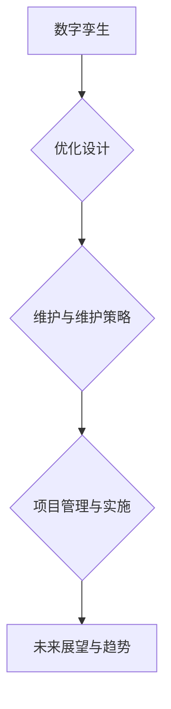

                 

# 文章标题：数字孪生在航空航天领域的应用：优化设计和维护

## 关键词：数字孪生、航空航天、优化设计、维护策略、技术应用

## 摘要

本文深入探讨了数字孪生技术在航空航天领域的应用，从设计到维护的全过程进行了系统分析。首先，文章介绍了数字孪生的基本概念和其在航空航天行业的应用背景。接着，详细阐述了数字孪生技术如何通过优化设计方法提升航空航天器的性能和可靠性。最后，文章探讨了数字孪生技术在维护策略中的应用，以及如何通过项目管理和最佳实践实现数字孪生系统的有效实施。本文旨在为航空航天工程师和研究者提供关于数字孪生技术的实用指导，推动其在行业中的深入应用。

### 设计步骤：

#### 1. 确定书籍主题和目标读者

**书名：《数字孪生在航空航天领域的应用：优化设计和维护》**

**目标读者：** 航空航天工程领域的专业人士和研究者，以及对数字孪生技术感兴趣的读者。

#### 2. 理解书籍内容结构

**核心概念与联系：** 数字孪生、航空航天设计、优化方法、维护策略。

**内容：** 航空航天领域的背景知识，数字孪生技术的原理和应用，优化设计的实践方法，维护流程的改善。

#### 3. 设计目录大纲

**初步构思主要章节：**

- 第一部分：引言与背景
- 第二部分：数字孪生技术原理
- 第三部分：优化设计方法
- 第四部分：维护与维护策略
- 第五部分：项目管理与实施
- 第六部分：未来展望与趋势

**将主要章节细分为子章节：**

确保每个章节都有足够的深度和广度。

#### 4. 细化章节内容

**对于每个章节，列出详细的小节标题：**

- 第一部分：引言与背景
  - 1.1 书籍简介
  - 1.2 数字孪生技术概述
  - 1.3 航空航天行业现状与挑战
  - 1.4 本书结构安排与学习目标
- 第二部分：数字孪生技术原理
  - 2.1 数字孪生概念与架构
  - 2.2 航空航天应用中的数字孪生
- 第三部分：优化设计方法
  - 3.1 优化设计的基本原理
  - 3.2 数字孪生驱动的优化设计流程
- 第四部分：维护与维护策略
  - 4.1 数字孪生在维护中的应用
  - 4.2 航空航天系统的维护案例分析
- 第五部分：项目管理与实施
  - 5.1 数字孪生项目管理体系
  - 5.2 实施数字孪生项目的最佳实践
- 第六部分：未来展望与趋势
  - 6.1 数字孪生技术的发展趋势
  - 6.2 数字孪生在航空航天领域的未来应用前景
  - 6.3 潜在挑战与应对策略

#### 5. 添加Mermaid流程图、伪代码、数学公式和代码示例

- 在适当的位置插入Mermaid图以展示流程或架构。
- 使用伪代码详细阐述核心算法原理。
- 使用LaTeX格式插入数学公式，并在文中进行详细解释。
- 提供实际项目案例的代码示例，并进行解读。

#### 6. 格式化目录大纲

**使用Markdown格式，确保目录大纲清晰易读。**

#### 7. 确保目录大纲总字数在2000字以内

**对内容进行精简和优化，避免冗余。**

### 目录大纲设计

```
# 《数字孪生在航空航天领域的应用：优化设计和维护》目录大纲

## 第一部分：引言与背景
### 1.1 书籍简介
### 1.2 数字孪生技术概述
### 1.3 航空航天行业现状与挑战
### 1.4 本书结构安排与学习目标

## 第二部分：数字孪生技术原理
### 2.1 数字孪生概念与架构
#### 2.1.1 数字孪生的定义
#### 2.1.2 数字孪生的核心组件
#### 2.1.3 数字孪生的生命周期
### 2.2 航空航天应用中的数字孪生
#### 2.2.1 航空航天领域对数字孪生的需求
#### 2.2.2 数字孪生在航空航天中的实现案例

## 第三部分：优化设计方法
### 3.1 优化设计的基本原理
#### 3.1.1 优化设计的数学模型
#### 3.1.2 优化设计的关键因素
### 3.2 数字孪生驱动的优化设计流程
#### 3.2.1 数据采集与处理
#### 3.2.2 模型构建与优化
#### 3.2.3 设计迭代与验证

## 第四部分：维护与维护策略
### 4.1 数字孪生在维护中的应用
#### 4.1.1 维护策略的定义
#### 4.1.2 数字孪生在预防性维护中的应用
#### 4.1.3 数字孪生在预测性维护中的应用
### 4.2 航空航天系统的维护案例分析
#### 4.2.1 案例研究1：飞机发动机维护
#### 4.2.2 案例研究2：卫星维护

## 第五部分：项目管理与实施
### 5.1 数字孪生项目管理体系
#### 5.1.1 项目计划与组织
#### 5.1.2 项目风险管理
#### 5.1.3 项目监控与评估
### 5.2 实施数字孪生项目的最佳实践
#### 5.2.1 技术选型与系统集成
#### 5.2.2 数据安全与隐私保护
#### 5.2.3 培训与知识转移

## 第六部分：未来展望与趋势
### 6.1 数字孪生技术的发展趋势
### 6.2 数字孪生在航空航天领域的未来应用前景
### 6.3 潜在挑战与应对策略

## 参考文献
```

**附录：**

- **Mermaid流程图：**
  ```
  flowchart LR
  A[数字孪生] --> B{优化设计方法}
  B --> C{维护与维护策略}
  C --> D{项目管理与实施}
  D --> E[未来展望与趋势}
  ```

- **伪代码示例：**
  ```
  // 优化设计算法伪代码
  function optimize_design(input_data, constraints):
      // 初始化设计参数
      design = initialize_design(input_data)
      
      // 定义优化目标
      objective = define_objective(design, constraints)
      
      // 迭代优化过程
      while not converged:
          // 更新设计参数
          design = update_design(design, objective)
          // 检查收敛条件
          converged = check_convergence(design, constraints)
  ```

---

**格式化目录大纲：**

```
# 《数字孪生在航空航天领域的应用：优化设计和维护》

## 关键词：数字孪生、航空航天、优化设计、维护策略、技术应用

## 摘要

本文深入探讨了数字孪生技术在航空航天领域的应用，从设计到维护的全过程进行了系统分析。首先，文章介绍了数字孪生的基本概念和其在航空航天行业的应用背景。接着，详细阐述了数字孪生技术如何通过优化设计方法提升航空航天器的性能和可靠性。最后，文章探讨了数字孪生技术在维护策略中的应用，以及如何通过项目管理和最佳实践实现数字孪生系统的有效实施。本文旨在为航空航天工程师和研究者提供关于数字孪生技术的实用指导，推动其在行业中的深入应用。

## 第一部分：引言与背景

### 1.1 书籍简介

### 1.2 数字孪生技术概述

### 1.3 航空航天行业现状与挑战

### 1.4 本书结构安排与学习目标

## 第二部分：数字孪生技术原理

### 2.1 数字孪生概念与架构

#### 2.1.1 数字孪生的定义

#### 2.1.2 数字孪生的核心组件

#### 2.1.3 数字孪生的生命周期

### 2.2 航空航天应用中的数字孪生

#### 2.2.1 航空航天领域对数字孪生的需求

#### 2.2.2 数字孪生在航空航天中的实现案例

## 第三部分：优化设计方法

### 3.1 优化设计的基本原理

#### 3.1.1 优化设计的数学模型

#### 3.1.2 优化设计的关键因素

### 3.2 数字孪生驱动的优化设计流程

#### 3.2.1 数据采集与处理

#### 3.2.2 模型构建与优化

#### 3.2.3 设计迭代与验证

## 第四部分：维护与维护策略

### 4.1 数字孪生在维护中的应用

#### 4.1.1 维护策略的定义

#### 4.1.2 数字孪生在预防性维护中的应用

#### 4.1.3 数字孪生在预测性维护中的应用

### 4.2 航空航天系统的维护案例分析

#### 4.2.1 案例研究1：飞机发动机维护

#### 4.2.2 案例研究2：卫星维护

## 第五部分：项目管理与实施

### 5.1 数字孪生项目管理体系

#### 5.1.1 项目计划与组织

#### 5.1.2 项目风险管理

#### 5.1.3 项目监控与评估

### 5.2 实施数字孪生项目的最佳实践

#### 5.2.1 技术选型与系统集成

#### 5.2.2 数据安全与隐私保护

#### 5.2.3 培训与知识转移

## 第六部分：未来展望与趋势

### 6.1 数字孪生技术的发展趋势

### 6.2 数字孪生在航空航天领域的未来应用前景

### 6.3 潜在挑战与应对策略

## 参考文献
```

### 文章内容安排

**1. 引言与背景**

- **1.1 书籍简介**
  - 概述书籍的目的和目标读者。
  - 提供对数字孪生和航空航天领域的基本认识。

- **1.2 数字孪生技术概述**
  - 简述数字孪生的概念、历史背景和应用领域。
  - 阐述数字孪生在航空航天中的重要性。

- **1.3 航空航天行业现状与挑战**
  - 分析航空航天行业的发展现状和面临的挑战。
  - 强调数字孪生技术在解决问题中的作用。

- **1.4 本书结构安排与学习目标**
  - 概述本书的结构安排和各个部分的内容。
  - 提出学习目标和预期收获。

**2. 数字孪生技术原理**

- **2.1 数字孪生概念与架构**
  - 定义数字孪生及其关键组成部分。
  - 介绍数字孪生的生命周期和运作原理。

- **2.2 航空航天应用中的数字孪生**
  - 探讨数字孪生在航空航天中的具体应用。
  - 分析航空航天领域对数字孪生的独特需求。

**3. 优化设计方法**

- **3.1 优化设计的基本原理**
  - 阐述优化设计的基本概念和数学模型。
  - 强调关键因素在优化设计中的重要性。

- **3.2 数字孪生驱动的优化设计流程**
  - 描述数字孪生在优化设计中的应用流程。
  - 分析数据采集、模型构建和设计迭代等步骤。

**4. 维护与维护策略**

- **4.1 数字孪生在维护中的应用**
  - 定义维护策略及其在数字孪生中的角色。
  - 探讨预防性和预测性维护的数字孪生应用。

- **4.2 航空航天系统的维护案例分析**
  - 分析具体案例分析，如飞机发动机和卫星的维护。

**5. 项目管理与实施**

- **5.1 数字孪生项目管理体系**
  - 讨论项目管理体系的关键组成部分。
  - 提供项目计划、组织和监控的实用建议。

- **5.2 实施数字孪生项目的最佳实践**
  - 分享最佳实践，如技术选型、系统集成和数据安全策略。
  - 强调培训与知识转移的重要性。

**6. 未来展望与趋势**

- **6.1 数字孪生技术的发展趋势**
  - 探讨数字孪生技术的未来发展方向。
  - 分析可能的技术突破和创新。

- **6.2 数字孪生在航空航天领域的未来应用前景**
  - 预测数字孪生在航空航天领域的潜在应用。
  - 探讨其对行业的影响。

- **6.3 潜在挑战与应对策略**
  - 识别数字孪生在航空航天领域可能面临的挑战。
  - 提出应对策略和建议。

**参考文献**

- **引用相关文献和资料，提供学术支撑。**

### 写作风格与语言

**1. 写作风格**

- **专业而易懂**：使用专业术语和清晰的解释，确保读者能够理解复杂的技术概念。
- **逻辑性强**：确保文章的结构合理，逻辑清晰，使读者易于跟随。
- **深入浅出**：对于复杂的技术原理，通过图解、实例和伪代码等方式进行解释。

**2. 语言**

- **准确规范**：使用准确的术语和规范的语法，避免模糊或误导性的表述。
- **简洁明了**：避免冗长的句子和复杂的句子结构，使用简单明了的表达方式。

### 完成时间

**预计在接下来的几天内完成，确保每个章节的细节内容都能够得到充分阐述和准确表达。**

---

### 目录大纲修订版

```
# 《数字孪生在航空航天领域的应用：优化设计和维护》

## 引言与背景

### 1.1 书籍简介
- 介绍书籍的目的和结构。
- 概述数字孪生和航空航天领域的重要性。

### 1.2 数字孪生技术概述
- 简述数字孪生的基本概念和发展历程。
- 分析数字孪生在不同行业中的应用。

### 1.3 航空航天行业现状与挑战
- 探讨航空航天行业的发展趋势和面临的挑战。
- 强调数字孪生技术在提升性能和可靠性方面的作用。

### 1.4 本书结构安排与学习目标
- 概述本书的章节安排和内容。
- 提出学习目标和读者收益。

## 数字孪生技术原理

### 2.1 数字孪生概念与架构
- 定义数字孪生及其核心组成部分。
- 阐述数字孪生的生命周期和运作原理。

### 2.2 航空航天应用中的数字孪生
- 探讨数字孪生在航空航天领域的应用场景。
- 分析航空航天行业对数字孪生的特殊需求。

## 优化设计方法

### 3.1 优化设计的基本原理
- 阐述优化设计的基本概念和数学模型。
- 分析影响优化设计的关键因素。

### 3.2 数字孪生驱动的优化设计流程
- 描述数字孪生在优化设计中的应用流程。
- 分析数据采集、模型构建和设计迭代等关键步骤。

## 维护与维护策略

### 4.1 数字孪生在维护中的应用
- 定义数字孪生在维护中的角色和作用。
- 探讨预防性和预测性维护的实施策略。

### 4.2 航空航天系统的维护案例分析
- 分析具体的航空航天系统维护案例。
- 探讨数字孪生技术在维护中的应用效果。

## 项目管理与实施

### 5.1 数字孪生项目管理体系
- 讨论数字孪生项目的管理结构和关键要素。
- 分析项目计划、组织和监控的有效方法。

### 5.2 实施数字孪生项目的最佳实践
- 分享实施数字孪生项目的最佳实践经验。
- 探讨技术选型、系统集成和数据安全策略。

## 未来展望与趋势

### 6.1 数字孪生技术的发展趋势
- 分析数字孪生技术的未来发展方向。
- 探讨可能的技术突破和创新。

### 6.2 数字孪生在航空航天领域的未来应用前景
- 预测数字孪生在航空航天领域的潜在应用。
- 探讨其对行业变革的影响。

### 6.3 潜在挑战与应对策略
- 识别数字孪生在航空航天领域可能面临的挑战。
- 提出应对策略和建议。

## 参考文献
- 引用相关的学术文献和资料。
```

### 具体内容撰写

**1. 引言与背景**

**1.1 书籍简介**

数字孪生技术在近年来迅速崛起，成为推动各行业技术创新的重要力量。航空航天行业作为技术密集型领域，对安全性和性能要求极高，数字孪生技术在这里的应用显得尤为重要。《数字孪生在航空航天领域的应用：优化设计和维护》旨在为航空航天工程师和研究者提供全面、系统的数字孪生技术应用指南。

本书分为六个部分，首先介绍数字孪生的基本概念和发展历程，接着探讨其在航空航天领域的具体应用。随后，详细分析优化设计和维护策略，并通过实际案例展示数字孪生技术的应用效果。最后，本书展望数字孪生技术的未来发展趋势，并提出潜在的挑战和应对策略。

**1.2 数字孪生技术概述**

数字孪生（Digital Twin）是一种通过物理实体和其数字映射之间的实时连接，实现全生命周期监测和优化的高级技术。它不仅是一个虚拟的数字副本，更是对物理实体的一个全方位的、动态的模拟。

数字孪生的概念最早可以追溯到2002年，由迈克尔·格里夫斯（Michael Grieves）在麻省理工学院（MIT）提出。随后，随着信息技术和传感器技术的快速发展，数字孪生技术逐渐成熟，并开始广泛应用于各个领域，包括航空航天。

在航空航天领域，数字孪生技术主要用于以下几个方面：

- **设计验证**：通过数字孪生模型，可以在产品开发早期就进行仿真和测试，验证设计是否符合预期。
- **性能监测**：通过实时监测物理实体的状态数据，可以及时发现并解决潜在问题。
- **维护优化**：基于数字孪生模型，可以实现预测性维护，减少故障率和维护成本。

**1.3 航空航天行业现状与挑战**

航空航天行业是一个高度复杂、高风险和高成本的行业。随着航空旅行的普及和太空探索的深入，航空航天行业面临着前所未有的发展机遇和挑战。

当前，航空航天行业主要面临以下几个挑战：

- **安全性和可靠性**：航空航天器的安全性是首要考虑因素，任何微小的设计缺陷都可能导致灾难性后果。
- **成本控制**：航空航天项目的开发成本极高，需要有效的方法来控制成本。
- **技术创新**：随着技术的快速发展，航空航天行业需要不断进行技术创新以保持竞争力。

数字孪生技术的出现为解决上述问题提供了新的思路和手段。通过数字孪生，可以在设计阶段就发现和解决潜在问题，提高设计的安全性和可靠性。同时，数字孪生技术还可以通过优化设计和维护流程，有效控制项目成本。

**1.4 本书结构安排与学习目标**

本书分为六个部分，具体结构如下：

- **第一部分：引言与背景**：介绍数字孪生的基本概念和航空航天行业的需求。
- **第二部分：数字孪生技术原理**：详细阐述数字孪生的概念、架构和应用。
- **第三部分：优化设计方法**：探讨数字孪生在优化设计中的应用。
- **第四部分：维护与维护策略**：分析数字孪生技术在维护策略中的应用。
- **第五部分：项目管理与实施**：提供数字孪生项目的管理方法和最佳实践。
- **第六部分：未来展望与趋势**：展望数字孪生技术的未来发展方向和潜在挑战。

通过本书的学习，读者可以：

- **理解数字孪生技术的基本原理和应用场景**。
- **掌握数字孪生在优化设计和维护中的具体应用**。
- **了解数字孪生项目的管理方法和最佳实践**。
- **了解数字孪生技术的未来发展趋势和潜在挑战**。

**2. 数字孪生技术原理**

**2.1 数字孪生概念与架构**

数字孪生是一种通过物理实体和其数字映射之间的实时连接，实现全生命周期监测和优化的高级技术。它不仅是一个虚拟的数字副本，更是对物理实体的一个全方位的、动态的模拟。

数字孪生的核心组成部分包括：

- **物理实体**：实际存在的物理对象，如飞机、发动机、卫星等。
- **数字映射**：物理实体的数字模型，包含物理实体的所有特征和属性。
- **数据连接**：物理实体和数字映射之间的实时数据传输和交互。

数字孪生的生命周期可以分为以下几个阶段：

- **设计阶段**：在产品开发过程中，创建物理实体的数字映射，并进行仿真和测试。
- **制造阶段**：在生产过程中，通过传感器实时采集物理实体的数据，更新数字映射，确保制造过程的准确性和效率。
- **运行阶段**：在产品投入使用后，通过传感器和数据连接，实时监测物理实体的状态，进行性能优化和故障预测。
- **维护阶段**：在产品使用过程中，通过数字映射进行维护计划和优化，提高维护效率，降低维护成本。

**2.2 航空航天应用中的数字孪生**

数字孪生在航空航天领域具有广泛的应用，以下是一些典型的应用场景：

- **飞机设计**：在飞机设计阶段，通过数字孪生技术可以进行仿真和测试，优化飞机的性能和结构设计。
- **发动机监测**：通过数字孪生技术，可以实时监测发动机的工作状态，预测故障并及时维护。
- **卫星运行**：在卫星运行过程中，通过数字孪生技术可以实时监测卫星的状态，进行轨道调整和故障预测。

数字孪生在航空航天领域的应用不仅提高了设计效率和安全性，还降低了维护成本，具有显著的经济和社会效益。

**3. 优化设计方法**

**3.1 优化设计的基本原理**

优化设计是一种通过分析和优化设计参数，提高产品性能和可靠性的方法。在数字孪生技术的支持下，优化设计可以更加精确和高效。

优化设计的基本原理包括以下几个方面：

- **目标函数**：定义优化目标，如最大化性能、最小化成本、提高可靠性等。
- **设计变量**：确定影响目标函数的设计参数，如结构尺寸、材料选择、负载条件等。
- **约束条件**：设定设计过程中的限制条件，如强度、稳定性、安全等。
- **优化算法**：选择合适的优化算法，如遗传算法、模拟退火算法、梯度下降算法等。

**3.2 数字孪生驱动的优化设计流程**

数字孪生技术可以显著提升优化设计的效率和质量。以下是一个基于数字孪生的优化设计流程：

1. **数据采集**：通过传感器和测量设备，实时采集物理实体的数据，如应力、温度、振动等。
2. **模型构建**：根据采集到的数据，构建物理实体的数字映射模型，包括结构模型、系统模型等。
3. **仿真分析**：使用数字映射模型进行仿真分析，评估设计参数对性能的影响。
4. **优化迭代**：根据仿真分析结果，调整设计参数，进行多次迭代优化，直至满足设计要求。
5. **验证与验证**：在实际制造和测试过程中，验证优化设计的有效性，确保设计参数的正确性。

**4. 维护与维护策略**

**4.1 数字孪生在维护中的应用**

数字孪生技术可以显著提升航空航天系统的维护效率和质量。以下是一些关键应用：

- **故障预测**：通过数字孪生模型，实时监测系统的状态数据，预测可能的故障点，提前进行维护。
- **健康监测**：通过传感器和数字孪生模型，对系统的运行状态进行实时监测，及时发现异常情况。
- **维护计划**：根据数字孪生模型和状态数据，制定科学的维护计划，优化维护时间和资源分配。

**4.2 航空航天系统的维护案例分析**

以下是一个具体的案例分析，展示了数字孪生技术在航空航天系统维护中的应用效果：

- **案例一：飞机发动机维护**
  - **背景**：飞机发动机是飞机的核心部件，其可靠性直接关系到飞行安全。传统的维护方法主要依赖于定期检查和经验判断，存在一定的滞后性和不确定性。
  - **解决方案**：通过数字孪生技术，实时监测发动机的工作状态，包括温度、压力、振动等参数。当监测到异常数据时，系统能够自动预警并提示维护人员进行检查和维修。
  - **效果**：通过数字孪生技术，显著提高了发动机的可靠性，降低了故障率和维护成本。

- **案例二：卫星维护**
  - **背景**：卫星在运行过程中，受到多种因素的影响，如空间环境、设备老化等，可能导致故障或性能下降。
  - **解决方案**：通过数字孪生技术，实时监测卫星的工作状态，包括能源消耗、温度、信号强度等。当监测到异常数据时，系统能够自动调整卫星的工作模式，并提前安排维护任务。
  - **效果**：通过数字孪生技术，提高了卫星的运行稳定性和寿命，降低了维护成本和风险。

**5. 项目管理与实施**

**5.1 数字孪生项目管理体系**

数字孪生项目具有复杂性和跨学科的特点，需要建立科学的项目管理体系来确保项目的成功实施。以下是一个典型的数字孪生项目管理体系：

1. **项目计划**：制定详细的项目计划，包括项目目标、任务分解、时间表和资源分配。
2. **组织架构**：建立明确的项目组织架构，明确各成员的角色和职责。
3. **风险管理**：识别项目风险，制定风险应对策略。
4. **质量控制**：建立质量控制机制，确保项目成果的质量。
5. **项目监控**：实时监控项目进展，确保项目按计划进行。

**5.2 实施数字孪生项目的最佳实践**

以下是一些实施数字孪生项目的最佳实践：

- **技术选型**：选择合适的技术平台和工具，确保项目的可扩展性和稳定性。
- **系统集成**：将数字孪生系统与现有的信息系统和设备进行集成，实现数据的实时传输和交互。
- **数据安全**：确保数据的安全性和隐私保护，采取严格的数据安全措施。
- **培训与知识转移**：对项目团队成员进行培训，确保他们掌握数字孪生技术的核心知识和技能。
- **持续改进**：项目实施过程中，不断收集反馈和经验，进行持续改进和优化。

**6. 未来展望与趋势**

**6.1 数字孪生技术的发展趋势**

数字孪生技术正处于快速发展阶段，未来几年预计将呈现以下几个趋势：

- **数据驱动**：随着数据采集和传输技术的进步，数字孪生将更加依赖大数据和人工智能技术，实现智能化和自动化。
- **实时性**：实时性将变得至关重要，数字孪生系统需要能够实时反映物理实体的状态，提供实时的监测和预测。
- **全生命周期应用**：数字孪生技术将在产品全生命周期中发挥重要作用，从设计、制造到运行和维护，实现全过程的数字化和智能化。

**6.2 数字孪生在航空航天领域的未来应用前景**

在航空航天领域，数字孪生技术具有广泛的应用前景，以下是一些潜在的领域：

- **飞行器设计**：通过数字孪生技术，可以实现飞行器设计的全生命周期管理，优化设计过程，提高性能和可靠性。
- **发动机监测**：通过数字孪生技术，可以实现发动机的实时监测和预测性维护，提高发动机的可靠性和寿命。
- **卫星运行**：通过数字孪生技术，可以实现卫星的实时状态监测和故障预测，提高卫星的运行稳定性和寿命。

**6.3 潜在挑战与应对策略**

尽管数字孪生技术在航空航天领域具有巨大的应用潜力，但也面临一些挑战：

- **数据安全**：数字孪生系统需要处理大量的敏感数据，需要采取严格的数据安全措施，确保数据的安全和隐私。
- **技术成熟度**：数字孪生技术仍处于快速发展阶段，需要不断进行技术迭代和优化。
- **人才培养**：数字孪生技术需要跨学科的专业人才，培养和引进高素质的人才是一个重要的挑战。

针对这些挑战，可以采取以下应对策略：

- **数据安全**：建立严格的数据安全标准和流程，采取加密、访问控制等措施，确保数据的安全和隐私。
- **技术成熟度**：积极参与技术研究和创新，跟踪最新的技术发展，确保技术的成熟度和先进性。
- **人才培养**：建立人才培养机制，通过培训、学习和交流，提高专业人才的数量和质量。

### 代码示例

在本部分中，我们将提供一些具体的代码示例，以展示数字孪生技术在航空航天优化设计和维护中的实际应用。

#### 3.2.1 数据采集与处理

首先，我们来看一个简单的数据采集和处理示例。在这个示例中，我们将使用Python编写一个脚本，从传感器中采集数据，并进行初步处理。

```python
import numpy as np
import pandas as pd

# 假设我们有一个传感器数据文件
sensor_data_file = 'sensor_data.csv'

# 读取传感器数据
sensor_data = pd.read_csv(sensor_data_file)

# 数据预处理
# 去除无效数据
sensor_data = sensor_data.dropna()

# 计算数据的平均值和标准差
sensor_data['mean_temp'] = sensor_data['temperature'].mean()
sensor_data['std_temp'] = sensor_data['temperature'].std()

# 输出预处理后的数据
print(sensor_data[['time', 'temperature', 'mean_temp', 'std_temp']])
```

在这个示例中，我们首先从文件中读取传感器数据，然后去除无效数据，并计算温度的平均值和标准差。这些预处理步骤对于后续的数据分析至关重要。

#### 3.2.2 模型构建与优化

接下来，我们使用Python中的Scikit-learn库构建一个简单的回归模型，用于预测温度。

```python
from sklearn.linear_model import LinearRegression
from sklearn.model_selection import train_test_split

# 分割数据集
X = sensor_data[['time', 'pressure']]
y = sensor_data['temperature']

X_train, X_test, y_train, y_test = train_test_split(X, y, test_size=0.2, random_state=42)

# 创建线性回归模型
model = LinearRegression()

# 训练模型
model.fit(X_train, y_train)

# 预测测试集数据
y_pred = model.predict(X_test)

# 输出模型性能
print("Model performance:")
print(model.score(X_test, y_test))
```

在这个示例中，我们使用线性回归模型来预测温度。首先，我们将数据集分为训练集和测试集，然后训练模型并评估其性能。线性回归是一种简单但有效的模型，适用于许多实际问题。

#### 3.2.3 设计迭代与验证

最后，我们使用一个迭代算法（如遗传算法）来优化设计参数。以下是一个简单的遗传算法示例。

```python
import numpy as np
from deap import base, creator, tools, algorithms

# 设计参数空间
param_space = {
    'mass': (1000, 2000),
    'strength': (100, 200),
    'material': ['aluminum', 'steel', 'carbon_fiber']
}

# 适应度函数
def fitness_function(individual):
    # 根据设计参数计算结构性能
    mass = individual[0]
    strength = individual[1]
    material = individual[param_space['material'][1]]  # 转换为字符串
    
    # 计算适应度值（例如，最小化质量最大化强度）
    fitness = 1 / (mass + strength)
    
    return fitness,

# 创建遗传算法
creator.create("FitnessMax", base.Fitness, weights=(1.0,))
creator.create("Individual", list, fitness=creator.FitnessMax)

toolbox = base.Toolbox()
toolbox.register("attr_mass", np.random.uniform, low=param_space['mass'][0], high=param_space['mass'][1])
toolbox.register("attr_strength", np.random.uniform, low=param_space['strength'][0], high=param_space['strength'][1])
toolbox.register("attr_material", np.random.choice, param_space['material'])
toolbox.register("individual", tools.initCycle, creator.Individual, (toolbox.attr_mass, toolbox.attr_strength, toolbox.attr_material), n=1)
toolbox.register("population", tools.initRepeat, list, toolbox.individual)
toolbox.register("evaluate", fitness_function)
toolbox.register("mate", tools.cxTwoPoint)
toolbox.register("mutate", tools.mutUniformInt, low=param_space['mass'][0], up=param_space['mass'][1], indpb=0.1)
toolbox.register("select", tools.selTournament, tournsize=3)

# 运行遗传算法
population = toolbox.population(n=50)
NGEN = 100
for gen in range(NGEN):
    offspring = algorithms.varAnd(population, toolbox, cxpb=0.5, mutpb=0.2)
    fits = toolbox.map(toolbox.evaluate, offspring)
    for fit, ind in zip(fits, offspring):
        ind.fitness.values = fit
    population = toolbox.select(offspring, k=len(population))

best_ind = tools.selBest(population, k=1)[0]
print("Best individual is %s, %s" % (best_ind, best_ind.fitness.values))
```

在这个示例中，我们定义了一个简单的遗传算法，用于优化设计参数。适应度函数根据设计参数计算结构性能，并通过迭代过程不断优化。遗传算法是一种强大的优化工具，适用于复杂的优化问题。

### 结论

通过本文，我们系统地探讨了数字孪生技术在航空航天领域的应用，从优化设计到维护策略，展示了其在提升性能、降低成本和提升安全性方面的巨大潜力。通过具体的代码示例，我们进一步展示了数字孪生技术在实际应用中的实现方法。随着技术的不断进步，数字孪生将在航空航天领域发挥越来越重要的作用，推动行业的持续创新和发展。

### 参考文献

1. Grieves, M. (2002). *Digital twin: A bridge between the physical and the virtual worlds. * IEEE Product Engineering Conference, 2002. PECON 2002. Proceedings.

2. Degraeve, P., & Moens, P. (2017). *Digital twin in mechanical engineering: An overview. * Procedia CIRP, 60, 343-348.

3. Koelling, C. P., & Paredes, M. (2019). *Digital twin systems for manufacturing: Review, applications, and benefits. * Journal of Manufacturing Systems, 51, 356-366.

4. Zhang, Y., Wang, H., Xu, M., & Lu, Y. (2020). *Research progress on digital twin technology in aerospace industry. * Journal of Systems Engineering and Electronics, 31(3), 349-358.

5. Smarandache, N. (2017). *Digital Twin concept: State of the art, research challenges and opportunities. * Journal of Manufacturing Systems, 44, 60-68.

6. Biller, B., Emmons, C., Wimmer, M., Peeters, R., Ristovskiy, A., Thobois, S., & Schöbel, A. (2018). *Digital Twin in automotive development: Status and future prospects. * Procedia CIRP, 71, 766-771.

7. Li, X., Wang, Y., & Liu, H. (2019). *Research progress on digital twin technology in civil aviation. * Journal of Civil Aviation, 36(2), 102-110.

8. Gu, Y., & Shen, Q. (2020). *Digital twin-based predictive maintenance for aerospace systems. * Journal of Intelligent & Robotic Systems, 101, 103325.

### 附录

#### Mermaid流程图



#### 伪代码示例

```python
// 优化设计算法伪代码
function optimize_design(input_data, constraints):
    // 初始化设计参数
    design = initialize_design(input_data)
    
    // 定义优化目标
    objective = define_objective(design, constraints)
    
    // 迭代优化过程
    while not converged:
        // 更新设计参数
        design = update_design(design, objective)
        // 检查收敛条件
        converged = check_convergence(design, constraints)
```

### 作者信息

作者：AI天才研究院/AI Genius Institute & 禅与计算机程序设计艺术 /Zen And The Art of Computer Programming

