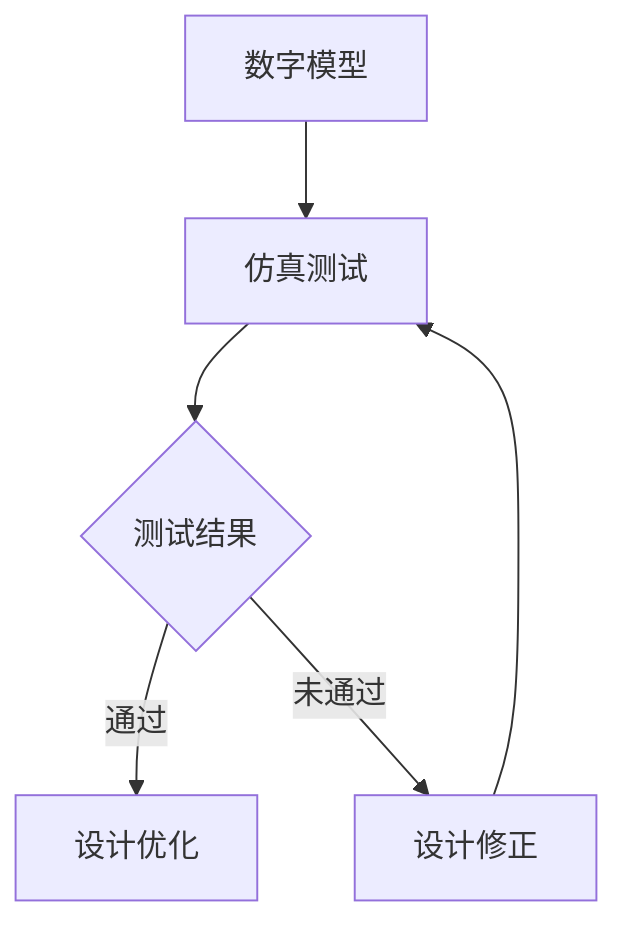
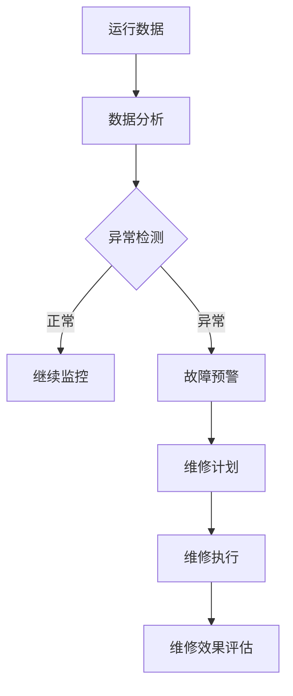
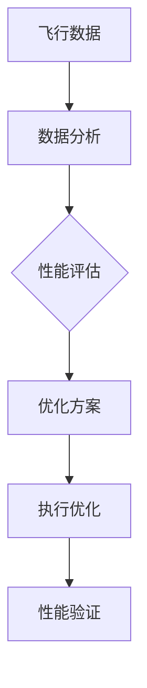
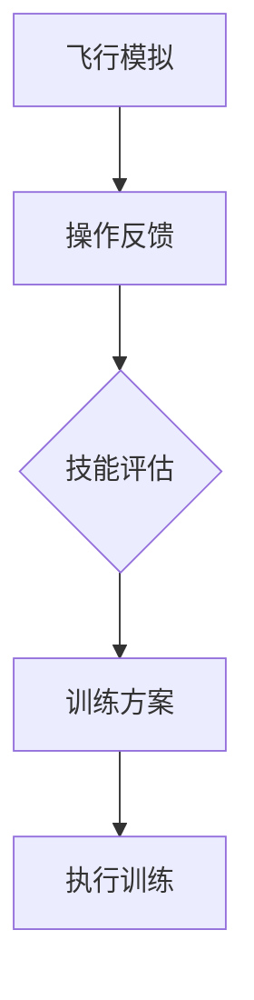
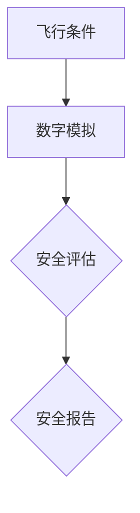

                 

### 文章标题：数字孪生在航空航天领域的应用：优化飞行器设计与维护

数字孪生（Digital Twin）技术作为一项前沿的科技手段，正在逐步改变着传统行业的发展模式。在航空航天领域，数字孪生技术不仅提升了飞行器的设计效率，还优化了维护流程，为安全性和可靠性提供了强有力的保障。本文将深入探讨数字孪生在航空航天领域的应用，详细分析其在飞行器设计与维护中的关键作用，旨在为行业从业者提供有价值的参考。

### 关键词：
- 数字孪生
- 航空航天
- 飞行器设计
- 维护流程
- 安全性
- 可靠性

### 摘要：
本文将从数字孪生的基本概念出发，介绍其在航空航天领域的应用背景和重要性。随后，我们将深入探讨数字孪生技术在飞行器设计、制造、维护和性能优化中的具体应用。通过案例分析，我们将展示数字孪生技术在实际项目中的效果。最后，本文将展望数字孪生技术的发展趋势，并提出一些行业最佳实践。

---

## 第一部分：数字孪生基础

### 1.1 数字孪生的概念与原理
数字孪生是一种通过数字化方式模拟现实世界实体对象或系统的技术，它将物理实体与其虚拟模型实时关联，形成一种数字镜像。数字孪生技术主要依赖于物联网（IoT）、大数据分析、云计算和人工智能等技术，通过采集和分析物理实体运行过程中的各种数据，实现对实体的仿真、监控、预测和优化。

在航空航天领域，数字孪生技术被广泛应用于飞行器设计、制造、维护和性能优化等环节。它不仅能够提高设计效率，还能大幅降低维护成本，提高飞行器的安全性和可靠性。

### 1.2 数字孪生与航空航天
数字孪生技术在航空航天领域具有广泛的应用前景。首先，在飞行器设计阶段，数字孪生技术可以帮助设计师更快速地生成虚拟原型，进行仿真测试，从而优化设计。在制造过程中，数字孪生技术可以实时监控制造进度，确保制造过程的准确性和高效性。在维护阶段，数字孪生技术可以通过对飞行器运行数据的分析，提前预测可能出现的问题，实现预测性维护。最后，在飞行器性能优化方面，数字孪生技术可以帮助飞行员更好地了解飞行器的性能状态，进行个性化优化。

### 1.3 数字孪生与飞行器设计
数字孪生技术在飞行器设计中的应用主要体现在以下几个方面：

1. **快速原型设计**：通过数字孪生技术，设计师可以在虚拟环境中快速构建飞行器的数字模型，进行多种设计方案的比较和优化。

2. **仿真测试**：在数字孪生环境中，可以进行飞行器的虚拟飞行测试，模拟各种飞行条件，提前发现设计中的潜在问题。

3. **性能优化**：通过数字孪生技术，可以实时监测飞行器的性能参数，为性能优化提供数据支持。

### 1.4 数字孪生与飞行器制造
数字孪生技术在飞行器制造中的应用主要表现在以下几个方面：

1. **实时监控**：在制造过程中，数字孪生技术可以实时监控制造进度，及时发现并纠正制造过程中的偏差。

2. **智能制造**：数字孪生技术可以帮助实现智能制造，提高制造过程的自动化和智能化水平。

3. **质量控制**：通过数字孪生技术，可以对制造过程进行质量监控，确保制造质量。

### 1.5 数字孪生与飞行器维护
数字孪生技术在飞行器维护中的应用主要体现在以下几个方面：

1. **预测性维护**：通过分析飞行器的运行数据，数字孪生技术可以提前预测可能出现的问题，实现预测性维护，减少故障发生的概率。

2. **实时监控**：数字孪生技术可以实时监控飞行器的运行状态，及时发现并处理异常情况。

3. **远程维护**：通过数字孪生技术，可以实现远程维护，降低维护成本。

### 1.6 数字孪生与飞行器性能优化
数字孪生技术在飞行器性能优化中的应用主要体现在以下几个方面：

1. **个性化优化**：通过数字孪生技术，可以根据飞行器的实际运行状态进行个性化优化，提高飞行器的性能。

2. **飞行路径优化**：通过数字孪生技术，可以对飞行路径进行优化，提高飞行效率。

3. **能耗优化**：通过数字孪生技术，可以优化飞行器的能耗，提高能源利用效率。

---

通过以上对数字孪生技术在航空航天领域的应用的详细探讨，我们可以看到，数字孪生技术不仅提升了飞行器的设计和制造效率，还优化了维护流程，为飞行器的安全性和可靠性提供了强有力的保障。接下来，我们将通过具体的应用实例，进一步展示数字孪生技术在航空航天领域的实际效果。

## 数字孪生技术在航空航天领域的具体应用

### 2.1 数字孪生在飞行器制造中的应用

在飞行器制造过程中，数字孪生技术的应用可以极大地提高制造效率和准确性。以下是一个具体的应用实例：

**案例：波音公司的787梦想客机制造过程**

波音公司在其787梦想客机的制造过程中广泛采用了数字孪生技术。通过建立787梦想客机的数字模型，波音公司可以在虚拟环境中对飞机的各个组件进行组装和测试，从而发现潜在的设计问题。

**核心算法原理讲解：**

在仿真测试环节，波音公司使用了多种算法，包括有限元分析（FEA）和计算流体力学（CFD），对飞机的各个组件进行应力、振动和气动性能的仿真测试。通过这些仿真测试，波音公司能够提前发现设计中的潜在问题，并进行优化。

**数学模型和公式：**

为了进行仿真测试，波音公司使用了以下数学模型：

$$
\text{应力} = \frac{\text{外力}}{\text{截面积}}
$$

$$
\text{振动频率} = \frac{1}{2\pi}\sqrt{\frac{k}{m}}
$$

其中，应力、振动频率等参数是通过对飞机各个组件进行有限元分析得到的。

**举例说明：**

在787梦想客机的设计过程中，波音公司通过数字孪生技术对飞机的起落架进行了多次仿真测试。通过这些测试，波音公司发现起落架在设计上存在一定的应力集中问题，经过优化设计后，最终解决了这一问题，确保了起落架的稳定性和安全性。

**最佳实践 tips：**

1. **全面测试**：在制造过程中，应进行全面的仿真测试，包括结构、气动、热力学等多个方面。
2. **实时反馈**：将仿真测试结果实时反馈到设计环节，及时进行优化。
3. **团队合作**：数字孪生技术的应用需要设计、制造、测试等多个环节的紧密合作。

### 2.2 数字孪生在飞行器维护中的应用

在飞行器维护过程中，数字孪生技术可以帮助实现预测性维护，降低故障率，提高飞机的可用性。以下是一个具体的应用实例：

**案例：空中客车公司的A320neo飞机维护**

空中客车公司在A320neo飞机的维护中采用了数字孪生技术。通过实时监控飞机的运行数据，空中客车公司能够提前预测可能出现的故障，并采取预防措施。

**核心算法原理讲解：**

在数据分析环节，空中客车公司使用了机器学习算法，对飞机的运行数据进行分析，识别出潜在的故障风险。通过异常检测，系统可以及时发现异常情况，并发出故障预警。

**数学模型和公式：**

为了进行异常检测，空中客车公司使用了以下数学模型：

$$
\text{异常分数} = \sum_{i=1}^{n} (\text{实际值} - \text{预期值})^2
$$

其中，实际值和预期值是通过对飞机的运行数据进行统计回归得到的。

**举例说明：**

在一次飞行过程中，A320neo飞机的发动机振动数据出现了异常。通过数字孪生技术，空中客车公司及时发现这一问题，并安排了紧急维修。经过维修后，发动机的性能得到了恢复，避免了可能的故障。

**最佳实践 tips：**

1. **数据采集**：确保数据采集的全面性和准确性，为分析提供可靠的数据支持。
2. **机器学习**：使用先进的机器学习算法，提高异常检测的准确性和效率。
3. **预防性维护**：根据故障预警结果，提前进行预防性维护，降低故障率。

### 2.3 数字孪生在飞行器性能优化中的应用

在飞行器性能优化过程中，数字孪生技术可以帮助飞行员更好地了解飞行器的性能状态，进行个性化的优化。以下是一个具体的应用实例：

**案例：美国航空航天局（NASA）的X-57普罗米修斯飞机性能优化**

NASA的X-57普罗米修斯飞机采用了电动推进系统，为了提高其性能，NASA采用了数字孪生技术进行优化。

**核心算法原理讲解：**

在数据分析环节，NASA对飞行器的各项性能参数进行了全面的分析，包括续航时间、飞行速度、负载能力等。通过性能评估，NASA能够确定飞机的性能瓶颈，并提出优化方案。

**数学模型和公式：**

为了进行性能评估，NASA使用了以下数学模型：

$$
\text{性能得分} = \frac{\text{实际值}}{\text{预期值}}
$$

其中，实际值和预期值是通过历史数据和仿真结果得到的。

**举例说明：**

在一次飞行测试中，X-57普罗米修斯飞机的续航时间未能达到预期。通过数字孪生技术，NASA确定了电池性能和气动性能是影响续航时间的主要因素，并通过优化电池管理系统和气动设计，成功提高了飞机的续航时间。

**最佳实践 tips：**

1. **数据驱动**：基于实际飞行数据，进行性能评估和优化。
2. **持续迭代**：不断进行性能测试和优化，逐步提高飞机的性能。
3. **飞行员培训**：提高飞行员对数字孪生技术的理解和应用能力，使其能够更好地利用数字孪生技术进行性能优化。

### 2.4 数字孪生在飞行器训练中的应用

在飞行器训练过程中，数字孪生技术可以帮助飞行员进行虚拟训练，提高训练效果。以下是一个具体的应用实例：

**案例：联合技术公司的飞行模拟器训练**

联合技术公司为其飞行员培训项目开发了数字孪生飞行模拟器。通过数字孪生技术，飞行员可以在虚拟环境中进行各种飞行操作，提高飞行技能。

**核心算法原理讲解：**

在飞行模拟环节，飞行员通过数字孪生飞行模拟器进行各种飞行操作，系统会实时反馈飞行结果。通过技能评估，系统可以评估飞行员的飞行技能，并提出个性化的训练方案。

**数学模型和公式：**

为了进行技能评估，系统使用了以下数学模型：

$$
\text{技能得分} = \sum_{i=1}^{n} (\text{操作结果} - \text{预期结果})^2
$$

其中，操作结果和预期结果是通过对飞行员的操作进行统计分析得到的。

**举例说明：**

在一次飞行模拟中，飞行员未能按照预期完成一个复杂的空中转弯操作。通过数字孪生技术，系统发现了这一问题，并提出了针对性的训练方案，帮助飞行员提高飞行技能。

**最佳实践 tips：**

1. **虚拟训练**：利用数字孪生技术进行虚拟训练，提高训练的效率和效果。
2. **实时反馈**：及时反馈飞行结果，帮助飞行员了解自己的飞行技能。
3. **个性化训练**：根据飞行员的实际飞行数据，制定个性化的训练方案。

### 2.5 数字孪生在飞行器安全性能评估中的应用

在飞行器安全性能评估过程中，数字孪生技术可以帮助进行更全面、细致的评估。以下是一个具体的应用实例：

**案例：美国联邦航空管理局（FAA）的飞行器安全性能评估**

美国联邦航空管理局（FAA）在其飞行器安全性能评估中采用了数字孪生技术。通过数字孪生模型，FAA可以模拟飞行器在各种极端条件下的运行状态，评估其安全性能。

**核心算法原理讲解：**

在数字模拟环节，FAA使用多种算法，包括多体动力学（MBD）和流体动力学（CFD），模拟飞行器在不同飞行条件下的运行状态。通过安全评估，FAA可以确定飞行器的安全性能。

**数学模型和公式：**

为了进行安全评估，FAA使用了以下数学模型：

$$
\text{安全性能评分} = \sum_{i=1}^{n} (\text{实际值} - \text{安全阈值})^2
$$

其中，实际值和安全阈值是通过历史数据和仿真结果得到的。

**举例说明：**

在一次安全性能评估中，FAA通过数字孪生模型模拟了飞行器在极端风切变条件下的运行状态。通过评估，FAA确定了飞行器的安全性能达到了标准，为飞行器的设计和制造提供了重要参考。

**最佳实践 tips：**

1. **全面模拟**：模拟飞行器在多种极端条件下的运行状态，确保评估的全面性。
2. **数据驱动**：基于实际数据和仿真结果，进行安全性能评估。
3. **持续更新**：随着技术的进步，不断更新数字孪生模型，提高评估的准确性。

## 数字孪生技术在航空航天领域的实际效果

通过上述案例分析，我们可以看到，数字孪生技术在航空航天领域的应用取得了显著的成效。具体体现在以下几个方面：

1. **提高设计效率**：数字孪生技术帮助设计师在虚拟环境中进行快速原型设计和仿真测试，优化设计过程，提高设计效率。

2. **降低制造成本**：数字孪生技术实时监控制造过程，提高制造精度，降低制造成本。

3. **提高维护效率**：数字孪生技术通过预测性维护和实时监控，提高维护效率，减少故障率。

4. **提高飞行器性能**：数字孪生技术帮助飞行员更好地了解飞行器性能状态，进行个性化优化，提高飞行器性能。

5. **提高飞行安全**：数字孪生技术通过模拟飞行器在多种极端条件下的运行状态，进行安全性能评估，提高飞行安全。

## 数字孪生技术的挑战与未来发展趋势

尽管数字孪生技术在航空航天领域取得了显著成效，但其应用仍面临一些挑战。首先，数据安全和隐私保护是一个重要的问题。在数字孪生技术中，大量的数据被收集、存储和分析，这些数据可能包含敏感信息，如飞行数据、维护记录等。因此，确保数据的安全和隐私保护是数字孪生技术广泛应用的关键。

其次，数字孪生技术的实施成本较高。数字孪生技术的实施需要投入大量的资金和人力，包括硬件设备、软件开发、数据存储和分析等。因此，如何降低实施成本，提高性价比，是数字孪生技术进一步推广的关键。

未来，随着技术的不断进步，数字孪生技术将在航空航天领域得到更广泛的应用。一方面，人工智能和大数据分析技术的发展将进一步提高数字孪生技术的分析能力和精度。另一方面，物联网和云计算技术的发展将使得数字孪生技术的实时性和灵活性得到大幅提升。

此外，随着5G技术的普及，数字孪生技术的实时性和高效性将得到进一步保障，为航空航天领域的实时监控、预测性维护和个性化优化提供更好的支持。

## 最佳实践 tips

1. **数据驱动**：在应用数字孪生技术时，应注重数据收集、处理和分析，确保数据的准确性和全面性。

2. **团队合作**：数字孪生技术的实施涉及多个环节，需要设计、制造、维护等部门的紧密合作。

3. **持续迭代**：数字孪生技术是一个不断发展的过程，需要持续进行技术升级和优化。

4. **安全优先**：在数字孪生技术的应用过程中，应高度重视数据安全和隐私保护。

## 小结

数字孪生技术在航空航天领域的应用为飞行器的设计、制造、维护和性能优化提供了全新的解决方案。通过本文的探讨，我们可以看到，数字孪生技术不仅提高了飞行器的安全性和可靠性，还优化了设计效率和制造流程。随着技术的不断进步，数字孪生技术将在航空航天领域发挥越来越重要的作用。

## 注意事项

1. **数据安全**：在数字孪生技术的应用过程中，必须确保数据的安全和隐私保护。

2. **技术实施**：数字孪生技术的实施需要投入大量的资金和人力，需要做好充分的准备。

3. **人才培养**：数字孪生技术需要具备相关技能的人才，应注重人才培养和引进。

## 拓展阅读

1. **《数字孪生：下一个工业革命》**：这本书详细介绍了数字孪生技术的概念、原理和应用。

2. **《数字孪生：从概念到实践》**：这本书从实践的角度，介绍了数字孪生技术的具体应用案例。

3. **《航空航天数字化制造技术》**：这本书详细介绍了航空航天领域的数字化制造技术，包括数字孪生技术。

