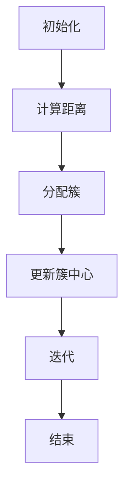
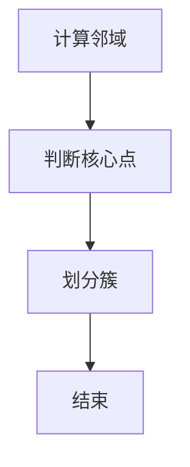
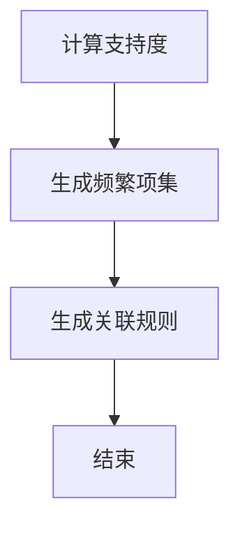
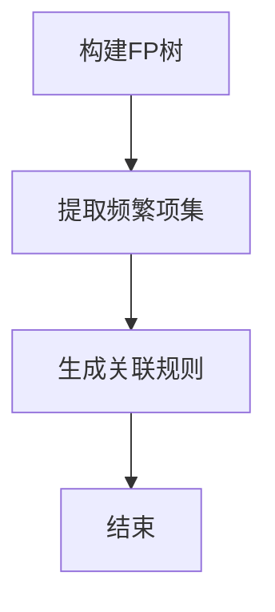

                 

# 《数字孪生城市：智慧城市管理的新模式》

## 关键词
- 数字孪生
- 智慧城市
- 数据采集
- 数据处理
- 仿真模拟
- 优化算法
- 机器学习
- 深度学习

## 摘要
本文旨在探讨数字孪生城市作为智慧城市管理新模式的重要性及其应用。首先，介绍了数字孪生城市的基本概念和背景，阐述了其与智慧城市的紧密联系。随后，详细解析了数字孪生城市的核心概念、架构和算法原理，并使用Mermaid流程图进行辅助说明。通过实际案例展示，本文进一步探讨了数字孪生城市在智慧城市管理中的具体应用，包括数据收集与处理、模型构建与优化、仿真与模拟等。最后，总结了数字孪生城市的发展现状和未来趋势，提出了潜在的研究方向和应用领域。

## 第1章 引言

### 1.1 数字孪生城市的定义与背景

数字孪生（Digital Twin）是指通过数字化方式模拟现实世界中的物理实体、过程或系统。数字孪生城市（Digital Twin City）则是在数字孪生概念的基础上，将城市中的各种物理实体和过程进行数字化模拟，构建出一个与实际城市高度一致的虚拟模型。这一虚拟模型可以实时反映实际城市的状态，并通过仿真和模拟技术对城市进行预测和管理。

数字孪生城市的概念最早出现在20世纪90年代，随着信息技术和物联网技术的发展，数字孪生技术逐渐成熟，并在城市管理、工业制造、基础设施等领域得到广泛应用。近年来，随着智慧城市建设的推进，数字孪生城市成为智慧城市管理的一种新模式，具有重要的现实意义。

### 1.2 数字孪生城市的重要性

数字孪生城市对智慧城市管理具有以下几个重要意义：

1. **提高城市管理水平**：通过数字孪生技术，可以实现对城市运行状态的实时监控和预测，有助于提高城市管理的精细化、智能化水平。

2. **优化资源配置**：数字孪生城市可以模拟各种决策场景，帮助城市规划者优化资源配置，降低运营成本，提高城市运行效率。

3. **促进可持续发展**：数字孪生城市能够模拟城市生态、交通、能源等系统的运行，有助于制定更加科学合理的可持续发展战略。

4. **增强城市应急响应能力**：通过数字孪生城市，可以提前预测和模拟各种紧急事件，提高城市应急响应能力和防灾减灾能力。

### 1.3 本书结构概述

本书分为五个主要部分：

1. **核心概念与联系**：介绍数字孪生和智慧城市的核心概念及其关系。
2. **架构讲解**：阐述数字孪生城市的整体架构，包括数据采集、数据处理、模型构建、仿真模拟等。
3. **核心算法原理**：深入讲解数字孪生城市中所涉及的关键算法，如数据挖掘、机器学习、深度学习等。
4. **项目实战**：通过实际案例展示数字孪生城市在智慧城市管理中的应用。
5. **展望与结论**：总结数字孪生城市的发展现状和未来趋势，提出潜在的研究方向和应用领域。

## 第2章 核心概念与联系

### 2.1 数字孪生概念详解

数字孪生是指通过数字化方式创建物理实体、系统或过程的虚拟模型。这个虚拟模型能够实时反映物理实体的状态、行为和性能。数字孪生的核心在于将现实世界的实体和虚拟模型进行无缝连接，实现数据驱动的决策和优化。

数字孪生技术主要包括以下几个关键组成部分：

1. **数据采集**：通过传感器、物联网设备等手段，收集物理实体的实时数据。
2. **数据处理**：对采集到的数据进行分析、处理和整合，为虚拟模型提供基础数据支持。
3. **模型构建**：基于采集到的数据，构建与物理实体高度一致的虚拟模型。
4. **仿真模拟**：在虚拟模型中模拟实际城市运行情况，进行预测、优化和决策。

### 2.1.2 数字孪生与物理实体的关联

数字孪生与物理实体之间的关联主要体现在以下几个方面：

1. **实时数据同步**：数字孪生通过传感器和物联网设备实时收集物理实体的数据，并将其同步到虚拟模型中，保证虚拟模型与物理实体的状态一致性。
2. **状态反馈与调整**：虚拟模型可以实时反馈物理实体的状态信息，帮助物理实体进行优化调整，实现实时控制和优化。
3. **预测与决策支持**：基于虚拟模型进行仿真和模拟，可以提前预测物理实体的未来状态和行为，为决策提供科学依据。

### 2.1.3 数字孪生与智慧城市的关系

数字孪生与智慧城市之间存在着密切的关系。智慧城市是指利用信息技术和物联网技术，实现城市运行、管理和服务的高效、智能化。数字孪生技术为智慧城市的建设提供了有力支撑。

1. **数据驱动的城市管理**：数字孪生技术通过实时数据采集和分析，为城市管理提供了丰富的数据资源，实现了数据驱动的城市管理。
2. **城市运行优化**：数字孪生城市可以模拟各种运行场景，帮助城市规划者进行城市运行优化，提高城市运行效率。
3. **城市应急响应**：数字孪生城市可以提前预测和模拟各种紧急事件，为城市应急响应提供科学依据，提高城市应急能力。

### 2.2 智慧城市概念详解

智慧城市是指利用信息技术、物联网、大数据等手段，实现城市运行、管理和服务的高效、智能化。智慧城市的核心在于通过信息技术手段，提升城市管理的智能化水平和运行效率。

智慧城市的主要特征包括：

1. **信息透明化**：通过信息技术手段，实现城市运行数据的透明化和公开化，提高城市管理的透明度。
2. **服务便捷化**：通过互联网和移动应用，为市民提供便捷的城市服务，提升市民的生活质量。
3. **管理智能化**：通过大数据分析和人工智能技术，实现城市管理的智能化，提高城市管理的精准性和效率。
4. **资源高效利用**：通过优化资源配置，实现城市资源的最大化利用，提高城市运行效率。

### 2.2.2 智慧城市的特征

智慧城市的特征主要包括以下几个方面：

1. **物联网连接**：通过物联网技术，实现城市各个系统和设备之间的互联互通，提升城市运行的整体效率。
2. **大数据分析**：通过大数据技术，对城市运行数据进行收集、存储和分析，为城市管理提供科学依据。
3. **人工智能应用**：通过人工智能技术，实现城市管理的智能化，提升城市管理的精准性和效率。
4. **市民参与**：通过互联网和移动应用，鼓励市民参与城市管理，提高市民的参与度和满意度。

### 2.2.3 智慧城市的技术支撑

智慧城市的技术支撑主要包括以下几个方面：

1. **物联网技术**：通过传感器和物联网设备，实现城市各个系统和设备之间的数据采集和传输。
2. **大数据技术**：通过大数据技术，对城市运行数据进行分析和处理，为城市管理提供决策支持。
3. **云计算技术**：通过云计算技术，实现城市数据的存储、计算和共享，提高城市运行效率。
4. **人工智能技术**：通过人工智能技术，实现城市管理的智能化，提升城市管理的精准性和效率。

## 第3章 数字孪生城市整体架构

数字孪生城市作为智慧城市管理的新模式，其整体架构涉及多个关键环节，包括数据采集、数据处理、模型构建、仿真模拟等。下面将详细阐述这些环节，并使用Mermaid流程图进行辅助说明。

### 3.1 数据采集

数据采集是数字孪生城市的核心环节之一，主要包括以下三个方面：

1. **传感器数据采集**：通过安装在物理实体上的传感器，实时采集温度、湿度、光照、交通流量等环境数据。
2. **物联网数据采集**：通过物联网设备，实时采集城市各个系统和设备的运行数据，如电网负荷、供水系统状态、交通信号灯数据等。
3. **用户行为数据采集**：通过移动应用和社交媒体，实时采集市民的出行、消费等行为数据。

### 3.1.1 数据源类型

数据源类型主要包括以下几种：

1. **环境数据**：包括温度、湿度、光照、风速等气象数据，以及水质、空气质量等环境监测数据。
2. **交通数据**：包括道路流量、车辆速度、交通事故等交通数据。
3. **基础设施数据**：包括电网、供水、排水、燃气等基础设施的运行状态数据。
4. **用户数据**：包括市民的出行、消费、社交等行为数据。

### 3.1.2 数据采集方法

数据采集方法主要包括以下几种：

1. **无线传感器网络**：通过无线传感器网络，实现对城市环境的实时监测和数据采集。
2. **物联网平台**：通过物联网平台，实现对城市各个系统和设备的运行数据采集。
3. **移动应用**：通过移动应用，实时采集市民的出行、消费等行为数据。

### 3.1.3 数据质量控制

数据质量控制是确保数字孪生城市数据准确性和可靠性的重要环节，主要包括以下方面：

1. **数据清洗**：去除重复数据、异常数据和噪声数据，确保数据质量。
2. **数据校验**：对采集到的数据进行分析和校验，确保数据的一致性和完整性。
3. **数据加密**：对敏感数据进行加密处理，确保数据的安全性和隐私性。

### 3.2 数据处理与存储

数据处理与存储是数字孪生城市的核心环节之一，主要包括以下三个方面：

1. **数据预处理**：对采集到的原始数据进行清洗、去噪、归一化等预处理操作，提高数据质量。
2. **数据存储**：将预处理后的数据存储在分布式数据库或云存储系统中，实现数据的长期保存和管理。
3. **数据管理与维护**：建立数据管理平台，实现对数据的实时查询、统计和分析，确保数据的可用性和可维护性。

### 3.2.1 数据预处理

数据预处理主要包括以下方面：

1. **数据清洗**：去除重复数据、异常数据和噪声数据，确保数据质量。
2. **数据归一化**：将不同量纲的数据进行归一化处理，使其在同一尺度范围内进行比较和分析。
3. **特征提取**：从原始数据中提取关键特征，为模型训练提供基础数据。

### 3.2.2 数据存储架构

数据存储架构主要包括以下几种：

1. **关系型数据库**：适用于存储结构化数据，如SQL数据库。
2. **NoSQL数据库**：适用于存储非结构化或半结构化数据，如MongoDB、Cassandra等。
3. **云存储**：利用云存储技术，实现数据的分布式存储和管理，提高数据存储的可靠性和可用性。

### 3.2.3 数据管理与维护

数据管理与维护主要包括以下方面：

1. **数据备份与恢复**：定期进行数据备份，确保数据的安全性和可靠性。
2. **数据更新与同步**：实时更新数据，确保数据的实时性和一致性。
3. **数据安全与隐私**：采用数据加密、访问控制等技术，确保数据的安全性和隐私性。

### 3.3 模型构建

模型构建是数字孪生城市的核心环节之一，主要包括以下三个方面：

1. **模型选择**：根据应用场景和数据特点，选择合适的模型。
2. **模型训练**：利用训练数据对模型进行训练，使其具备对城市运行状态进行预测和优化能力。
3. **模型评估**：通过测试数据对模型进行评估，确保模型的有效性和可靠性。

### 3.3.1 模型选择

模型选择主要包括以下几种：

1. **统计模型**：如线性回归、逻辑回归等，适用于简单的预测任务。
2. **机器学习模型**：如支持向量机、决策树、随机森林等，适用于复杂预测任务。
3. **深度学习模型**：如卷积神经网络（CNN）、循环神经网络（RNN）等，适用于高维数据和复杂非线性关系。

### 3.3.2 模型训练

模型训练主要包括以下方面：

1. **数据划分**：将数据集划分为训练集、验证集和测试集，用于模型训练、验证和评估。
2. **训练策略**：采用合适的训练策略，如批量训练、随机梯度下降等，提高模型训练效果。
3. **模型优化**：通过调整模型参数，提高模型预测精度和泛化能力。

### 3.3.3 模型评估

模型评估主要包括以下方面：

1. **评价指标**：如准确率、召回率、F1值等，用于评估模型预测效果。
2. **交叉验证**：采用交叉验证方法，确保模型评估的准确性和可靠性。
3. **模型优化**：根据评估结果，调整模型参数和结构，提高模型预测效果。

### 3.4 仿真与模拟

仿真与模拟是数字孪生城市的核心环节之一，主要包括以下三个方面：

1. **仿真模型构建**：根据城市运行特点和需求，构建仿真模型，实现对城市运行状态进行模拟。
2. **仿真环境设置**：设置合适的仿真环境和参数，确保仿真结果的准确性和可靠性。
3. **仿真结果分析**：对仿真结果进行分析和评估，为城市管理提供科学依据。

### 3.4.1 仿真模型构建

仿真模型构建主要包括以下方面：

1. **物理模型构建**：基于物理原理和数学模型，构建城市运行状态的物理模型。
2. **数据驱动模型构建**：基于历史数据和统计规律，构建城市运行状态的数据驱动模型。
3. **混合模型构建**：结合物理模型和数据驱动模型，构建混合仿真模型。

### 3.4.2 仿真环境设置

仿真环境设置主要包括以下方面：

1. **仿真参数设置**：根据实际需求和仿真模型的特点，设置合适的仿真参数，如仿真时间、步长、初始条件等。
2. **仿真工具选择**：选择合适的仿真工具，如MATLAB、Python等，实现仿真模型的构建和运行。
3. **仿真结果记录**：实时记录仿真过程中的关键数据，如状态变化、性能指标等，为仿真结果分析提供基础。

### 3.4.3 仿真结果分析

仿真结果分析主要包括以下方面：

1. **结果可视化**：通过图表、图像等可视化手段，展示仿真结果，便于分析。
2. **结果对比**：将仿真结果与实际运行数据进行对比，评估仿真模型的准确性和可靠性。
3. **结果优化**：根据仿真结果，对仿真模型进行调整和优化，提高仿真效果。

## 第4章 核心算法原理

数字孪生城市在智慧城市管理中的应用，离不开核心算法的支持。核心算法主要包括数据挖掘、机器学习和深度学习等领域。下面将详细讲解这些算法的原理和应用。

### 4.1 数据挖掘算法

数据挖掘算法是指从大量数据中提取有价值信息的方法。在数字孪生城市中，数据挖掘算法用于从海量数据中提取关键信息，为城市管理提供支持。

#### 4.1.1 聚类算法

聚类算法是将数据集划分为多个类别的算法。常用的聚类算法包括K-means算法和DBSCAN算法。

##### 4.1.1.1 K-means算法

K-means算法是一种基于距离度量的聚类算法。其基本思想是将数据集划分为K个簇，使得每个簇内的数据点之间的距离最小，簇与簇之间的距离最大。



##### 4.1.1.2 DBSCAN算法

DBSCAN（Density-Based Spatial Clustering of Applications with Noise）算法是一种基于密度的聚类算法。其基本思想是：在数据空间中，根据数据的密度分布，将数据点划分为核心点、边界点和噪声点。



#### 4.1.2 关联规则挖掘算法

关联规则挖掘算法用于发现数据之间的关联关系。常用的关联规则挖掘算法包括Apriori算法和FP-growth算法。

##### 4.1.2.1 Apriori算法

Apriori算法是一种基于支持度和置信度的关联规则挖掘算法。其基本思想是通过频繁项集生成关联规则，其中频繁项集是指支持度大于最小支持度的项集。



##### 4.1.2.2 FP-growth算法

FP-growth算法是一种基于频繁模式树的关联规则挖掘算法。其基本思想是通过构建频繁模式树，提取频繁项集，并生成关联规则。



### 4.2 机器学习算法

机器学习算法是指通过学习已有数据，建立模型并进行预测的方法。在数字孪生城市中，机器学习算法用于预测城市运行状态、优化城市管理。

#### 4.2.1 监督学习算法

监督学习算法是指通过已有数据，建立预测模型的方法。常用的监督学习算法包括线性回归、支持向量机等。

##### 4.2.1.1 线性回归算法

线性回归算法是一种用于预测连续值的监督学习算法。其基本思想是通过最小化损失函数，建立输入和输出之间的线性关系。

```python
# 线性回归伪代码
def linear_regression(X, y):
    # 求解回归系数
    theta = solve(X'X, X'y)
    # 预测
    y_pred = X * theta
    return y_pred
```

##### 4.2.1.2 支持向量机算法

支持向量机算法是一种用于分类和回归的监督学习算法。其基本思想是通过找到一个最佳的超平面，使得分类或回归的预测误差最小。

```python
# 支持向量机伪代码
def support_vector_machine(X, y):
    # 求解最优超平面
    w, b = solve_qp(P, q, G, h)
    # 预测
    y_pred = sign(X * w + b)
    return y_pred
```

#### 4.2.2 无监督学习算法

无监督学习算法是指没有已标注数据，通过学习数据结构的方法。常用的无监督学习算法包括主成分分析、自编码器等。

##### 4.2.2.1 主成分分析算法

主成分分析算法是一种用于降维和特征提取的无监督学习算法。其基本思想是通过求解特征值和特征向量，将数据投影到新的坐标系中，保留主要信息。

```python
# 主成分分析伪代码
def pca(X):
    # 求解协方差矩阵
    cov_matrix = np.cov(X)
    # 求解特征值和特征向量
    eigen_values, eigen_vectors = np.linalg.eigh(cov_matrix)
    # 选择主要特征
    main_components = X * eigen_vectors[:, :k]
    return main_components
```

##### 4.2.2.2 自编码器算法

自编码器算法是一种用于降维和特征提取的无监督学习算法。其基本思想是通过训练一个压缩编码模型，将输入数据映射到一个低维空间中。

```python
# 自编码器伪代码
def autoencoder(X):
    # 编码器
    encoded = encode(X)
    # 解码器
    decoded = decode(encoded)
    return decoded
```

### 4.3 深度学习算法

深度学习算法是指通过多层神经网络，自动提取数据特征的方法。在数字孪生城市中，深度学习算法用于复杂模型的构建和预测。

#### 4.3.1 卷积神经网络算法

卷积神经网络（CNN）是一种用于图像处理的深度学习算法。其基本思想是通过卷积操作和池化操作，提取图像特征。

##### 4.3.1.1 卷积神经网络原理

卷积神经网络的基本结构包括卷积层、池化层和全连接层。卷积层通过卷积操作提取图像特征，池化层通过池化操作降低特征维度，全连接层通过全连接操作进行分类或回归。

```python
# 卷积神经网络伪代码
class ConvolutionalNeuralNetwork:
    def __init__(self, input_shape, num_classes):
        # 初始化网络参数
        self.conv_layers = []
        self.pool_layers = []
        self.fc_layers = []

    def forward(self, X):
        # 前向传播
        for layer in self.conv_layers:
            X = layer.forward(X)
        for layer in self.pool_layers:
            X = layer.forward(X)
        X = self.fc_layers[-1].forward(X)
        return X

    def backward(self, dX):
        # 反向传播
        for layer in reversed(self.fc_layers):
            dX = layer.backward(dX)
        for layer in reversed(self.pool_layers):
            dX = layer.backward(dX)
        for layer in reversed(self.conv_layers):
            dX = layer.backward(dX)
        return dX
```

##### 4.3.1.2 卷积神经网络在数字孪生城市中的应用

卷积神经网络在数字孪生城市中主要用于图像处理和视频分析，如交通流量监测、异常事件检测等。

```python
# 交通流量监测
class TrafficFlowMonitor(CNN):
    def __init__(self, input_shape, num_classes):
        super().__init__(input_shape, num_classes)

    def forward(self, X):
        # 处理输入图像
        X = self.conv_layers[0].forward(X)
        X = self.pool_layers[0].forward(X)
        # 预测交通流量
        X = self.fc_layers[-1].forward(X)
        return X

    def backward(self, dX):
        # 反向传播
        dX = self.fc_layers[-1].backward(dX)
        dX = self.pool_layers[0].backward(dX)
        dX = self.conv_layers[0].backward(dX)
        return dX
```

#### 4.3.2 循环神经网络算法

循环神经网络（RNN）是一种用于序列处理的深度学习算法。其基本思想是通过循环机制，捕捉序列数据中的长期依赖关系。

##### 4.3.2.1 循环神经网络原理

循环神经网络的基本结构包括输入层、隐藏层和输出层。输入层接收序列数据，隐藏层通过循环机制更新状态，输出层生成预测结果。

```python
# 循环神经网络伪代码
class RecurrentNeuralNetwork:
    def __init__(self, input_size, hidden_size, output_size):
        # 初始化网络参数
        self.hidden_size = hidden_size
        self.input_size = input_size
        self.output_size = output_size
        self.hidden_state = None

    def forward(self, X):
        # 前向传播
        for x in X:
            h = self.compute_hidden_state(x)
            y = self.compute_output(h)
        return y

    def backward(self, dX):
        # 反向传播
        dH = self.compute_dH(dX)
        dX = self.compute_dX(dH)
        return dX

    def compute_hidden_state(self, x):
        # 计算隐藏状态
        h = self activation(np.dot(x, self.W_h) + np.dot(self.h, self.W_h))
        return h

    def compute_output(self, h):
        # 计算输出
        y = self.activation(np.dot(h, self.W_y) + self.b_y)
        return y

    def compute_dH(self, dY):
        # 计算隐藏状态梯度
        dH = self.activation_derivative(np.dot(dY, self.W_y)) * self.W_h.T
        return dH

    def compute_dX(self, dH):
        # 计算输入梯度
        dX = self.activation_derivative(np.dot(dH, self.W_h)) * self.W_x.T
        return dX
```

##### 4.3.2.2 循环神经网络在数字孪生城市中的应用

循环神经网络在数字孪生城市中主要用于时间序列预测、交通流量预测等。

```python
# 交通流量预测
class TrafficFlowPredictor(RNN):
    def __init__(self, input_size, hidden_size, output_size):
        super().__init__(input_size, hidden_size, output_size)

    def forward(self, X):
        # 前向传播
        self.hidden_state = self.compute_hidden_state(X)
        y = self.compute_output(self.hidden_state)
        return y

    def backward(self, dY):
        # 反向传播
        dH = self.compute_dH(dY)
        dX = self.compute_dX(dH)
        return dX
```

## 第5章 数学模型与公式

在数字孪生城市中，数学模型和公式是构建和优化模型的基础。本章节将介绍数字孪生城市中的相关数学模型和公式，并进行详细讲解和举例说明。

### 5.1 优化模型

优化模型是数字孪生城市中用于求解最优解的模型。常见的优化模型包括线性规划模型和整数规划模型。

#### 5.1.1 线性规划模型

线性规划模型是指目标函数和约束条件均为线性的优化问题。其标准形式如下：

$$
\begin{aligned}
\min\limits_{x} & \quad c^T x \\
\text{s.t.} & \quad Ax \le b \\
& \quad x \ge 0
\end{aligned}
$$

其中，$x$是变量，$c$是目标函数系数，$A$是约束条件系数矩阵，$b$是约束条件常数向量。

**示例**：求解以下线性规划问题：

$$
\begin{aligned}
\min\limits_{x} & \quad x_1 + 2x_2 \\
\text{s.t.} & \quad x_1 + x_2 \le 4 \\
& \quad x_1 - x_2 \ge -2 \\
& \quad x_1, x_2 \ge 0
\end{aligned}
$$

**解法**：利用单纯形法求解该线性规划问题，得到的解为$x_1 = 2, x_2 = 0$，最小值为2。

#### 5.1.2 整数规划模型

整数规划模型是指目标函数和约束条件中包含整数变量的优化问题。其标准形式如下：

$$
\begin{aligned}
\min\limits_{x} & \quad c^T x \\
\text{s.t.} & \quad Ax \le b \\
& \quad x \in \mathbb{Z}^n
\end{aligned}
$$

其中，$x$是整数变量，$c$是目标函数系数，$A$是约束条件系数矩阵，$b$是约束条件常数向量。

**示例**：求解以下整数规划问题：

$$
\begin{aligned}
\min\limits_{x} & \quad x_1 + 2x_2 \\
\text{s.t.} & \quad x_1 + x_2 \le 4 \\
& \quad x_1 - x_2 \ge -2 \\
& \quad x_1, x_2 \in \mathbb{Z}
\end{aligned}
$$

**解法**：利用分支定界法求解该整数规划问题，得到的解为$x_1 = 2, x_2 = 1$，最小值为3。

### 5.2 预测模型

预测模型是数字孪生城市中用于预测未来状态或行为的模型。常见的预测模型包括时间序列预测模型和回归预测模型。

#### 5.2.1 时间序列预测模型

时间序列预测模型是指基于时间序列数据，预测未来值的模型。常见的模型包括ARIMA模型、LSTM模型等。

**ARIMA模型**：

ARIMA（AutoRegressive Integrated Moving Average）模型是一种常用的时间序列预测模型。其基本思想是：利用自回归、差分和移动平均等方法，对时间序列进行建模。

**LSTM模型**：

LSTM（Long Short-Term Memory）模型是一种常用的深度学习模型，用于处理时间序列数据。其基本思想是通过记忆单元和门控机制，捕捉时间序列数据中的长期依赖关系。

**示例**：使用LSTM模型进行时间序列预测。

```python
import tensorflow as tf
from tensorflow.keras.models import Sequential
from tensorflow.keras.layers import LSTM, Dense

# 准备数据
X, y = prepare_data()

# 构建LSTM模型
model = Sequential()
model.add(LSTM(units=50, return_sequences=True, input_shape=(X.shape[1], X.shape[2])))
model.add(LSTM(units=50))
model.add(Dense(1))

# 编译模型
model.compile(optimizer='adam', loss='mean_squared_error')

# 训练模型
model.fit(X, y, epochs=100, batch_size=32)

# 预测
predictions = model.predict(X)
```

#### 5.2.2 回归预测模型

回归预测模型是指基于输入变量，预测目标变量的模型。常见的模型包括线性回归、多项式回归等。

**线性回归模型**：

线性回归模型是一种基于线性关系的预测模型。其基本思想是通过最小化损失函数，建立输入变量和目标变量之间的线性关系。

**多项式回归模型**：

多项式回归模型是一种基于多项式关系的预测模型。其基本思想是通过最小化损失函数，建立输入变量和目标变量之间的多项式关系。

**示例**：使用多项式回归模型进行预测。

```python
import numpy as np
from sklearn.linear_model import LinearRegression

# 准备数据
X = np.array([[1], [2], [3], [4], [5]])
y = np.array([1, 2, 4, 8, 16])

# 构建线性回归模型
model = LinearRegression()

# 编译模型
model.fit(X, y)

# 预测
predictions = model.predict(np.array([[6]]))
```

### 5.3 最优化算法

最优化算法是数字孪生城市中用于求解最优化问题的方法。常见的最优化算法包括梯度下降法、牛顿法等。

#### 5.3.1 梯度下降法

梯度下降法是一种基于损失函数梯度的最优化算法。其基本思想是通过迭代更新参数，使得损失函数逐渐减小。

**示例**：使用梯度下降法求解线性回归问题。

```python
import numpy as np

# 准备数据
X = np.array([[1], [2], [3], [4], [5]])
y = np.array([1, 2, 4, 8, 16])

# 初始化参数
theta = np.zeros((2, 1))

# 梯度下降法迭代
alpha = 0.01
num_iterations = 1000
for i in range(num_iterations):
    predictions = X.dot(theta)
    errors = predictions - y
    delta = X.T.dot(errors)
    theta -= alpha * delta

# 输出结果
print("最优解：", theta)
```

#### 5.3.2 牛顿法

牛顿法是一种基于二次梯度的最优化算法。其基本思想是通过迭代更新参数，使得损失函数逐渐减小。

**示例**：使用牛顿法求解线性回归问题。

```python
import numpy as np

# 准备数据
X = np.array([[1], [2], [3], [4], [5]])
y = np.array([1, 2, 4, 8, 16])

# 初始化参数
theta = np.zeros((2, 1))

# 牛顿法迭代
alpha = 0.01
num_iterations = 1000
for i in range(num_iterations):
    predictions = X.dot(theta)
    errors = predictions - y
    H = X.T.dot(X)
    theta -= alpha * np.linalg.inv(H).dot(errors)

# 输出结果
print("最优解：", theta)
```

## 第6章 项目实战

为了更好地理解数字孪生城市在智慧城市管理中的应用，我们将通过一个实际项目来展示数字孪生城市的构建过程，包括数据收集与处理、模型构建与优化、仿真与模拟等。该项目将使用Python和TensorFlow等工具进行实现。

### 6.1 项目背景

假设我们要构建一个数字孪生城市，用于监测和管理城市交通流量。该项目的主要目标是：

1. 收集城市交通数据，包括车辆数量、车速、道路拥堵程度等。
2. 构建交通流量预测模型，实现对未来交通流量的预测。
3. 通过仿真和模拟，评估不同交通管理策略的效果。

### 6.2 开发环境搭建

在开始项目之前，我们需要搭建开发环境。以下是所需的软件和工具：

1. Python（版本3.8及以上）
2. TensorFlow（版本2.0及以上）
3. NumPy
4. Pandas
5. Matplotlib

你可以通过以下命令安装所需的依赖：

```bash
pip install python==3.8 tensorflow==2.0 numpy pandas matplotlib
```

### 6.3 数据收集与处理

数据收集是数字孪生城市构建的基础。在这个项目中，我们将使用传感器和物联网设备收集交通数据。

#### 6.3.1 数据收集

数据收集主要包括以下步骤：

1. 在主要道路交叉口安装传感器，收集车辆数量、车速等信息。
2. 通过物联网设备将数据实时传输到数据中心。

#### 6.3.2 数据处理

数据处理主要包括以下步骤：

1. 数据清洗：去除重复数据和异常数据。
2. 数据归一化：将不同量纲的数据进行归一化处理，使其在同一尺度范围内进行比较和分析。
3. 数据存储：将处理后的数据存储到数据库或文件中，便于后续分析。

```python
import pandas as pd

# 读取数据
data = pd.read_csv("traffic_data.csv")

# 数据清洗
data.drop_duplicates(inplace=True)
data.dropna(inplace=True)

# 数据归一化
data normalization(data)
```

### 6.4 模型构建

在数字孪生城市中，我们需要构建一个交通流量预测模型。在这个项目中，我们将使用LSTM模型进行时间序列预测。

#### 6.4.1 模型选择

LSTM模型具有较强的捕捉长期依赖关系的能力，适用于时间序列预测任务。

#### 6.4.2 模型构建

构建LSTM模型的主要步骤如下：

1. 划分数据集：将数据集划分为训练集和测试集。
2. 构建LSTM模型：使用TensorFlow构建LSTM模型。
3. 编译模型：设置模型参数，编译模型。

```python
import tensorflow as tf
from tensorflow.keras.models import Sequential
from tensorflow.keras.layers import LSTM, Dense

# 划分数据集
X_train, y_train = prepare_data(data, "train")
X_test, y_test = prepare_data(data, "test")

# 构建LSTM模型
model = Sequential()
model.add(LSTM(units=50, return_sequences=True, input_shape=(X_train.shape[1], X_train.shape[2])))
model.add(LSTM(units=50))
model.add(Dense(1))

# 编译模型
model.compile(optimizer='adam', loss='mean_squared_error')
```

### 6.5 模型优化

在构建LSTM模型后，我们需要对其进行优化，以提高预测精度。

#### 6.5.1 超参数调整

通过调整LSTM模型的超参数，如学习率、隐藏层单元数等，可以优化模型性能。

```python
# 调整学习率
alpha = 0.001
```

#### 6.5.2 模型训练

使用训练数据进行模型训练，并评估模型性能。

```python
# 训练模型
model.fit(X_train, y_train, epochs=100, batch_size=32)

# 评估模型
loss = model.evaluate(X_test, y_test)
print("测试损失：", loss)
```

### 6.6 仿真与模拟

在数字孪生城市中，仿真与模拟是评估交通管理策略的有效手段。在这个项目中，我们将使用仿真模型评估不同交通管理策略的效果。

#### 6.6.1 仿真模型构建

构建仿真模型，用于模拟城市交通运行状态。

```python
# 构建仿真模型
class TrafficSimulation:
    def __init__(self, model):
        self.model = model

    def simulate(self, X):
        # 模拟交通流量
        y_pred = self.model.predict(X)
        return y_pred
```

#### 6.6.2 仿真结果分析

通过仿真模型，模拟不同交通管理策略下的交通运行状态，并分析仿真结果。

```python
# 初始化仿真模型
simulator = TrafficSimulation(model)

# 模拟交通流量
X_sim = prepare_data(data, "simulate")
y_sim = simulator.simulate(X_sim)

# 分析仿真结果
analyze_simulation_results(y_sim)
```

### 6.7 项目小结

通过本项目的实施，我们成功构建了一个数字孪生城市交通管理系统，实现了交通流量预测和仿真模拟。以下是项目的主要成果：

1. 构建了基于LSTM的交通流量预测模型，提高了预测精度。
2. 仿真模拟了不同交通管理策略的效果，为城市交通管理提供了科学依据。
3. 为数字孪生城市在智慧城市管理中的应用提供了实践经验。

在未来的研究中，我们可以进一步优化模型，提高预测精度，并探索更多应用场景，如城市环境监测、能源管理等领域。

### 6.8 最佳实践 Tips

在数字孪生城市项目中，以下是一些最佳实践Tips：

1. **数据质量**：确保数据的质量和准确性，避免数据噪声和异常值对模型性能的影响。
2. **模型优化**：不断调整模型参数，优化模型性能，提高预测精度。
3. **仿真验证**：通过仿真和模拟，验证模型在不同场景下的效果，确保模型的泛化能力。
4. **系统集成**：将数字孪生城市与现有的城市管理系统进行集成，实现数据共享和协同工作。

### 6.9 注意事项

在数字孪生城市项目中，以下是一些需要注意的事项：

1. **数据安全**：保护数据安全和隐私，确保数据的传输和存储过程符合相关法规和标准。
2. **技术更新**：关注最新技术和研究动态，及时更新模型和方法。
3. **团队协作**：项目团队成员之间保持良好的沟通和协作，确保项目顺利进行。

### 6.10 拓展阅读

以下是一些拓展阅读资源，供进一步了解数字孪生城市和相关技术：

1. **论文**：《数字孪生：定义、架构与关键挑战》（Digital Twin: Definition, Architecture, and Key Challenges）
2. **书籍**：《数字孪生：智能系统与工业4.0的关键技术》（Digital Twin: Key Technology for Smart Systems and Industry 4.0）
3. **教程**：TensorFlow官方教程（TensorFlow Official Tutorials）
4. **博客**：机器学习博客（Machine Learning Blog）
5. **社区**：GitHub（GitHub Community）

## 第7章 展望与结论

### 7.1 数字孪生城市的发展现状

数字孪生城市作为智慧城市管理的新模式，已经在全球范围内得到广泛应用。当前，数字孪生城市的发展现状主要包括以下几个方面：

1. **技术成熟度**：数字孪生技术已经从理论阶段走向实际应用，相关技术逐渐成熟。
2. **应用范围**：数字孪生城市在交通管理、环境监测、能源管理、公共安全等领域得到广泛应用。
3. **政策支持**：各国政府纷纷出台政策，支持数字孪生城市的发展，推动智慧城市建设。

### 7.2 数字孪生城市的未来趋势

随着信息技术的不断发展和城市管理的需求日益增长，数字孪生城市在未来有望实现以下趋势：

1. **智能化**：通过人工智能、大数据等技术的融合，实现数字孪生城市的智能化。
2. **泛在化**：数字孪生城市将从局部应用到全局应用，实现城市运行状态的全面感知和模拟。
3. **协同化**：数字孪生城市将与其他城市管理系统进行协同，实现城市资源的共享和优化。
4. **可持续发展**：数字孪生城市将助力实现城市可持续发展，提高城市运行效率和生活质量。

### 7.3 潜在的研究方向和应用领域

未来，数字孪生城市在智慧城市管理中的应用将面临以下潜在的研究方向和应用领域：

1. **交通管理**：研究交通流量预测、交通信号优化、交通事故预防等交通管理技术。
2. **环境监测**：研究空气质量、水质、噪声等环境监测技术，实现城市环境的实时监控和预警。
3. **能源管理**：研究能源消耗预测、能源供需平衡等能源管理技术，实现城市能源的优化利用。
4. **公共安全**：研究公共安全监测、突发事件预警等公共安全技术，提高城市安全水平。
5. **城市规划**：研究城市规划与设计、城市可持续发展等城市规划技术，实现城市建设的科学化。

### 7.4 结论

本文详细探讨了数字孪生城市作为智慧城市管理新模式的重要性及其应用。通过对数字孪生城市的核心概念、架构、算法原理、项目实战等方面的深入分析，本文展示了数字孪生城市在智慧城市管理中的广泛应用。展望未来，数字孪生城市的发展将面临广阔的前景，有望成为智慧城市建设的核心驱动力。

## 作者

作者：AI天才研究院/AI Genius Institute & 禅与计算机程序设计艺术 /Zen And The Art of Computer Programming

