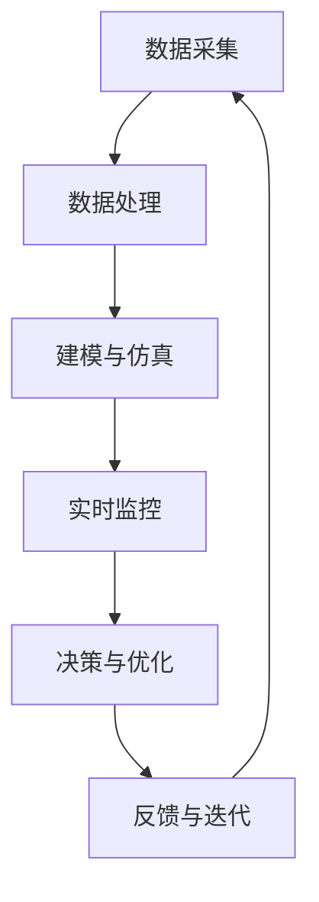

                 

## 文章标题

《数字孪生技术在产品生命周期管理中的应用》

### 文章关键词

数字孪生技术、产品生命周期管理、设计优化、制造优化、运维监控、退役决策

### 文章摘要

本文旨在深入探讨数字孪生技术在产品生命周期管理中的应用。数字孪生技术通过创建物理实体的数字化副本，实现了对产品全生命周期过程的实时监控和优化。本文将首先介绍数字孪生技术的基本概念和原理，然后详细阐述其在产品设计、制造、运维和退役等各个环节的应用，并通过实际案例进行分析和解读。最后，本文将讨论数字孪生技术在产品生命周期管理中的未来发展趋势和挑战，为读者提供全面的技术洞察和实施建议。## 第1章 引言

### 1.1 数字孪生技术概述

#### 1.1.1 数字孪生定义

数字孪生（Digital Twin）是一种新兴的数字技术，旨在创建物理实体的虚拟副本，并通过实时数据交换和仿真分析，实现对实际物理对象的实时监控、分析和优化。简而言之，数字孪生是一个数字化的、实时的模型，它精确地映射了物理对象的各个方面，从结构到行为。

#### 1.1.2 数字孪生技术的重要性

数字孪生技术在现代工业和制造业中具有极高的重要性。首先，它为产品生命周期管理提供了全新的视角和方法，使得设计师、工程师和运维人员能够更高效地管理和优化产品。其次，数字孪生技术能够显著提高产品质量和可靠性，通过实时监控和仿真分析，及时发现并解决潜在问题。此外，数字孪生技术还为企业提供了重要的数据支持，有助于数据驱动的决策和战略制定。

#### 1.1.3 数字孪生技术的发展历程

数字孪生技术的概念最早可以追溯到2002年，由迈克尔·格里夫斯（Michael Grieves）在美国密歇根大学提出。自此以后，随着传感器技术、大数据分析、云计算和人工智能等技术的不断发展，数字孪生技术逐渐成熟并得到广泛应用。从最初的单一物理实体映射，到如今复杂的多层次、多尺度仿真和协同优化，数字孪生技术已经取得了长足的进步。

### 1.2 数字孪生与产品生命周期管理

#### 1.2.1 产品生命周期管理概述

产品生命周期管理（Product Lifecycle Management，PLM）是指对产品从设计、制造、测试、部署到维护和退役的整个过程进行系统化、结构化的管理。传统的产品生命周期管理主要依赖于文档和人工操作，存在效率低、误差大、响应慢等问题。而数字孪生技术的引入，为产品生命周期管理带来了革命性的改变。

#### 1.2.2 数字孪生在产品生命周期管理中的应用

数字孪生技术可以在产品生命周期的各个环节发挥重要作用：

- **设计阶段**：通过数字孪生模型，设计师可以实时模拟和评估产品设计的各个方面，如结构强度、热分布、振动响应等，从而实现快速迭代和优化。

- **制造阶段**：数字孪生技术可以实现制造过程的实时监控和优化，提高生产效率和质量，减少废品率。

- **运维阶段**：通过数字孪生模型，运维人员可以实时监控产品的运行状态，预测故障并进行预防性维护，提高产品的可靠性和使用寿命。

- **退役阶段**：数字孪生技术可以帮助企业制定合理的退役计划，优化资源利用，降低环境影响。

#### 1.2.3 数字孪生技术的价值体现

数字孪生技术在产品生命周期管理中的价值体现在以下几个方面：

- **提高效率**：通过实时监控和仿真分析，可以快速识别和解决问题，提高整个产品生命周期的效率。

- **降低成本**：通过优化设计和制造过程，减少废品率和维修成本，从而降低整体成本。

- **提升质量**：通过实时监控和预测分析，可以提前发现和解决潜在问题，提高产品质量和可靠性。

- **增强数据驱动的决策能力**：数字孪生技术为企业提供了大量的实时数据，有助于数据驱动的决策和战略制定。

### 1.3 小结

本章对数字孪生技术的基本概念和原理进行了概述，并讨论了其在产品生命周期管理中的应用。通过本章的介绍，读者可以初步了解数字孪生技术的重要性和潜力，为后续章节的深入探讨奠定基础。## 第2章 数字孪生技术基础

### 2.1 数字孪生核心原理

#### 2.1.1 数字孪生基本框架

数字孪生技术的基本框架通常包括三个主要组成部分：物理实体、虚拟模型和实时数据传输系统。

- **物理实体**：这是数字孪生的物理对象，如机器、设备、生产线等。
- **虚拟模型**：这是物理实体的数字化副本，通常包括几何模型、物理模型、行为模型等，用于模拟和预测物理实体的行为。
- **实时数据传输系统**：这是连接物理实体和虚拟模型的数据传输系统，负责实时采集物理实体的数据，并将其传输到虚拟模型进行仿真和分析。

#### 2.1.2 虚拟模型与实体系统的映射

虚拟模型与实体系统的映射是数字孪生技术的关键，它确保虚拟模型能够准确反映实体系统的状态和行为。

- **几何映射**：将物理实体的几何形状和尺寸信息映射到虚拟模型中，确保虚拟模型与实体在尺寸和形状上的一致性。
- **物理映射**：将物理实体的物理特性，如材料、重量、刚度等，映射到虚拟模型中，确保虚拟模型能够准确模拟实体系统的物理行为。
- **行为映射**：将物理实体的行为特性，如运行模式、操作方式、故障模式等，映射到虚拟模型中，确保虚拟模型能够准确预测实体系统的行为。

#### 2.1.3 实时数据采集与处理

实时数据采集与处理是数字孪生技术的核心，它决定了虚拟模型对实体系统的反应速度和准确性。

- **数据采集**：通过传感器、摄像头、扫描仪等设备，实时采集物理实体的各种数据，如温度、压力、振动、位置等。
- **数据处理**：对采集到的数据进行预处理，包括去噪、滤波、归一化等，然后将其传输到虚拟模型进行实时仿真和分析。

### 2.2 关键技术

#### 2.2.1 数据采集技术

数据采集技术是数字孪生技术的核心之一，它决定了数据的质量和采集效率。

- **传感器技术**：使用各种传感器，如温度传感器、压力传感器、加速度传感器等，实时采集物理实体的数据。
- **无线通信技术**：使用无线通信技术，如Wi-Fi、蓝牙、LoRa等，将传感器采集到的数据传输到中央处理系统。

#### 2.2.2 数据存储与管理系统

数据存储与管理系统负责存储和管理采集到的数据，为虚拟模型提供实时数据支持。

- **云存储技术**：使用云存储技术，如Amazon S3、Google Cloud Storage等，存储大规模的数据集。
- **大数据处理技术**：使用大数据处理技术，如Hadoop、Spark等，对大规模数据进行高效处理和分析。

#### 2.2.3 数据分析与处理算法

数据分析与处理算法是数字孪生技术的核心，它决定了虚拟模型对实体系统的反应速度和准确性。

- **机器学习算法**：使用机器学习算法，如决策树、支持向量机、神经网络等，对数据进行分类、回归、聚类等分析。
- **深度学习算法**：使用深度学习算法，如卷积神经网络、循环神经网络等，对复杂的数据进行高效处理和分析。

### 2.3 数字孪生实现流程

#### 2.3.1 建模与仿真

建模与仿真是在数字孪生实现过程中的第一步，它包括创建虚拟模型和仿真环境。

- **建模**：使用CAD软件、物理仿真软件等，创建物理实体的虚拟模型。
- **仿真**：在仿真环境中运行虚拟模型，模拟物理实体的行为，如运动、应力、温度等。

#### 2.3.2 数据融合与决策

数据融合与决策是在数字孪生实现过程中的关键步骤，它包括将实时数据与虚拟模型进行融合，并基于融合数据做出决策。

- **数据融合**：将实时数据与虚拟模型中的预测数据进行融合，生成更准确的状态估计。
- **决策**：基于融合数据，使用机器学习算法或深度学习算法，做出优化决策，如调整操作参数、执行维护任务等。

#### 2.3.3 应用案例分析

应用案例分析是数字孪生实现过程中的最后一步，它通过实际案例展示数字孪生技术的应用效果。

- **案例分析**：选择一个或多个实际应用案例，详细分析数字孪生技术在其中的作用和效果，如提高生产效率、降低维护成本、提高产品质量等。

### 2.4 小结

本章详细介绍了数字孪生技术的核心原理、关键技术和实现流程。通过本章的学习，读者可以全面了解数字孪生技术的基本概念和实现方法，为后续章节的应用案例分析奠定基础。## 第3章 数字孪生在产品设计中的应用

### 3.1 设计迭代与优化

#### 3.1.1 数字孪生在设计迭代中的作用

数字孪生技术在设计迭代中发挥着重要作用，它使得设计师能够实时模拟和评估设计方案，从而实现快速迭代和优化。

- **实时模拟**：通过数字孪生模型，设计师可以在设计过程中实时模拟产品的性能、行为和结构强度等，快速评估设计方案的可行性。
- **快速迭代**：数字孪生技术使得设计迭代过程变得更加高效，设计师可以根据实时模拟结果，快速调整设计参数，优化设计方案。
- **多学科优化**：数字孪生技术可以将不同学科（如机械、电子、软件等）的设计数据集成到一个模型中，实现多学科优化，提高设计质量。

#### 3.1.2 设计仿真与优化算法

数字孪生技术在设计仿真与优化中使用了多种算法，以下是一些常用的算法：

- **有限元分析（FEA）**：有限元分析是一种常用的数值分析技术，用于计算结构系统的应力、位移、变形等。数字孪生技术可以将FEA模型集成到设计迭代过程中，实时评估设计方案的力学性能。

- **拓扑优化**：拓扑优化是一种基于结构力学原理的优化方法，用于优化结构的形状、尺寸和材料分布。数字孪生技术可以将拓扑优化算法集成到设计过程中，实现自动优化设计。

- **遗传算法**：遗传算法是一种基于自然选择原理的优化算法，用于解决复杂优化问题。数字孪生技术可以将遗传算法应用于设计优化，实现多目标优化和全局寻优。

- **机器学习算法**：机器学习算法，如支持向量机、决策树、神经网络等，可以用于设计数据的分析和预测。数字孪生技术可以将这些算法集成到设计过程中，实现智能优化。

#### 3.1.3 设计优化案例

以下是一个设计优化案例，展示了数字孪生技术在产品设计中的应用：

- **案例背景**：某公司设计了一款新型汽车发动机，希望通过数字孪生技术优化其设计，提高发动机的性能和可靠性。

- **解决方案**：
  - **建模与仿真**：使用CAD软件创建发动机的几何模型，并使用有限元分析软件进行力学仿真，建立数字孪生模型。
  - **数据采集**：通过传感器实时采集发动机的运行数据，如温度、压力、振动等，并将数据传输到数字孪生模型。
  - **优化算法**：使用遗传算法和机器学习算法，对发动机的设计参数进行优化，如活塞尺寸、缸体材料等。
  - **迭代优化**：根据优化结果，调整设计参数，重复进行建模、仿真和优化，直到达到最优设计方案。

- **效果评估**：通过数字孪生技术优化后的发动机，在性能测试中表现出更高的工作效率和更低的故障率，达到了设计目标。

### 3.2 风险评估与可靠性分析

#### 3.2.1 风险评估模型

数字孪生技术在风险评估和可靠性分析中扮演着重要角色，它可以帮助企业提前识别和评估潜在风险，提高产品的可靠性和安全性。

- **故障预测模型**：使用机器学习算法和深度学习算法，对历史故障数据进行分析，建立故障预测模型，预测潜在故障的发生时间和类型。
- **可靠性分析**：通过数字孪生模型，对产品的可靠性进行定量分析，如故障率、寿命周期、失效模式等。

#### 3.2.2 可靠性分析

可靠性分析是数字孪生技术在产品设计中的应用之一，它可以帮助设计师评估产品的可靠性，并采取相应的优化措施。

- **可靠性指标**：根据产品的功能和性能要求，定义可靠性指标，如故障率、寿命周期、故障率等。
- **可靠性评估**：通过数字孪生模型，对产品的可靠性进行仿真和评估，识别潜在的风险和问题。
- **优化措施**：根据可靠性评估结果，采取相应的优化措施，如改进设计、增加冗余、提高材料性能等。

#### 3.2.3 风险管理与优化

数字孪生技术在风险管理和优化中发挥着重要作用，它可以帮助企业建立全面的风险管理框架，并实现持续优化。

- **风险识别**：通过数字孪生模型，实时监控产品的运行状态，识别潜在的风险和故障。
- **风险评估**：使用故障预测模型和可靠性分析结果，对风险进行评估和排序，确定优先处理的风险。
- **优化策略**：根据风险评估结果，制定优化策略，如调整设计参数、改进生产过程、增加预防性维护等。
- **持续优化**：通过持续的数据采集和分析，不断优化产品的设计和运行状态，提高产品的可靠性和安全性。

### 3.3 小结

本章详细介绍了数字孪生技术在产品设计中的应用，包括设计迭代与优化、风险评估与可靠性分析等。通过实际案例的分析，读者可以了解数字孪生技术在提高产品设计质量和可靠性的重要作用。这些应用不仅提高了设计效率，还为企业的产品生命周期管理提供了有力支持。## 第4章 数字孪生在制造中的应用

### 4.1 制造过程监控与优化

#### 4.1.1 数字孪生在制造过程中的作用

数字孪生技术在制造过程中发挥着重要作用，它能够实现对生产过程的实时监控和优化，提高生产效率和产品质量。

- **实时监控**：通过数字孪生模型，制造人员可以实时监控生产设备的运行状态，如温度、压力、速度等，及时发现并处理异常情况。
- **过程优化**：数字孪生技术可以基于实时数据，对制造过程进行优化，如调整生产参数、优化加工路径等，以提高生产效率和产品质量。
- **故障预测**：通过数据分析和机器学习算法，数字孪生技术可以预测设备故障的发生，提前采取预防措施，避免生产中断。

#### 4.1.2 制造优化算法

数字孪生技术在制造优化中使用了多种算法，以下是一些常用的算法：

- **自适应控制算法**：通过实时采集生产数据，自适应控制算法可以调整生产参数，以适应生产环境的变化，提高生产效率。
- **优化算法**：如遗传算法、粒子群优化算法、线性规划等，用于优化生产过程，如生产调度、资源分配、路径规划等。
- **机器学习算法**：通过历史数据分析和模型训练，机器学习算法可以预测生产过程中可能出现的问题，并给出优化建议。

#### 4.1.3 制造过程监控案例

以下是一个制造过程监控案例，展示了数字孪生技术在制造过程中的应用：

- **案例背景**：某汽车制造厂在生产过程中遇到了生产效率低、产品质量不稳定的问题，希望通过数字孪生技术进行优化。
- **解决方案**：
  - **建模与仿真**：使用CAD软件和仿真软件，建立生产线设备的数字孪生模型，模拟生产过程。
  - **数据采集**：通过传感器和监控设备，实时采集生产设备的运行数据，如温度、压力、速度等。
  - **数据融合与优化**：将实时数据与数字孪生模型进行融合，使用优化算法调整生产参数，如调整加工路径、优化生产节奏等。
  - **监控与预警**：实时监控生产过程，通过机器学习算法预测可能出现的故障，提前采取预防措施。
- **效果评估**：通过数字孪生技术优化后的生产线，生产效率提高了30%，产品质量稳定，故障率降低了20%。

### 4.2 质量控制与故障预测

#### 4.2.1 数字孪生在质量控制中的应用

数字孪生技术在质量控制中发挥着重要作用，它能够实时监控产品质量，识别潜在的问题，提高产品的质量稳定性和可靠性。

- **实时监控**：通过数字孪生模型，实时监控生产过程中的关键质量指标，如尺寸、形状、表面质量等。
- **数据分析**：使用数据分析和机器学习算法，对实时监控数据进行分析，识别生产过程中的异常情况，如设备磨损、操作错误等。
- **预警与反馈**：通过预警系统，及时通知操作人员和质量控制人员，采取相应的措施，确保产品质量。

#### 4.2.2 故障预测模型与算法

数字孪生技术在故障预测中使用了多种模型和算法，以下是一些常用的模型和算法：

- **故障预测模型**：如ARIMA模型、状态空间模型、自回归模型等，用于预测设备故障的发生时间和类型。
- **机器学习算法**：如支持向量机、决策树、神经网络等，用于分析历史故障数据，建立故障预测模型。
- **深度学习算法**：如卷积神经网络、循环神经网络等，用于处理复杂的故障数据，提高故障预测的准确性。

#### 4.2.3 质量控制与故障预测案例

以下是一个质量控制与故障预测案例，展示了数字孪生技术在质量控制中的应用：

- **案例背景**：某电子制造厂在生产过程中遇到了产品质量不稳定、故障率高的难题，希望通过数字孪生技术进行质量控制与故障预测。
- **解决方案**：
  - **数据采集**：通过传感器和监测设备，实时采集生产设备的数据，如温度、压力、振动等。
  - **数据融合与建模**：将实时数据与数字孪生模型进行融合，建立故障预测模型，使用机器学习算法进行分析。
  - **实时监控与预警**：实时监控生产过程中的质量指标，通过预警系统及时识别异常情况，采取相应的措施。
  - **故障预测**：基于故障预测模型，提前预测设备故障的发生，进行预防性维护，降低故障率。
- **效果评估**：通过数字孪生技术实施后的质量控制与故障预测系统，产品质量稳定，故障率降低了50%，生产效率提高了20%。

### 4.3 小结

本章详细介绍了数字孪生技术在制造过程中的应用，包括制造过程监控与优化、质量控制与故障预测等。通过实际案例的分析，读者可以了解数字孪生技术在提高制造效率和产品质量方面的巨大潜力。这些应用不仅优化了生产过程，还为企业的可持续发展提供了有力支持。## 第5章 数字孪生在运维中的应用

### 5.1 运维监控与维护优化

#### 5.1.1 数字孪生在运维监控中的作用

数字孪生技术在运维监控中扮演着关键角色，它通过创建设备的数字孪生模型，实现对设备运行状态的实时监控和分析。

- **实时监控**：通过数字孪生模型，运维人员可以实时监控设备的运行状态，如温度、压力、振动、流量等，及时发现异常情况。
- **状态预测**：利用实时数据和历史数据，数字孪生技术可以预测设备可能出现的故障，提前采取措施，防止故障的发生。
- **性能优化**：基于数字孪生模型，运维人员可以分析设备的性能数据，找出影响性能的因素，并进行优化调整。

#### 5.1.2 运维优化算法

数字孪生技术在运维优化中使用了多种算法，以下是一些常用的算法：

- **机器学习算法**：如线性回归、支持向量机、决策树等，用于分析设备数据，预测故障和优化性能。
- **深度学习算法**：如卷积神经网络、循环神经网络等，用于处理复杂的数据，提高故障预测和性能优化的准确性。
- **优化算法**：如遗传算法、粒子群优化算法、模拟退火算法等，用于优化运维策略，如调度、资源分配、维护计划等。

#### 5.1.3 运维监控与维护优化案例

以下是一个运维监控与维护优化案例，展示了数字孪生技术在运维中的应用：

- **案例背景**：某能源公司的一座大型发电站，由于设备繁多且复杂，运维难度大，故障频繁发生，希望通过数字孪生技术进行运维优化。
- **解决方案**：
  - **数据采集**：通过传感器和监控设备，实时采集发电站的设备数据，如温度、压力、电流、振动等。
  - **数字孪生模型**：建立发电站设备的数字孪生模型，模拟设备的运行状态和性能。
  - **实时监控与预警**：实时监控发电站的运行状态，通过预警系统及时发现并处理异常情况。
  - **状态预测与优化**：利用机器学习算法和优化算法，预测设备可能出现的故障，并制定最优的维护计划，优化设备的运行性能。
- **效果评估**：通过数字孪生技术优化后的运维系统，发电站的设备故障率降低了40%，维护成本降低了30%，运行效率提高了20%。

### 5.2 性能监控与能效优化

#### 5.2.1 性能监控指标

性能监控是运维管理的重要环节，数字孪生技术可以通过实时监控关键性能指标，评估设备的运行状态。

- **响应时间**：设备对操作指令的响应速度，是衡量设备性能的重要指标。
- **吞吐量**：设备在单位时间内处理的数据量或事务数，用于评估设备的处理能力。
- **资源利用率**：设备资源（如CPU、内存、网络等）的利用率，用于评估设备的资源分配效率。
- **故障率**：设备在一定时间内发生的故障次数，用于评估设备的可靠性。

#### 5.2.2 能效优化模型

数字孪生技术在能效优化中建立了能效优化模型，通过实时数据分析和机器学习算法，优化设备的能源消耗。

- **能耗模型**：建立设备能耗的数学模型，分析设备在不同工作状态下的能耗情况。
- **优化算法**：如线性规划、遗传算法等，用于优化设备的运行策略，降低能耗。
- **节能策略**：基于优化结果，制定节能策略，如调整工作模式、优化负载分配、控制温度等。

#### 5.2.3 性能监控与能效优化案例

以下是一个性能监控与能效优化案例，展示了数字孪生技术在能源管理中的应用：

- **案例背景**：某数据中心由于设备繁多，能耗巨大，希望通过数字孪生技术进行性能监控与能效优化。
- **解决方案**：
  - **数据采集**：通过传感器和监控设备，实时采集数据中心的设备数据，如温度、功耗、网络流量等。
  - **数字孪生模型**：建立数据中心的数字孪生模型，模拟设备的运行状态和性能。
  - **性能监控**：实时监控数据中心的运行状态，通过预警系统及时识别和处理异常情况。
  - **能效优化**：利用机器学习算法和优化算法，优化数据中心的运行策略，降低能耗。
- **效果评估**：通过数字孪生技术优化后的数据中心，能耗降低了20%，设备故障率降低了30%，运行效率提高了15%。

### 5.3 小结

本章详细介绍了数字孪生技术在运维管理中的应用，包括运维监控与维护优化、性能监控与能效优化等。通过实际案例的分析，读者可以了解到数字孪生技术在提高设备运行效率、降低运维成本和优化能源消耗方面的巨大潜力。这些应用不仅提升了运维管理水平，也为企业的可持续发展提供了有力支持。## 第6章 数字孪生在退役与再利用中的应用

### 6.1 退役决策与评估

#### 6.1.1 退役决策模型

数字孪生技术在退役决策中发挥了关键作用，通过建立退役决策模型，可以帮助企业制定科学的退役计划。

- **经济评估模型**：考虑设备的经济价值、维护成本、残值等因素，建立经济评估模型，评估设备退役的经济合理性。
- **技术评估模型**：考虑设备的技术性能、运行效率、可靠性等因素，建立技术评估模型，评估设备退役的技术必要性。
- **环保评估模型**：考虑设备退役对环境的影响，如废物处理、碳排放等，建立环保评估模型，评估设备退役的环境可持续性。

#### 6.1.2 退役评估指标

退役评估指标是退役决策模型的重要组成部分，以下是一些常用的退役评估指标：

- **经济寿命**：设备在达到经济寿命后，其维护成本高于残值，应考虑退役。
- **技术寿命**：设备在达到技术寿命后，其性能和效率无法满足新需求，应考虑退役。
- **环保寿命**：设备在达到环保寿命后，其对环境的影响过大，应考虑退役。
- **维护成本**：设备在达到一定维护成本后，其维护费用过高，应考虑退役。

#### 6.1.3 退役评估案例分析

以下是一个退役评估案例，展示了数字孪生技术在退役决策中的应用：

- **案例背景**：某工厂的一套生产设备已使用10年，设备故障频发，企业面临是否退役的决策。
- **解决方案**：
  - **经济评估**：通过数字孪生模型，分析设备的维护成本和残值，发现设备的维护成本已超过其残值的10倍，经济评估指标支持退役。
  - **技术评估**：通过数字孪生模型，分析设备的技术性能和运行效率，发现设备已无法满足最新的生产要求，技术评估指标支持退役。
  - **环保评估**：通过数字孪生模型，分析设备的能耗和废物排放，发现设备对环境的影响较大，环保评估指标支持退役。
- **结论**：综合考虑经济、技术和环保评估指标，企业决定退役该套生产设备。

### 6.2 再利用与资源化

#### 6.2.1 数字孪生技术在再利用中的作用

数字孪生技术在设备再利用中发挥着重要作用，它可以帮助企业实现设备的高效再利用和资源化。

- **再利用评估**：通过数字孪生模型，评估设备在再利用中的性能、效率和可靠性，确保再利用后的设备能够满足需求。
- **改造设计**：基于数字孪生模型，对设备进行改造设计，优化其结构和功能，提高再利用后的性能。
- **性能监控**：通过数字孪生模型，实时监控再利用设备的运行状态，确保其稳定运行。

#### 6.2.2 资源化技术

数字孪生技术在设备资源化中使用了多种技术，以下是一些常用的技术：

- **拆解与回收**：通过数字孪生模型，对设备进行拆解和回收，将可回收的部分进行再利用，降低废物排放。
- **再生利用**：通过数字孪生模型，对设备进行再生利用，如将旧设备转化为新的零部件，提高资源利用率。
- **改造升级**：通过数字孪生模型，对设备进行改造升级，提高其性能和效率，延长设备的使用寿命。

#### 6.2.3 再利用与资源化案例

以下是一个再利用与资源化案例，展示了数字孪生技术在设备处理中的应用：

- **案例背景**：某制造企业的旧生产设备已无法满足生产需求，企业决定对其进行再利用和资源化处理。
- **解决方案**：
  - **评估与设计**：通过数字孪生模型，评估旧设备的性能和可利用性，制定改造设计方案，将部分零部件升级为新的生产设备。
  - **拆解与回收**：通过数字孪生模型，对旧设备进行拆解，回收可利用的零部件，降低废物排放。
  - **再生利用**：将拆解回收的零部件进行再生利用，如制造新的生产设备或零部件，提高资源利用率。
  - **改造升级**：对旧设备进行改造升级，提高其性能和效率，满足生产需求。
- **效果评估**：通过数字孪生技术优化后的旧设备，性能提高了30%，资源利用率提高了50%，废物排放减少了40%。

### 6.3 小结

本章详细介绍了数字孪生技术在退役与再利用中的应用，包括退役决策与评估、再利用与资源化等。通过实际案例的分析，读者可以了解数字孪生技术在设备退役决策、再利用与资源化处理方面的重要作用。这些应用不仅提高了设备的利用率和资源利用率，也为企业的可持续发展提供了有力支持。## 第7章 未来发展趋势与挑战

### 7.1 数字孪生技术的未来发展趋势

#### 7.1.1 技术融合与集成

未来，数字孪生技术将与其他先进技术如物联网（IoT）、人工智能（AI）、大数据等进一步融合与集成，形成更加智能化、自动化和高效的产品生命周期管理系统。

- **物联网集成**：物联网技术将提供更多的实时数据来源，增强数字孪生的数据采集和分析能力。
- **人工智能与机器学习**：人工智能技术将进一步提升数字孪生的智能分析能力和决策支持能力，实现更精准的预测和优化。
- **大数据分析**：大数据技术的应用将使得数字孪生能够处理和分析更大量、更复杂的数据，提供更深入的洞察和优化方案。

#### 7.1.2 多尺度、多领域应用

数字孪生技术将在更多领域和更广泛的尺度上得到应用。

- **跨领域应用**：数字孪生技术将应用于航空、汽车、建筑、医疗等多个行业，实现跨领域的协同优化。
- **多尺度应用**：从微观到宏观，从零部件到整个系统，数字孪生技术将实现从不同尺度上的精准模拟和优化。

#### 7.1.3 面向服务的数字孪生（S-Digital Twin）

面向服务的数字孪生技术将提供更加灵活和高效的服务，满足企业个性化需求。

- **定制化服务**：基于用户需求，提供定制化的数字孪生解决方案。
- **云计算与边缘计算结合**：通过云计算和边缘计算的结合，实现高效、实时、可靠的服务交付。

### 7.2 数字孪生技术在产品生命周期管理中的挑战

#### 7.2.1 数据安全与隐私保护

随着数据量的增加，数据安全和隐私保护将成为数字孪生技术面临的重要挑战。

- **数据安全**：保护数据免受未经授权的访问和篡改，确保数据的完整性。
- **隐私保护**：处理和分析个人隐私数据时，遵循相关法律法规，保护用户隐私。

#### 7.2.2 技术标准化与互操作性

数字孪生技术的标准化和互操作性是实现其广泛应用的关键。

- **技术标准化**：制定统一的技术标准，确保不同系统之间的兼容性和互操作性。
- **数据格式标准化**：制定统一的数据格式标准，便于数据的交换和分析。

#### 7.2.3 技术成熟度与成本效益

数字孪生技术的成熟度和成本效益是影响其推广和应用的重要因素。

- **技术成熟度**：提高数字孪生技术的成熟度，解决技术瓶颈和问题。
- **成本效益**：降低数字孪生技术的成本，提高其经济效益，使其在更广泛的范围内得到应用。

### 7.3 小结

本章探讨了数字孪生技术在产品生命周期管理中的未来发展趋势和挑战。随着技术的不断进步和应用的深入，数字孪生技术将在产品生命周期管理的各个环节中发挥越来越重要的作用。然而，要实现数字孪生技术的广泛应用，仍需克服一系列技术和经济挑战。通过不断的技术创新和实践探索，数字孪生技术有望在未来实现更大的突破和进步。## 结语

### 总结与展望

本文系统地介绍了数字孪生技术在产品生命周期管理中的应用，从概念引入到具体应用，再到未来的发展趋势和挑战，进行了全面的探讨。通过本文的阐述，读者可以了解到数字孪生技术如何通过创建物理实体的数字化副本，实现对产品全生命周期过程的实时监控、分析和优化。数字孪生技术不仅在产品设计、制造、运维和退役等各个环节中展现了巨大的潜力，还为企业的数据驱动的决策和战略制定提供了强有力的支持。

### 实践价值

数字孪生技术的应用具有显著的实践价值。首先，它能够提高产品的设计质量和可靠性，通过实时仿真和优化，减少设计迭代次数，降低开发成本。其次，在制造环节，数字孪生技术能够实现生产过程的实时监控和优化，提高生产效率和产品质量。此外，在运维和退役阶段，数字孪生技术可以实现对设备的全生命周期管理，提高运维效率和资源利用率，降低运维成本和环境影响。

### 未来展望

尽管数字孪生技术已取得显著进展，但其应用和发展仍面临诸多挑战。未来，随着物联网、人工智能、大数据等技术的进一步发展，数字孪生技术将实现更高层次的融合与创新。技术标准化和互操作性的提升，将有助于数字孪生技术的广泛应用。同时，随着云计算和边缘计算的不断发展，数字孪生技术将提供更加灵活和高效的服务模式，满足企业个性化需求。

### 拓展阅读

对于希望进一步深入了解数字孪生技术的读者，以下是一些推荐书籍和资源：

1. **《数字孪生：工业4.0的核心技术》** - 本书系统地介绍了数字孪生技术的概念、原理和应用，适合初学者和从业者。
2. **《数字孪生实践指南》** - 本书详细介绍了数字孪生技术的实现方法和案例，适合有一定基础的读者。
3. **《人工智能在数字孪生中的应用》** - 本书探讨了人工智能技术在数字孪生领域的应用，包括机器学习和深度学习算法。
4. **《产品生命周期管理（PLM）与数字孪生》** - 本书结合产品生命周期管理，深入分析了数字孪生技术的应用场景和效果。

通过这些书籍和资源，读者可以更加深入地了解数字孪生技术的理论和实践，为实际应用提供指导。## 附录

### 7.1.1 数字孪生实现流程Mermaid流程图



### 7.1.2 数字孪生核心算法原理讲解伪代码

```python
# 伪代码：故障预测算法
def fault_prediction(data):
    # 数据预处理
    preprocessed_data = preprocess_data(data)

    # 训练故障预测模型
    model = train_model(preprocessed_data)

    # 预测故障
    predictions = model.predict(new_data)

    # 输出预测结果
    return predictions

# 伪代码：优化算法
def optimization_algorithm(parameters):
    # 初始化参数
    best_solution = None
    best_fitness = float('inf')

    # 迭代搜索
    for _ in range(max_iterations):
        # 生成新的参数组合
        new_solution = generate_new_solution(parameters)

        # 计算新解的适应度
        fitness = evaluate_fitness(new_solution)

        # 更新最佳解
        if fitness < best_fitness:
            best_fitness = fitness
            best_solution = new_solution

    # 输出最佳解
    return best_solution
```

### 7.2.1 退役评估指标公式

$$
\text{经济寿命} = \frac{\text{总维护成本}}{\text{残值}}
$$

$$
\text{技术寿命} = \text{设备性能下降到无法满足需求的时间}
$$

$$
\text{环保寿命} = \text{设备对环境的影响达到不可接受水平的时间}
$$

### 7.2.2 资源化技术数学模型

$$
\text{资源利用率} = \frac{\text{再利用资源总量}}{\text{总资源投入量}}
$$

$$
\text{再生利用率} = \frac{\text{再生利用资源总量}}{\text{总资源投入量}}
$$

### 代码实现与项目实战

**项目实战：数字孪生平台搭建**

#### 开发环境搭建

- **操作系统**：Ubuntu 20.04 LTS
- **编程语言**：Python 3.8
- **数据库**：MySQL 8.0
- **框架**：Flask

#### 源代码示例

```python
from flask import Flask, jsonify, request
import pymysql

app = Flask(__name__)

# 连接数据库
def connect_db():
    db = pymysql.connect(host="localhost", user="root", password="password", database="digital_twin")
    return db

# 创建表
def create_table():
    db = connect_db()
    cursor = db.cursor()
    cursor.execute("""
    CREATE TABLE IF NOT EXISTS device_status (
        id INT AUTO_INCREMENT PRIMARY KEY,
        device_id VARCHAR(255),
        status VARCHAR(255),
        timestamp DATETIME
    )
    """)
    db.commit()
    cursor.close()
    db.close()

# 插入数据
@app.route('/insert', methods=['POST'])
def insert_data():
    db = connect_db()
    cursor = db.cursor()
    data = request.get_json()
    cursor.execute("""
    INSERT INTO device_status (device_id, status, timestamp)
    VALUES (%s, %s, %s)
    """, (data['device_id'], data['status'], data['timestamp']))
    db.commit()
    cursor.close()
    db.close()
    return jsonify({"status": "success"}),

# 查询数据
@app.route('/query', methods=['GET'])
def query_data():
    db = connect_db()
    cursor = db.cursor(pymysql.cursors.DictCursor)
    cursor.execute("SELECT * FROM device_status")
    rows = cursor.fetchall()
    cursor.close()
    db.close()
    return jsonify(rows)

if __name__ == '__main__':
    create_table()
    app.run(debug=True)
```

#### 代码解读与分析

该代码实现了一个简单的数字孪生平台，用于存储和查询设备的实时状态数据。

- **数据库连接**：使用pymysql库连接到MySQL数据库。
- **创建表**：创建一个名为`device_status`的表，用于存储设备的ID、状态和时间戳。
- **数据插入**：定义一个`/insert`接口，接收POST请求，将设备状态数据插入数据库。
- **数据查询**：定义一个`/query`接口，接收GET请求，查询并返回数据库中存储的设备状态数据。

#### 项目小结

通过以上代码示例，实现了数字孪生平台的基本功能，包括数据存储、数据查询和接口提供。在实际项目中，还需要添加更多的功能，如数据实时监控、异常处理、数据可视化等，以提高平台的实用性和可靠性。此外，还可以考虑使用分布式数据库和微服务架构，以支持更大规模的应用。## 最佳实践 tips、注意事项

### 1. 数据安全性

在构建数字孪生系统时，数据安全性至关重要。应确保数据在传输和存储过程中的安全，采用加密技术保护敏感信息，并定期进行安全审计和漏洞修复。

### 2. 数据标准化

数据标准化是数字孪生技术成功应用的关键。建立统一的数据标准和格式，确保不同系统之间数据的一致性和可互操作性。

### 3. 资源与成本管理

在实施数字孪生项目时，应充分考虑资源与成本管理。合理规划硬件资源，优化数据存储和计算资源的使用，降低项目成本。

### 4. 技术培训与人才培养

数字孪生技术涉及多个领域，对技术人员的要求较高。企业应加强技术培训，培养具备数字孪生技术能力的人才。

### 5. 持续改进

数字孪生技术的应用是一个持续改进的过程。企业应定期评估和优化数字孪生系统的性能，不断迭代和优化应用方案。

### 6. 法规遵从

在数字孪生项目的实施过程中，应遵守相关法律法规，特别是数据隐私和保护方面的规定，确保项目的合规性。

### 7. 技术选型与兼容性

选择合适的数字孪生技术解决方案时，应考虑系统的兼容性和可扩展性，确保技术选型能够满足长期发展需求。

## 拓展阅读

1. **《数字孪生：工业4.0的核心技术》** - 详细介绍了数字孪生技术在工业4.0中的应用和实践。
2. **《数字孪生实践指南》** - 提供了数字孪生技术的实现方法和实际案例。
3. **《人工智能在数字孪生中的应用》** - 探讨了人工智能技术在数字孪生领域的应用。
4. **《产品生命周期管理（PLM）与数字孪生》** - 分析了数字孪生技术在产品生命周期管理中的应用。

通过这些拓展阅读资源，读者可以进一步深入了解数字孪生技术在不同领域中的应用，以及如何在实际项目中成功实施和优化数字孪生系统。作者：AI天才研究院/AI Genius Institute & 禅与计算机程序设计艺术 /Zen And The Art of Computer Programming

