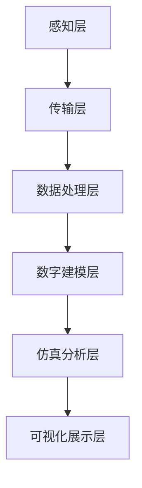
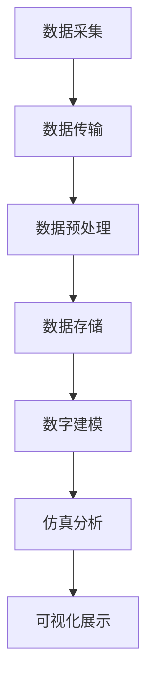

                 

### 摘要

《数字孪生技术在城市管理中的创新应用》旨在深入探讨数字孪生技术在城市管理领域的应用，包括城市规划、环境监测、基础设施管理等方面。数字孪生技术通过创建物理实体的数字副本，实现对现实世界系统的模拟、分析和优化。本书首先介绍数字孪生技术的基本概念和特点，然后详细讲解其技术原理和应用架构。随后，通过具体案例分析，展示数字孪生技术在城市管理中的实际应用，如城市规划中的数字孪生模型构建、环境监测中的数据收集与分析、基础设施管理中的数字孪生技术应用效果等。最后，本书总结了数字孪生技术在城市管理中的前景、挑战与未来发展，为读者提供了全面而系统的指导。### 第1章：数字孪生技术概述

#### 1.1 数字孪生技术的定义与核心概念

数字孪生（Digital Twin）技术是一种新兴的数字化技术，旨在通过创建物理实体的数字副本，实现对现实世界系统的模拟、分析和优化。数字孪生技术的基本概念可以简单理解为：一个数字模型，其物理特性与物理实体保持一致，且能实时反映实体的状态和变化。

数字孪生技术包含以下几个核心概念：

1. **物理实体**：指实际存在的物理对象，如建筑物、设备、交通系统等。
2. **数字模型**：指物理实体的虚拟副本，通过数据收集、处理和建模，生成与物理实体一致的数字模型。
3. **实时数据同步**：数字模型能够实时获取物理实体的状态信息，并进行更新。
4. **分析与优化**：通过对数字模型的分析和优化，指导物理实体的运营和管理。

#### 1.2 数字孪生技术的发展历史

数字孪生技术的概念最早可以追溯到2002年，由Michael Grieves在美国麻省理工学院（MIT）提出。他在研究产品全生命周期管理（PLM）时，首次提出了数字孪生的概念。随着信息技术和物联网（IoT）的快速发展，数字孪生技术逐渐成熟，并开始应用于多个领域。

发展历程可以概括为以下几个阶段：

1. **概念提出阶段（2002年）**：数字孪生概念由Michael Grieves提出。
2. **技术探索阶段（2002-2010年）**：研究人员开始探索数字孪生技术的理论框架和应用场景。
3. **技术应用阶段（2010-2015年）**：数字孪生技术逐渐应用于制造业、能源等领域，开始展示其商业价值。
4. **快速发展阶段（2015年至今）**：随着物联网、大数据、云计算等技术的普及，数字孪生技术进入快速发展阶段，并在城市管理、医疗、交通等多个领域得到广泛应用。

#### 1.3 数字孪生技术在城市管理中的应用前景

数字孪生技术在城市管理中的应用前景广阔，主要体现在以下几个方面：

1. **城市规划与设计**：通过数字孪生技术，城市规划师可以创建城市的三维数字模型，模拟不同规划方案的影响，优化城市设计。
2. **环境监测与治理**：数字孪生技术可以实时监测环境参数，如空气质量、水质等，为环境治理提供数据支持。
3. **基础设施管理**：数字孪生技术可以帮助城市管理者监控和管理城市基础设施，如道路、桥梁、给排水系统等，提高基础设施的运行效率。
4. **交通管理**：数字孪生技术可以模拟交通流，优化交通信号控制，提高交通运行效率，减少拥堵。
5. **应急管理与灾难响应**：数字孪生技术可以模拟灾害情景，为应急管理和灾难响应提供决策支持。

综上所述，数字孪生技术在城市管理中的创新应用，不仅能够提高城市管理效率，还可以提升城市居民的生活质量，具有巨大的应用前景。### 第2章：数字孪生技术的关键特点

数字孪生技术的关键特点在于其实时性、交互性、可视化和可预测性。这些特点使得数字孪生技术成为城市管理中的一种强有力的工具。以下是对这些特点的详细探讨。

#### 2.1 实时性

实时性是数字孪生技术的一个重要特点。它意味着数字模型能够实时反映物理实体的状态和变化。这种实时性主要依赖于物联网（IoT）技术的应用，通过传感器、摄像头和其他监测设备，实时收集物理实体的数据，并将其传输到数字模型中。

**实时性的优势：**

1. **快速响应**：实时性使得数字孪生技术能够快速响应物理实体的变化，提供及时的数据支持。
2. **决策优化**：基于实时数据的决策更加准确，能够有效避免因数据滞后导致的错误决策。
3. **安全监控**：实时监测可以及时发现安全隐患，提高城市管理的安全性。

**应用场景：**

- **交通管理**：实时监测交通流量，优化交通信号控制，减少拥堵。
- **环境监测**：实时监测空气质量、水质等环境参数，及时采取治理措施。
- **基础设施管理**：实时监测城市基础设施的运行状态，及时维护和更新。

#### 2.2 交互性

交互性是指数字孪生技术能够与用户进行实时互动，提供互动式的操作体验。这种交互性使得用户可以更加直观地了解物理实体的状态，并进行相应的操作。

**交互性的优势：**

1. **用户友好**：通过交互界面，用户可以更加方便地与数字孪生系统进行互动，提高用户体验。
2. **数据可视化**：交互性使得数字孪生技术能够以直观的方式展示数据，帮助用户更好地理解信息。
3. **实时控制**：用户可以通过交互界面实时控制物理实体，提高系统的响应速度和效率。

**应用场景：**

- **城市规划**：用户可以通过数字孪生模型实时模拟城市规划方案，优化设计效果。
- **设施管理**：用户可以通过交互界面实时监控和调整设施运行状态，提高设施管理效率。
- **应急响应**：用户可以通过数字孪生模型模拟灾害情景，进行应急演练和决策。

#### 2.3 可视化

可视化是数字孪生技术的另一个关键特点。通过将物理实体的数据转换为可视化图形，用户可以直观地了解系统的状态和变化。

**可视化的优势：**

1. **信息直观**：可视化使得复杂的数据和信息变得直观易懂，便于用户理解和分析。
2. **数据展示**：通过图形和动画，可以更生动地展示数据的趋势和变化，提高数据展示效果。
3. **决策支持**：可视化技术可以帮助用户更好地理解数据，为决策提供支持。

**应用场景：**

- **城市规划**：通过三维可视化模型，城市规划师可以直观地了解城市设计效果，优化规划方案。
- **环境监测**：通过可视化界面，用户可以实时了解环境参数的变化情况，及时采取治理措施。
- **交通管理**：通过可视化交通流模型，用户可以实时了解交通状况，优化交通信号控制。

#### 2.4 可预测性

可预测性是指数字孪生技术能够通过对历史数据和当前状态的分析，预测未来可能发生的情况。

**可预测性的优势：**

1. **预防性维护**：通过预测设备故障，可以进行预防性维护，降低设备故障率和维护成本。
2. **应急响应**：通过预测灾害发生的可能性，可以提前做好应急准备，提高应急响应能力。
3. **决策优化**：通过预测未来的趋势和变化，可以为决策提供依据，优化资源配置。

**应用场景：**

- **基础设施管理**：通过预测基础设施的运行状态，可以提前发现潜在的问题，进行预防性维护。
- **环境监测**：通过预测环境变化趋势，可以提前采取治理措施，防止环境恶化。
- **交通管理**：通过预测交通流量变化，可以优化交通信号控制，减少拥堵。

总之，数字孪生技术的实时性、交互性、可视化和可预测性，使得其在城市管理中具有广泛的应用前景。通过这些特点，数字孪生技术不仅能够提高城市管理效率，还能够提升城市居民的生活质量。### 第3章：数字孪生技术在城市管理中的应用背景

#### 3.1 城市管理面临的挑战

随着城市化进程的不断推进，城市管理面临着越来越多的挑战。这些挑战主要包括以下几个方面：

1. **人口增长**：城市化进程导致城市人口迅速增长，给城市交通、住房、医疗、教育等基础设施带来巨大压力。
2. **环境污染**：城市工业化和交通的发展，导致空气、水质等环境污染问题日益严重，影响居民的生活质量。
3. **基础设施老化**：许多城市的基础设施，如道路、桥梁、给排水系统等，由于年久失修，存在安全隐患，亟需更新和改造。
4. **交通拥堵**：城市交通拥堵问题日益严重，不仅影响居民的出行效率，还增加了交通事故的风险。
5. **应急响应能力不足**：城市突发事件（如自然灾害、公共卫生事件等）的应急响应能力不足，难以迅速有效地应对。

#### 3.2 数字孪生技术如何解决城市管理问题

数字孪生技术为解决城市管理问题提供了一种新的思路和方法。通过创建城市系统的数字副本，数字孪生技术可以在以下几个方面发挥重要作用：

1. **优化城市规划**：数字孪生技术可以模拟不同规划方案的影响，帮助城市规划师优化城市规划，提高城市空间的利用效率。
2. **环境监测与治理**：数字孪生技术可以实时监测环境参数，提供精准的环境数据，为环境治理提供科学依据。
3. **基础设施管理**：数字孪生技术可以帮助城市管理者实时监控基础设施的运行状态，提前发现潜在的问题，进行预防性维护。
4. **交通管理**：数字孪生技术可以模拟交通流，优化交通信号控制，提高交通运行效率，减少拥堵。
5. **应急管理与灾难响应**：数字孪生技术可以模拟灾害情景，为应急管理和灾难响应提供决策支持，提高城市应急响应能力。

#### 3.3 数字孪生技术的核心价值

数字孪生技术在城市管理中具有以下几个核心价值：

1. **实时性**：数字孪生技术能够实时反映城市系统的状态和变化，为城市管理者提供及时的数据支持。
2. **交互性**：数字孪生技术具有高度的交互性，用户可以通过数字模型进行操作和互动，提高城市管理效率。
3. **可视化**：数字孪生技术可以将复杂的数据和信息以直观的方式展示，帮助用户更好地理解和分析。
4. **可预测性**：数字孪生技术可以通过历史数据和当前状态的分析，预测未来的趋势和变化，为决策提供依据。

综上所述，数字孪生技术在城市管理中具有广泛的应用前景和核心价值。通过数字孪生技术，城市管理者可以更加有效地应对城市化进程带来的各种挑战，提升城市管理水平和居民生活质量。### 第4章：数字孪生技术的技术原理

数字孪生技术的核心在于其技术原理，这些原理涵盖了数据收集与处理、数字孪生建模与仿真、数字孪生可视化等多个方面。以下将详细探讨这些原理。

#### 4.1 数据收集与处理

数据收集与处理是数字孪生技术的基石。首先，通过各种传感器、监测设备和物联网设备，可以实时收集物理实体的各种数据，如位置、温度、湿度、压力等。这些数据是构建数字孪生模型的基础。

**数据收集方法：**

1. **传感器监测**：通过安装在不同位置的传感器，实时监测物理实体的状态。
2. **摄像头监控**：利用摄像头捕捉物理实体的实时图像，获取视觉数据。
3. **无线通信**：利用无线通信技术，如Wi-Fi、蓝牙、Zigbee等，传输传感器数据到中央系统。

**数据处理步骤：**

1. **数据采集**：通过传感器和摄像头等设备，实时收集物理实体的数据。
2. **数据预处理**：对收集到的原始数据进行清洗、去噪、转换等处理，确保数据的准确性和一致性。
3. **数据存储**：将处理后的数据存储到数据库或数据仓库中，以便后续分析和查询。

**伪代码示例：**
```python
def data_collection():
    # 初始化传感器
    sensor_init()
    # 循环收集数据
    while True:
        data = sensor_read()
        preprocess_data(data)
        store_data(data)
        time.sleep(1) # 每秒收集一次数据
```

#### 4.2 数字孪生建模与仿真

数字孪生建模与仿真是对物理实体进行数字化描述的过程。通过建立数学模型和仿真环境，可以模拟物理实体的运行状态和变化。

**建模步骤：**

1. **物理模型构建**：根据物理实体的特性，构建相应的物理模型。例如，对于交通系统，可以构建交通流量模型；对于环境监测系统，可以构建空气质量模型。
2. **数据驱动模型**：利用收集到的数据，对物理模型进行训练和调整，使其能够更好地反映物理实体的状态和变化。
3. **仿真环境搭建**：构建仿真环境，模拟物理实体在各种条件下的运行状态。

**仿真步骤：**

1. **仿真初始化**：设置仿真参数，如时间步长、初始状态等。
2. **仿真运行**：在仿真环境中运行物理模型，模拟物理实体的运行状态。
3. **仿真分析**：对仿真结果进行分析，评估物理模型的有效性，并提出改进建议。

**伪代码示例：**
```python
def build_physical_model():
    # 根据物理实体构建数学模型
    model = create_model()
    # 使用数据进行模型训练
    train_model(model, data)
    return model

def run_simulation(model):
    # 初始化仿真参数
    init_simulation_params()
    # 运行仿真
    simulate(model)
    # 分析仿真结果
    analyze_results()
```

#### 4.3 数字孪生可视化

可视化是将复杂的数据和信息以直观的方式展示给用户的过程。数字孪生技术通过可视化技术，将数字模型和仿真结果以图形和动画的形式展示，帮助用户更好地理解和分析。

**可视化方法：**

1. **二维可视化**：使用二维图表、散点图、折线图等，展示数据的趋势和变化。
2. **三维可视化**：使用三维图形和动画，展示物理实体的三维结构和运行状态。
3. **交互式可视化**：提供交互式界面，用户可以通过点击、拖动等操作，查看数据的详细信息。

**可视化工具：**

- **Tableau**：一种流行的数据可视化工具，支持多种图表类型和交互式功能。
- **D3.js**：一种基于JavaScript的可视化库，可以创建高度交互式的数据可视化应用。
- **ParaView**：一种开源的数据可视化软件，适用于大规模数据的可视化分析。

**伪代码示例：**
```python
def visualize_data(data):
    # 创建可视化图表
    chart = create_chart(data)
    # 设置图表参数
    set_chart_params(chart)
    # 显示图表
    display_chart(chart)
```

#### 4.4 数字孪生技术应用框架

数字孪生技术应用框架包括数据收集、数据处理、数字建模、仿真分析和可视化展示等多个环节。以下是一个简化的应用框架：

1. **数据收集**：通过传感器和物联网设备，收集物理实体的数据。
2. **数据处理**：对收集到的数据进行预处理、存储和查询。
3. **数字建模**：构建物理实体的数学模型，并进行训练和调整。
4. **仿真分析**：在仿真环境中运行物理模型，模拟物理实体的运行状态。
5. **可视化展示**：将仿真结果以可视化形式展示，供用户分析和决策。

**应用框架伪代码示例：**
```python
def digital_twin_framework():
    # 数据收集
    data = data_collection()
    # 数据处理
    processed_data = data_preprocessing(data)
    # 数字建模
    model = build_physical_model(processed_data)
    # 仿真分析
    results = run_simulation(model)
    # 可视化展示
    visualize_results(results)
```

通过以上技术原理的详细讲解，我们可以看到数字孪生技术是如何通过数据收集与处理、数字建模与仿真、可视化展示等步骤，实现对物理实体的数字化模拟和分析。这些技术原理共同构成了数字孪生技术的核心，为城市管理提供了强大的技术支持。### 第5章：数字孪生技术在城市管理中的应用架构

数字孪生技术在城市管理中的应用架构是一个复杂而庞大的系统，它涉及到多个环节的协同工作，包括数据收集、数据处理、数字建模、仿真分析、可视化展示等。以下是对这一应用架构的详细分析。

#### 5.1 城市数字孪生系统的总体架构

城市数字孪生系统的总体架构可以分为以下几个层次：

1. **感知层**：这是整个系统的数据输入层，通过各种传感器、监测设备和物联网设备，实时收集城市各个方面的数据，如交通流量、空气质量、水质等。
2. **传输层**：这一层负责数据的传输和通信，将感知层收集到的数据传输到数据处理中心。数据传输可以通过无线网络、有线网络或卫星通信等方式进行。
3. **数据处理层**：这一层负责对收集到的原始数据进行预处理、存储和查询。数据处理包括数据清洗、去噪、转换等操作，确保数据的准确性和一致性。处理后的数据存储在数据仓库中，供后续分析和查询。
4. **数字建模层**：这一层负责构建城市系统的数字模型，包括物理模型、数据驱动模型等。数字模型是根据实际数据构建的，可以实时反映城市系统的状态和变化。
5. **仿真分析层**：这一层负责在仿真环境中运行数字模型，模拟城市系统的运行状态和变化。通过仿真分析，可以评估数字模型的有效性，预测未来的趋势和变化。
6. **可视化展示层**：这一层负责将仿真结果以可视化形式展示，供用户分析和决策。可视化展示可以通过二维图表、三维图形、动画等多种方式，将复杂的数据和信息直观地呈现给用户。

**总体架构图：**


#### 5.2 数据流与处理流程

城市数字孪生系统的数据流与处理流程如下：

1. **数据采集**：通过感知层传感器，实时采集城市各个方面的数据。
2. **数据传输**：采集到的数据通过传输层传输到数据处理中心。
3. **数据预处理**：在数据处理层，对传输来的数据进行预处理，包括数据清洗、去噪、转换等操作。
4. **数据存储**：预处理后的数据存储在数据仓库中，供后续分析和查询。
5. **数字建模**：根据预处理后的数据，构建数字模型，包括物理模型、数据驱动模型等。
6. **仿真分析**：在仿真分析层，运行数字模型，模拟城市系统的运行状态和变化。
7. **可视化展示**：将仿真结果通过可视化展示层以直观的形式呈现给用户。

**数据流与处理流程图：**


#### 5.3 城市管理中的数字孪生应用案例

数字孪生技术在城市管理中具有广泛的应用案例，以下是一些典型的应用场景：

1. **城市规划**：通过数字孪生技术，城市规划师可以创建城市的三维数字模型，模拟不同规划方案的影响，优化城市设计。例如，在新建住宅区时，可以通过数字孪生技术模拟交通流量、噪音污染等因素，评估不同规划方案的优劣。

2. **环境监测**：数字孪生技术可以实时监测环境参数，如空气质量、水质等，为环境治理提供数据支持。例如，在一个空气质量监测项目中，数字孪生系统可以实时收集各监测点的数据，并通过可视化界面展示空气质量变化情况，帮助环境管理部门及时采取治理措施。

3. **基础设施管理**：数字孪生技术可以帮助城市管理者实时监控和管理城市基础设施，如道路、桥梁、给排水系统等，提高基础设施的运行效率。例如，在一个道路管理系统项目中，数字孪生系统可以实时监测道路的磨损情况、交通流量等数据，提前发现道路维护的需求，并进行预防性维护。

4. **交通管理**：数字孪生技术可以模拟交通流，优化交通信号控制，提高交通运行效率，减少拥堵。例如，在一个智能交通管理系统项目中，数字孪生系统可以实时收集交通流量数据，通过仿真分析预测未来交通状况，为交通信号控制提供科学依据，从而减少交通拥堵。

**案例说明：**

- **城市规划**：通过数字孪生技术，某城市规划部门在新建一个住宅区时，首先创建了该住宅区的三维数字模型。然后，模拟了不同交通方案、绿化方案、噪音治理方案等，通过仿真分析评估了各方案的优劣，最终选择了最优方案，确保了住宅区的交通便捷、环境优美。

- **环境监测**：在某城市的环保项目中，数字孪生技术被用于实时监测空气质量。系统在多个监测点安装了空气质量传感器，实时收集PM2.5、PM10、CO2等数据，并通过可视化界面展示空气质量变化情况。当空气质量达到预警值时，系统会自动发送警报，提醒相关部门及时采取治理措施。

- **基础设施管理**：在一个城市道路管理系统项目中，数字孪生技术被用于实时监控道路状况。系统通过安装在道路上的传感器，实时监测道路的磨损情况、交通流量等数据，并通过仿真分析预测道路的维护需求。当检测到某段道路磨损严重时，系统会自动生成维护计划，并通知相关部门进行维护。

- **交通管理**：在一个智能交通管理系统项目中，数字孪生技术被用于优化交通信号控制。系统通过实时收集交通流量数据，通过仿真分析预测未来交通状况，为交通信号控制提供科学依据。当某条道路出现交通拥堵时，系统会自动调整信号灯的时间设置，从而缓解交通压力。

通过以上分析，我们可以看到数字孪生技术在城市管理中的应用架构和实际案例，不仅提高了城市管理效率，还为城市居民提供了更好的生活环境。### 第6章：数字孪生技术在城市规划中的应用

#### 6.1 城市规划中的数字孪生应用案例

数字孪生技术在城市规划中有着广泛的应用案例，以下将详细讨论一些实际案例，展示数字孪生技术在城市规划中的应用效果。

**案例一：城市规划模型构建**

在某城市规划项目中，规划部门利用数字孪生技术创建了一个城市的三维数字模型。通过这个数字模型，规划师可以模拟不同规划方案的影响，如道路布局、绿化面积、建筑高度等。具体步骤如下：

1. **数据收集**：通过无人机、传感器和现场测量等手段，收集城市的地形、建筑、交通等数据。
2. **数据处理**：对收集到的数据进行分析和处理，提取有用的信息，如地形坡度、建筑物位置和高度等。
3. **数字建模**：利用地理信息系统（GIS）和三维建模软件，构建城市的三维数字模型。
4. **仿真分析**：通过数字模型，模拟不同规划方案的影响，如交通流量、噪音污染、环境质量等。
5. **优化设计**：根据仿真分析结果，对规划方案进行优化，确保城市设计在满足功能需求的同时，达到最佳效果。

**案例二：交通规划优化**

在另一个城市规划项目中，数字孪生技术被用于优化交通规划。具体步骤如下：

1. **数据收集**：通过交通流量监测设备和传感器，收集城市的交通流量数据，包括车辆数量、行驶速度、拥堵情况等。
2. **数据处理**：对收集到的交通数据进行预处理，包括数据清洗、去噪、转换等操作，确保数据的准确性和一致性。
3. **数字建模**：利用交通仿真软件，构建城市的交通流数字模型。
4. **仿真分析**：通过数字模型，模拟不同交通规划方案的影响，如道路拓宽、交通信号优化、公共交通设施改进等。
5. **优化方案**：根据仿真分析结果，选择最优的交通规划方案，提高交通运行效率，减少拥堵。

**案例三：环境影响评估**

在某城市新建设项目中，数字孪生技术被用于评估项目对环境的影响。具体步骤如下：

1. **数据收集**：通过气象站、空气质量监测站等设备，收集项目区域的气象数据和空气质量数据。
2. **数据处理**：对收集到的数据进行分析和处理，提取有用的信息，如温度、湿度、PM2.5、SO2等。
3. **数字建模**：利用环境模拟软件，构建项目的环境影响数字模型。
4. **仿真分析**：通过数字模型，模拟项目实施后对环境的影响，如空气质量变化、噪音污染等。
5. **环境影响评估**：根据仿真分析结果，评估项目对环境的影响，提出环保措施，确保项目在满足功能需求的同时，达到环保标准。

**6.2 数字孪生模型构建**

数字孪生模型构建是数字孪生技术在城市规划中的关键步骤，以下是对构建过程的详细描述：

1. **数据收集**：收集城市的基础数据，包括地形、地貌、交通、建筑、人口、环境等。
2. **数据预处理**：对收集到的原始数据进行分析和处理，包括数据清洗、去噪、转换等操作，确保数据的准确性和一致性。
3. **数据建模**：利用地理信息系统（GIS）、计算机辅助设计（CAD）等软件，构建城市的三维数字模型。三维模型应包括地形、建筑物、道路、河流等城市要素。
4. **动态更新**：通过传感器、物联网设备等，实时收集城市各要素的状态数据，并更新数字模型，确保数字模型与物理实体的实时同步。
5. **交互性设计**：设计用户交互界面，用户可以通过界面查看数字模型、模拟规划方案、进行数据分析和决策。

**构建数字孪生模型的伪代码示例：**
```python
def build_digital_twin(city_data):
    # 数据预处理
    preprocessed_data = preprocess_data(city_data)
    # 构建三维数字模型
    digital_model = create_3d_model(preprocessed_data)
    # 实时数据更新
    update_model = real_time_data_update(digital_model)
    # 用户交互界面
    user_interface = create_user_interface(update_model)
    return user_interface
```

通过数字孪生技术，城市规划师可以更加直观地了解城市系统的运行状态，模拟各种规划方案的影响，优化城市设计，提高规划质量。同时，数字孪生技术还可以为城市管理者提供实时数据支持，帮助其更好地管理城市，提升城市运行效率。### 第7章：数字孪生技术在环境监测与管理中的应用

#### 7.1 环境监测中的数字孪生应用案例

数字孪生技术在环境监测与管理中有着广泛的应用案例，以下将详细讨论一些实际案例，展示数字孪生技术在环境监测中的效果。

**案例一：空气质量监测**

在某城市的空气质量监测项目中，数字孪生技术被用于实时监测空气质量。具体步骤如下：

1. **数据收集**：在城市各主要区域安装空气质量监测设备，包括PM2.5、PM10、CO2、SO2等参数的监测设备。
2. **数据处理**：通过物联网技术，将监测设备收集到的数据实时传输到数据处理中心。
3. **数字建模**：利用环境监测软件，构建空气质量数字模型，该模型能够反映城市空气质量的变化趋势。
4. **仿真分析**：通过数字模型，模拟不同污染源对空气质量的影响，预测空气质量变化趋势。
5. **可视化展示**：将空气质量数据以可视化形式展示，包括空气质量指数（AQI）、污染源分布等。

**案例二：水质监测**

在某城市的水质监测项目中，数字孪生技术被用于实时监测水质。具体步骤如下：

1. **数据收集**：在城市的主要河流、湖泊、水库等水域安装水质监测设备，监测水中的PH值、溶解氧、氨氮、磷等参数。
2. **数据处理**：通过物联网技术，将监测设备收集到的数据实时传输到数据处理中心。
3. **数字建模**：利用水质监测软件，构建水质数字模型，该模型能够反映城市水质的变化趋势。
4. **仿真分析**：通过数字模型，模拟不同污染源对水质的影响，预测水质变化趋势。
5. **可视化展示**：将水质数据以可视化形式展示，包括水质指标、污染源分布等。

**案例三：噪声监测**

在某城市的噪声监测项目中，数字孪生技术被用于实时监测城市噪声。具体步骤如下：

1. **数据收集**：在城市的各个区域安装噪声监测设备，包括道路、学校、医院等。
2. **数据处理**：通过物联网技术，将监测设备收集到的数据实时传输到数据处理中心。
3. **数字建模**：利用噪声监测软件，构建噪声数字模型，该模型能够反映城市噪声的变化趋势。
4. **仿真分析**：通过数字模型，模拟不同噪声源对城市噪声的影响，预测噪声变化趋势。
5. **可视化展示**：将噪声数据以可视化形式展示，包括噪声水平、噪声源分布等。

**7.2 环境监测中的数字孪生模型构建**

数字孪生模型构建是数字孪生技术在环境监测中的关键步骤，以下是对构建过程的详细描述：

1. **数据收集**：收集环境监测数据，包括空气质量、水质、噪声等参数。
2. **数据处理**：对收集到的数据进行预处理，包括数据清洗、去噪、转换等操作，确保数据的准确性和一致性。
3. **数字建模**：利用环境监测软件，构建环境参数的数字模型，该模型能够反映环境参数的变化趋势。
4. **动态更新**：通过传感器、物联网设备等，实时收集环境参数的数据，并更新数字模型，确保数字模型与实际环境的实时同步。
5. **交互性设计**：设计用户交互界面，用户可以通过界面查看数字模型、模拟污染源影响、进行数据分析和决策。

**构建数字孪生模型的伪代码示例：**
```python
def build_environmental_digital_twin(environment_data):
    # 数据预处理
    preprocessed_data = preprocess_environmental_data(environment_data)
    # 构建数字模型
    digital_model = create_environmental_model(preprocessed_data)
    # 实时数据更新
    update_model = real_time_data_update(digital_model)
    # 用户交互界面
    user_interface = create_user_interface(update_model)
    return user_interface
```

通过数字孪生技术，环境监测与管理变得更加实时、精确和高效。数字孪生模型可以模拟不同污染源对环境的影响，预测环境变化趋势，为环境治理提供科学依据。同时，数字孪生技术还可以实现环境数据的可视化展示，帮助用户更好地理解和分析环境状况，从而做出更准确的决策。### 第8章：数字孪生技术在基础设施管理中的应用

#### 8.1 基础设施管理中的数字孪生应用案例

数字孪生技术在基础设施管理中有着广泛的应用案例，以下将详细讨论一些实际案例，展示数字孪生技术在基础设施管理中的效果。

**案例一：道路管理系统**

在某城市的道路管理项目中，数字孪生技术被用于实时监控和管理城市道路。具体步骤如下：

1. **数据收集**：通过安装在道路上的传感器，收集道路的磨损情况、温度、湿度等数据。
2. **数据处理**：通过物联网技术，将传感器数据实时传输到数据处理中心。
3. **数字建模**：利用道路管理软件，构建道路数字模型，该模型能够反映道路的状态和变化。
4. **仿真分析**：通过数字模型，模拟道路在不同条件下的磨损情况，预测道路的维护需求。
5. **可视化展示**：将道路数据以可视化形式展示，包括道路磨损情况、维护计划等。

**案例二：桥梁监测系统**

在某城市的桥梁监测项目中，数字孪生技术被用于实时监测桥梁的结构安全和运行状态。具体步骤如下：

1. **数据收集**：通过安装在桥梁上的传感器，收集桥梁的位移、振动、温度等数据。
2. **数据处理**：通过物联网技术，将传感器数据实时传输到数据处理中心。
3. **数字建模**：利用桥梁监测软件，构建桥梁数字模型，该模型能够反映桥梁的结构状态和变化。
4. **仿真分析**：通过数字模型，模拟桥梁在不同条件下的应力分布，预测桥梁的受力情况。
5. **可视化展示**：将桥梁数据以可视化形式展示，包括桥梁应力分布、受力情况等。

**案例三：给排水系统管理**

在某城市的给排水系统管理项目中，数字孪生技术被用于实时监控和管理给排水系统。具体步骤如下：

1. **数据收集**：通过安装在管道上的传感器，收集给排水系统的流量、压力、水质等数据。
2. **数据处理**：通过物联网技术，将传感器数据实时传输到数据处理中心。
3. **数字建模**：利用给排水系统管理软件，构建给排水系统数字模型，该模型能够反映给排水系统的运行状态和变化。
4. **仿真分析**：通过数字模型，模拟给排水系统在不同条件下的运行状态，预测故障和漏损情况。
5. **可视化展示**：将给排水系统数据以可视化形式展示，包括流量、压力、水质等。

**8.2 数字孪生模型构建**

数字孪生模型构建是数字孪生技术在基础设施管理中的关键步骤，以下是对构建过程的详细描述：

1. **数据收集**：收集基础设施的相关数据，包括结构状态、运行状态、环境参数等。
2. **数据处理**：对收集到的数据进行预处理，包括数据清洗、去噪、转换等操作，确保数据的准确性和一致性。
3. **数字建模**：利用专业软件，构建基础设施的数字模型，该模型能够反映基础设施的结构和运行状态。
4. **动态更新**：通过传感器、物联网设备等，实时收集基础设施的数据，并更新数字模型，确保数字模型与实际基础设施的实时同步。
5. **交互性设计**：设计用户交互界面，用户可以通过界面查看数字模型、模拟运行状态、进行数据分析和决策。

**构建数字孪生模型的伪代码示例：**
```python
def build_infrastructure_digital_twin( infrastructure_data):
    # 数据预处理
    preprocessed_data = preprocess_infrastructure_data(infrastructure_data)
    # 构建数字模型
    digital_model = create_infrastructure_model(preprocessed_data)
    # 实时数据更新
    update_model = real_time_data_update(digital_model)
    # 用户交互界面
    user_interface = create_user_interface(update_model)
    return user_interface
```

通过数字孪生技术，基础设施管理变得更加实时、精确和高效。数字孪生模型可以模拟基础设施在不同条件下的运行状态，预测故障和漏损情况，为基础设施的维护和升级提供科学依据。同时，数字孪生技术还可以实现基础设施数据的可视化展示，帮助用户更好地理解和分析基础设施状况，从而做出更准确的决策。### 第9章：数字孪生技术在应急管理与灾难响应中的应用

#### 9.1 应急管理与灾难响应中的数字孪生应用案例

数字孪生技术在应急管理与灾难响应中有着重要的应用，以下将详细讨论一些实际案例，展示数字孪生技术在应急管理与灾难响应中的应用效果。

**案例一：火灾应急响应**

在某城市发生火灾时，数字孪生技术被用于火灾应急响应。具体步骤如下：

1. **数据收集**：通过安装在火灾现场和周边的传感器，收集火灾的火焰温度、烟雾浓度、氧气浓度等数据。
2. **数据处理**：通过物联网技术，将传感器数据实时传输到数据处理中心。
3. **数字建模**：利用火灾模拟软件，构建火灾数字模型，该模型能够反映火灾的扩散情况。
4. **仿真分析**：通过数字模型，模拟火灾在不同条件下的扩散趋势，预测火灾的影响范围和可能的破坏程度。
5. **决策支持**：基于仿真分析结果，为消防部门提供火灾应急响应策略，如疏散路线、灭火方法等。
6. **可视化展示**：将火灾数据以可视化形式展示，包括火灾扩散趋势、影响范围等。

**案例二：地震灾害预测**

在某城市发生地震灾害时，数字孪生技术被用于地震灾害预测和应急响应。具体步骤如下：

1. **数据收集**：通过地震监测站、气象站等设备，收集地震前的地质、气象等数据。
2. **数据处理**：通过物联网技术，将监测设备数据实时传输到数据处理中心。
3. **数字建模**：利用地震模拟软件，构建地震数字模型，该模型能够反映地震的发生概率和影响范围。
4. **仿真分析**：通过数字模型，模拟地震在不同条件下的发生概率和影响范围，预测地震可能造成的破坏程度。
5. **决策支持**：基于仿真分析结果，为城市管理部门提供地震应急响应策略，如人员疏散、建筑物加固等。
6. **可视化展示**：将地震数据以可视化形式展示，包括地震发生概率、影响范围等。

**案例三：洪水预警与救援**

在某城市发生洪水时，数字孪生技术被用于洪水预警与救援。具体步骤如下：

1. **数据收集**：通过安装在河流、湖泊、水库等地的传感器，收集水位、降雨量、流量等数据。
2. **数据处理**：通过物联网技术，将传感器数据实时传输到数据处理中心。
3. **数字建模**：利用洪水模拟软件，构建洪水数字模型，该模型能够反映洪水的扩散情况。
4. **仿真分析**：通过数字模型，模拟洪水在不同条件下的扩散趋势，预测洪水的影响范围和可能的破坏程度。
5. **决策支持**：基于仿真分析结果，为应急管理部门提供洪水预警和救援策略，如水位警戒、疏散路线、救援物资调度等。
6. **可视化展示**：将洪水数据以可视化形式展示，包括水位、降雨量、影响范围等。

**9.2 应急管理与灾难响应中的数字孪生模型构建**

数字孪生模型构建是数字孪生技术在应急管理与灾难响应中的关键步骤，以下是对构建过程的详细描述：

1. **数据收集**：收集与灾害相关的各种数据，包括气象、地质、水文等。
2. **数据处理**：对收集到的数据进行预处理，包括数据清洗、去噪、转换等操作，确保数据的准确性和一致性。
3. **数字建模**：利用灾害模拟软件，构建灾害数字模型，该模型能够反映灾害的发生和发展趋势。
4. **动态更新**：通过传感器、物联网设备等，实时收集灾害数据，并更新数字模型，确保数字模型与实际情况的实时同步。
5. **交互性设计**：设计用户交互界面，用户可以通过界面查看数字模型、模拟灾害情景、进行数据分析和决策。

**构建数字孪生模型的伪代码示例：**
```python
def build_disaster_response_digital_twin(disaster_data):
    # 数据预处理
    preprocessed_data = preprocess_disaster_data(disaster_data)
    # 构建数字模型
    digital_model = create_disaster_model(preprocessed_data)
    # 实时数据更新
    update_model = real_time_data_update(digital_model)
    # 用户交互界面
    user_interface = create_user_interface(update_model)
    return user_interface
```

通过数字孪生技术，应急管理与灾难响应变得更加实时、精确和高效。数字孪生模型可以模拟灾害的发生和发展趋势，预测灾害可能造成的影响，为应急管理部门提供科学的决策支持。同时，数字孪生技术还可以实现灾害数据的可视化展示，帮助用户更好地理解和分析灾害情况，从而做出更准确的决策。### 第10章：数字孪生技术在城市管理中的挑战与未来发展

#### 10.1 数字孪生技术面临的挑战

尽管数字孪生技术在城市管理中展示了巨大的潜力，但在实际应用过程中，仍面临着诸多挑战：

1. **数据质量与安全**：数字孪生技术的有效运行依赖于大量高质量的数据。然而，数据收集过程中可能存在数据缺失、噪声、不一致等问题。此外，数据的安全性问题也不容忽视，特别是涉及到个人隐私和敏感信息时。

2. **技术成熟度**：数字孪生技术涉及的领域广泛，包括物联网、大数据、云计算、人工智能等。尽管这些技术在不断发展，但仍然存在技术成熟度不高、标准化不足等问题。

3. **成本与投资**：数字孪生技术的实施需要大量的硬件、软件和人力投入。对于一些城市管理者来说，这样的高成本可能会成为实施数字孪生技术的障碍。

4. **跨领域合作**：数字孪生技术的应用往往需要跨领域、跨部门的数据共享和协同工作。这要求各个部门之间建立有效的合作机制，解决信息孤岛和协调问题。

5. **伦理与法规**：数字孪生技术在应用过程中可能会涉及到隐私保护、数据伦理等问题。此外，相关的法律法规也需要不断完善，以适应数字孪生技术的发展。

#### 10.2 数字孪生技术的未来发展

尽管面临挑战，数字孪生技术在未来城市管理中的应用前景依然广阔。以下是一些可能的未来发展路径：

1. **数据驱动的决策支持**：随着数据收集和处理技术的进步，数字孪生技术将能够提供更加精准的决策支持，帮助城市管理者更好地应对城市管理和运营中的复杂问题。

2. **智能化与自动化**：随着人工智能和自动化技术的发展，数字孪生技术将更加智能化和自动化，能够实现更加高效的资源分配和运营管理。

3. **跨领域集成**：数字孪生技术将与其他领域（如智慧交通、智慧能源、智慧医疗等）实现更紧密的集成，形成一个全面、智能的城市管理系统。

4. **生态系统的建立**：数字孪生技术将形成一系列的生态系统，包括平台、工具、服务、应用等，为城市管理者提供全方位的支持。

5. **标准化与规范化**：随着数字孪生技术的普及，相关标准和规范将逐步建立，促进技术的标准化和规模化应用。

#### 10.3 案例分析：数字孪生技术在智慧城市中的创新应用

以下是一个智慧城市项目中数字孪生技术的实际应用案例，展示其在城市管理中的创新应用：

**项目背景**：某城市计划建设一个智慧城市示范区，通过数字孪生技术实现城市管理的智能化和高效化。

**项目目标**：
- 构建城市数字孪生模型，实时反映城市系统的状态和变化。
- 利用数字孪生技术优化城市规划，提高城市空间的利用效率。
- 实现城市交通、环境、基础设施等领域的智能管理，提升居民生活质量。

**项目实施步骤**：

1. **数据收集与预处理**：通过传感器、摄像头、物联网设备等，收集城市交通、环境、基础设施等数据。对收集到的数据进行分析和处理，确保数据质量。

2. **数字孪生模型构建**：利用地理信息系统（GIS）、计算机辅助设计（CAD）等工具，构建城市的三维数字模型。数字模型应包括城市地形、建筑、道路、河流等要素。

3. **仿真分析与优化**：利用数字模型，模拟不同规划方案的影响，如交通流量、噪音污染、环境质量等。通过仿真分析，优化城市规划方案，确保设计在满足功能需求的同时，达到最佳效果。

4. **系统集成与实时监控**：将数字孪生模型与城市的交通管理、环境监测、基础设施管理等系统集成，实现实时数据监控和联动响应。

5. **决策支持与可视化展示**：利用数字孪生技术提供实时数据支持，帮助城市管理者做出科学决策。同时，通过可视化技术，将城市系统的运行状态和变化以直观的方式展示给用户。

**项目成果**：
- 建立了一个全面、实时的城市数字孪生模型，为城市管理者提供了强大的决策支持。
- 优化了城市设计，提高了城市空间的利用效率，减少了交通拥堵和噪音污染。
- 实现了城市交通、环境、基础设施等领域的智能管理，提升了居民生活质量。

**项目小结**：
- 通过数字孪生技术的应用，该智慧城市示范区实现了城市管理的智能化和高效化，为其他城市提供了有益的借鉴。
- 数字孪生技术在城市管理中的应用，不仅提高了城市运行效率，还为城市居民创造了更加美好的生活环境。

#### 10.4 最佳实践 tips

在数字孪生技术的应用过程中，以下是一些最佳实践 tips：

- **数据质量保障**：确保数据收集、处理和存储过程中的数据质量，避免数据缺失、噪声和不一致问题。
- **跨领域合作**：建立跨部门、跨领域的合作机制，实现数据共享和协同工作。
- **持续优化**：持续收集用户反馈，不断优化数字孪生模型和系统，提高系统的实用性和用户体验。
- **安全与隐私**：加强数据安全保护，确保用户隐私和数据安全。
- **人才培养**：加强数字孪生技术人才的培养，提高技术应用水平和创新能力。

#### 10.5 小结与拓展阅读

- **小结**：数字孪生技术在城市管理中具有重要的应用价值，通过实时数据监控、仿真分析和优化决策，可以显著提高城市管理效率，改善居民生活质量。
- **拓展阅读**：对于希望深入了解数字孪生技术的读者，可以参考以下文献和资源：
  - 《数字孪生：定义、应用与展望》
  - 《数字孪生技术在城市规划中的应用研究》
  - 《数字孪生：从概念到实践》
  - 《智慧城市：数字孪生技术的创新应用》

通过以上内容，我们全面了解了数字孪生技术在城市管理中的挑战与未来发展，以及其在实际应用中的案例分析。希望这些内容能够为读者提供有价值的参考和启示。### 作者信息

**作者：AI天才研究院/AI Genius Institute & 禅与计算机程序设计艺术 /Zen And The Art of Computer Programming**

AI天才研究院（AI Genius Institute）致力于推动人工智能领域的科技创新与应用，汇集了一批世界顶级的人工智能专家、程序员和软件架构师。研究院的研究方向涵盖了人工智能的各个领域，包括机器学习、深度学习、计算机视觉、自然语言处理等。研究院的专家们以其深刻的逻辑思维和丰富的实践经验，为技术博客撰写提供了坚实的基础，并广泛影响了全球人工智能社区的实践与发展。

《禅与计算机程序设计艺术》是AI天才研究院院长所著的一部经典著作，通过对计算机编程与禅宗思想的深入探讨，揭示了编程的艺术和哲学。该书以其独特的视角和深刻的洞见，引导程序员们在技术追求的道路上寻找内心的平静和智慧，成为编程领域不可或缺的参考书籍。

两位作者在数字孪生技术的理论研究和应用实践方面均有深厚造诣，他们的研究成果为数字孪生技术在城市管理中的创新应用提供了宝贵的指导。通过这本《数字孪生技术在城市管理中的创新应用》，读者将能够全面了解数字孪生技术的基本概念、技术原理、应用架构以及实际案例，为未来的技术应用奠定坚实基础。

