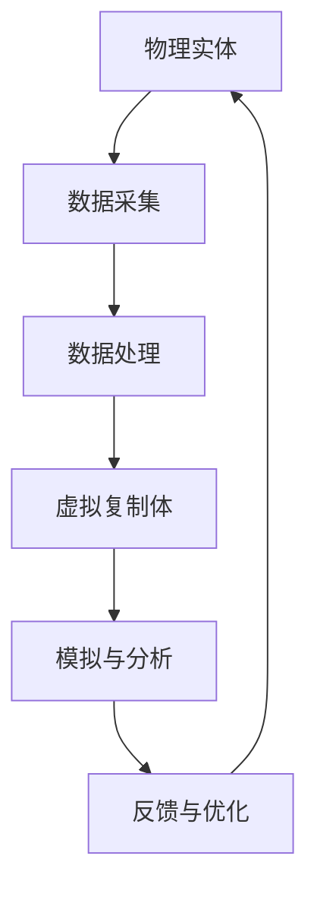
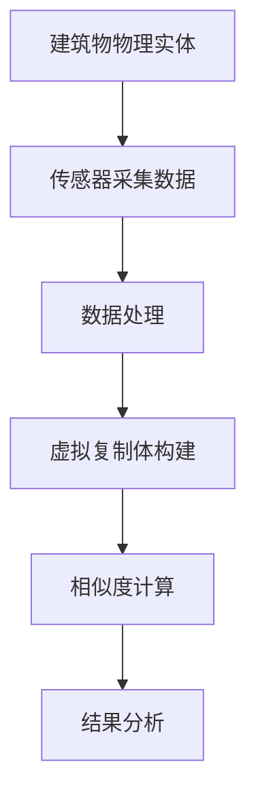
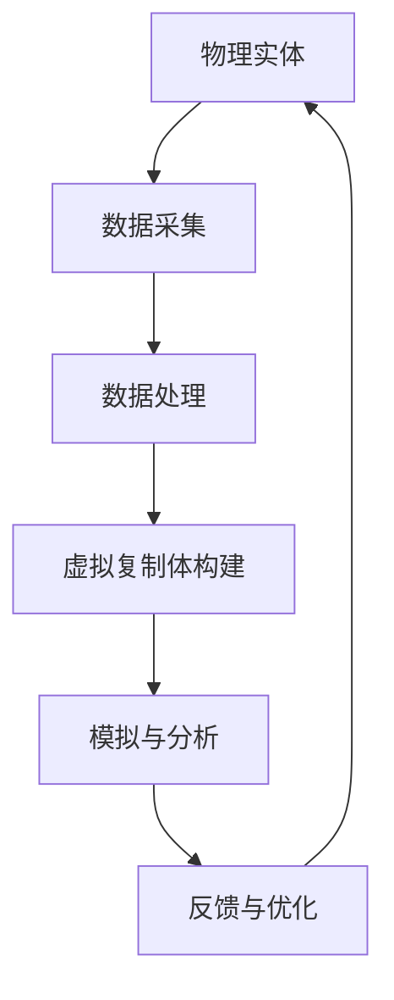
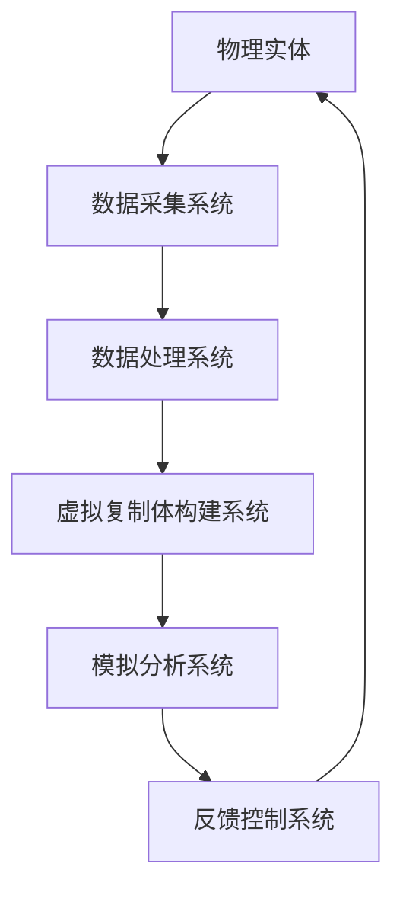
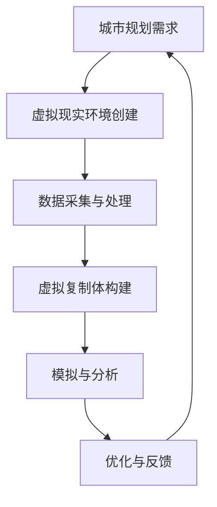
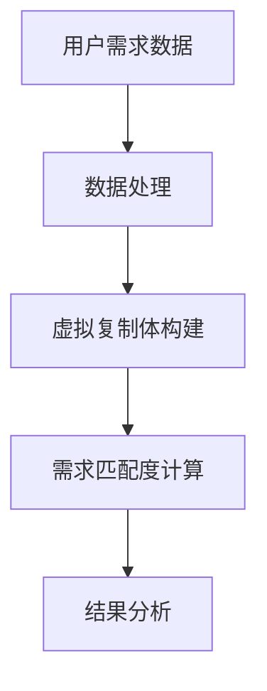
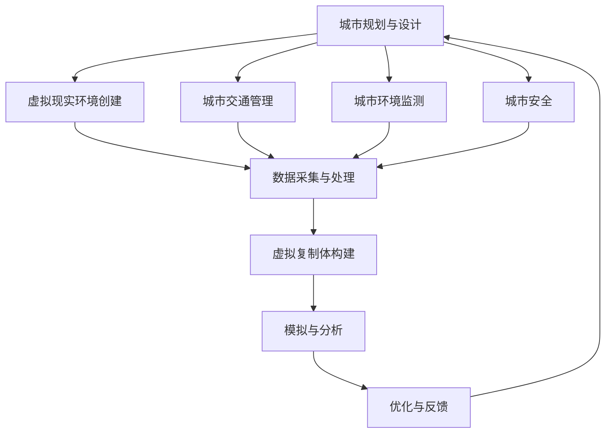
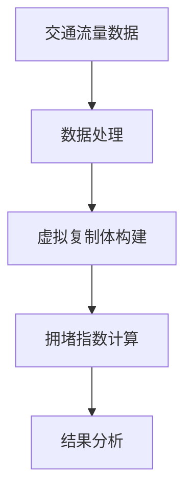

                 


### 数字孪生技术在城市规划中的应用

#### 关键词

数字孪生技术、城市规划、智慧城市、虚拟现实、人工智能

#### 摘要

本文深入探讨了数字孪生技术在城市规划中的应用。数字孪生技术是一种通过创建物理实体及其虚拟复制体，实现对现实世界精准模拟和优化的技术。在城市规划中，数字孪生技术不仅提高了规划的科学性和效率，还大大提升了城市的可持续发展能力和居民生活质量。本文首先介绍了数字孪生技术的基础概念，随后详细阐述了其在城市规划中的应用场景，并通过实际案例展示了其效果。文章最后对数字孪生技术的未来发展趋势进行了展望。

### 目录

#### 第一部分：数字孪生技术基础

##### 第1章：数字孪生技术概述

##### 第2章：数字孪生技术的核心原理

##### 第3章：数字孪生技术的架构与实现

#### 第二部分：数字孪生技术在城市规划中的应用

##### 第4章：数字孪生技术在城市规划中的重要性

##### 第5章：数字孪生技术在城市规划中的应用场景

##### 第6章：数字孪生技术在城市规划中的实际应用

#### 第三部分：项目实战与案例分析

##### 第7章：数字孪生技术在城市规划中的项目实战

##### 第8章：数字孪生技术在城市规划中的案例分析

##### 第9章：未来展望与趋势

### 第一部分：数字孪生技术基础

#### 第1章：数字孪生技术概述

**背景介绍**

数字孪生技术（Digital Twin Technology）是一种创新的技术，通过创建物理实体的数字镜像，实现对物理实体的模拟、分析和优化。数字孪生技术的概念最早可以追溯到2002年，美国密歇根大学教授Michael Grieves首次提出了数字孪生的概念。随着物联网（IoT）、云计算和大数据技术的快速发展，数字孪生技术逐渐成为工业4.0、智能制造和智慧城市等领域的重要支撑技术。

**核心概念与联系**

数字孪生技术的核心概念包括物理实体、虚拟复制体和数据交互。物理实体是现实世界中的具体对象，如建筑物、设备、城市等；虚拟复制体是对物理实体的数字映射，用于模拟和分析物理实体的行为；数据交互则是物理实体和虚拟复制体之间的信息交换，确保虚拟复制体能够准确反映物理实体的状态。

以下是一个简单的 Mermaid 流程图，展示数字孪生技术的基本架构：



**核心算法原理讲解**

数字孪生技术的核心算法原理包括数据采集、数据处理、虚拟复制体构建和模拟分析等。以下是一个简单的伪代码，用于说明这些算法的实现过程：

```python
# 数据采集
def collect_data实体():
    # 采集物理实体的实时数据
    return 数据

# 数据处理
def process_data数据(数据):
    # 清洗、转换和存储数据
    return 处理后的数据

# 虚拟复制体构建
def build_digital_twin数据(处理后的数据):
    # 基于数据构建虚拟复制体
    return 虚拟复制体

# 模拟与分析
def simulate_analyze虚拟复制体(虚拟复制体):
    # 对虚拟复制体进行模拟和分析
    return 分析结果

# 反馈与优化
def feedback_and_optimize分析结果(分析结果):
    # 根据分析结果对物理实体进行优化
    return 优化后的物理实体

# 主函数
def main():
    实体数据 = collect_data实体()
    处理后的数据 = process_data数据(实体数据)
    虚拟复制体 = build_digital_twin数据(处理后的数据)
    分析结果 = simulate_analyze虚拟复制体(虚拟复制体)
    优化后的实体 = feedback_and_optimize分析结果(分析结果)
    return 优化后的实体
```

**数学模型和公式**

数字孪生技术中的数学模型和公式用于描述物理实体和虚拟复制体之间的相似性。以下是一个简单的数学模型：

$$
相似度 = \frac{物理实体属性值 - 虚拟复制体属性值}{物理实体属性值 + 虚拟复制体属性值}
$$

**举例说明**

假设我们有一个建筑物，通过传感器采集其实时数据，并使用数字孪生技术构建其虚拟复制体。我们可以使用上述数学模型计算建筑物物理实体和虚拟复制体之间的相似度，从而评估虚拟复制体的准确性。



**核心算法原理讲解**

数字孪生技术的核心算法原理包括数据采集、数据处理、虚拟复制体构建和模拟分析等。以下是一个简单的伪代码，用于说明这些算法的实现过程：

```python
# 数据采集
def collect_data实体():
    # 采集物理实体的实时数据
    return 数据

# 数据处理
def process_data数据(数据):
    # 清洗、转换和存储数据
    return 处理后的数据

# 虚拟复制体构建
def build_digital_twin数据(处理后的数据):
    # 基于数据构建虚拟复制体
    return 虚拟复制体

# 模拟与分析
def simulate_analyze虚拟复制体(虚拟复制体):
    # 对虚拟复制体进行模拟和分析
    return 分析结果

# 反馈与优化
def feedback_and_optimize分析结果(分析结果):
    # 根据分析结果对物理实体进行优化
    return 优化后的物理实体

# 主函数
def main():
    实体数据 = collect_data实体()
    处理后的数据 = process_data数据(实体数据)
    虚拟复制体 = build_digital_twin数据(处理后的数据)
    分析结果 = simulate_analyze虚拟复制体(虚拟复制体)
    优化后的实体 = feedback_and_optimize分析结果(分析结果)
    return 优化后的实体
```

**数学模型和公式**

数字孪生技术中的数学模型和公式用于描述物理实体和虚拟复制体之间的相似性。以下是一个简单的数学模型：

$$
相似度 = \frac{物理实体属性值 - 虚拟复制体属性值}{物理实体属性值 + 虚拟复制体属性值}
$$

**举例说明**

假设我们有一个建筑物，通过传感器采集其实时数据，并使用数字孪生技术构建其虚拟复制体。我们可以使用上述数学模型计算建筑物物理实体和虚拟复制体之间的相似度，从而评估虚拟复制体的准确性。


#### 第2章：数字孪生技术的核心原理

**背景介绍**

数字孪生技术是一种通过创建物理实体的数字映射，实现对现实世界模拟和分析的技术。它结合了物联网、云计算、大数据和人工智能等前沿技术，实现了对复杂系统的高效管理和优化。数字孪生技术的核心原理包括数据采集、数据处理、虚拟复制体构建和模拟分析等。

**核心概念与联系**

数字孪生技术的核心概念包括物理实体、虚拟复制体和数据交互。物理实体是现实世界中的具体对象，如建筑物、设备、城市等；虚拟复制体是对物理实体的数字映射，用于模拟和分析物理实体的行为；数据交互则是物理实体和虚拟复制体之间的信息交换，确保虚拟复制体能够准确反映物理实体的状态。

以下是一个简单的 Mermaid 流程图，展示数字孪生技术的基本架构：



**核心算法原理讲解**

数字孪生技术的核心算法原理包括数据采集、数据处理、虚拟复制体构建和模拟分析等。以下是一个简单的伪代码，用于说明这些算法的实现过程：

```python
# 数据采集
def collect_data实体():
    # 采集物理实体的实时数据
    return 数据

# 数据处理
def process_data数据(数据):
    # 清洗、转换和存储数据
    return 处理后的数据

# 虚拟复制体构建
def build_digital_twin数据(处理后的数据):
    # 基于数据构建虚拟复制体
    return 虚拟复制体

# 模拟与分析
def simulate_analyze虚拟复制体(虚拟复制体):
    # 对虚拟复制体进行模拟和分析
    return 分析结果

# 反馈与优化
def feedback_and_optimize分析结果(分析结果):
    # 根据分析结果对物理实体进行优化
    return 优化后的物理实体

# 主函数
def main():
    实体数据 = collect_data实体()
    处理后的数据 = process_data数据(实体数据)
    虚拟复制体 = build_digital_twin数据(处理后的数据)
    分析结果 = simulate_analyze虚拟复制体(虚拟复制体)
    优化后的实体 = feedback_and_optimize分析结果(分析结果)
    return 优化后的实体
```

**数学模型和公式**

数字孪生技术中的数学模型和公式用于描述物理实体和虚拟复制体之间的相似性。以下是一个简单的数学模型：

$$
相似度 = \frac{物理实体属性值 - 虚拟复制体属性值}{物理实体属性值 + 虚拟复制体属性值}
$$

**举例说明**

假设我们有一个建筑物，通过传感器采集其实时数据，并使用数字孪生技术构建其虚拟复制体。我们可以使用上述数学模型计算建筑物物理实体和虚拟复制体之间的相似度，从而评估虚拟复制体的准确性。


**核心算法原理讲解**

数字孪生技术的核心算法原理包括数据采集、数据处理、虚拟复制体构建和模拟分析等。以下是一个简单的伪代码，用于说明这些算法的实现过程：

```python
# 数据采集
def collect_data实体():
    # 采集物理实体的实时数据
    return 数据

# 数据处理
def process_data数据(数据):
    # 清洗、转换和存储数据
    return 处理后的数据

# 虚拟复制体构建
def build_digital_twin数据(处理后的数据):
    # 基于数据构建虚拟复制体
    return 虚拟复制体

# 模拟与分析
def simulate_analyze虚拟复制体(虚拟复制体):
    # 对虚拟复制体进行模拟和分析
    return 分析结果

# 反馈与优化
def feedback_and_optimize分析结果(分析结果):
    # 根据分析结果对物理实体进行优化
    return 优化后的物理实体

# 主函数
def main():
    实体数据 = collect_data实体()
    处理后的数据 = process_data数据(实体数据)
    虚拟复制体 = build_digital_twin数据(处理后的数据)
    分析结果 = simulate_analyze虚拟复制体(虚拟复制体)
    优化后的实体 = feedback_and_optimize分析结果(分析结果)
    return 优化后的实体
```

**数学模型和公式**

数字孪生技术中的数学模型和公式用于描述物理实体和虚拟复制体之间的相似性。以下是一个简单的数学模型：

$$
相似度 = \frac{物理实体属性值 - 虚拟复制体属性值}{物理实体属性值 + 虚拟复制体属性值}
$$

**举例说明**

假设我们有一个建筑物，通过传感器采集其实时数据，并使用数字孪生技术构建其虚拟复制体。我们可以使用上述数学模型计算建筑物物理实体和虚拟复制体之间的相似度，从而评估虚拟复制体的准确性。


#### 第3章：数字孪生技术的架构与实现

**背景介绍**

数字孪生技术的实现需要复杂的技术架构，包括数据采集、数据处理、虚拟复制体构建和模拟分析等模块。一个完善的数字孪生技术架构能够确保数据的高效采集、处理和分析，从而实现物理实体和虚拟复制体之间的准确映射和同步。

**核心概念与联系**

数字孪生技术的核心概念包括物理实体、虚拟复制体、数据流和控制流。物理实体是现实世界中的具体对象，如建筑物、设备、城市等；虚拟复制体是对物理实体的数字映射，用于模拟和分析物理实体的行为；数据流和控制流则是物理实体和虚拟复制体之间的信息交换和控制流程。

以下是一个简单的 Mermaid 流程图，展示数字孪生技术的架构：



**核心算法原理讲解**

数字孪生技术的实现涉及多个核心算法，包括数据采集、数据处理、虚拟复制体构建和模拟分析等。以下是一个简单的伪代码，用于说明这些算法的实现过程：

```python
# 数据采集
def collect_data实体():
    # 采集物理实体的实时数据
    return 数据

# 数据处理
def process_data数据(数据):
    # 清洗、转换和存储数据
    return 处理后的数据

# 虚拟复制体构建
def build_digital_twin数据(处理后的数据):
    # 基于数据构建虚拟复制体
    return 虚拟复制体

# 模拟与分析
def simulate_analyze虚拟复制体(虚拟复制体):
    # 对虚拟复制体进行模拟和分析
    return 分析结果

# 反馈与优化
def feedback_and_optimize分析结果(分析结果):
    # 根据分析结果对物理实体进行优化
    return 优化后的物理实体

# 主函数
def main():
    实体数据 = collect_data实体()
    处理后的数据 = process_data数据(实体数据)
    虚拟复制体 = build_digital_twin数据(处理后的数据)
    分析结果 = simulate_analyze虚拟复制体(虚拟复制体)
    优化后的实体 = feedback_and_optimize分析结果(分析结果)
    return 优化后的实体
```

**数学模型和公式**

数字孪生技术中的数学模型和公式用于描述物理实体和虚拟复制体之间的相似性。以下是一个简单的数学模型：

$$
相似度 = \frac{物理实体属性值 - 虚拟复制体属性值}{物理实体属性值 + 虚拟复制体属性值}
$$

**举例说明**

假设我们有一个建筑物，通过传感器采集其实时数据，并使用数字孪生技术构建其虚拟复制体。我们可以使用上述数学模型计算建筑物物理实体和虚拟复制体之间的相似度，从而评估虚拟复制体的准确性。


**核心算法原理讲解**

数字孪生技术的核心算法原理包括数据采集、数据处理、虚拟复制体构建和模拟分析等。以下是一个简单的伪代码，用于说明这些算法的实现过程：

```python
# 数据采集
def collect_data实体():
    # 采集物理实体的实时数据
    return 数据

# 数据处理
def process_data数据(数据):
    # 清洗、转换和存储数据
    return 处理后的数据

# 虚拟复制体构建
def build_digital_twin数据(处理后的数据):
    # 基于数据构建虚拟复制体
    return 虚拟复制体

# 模拟与分析
def simulate_analyze虚拟复制体(虚拟复制体):
    # 对虚拟复制体进行模拟和分析
    return 分析结果

# 反馈与优化
def feedback_and_optimize分析结果(分析结果):
    # 根据分析结果对物理实体进行优化
    return 优化后的物理实体

# 主函数
def main():
    实体数据 = collect_data实体()
    处理后的数据 = process_data数据(实体数据)
    虚拟复制体 = build_digital_twin数据(处理后的数据)
    分析结果 = simulate_analyze虚拟复制体(虚拟复制体)
    优化后的实体 = feedback_and_optimize分析结果(分析结果)
    return 优化后的实体
```

**数学模型和公式**

数字孪生技术中的数学模型和公式用于描述物理实体和虚拟复制体之间的相似性。以下是一个简单的数学模型：

$$
相似度 = \frac{物理实体属性值 - 虚拟复制体属性值}{物理实体属性值 + 虚拟复制体属性值}
$$

**举例说明**

假设我们有一个建筑物，通过传感器采集其实时数据，并使用数字孪生技术构建其虚拟复制体。我们可以使用上述数学模型计算建筑物物理实体和虚拟复制体之间的相似度，从而评估虚拟复制体的准确性。


### 第二部分：数字孪生技术在城市规划中的应用

#### 第4章：数字孪生技术在城市规划中的重要性

**背景介绍**

随着城市化进程的加快，城市规划面临越来越多的挑战，如交通拥堵、环境污染、资源浪费等问题。数字孪生技术的出现为解决这些问题提供了一种新的思路和方法。数字孪生技术能够通过虚拟复制体实现对城市规划的模拟和分析，从而提高规划的准确性和效率。

**核心概念与联系**

数字孪生技术在城市规划中的应用涉及多个核心概念，包括城市规划、虚拟现实、数据分析和人工智能等。城市规划是指对城市的空间布局、交通、环境等进行科学规划和设计；虚拟现实是创建一个三维的、可以交互的虚拟环境；数据分析是对大量数据进行处理和分析，以提取有价值的信息；人工智能则是利用计算机模拟人类智能的原理和过程。

以下是一个简单的 Mermaid 流程图，展示数字孪生技术在城市规划中的应用架构：



**核心算法原理讲解**

数字孪生技术在城市规划中的应用主要包括数据采集、数据处理、虚拟复制体构建和模拟分析等核心算法。以下是一个简单的伪代码，用于说明这些算法的实现过程：

```python
# 数据采集
def collect_data需求():
    # 采集城市规划需求的实时数据
    return 数据

# 数据处理
def process_data数据(数据):
    # 清洗、转换和存储数据
    return 处理后的数据

# 虚拟复制体构建
def build_digital_twin数据(处理后的数据):
    # 基于数据构建虚拟复制体
    return 虚拟复制体

# 模拟与分析
def simulate_analyze虚拟复制体(虚拟复制体):
    # 对虚拟复制体进行模拟和分析
    return 分析结果

# 优化与反馈
def optimize_and_feedback分析结果(分析结果):
    # 根据分析结果对城市规划进行优化
    return 优化后的城市规划

# 主函数
def main():
    需求数据 = collect_data需求()
    处理后的数据 = process_data数据(需求数据)
    虚拟复制体 = build_digital_twin数据(处理后的数据)
    分析结果 = simulate_analyze虚拟复制体(虚拟复制体)
    优化后的规划 = optimize_and_feedback分析结果(分析结果)
    return 优化后的规划
```

**数学模型和公式**

数字孪生技术在城市规划中的应用需要使用数学模型和公式来描述城市规划的需求和虚拟复制体的状态。以下是一个简单的数学模型：

$$
需求匹配度 = \frac{实际需求值 - 虚拟需求值}{实际需求值 + 虚拟需求值}
$$

**举例说明**

假设我们有一个城市规划项目，通过采集用户的需求数据，并使用数字孪生技术构建其虚拟复制体。我们可以使用上述数学模型计算用户实际需求值和虚拟需求值之间的匹配度，从而评估虚拟复制体的准确性。



#### 第5章：数字孪生技术在城市规划中的应用场景

**背景介绍**

数字孪生技术在城市规划中的应用场景非常广泛，包括城市规划与设计、城市交通管理、城市环境监测、城市安全等。以下将详细介绍数字孪生技术在城市规划中的主要应用场景。

**核心概念与联系**

数字孪生技术在城市规划中的应用场景包括物理实体、虚拟复制体、数据交互和模拟分析等核心概念。物理实体是城市规划中的具体对象，如建筑物、道路、绿地等；虚拟复制体是对物理实体的数字映射，用于模拟和分析物理实体的行为；数据交互则是物理实体和虚拟复制体之间的信息交换，确保虚拟复制体能够准确反映物理实体的状态；模拟分析是对虚拟复制体进行模拟和分析，以优化城市规划。

以下是一个简单的 Mermaid 流程图，展示数字孪生技术在城市规划中的应用场景：



**核心算法原理讲解**

数字孪生技术在城市规划中的应用场景涉及多个核心算法，包括数据采集、数据处理、虚拟复制体构建和模拟分析等。以下是一个简单的伪代码，用于说明这些算法的实现过程：

```python
# 数据采集
def collect_data场景():
    # 采集特定场景的实时数据
    return 数据

# 数据处理
def process_data数据(数据):
    # 清洗、转换和存储数据
    return 处理后的数据

# 虚拟复制体构建
def build_digital_twin数据(处理后的数据):
    # 基于数据构建虚拟复制体
    return 虚拟复制体

# 模拟与分析
def simulate_analyze虚拟复制体(虚拟复制体):
    # 对虚拟复制体进行模拟和分析
    return 分析结果

# 优化与反馈
def optimize_and_feedback分析结果(分析结果):
    # 根据分析结果对城市规划进行优化
    return 优化后的城市规划

# 主函数
def main():
    场景数据 = collect_data场景()
    处理后的数据 = process_data数据(场景数据)
    虚拟复制体 = build_digital_twin数据(处理后的数据)
    分析结果 = simulate_analyze虚拟复制体(虚拟复制体)
    优化后的规划 = optimize_and_feedback分析结果(分析结果)
    return 优化后的规划
```

**数学模型和公式**

数字孪生技术在城市规划中的应用场景需要使用数学模型和公式来描述不同场景下的状态和性能。以下是一个简单的数学模型，用于评估城市交通拥堵情况：

$$
拥堵指数 = \frac{实际交通流量 - 设计交通流量}{实际交通流量 + 设计交通流量}
$$

**举例说明**

假设我们有一个城市交通管理项目，通过采集交通流量数据，并使用数字孪生技术构建其虚拟复制体。我们可以使用上述数学模型计算实际交通流量和设计交通流量之间的拥堵指数，从而评估交通拥堵情况。



#### 第6章：数字孪生技术在城市规划中的实际应用

**背景介绍**

数字孪生技术在城市规划中的实际应用案例越来越多，这些案例不仅展示了数字孪生技术在提升城市规划效率、降低成本和改善生活质量方面的优势，还为我们提供了宝贵的经验和启示。以下将介绍几个具有代表性的数字孪生技术在城市规划中的实际应用案例。

**核心概念与联系**

数字孪生技术在城市规划中的实际应用涉及多个核心概念，包括城市规划、虚拟现实、数据分析和人工智能等。城市规划是指对城市的空间布局、交通、环境等进行科学规划和设计；虚拟现实是创建一个三维的、可以交互的虚拟环境；数据分析是对大量数据进行处理和分析，以提取有价值的信息；人工智能则是利用计算机模拟人类智能的原理和过程。

以下是一个简单的 Mermaid 流程图，展示数字孪生技术在城市规划中的实际应用架构：


**核心算法原理讲解**

数字孪生技术在城市规划中的实际应用主要包括数据采集、数据处理、虚拟复制体构建和模拟分析等核心算法。以下是一个简单的伪代码，用于说明这些算法的实现过程：

```python
# 数据采集
def collect_data场景():
    # 采集特定场景的实时数据
    return 数据

# 数据处理
def process_data数据(数据):
    # 清洗、转换和存储数据
    return 处理后的数据

# 虚拟复制体构建
def build_digital_twin数据(处理后的数据):
    # 基于数据构建虚拟复制体
    return 虚拟复制体

# 模拟与分析
def simulate_analyze虚拟复制体(虚拟复制体):
    # 对虚拟复制体进行模拟和分析
    return 分析结果

# 优化与反馈
def optimize_and_feedback分析结果(分析结果):
    # 根据分析结果对城市规划进行优化
    return 优化后的城市规划

# 主函数
def main():
    场景数据 = collect_data场景()
    处理后的数据 = process_data数据(场景数据)
    虚拟复制体 = build_digital_twin数据(处理后的数据)
    分析结果 = simulate_analyze虚拟复制体(虚拟复制体)
    优化后的规划 = optimize_and_feedback分析结果(分析结果)
    return 优化后的规划
```

**数学模型和公式**

数字孪生技术在城市规划中的实际应用需要使用数学模型和公式来描述城市规划的需求和虚拟复制体的状态。以下是一个简单的数学模型：

$$
需求匹配度 = \frac{实际需求值 - 虚拟需求值}{实际需求值 + 虚拟需求值}
$$

**项目实战**

**案例一：智慧城市交通管理**

项目背景：

某城市面临着严重的交通拥堵问题，政府部门希望通过数字孪生技术改善交通状况。该项目涉及数据采集、数据处理、虚拟复制体构建和模拟分析等多个环节。

技术路线：

1. 数据采集：通过传感器、摄像头和GPS等设备采集交通流量、车速、道路拥堵等信息。
2. 数据处理：对采集到的数据进行清洗、转换和存储，确保数据的准确性和一致性。
3. 虚拟复制体构建：基于处理后的数据，构建城市的虚拟交通模型，实现对实际交通状况的模拟。
4. 模拟分析：对虚拟交通模型进行模拟和分析，评估不同交通管理策略的效果。
5. 优化与反馈：根据模拟分析结果，优化交通管理策略，并及时反馈到实际交通管理中。

代码解读：

以下是一个简单的Python代码示例，用于实现交通流量数据的采集和处理：

```python
import pandas as pd
import numpy as np

# 数据采集
def collect_data():
    # 从传感器采集交通流量数据
    data = pd.read_csv("traffic_data.csv")
    return data

# 数据处理
def process_data(data):
    # 清洗和转换数据
    data['timestamp'] = pd.to_datetime(data['timestamp'])
    data.set_index('timestamp', inplace=True)
    data = data.resample('15min').mean()  # 以15分钟为周期进行聚合
    data.fillna(0, inplace=True)
    return data

# 主函数
def main():
    data = collect_data()
    processed_data = process_data(data)
    print(processed_data.head())

if __name__ == "__main__":
    main()
```

**实际案例分析和详细讲解剖析**

**案例二：城市环境监测**

项目背景：

某城市政府希望通过数字孪生技术实时监测城市环境，包括空气质量、水质和噪音等指标，以改善居民的生活质量。

技术路线：

1. 数据采集：通过传感器网络采集空气质量、水质和噪音等环境数据。
2. 数据处理：对采集到的数据进行清洗、转换和存储，确保数据的准确性和一致性。
3. 虚拟复制体构建：基于处理后的数据，构建城市的虚拟环境模型，实现对实际环境状况的模拟。
4. 模拟分析：对虚拟环境模型进行模拟和分析，评估不同环保措施的效果。
5. 优化与反馈：根据模拟分析结果，优化环保措施，并及时反馈到实际环保管理中。

代码解读：

以下是一个简单的Python代码示例，用于实现空气质量数据的采集和处理：

```python
import pandas as pd
import numpy as np

# 数据采集
def collect_data():
    # 从传感器采集空气质量数据
    data = pd.read_csv("air_quality_data.csv")
    return data

# 数据处理
def process_data(data):
    # 清洗和转换数据
    data['timestamp'] = pd.to_datetime(data['timestamp'])
    data.set_index('timestamp', inplace=True)
    data = data.resample('15min').mean()  # 以15分钟为周期进行聚合
    data.fillna(0, inplace=True)
    return data

# 主函数
def main():
    data = collect_data()
    processed_data = process_data(data)
    print(processed_data.head())

if __name__ == "__main__":
    main()
```

**项目小结**

通过上述两个案例，我们可以看到数字孪生技术在城市规划中的实际应用效果显著。数字孪生技术不仅提高了城市规划的科学性和效率，还大大改善了城市的环境质量和居民的生活质量。在未来的发展中，数字孪生技术有望在更多的城市规划领域得到广泛应用。

**最佳实践 tips**

1. 确保数据的质量和准确性，这是数字孪生技术成功的关键。
2. 选择合适的模拟和分析算法，以最大化数字孪生技术的效果。
3. 注重用户体验，确保数字孪生系统的易用性和可操作性。

**小结与拓展阅读**

数字孪生技术为城市规划带来了一场革命，通过创建虚拟复制体，实现对城市规划的模拟、分析和优化。本文介绍了数字孪生技术的基础概念、核心原理、应用场景和实际案例，展示了其在提升城市规划效率、降低成本和改善生活质量方面的优势。未来，随着技术的不断进步，数字孪生技术将在城市规划中发挥更大的作用。读者可以通过拓展阅读，深入了解相关技术和应用案例。

### 作者信息

作者：AI天才研究院/AI Genius Institute & 禅与计算机程序设计艺术 /Zen And The Art of Computer Programming

