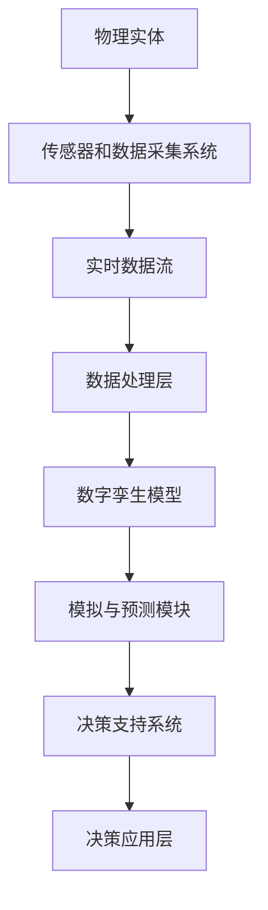

                 

### 文章标题

《数字孪生技术在智慧城市中的应用》

### 文章关键词

- 数字孪生技术
- 智慧城市
- 城市规划
- 交通管理
- 环境监测

### 文章摘要

本文探讨了数字孪生技术在智慧城市中的应用。首先，介绍了数字孪生技术的基本概念和核心原理，包括其核心概念、架构和关键组件。随后，详细阐述了数字孪生技术在智慧城市中的多种应用场景，如城市规划、交通管理和环境监测等。接着，分析了数字孪生技术的实施步骤，包括数据收集与处理、数字孪生模型开发以及实际应用案例分析。最后，探讨了数字孪生技术在智慧城市应用中的挑战和未来发展趋势，并提供了相关技术术语解释和应用参考资源。

## 第一部分：引言与背景

### 数字孪生技术的基本概念

数字孪生技术（Digital Twin Technology）是一种通过创建物理实体的数字映射来模拟和监控实际对象的技术。它将物理世界中的实体（如建筑物、设备、交通工具等）通过传感器和数据采集设备实时连接到数字世界，从而实现对这些实体的全方位监控、模拟和分析。简单来说，数字孪生技术是一种将现实世界中的物理实体转化为虚拟模型，并通过这个虚拟模型来优化和改进现实世界中的操作和决策。

数字孪生技术的核心概念包括以下几个方面：

1. **物理实体**：这是数字孪生技术的起点，可以是任何具有物理形态的实体，如建筑物、机器、交通工具等。

2. **数字映射**：通过传感器和数据采集设备，将物理实体的状态和属性转化为数字信号，并在数字世界中创建其对应的虚拟模型。

3. **实时连接**：通过高速网络和云计算平台，将物理实体的状态信息实时传输到数字孪生模型，实现物理世界和数字世界的无缝连接。

4. **模拟和分析**：利用数字孪生模型，可以对物理实体的行为进行模拟和分析，从而预测其未来状态，优化操作流程，提高决策效率。

### 数字孪生技术在智慧城市中的应用背景

智慧城市（Smart City）是指利用各种信息技术、物联网、大数据、人工智能等手段，对城市进行智能化的管理和运营，以提高城市效率、改善居民生活质量、减少资源浪费和环境污染。随着城市化进程的加速，智慧城市成为了全球各大城市发展的新趋势。

数字孪生技术在智慧城市中具有广泛的应用前景，其应用背景主要包括以下几个方面：

1. **城市规划**：通过数字孪生技术，可以对城市的发展进行模拟和预测，从而优化城市规划，提高土地利用效率，减少资源浪费。

2. **交通管理**：数字孪生技术可以实时监控交通流量，优化交通信号，提高道路通行效率，减少交通拥堵。

3. **环境监测**：通过数字孪生技术，可以实时监测城市环境质量，如空气质量、水质等，及时采取应对措施，改善城市环境。

4. **能源管理**：数字孪生技术可以帮助城市优化能源分配，提高能源利用效率，减少能源浪费。

5. **公共安全**：数字孪生技术可以实时监控城市安全状况，如火灾、地震等自然灾害，提前预警，及时应对。

综上所述，数字孪生技术作为智慧城市的重要组成部分，其在城市规划、交通管理、环境监测等方面的应用，将为智慧城市的发展带来巨大的推动力。

## 第二部分：数字孪生技术原理

### 数字孪生技术的核心概念

数字孪生技术是一种将物理实体与数字模型相结合的创新技术，其核心概念在于创建一个与实际物理实体具有相同结构和行为的数字映射。这个数字映射不仅能够实时反映物理实体的状态和属性，还可以通过模拟和预测功能对物理实体进行优化和改进。

#### 数字孪生的四个关键组成部分

1. **物理实体**：这是数字孪生技术的基石，可以是任何具有物理形态的实体，如建筑物、机器、交通工具等。

2. **传感器和数据采集系统**：传感器用于采集物理实体的各种状态数据，如温度、湿度、速度、位置等。数据采集系统负责将传感器数据传输到数字孪生模型。

3. **数字孪生模型**：这是数字孪生技术的核心，它通过算法和模型将物理实体的状态和属性转化为数字信号，并在数字世界中创建一个与物理实体相对应的虚拟模型。

4. **云计算和大数据平台**：云计算和大数据平台提供了强大的计算能力和数据存储能力，使数字孪生模型能够实时处理和分析大量数据，从而实现对物理实体的精准模拟和预测。

#### 数字孪生的技术基础

1. **物联网技术**：物联网技术是实现物理实体与数字模型之间实时连接的基础，通过传感器和通信模块，物理实体的状态数据可以实时传输到数字孪生模型。

2. **大数据技术**：大数据技术提供了强大的数据处理和分析能力，使数字孪生模型能够处理来自物理实体的海量数据，并进行深入分析和挖掘。

3. **人工智能技术**：人工智能技术为数字孪生模型提供了智能化的模拟和预测能力，通过机器学习和深度学习算法，数字孪生模型可以不断优化，提高预测精度和决策效率。

### 数字孪生技术的架构

数字孪生技术的架构可以分为三个层次：数据采集层、数据处理层和决策应用层。

1. **数据采集层**：这一层主要包括传感器和数据采集系统，负责实时采集物理实体的状态数据，并将其传输到数据处理层。

2. **数据处理层**：这一层负责处理和分析来自数据采集层的数据，利用大数据和人工智能技术对数据进行清洗、分析和建模，生成数字孪生模型。

3. **决策应用层**：这一层基于数字孪生模型提供决策支持，通过模拟和预测功能，为实际操作和决策提供依据，实现物理实体的优化和改进。

#### 数字孪生技术的核心组件

1. **数字孪生模型**：这是数字孪生技术的核心组件，通过数据驱动和物理建模相结合的方式，创建一个与物理实体相对应的虚拟模型。

2. **实时数据流**：实时数据流是数字孪生模型的基础，通过物联网技术和大数据平台，实现物理实体状态数据的实时传输和处理。

3. **模拟与预测模块**：模拟与预测模块利用人工智能技术，对数字孪生模型进行模拟和预测，为决策提供科学依据。

4. **决策支持系统**：决策支持系统基于模拟与预测结果，提供可视化分析和决策支持，帮助决策者做出最优决策。

### 数字孪生技术的核心概念联系架构

为了更好地理解数字孪生技术的核心概念和组成部分，我们可以通过以下Mermaid流程图展示其联系架构：



通过这个流程图，我们可以清晰地看到数字孪生技术从物理实体到数字模型，再到决策应用的完整流程。每个组件在流程中扮演着不同的角色，共同构成了数字孪生技术的核心架构。

### 核心算法原理讲解

#### 数字孪生模型构建的算法原理

数字孪生模型构建的核心在于将物理实体的状态和属性转化为数字信号，并在数字世界中创建一个对应的虚拟模型。这一过程涉及到数据采集、数据处理和模型训练等关键步骤。以下是构建数字孪生模型的算法原理和伪代码：

1. **数据采集**：通过传感器和数据采集系统，实时采集物理实体的各种状态数据，如温度、湿度、速度、位置等。伪代码如下：

   ```python
   def collect_data(sensor_data_source):
       while True:
           data = sensor_data_source.read()
           process_and_save(data)
   ```

2. **数据处理**：将采集到的数据进行预处理，包括数据清洗、归一化和特征提取等。预处理后的数据将用于训练数字孪生模型。伪代码如下：

   ```python
   def preprocess_data(raw_data):
       cleaned_data = clean(raw_data)
       normalized_data = normalize(cleaned_data)
       features = extract_features(normalized_data)
       return features
   ```

3. **模型训练**：使用预处理后的数据训练数字孪生模型，通常采用机器学习和深度学习算法。以下是一个简单的神经网络模型训练伪代码：

   ```python
   def train_model(features, labels):
       model = build_model()
       model.compile(optimizer='adam', loss='mean_squared_error')
       model.fit(features, labels, epochs=100, batch_size=32)
       return model
   ```

4. **模型评估与优化**：通过评估模型的预测精度，对模型进行优化。评估指标包括均方误差（MSE）、均方根误差（RMSE）等。伪代码如下：

   ```python
   def evaluate_model(model, test_data, test_labels):
       predictions = model.predict(test_data)
       mse = mean_squared_error(test_labels, predictions)
       rmse = mean_squared_error(test_labels, predictions, squared=False)
       return mse, rmse
   ```

#### 数字孪生模型的应用

数字孪生模型在智慧城市中的应用主要体现在模拟和预测方面。通过模拟，可以预测物理实体的未来状态，从而为决策提供依据。以下是模拟和预测的基本算法原理和伪代码：

1. **状态模拟**：根据数字孪生模型，模拟物理实体在不同时间点的状态。伪代码如下：

   ```python
   def simulate_state(model, initial_state, time_steps):
       current_state = initial_state
       for _ in range(time_steps):
           next_state = model.predict(current_state)
           current_state = next_state
           yield next_state
   ```

2. **状态预测**：利用数字孪生模型预测物理实体在未来的某个时间点的状态。伪代码如下：

   ```python
   def predict_state(model, current_state, future_time):
       future_state = model.predict(current_state + future_time)
       return future_state
   ```

#### 数学模型和公式

在数字孪生模型中，常用的数学模型和公式包括线性回归、神经网络、时间序列分析等。以下是一个简单的线性回归模型的数学公式和Python实现：

1. **线性回归模型公式**：

   $$ y = \beta_0 + \beta_1x $$

2. **Python实现**：

   ```python
   import numpy as np

   def linear_regression(x, y):
       x_mean = np.mean(x)
       y_mean = np.mean(y)
       beta_1 = np.sum((x - x_mean) * (y - y_mean)) / np.sum((x - x_mean)**2)
       beta_0 = y_mean - beta_1 * x_mean
       return beta_0, beta_1
   ```

#### 举例说明

假设我们有一个简单的数据集，包含时间和温度两个变量。我们可以使用线性回归模型来预测未来的温度。

```python
x = np.array([1, 2, 3, 4, 5])  # 时间
y = np.array([10, 15, 20, 25, 30])  # 温度

beta_0, beta_1 = linear_regression(x, y)

print(f"预测温度公式：y = {beta_0} + {beta_1}x")

# 预测未来某个时间点的温度
future_time = 6
predicted_temp = beta_0 + beta_1 * future_time
print(f"未来时间 {future_time} 的预测温度为：{predicted_temp}°C")
```

通过上述算法原理和伪代码，我们可以清晰地看到数字孪生技术的核心算法和模型是如何工作的。这些算法和模型不仅为数字孪生技术提供了强大的技术支持，也为智慧城市的发展提供了重要的工具和方法。

## 第三部分：数字孪生技术在智慧城市中的应用

### 数字孪生技术在城市规划中的应用

数字孪生技术在城市规划中具有广泛的应用前景，通过创建城市的数字孪生模型，可以对城市规划进行模拟和优化，从而提高城市规划的科学性和有效性。

1. **城市规划模拟**：通过数字孪生技术，可以创建城市的数字孪生模型，模拟不同规划方案对城市的影响。例如，在建设新的商业区、住宅区或交通设施时，可以通过数字孪生模型模拟交通流量、人口密度、环境质量等因素，评估不同规划方案对城市运行的潜在影响。

2. **土地利用优化**：数字孪生技术可以帮助城市规划者优化土地利用。通过分析数字孪生模型中的数据，可以识别出土地使用的热点区域和低效区域，从而制定出更合理的土地利用策略，提高土地利用效率。

3. **基础设施管理**：数字孪生技术可以实时监控城市基础设施的状态，如道路、桥梁、隧道等。通过数字孪生模型，可以预测基础设施的维护需求，提前进行维护和升级，确保基础设施的安全和可靠运行。

### 数字孪生技术在城市交通管理中的应用

城市交通管理是智慧城市的重要组成部分，数字孪生技术在这方面具有显著的应用价值，可以显著提高交通管理效率和安全性。

1. **交通流量预测**：通过数字孪生技术，可以实时收集和分析城市交通数据，如车辆流量、行驶速度、路况等。利用这些数据，可以建立交通流量预测模型，预测未来一段时间内各路段的交通流量，为交通管理部门提供决策依据。

2. **交通信号优化**：数字孪生技术可以实时监控交通信号灯的工作状态，分析不同信号配时对交通流量的影响。通过模拟和优化交通信号配时方案，可以提高交通效率，减少交通拥堵。

3. **交通事故预防**：数字孪生技术可以实时监测道路状况，通过分析数据，识别潜在的危险区域和事故高发时段。交通管理部门可以根据这些信息，提前采取措施，预防交通事故的发生。

### 数字孪生技术在城市环境监测中的应用

城市环境监测是智慧城市建设的重要组成部分，数字孪生技术可以通过实时监测和数据分析，提供科学的环境管理决策。

1. **空气质量监测**：通过数字孪生技术，可以实时监测城市空气质量，收集PM2.5、PM10、二氧化碳等污染物数据。利用这些数据，可以建立空气质量模型，预测未来的空气质量变化，为环境保护部门提供决策依据。

2. **水质监测**：数字孪生技术可以实时监测城市水质，检测水中的污染物和有害物质。通过分析水质数据，可以及时发现和处理水质污染问题，保护水资源。

3. **环境噪声监测**：数字孪生技术可以实时监测城市环境噪声，评估噪声污染对居民生活的影响。通过模拟和预测环境噪声的变化，可以为城市管理部门提供噪声控制策略，改善城市环境质量。

### 数字孪生技术在其他智慧城市领域的应用

除了上述主要应用领域，数字孪生技术还在其他智慧城市领域发挥了重要作用。

1. **公共安全**：通过数字孪生技术，可以实时监控城市安全状况，如火灾、地震等自然灾害。利用数字孪生模型，可以模拟灾害发生的过程，提前预警，为应急管理部门提供决策支持。

2. **能源管理**：数字孪生技术可以帮助城市优化能源分配，提高能源利用效率。通过实时监测和数据分析，可以识别能源消耗的热点区域和节能潜力，制定科学的能源管理策略。

3. **公共服务**：数字孪生技术可以提升公共服务水平，如医疗、教育、市政服务等。通过数字孪生模型，可以实时监控公共服务设施的运行状态，优化资源配置，提高服务效率。

综上所述，数字孪生技术在智慧城市中的应用涵盖了城市规划、交通管理、环境监测等多个领域，为智慧城市的建设和发展提供了强有力的技术支持。通过不断优化和推广数字孪生技术，智慧城市将变得更加高效、安全和宜居。

## 第四部分：数字孪生技术实施

### 数据收集与处理

数据收集与处理是数字孪生技术实施中的关键环节，其质量直接影响数字孪生模型的准确性和可靠性。以下是数据收集与处理的具体步骤：

1. **传感器选择与部署**：根据应用场景，选择合适的传感器来收集物理实体的状态数据。传感器的选择取决于需要监测的参数，如温度、湿度、速度、位置等。部署传感器时，需要考虑传感器的覆盖范围、精度和稳定性。

2. **数据采集**：通过传感器和数据采集系统，实时采集物理实体的状态数据。数据采集系统需要具备高带宽、低延迟的特点，确保数据能够及时传输到数据处理平台。

3. **数据预处理**：数据预处理是数据收集与处理的重要步骤，包括数据清洗、归一化和特征提取等。数据清洗旨在去除噪声和异常值，确保数据质量。归一化是将不同量纲的数据转换到同一尺度，便于后续分析和建模。特征提取是从原始数据中提取出对建模有用的特征，提高模型的解释性和预测能力。

4. **数据存储**：预处理后的数据需要存储在可靠的数据存储系统中，如关系型数据库、NoSQL数据库或大数据平台。数据存储系统需要具备高并发访问能力、数据备份和恢复功能，确保数据的安全和完整性。

### 数字孪生模型开发

数字孪生模型开发是数字孪生技术实施的核心步骤，包括模型设计、模型训练和模型优化等。

1. **模型设计**：模型设计是数字孪生模型开发的第一步，需要根据应用场景和需求，选择合适的模型类型和架构。常用的模型类型包括物理模型、数据驱动模型和混合模型。物理模型基于物理定律和模拟，适用于复杂系统的建模；数据驱动模型基于历史数据，适用于简单系统的建模；混合模型结合了物理模型和数据驱动模型的优势，适用于复杂系统的建模。

2. **模型训练**：模型训练是数字孪生模型开发的关键步骤，通过训练算法，使模型能够学会对物理实体进行模拟和预测。模型训练通常采用机器学习和深度学习算法，如神经网络、支持向量机、决策树等。训练过程中，需要选择合适的训练数据集，调整模型的超参数，优化模型性能。

3. **模型优化**：模型优化是提高数字孪生模型预测精度和泛化能力的重要步骤。优化方法包括模型调参、模型融合和数据增强等。模型调参是通过调整模型的超参数，提高模型的预测性能。模型融合是将多个模型融合成一个更强大的模型，提高预测精度。数据增强是通过生成新的训练数据，增加模型训练的样本多样性，提高模型的泛化能力。

### 数字孪生技术应用案例分析

为了更好地理解数字孪生技术的实际应用，以下介绍两个典型的数字孪生技术应用案例。

#### 案例一：智慧交通管理系统

**项目背景**：某城市面临严重的交通拥堵问题，希望通过引入数字孪生技术来优化交通管理。

**解决方案**：采用数字孪生技术，构建智慧交通管理系统，主要包括以下几个步骤：

1. **数据采集**：部署传感器和摄像头，实时采集交通流量、车辆速度、道路拥堵等信息。

2. **数据预处理**：对采集到的数据进行清洗、归一化和特征提取，确保数据质量。

3. **模型设计**：选择合适的模型类型和架构，构建交通流量预测模型。

4. **模型训练**：利用历史交通数据，对模型进行训练，优化模型参数。

5. **模型部署**：将训练好的模型部署到智慧交通管理系统中，实现实时交通流量预测。

**效果评估**：通过实际运行，智慧交通管理系统有效降低了交通拥堵，提高了道路通行效率，为城市交通管理提供了有力的技术支持。

#### 案例二：智慧城市环境监测系统

**项目背景**：某城市空气质量问题严重，希望利用数字孪生技术实时监测和改善空气质量。

**解决方案**：采用数字孪生技术，构建智慧城市环境监测系统，主要包括以下几个步骤：

1. **数据采集**：部署空气质量传感器，实时监测PM2.5、PM10、二氧化碳等污染物数据。

2. **数据预处理**：对采集到的空气质量数据进行清洗、归一化和特征提取，确保数据质量。

3. **模型设计**：选择合适的模型类型和架构，构建空气质量预测模型。

4. **模型训练**：利用历史空气质量数据，对模型进行训练，优化模型参数。

5. **模型部署**：将训练好的模型部署到智慧城市环境监测系统中，实现实时空气质量预测。

**效果评估**：通过实际运行，智慧城市环境监测系统实时监测和预测空气质量变化，为环境保护部门提供了科学的决策依据，有效改善了城市空气质量。

通过上述两个案例分析，我们可以看到数字孪生技术在智慧城市中的实际应用效果。数字孪生技术不仅为城市管理和运营提供了有力的技术支持，也为解决城市面临的各类问题提供了新的思路和方法。

### 数字孪生技术在智慧城市应用中的挑战

尽管数字孪生技术在智慧城市中具有广泛的应用前景，但其实际应用过程中仍面临一系列挑战，这些挑战涉及技术、数据、安全和隐私等多个方面。

1. **数据质量和准确性**：数字孪生技术的核心依赖于传感器采集的数据，而数据质量和准确性直接决定了数字孪生模型的可靠性。在实际应用中，传感器可能会受到环境干扰、设备故障等因素的影响，导致数据噪声和异常值。此外，数据预处理和清洗环节的质量也影响模型的准确性。

2. **实时性要求**：数字孪生技术需要实现物理实体和数字孪生模型之间的实时连接和同步，这对数据传输和处理的速度提出了高要求。特别是在城市交通管理和环境监测等应用场景中，实时性的要求更为迫切，任何延迟都可能对决策产生重大影响。

3. **数据安全与隐私保护**：数字孪生技术涉及大量敏感数据的采集和传输，如个人隐私数据、企业商业数据等。如何确保这些数据的安全和隐私保护成为数字孪生技术面临的重大挑战。数据泄露和未经授权的访问可能导致严重的后果。

4. **计算资源与存储需求**：数字孪生技术需要处理和分析海量数据，这需要强大的计算资源和存储能力。在智慧城市中，随着传感器数量的增加和数据量的增长，对计算资源和存储需求的压力将持续增加，这对城市IT基础设施提出了更高要求。

5. **模型优化与泛化能力**：数字孪生模型需要具备良好的预测能力和泛化能力，以适应不断变化的环境。然而，模型的优化和调参是一个复杂的过程，需要大量的实验和计算资源。同时，模型在训练过程中可能存在过拟合现象，导致在未知数据上的表现不佳。

6. **跨领域协同**：数字孪生技术在智慧城市中的应用需要跨领域的协同合作，包括城市规划、交通管理、环境监测等多个部门。然而，不同领域的专业知识和数据格式往往存在差异，如何实现有效的协同和整合成为数字孪生技术面临的一个难题。

7. **法规与标准**：数字孪生技术在智慧城市中的应用还面临法律法规和标准的约束。不同国家和地区的法律法规和标准可能存在差异，如何确保数字孪生技术的合规性是一个需要重视的问题。

综上所述，数字孪生技术在智慧城市应用中面临多重挑战，需要从技术、数据、安全和隐私等多个方面进行综合考虑和解决，以确保其能够充分发挥作用，为智慧城市的建设和发展提供有力支持。

### 数字孪生技术的未来发展趋势

随着科技的不断进步和智慧城市的深入发展，数字孪生技术正迎来新的发展趋势，其在智慧城市中的应用前景也愈发广阔。以下是数字孪生技术的几个未来发展趋势：

1. **多尺度数字孪生**：未来的数字孪生技术将不再局限于单一尺度的模型，而是构建多尺度、多层次、多系统的数字孪生体系。这种多尺度数字孪生技术可以实现对城市从微观到宏观的全局监控和优化。例如，在城市规划中，可以同时考虑建筑、街区、城市区域等多个层次的数字孪生模型，实现更精细化的管理和优化。

2. **智能化与自主化**：随着人工智能和机器学习技术的发展，数字孪生技术将更加智能化和自主化。数字孪生模型将具备自我学习和自我优化的能力，通过实时数据分析和机器学习算法，不断提升预测精度和决策效率。例如，在交通管理中，数字孪生技术可以自主调整交通信号，优化道路通行效率，减少交通拥堵。

3. **数据融合与协同**：未来数字孪生技术将实现更广泛的数据融合和协同。通过整合来自不同来源的数据，如物联网设备、卫星遥感、传感器网络等，数字孪生模型将具备更全面的数据支持。这种数据融合和协同将促进数字孪生技术在多个领域的深度应用，如城市规划、环境监测、公共安全等。

4. **边缘计算与云计算**：随着5G和边缘计算技术的发展，数字孪生技术将实现边缘计算和云计算的深度融合。边缘计算将使数字孪生模型能够在本地进行实时数据分析和处理，降低延迟，提高响应速度。而云计算则提供强大的计算能力和数据存储能力，支持大规模数据处理和模型训练。

5. **可持续性与绿色发展**：数字孪生技术在未来的智慧城市中将继续发挥其在可持续发展和绿色发展中的重要作用。通过优化能源管理和资源分配，数字孪生技术将有助于实现城市的绿色可持续发展。例如，通过智能电网和能源管理系统，实现能源的高效利用和可再生能源的广泛应用。

6. **跨领域合作与标准化**：随着数字孪生技术的广泛应用，跨领域合作和标准化将成为未来发展的关键。不同领域的技术专家、企业和政府部门需要共同合作，制定统一的数字孪生技术标准和规范，确保技术的兼容性和互操作性，促进数字孪生技术的广泛应用和可持续发展。

7. **个性化与定制化**：未来数字孪生技术将更加注重个性化与定制化。根据不同城市和区域的特点，数字孪生技术可以定制化地开发和部署，满足特定场景的需求。例如，在城市规划中，可以根据不同的地理环境、气候条件和人口密度，定制化地优化数字孪生模型，提高城市规划的科学性和有效性。

综上所述，数字孪生技术作为智慧城市的重要组成部分，其未来发展将充满机遇和挑战。通过不断优化技术、加强数据融合、促进跨领域合作和标准化，数字孪生技术将在智慧城市的建设和发展中发挥更加重要的作用，推动智慧城市的可持续发展和智能化升级。

## 附录

### 数字孪生相关技术术语解释

1. **数字孪生模型（Digital Twin Model）**：数字孪生模型是指通过创建物理实体的虚拟映射，实现对物理实体的状态、行为和性能进行模拟和预测的模型。

2. **传感器（Sensor）**：传感器是指能够感知和测量物理世界中的各种物理量，如温度、湿度、速度、位置等的设备。

3. **物联网（Internet of Things, IoT）**：物联网是指通过互联网将各种物理设备连接起来，实现设备之间的数据交换和协同工作。

4. **大数据（Big Data）**：大数据是指无法使用传统数据处理工具在合理时间内进行捕捉、管理和处理的大量数据。

5. **机器学习（Machine Learning）**：机器学习是指通过算法和模型，使计算机能够从数据中自动学习和发现规律，从而实现智能决策和预测。

6. **深度学习（Deep Learning）**：深度学习是机器学习的一种方法，通过构建深度神经网络，对大量数据进行自动学习和特征提取。

7. **边缘计算（Edge Computing）**：边缘计算是指将计算、存储和处理能力从云端转移到网络边缘，实现实时数据处理和决策。

### 数字孪生技术应用参考资源

1. **论文**：
   - *“Digital Twin: A Symbolic Representation of Physical Systems for Design and Operations” by Michael Grieves*，介绍数字孪生技术的起源和基本概念。

2. **书籍**：
   - *《智慧城市：数字孪生技术的应用与挑战》*，全面探讨数字孪生技术在智慧城市中的应用和面临的挑战。

3. **开源项目**：
   - *“OpenDTCore”*：一个开源的数字孪生技术框架，支持数字孪生模型的构建和部署。

4. **在线课程**：
   - *“数字孪生技术与应用”*：由著名大学或专业机构提供的在线课程，系统介绍数字孪生技术的基本原理和应用案例。

5. **学术论文库**：
   - *IEEE Xplore*、*ACM Digital Library*：提供大量关于数字孪生技术的研究论文和最新进展。

6. **行业报告**：
   - *“全球数字孪生市场报告”*：分析数字孪生技术的市场规模、增长趋势和潜在应用领域。

通过这些资源，读者可以深入了解数字孪生技术的相关概念、应用案例和发展趋势，为研究和工作提供有益的参考和指导。

### 最佳实践 Tips

在实际应用数字孪生技术时，以下是一些最佳实践 Tips，有助于确保项目的成功实施和高效运行：

1. **明确目标和需求**：在开始项目之前，明确数字孪生技术的应用目标和需求，确保项目方向正确，避免资源浪费。

2. **选择合适的传感器和平台**：根据应用场景选择高精度、稳定性好的传感器，并选择适合的数据处理和分析平台，确保数据质量和实时性。

3. **数据预处理和清洗**：确保数据预处理和清洗环节的质量，去除噪声和异常值，提高数据准确性。

4. **模型训练与优化**：根据实际应用场景和需求，选择合适的模型类型和算法，进行模型训练和优化，提高预测精度和泛化能力。

5. **确保数据安全和隐私保护**：在数据收集、传输和存储过程中，采取严格的安全措施，确保数据安全和隐私保护。

6. **跨领域合作与标准化**：促进跨领域合作，制定统一的数字孪生技术标准和规范，确保技术的兼容性和互操作性。

7. **持续监测与迭代优化**：数字孪生技术项目不是一次性的，而是需要持续监测和优化。根据实际应用反馈，不断调整和优化模型和系统，提高性能和效果。

通过遵循这些最佳实践 Tips，可以确保数字孪生技术在智慧城市中的应用更加成功和高效。

### 小结

本文系统地介绍了数字孪生技术在智慧城市中的应用。从基本概念到核心原理，从应用场景到实施步骤，再到未来发展趋势，全面剖析了数字孪生技术在智慧城市中的重要作用。数字孪生技术不仅能够提升城市管理的科学性和精细化，还能够为城市居民提供更加智能、便捷的生活体验。

数字孪生技术在城市规划、交通管理、环境监测等领域展现了巨大的应用潜力，通过创建物理实体的数字映射，实现对城市运行状态的实时监控、模拟和预测，为决策者提供科学依据，优化资源配置，提高城市运营效率。此外，随着技术的不断进步，数字孪生技术将在智慧城市的可持续发展中发挥更加重要的作用。

在未来的智慧城市建设中，数字孪生技术将继续拓展其应用范围，实现多尺度、多层次、多系统的协同优化。同时，随着人工智能、物联网和边缘计算等技术的发展，数字孪生技术将变得更加智能化和自主化，为智慧城市的可持续发展提供强大的技术支撑。

### 注意事项

在应用数字孪生技术时，需要注意以下几个关键点：

1. **数据质量和准确性**：确保数据采集系统的可靠性和数据处理的准确性，以避免模型预测的偏差。

2. **实时性和延迟**：在交通管理、环境监测等对实时性要求较高的场景中，要确保数据传输和处理的速度，降低延迟。

3. **安全性和隐私保护**：采取严格的数据加密和安全措施，保护用户隐私和数据安全，防止数据泄露。

4. **跨领域协作**：在实施数字孪生项目时，需要跨领域协作，确保不同部门和系统的数据共享和互操作性。

5. **模型优化和调参**：定期对数字孪生模型进行优化和调参，以提高模型的预测精度和泛化能力。

### 拓展阅读

为了进一步深入了解数字孪生技术在智慧城市中的应用，读者可以参考以下书籍和论文：

1. *“智慧城市：数字孪生技术的应用与挑战”*，详细介绍了数字孪生技术在智慧城市中的应用场景和挑战。

2. *“数字孪生：从概念到实践”*，提供了数字孪生技术的深入讲解和应用案例。

3. *IEEE Xplore* 和 *ACM Digital Library* 上的相关论文，探讨数字孪生技术的最新研究进展和应用。

通过这些拓展阅读，读者可以更全面地了解数字孪生技术的理论和实践，为智慧城市的建设提供更加深入的指导。

