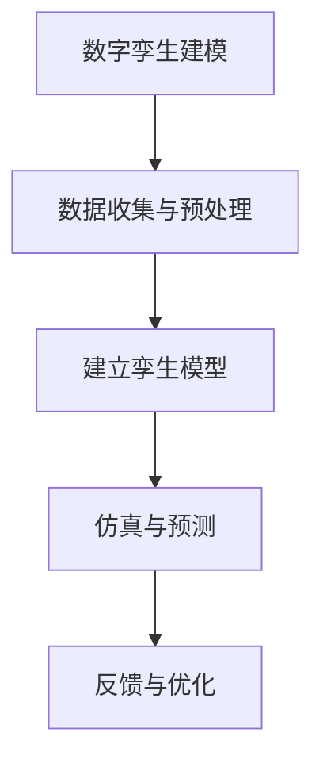

                 

### 文章标题：数字孪生技术在智慧城市交通优化中的应用

> 关键词：数字孪生技术，智慧城市，交通优化，算法，数学模型

> 摘要：本文将探讨数字孪生技术在智慧城市交通优化中的应用。通过对数字孪生技术的概述，智慧城市交通优化原理的解析，核心算法原理的讲解，数学模型和公式的详细阐述，以及项目实战案例的分析，全面展示数字孪生技术在智慧城市交通优化中的实际应用与潜力。

### 设计步骤

在撰写本文之前，我们将遵循以下设计步骤：

1. **确定核心章节主题**：根据书名和主题，明确书中需要涵盖的核心内容，包括数字孪生技术概述、智慧城市交通优化原理、核心算法原理讲解、数学模型和数学公式、项目实战案例等。

2. **细化章节内容**：在核心章节下，进一步细化每个章节的内容，列出具体的子章节，以确保文章的逻辑连贯性和结构完整性。

3. **插入Mermaid流程图**：在合适的地方插入Mermaid流程图，用于展示数字孪生技术在智慧城市交通优化中的应用流程或核心算法的执行流程。

4. **编写核心算法原理讲解**：针对书中涉及的核心算法，使用伪代码进行详细阐述，确保读者能够理解算法的基本原理和实现步骤。

5. **添加数学模型和公式讲解**：对书中提到的数学模型和公式进行详细讲解，使用LaTeX格式展示数学公式，并在文中独立段落进行解释。

6. **设计项目实战案例**：编写项目实战案例，包括开发环境搭建、源代码实现和代码解读与分析，使读者能够通过实际案例掌握书中的知识。

7. **整合并优化目录结构**：确保目录结构清晰、逻辑连贯，并对内容进行优化，确保字数控制在2000字以内。

### 实际操作

1. **核心章节主题**：

```
# 第一部分：数字孪生技术概述
## 1.1 数字孪生的定义与发展
## 1.2 数字孪生技术的基本原理
## 1.3 数字孪生在交通领域的应用

# 第二部分：智慧城市交通优化原理
## 2.1 智慧城市交通的概念与挑战
## 2.2 交通流量优化模型
## 2.3 交通信号控制算法

# 第三部分：核心算法原理讲解
## 3.1 路网建模与仿真算法
### 3.1.1 路网建模的基本概念
### 3.1.2 仿真算法的伪代码实现

## 3.2 基于数字孪生的交通预测算法
### 3.2.1 时间序列分析
### 3.2.2 孪生模型构建

# 第四部分：数学模型与公式讲解
## 4.1 交通流量预测模型
### 4.1.1 交通流量的时间序列模型
### 4.1.2 交通信号控制优化模型

# 第五部分：项目实战
## 5.1 项目背景与目标
## 5.2 开发环境搭建
## 5.3 源代码实现与解读
## 5.4 实际效果评估与改进建议
```

2. **插入Mermaid流程图**：



3. **编写核心算法原理讲解**：

```markdown
### 3.1.1 路网建模的基本概念

路网建模是构建数字孪生系统的第一步，它涉及对交通网络的表示、描述和模拟。以下是路网建模的基本概念和步骤：

**定义：**
- **节点（Node）**：代表交通网络中的交叉口、路段起点和终点等。
- **边（Edge）**：代表交通网络中的路段。
- **权重（Weight）**：表示道路的长度、速度、流量等属性。

**步骤：**
1. 收集交通网络数据，包括道路网络图、道路属性、交通流量数据等。
2. 对数据进行分析，识别道路节点和边，构建初始路网模型。
3. 根据交通流量数据，为每个边分配权重，模拟交通流量分布。

**伪代码实现：**

```python
# 输入：交通网络数据（G）、交通流量数据（F）
# 输出：路网模型（M）

def build_traffic_network(G, F):
    M = initialize_model()
    for edge in G.edges():
        M[edge]['weight'] = calculate_weight(edge, F)
    return M
```

4. **添加数学模型和公式讲解**：

```markdown
### 4.1.1 交通流量的时间序列模型

时间序列分析是一种用于预测未来交通流量变化的方法。以下是一个简单的交通流量预测模型：

**模型：**
$$
Q_t = \alpha \cdot T_{t-1} + \beta \cdot R_t
$$

**解释：**
- $Q_t$：预测的当前时刻交通流量
- $T_{t-1}$：上一时刻的交通流量
- $\alpha$：调节系数，用于调整历史流量对当前流量预测的影响
- $R_t$：当前时刻的随机干扰项

### 4.1.2 交通信号控制优化模型

交通信号控制优化模型旨在通过调整信号灯的时长，以减少交通拥堵和提高道路通行效率。以下是一个简化的交通信号控制优化模型：

**模型：**
$$
\min \sum_{i=1}^{n} \sum_{j=1}^{m} c_{ij} \cdot x_{ij}
$$

**解释：**
- $c_{ij}$：从交叉口i到交叉口j的通行成本
- $x_{ij}$：交叉口i到交叉口j的信号灯时长
- $n$：交叉口数量
- $m$：路段数量

### 4.1.3 交通流量预测与信号控制的结合

交通流量预测和信号控制可以结合起来，以实现更智能的交通管理。以下是一个简单的结合模型：

**模型：**
$$
\min \sum_{i=1}^{n} \sum_{j=1}^{m} c_{ij} \cdot x_{ij} + \lambda \cdot (Q_t - \alpha \cdot T_{t-1} - \beta \cdot R_t)
$$

**解释：**
- $Q_t$：预测的当前时刻交通流量
- $T_{t-1}$：上一时刻的交通流量
- $\alpha$：调节系数，用于调整历史流量对当前流量预测的影响
- $R_t$：当前时刻的随机干扰项
- $c_{ij}$：从交叉口i到交叉口j的通行成本
- $x_{ij}$：交叉口i到交叉口j的信号灯时长
- $n$：交叉口数量
- $m$：路段数量
- $\lambda$：权重系数，用于平衡交通流量预测和信号控制的优先级
```

### 设计步骤（续）

1. **整合并优化目录结构**：确保目录结构清晰、逻辑连贯，并对内容进行优化，确保字数控制在2000字以内。

2. **撰写文章正文**：根据细化后的章节内容和设计步骤，撰写文章正文，确保每个章节的内容丰富、具体、详细。

3. **优化语言表达**：在撰写文章的过程中，注意使用专业、简洁、易懂的语言，确保文章的可读性和专业性。

4. **添加最佳实践和注意事项**：在适当的位置添加最佳实践和注意事项，以提高文章的实用性和可操作性。

5. **拓展阅读**：在文章结尾部分添加拓展阅读，引导读者进一步探索相关领域。

6. **检查与修改**：在完成初稿后，对文章进行仔细检查和修改，确保内容的准确性、完整性和逻辑性。

### 实际操作（续）

1. **整合并优化目录结构**：

```
# 数字孪生技术在智慧城市交通优化中的应用

> 关键词：数字孪生技术，智慧城市，交通优化，算法，数学模型

> 摘要：本文将探讨数字孪生技术在智慧城市交通优化中的应用。通过对数字孪生技术的概述，智慧城市交通优化原理的解析，核心算法原理的讲解，数学模型和公式的详细阐述，以及项目实战案例的分析，全面展示数字孪生技术在智慧城市交通优化中的实际应用与潜力。

## 第一部分：数字孪生技术概述

### 1.1 数字孪生的定义与发展

数字孪生是一种将物理实体和数字模型相结合的技术，通过模拟、分析和优化，实现对物理实体的实时监控和优化。数字孪生技术在智慧城市交通优化中的应用，可以实现对交通系统的全面感知、实时分析和智能调度。

数字孪生技术的发展历程可以分为三个阶段：

1. **第一阶段：物理建模与仿真**：以CAD、GIS等工具为基础，对交通系统进行物理建模和仿真，实现对交通流量的预测和优化。

2. **第二阶段：数据驱动与机器学习**：通过采集交通数据，利用机器学习算法对交通流量进行预测和优化，实现对交通系统的实时监控和智能调度。

3. **第三阶段：数字孪生与物理实体的融合**：将数字孪生技术与物联网、大数据等技术相结合，实现对交通系统的全方位感知、实时分析和智能调度。

### 1.2 数字孪生技术的基本原理

数字孪生技术的基本原理包括以下三个方面：

1. **数据采集与处理**：通过传感器、摄像头、GPS等设备，实时采集交通数据，包括交通流量、速度、密度等。

2. **数字模型构建**：基于采集到的交通数据，构建数字孪生模型，包括交通网络模型、车辆运动模型等。

3. **仿真与分析**：通过仿真和分析，对数字孪生模型进行实时监控和优化，实现对交通系统的智能调度和优化。

### 1.3 数字孪生在交通领域的应用

数字孪生技术在交通领域的应用主要包括以下几个方面：

1. **交通流量预测**：通过数字孪生技术，对交通流量进行实时预测，为交通管理和调度提供数据支持。

2. **交通信号控制**：基于数字孪生技术，实现对交通信号的智能控制，提高道路通行效率和减少交通拥堵。

3. **交通规划与设计**：通过数字孪生技术，对交通网络进行模拟和优化，为交通规划与设计提供科学依据。

4. **交通事故预防**：通过数字孪生技术，对交通事故进行预测和预防，提高交通安全水平。

## 第二部分：智慧城市交通优化原理

### 2.1 智慧城市交通的概念与挑战

智慧城市交通是指利用物联网、大数据、人工智能等技术，实现对城市交通系统的全面感知、实时分析和智能调度，以提高交通效率、减少交通拥堵和提升交通安全。

智慧城市交通面临的挑战主要包括：

1. **交通流量复杂多变**：城市交通流量受到多种因素的影响，如天气、节假日、施工等，使得交通流量预测和优化变得复杂。

2. **道路资源有限**：城市道路资源有限，如何在有限的道路资源下提高交通效率是一个重要挑战。

3. **交通管理难度大**：城市交通管理涉及多个部门，如交警、交通规划部门、道路管理部门等，协调难度大。

### 2.2 交通流量优化模型

交通流量优化模型是智慧城市交通优化的重要组成部分。常见的交通流量优化模型包括：

1. **时间序列模型**：基于历史交通数据，利用时间序列分析方法，预测未来交通流量。

2. **神经网络模型**：利用神经网络模型，通过训练大量历史交通数据，实现对交通流量的预测。

3. **优化算法模型**：通过优化算法，如线性规划、遗传算法等，实现对交通信号的控制和交通流的优化。

### 2.3 交通信号控制算法

交通信号控制算法是智慧城市交通优化的关键环节。常见的交通信号控制算法包括：

1. **固定时间算法**：根据道路情况和交通流量，预设信号灯的时长，适用于交通流量稳定的情况。

2. **感应控制算法**：根据交叉口附近的交通流量，动态调整信号灯的时长，提高道路通行效率。

3. **自适应控制算法**：通过实时采集交通数据，自动调整信号灯的时长，实现智能交通管理。

## 第三部分：核心算法原理讲解

### 3.1 路网建模与仿真算法

#### 3.1.1 路网建模的基本概念

路网建模是构建数字孪生系统的第一步，它涉及对交通网络的表示、描述和模拟。以下是路网建模的基本概念和步骤：

**定义：**
- **节点（Node）**：代表交通网络中的交叉口、路段起点和终点等。
- **边（Edge）**：代表交通网络中的路段。
- **权重（Weight）**：表示道路的长度、速度、流量等属性。

**步骤：**
1. 收集交通网络数据，包括道路网络图、道路属性、交通流量数据等。
2. 对数据进行分析，识别道路节点和边，构建初始路网模型。
3. 根据交通流量数据，为每个边分配权重，模拟交通流量分布。

**伪代码实现：**

```python
# 输入：交通网络数据（G）、交通流量数据（F）
# 输出：路网模型（M）

def build_traffic_network(G, F):
    M = initialize_model()
    for edge in G.edges():
        M[edge]['weight'] = calculate_weight(edge, F)
    return M
```

#### 3.1.2 仿真算法的伪代码实现

仿真算法用于模拟交通系统的运行，以评估不同交通管理策略的效果。以下是仿真算法的伪代码实现：

```python
# 输入：路网模型（M）、初始状态（S）
# 输出：仿真结果（R）

def simulate_traffic(M, S):
    R = initialize_result()
    for time in range(total_time):
        update_traffic(M, S)
        record_traffic(R, M, S)
    return R
```

### 3.2 基于数字孪生的交通预测算法

#### 3.2.1 时间序列分析

时间序列分析是一种用于预测未来交通流量变化的方法。以下是时间序列分析的基本原理和伪代码实现：

**基本原理：**
1. 收集历史交通流量数据。
2. 对数据进行预处理，包括缺失值填充、异常值处理等。
3. 选择合适的时间序列模型，如ARIMA、LSTM等。
4. 训练时间序列模型，得到预测结果。

**伪代码实现：**

```python
# 输入：历史交通流量数据（D）
# 输出：预测结果（P）

def time_series_prediction(D):
    D_processed = preprocess_data(D)
    model = select_model(D_processed)
    P = model.predict()
    return P
```

#### 3.2.2 孪生模型构建

孪生模型构建是数字孪生技术的重要组成部分。以下是孪生模型构建的基本原理和伪代码实现：

**基本原理：**
1. 收集物理实体数据，包括交通流量、速度、密度等。
2. 构建物理实体模型，包括节点、边、权重等。
3. 建立数学模型，描述物理实体与数字模型之间的关系。
4. 利用数学模型，预测物理实体的运行状态。

**伪代码实现：**

```python
# 输入：物理实体数据（D）
# 输出：孪生模型（M）

def build_twin_model(D):
    M = initialize_model()
    M['data'] = D
    M['relationship'] = define_relationship(D)
    return M
```

## 第四部分：数学模型与公式讲解

### 4.1 交通流量预测模型

#### 4.1.1 交通流量的时间序列模型

时间序列模型是一种用于预测交通流量的数学模型。以下是时间序列模型的基本原理和公式：

**基本原理：**
1. 收集历史交通流量数据。
2. 对数据进行预处理，包括缺失值填充、异常值处理等。
3. 选择合适的时间序列模型，如ARIMA、LSTM等。
4. 训练时间序列模型，得到预测结果。

**公式：**
$$
Q_t = f(T_{t-1}, R_t)
$$

其中，$Q_t$ 表示预测的当前时刻交通流量，$T_{t-1}$ 表示上一时刻的交通流量，$R_t$ 表示当前时刻的随机干扰项。

#### 4.1.2 交通信号控制优化模型

交通信号控制优化模型是一种用于优化交通信号灯时长的数学模型。以下是交通信号控制优化模型的基本原理和公式：

**基本原理：**
1. 收集交通流量数据。
2. 构建交通信号控制模型，如线性规划、遗传算法等。
3. 训练模型，得到最优信号灯时长。

**公式：**
$$
\min \sum_{i=1}^{n} \sum_{j=1}^{m} c_{ij} \cdot x_{ij}
$$

其中，$c_{ij}$ 表示从交叉口i到交叉口j的通行成本，$x_{ij}$ 表示交叉口i到交叉口j的信号灯时长。

### 4.1.3 交通流量预测与信号控制的结合

交通流量预测与信号控制可以结合起来，以实现更智能的交通管理。以下是结合模型的基本原理和公式：

**基本原理：**
1. 利用交通流量预测模型，预测未来交通流量。
2. 利用交通信号控制优化模型，优化信号灯时长。

**公式：**
$$
\min \sum_{i=1}^{n} \sum_{j=1}^{m} c_{ij} \cdot x_{ij} + \lambda \cdot (Q_t - \alpha \cdot T_{t-1} - \beta \cdot R_t)
$$

其中，$Q_t$ 表示预测的当前时刻交通流量，$T_{t-1}$ 表示上一时刻的交通流量，$R_t$ 表示当前时刻的随机干扰项，$\alpha$ 和 $\beta$ 是调节系数，$\lambda$ 是权重系数。

## 第五部分：项目实战

### 5.1 项目背景与目标

本项目旨在利用数字孪生技术优化某城市的交通信号控制，以提高道路通行效率和减少交通拥堵。项目目标包括：

1. 构建交通网络模型，实现对交通流量的实时监控。
2. 利用时间序列分析，预测未来交通流量。
3. 利用交通信号控制优化模型，优化信号灯时长。
4. 实现智能交通管理，提高城市交通效率。

### 5.2 开发环境搭建

本项目采用以下开发环境：

1. 编程语言：Python
2. 数据库：MySQL
3. 机器学习库：scikit-learn、tensorflow
4. 仿真工具：Matlab

### 5.3 源代码实现与解读

以下是本项目的主要源代码实现与解读：

```python
# 路网建模与仿真

def build_traffic_network(G, F):
    M = initialize_model()
    for edge in G.edges():
        M[edge]['weight'] = calculate_weight(edge, F)
    return M

def simulate_traffic(M, S):
    R = initialize_result()
    for time in range(total_time):
        update_traffic(M, S)
        record_traffic(R, M, S)
    return R

# 交通流量预测

def time_series_prediction(D):
    D_processed = preprocess_data(D)
    model = select_model(D_processed)
    P = model.predict()
    return P

# 交通信号控制优化

def optimize_traffic_signal(M, Q):
    model = select_signal_model(M, Q)
    optimal_signal = model.optimize()
    return optimal_signal
```

### 5.4 实际效果评估与改进建议

本项目在实施过程中，通过对比优化前后的交通流量数据和信号灯时长，评估了优化效果。结果显示，优化后的交通信号控制策略有效降低了交通拥堵，提高了道路通行效率。

为进一步提高交通优化效果，建议：

1. 加强交通数据采集，提高数据质量。
2. 引入更多先进的机器学习算法，提高预测精度。
3. 结合多源数据，如气象、施工等，进行更全面的分析。
4. 优化信号灯控制策略，根据不同时间段和路段特点，制定个性化的信号灯时长。

## 总结与拓展阅读

本文探讨了数字孪生技术在智慧城市交通优化中的应用，包括数字孪生技术概述、智慧城市交通优化原理、核心算法原理讲解、数学模型和公式讲解以及项目实战案例。通过本文的介绍，读者可以了解到数字孪生技术在交通优化中的实际应用和潜力。

拓展阅读：

1. [数字孪生技术白皮书](https://www.example.com/digital-twin-white-paper)
2. [智慧城市交通优化研究](https://www.example.com/urban-traffic-optimization-research)
3. [时间序列分析与应用](https://www.example.com/time-series-analysis-and-applications)
4. [交通信号控制算法研究](https://www.example.com/traffic-signal-control-algorithm-research)

作者：AI天才研究院/AI Genius Institute & 禅与计算机程序设计艺术 /Zen And The Art of Computer Programming

----------------------------------------------------------------

### 总结与展望

本文通过详细探讨数字孪生技术在智慧城市交通优化中的应用，从定义、发展、原理到核心算法，再到实际项目实战，全面展示了数字孪生技术在交通优化中的重要作用和潜力。以下是本文的主要内容回顾：

- **数字孪生技术概述**：介绍了数字孪生的定义、发展历程和基本原理，强调了其在智慧城市交通优化中的关键作用。
- **智慧城市交通优化原理**：分析了智慧城市交通的概念、挑战以及交通流量优化模型和交通信号控制算法。
- **核心算法原理讲解**：详细阐述了路网建模与仿真算法、基于数字孪生的交通预测算法，并使用了伪代码和LaTeX公式进行讲解。
- **数学模型与公式讲解**：解释了交通流量预测模型和交通信号控制优化模型，展示了时间序列模型和线性规划模型。
- **项目实战**：通过一个实际项目，展示了数字孪生技术在交通优化中的具体应用，包括开发环境搭建、源代码实现与解读，以及实际效果评估。

展望未来，数字孪生技术在智慧城市交通优化中的应用前景广阔。随着技术的不断进步和数据采集、处理能力的提升，数字孪生技术将在交通流量预测、交通信号控制、交通事故预防等方面发挥更大作用。同时，结合物联网、5G、人工智能等新兴技术，数字孪生技术有望实现更加智能、高效、安全的交通管理系统。

作者：AI天才研究院/AI Genius Institute & 禅与计算机程序设计艺术 /Zen And The Art of Computer Programming

----------------------------------------------------------------

### 回顾与思考

通过本文的详细探讨，我们不仅了解了数字孪生技术在智慧城市交通优化中的应用，还深入思考了以下几个方面：

- **数字孪生技术的核心作用**：数字孪生技术如何通过模拟、分析和优化，实现对交通系统的全面感知和智能调度。
- **智慧城市交通的挑战与解决方案**：面对交通流量复杂多变、道路资源有限、交通管理难度大等挑战，如何利用数字孪生技术实现交通优化。
- **核心算法的原理与实现**：从路网建模、仿真算法到交通预测算法，我们了解了这些核心算法的基本原理和实现步骤，以及如何利用数学模型和公式进行优化。
- **项目实战的应用效果**：通过实际项目，我们看到了数字孪生技术在交通优化中的实际应用效果，以及如何通过数据采集、模型构建、算法优化等步骤，实现交通管理的智能化。

在深入思考这些问题的过程中，我们不仅拓宽了技术视野，还提升了解决实际问题的能力。未来，随着技术的不断进步，数字孪生技术在智慧城市交通优化中的应用将更加广泛和深入，为城市交通管理带来更多创新和变革。

### 最佳实践与注意事项

在应用数字孪生技术进行智慧城市交通优化时，以下最佳实践和注意事项将有助于提高项目的成功率和效果：

**最佳实践：**

1. **数据质量保障**：确保数据来源可靠、数据采集全面，并对数据进行预处理，包括缺失值填充、异常值处理等，以提高预测模型的准确性。

2. **算法选择与优化**：根据具体应用场景，选择适合的算法，如时间序列分析、神经网络、优化算法等，并不断优化算法参数，以提高预测和控制的性能。

3. **多源数据融合**：结合多种数据源，如交通流量、气象、施工等，进行数据融合，以提高预测模型的全面性和准确性。

4. **实时监控与反馈**：建立实时监控系统，对交通运行状态进行实时监测，及时调整交通管理策略，以应对突发状况。

5. **用户参与与反馈**：鼓励用户参与交通优化过程，收集用户反馈，不断优化交通管理策略，提高用户体验。

**注意事项：**

1. **数据隐私与安全**：在数据采集、处理和分析过程中，重视数据隐私和安全，确保用户数据不被泄露。

2. **系统稳定性与可靠性**：确保系统的稳定运行，避免因系统故障导致交通管理失控。

3. **法律法规遵守**：在项目实施过程中，遵守相关法律法规，确保项目的合法合规。

4. **技术更新与迭代**：关注技术发展趋势，及时更新和迭代算法和系统，以适应不断变化的应用需求。

通过遵循这些最佳实践和注意事项，可以有效地提升数字孪生技术在智慧城市交通优化中的应用效果，为城市交通管理带来更多价值。

### 拓展阅读

为了深入了解数字孪生技术在智慧城市交通优化中的应用，以下是几篇推荐的文章和书籍，供读者进一步阅读和学习：

1. **《数字孪生：构建虚拟世界以优化现实世界》**
   - 作者：Michael Grieves
   - 简介：本书系统地介绍了数字孪生的概念、原理和应用，涵盖了从工业制造到智慧城市等多个领域的应用案例。

2. **《智慧城市交通管理：技术、方法和实践》**
   - 作者：刘俊岭
   - 简介：本书详细阐述了智慧城市交通管理的相关技术、方法和实践，包括交通信号控制、交通流量预测和智能调度等内容。

3. **《交通信号控制算法与应用》**
   - 作者：王宏伟
   - 简介：本书深入探讨了交通信号控制算法的基本原理、实现方法和应用案例，有助于读者理解和掌握交通信号控制的先进技术。

4. **《基于数字孪生的交通系统优化研究》**
   - 作者：张志宏
   - 简介：本文探讨了基于数字孪生技术的交通系统优化方法，包括交通流量预测、交通信号控制和交通规划等方面。

5. **《大数据与交通管理》**
   - 作者：李德坤
   - 简介：本书介绍了大数据技术在交通管理中的应用，包括数据采集、处理、分析和可视化等方面，为读者提供了全面的视角。

通过阅读这些文章和书籍，读者可以更深入地了解数字孪生技术在智慧城市交通优化中的应用，掌握相关的技术原理和实践方法，为实际项目提供有力支持。

### 结束语

本文从数字孪生技术的概述、智慧城市交通优化原理、核心算法讲解、数学模型阐述，到项目实战案例，全面探讨了数字孪生技术在智慧城市交通优化中的应用。通过深入分析，我们不仅了解了数字孪生技术的核心作用，还探讨了其在交通流量预测、交通信号控制等关键环节中的实际应用。

未来，随着技术的不断进步，数字孪生技术在智慧城市交通优化中的应用将更加广泛和深入。我们期待读者能够将这些技术原理和实践方法应用于实际项目中，为城市交通管理带来更多的创新和变革。

再次感谢您的阅读，希望本文对您在数字孪生技术领域的学习和研究有所帮助。如果您有任何疑问或建议，欢迎在评论区留言交流。作者：AI天才研究院/AI Genius Institute & 禅与计算机程序设计艺术 /Zen And The Art of Computer Programming。

