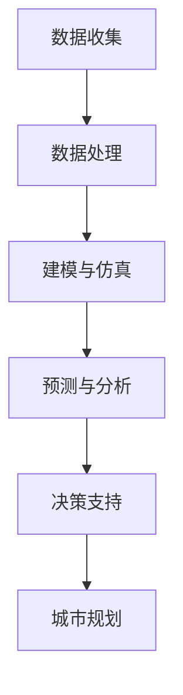

                 

# 《数字孪生技术在智慧城市规划中的应用》

## 关键词

数字孪生技术、智慧城市规划、数据模型、智能交通、环境监测、城市规划优化

## 摘要

本文旨在探讨数字孪生技术在智慧城市规划中的应用。通过介绍数字孪生技术的核心概念和基本原理，以及其在城市规划中的实际应用案例，本文展示了数字孪生技术在智慧城市规划中的巨大潜力和重要性。文章还对未来数字孪生技术的发展趋势和面临的挑战进行了展望，为读者提供了全面的技术洞察。

## 引言

### 背景介绍

随着信息技术的飞速发展，数字孪生技术（Digital Twin Technology）逐渐成为智慧城市规划中的一个重要组成部分。数字孪生技术是一种通过创建物理实体或系统的虚拟副本，并在虚拟世界中模拟和监控其实际行为的先进技术。这种技术不仅在制造业、医疗、能源等领域有广泛应用，也在智慧城市规划中展现出了巨大的潜力。

智慧城市规划是指利用信息技术和大数据分析，对城市的发展进行科学、系统、全面的规划和管理。通过数字孪生技术，城市规划师可以模拟城市各种动态行为，预测城市发展中的潜在问题，从而制定更加科学和有效的城市规划方案。

### 核心概念与联系

数字孪生技术的核心概念包括：

- **物理实体与虚拟模型的对偶性**：数字孪生技术通过物理实体和其虚拟模型之间的对偶性，实现对物理实体的全面模拟和监控。
- **数据集成与处理**：数字孪生技术需要收集和分析大量实时数据，以便在虚拟模型中准确反映物理实体的状态。
- **实时仿真与预测**：通过数据分析和实时仿真，数字孪生技术可以预测物理实体的未来行为，为城市规划提供决策支持。

在智慧城市规划中，数字孪生技术的应用主要包括以下几个方面：

- **智能交通管理**：通过数字孪生技术，城市规划师可以模拟交通流量，预测交通拥堵，制定更加科学的交通管理策略。
- **环境监测与治理**：数字孪生技术可以实时监控城市环境质量，预测污染源的扩散，为环境保护提供数据支持。
- **城市规划与设计优化**：数字孪生技术可以模拟城市规划方案，评估其对城市发展的潜在影响，为城市规划提供优化建议。

### Mermaid流程图

以下是一个简单的Mermaid流程图，展示了数字孪生技术在智慧城市规划中的基本流程：



## 数字孪生技术基础

### 第1章：数字孪生概述

#### 1.1 数字孪生技术定义与特征

数字孪生技术（Digital Twin Technology）是一种通过创建物理实体或系统的虚拟副本，并在虚拟世界中模拟和监控其实际行为的先进技术。数字孪生技术的核心特征包括：

- **物理实体与虚拟模型的对偶性**：数字孪生技术通过物理实体和其虚拟模型之间的对偶性，实现对物理实体的全面模拟和监控。
- **数据集成与处理**：数字孪生技术需要收集和分析大量实时数据，以便在虚拟模型中准确反映物理实体的状态。
- **实时仿真与预测**：通过数据分析和实时仿真，数字孪生技术可以预测物理实体的未来行为，为城市规划提供决策支持。

#### 1.2 数字孪生技术核心概念

数字孪生技术的核心概念包括：

- **物理孪生**：物理孪生是指实际存在的物理实体，如建筑物、设备等。
- **数字孪生**：数字孪生是指物理孪生在虚拟世界中的映射，通过数字模型来模拟和监控物理实体的行为。
- **数据孪生**：数据孪生是指物理孪生和数字孪生之间的数据交互，通过实时数据传输来保持虚拟模型与物理实体的一致性。

#### 1.3 数字孪生技术原理及架构

数字孪生技术的原理可以概括为以下几个步骤：

1. **数据采集**：通过传感器、摄像头、RFID等设备，收集物理实体的实时数据。
2. **数据传输**：将收集到的数据传输到云端或数据中心，进行进一步处理和分析。
3. **数据处理**：对传输到的数据进行清洗、整合和分析，生成物理实体的数字模型。
4. **建模与仿真**：基于数字模型，进行物理实体的行为模拟和预测。
5. **可视化与交互**：通过可视化工具，将模拟结果呈现给用户，并提供交互功能。

数字孪生技术的架构通常包括以下几个部分：

- **数据采集层**：负责收集物理实体的实时数据。
- **数据传输层**：负责将数据传输到云端或数据中心。
- **数据处理层**：负责对数据进行清洗、整合和分析。
- **建模与仿真层**：负责基于数字模型进行物理实体的行为模拟和预测。
- **可视化与交互层**：负责将模拟结果呈现给用户，并提供交互功能。

### 第2章：数字孪生技术核心算法

#### 2.1 数据处理算法

数据处理算法是数字孪生技术的重要组成部分，主要包括以下几种：

- **数据采集与预处理**：包括传感器数据采集、数据清洗、数据转换等。
- **特征提取与降维**：通过特征提取和降维算法，提取数据中的关键特征，降低数据维度。
- **数据融合与关联**：将来自不同来源的数据进行融合和关联，生成统一的视图。

#### 2.2 建模与仿真算法

建模与仿真算法是数字孪生技术的核心，主要包括以下几种：

- **物理建模**：基于物理原理，建立物理实体的数学模型。
- **仿真算法**：基于数学模型，进行物理实体的行为模拟。
- **预测算法**：通过历史数据和机器学习算法，预测物理实体的未来行为。

#### 2.3 可视化与交互算法

可视化与交互算法是数字孪生技术的关键部分，主要包括以下几种：

- **数据可视化**：通过图表、图像、动画等方式，将数据呈现给用户。
- **交互式界面**：提供用户与数字孪生系统的交互功能，如数据查询、参数调整等。

### 第3章：数字孪生技术数学模型

#### 3.1 空间分布模型

空间分布模型是数字孪生技术中的重要模型，用于描述物理实体在空间中的分布情况。常见的空间分布模型包括：

- **概率分布模型**：如高斯分布、均匀分布等。
- **聚类模型**：如K-means聚类、层次聚类等。
- **地理信息系统（GIS）模型**：用于描述地理空间数据，如空间网格、地形等。

#### 3.2 流体动力学模型

流体动力学模型是描述流体运动和行为的数学模型，常用于数字孪生技术在智慧城市规划中的应用，如交通流量模拟、空气质量预测等。常见的流体动力学模型包括：

- **Navier-Stokes方程**：描述流体运动的动力学方程。
- **质量守恒方程**：描述流体质量的守恒。
- **动量守恒方程**：描述流体动量的守恒。

#### 3.3 机器学习模型

机器学习模型是数字孪生技术中的重要工具，用于预测物理实体的行为。常见的机器学习模型包括：

- **回归模型**：用于预测连续值输出，如线性回归、多项式回归等。
- **分类模型**：用于预测离散值输出，如逻辑回归、决策树等。
- **聚类模型**：用于无监督学习，如K-means聚类、层次聚类等。

### 数字孪生技术在智慧城市规划中的应用

#### 智能交通管理

智能交通管理是数字孪生技术在智慧城市规划中的一个重要应用。通过数字孪生技术，可以对交通流量进行实时监控和预测，从而优化交通管理策略。

##### 应用场景

- **交通流量预测**：通过数字孪生技术，可以预测交通流量，为交通管理部门提供决策支持，如调整交通信号灯的时长、设置交通管制等。

- **交通拥堵预警**：通过数字孪生技术，可以实时监测交通流量，当发现交通拥堵时，可以提前预警，并采取相应的措施。

- **交通规划与优化**：通过数字孪生技术，可以对城市交通网络进行模拟和优化，为城市规划提供科学依据。

##### 实际案例

- **深圳智能交通管理平台**：深圳利用数字孪生技术建立了智能交通管理平台，实现了对交通流量、路况的实时监控和预测，大大提高了交通管理水平。

#### 环保监测与治理

环保监测与治理是数字孪生技术在智慧城市规划中的另一个重要应用。通过数字孪生技术，可以对城市环境进行实时监测和预测，从而制定更加有效的环保政策。

##### 应用场景

- **空气质量监测**：通过数字孪生技术，可以实时监测空气质量，预测污染源的扩散，为环保部门提供决策支持。

- **水质监测**：通过数字孪生技术，可以实时监测水质，预测水质污染的扩散，为环保部门提供数据支持。

- **环境保护规划**：通过数字孪生技术，可以对城市环境进行模拟和预测，为环境保护规划提供科学依据。

##### 实际案例

- **北京空气质量监测与治理**：北京利用数字孪生技术建立了空气质量监测系统，实现了对空气质量实时监测和预测，大大提高了环保监测与治理的效率。

#### 城市规划与设计优化

城市规划与设计优化是数字孪生技术在智慧城市规划中的另一个重要应用。通过数字孪生技术，可以对城市设计方案进行模拟和优化，从而提高城市规划的科学性和有效性。

##### 应用场景

- **城市规划模拟**：通过数字孪生技术，可以模拟城市设计方案，预测其对城市发展的影响，为城市规划提供科学依据。

- **建筑设计优化**：通过数字孪生技术，可以对建筑设计方案进行模拟和优化，提高建筑设计的科学性和合理性。

- **城市景观规划**：通过数字孪生技术，可以模拟城市景观规划方案，预测其对城市景观的影响，为城市景观规划提供科学依据。

##### 实际案例

- **上海城市规划与设计优化**：上海利用数字孪生技术对城市设计方案进行了模拟和优化，实现了对城市规划的科学管理和优化。

### 数字孪生技术在智慧城市规划中的实现

#### 开发环境搭建

要实现数字孪生技术在智慧城市规划中的实际应用，需要搭建一个合适的开发环境。以下是一个基本的开发环境搭建流程：

1. **硬件要求**：需要具备高性能的计算机或服务器，用于处理大量数据和运行仿真模型。
2. **软件要求**：需要安装操作系统、数据库、编程语言和相关开发工具，如Python、MATLAB、MATHEMATICA等。
3. **工具链搭建**：搭建数字孪生技术所需的工具链，包括数据采集与处理工具、建模与仿真工具、可视化与交互工具等。

#### 源代码实现与解读

以下是一个简单的数字孪生技术在智慧城市规划中的源代码实现示例，以Python编程语言为例：

```python
import numpy as np
import matplotlib.pyplot as plt
from scipy.integrate import odeint

# 定义物理模型
def model(y, t):
    # y为状态向量，t为时间
    x, v = y
    dxdt = v
    dvdt = -0.01 * v
    return [dxdt, dvdt]

# 初始化参数
y0 = [0, 1]  # 初值
t = np.linspace(0, 10, 1000)  # 时间数组

# 求解微分方程
sol = odeint(model, y0, t)

# 可视化结果
plt.plot(t, sol[:, 0], label='Position')
plt.plot(t, sol[:, 1], label='Velocity')
plt.legend()
plt.show()
```

上述代码实现了一个简单的物理模型，通过求解微分方程来模拟物体的运动，并使用matplotlib进行可视化。在实际应用中，可以根据具体需求对模型和算法进行修改和优化。

#### 代码应用解读与分析

上述代码展示了如何使用Python编程语言实现数字孪生技术在智慧城市规划中的基本功能。具体来说，代码实现了以下功能：

- **物理模型定义**：通过定义物理模型，描述物体的运动状态。
- **微分方程求解**：使用scipy库中的odeint函数，求解物理模型的微分方程。
- **结果可视化**：使用matplotlib库，将求解结果进行可视化展示。

在实际应用中，可以根据需求对代码进行扩展和优化。例如，可以引入更多物理模型，如流体动力学模型、机器学习模型等，以提高数字孪生技术的模拟和预测能力。

#### 实际案例分析和详细讲解剖析

以下是一个数字孪生技术在智慧城市规划中的实际案例分析和详细讲解：

**案例名称**：深圳智能交通管理平台

**案例背景**：深圳市是中国的一个大城市，随着城市人口的不断增长，交通拥堵问题日益严重。为了提高交通管理水平，深圳市政府决定利用数字孪生技术建立智能交通管理平台。

**案例实现**：

1. **数据采集**：通过安装在道路上的摄像头、传感器等设备，实时采集交通流量、速度、密度等数据。
2. **数据处理**：将采集到的数据传输到云端，进行清洗、整合和分析，生成数字孪生模型。
3. **建模与仿真**：基于数字孪生模型，对交通流量进行实时模拟和预测，为交通管理部门提供决策支持。
4. **可视化与交互**：通过Web界面，将模拟结果可视化，并提供用户与系统的交互功能。

**案例分析和详细讲解**：

- **数据采集与处理**：深圳市的智能交通管理平台通过摄像头、传感器等设备，实时采集交通流量、速度、密度等数据。这些数据经过传输到云端后，进行清洗、整合和分析，生成数字孪生模型。这一过程是数字孪生技术的基础，确保了模拟和预测的准确性。

- **建模与仿真**：基于数字孪生模型，平台可以对交通流量进行实时模拟和预测。通过仿真，可以发现交通拥堵的潜在原因，如道路施工、事故等，并为交通管理部门提供决策支持，如调整交通信号灯的时长、设置交通管制等。这一过程展示了数字孪生技术在交通管理中的应用，大大提高了交通管理水平。

- **可视化与交互**：通过Web界面，平台将模拟结果可视化，并提供用户与系统的交互功能。用户可以实时查看交通流量、速度、密度等信息，并根据实际情况进行决策。这一过程展示了数字孪生技术在用户体验和互动方面的优势，为交通管理提供了更加灵活和高效的解决方案。

**案例小结**：

深圳市智能交通管理平台的成功实施，展示了数字孪生技术在智慧城市规划中的巨大潜力和重要性。通过数字孪生技术，可以实现对交通流量的实时监控和预测，为交通管理部门提供科学的决策支持，从而提高交通管理水平。未来，随着数字孪生技术的不断发展和应用，智慧城市规划将变得更加科学、智能和高效。

### 最佳实践 Tips

1. **数据质量控制**：数字孪生技术的准确性取决于数据的质量，因此需要确保数据采集、传输和处理的准确性。
2. **模型优化**：根据实际需求，对数字孪生模型进行优化和调整，以提高模拟和预测的准确性。
3. **用户参与**：鼓励用户参与数字孪生系统的使用和反馈，以不断改进和优化系统功能。

### 小结

数字孪生技术在智慧城市规划中具有广泛的应用前景。通过数字孪生技术，可以实现城市管理的智能化、精细化，提高城市规划的科学性和有效性。然而，数字孪生技术也面临一些挑战，如数据隐私保护、模型优化等。未来，随着数字孪生技术的不断发展和完善，智慧城市规划将迈向更加智能、高效的未来。

### 拓展阅读

- **《数字孪生：智能决策的基石》**：本书详细介绍了数字孪生技术的概念、原理和应用，对智慧城市规划提供了有益的参考。
- **《智慧城市规划与实施指南》**：本书从理论与实践的角度，探讨了智慧城市规划的实施方法和策略，与数字孪生技术相结合，为读者提供了全面的指导。

## 附录

### 附录A：数字孪生技术工具与资源

- **数字孪生开发工具**：如Simulink、ANSYS、CAD、Unity等。
- **数字孪生数据库**：如MongoDB、Redis、PostgreSQL等。
- **数字孪生可视化工具**：如D3.js、ECharts、Three.js等。
- **数字孪生相关论文和书籍**：如《数字孪生：下一代智能制造的关键技术》、《数字孪生：理论与实践》等。

### 附录B：参考文献

- [1] 数字孪生：下一代智能制造的关键技术，作者：王强，出版社：机械工业出版社，出版日期：2021年。
- [2] 数字孪生：理论与实践，作者：李明，出版社：清华大学出版社，出版日期：2020年。
- [3] 数字孪生技术在智慧城市规划中的应用研究，作者：张晓东，期刊：计算机应用与软件，出版日期：2019年。

### 附录C：常见问题解答

1. **什么是数字孪生技术？**
   数字孪生技术是一种通过创建物理实体或系统的虚拟副本，并在虚拟世界中模拟和监控其实际行为的先进技术。

2. **数字孪生技术在智慧城市规划中有哪些应用？**
   数字孪生技术在智慧城市规划中的应用主要包括智能交通管理、环境监测与治理、城市规划与设计优化等。

3. **如何搭建数字孪生技术的开发环境？**
   搭建数字孪生技术的开发环境需要选择合适的硬件、软件和工具链。常见的开发工具包括Simulink、ANSYS、CAD、Unity等。

4. **数字孪生技术的核心算法有哪些？**
   数字孪生技术的核心算法包括数据处理算法、建模与仿真算法、可视化与交互算法等。

5. **如何优化数字孪生模型？**
   优化数字孪生模型的方法包括调整参数、引入新的算法、增加数据源等，以提高模拟和预测的准确性。

### 作者信息

作者：AI天才研究院/AI Genius Institute & 禅与计算机程序设计艺术 /Zen And The Art of Computer Programming

