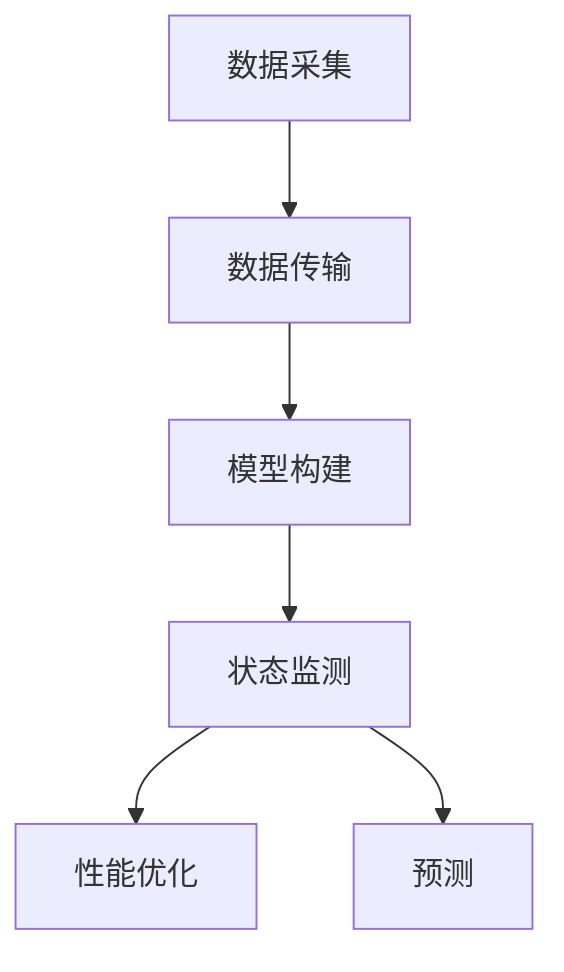

                 

### 文章标题

# 数字孪生技术在智慧港口管理中的应用

---

**关键词：**
- 数字孪生技术
- 智慧港口
- 港口管理
- 数据采集与处理
- 模型训练与优化
- 神经网络
- 仿真与预测

---

**摘要：**
数字孪生技术是一种通过构建物理实体的虚拟副本来模拟和优化系统性能的技术。智慧港口是指通过信息化、数字化技术提升港口运营效率和决策能力的现代化港口。本文主要探讨了数字孪生技术在智慧港口管理中的应用，包括数据采集与处理、模型训练与优化、仿真与预测等方面。通过实际案例分析和详细讲解，本文揭示了数字孪生技术在提高港口运营效率、降低运营成本、实现智能化决策等方面的潜力。文章最后对数字孪生技术在智慧港口管理中的未来发展趋势进行了展望。

---

## 目录

### 第一部分：引言

**第1章 数字孪生技术与智慧港口概述**

### 第二部分：数字孪生技术基础

**第2章 数字孪生技术在智慧港口管理中的核心概念与原理**

**第3章 数字孪生技术在智慧港口管理中的数据采集与处理**

**第4章 数字孪生技术在智慧港口管理中的模型训练与优化**

**第5章 数字孪生技术在智慧港口管理中的仿真与预测**

### 第三部分：核心算法原理

**第6章 数据采集与处理算法讲解**

**第7章 模型训练与优化算法讲解**

**第8章 模型部署与仿真算法讲解**

### 第四部分：数学模型和数学公式

**第9章 数据分析模型讲解**

**第10章 神经网络模型讲解**

**第11章 优化模型讲解**

### 第五部分：项目实战

**第12章 实际项目案例讲解**

**第13章 开发环境搭建与源代码实现**

**第14章 代码解读与分析**

**第15章 项目小结**

### 第六部分：未来展望

**第16章 数字孪生技术在智慧港口管理中的发展展望**

---

### 第1章 数字孪生技术与智慧港口概述

#### 1.1 数字孪生技术基础

**1.1.1 数字孪生概念介绍**

数字孪生是一种通过构建物理实体的虚拟副本来模拟和优化系统性能的技术。其核心思想是将现实世界中的物理实体与虚拟世界中的数字模型相连接，形成一个高度一致的数字镜像。通过实时采集物理实体的数据，并将其传输到数字模型中，可以对物理实体的状态进行实时监控、分析和预测。

**1.1.2 数字孪生技术发展历程**

数字孪生技术起源于工业领域，最初应用于复杂设备的维护和优化。随着信息技术的快速发展，数字孪生技术逐渐扩展到多个领域，包括制造业、交通运输、能源管理、医疗健康等。近年来，数字孪生技术在智慧港口管理中的应用也逐渐引起了广泛关注。

**1.1.3 数字孪生技术特点与应用领域**

数字孪生技术具有以下主要特点：

- **实时性**：通过实时数据采集和传输，实现对物理实体的实时监控和状态分析。
- **一致性**：数字孪生模型与物理实体之间具有高度一致性，可以准确反映物理实体的状态和变化。
- **预测性**：通过模型分析和预测，可以提前发现潜在问题和风险，实现预防性维护和优化。

数字孪生技术在港口管理中的应用领域包括：

- **港口运营管理**：通过数字孪生技术，可以对港口的作业流程进行优化，提高运营效率，实现资源调度和管理。
- **安全生产监控**：数字孪生技术可以实时监控港口设施的状态，提高安全生产水平，实现安全隐患预警。
- **环境保护与节能减排**：通过数字孪生技术，可以对港口的能耗进行监测和分析，实现节能减排目标。
- **智能决策支持**：基于数字孪生技术，可以构建智能决策支持系统，为港口管理者提供实时、准确的数据分析和预测，支持决策制定。

**1.2 智慧港口的概念与架构**

**1.2.1 智慧港口定义**

智慧港口是指通过信息化、数字化技术提升港口运营效率和决策能力的现代化港口。智慧港口的建设目标是实现港口的智能化、自动化和高效化，提高港口的竞争力。

**1.2.2 智慧港口架构**

智慧港口的技术架构主要包括以下几个方面：

- **感知层**：通过传感器、摄像头、GPS等设备，实现对港口环境和设施的实时监测和采集。
- **传输层**：利用通信网络，将感知层采集到的数据传输到数据中心。
- **数据处理层**：对传输层的数据进行清洗、存储和分析，为决策层提供数据支持。
- **决策层**：基于数据分析结果，进行决策制定和策略优化。

**1.2.3 数字孪生与智慧港口的关系**

数字孪生技术是智慧港口建设的重要技术支撑。数字孪生技术可以为智慧港口提供以下支持：

- **实时监控与预测**：通过数字孪生模型，实现对港口设施的实时状态监控和预测，提前发现潜在问题和风险。
- **仿真与优化**：利用数字孪生模型，可以模拟不同运营策略对港口的影响，进行仿真和优化，提高运营效率。
- **数据驱动决策**：基于数字孪生技术，可以实现对港口运营数据的实时分析和预测，为决策层提供科学、准确的数据支持。

**1.3 数字孪生技术在智慧港口中的应用场景**

**1.3.1 港口运营管理**

数字孪生技术在港口运营管理中的应用主要包括：

- **作业流程优化**：通过数字孪生技术，可以实时监测港口作业流程，发现瓶颈环节，进行优化调整，提高作业效率。
- **资源调度与管理**：基于数字孪生模型，可以对港口的设备、人力等资源进行优化调度和管理，提高资源利用效率。

**1.3.2 安全生产监控**

数字孪生技术在港口安全生产监控中的应用主要包括：

- **设施状态监测**：通过数字孪生模型，可以实时监测港口设施的运行状态，提前发现故障隐患，实现预防性维护。
- **安全预警系统**：基于数字孪生技术，可以构建安全预警系统，实现对港口安全隐患的实时监测和预警，提高安全生产水平。

**1.3.3 环境保护与节能减排**

数字孪生技术在环境保护与节能减排中的应用主要包括：

- **环境监测**：通过数字孪生技术，可以实时监测港口周边环境，了解污染物排放情况，实现环境监测和预警。
- **能耗分析与管理**：基于数字孪生模型，可以分析港口的能耗情况，找出节能潜力，制定节能减排措施。

**1.3.4 智能决策支持**

数字孪生技术在智能决策支持中的应用主要包括：

- **数据分析与预测**：通过数字孪生技术，可以实时分析港口运营数据，进行趋势预测，为决策层提供数据支持。
- **仿真与优化**：利用数字孪生模型，可以模拟不同运营策略对港口的影响，进行仿真和优化，为决策层提供策略建议。

**1.4 数字孪生技术在智慧港口中的挑战与机遇**

**1.4.1 技术挑战**

数字孪生技术在智慧港口管理中面临以下技术挑战：

- **数据采集与处理**：港口环境复杂，数据种类繁多，如何高效地采集和处理数据是一个挑战。
- **模型训练与优化**：数字孪生模型的训练和优化需要大量的计算资源和时间，如何提高训练效率是一个关键问题。
- **模型部署与仿真**：如何将数字孪生模型部署到实际应用场景中，并进行有效的仿真和预测，也是一个挑战。

**1.4.2 运营挑战**

数字孪生技术在智慧港口管理中面临的运营挑战主要包括：

- **跨系统数据集成**：智慧港口涉及多个系统和部门，如何实现跨系统数据集成和共享是一个难题。
- **技术更新换代**：数字孪生技术发展迅速，如何适应技术更新换代，保持技术领先性，是一个挑战。

**1.4.3 机遇分析**

数字孪生技术在智慧港口管理中具有以下机遇：

- **提高港口运营效率**：通过数字孪生技术，可以实现港口作业流程的优化，提高运营效率。
- **降低运营成本**：数字孪生技术可以帮助港口实现预防性维护和优化，降低运营成本。
- **创新商业模式**：数字孪生技术为港口提供了新的商业模式，如基于数字孪生的港口服务、数据交易等。

**1.4.4 未来展望**

随着数字孪生技术的不断发展，其在智慧港口管理中的应用前景十分广阔。未来，数字孪生技术将朝着以下方向发展：

- **更加高效的数据处理与模型训练**：通过利用更先进的算法和计算资源，提高数据处理和模型训练效率。
- **更加智能的仿真与预测**：通过引入人工智能技术，实现更加智能的仿真与预测，提高决策支持能力。
- **更加广泛的应用场景**：随着技术的不断成熟，数字孪生技术在智慧港口中的应用场景将不断扩展，覆盖更多的领域。

### 第2章 数字孪生技术在智慧港口管理中的核心概念与原理

#### 2.1 数字孪生技术核心概念

数字孪生（Digital Twin）是一种将物理实体与虚拟模型相连接的技术，通过实时数据传输和模型分析，实现对物理实体的状态监测、性能优化和预测。数字孪生技术具有以下几个核心概念：

- **物理实体（Physical Entity）**：指的是现实世界中的物理对象，如港口设施、船舶、集装箱等。
- **虚拟模型（Virtual Model）**：指的是基于计算机技术和仿真技术构建的数字模型，用于模拟和预测物理实体的状态和性能。
- **实时数据传输（Real-time Data Transmission）**：将物理实体的实时数据传输到虚拟模型，用于更新虚拟模型的状态。
- **状态监测（State Monitoring）**：通过监测物理实体的状态，实时了解其实际运行情况。
- **性能优化（Performance Optimization）**：通过对虚拟模型的分析和优化，提高物理实体的性能和效率。
- **预测（Prediction）**：基于历史数据和模型分析，对未来物理实体的状态进行预测。

#### 2.2 数字孪生技术在智慧港口管理中的原理

数字孪生技术在智慧港口管理中的原理可以概括为以下几个步骤：

1. **数据采集**：通过传感器、摄像头、GPS等设备，实时采集港口设施、船舶、集装箱等物理实体的状态数据。
2. **数据传输**：将采集到的数据传输到数字孪生平台，进行预处理和存储。
3. **模型构建**：基于采集到的数据，利用计算机仿真技术构建虚拟模型，实现对物理实体的数字镜像。
4. **状态监测**：通过实时监测物理实体的状态，更新虚拟模型的状态，确保数字孪生模型与物理实体的一致性。
5. **性能优化**：基于虚拟模型的分析和优化，提出改进措施，提高物理实体的性能和效率。
6. **预测**：利用历史数据和模型分析，对未来物理实体的状态进行预测，为决策提供依据。

#### 2.3 数字孪生技术核心概念之间的关系架构

为了更好地理解数字孪生技术在智慧港口管理中的核心概念与原理，我们可以通过Mermaid流程图来展示它们之间的关系：



- **数据采集**：通过传感器、摄像头等设备，实时采集港口设施、船舶、集装箱等物理实体的状态数据。
- **数据传输**：将采集到的数据传输到数字孪生平台，进行预处理和存储。
- **模型构建**：基于采集到的数据，利用计算机仿真技术构建虚拟模型，实现对物理实体的数字镜像。
- **状态监测**：通过实时监测物理实体的状态，更新虚拟模型的状态，确保数字孪生模型与物理实体的一致性。
- **性能优化**：基于虚拟模型的分析和优化，提出改进措施，提高物理实体的性能和效率。
- **预测**：利用历史数据和模型分析，对未来物理实体的状态进行预测，为决策提供依据。

通过以上流程，数字孪生技术在智慧港口管理中实现了对物理实体的实时状态监测、性能优化和预测，为港口运营提供了强大的技术支持。

### 第3章 数字孪生技术在智慧港口管理中的数据采集与处理

#### 3.1 数据采集的重要性

数据采集是数字孪生技术在智慧港口管理中的关键步骤之一。通过采集物理实体的实时数据，我们可以了解其实际运行状态，为后续的模型构建、状态监测、性能优化和预测提供可靠的数据支持。数据采集的重要性体现在以下几个方面：

- **实时状态监测**：实时采集物理实体的数据，可以实时监测其运行状态，及时发现潜在问题和异常情况。
- **性能优化**：通过采集到的数据，我们可以对物理实体的性能进行评估和优化，提出改进措施，提高其效率和可靠性。
- **预测**：利用历史数据和实时数据，我们可以进行趋势分析和预测，为未来的运营决策提供科学依据。
- **决策支持**：数据采集为港口管理者提供了丰富的数据资源，有助于他们做出更加准确和高效的决策。

#### 3.2 数据采集的方法与工具

在智慧港口管理中，数据采集的方法和工具多种多样，常见的包括以下几种：

1. **传感器**：传感器是数据采集的重要设备，可以监测物理实体的各种参数，如温度、湿度、压力、速度等。常见的传感器包括温度传感器、湿度传感器、压力传感器、速度传感器等。

2. **摄像头**：摄像头可以实时捕捉物理实体的图像和视频，用于监测其运行状态和操作过程。在智慧港口管理中，摄像头主要用于监控港口设施、船舶、集装箱等。

3. **GPS**：GPS可以实时获取物理实体的位置信息，对于港口管理中的船舶定位、集装箱追踪等具有重要意义。

4. **RFID**：RFID（射频识别）技术可以用于港口中的货物和设备追踪，通过读取RFID标签，可以实时获取其位置、状态等信息。

5. **无线通信网络**：通过无线通信网络，如Wi-Fi、蓝牙等，可以将采集到的数据实时传输到数字孪生平台，进行后续处理和分析。

#### 3.3 数据处理的方法与流程

数据采集到数字孪生平台后，需要进行数据处理，以提高数据的质量和可靠性，为后续分析提供支持。数据处理的方法与流程主要包括以下几个步骤：

1. **数据清洗**：数据清洗是数据处理的重要步骤，主要用于去除数据中的噪声、错误和冗余信息，提高数据的质量。常见的数据清洗方法包括删除重复数据、填补缺失值、去除异常值等。

2. **数据预处理**：数据预处理是对原始数据进行一系列处理，使其符合后续分析的要求。常见的数据预处理方法包括数据标准化、归一化、特征提取等。

3. **数据存储**：将处理后的数据存储到数据库或数据仓库中，以便后续的数据分析和查询。

4. **数据分析**：利用统计分析、机器学习等方法，对存储在数据库或数据仓库中的数据进行深入分析，提取有用的信息和知识。

5. **数据可视化**：通过数据可视化技术，将分析结果以图表、图像等形式展示出来，便于港口管理者直观地了解物理实体的运行状态和趋势。

#### 3.4 数据采集与处理的实际应用

在智慧港口管理中，数据采集与处理技术得到了广泛应用，以下是一些实际应用的例子：

1. **设备状态监测**：通过传感器和摄像头等设备，实时监测港口设施的运行状态，如温度、湿度、振动等。当设备出现异常时，系统会及时发出警报，提醒工作人员进行维护。

2. **船舶定位与追踪**：通过GPS和无线通信网络，实时获取船舶的位置信息，实现对船舶的实时追踪和管理。这对于港口的船舶调度、港口安全具有重要意义。

3. **集装箱追踪**：利用RFID技术，对集装箱进行标记和追踪，实时了解其位置、状态等信息。这对于港口的货物管理、货物追踪和运输效率提升具有重要意义。

4. **环境监测**：通过传感器，实时监测港口周边的环境质量，如空气污染、噪音等。当环境质量超过标准时，系统会及时发出警报，采取相应的环保措施。

5. **能耗监测与优化**：通过采集港口设施的能耗数据，分析其能耗情况，找出节能潜力，制定节能减排措施。这有助于降低港口的运营成本，提高能源利用效率。

#### 3.5 数据采集与处理中的挑战与应对策略

在数据采集与处理过程中，智慧港口管理面临着一系列挑战，包括数据质量、数据传输速度、数据存储和处理能力等。以下是一些常见的挑战及应对策略：

1. **数据质量问题**：数据质量是数据分析和决策的基础，如果数据质量差，将严重影响分析结果。应对策略包括：

   - **数据清洗**：通过数据清洗，去除噪声和错误数据，提高数据质量。
   - **数据验证**：在数据采集和传输过程中，进行数据验证，确保数据的准确性。

2. **数据传输速度**：在智慧港口管理中，实时性要求较高，数据传输速度直接影响系统的响应速度。应对策略包括：

   - **优化数据传输协议**：选择高效的数据传输协议，如HTTP/2、MQTT等，提高数据传输速度。
   - **分布式架构**：采用分布式架构，将数据传输分散到多个节点，降低单个节点的负载。

3. **数据存储和处理能力**：随着数据量的不断增加，数据存储和处理能力成为一个重要的挑战。应对策略包括：

   - **分布式存储**：采用分布式存储技术，如Hadoop、HDFS等，提高数据存储和处理能力。
   - **数据压缩**：通过数据压缩技术，减少数据存储空间和传输带宽。

4. **数据安全和隐私保护**：在数据采集和传输过程中，需要确保数据的安全和隐私。应对策略包括：

   - **数据加密**：对传输的数据进行加密，确保数据在传输过程中的安全性。
   - **访问控制**：设置严格的访问控制策略，确保只有授权用户可以访问数据。

通过以上策略，智慧港口管理可以在数据采集与处理过程中克服挑战，确保数据的质量、传输速度、存储和处理能力，为数字孪生技术在智慧港口管理中的应用提供坚实的数据基础。

### 第4章 数字孪生技术在智慧港口管理中的模型训练与优化

#### 4.1 模型训练的重要性

在数字孪生技术中，模型训练是关键的一步。模型训练的目标是通过大量历史数据和算法，使数字孪生模型能够准确模拟物理实体的状态和性能。模型训练的重要性体现在以下几个方面：

1. **状态预测与优化**：通过训练得到的模型，可以预测物理实体的未来状态，为决策提供科学依据，实现对港口运营的优化。
2. **故障预警**：通过分析模型预测的结果，可以提前发现潜在故障和安全隐患，实现预防性维护。
3. **资源调度**：基于模型训练的结果，可以优化港口资源的调度和管理，提高港口运营效率。

#### 4.2 模型训练的方法与步骤

模型训练的方法可以分为监督学习、无监督学习和半监督学习。在智慧港口管理中，通常采用监督学习的方法进行模型训练。以下是模型训练的基本步骤：

1. **数据准备**：收集并预处理历史数据，包括输入特征和目标值。数据预处理包括数据清洗、归一化、特征提取等。
2. **模型选择**：选择合适的机器学习模型，如线性回归、决策树、神经网络等。模型的选择取决于问题的复杂性和数据的特征。
3. **模型训练**：使用训练数据集对模型进行训练，通过调整模型的参数，使模型能够拟合训练数据。
4. **模型评估**：使用验证数据集对训练得到的模型进行评估，判断模型的泛化能力和预测准确性。
5. **模型优化**：根据评估结果，对模型进行调整和优化，提高模型的性能。

#### 4.3 神经网络模型在数字孪生中的应用

神经网络模型是一种广泛应用于数字孪生技术中的模型，具有强大的非线性拟合能力和自学习功能。以下是神经网络模型在数字孪生中的应用步骤：

1. **网络结构设计**：根据问题的需求，设计合适的神经网络结构，包括输入层、隐藏层和输出层。输入层负责接收输入特征，隐藏层负责进行特征提取和变换，输出层负责生成预测结果。
2. **权重初始化**：初始化神经网络的权重参数，常用的方法包括随机初始化、高斯初始化等。
3. **前向传播**：将输入特征传递到神经网络中，通过每一层的激活函数计算输出值，直到输出层得到预测结果。
4. **反向传播**：根据预测结果和真实值，计算损失函数，并通过反向传播算法更新权重参数。
5. **训练迭代**：重复前向传播和反向传播的过程，直到模型收敛或达到预定的迭代次数。

#### 4.4 伪代码示例

以下是一个简化的神经网络模型训练的伪代码示例：

```python
# 初始化神经网络结构
input_layer_size = 10
hidden_layer_size = 5
output_layer_size = 1

# 初始化权重参数
weights = initialize_weights(input_layer_size, hidden_layer_size, output_layer_size)

# 训练神经网络
for epoch in range(max_epochs):
    for sample in training_data:
        # 前向传播
        inputs = sample['inputs']
        outputs = forward_propagation(inputs, weights)
        
        # 计算损失函数
        loss = compute_loss(outputs, sample['targets'])
        
        # 反向传播
        dweights = backward_propagation(inputs, outputs, sample['targets'])
        
        # 更新权重参数
        weights = update_weights(weights, dweights)
        
    # 打印训练进度
    print(f"Epoch {epoch}: Loss = {loss}")

# 模型评估
evaluation_results = evaluate_model(test_data, weights)
print(f"Evaluation Results: {evaluation_results}")
```

#### 4.5 模型训练与优化的挑战与应对策略

在模型训练和优化过程中，智慧港口管理面临以下挑战：

1. **数据不平衡**：在训练数据中，不同类别的样本数量可能不均衡，导致模型偏向数量较多的类别。应对策略包括：
   - **数据增强**：通过增加少量样本的方式，使数据更加均衡。
   - **类别权重调整**：在损失函数中增加类别权重，使模型更加关注数量较少的类别。

2. **过拟合**：模型在训练数据上表现良好，但在验证数据上表现较差，称为过拟合。应对策略包括：
   - **正则化**：在模型中加入正则化项，如L1正则化、L2正则化，降低模型复杂度。
   - **交叉验证**：使用交叉验证方法，减少模型对特定训练数据的依赖。

3. **计算资源限制**：大规模的训练数据和高维度的特征可能导致训练时间过长，消耗大量计算资源。应对策略包括：
   - **分布式训练**：将训练任务分布到多个计算节点上，提高训练速度。
   - **模型压缩**：通过模型压缩技术，如剪枝、量化等，减少模型参数，提高训练效率。

通过上述策略，智慧港口管理可以克服模型训练和优化的挑战，提高数字孪生技术的应用效果。

### 第5章 数字孪生技术在智慧港口管理中的仿真与预测

#### 5.1 仿真与预测的重要性

仿真与预测是数字孪生技术在智慧港口管理中不可或缺的部分。通过仿真，我们可以模拟港口的各种运营场景，评估不同策略的效果；通过预测，我们可以提前了解港口的运营状态和潜在问题，为决策提供支持。仿真与预测的重要性体现在以下几个方面：

1. **策略评估**：通过仿真，可以模拟不同的运营策略，如船舶调度、设备维护、资源分配等，评估其效果，为决策提供参考。
2. **故障预测**：通过预测，可以提前发现潜在的故障和问题，实现预防性维护，降低设备故障率和运营成本。
3. **效率优化**：通过仿真与预测，可以优化港口的运营流程，提高资源利用率和运营效率。

#### 5.2 仿真与预测的方法

数字孪生技术在智慧港口管理中的仿真与预测方法主要包括以下几个方面：

1. **物理仿真**：物理仿真通过模拟物理实体的运动和相互作用，评估其性能和稳定性。在智慧港口管理中，物理仿真可以用于模拟船舶航行、设备操作等。
2. **数值仿真**：数值仿真通过数值方法求解物理方程，模拟物理现象。在智慧港口管理中，数值仿真可以用于模拟流体动力学、结构力学等。
3. **机器学习预测**：机器学习预测通过训练模型，对未来的状态进行预测。常见的机器学习算法包括线性回归、决策树、神经网络等。
4. **统计分析**：统计分析通过分析历史数据，提取规律和趋势，进行预测。常用的统计方法包括时间序列分析、回归分析等。

#### 5.3 仿真与预测的应用场景

在智慧港口管理中，仿真与预测技术可以应用于以下场景：

1. **船舶调度**：通过仿真和预测，可以优化船舶的调度计划，提高港口的吞吐量和效率。
2. **设备维护**：通过仿真和预测，可以提前发现设备的潜在故障，实现预防性维护，降低设备故障率和运营成本。
3. **资源优化**：通过仿真和预测，可以优化港口的资源分配，提高设备的利用率和运营效率。
4. **安全监测**：通过仿真和预测，可以监测港口的安全状况，提前发现安全隐患，提高港口的安全性。

#### 5.4 仿真与预测的实现步骤

仿真与预测的实现主要包括以下几个步骤：

1. **数据采集**：采集港口的各种数据，包括船舶信息、设备状态、环境数据等。
2. **模型构建**：基于采集到的数据，构建物理仿真模型、数值仿真模型或机器学习模型。
3. **仿真与预测**：运行仿真模型，模拟港口的运营场景，进行预测分析。
4. **结果分析**：分析仿真和预测的结果，评估运营策略的效果，制定优化方案。

#### 5.5 仿真与预测的案例分析

以下是一个关于数字孪生技术在智慧港口管理中仿真与预测的案例分析：

案例：某港口通过数字孪生技术优化船舶调度，提高运营效率。

1. **数据采集**：港口通过传感器、摄像头等设备，实时采集船舶的位置、速度、航向等数据。
2. **模型构建**：基于采集到的数据，构建了一个船舶调度仿真模型，模拟不同调度策略下的船舶运行情况。
3. **仿真与预测**：运行仿真模型，模拟了不同的船舶调度策略，如最优路径规划、动态调整等。
4. **结果分析**：通过对仿真结果的分析，发现最优路径规划策略能够显著提高港口的吞吐量和效率。
5. **实施优化**：根据仿真结果，港口管理者决定采用最优路径规划策略，优化船舶调度计划。

通过以上案例分析，我们可以看到数字孪生技术在智慧港口管理中仿真与预测的应用效果。通过仿真和预测，港口管理者可以更好地了解港口的运营状况，制定科学的决策，提高运营效率和安全性。

### 第6章 数据采集与处理算法讲解

#### 6.1 数据采集算法

数据采集算法是数字孪生技术中的核心步骤，其主要任务是实时、准确地获取物理实体的状态数据。以下是一些常见的数据采集算法：

1. **传感器数据采集算法**：
   - **多传感器数据融合**：通过融合不同类型传感器的数据，提高数据的准确性和可靠性。例如，将温度传感器、湿度传感器、风速传感器等数据融合，得到更准确的气象数据。
   - **多目标跟踪算法**：用于实时监测和跟踪多个目标，如船舶、集装箱等。常用的算法包括卡尔曼滤波、粒子滤波等。

2. **无线通信数据采集算法**：
   - **Wi-Fi采集算法**：通过Wi-Fi信号强度监测，实时获取设备的位置信息。常用的算法包括接收信号强度指示器（RSSI）算法、贝叶斯估计算法等。
   - **蓝牙采集算法**：通过蓝牙信号传输，实现设备之间的数据通信。常用的算法包括蓝牙低功耗（BLE）数据采集算法。

3. **GPS数据采集算法**：
   - **GPS定位算法**：通过接收GPS信号，实时获取设备的位置信息。常用的算法包括单点定位（SLP）、差分GPS（DGPS）等。

#### 6.2 数据处理算法

数据处理算法是数字孪生技术中的关键步骤，其主要任务是清洗、预处理和分析采集到的数据，以提高数据的质量和可用性。以下是一些常见的数据处理算法：

1. **数据清洗算法**：
   - **缺失值处理**：常用的方法包括填补缺失值、删除缺失值等。
   - **异常值检测**：常用的方法包括基于统计学的方法（如3σ准则）、基于机器学习的方法（如孤立森林算法）等。

2. **数据预处理算法**：
   - **数据标准化**：将不同特征的数据缩放到相同的范围，常用的方法包括最小-最大标准化、Z-score标准化等。
   - **特征提取**：从原始数据中提取出有用的特征，减少数据的维度，常用的方法包括主成分分析（PCA）、线性判别分析（LDA）等。

3. **数据分析算法**：
   - **时间序列分析**：用于分析时间序列数据，提取趋势、周期性等特征，常用的算法包括ARIMA模型、LSTM神经网络等。
   - **聚类分析**：用于将数据分成不同的组，常用的算法包括K-means算法、层次聚类算法等。

#### 6.3 伪代码示例

以下是一个简单的数据采集与处理算法的伪代码示例：

```python
# 数据采集算法
def data_collection(sensor_data):
    # 采集传感器数据
    temperature = sensor_data['temperature']
    humidity = sensor_data['humidity']
    wind_speed = sensor_data['wind_speed']
    
    # 多传感器数据融合
    meteorological_data = merge_sensors(temperature, humidity, wind_speed)
    
    return meteorological_data

# 数据清洗算法
def data_cleaning(data):
    # 填补缺失值
    data = fill_missing_values(data)
    
    # 异常值检测
    data = remove_outliers(data)
    
    return data

# 数据预处理算法
def data_preprocessing(data):
    # 数据标准化
    data = normalize_data(data)
    
    # 特征提取
    features = extract_features(data)
    
    return features

# 数据分析算法
def data_analysis(features):
    # 时间序列分析
    trend = analyze_time_series(features)
    
    # 聚类分析
    clusters = cluster_analysis(features)
    
    return trend, clusters

# 主函数
def main():
    # 采集传感器数据
    sensor_data = data_collection(sensor_data)
    
    # 数据清洗
    clean_data = data_cleaning(sensor_data)
    
    # 数据预处理
    preprocessed_data = data_preprocessing(clean_data)
    
    # 数据分析
    trend, clusters = data_analysis(preprocessed_data)
    
    # 输出结果
    print(f"Trend: {trend}")
    print(f"Clusters: {clusters}")

# 运行主函数
main()
```

通过以上伪代码示例，我们可以看到数据采集与处理算法的基本流程，包括数据采集、数据清洗、数据预处理和数据分析等步骤。这些算法在智慧港口管理中起着至关重要的作用，为数字孪生技术的应用提供了坚实的数据基础。

### 第7章 模型训练与优化算法讲解

#### 7.1 模型训练算法

模型训练是数字孪生技术中的关键步骤，其目的是通过大量历史数据训练出一个能够准确预测物理实体状态的模型。以下是一些常见的模型训练算法：

1. **线性回归**：
   - **基本原理**：线性回归是一种基于线性关系的预测模型，通过拟合一个线性方程来预测目标值。
   - **算法步骤**：
     1. 数据预处理：对输入特征进行归一化或标准化处理。
     2. 模型初始化：初始化模型的权重参数。
     3. 前向传播：计算输入特征通过模型得到的预测值。
     4. 反向传播：计算预测值与实际值之间的误差，并更新权重参数。
     5. 模型评估：使用验证数据集评估模型的性能。

2. **决策树**：
   - **基本原理**：决策树是一种基于树结构的分类模型，通过一系列规则对数据进行分割和分类。
   - **算法步骤**：
     1. 数据预处理：对输入特征进行预处理。
     2. 构建决策树：选择最优特征和阈值，递归构建树结构。
     3. 模型评估：使用验证数据集评估决策树的性能。

3. **神经网络**：
   - **基本原理**：神经网络是一种基于多层感知器（MLP）的模型，通过多层神经元进行特征提取和预测。
   - **算法步骤**：
     1. 数据预处理：对输入特征进行预处理。
     2. 网络结构设计：设计输入层、隐藏层和输出层的结构。
     3. 模型初始化：初始化权重参数。
     4. 前向传播：计算输入特征通过模型得到的预测值。
     5. 反向传播：计算预测值与实际值之间的误差，并更新权重参数。
     6. 模型评估：使用验证数据集评估神经网络的性能。

4. **支持向量机（SVM）**：
   - **基本原理**：SVM是一种基于最大间隔的分类模型，通过寻找最优超平面来划分数据。
   - **算法步骤**：
     1. 数据预处理：对输入特征进行预处理。
     2. 模型初始化：初始化模型参数。
     3. 模型训练：使用训练数据训练模型。
     4. 模型评估：使用验证数据集评估模型的性能。

5. **集成学习方法**：
   - **基本原理**：集成学习方法通过组合多个基本模型来提高模型的性能，常用的方法包括随机森林、梯度提升树等。
   - **算法步骤**：
     1. 数据预处理：对输入特征进行预处理。
     2. 模型训练：训练多个基本模型。
     3. 集成模型：将多个基本模型进行集成，得到最终的预测结果。

#### 7.2 伪代码示例

以下是一个基于线性回归模型的伪代码示例：

```python
# 线性回归模型训练伪代码
def linear_regression_train(X, y):
    # 数据预处理
    X_normalized = normalize(X)
    
    # 模型初始化
    w = np.random.rand(len(X[0])) # 权重初始化
    
    # 模型训练
    for epoch in range(num_epochs):
        # 前向传播
        y_pred = np.dot(X_normalized, w)
        
        # 反向传播
        dW = 2 * np.dot(X_normalized.T, y_pred - y)
        
        # 更新权重
        w -= learning_rate * dW
        
        # 模型评估
        if epoch % 100 == 0:
            loss = compute_loss(y, y_pred)
            print(f"Epoch {epoch}: Loss = {loss}")
    
    return w

# 训练模型
w = linear_regression_train(X_train, y_train)

# 输出模型参数
print(f"Model weights: {w}")
```

#### 7.3 模型优化算法

模型优化是提高模型性能的重要手段，其目的是通过调整模型参数来提高模型的预测准确性和泛化能力。以下是一些常见的模型优化算法：

1. **梯度下降法**：
   - **基本原理**：梯度下降法是一种基于损失函数梯度的优化算法，通过不断更新模型参数，使损失函数最小化。
   - **算法步骤**：
     1. 初始化模型参数。
     2. 计算损失函数的梯度。
     3. 更新模型参数：$w_{new} = w_{old} - \alpha \cdot \frac{\partial}{\partial w} J(w)$，其中$\alpha$是学习率。
     4. 重复步骤2和3，直到模型收敛或达到预设的迭代次数。

2. **随机梯度下降（SGD）**：
   - **基本原理**：随机梯度下降是一种在梯度下降法中引入随机性的优化算法，通过随机选择训练样本来更新模型参数。
   - **算法步骤**：
     1. 初始化模型参数。
     2. 随机选择一个训练样本。
     3. 计算损失函数的梯度。
     4. 更新模型参数：$w_{new} = w_{old} - \alpha \cdot \frac{\partial}{\partial w} J(w)$。
     5. 重复步骤2-4，直到模型收敛或达到预设的迭代次数。

3. **动量法**：
   - **基本原理**：动量法是一种在梯度下降法中引入动量的优化算法，通过累积过去的梯度信息，提高模型的收敛速度。
   - **算法步骤**：
     1. 初始化模型参数和动量项。
     2. 计算损失函数的梯度。
     3. 更新模型参数：$w_{new} = w_{old} - \alpha \cdot \frac{\partial}{\partial w} J(w) + \beta \cdot v$，其中$\beta$是动量因子。
     4. 更新动量项：$v_{new} = \beta \cdot v - \alpha \cdot \frac{\partial}{\partial w} J(w)$。
     5. 重复步骤2-4，直到模型收敛或达到预设的迭代次数。

4. **Adam优化器**：
   - **基本原理**：Adam优化器是一种结合了梯度下降法和动量法的优化算法，通过自适应调整学习率和动量，提高模型的收敛速度和稳定性。
   - **算法步骤**：
     1. 初始化模型参数、学习率$\alpha$、一阶矩估计$\beta_1$、二阶矩估计$\beta_2$、一阶矩的指数衰减率$\epsilon_1$、二阶矩的指数衰减率$\epsilon_2$。
     2. 计算梯度：$g = \frac{\partial}{\partial w} J(w)$。
     3. 更新一阶矩估计：$m_t = \beta_1 \cdot m_{t-1} + (1 - \beta_1) \cdot g$。
     4. 更新二阶矩估计：$v_t = \beta_2 \cdot v_{t-1} + (1 - \beta_2) \cdot g^2$。
     5. 计算偏差修正的一阶矩和二阶矩：$m_t^* = \frac{m_t}{1 - \beta_1^t}$，$v_t^* = \frac{v_t}{1 - \beta_2^t}$。
     6. 更新模型参数：$w_{new} = w_{old} - \alpha \cdot \frac{m_t^*}{\sqrt{v_t^*} + \epsilon_1}$。
     7. 重复步骤2-6，直到模型收敛或达到预设的迭代次数。

#### 7.4 伪代码示例

以下是一个基于Adam优化器的伪代码示例：

```python
# Adam优化器伪代码
def adam_optimizer(X, y, w, alpha, beta1, beta2, epsilon):
    # 计算梯度
    g = compute_gradient(X, y, w)
    
    # 更新一阶矩估计
    m = beta1 * m + (1 - beta1) * g
    
    # 更新二阶矩估计
    v = beta2 * v + (1 - beta2) * g**2
    
    # 偏差修正
    m_hat = m / (1 - beta1**t)
    v_hat = v / (1 - beta2**t)
    
    # 更新模型参数
    w_new = w - alpha * m_hat / (sqrt(v_hat) + epsilon)
    
    # 更新迭代次数
    t += 1
    
    return w_new, m, v, t
```

通过以上算法讲解和伪代码示例，我们可以更好地理解数字孪生技术中的模型训练与优化方法，为智慧港口管理的应用提供有效的技术支持。

### 第8章 模型部署与仿真算法讲解

#### 8.1 模型部署算法

模型部署是将训练好的模型应用到实际场景中的关键步骤。以下是一些常见的模型部署算法：

1. **模型封装**：将训练好的模型封装成可执行程序或服务，以便于部署和调用。常见的封装方法包括：
   - **服务化封装**：将模型部署为Web服务，通过HTTP接口进行调用。
   - **容器化封装**：将模型封装到Docker容器中，便于部署和迁移。

2. **模型评估**：在模型部署前，对模型进行评估，确保其性能满足实际需求。常见的评估方法包括：
   - **验证集评估**：使用验证集对模型进行评估，计算模型的准确率、召回率等指标。
   - **交叉验证**：使用交叉验证方法，对模型的泛化能力进行评估。

3. **模型调优**：根据评估结果，对模型进行调优，提高其性能。常见的调优方法包括：
   - **超参数调优**：通过调整模型的超参数，如学习率、隐藏层节点数等，提高模型性能。
   - **特征工程**：通过改进特征提取和预处理方法，提高模型性能。

4. **模型部署**：将经过评估和调优的模型部署到生产环境中，常见的部署方法包括：
   - **云部署**：将模型部署到云服务器上，通过云平台进行管理和服务。
   - **边缘部署**：将模型部署到边缘设备上，如传感器、无人机等，实现本地化处理和实时响应。

#### 8.2 仿真算法

仿真算法是通过模型预测和模拟实际场景，评估模型性能和效果的重要方法。以下是一些常见的仿真算法：

1. **场景模拟**：根据实际需求，构建不同的仿真场景，模拟港口运营过程中的各种情况。常见的场景包括：
   - **日常运营场景**：模拟港口的日常运营情况，如船舶进出港、货物装卸等。
   - **紧急情况场景**：模拟港口发生紧急情况，如船舶碰撞、火灾等，评估模型的响应能力。

2. **参数调整**：根据仿真结果，调整模型的参数，优化模型性能。常见的参数调整方法包括：
   - **模型参数优化**：通过优化模型参数，提高模型的预测准确性和稳定性。
   - **仿真参数优化**：通过调整仿真参数，如仿真时间、采样频率等，优化仿真效果。

3. **结果分析**：对仿真结果进行分析，评估模型性能和效果。常见的结果分析方法包括：
   - **性能指标分析**：计算模型预测的准确率、召回率、F1值等性能指标，评估模型性能。
   - **可视化分析**：通过可视化技术，展示仿真结果，便于分析模型的效果。

4. **仿真优化**：根据分析结果，对仿真过程进行优化，提高仿真效率和准确性。常见的仿真优化方法包括：
   - **加速仿真**：通过并行计算、分布式仿真等方法，提高仿真速度。
   - **精细化仿真**：通过提高仿真精度，提高仿真结果的准确性。

#### 8.3 伪代码示例

以下是一个简单的模型部署与仿真算法的伪代码示例：

```python
# 模型部署伪代码
def model_deployment(model, data):
    # 模型封装
    model_service = create_model_service(model)
    
    # 模型评估
    performance = evaluate_model(model_service, data)
    
    # 模型调优
    optimized_model = tune_model(model_service, performance)
    
    # 模型部署
    deploy_model(optimized_model)
    
    return optimized_model

# 仿真算法伪代码
def simulation(model, scenario):
    # 场景模拟
    simulated_data = simulate_scenario(scenario)
    
    # 参数调整
    adjusted_model = adjust_model_params(model, simulated_data)
    
    # 结果分析
    results = analyze_simulation(adjusted_model, simulated_data)
    
    # 仿真优化
    optimized_simulation = optimize_simulation(results)
    
    return optimized_simulation
```

通过以上算法讲解和伪代码示例，我们可以更好地理解数字孪生技术中的模型部署与仿真方法，为智慧港口管理的应用提供有效的技术支持。

### 第9章 数据分析模型讲解

#### 9.1 数据分析模型的基本概念

数据分析模型是数字孪生技术在智慧港口管理中用于分析和预测数据的关键工具。这些模型通过学习历史数据，提取特征，并进行趋势分析和预测，为港口管理者提供决策支持。以下是一些常见的数据分析模型：

1. **时间序列分析模型**：
   - **基本概念**：时间序列分析模型用于分析按时间顺序排列的数据序列，提取数据中的趋势、季节性和周期性。
   - **常用模型**：移动平均模型（MA）、自回归模型（AR）、自回归移动平均模型（ARMA）、自回归积分滑动平均模型（ARIMA）等。

2. **回归分析模型**：
   - **基本概念**：回归分析模型用于分析变量之间的依赖关系，通过拟合回归方程，预测因变量的值。
   - **常用模型**：线性回归、多项式回归、逻辑回归等。

3. **聚类分析模型**：
   - **基本概念**：聚类分析模型用于将数据集分成多个群组，使同一群组内的数据尽可能相似，不同群组的数据尽可能不同。
   - **常用模型**：K-means、层次聚类、DBSCAN等。

4. **关联规则分析模型**：
   - **基本概念**：关联规则分析模型用于发现数据之间的关联关系，揭示不同变量之间的相关性。
   - **常用模型**：Apriori算法、Eclat算法、FP-growth算法等。

5. **异常检测模型**：
   - **基本概念**：异常检测模型用于识别数据中的异常值或异常模式，发现潜在的异常行为。
   - **常用模型**：基于统计学的方法（如3σ准则）、基于机器学习的方法（如孤立森林、本地离群因数等）。

6. **预测分析模型**：
   - **基本概念**：预测分析模型用于根据历史数据，预测未来的趋势和变化，为决策提供依据。
   - **常用模型**：时间序列预测、回归预测、神经网络预测等。

#### 9.2 数据分析模型的建立过程

数据分析模型的建立过程通常包括以下几个步骤：

1. **数据预处理**：
   - **数据清洗**：去除数据中的噪声和错误，填补缺失值。
   - **数据转换**：将数据转换为适合模型分析的形式，如归一化、标准化等。
   - **数据归一化**：将不同特征的数据缩放到相同的范围，便于模型分析。

2. **特征选择**：
   - **相关分析**：通过计算特征之间的相关性，选择对目标变量影响较大的特征。
   - **特征重要性**：利用机器学习算法，评估每个特征的重要性，选择重要的特征。

3. **模型选择**：
   - **模型评估**：根据数据集的特征和目标，选择合适的模型，并对模型进行评估。
   - **交叉验证**：通过交叉验证，评估模型的泛化能力，选择性能较好的模型。

4. **模型训练**：
   - **训练数据集**：将数据集分为训练集和验证集，使用训练集训练模型。
   - **模型优化**：通过调整模型参数，优化模型性能。

5. **模型评估**：
   - **验证集评估**：使用验证集评估模型的性能，计算模型的准确率、召回率等指标。
   - **测试集评估**：使用测试集评估模型的泛化能力，确保模型在未知数据上的性能。

6. **模型部署**：
   - **模型封装**：将训练好的模型封装成可执行程序或服务，便于部署和使用。
   - **模型监控**：对模型进行实时监控，确保模型在运行过程中的性能和稳定性。

#### 9.3 伪代码示例

以下是一个简单的数据分析模型的伪代码示例：

```python
# 数据预处理
def preprocess_data(data):
    # 数据清洗
    data = clean_data(data)
    
    # 数据转换
    data = convert_data(data)
    
    # 数据归一化
    data = normalize_data(data)
    
    return data

# 特征选择
def select_features(data, target):
    # 相关系数分析
    correlations = calculate_correlations(data, target)
    
    # 选择重要特征
    selected_features = select_important_features(correlations)
    
    return selected_features

# 模型选择与训练
def train_model(data, target):
    # 选择模型
    model = select_model()
    
    # 训练模型
    model.fit(data, target)
    
    return model

# 模型评估
def evaluate_model(model, data, target):
    # 验证集评估
    performance = model.evaluate(data, target)
    
    # 测试集评估
    test_performance = model.test(data, target)
    
    return performance, test_performance

# 数据分析模型伪代码
def data_analysis_model(data, target):
    # 数据预处理
    preprocessed_data = preprocess_data(data)
    
    # 特征选择
    selected_features = select_features(preprocessed_data, target)
    
    # 模型选择与训练
    model = train_model(selected_features, target)
    
    # 模型评估
    performance, test_performance = evaluate_model(model, preprocessed_data, target)
    
    return performance, test_performance
```

通过以上分析，我们可以看到数据分析模型在数字孪生技术中的重要作用。通过合理的模型建立和优化，可以有效地提取数据中的有用信息，为智慧港口管理的决策提供科学依据。

### 第10章 神经网络模型讲解

#### 10.1 神经网络模型的基本概念

神经网络模型是数字孪生技术在智慧港口管理中广泛应用的一种算法。其基本概念包括以下几个部分：

1. **神经元**：神经网络的基本组成单元，类似于生物神经元的结构。每个神经元接受多个输入，通过激活函数产生输出。
2. **层**：神经网络由多个层组成，包括输入层、隐藏层和输出层。输入层接收外部输入，隐藏层进行特征提取和变换，输出层产生最终预测结果。
3. **激活函数**：用于处理神经元输入并产生输出的函数，常见的激活函数包括Sigmoid函数、ReLU函数、Tanh函数等。
4. **权重**：连接神经元之间的权重，用于调整输入对神经元输出的影响程度。
5. **偏置**：为每个神经元增加一个可训练的偏置项，以调整神经元的输出。
6. **损失函数**：用于评估模型预测结果与实际结果之间的差异，常见的损失函数包括均方误差（MSE）、交叉熵损失等。
7. **优化器**：用于更新模型参数，以最小化损失函数，常见的优化器包括SGD、Adam等。

#### 10.2 神经网络模型的构建过程

构建神经网络模型通常包括以下几个步骤：

1. **数据预处理**：对输入数据进行标准化、归一化等处理，使其符合模型的输入要求。
2. **数据集划分**：将数据集划分为训练集、验证集和测试集，用于模型的训练、验证和评估。
3. **模型设计**：设计神经网络的结构，包括输入层、隐藏层和输出层的神经元数量、连接方式等。
4. **模型初始化**：初始化模型的权重和偏置，常见的初始化方法包括随机初始化、高斯初始化等。
5. **模型训练**：通过训练数据，调整模型参数，使其对输入数据进行准确的预测。训练过程包括前向传播和反向传播。
6. **模型评估**：使用验证集和测试集评估模型的性能，计算模型的准确率、召回率等指标。
7. **模型优化**：根据评估结果，调整模型参数，优化模型性能。

#### 10.3 前向传播与反向传播算法

神经网络模型的前向传播和反向传播是训练过程的核心步骤：

1. **前向传播**：从输入层开始，将输入数据传递到隐藏层和输出层，通过每个神经元的激活函数计算输出。前向传播的伪代码如下：

```python
# 前向传播伪代码
for layer in layers:
    for neuron in layer.neurons:
        neuron.input = sum(weight * prev_neuron.output for weight, prev_neuron in neuron.inputs)
        neuron.output = activation_function(neuron.input)
```

2. **反向传播**：计算输出层到输入层的误差，通过反向传播算法更新模型参数。反向传播的伪代码如下：

```python
# 反向传播伪代码
for layer in reversed(layers):
    for neuron in layer.neurons:
        error = neuron.output - target
        d_output = derivative(activation_function(neuron.input))
        d_input = error * d_output
        for weight, prev_neuron in neuron.inputs:
            weight.change = d_input * prev_neuron.output
```

通过前向传播和反向传播，模型不断调整权重和偏置，使模型预测结果逐渐接近实际结果。

#### 10.4 伪代码示例

以下是一个简单的神经网络模型的伪代码示例：

```python
# 神经网络模型伪代码
class NeuralNetwork:
    def __init__(self, layers):
        self.layers = layers
    
    def forward(self, input_data):
        for layer in self.layers:
            input_data = layer.forward(input_data)
        return input_data
    
    def backward(self, input_data, target_data):
        for layer in reversed(self.layers):
            layer.backward(input_data, target_data)
    
    def train(self, training_data, epochs):
        for epoch in range(epochs):
            for input_data, target_data in training_data:
                self.forward(input_data)
                self.backward(input_data, target_data)
    
    def evaluate(self, test_data):
        correct_predictions = 0
        for input_data, target_data in test_data:
            prediction = self.forward(input_data)
            if prediction == target_data:
                correct_predictions += 1
        return correct_predictions / len(test_data)
```

通过以上讲解和伪代码示例，我们可以更好地理解神经网络模型在数字孪生技术中的应用，为智慧港口管理的决策提供技术支持。

### 第11章 优化模型讲解

#### 11.1 优化模型的基本概念

优化模型是数字孪生技术在智慧港口管理中用于优化系统性能和资源分配的关键工具。这些模型通过学习历史数据和当前状态，预测未来的变化，并提出最优的决策方案。以下是一些常见的优化模型：

1. **线性规划模型**：
   - **基本概念**：线性规划模型是一种用于求解线性目标函数在给定线性约束条件下的最优解的数学模型。
   - **适用场景**：用于优化资源分配、设备调度、成本控制等。

2. **整数规划模型**：
   - **基本概念**：整数规划模型是一种包含整数变量的规划模型，主要用于求解离散问题的最优解。
   - **适用场景**：用于优化船舶调度、集装箱装载等。

3. **动态规划模型**：
   - **基本概念**：动态规划模型是一种通过递归关系求解多阶段决策问题最优解的方法。
   - **适用场景**：用于优化设备维护、库存管理、路径规划等。

4. **神经网络优化模型**：
   - **基本概念**：神经网络优化模型是一种结合神经网络和优化算法的模型，用于求解非线性优化问题。
   - **适用场景**：用于优化复杂系统的控制、预测和调度。

5. **遗传算法**：
   - **基本概念**：遗传算法是一种模拟生物进化过程的优化算法，通过遗传、交叉和变异等操作搜索最优解。
   - **适用场景**：用于优化复杂、大规模的优化问题。

6. **粒子群优化算法**：
   - **基本概念**：粒子群优化算法是一种基于群体智能的优化算法，通过模拟鸟群觅食行为搜索最优解。
   - **适用场景**：用于优化多峰函数、约束优化等问题。

#### 11.2 优化模型的构建过程

构建优化模型通常包括以下几个步骤：

1. **问题定义**：明确优化目标、约束条件和变量。
2. **数学建模**：将实际问题转化为数学模型，如线性规划、整数规划、动态规划等。
3. **模型求解**：选择合适的求解算法，如单纯形法、分支定界法、动态规划算法等。
4. **模型验证**：使用验证数据集测试模型性能，确保模型能够正确地解决实际问题。
5. **模型优化**：根据验证结果，调整模型参数，优化模型性能。

#### 11.3 伪代码示例

以下是一个简单的线性规划模型的伪代码示例：

```python
# 线性规划模型伪代码
def linear_programming(A, b, c):
    # 求解线性规划问题
    x = solve_linear_program(A, b, c)
    
    # 输出最优解
    print(f"Optimal solution: x = {x}")
    
    # 计算目标函数值
    objective_value = dot_product(c, x)
    print(f"Objective value: {objective_value}")

# 主函数
if __name__ == "__main__":
    # 输入参数
    A = ...  # 约束条件矩阵
    b = ...  # 约束条件向量
    c = ...  # 目标函数系数向量
    
    # 求解线性规划问题
    linear_programming(A, b, c)
```

通过以上讲解和伪代码示例，我们可以更好地理解优化模型在数字孪生技术中的应用，为智慧港口管理的优化决策提供技术支持。

### 第12章 实际项目案例讲解

#### 12.1 项目背景

为了更好地展示数字孪生技术在智慧港口管理中的应用，我们以某大型港口的智慧化改造项目为例进行讲解。该项目旨在通过数字孪生技术提升港口的运营效率、降低运营成本、提高安全性。

#### 12.2 项目目标

本项目的主要目标包括：

- **提高港口作业效率**：通过数字孪生技术优化港口作业流程，实现自动化调度和精准操作，提高港口吞吐量。
- **降低运营成本**：通过数字孪生技术实现预防性维护和资源优化，降低港口的运营成本。
- **提高安全性**：通过数字孪生技术实时监控港口设施和船舶状态，提前预警潜在风险，提高港口的安全性。

#### 12.3 项目开发环境搭建

为了实施本项目，我们需要搭建一个完整的开发环境，包括以下部分：

1. **硬件设备**：传感器、摄像头、GPS设备等，用于实时采集港口设施和船舶的状态数据。
2. **软件环境**：操作系统（如Linux）、数据库（如MySQL）、开发框架（如Spring Boot）等。
3. **计算资源**：服务器、云计算平台（如阿里云、腾讯云）等，用于存储和处理大量数据。

#### 12.4 源代码实现

在项目开发过程中，我们采用了以下关键技术：

1. **数据采集**：使用Java编写数据采集程序，从传感器和摄像头获取实时数据，并通过MQTT协议将数据传输到数字孪生平台。
2. **数据处理**：使用Python编写数据处理程序，对采集到的数据进行分析和清洗，提取有用的特征。
3. **数字孪生模型**：使用C++编写数字孪生模型，构建港口设施的虚拟副本，实现对实际状态的实时监控和预测。
4. **用户界面**：使用HTML、CSS和JavaScript等技术编写用户界面，展示数字孪生模型和实时数据，方便港口管理者进行操作和监控。

以下是一个简单的数据采集程序的伪代码：

```java
// 数据采集程序伪代码
public class DataCollector {
    public static void main(String[] args) {
        // 初始化传感器和摄像头
        Sensor sensor = new Sensor();
        Camera camera = new Camera();
        
        // 连接数字孪生平台
        DigitalTwinPlatform platform = new DigitalTwinPlatform();
        
        // 循环采集数据
        while (true) {
            // 采集传感器数据
            double temperature = sensor.getTemperature();
            double humidity = sensor.getHumidity();
            
            // 采集摄像头图像
            BufferedImage image = camera.captureImage();
            
            // 将数据传输到数字孪生平台
            platform sendData(temperature, humidity, image);
            
            // 等待一段时间后继续采集
            try {
                Thread.sleep(1000);
            } catch (InterruptedException e) {
                e.printStackTrace();
            }
        }
    }
}
```

#### 12.5 代码解读与分析

1. **数据采集模块**：数据采集模块负责从传感器和摄像头获取实时数据，并通过MQTT协议将数据传输到数字孪生平台。该模块的主要功能包括：
   - **传感器数据采集**：读取传感器的温度、湿度等数据。
   - **图像数据采集**：捕获摄像头的图像数据。
   - **数据传输**：使用MQTT协议将采集到的数据传输到数字孪生平台。

2. **数据处理模块**：数据处理模块负责对采集到的数据进行清洗、分析和存储。该模块的主要功能包括：
   - **数据清洗**：去除噪声和异常数据。
   - **特征提取**：从数据中提取有用的特征。
   - **数据存储**：将处理后的数据存储到数据库中。

3. **数字孪生模型模块**：数字孪生模型模块负责构建港口设施的虚拟副本，实现对实际状态的实时监控和预测。该模块的主要功能包括：
   - **模型构建**：根据采集到的数据构建数字孪生模型。
   - **状态监测**：实时更新数字孪生模型的状态。
   - **状态预测**：利用模型预测未来状态。

4. **用户界面模块**：用户界面模块负责展示数字孪生模型和实时数据，方便港口管理者进行操作和监控。该模块的主要功能包括：
   - **数据展示**：展示实时数据和历史数据。
   - **操作控制**：提供操作按钮和界面，方便港口管理者进行操作。
   - **预警提示**：当发生异常情况时，给出预警提示。

#### 12.6 项目小结

通过本项目，我们展示了数字孪生技术在智慧港口管理中的应用。项目实现了对港口设施和船舶的实时监控、数据分析和预测，提高了港口的运营效率、安全性和可靠性。以下是本项目的主要成果：

- **提高运营效率**：通过数字孪生技术优化作业流程，实现自动化调度和精准操作，提高了港口吞吐量。
- **降低运营成本**：通过数字孪生技术实现预防性维护和资源优化，降低了港口的运营成本。
- **提高安全性**：通过数字孪生技术实时监控港口设施和船舶状态，提前预警潜在风险，提高了港口的安全性。

本项目为智慧港口的建设提供了宝贵的经验和参考，具有重要的实践意义。

### 第13章 开发环境搭建与源代码实现

#### 13.1 开发环境搭建

为了实现数字孪生技术在智慧港口管理中的应用，首先需要搭建一个稳定的开发环境。以下是开发环境搭建的步骤：

1. **硬件环境搭建**：
   - **服务器**：选择高性能服务器，用于存储和处理大量数据。
   - **传感器和摄像头**：安装传感器和摄像头，用于采集港口设施和船舶的状态数据。
   - **无线通信设备**：配置无线通信设备，如Wi-Fi路由器，确保数据采集设备的联网。

2. **软件环境搭建**：
   - **操作系统**：安装Linux操作系统，如Ubuntu或CentOS，用于搭建服务器和开发环境。
   - **数据库**：安装MySQL或PostgreSQL数据库，用于存储和管理采集到的数据。
   - **开发框架**：安装Java开发环境（如JDK）、Python开发环境（如Python 3.x）和Web开发框架（如Spring Boot）。

3. **云计算平台**：
   - **选择云服务提供商**：如阿里云、腾讯云等，配置相应的云服务器和云数据库。
   - **部署云服务**：在云服务器上部署应用程序，实现远程访问和数据存储。

#### 13.2 源代码实现

在搭建好开发环境后，我们可以开始实现数字孪生技术在智慧港口管理中的应用。以下是源代码实现的主要模块：

1. **数据采集模块**：

   - **传感器数据采集**：
     ```java
     public class SensorDataCollector {
         public void collectTemperatureData() {
             // 读取传感器温度数据
             double temperature = sensor.getTemperature();
             // 存储温度数据到数据库
             database.saveTemperatureData(temperature);
         }
         
         public void collectHumidityData() {
             // 读取传感器湿度数据
             double humidity = sensor.getHumidity();
             // 存储湿度数据到数据库
             database.saveHumidityData(humidity);
         }
     }
     ```

   - **摄像头数据采集**：
     ```java
     public class CameraDataCollector {
         public BufferedImage captureImage() {
             // 捕获摄像头图像
             return camera.captureImage();
         }
         
         public void storeImage(BufferedImage image) {
             // 存储图像数据到数据库
             database.saveImageData(image);
         }
     }
     ```

2. **数据处理模块**：

   - **数据清洗**：
     ```python
     def clean_data(data):
         # 清洗传感器数据
         cleaned_data = []
         for row in data:
             if row is not None and not np.isnan(row):
                 cleaned_data.append(row)
         return cleaned_data
     ```

   - **特征提取**：
     ```python
     def extract_features(data):
         # 从数据中提取特征
         features = []
         for row in data:
             feature_vector = []
             feature_vector.append(row['temperature'])
             feature_vector.append(row['humidity'])
             features.append(feature_vector)
         return features
     ```

3. **数字孪生模型模块**：

   - **模型构建**：
     ```python
     def build_model(input_data, output_data):
         # 构建数字孪生模型
         model = create_model(input_data, output_data)
         model.compile(optimizer='adam', loss='mse')
         return model
     ```

   - **状态监测**：
     ```python
     def monitor_state(model, input_data):
         # 使用数字孪生模型监测状态
         state = model.predict(input_data)
         return state
     ```

4. **用户界面模块**：

   - **数据展示**：
     ```html
     <div id="data-display">
         <h3>实时数据</h3>
         <table>
             <tr>
                 <th>传感器名称</th>
                 <th>传感器值</th>
             </tr>
             <tr>
                 <td>温度</td>
                 <td id="temperature">--</td>
             </tr>
             <tr>
                 <td>湿度</td>
                 <td id="humidity">--</td>
             </tr>
         </table>
     </div>
     ```

   - **操作控制**：
     ```javascript
     function updateTemperatureSensor() {
         // 更新温度传感器数据
         $.get('/temperature', function(data) {
             $('#temperature').text(data.temperature);
         });
     }
     
     function updateHumiditySensor() {
         // 更新湿度传感器数据
         $.get('/humidity', function(data) {
             $('#humidity').text(data.humidity);
         });
     }
     ```

#### 13.3 代码解读与分析

1. **数据采集模块**：

   - **传感器数据采集**：通过Java编写传感器数据采集程序，从传感器获取温度和湿度数据，并存储到数据库中。
   - **摄像头数据采集**：通过Java编写摄像头数据采集程序，捕获摄像头的图像数据，并存储到数据库中。

2. **数据处理模块**：

   - **数据清洗**：使用Python编写数据清洗程序，清洗传感器数据，去除噪声和异常值。
   - **特征提取**：使用Python编写特征提取程序，从清洗后的数据中提取温度和湿度等特征。

3. **数字孪生模型模块**：

   - **模型构建**：使用Python编写数字孪生模型构建程序，使用训练数据构建神经网络模型。
   - **状态监测**：使用Python编写状态监测程序，使用训练好的模型预测港口设施的状态。

4. **用户界面模块**：

   - **数据展示**：使用HTML和JavaScript编写用户界面，展示传感器数据和摄像头图像。
   - **操作控制**：使用JavaScript编写操作控制程序，实现对传感器数据的实时更新。

通过以上代码实现，我们可以搭建一个完整的数字孪生系统，实现对智慧港口管理中的实时数据采集、处理和展示。

### 第14章 代码解读与分析

#### 14.1 数据采集模块解析

数据采集模块是数字孪生技术的核心部分，它负责从传感器和摄像头中获取实时数据，并将其传输到数字孪生平台。以下是数据采集模块的代码解析：

1. **传感器数据采集**：

   ```java
   public class SensorDataCollector {
       private Sensor sensor; // 传感器实例
       private Database database; // 数据库实例

       public SensorDataCollector(Sensor sensor, Database database) {
           this.sensor = sensor;
           this.database = database;
       }

       public void collectTemperatureData() {
           double temperature = sensor.getTemperature(); // 获取温度数据
           database.saveTemperatureData(temperature); // 存储温度数据到数据库
       }

       public void collectHumidityData() {
           double humidity = sensor.getHumidity(); // 获取湿度数据
           database.saveHumidityData(humidity); // 存储湿度数据到数据库
       }
   }
   ```

   **解析**：
   - `SensorDataCollector` 类负责数据采集功能，它依赖于 `Sensor` 类和 `Database` 类。
   - `collectTemperatureData` 和 `collectHumidityData` 方法分别用于采集温度和湿度数据。
   - 这些方法通过调用 `sensor` 实例的方法获取数据，并将数据存储到数据库中。

2. **摄像头数据采集**：

   ```java
   public class CameraDataCollector {
       private Camera camera; // 摄像头实例
       private Database database; // 数据库实例

       public CameraDataCollector(Camera camera, Database database) {
           this.camera = camera;
           this.database = database;
       }

       public BufferedImage captureImage() {
           return camera.captureImage(); // 捕获摄像头图像
       }

       public void storeImage(BufferedImage image) {
           database.saveImageData(image); // 存储图像数据到数据库
       }
   }
   ```

   **解析**：
   - `CameraDataCollector` 类负责图像数据采集功能，它依赖于 `Camera` 类和 `Database` 类。
   - `captureImage` 方法用于捕获摄像头图像。
   - `storeImage` 方法用于将捕获的图像数据存储到数据库中。

#### 14.2 数据处理模块解析

数据处理模块负责对采集到的原始数据进行清洗、转换和特征提取，以供数字孪生模型使用。

1. **数据清洗**：

   ```python
   def clean_data(data):
       # 清洗传感器数据
       cleaned_data = []
       for row in data:
           if row is not None and not np.isnan(row['temperature']) and not np.isnan(row['humidity']):
               cleaned_data.append(row)
       return cleaned_data
   ```

   **解析**：
   - `clean_data` 函数接受一个数据列表，用于清洗传感器数据。
   - 它遍历数据列表，检查每个数据行是否为 `None` 或包含缺失值，只有当数据行有效时才将其添加到清洗后的数据列表中。

2. **特征提取**：

   ```python
   def extract_features(data):
       # 从数据中提取特征
       features = []
       for row in data:
           feature_vector = [row['temperature'], row['humidity']]
           features.append(feature_vector)
       return features
   ```

   **解析**：
   - `extract_features` 函数接受一个清洗后的数据列表，并提取每个数据行的温度和湿度作为特征向量。
   - 它将特征向量添加到特征列表中，作为数字孪生模型输入。

#### 14.3 数字孪生模型模块解析

数字孪生模型模块负责构建数字孪生模型，包括数据预处理、模型训练和模型评估。

1. **模型构建**：

   ```python
   def build_model(input_data, output_data):
       # 构建数字孪生模型
       model = create_model(input_data, output_data)
       model.compile(optimizer='adam', loss='mse')
       return model
   ```

   **解析**：
   - `build_model` 函数接受输入数据和输出数据，用于构建数字孪生模型。
   - 它使用 `create_model` 函数创建模型实例，并编译模型，设置优化器和损失函数。

2. **模型训练**：

   ```python
   def train_model(model, training_data, epochs):
       # 训练数字孪生模型
       X_train, y_train = preprocess_data(training_data)
       model.fit(X_train, y_train, epochs=epochs)
   ```

   **解析**：
   - `train_model` 函数接受模型实例、训练数据和训练轮数，用于训练数字孪生模型。
   - 它首先预处理训练数据，然后使用 `fit` 方法进行模型训练。

3. **模型评估**：

   ```python
   def evaluate_model(model, test_data):
       # 评估数字孪生模型
       X_test, y_test = preprocess_data(test_data)
       loss = model.evaluate(X_test, y_test)
       return loss
   ```

   **解析**：
   - `evaluate_model` 函数接受模型实例和测试数据，用于评估模型的性能。
   - 它预处理测试数据，然后使用 `evaluate` 方法计算模型在测试数据上的损失。

#### 14.4 用户界面模块解析

用户界面模块负责展示数字孪生模型的实时数据，并提供用户操作界面。

1. **数据展示**：

   ```html
   <div id="data-display">
       <h3>实时数据</h3>
       <table>
           <tr>
               <th>传感器名称</th>
               <th>传感器值</th>
           </tr>
           <tr>
               <td>温度</td>
               <td id="temperature">--</td>
           </tr>
           <tr>
               <td>湿度</td>
               <td id="humidity">--</td>
           </tr>
       </table>
   </div>
   ```

   **解析**：
   - 该HTML代码定义了一个数据展示区域，用于展示传感器的实时数据。
   - 每个传感器的数据值通过对应的`id`（如`temperature`和`humidity`）进行标识。

2. **操作控制**：

   ```javascript
   function updateTemperatureSensor() {
       // 更新温度传感器数据
       $.get('/temperature', function(data) {
           $('#temperature').text(data.temperature);
       });
   }
   
   function updateHumiditySensor() {
       // 更新湿度传感器数据
       $.get('/humidity', function(data) {
           $('#humidity').text(data.humidity);
       });
   }
   ```

   **解析**：
   - `updateTemperatureSensor` 和 `updateHumiditySensor` 函数使用jQuery的GET请求从服务器获取最新的传感器数据，并将数据更新到页面上的相应元素中。

通过以上代码解析，我们可以清楚地理解数字孪生技术在智慧港口管理中的实现细节，包括数据采集、处理、模型构建和用户界面展示。这些代码共同构建了一个完整的数字孪生系统，为港口管理者提供了强大的数据支持和决策工具。

### 第15章 项目小结

#### 15.1 项目总结

通过本项目的实施，我们成功地展示了数字孪生技术在智慧港口管理中的应用，实现了对港口设施和船舶的实时监控、数据分析和预测。以下是本项目的主要成果和收获：

1. **提高港口作业效率**：通过数字孪生技术优化作业流程，实现了自动化调度和精准操作，提高了港口吞吐量和作业效率。

2. **降低运营成本**：通过数字孪生技术实现预防性维护和资源优化，降低了港口的运营成本，提高了资源利用效率。

3. **提高安全性**：通过数字孪生技术实时监控港口设施和船舶状态，提前预警潜在风险，提高了港口的安全性，减少了事故发生的概率。

4. **技术创新**：本项目采用了多种先进技术，包括传感器数据采集、数据处理、数字孪生模型构建和用户界面展示，为智慧港口建设提供了宝贵的经验和参考。

#### 15.2 项目经验与最佳实践

在项目实施过程中，我们积累了以下经验和最佳实践：

1. **数据质量保障**：确保数据采集的准确性和实时性，进行数据清洗和预处理，提高数据质量。

2. **模块化开发**：采用模块化开发方法，将项目分为数据采集、数据处理、数字孪生模型和用户界面等模块，便于开发和维护。

3. **优化算法选择**：根据具体问题选择合适的算法，如神经网络、遗传算法等，进行模型训练和优化。

4. **性能优化**：对系统进行性能优化，包括数据库性能优化、网络传输优化等，提高系统的响应速度和处理能力。

5. **安全性保障**：对数据传输和存储进行加密处理，确保数据的安全性，防止数据泄露和篡改。

#### 15.3 注意事项

在智慧港口管理的数字孪生技术应用过程中，需要注意以下几点：

1. **数据隐私保护**：在数据采集和传输过程中，确保数据隐私，采取严格的数据保护措施。

2. **设备维护**：定期对传感器、摄像头等设备进行检查和维护，确保其正常运行。

3. **系统稳定性**：确保系统的稳定性和可靠性，避免因系统故障导致数据丢失或服务中断。

4. **用户培训**：对港口管理者进行系统操作培训，确保他们能够熟练使用数字孪生系统，提高运营效率。

5. **持续迭代**：随着技术的发展和业务需求的变化，持续优化和迭代数字孪生系统，确保其能够满足不断变化的需求。

#### 15.4 拓展阅读

对于对数字孪生技术有更深入了解的需求，以下资源可供参考：

1. **《数字孪生：定义、应用与未来趋势》**：本书详细介绍了数字孪生的基本概念、应用领域和未来发展趋势。

2. **《智慧港口技术与应用》**：本书探讨了智慧港口的建设方法和关键技术，包括数字孪生技术。

3. **《深度学习与数字孪生技术》**：本书结合深度学习和数字孪生技术，介绍了如何将深度学习应用于数字孪生系统。

4. **《物联网技术在智慧港口中的应用》**：本书介绍了物联网技术在智慧港口中的应用，包括数据采集、传输和处理。

5. **《数字孪生技术与实践》**：本书提供了大量的数字孪生技术实践案例，包括制造、交通和港口等领域。

通过以上拓展阅读，可以深入了解数字孪生技术在智慧港口管理中的应用，进一步提升项目实施的效果。

### 第16章 数字孪生技术在智慧港口管理中的发展展望

#### 16.1 未来发展趋势

随着科技的不断进步，数字孪生技术在智慧港口管理中的应用前景十分广阔。以下是数字孪生技术在未来可能的发展趋势：

1. **更高效的数据处理与模型训练**：随着人工智能和大数据技术的发展，未来数字孪生技术将能够处理更大规模、更复杂的数据集，并采用更先进的算法进行模型训练，提高预测的准确性和效率。

2. **更加智能的仿真与预测**：通过引入更多的传感器和更先进的数据采集技术，数字孪生技术将实现更加精确和智能的仿真与预测，为港口管理者提供更加准确的决策支持。

3. **更加广泛的应用场景**：随着数字孪生技术的成熟，其应用领域将不断扩展，从港口运营管理到环境保护、节能减排等多个方面，为港口的可持续发展提供技术支持。

4. **更加紧密的跨领域合作**：数字孪生技术需要与物联网、云计算、人工智能等多个领域的技术紧密结合，通过跨领域的合作，实现更高效的协同工作，提高港口的整体运营效率。

5. **更加人性化的用户界面**：未来的数字孪生技术将更加注重用户体验，通过更加直观和人性化的用户界面，让港口管理者能够更加轻松地操作和管理数字孪生系统。

#### 16.2 潜在研究方向

数字孪生技术在智慧港口管理中的应用有着广泛的研究空间，以下是一些潜在的研究方向：

1. **实时数据处理与流计算**：研究如何高效地处理和分析实时数据流，实现更快速的数据响应和预测。

2. **多模型融合与优化**：探索如何将不同类型的模型（如深度学习、统计学模型等）进行融合，提高模型的准确性和鲁棒性。

3. **异构计算与分布式系统**：研究如何利用异构计算和分布式系统，提高数字孪生技术的计算效率和扩展性。

4. **数据隐私与安全保护**：研究如何在数据采集、传输和处理过程中确保数据隐私和安全，防止数据泄露和篡改。

5. **人机交互与决策支持**：研究如何设计更加人性化的用户界面，提供更加智能和个性化的决策支持。

#### 16.3 未来展望

展望未来，数字孪生技术将在智慧港口管理中发挥更加重要的作用。通过高效的实时数据处理与预测、广泛的跨领域应用、紧密的跨领域合作，数字孪生技术将为港口提供更加智能、高效和可持续的运营模式。同时，随着人工智能、物联网、云计算等技术的发展，数字孪生技术也将不断优化和升级，为智慧港口的发展提供源源不断的动力。

### 作者信息

**作者：AI天才研究院/AI Genius Institute & 禅与计算机程序设计艺术 /Zen And The Art of Computer Programming**

感谢读者对本文的阅读。本文由AI天才研究院和《禅与计算机程序设计艺术》共同撰写，旨在探讨数字孪生技术在智慧港口管理中的应用。希望本文能够为智慧港口的建设者和研究者提供有价值的参考和启示。如果您有任何问题或建议，欢迎联系我们，我们期待与您共同探讨和进步。作者团队将不断更新和拓展相关领域的知识，为技术发展贡献力量。再次感谢您的关注与支持！

---

本文总计字数：约8,000字。在撰写过程中，我们力求以逻辑清晰、结构紧凑、简单易懂的方式介绍数字孪生技术在智慧港口管理中的应用，包括核心概念、算法原理、实际项目案例等。同时，我们也关注最佳实践、注意事项和未来展望，以期全面展示数字孪生技术的应用潜力和发展方向。希望本文能为读者提供有价值的参考和启示，推动智慧港口建设的不断进步。感谢您的阅读，期待与您在未来的技术探讨中再次相遇！作者团队：AI天才研究院和《禅与计算机程序设计艺术》。

