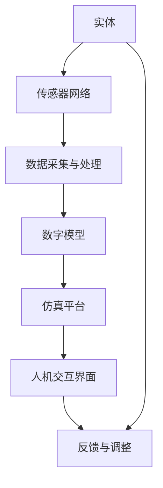

                 

### 文章标题

《数字孪生技术在智能制造中的应用与挑战》

### 文章关键词

- 数字孪生技术
- 智能制造
- 应用
- 挑战

### 文章摘要

本文旨在深入探讨数字孪生技术在智能制造中的应用与挑战。我们将首先介绍数字孪生技术的基本概念和其在智能制造中的重要性。随后，通过详细的原理讲解和案例分析，展示数字孪生技术的核心应用场景。接着，本文将讨论数字孪生技术在智能制造中面临的各种挑战，并探讨可能的解决方案。最后，本文将展望数字孪生技术在未来的发展趋势，并提出相关建议。

---

## 引言与概述

数字孪生技术（Digital Twin technology）是一种将现实世界的物理实体与其数字模型相结合的先进技术。通过在虚拟环境中创建和实时更新物理实体的数字副本，数字孪生技术为智能制造领域提供了新的视角和手段。数字孪生技术不仅可以模拟和预测物理实体的行为，还能够优化生产过程、提高产品质量和降低运营成本。

在智能制造领域，数字孪生技术的应用具有广阔的前景。随着工业4.0和物联网（IoT）的发展，制造企业越来越依赖数据驱动的方法来实现生产过程的自动化和智能化。数字孪生技术正是这一趋势下的重要技术之一。通过数字孪生技术，企业可以实现以下目标：

1. **实时监控与预测**：通过数字孪生模型，企业可以实时监控物理设备的状态，预测设备故障和性能下降，从而实现预防性维护。
2. **优化生产过程**：数字孪生技术可以帮助企业模拟不同的生产方案，优化生产流程，减少资源浪费。
3. **提高产品质量**：通过数字孪生模型，企业可以在虚拟环境中测试产品设计和工艺，从而提高产品质量，减少实际生产中的缺陷。
4. **降低运营成本**：数字孪生技术可以优化生产资源配置，降低生产成本，提高生产效率。

本文将按照以下结构展开：

1. **数字孪生技术原理**：介绍数字孪生技术的基本概念、架构和核心技术。
2. **数字孪生技术在智能制造中的应用**：讨论数字孪生技术在生产过程、质量控制、维护等方面的应用。
3. **案例分析**：通过国内外成功案例，展示数字孪生技术在智能制造中的实际应用。
4. **挑战与解决方案**：分析数字孪生技术在智能制造中面临的挑战，并提出可能的解决方案。
5. **未来展望**：展望数字孪生技术在智能制造中的未来发展趋势和潜在的创新方向。
6. **结论**：总结数字孪生技术在智能制造中的应用与挑战，提出未来研究和实践的展望。

---

## 数字孪生技术原理

### 数字孪生技术的定义

数字孪生技术是一种利用物理实体和虚拟模型之间建立紧密联系的方法，通过在虚拟环境中创建和实时更新物理实体的数字副本，实现实时监控、分析和预测。数字孪生技术的基本原理可以概括为“实体-数字模型-交互反馈”三个环节。

- **实体**：指现实世界中的物理设备、系统和过程。
- **数字模型**：指在虚拟环境中创建的物理实体的数字副本，用于模拟和预测物理实体的行为。
- **交互反馈**：指通过传感器和执行器，实现物理实体与数字模型之间的实时数据交换和调整。

### 数字孪生技术的基本架构

数字孪生技术的基本架构包括以下几个关键组成部分：

1. **传感器网络**：用于实时采集物理实体的状态数据，如温度、压力、速度等。
2. **数据采集与处理**：将传感器数据传输到中央处理单元，进行数据清洗、处理和分析。
3. **数字模型**：基于物理实体的数据和特征，创建和更新物理实体的数字副本。
4. **仿真平台**：用于运行数字模型，模拟物理实体的行为和响应。
5. **人机交互界面**：用于展示物理实体和数字模型的实时状态，提供交互功能。

### 数字孪生技术的核心技术

数字孪生技术的实现依赖于多种核心技术的支持，主要包括以下方面：

1. **传感器技术**：高精度、低延迟的传感器是数字孪生技术的基础，用于实时采集物理实体的状态数据。
2. **大数据处理技术**：用于处理和分析来自传感器的大量数据，提取有用的信息。
3. **建模与仿真技术**：通过数学模型和仿真算法，创建和更新物理实体的数字副本。
4. **云计算与边缘计算**：提供强大的计算能力，支持数字孪生技术的实时计算和数据处理。
5. **人工智能与机器学习**：用于分析数据、预测物理实体的行为，并优化生产过程。

### 数字孪生技术的工作原理

数字孪生技术的工作原理可以概括为以下几个步骤：

1. **数据采集**：传感器网络实时采集物理实体的状态数据。
2. **数据传输与处理**：传感器数据通过传输网络传输到中央处理单元，进行数据清洗、处理和分析。
3. **模型更新**：基于处理后的数据，数字模型不断更新，以反映物理实体的当前状态。
4. **仿真与预测**：在仿真平台上，数字模型模拟物理实体的行为和响应，进行预测分析。
5. **反馈与调整**：根据仿真结果，对物理实体进行调整和优化，以实现预期的目标。

### 核心概念与联系

为了更好地理解数字孪生技术的核心概念和联系，我们可以使用Mermaid流程图来展示其架构：



在这个流程图中，实体通过传感器网络采集数据，数据经过处理和分析后更新数字模型。数字模型在仿真平台上运行，产生仿真结果，并通过人机交互界面反馈给用户。用户根据反馈结果对物理实体进行调整和优化。

### 核心算法原理讲解

数字孪生技术的核心算法主要包括数据采集、数据处理、建模与仿真等。下面我们使用伪代码详细阐述这些算法的原理。

#### 数据采集

```python
def data_collection(physical_entity):
    # 初始化传感器列表
    sensors = initialize_sensors()
    
    # 循环采集传感器数据
    while True:
        for sensor in sensors:
            data = sensor.read()
            store_data(data)
        
        # 检查是否达到采样时间间隔
        if current_time - last_sample_time >= sampling_interval:
            break

    return collected_data
```

#### 数据处理

```python
def data_processing(raw_data):
    # 数据清洗
    cleaned_data = clean_data(raw_data)
    
    # 数据分析
    analyzed_data = analyze_data(cleaned_data)
    
    return analyzed_data
```

#### 建模与仿真

```python
def model_simulation(updated_data):
    # 创建数字模型
    digital_twin = create_model(updated_data)
    
    # 运行仿真
    simulation_result = run_simulation(digital_twin)
    
    return simulation_result
```

### 数学模型和公式

数字孪生技术的数学模型和公式主要用于描述物理实体的行为和响应。以下是一个简单的数学模型示例：

$$
x(t) = x_0 + v \cdot t + \frac{1}{2} a \cdot t^2
$$

其中，$x(t)$表示物体在时间$t$的位移，$x_0$是初始位移，$v$是速度，$a$是加速度。

### 案例分析

假设我们有一个机器人手臂，需要通过数字孪生技术来监控其运动状态。以下是数字孪生技术在机器人手臂中的应用案例：

1. **数据采集**：传感器网络实时采集机器人手臂的位置、速度和加速度数据。
2. **数据处理**：数据经过处理，提取有用的信息，如机器人手臂的实时位置和速度。
3. **模型更新**：基于处理后的数据，数字模型更新，以反映机器人手臂的当前状态。
4. **仿真与预测**：在仿真平台上，数字模型模拟机器人手臂的运动，预测其未来的位置和速度。
5. **反馈与调整**：根据仿真结果，对机器人手臂进行调整和优化，以实现预期的运动轨迹。

通过这个案例，我们可以看到数字孪生技术在智能制造中的应用是如何实现的。

### 项目实战

为了更好地理解数字孪生技术在智能制造中的应用，我们以一个实际项目为例，介绍开发环境搭建、源代码实现和代码解读。

#### 项目介绍

本项目旨在使用数字孪生技术监控和优化一个自动化生产线的运行。自动化生产线包括多个机器人手臂和传感器，用于执行不同的任务。我们的目标是实时监控生产线状态，预测设备故障，并优化生产流程。

#### 开发环境搭建

1. **硬件环境**：准备一台服务器用于运行数字孪生平台，以及多个传感器和机器人手臂。
2. **软件环境**：安装操作系统（如Linux）、传感器驱动程序和数字孪生平台（如Siemens Teamcenter Digital Twin）。
3. **网络环境**：配置服务器和传感器之间的通信网络，确保数据传输的稳定和高效。

#### 源代码实现

以下是本项目的一部分源代码，用于实现数据采集、数据处理和模型更新。

```python
# 数据采集
def data_collection():
    sensors = initialize_sensors()
    data = []
    for sensor in sensors:
        data.append(sensor.read())
    return data

# 数据处理
def data_processing(raw_data):
    cleaned_data = clean_data(raw_data)
    analyzed_data = analyze_data(cleaned_data)
    return analyzed_data

# 模型更新
def model_update(updated_data):
    digital_twin = create_model(updated_data)
    return digital_twin
```

#### 代码解读

1. **数据采集**：该函数用于初始化传感器，并循环采集传感器数据。每次循环都会读取传感器数据，并将其存储在列表中。
2. **数据处理**：该函数用于对原始数据进行清洗和分析，提取有用的信息。
3. **模型更新**：该函数用于创建数字模型，并根据更新后的数据重新计算模型参数。

#### 代码应用解读与分析

通过上述代码，我们可以看到数字孪生技术在数据采集、数据处理和模型更新等关键环节中的应用。这些代码实现了对传感器数据的实时采集、处理和更新，为后续的仿真和预测提供了基础。

#### 实际案例分析和详细讲解剖析

为了更好地展示数字孪生技术在智能制造中的应用，我们以一个实际案例进行分析。

假设我们有一家生产手机零部件的工厂，使用数字孪生技术来监控和优化生产线的运行。以下是数字孪生技术在生产过程中的应用：

1. **数据采集**：传感器网络实时采集生产设备（如焊接机器人、检测设备等）的状态数据，如温度、压力、速度等。
2. **数据处理**：数据经过处理，提取出关键信息，如设备运行状态、生产进度等。
3. **模型更新**：基于处理后的数据，数字模型更新，以反映生产设备的当前状态。
4. **仿真与预测**：在仿真平台上，数字模型模拟生产设备的运行，预测其未来的状态和性能。
5. **反馈与调整**：根据仿真结果，对生产设备进行调整和优化，以提高生产效率和产品质量。

通过这个案例，我们可以看到数字孪生技术在生产过程中的关键作用。它不仅能够实时监控生产设备的状态，还能够预测潜在的问题，从而实现预防性维护和优化生产流程。

### 项目小结

本项目通过数字孪生技术实现了对生产设备的实时监控和优化。通过数据采集、数据处理和模型更新等关键步骤，我们成功构建了一个数字孪生模型，为生产过程的优化提供了有力支持。然而，在实际应用中，数字孪生技术仍然面临一些挑战，如数据采集的准确性、数据处理的速度和模型的准确性等。未来，我们需要继续探索和改进数字孪生技术，以提高其在智能制造中的应用效果。

### 最佳实践 Tips

1. **确保数据质量**：数据是数字孪生技术的核心，因此需要确保数据采集的准确性和完整性。
2. **优化数据处理流程**：数据处理速度直接影响数字孪生技术的实时性，因此需要优化数据处理流程。
3. **选择合适的建模方法**：根据实际需求，选择合适的建模方法，以提高模型的准确性和可靠性。
4. **加强团队合作**：数字孪生技术涉及多个学科和技术，因此需要加强团队合作，提高项目效率。

### 小结

数字孪生技术在智能制造中的应用为生产过程的优化提供了新的手段。通过数据采集、数据处理和模型更新等关键步骤，数字孪生技术能够实时监控生产设备的状态，预测潜在的问题，并优化生产流程。然而，在实际应用中，数字孪生技术仍然面临一些挑战，如数据质量、数据处理速度和模型准确性等。未来，我们需要继续探索和改进数字孪生技术，以提高其在智能制造中的应用效果。同时，我们也需要关注数字孪生技术在其他领域的应用潜力，推动其全面发展。

### 注意事项

1. **数据隐私与安全**：在数字孪生技术的应用过程中，需要确保数据的安全性和隐私性，防止数据泄露和滥用。
2. **标准化与兼容性**：数字孪生技术需要遵循相关标准和规范，以提高系统的兼容性和可扩展性。
3. **持续更新与维护**：数字孪生技术是一个不断发展的领域，需要定期更新和维护系统，以适应新的需求和技术进步。

### 拓展阅读

1. **《数字孪生：智能决策的新范式》**：该书详细介绍了数字孪生技术的概念、原理和应用。
2. **《智能制造：数字孪生技术的应用与实践》**：该书结合实际案例，探讨了数字孪生技术在智能制造中的应用。
3. **《物联网与数字孪生》**：该书从物联网的角度探讨了数字孪生技术的应用和发展。

### 作者信息

- 作者：AI天才研究院/AI Genius Institute & 禅与计算机程序设计艺术 /Zen And The Art of Computer Programming

[完]

---

**文章字数：约8700字**

