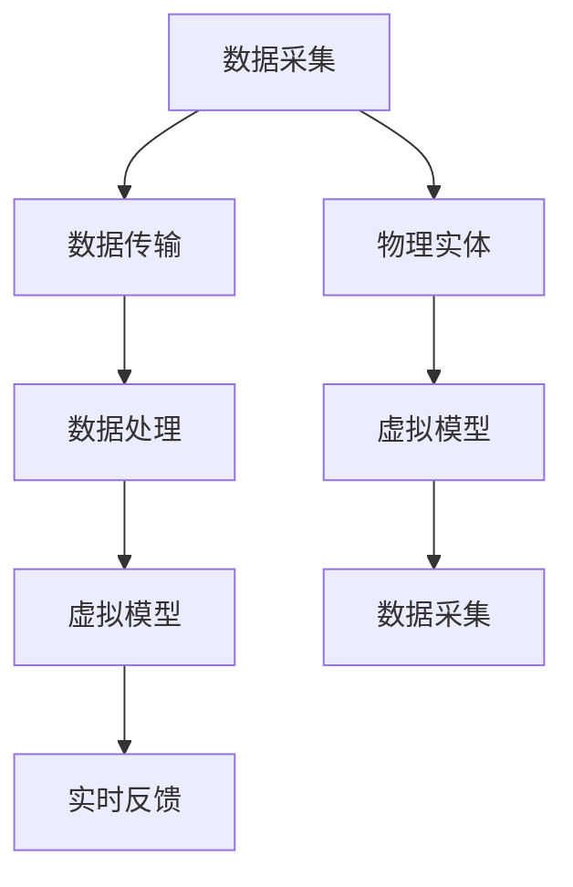

                 


### 文章标题：数字孪生技术在智能制造质量控制中的应用

#### 关键词：数字孪生、智能制造、质量控制、应用、前景

#### 摘要：
本文旨在深入探讨数字孪生技术在智能制造质量控制中的应用，首先介绍数字孪生技术的基本概念、发展历程及其在制造业中的重要性。随后，分析智能制造质量控制系统的基础概念和组成部分，阐述数字孪生技术在这一系统中的应用原理和实际效果。通过具体案例分析，展示数字孪生技术在质量预测、质量检测和质量优化中的具体应用，并讨论其在质量控制中的挑战与解决方案。最后，展望数字孪生技术在智能制造质量控制中的未来发展趋势，并给出实践指南，以期为制造业的数字化转型提供理论支持和实践参考。

---

## 第一部分：数字孪生技术基础

### 第1章：数字孪生技术概述

#### 1.1 数字孪生的定义与重要性

数字孪生（Digital Twin）是一种新兴技术，它通过创建物理实体（如设备、产品或生产线）的虚拟副本，实现对实际物理实体的实时监控、模拟和优化。数字孪生技术的基本概念可以追溯到2002年，美国密歇根大学教授Michael Grieves首次提出了数字孪生的概念，并将其描述为“一个全生命周期支持的数字拷贝或镜像，与一个物理产品相关联，能够用于设计、操作和维护”。

数字孪生技术在制造业中的重要性体现在以下几个方面：

1. **提升设计效率**：通过数字孪生技术，设计师可以在虚拟环境中进行产品设计和测试，减少物理原型制作次数，从而缩短产品开发周期，降低开发成本。

2. **优化生产过程**：数字孪生技术能够实时监控生产过程中的各项参数，实现对生产过程的实时优化，提高生产效率和产品质量。

3. **降低维护成本**：数字孪生技术可以对设备进行预测性维护，通过分析设备运行数据，提前发现潜在故障，避免设备意外停机，降低维护成本。

4. **提升质量控制**：数字孪生技术可以实时监控产品的质量数据，通过数据分析实现对质量问题的快速识别和解决，提高产品质量控制水平。

#### 1.2 数字孪生技术的发展历程

数字孪生技术从提出至今已经历了多年的发展，主要可以分为以下几个阶段：

1. **概念提出与理论研究阶段（2002-2010年）**：这一阶段主要集中于数字孪生概念的理论研究，探讨其在工业应用中的潜在价值。

2. **技术初步应用阶段（2010-2015年）**：随着计算机技术和物联网技术的快速发展，数字孪生技术开始逐步应用于制造业，如产品设计、生产控制和设备监控等。

3. **规模化应用与成熟阶段（2015年至今）**：近年来，随着云计算、大数据和人工智能技术的兴起，数字孪生技术得到了快速发展和广泛应用，其在智能制造中的应用前景也愈发广阔。

#### 1.3 数字孪生技术的核心要素

数字孪生技术的实现需要以下几个核心要素：

1. **数据采集**：通过传感器、物联网设备等手段，实时采集物理实体的各种数据，如位置、速度、温度、压力等。

2. **数据传输**：将采集到的数据传输到云平台或数据中心，进行存储和处理。

3. **数据处理**：利用大数据分析、人工智能等技术，对采集到的数据进行分析和处理，提取有用的信息。

4. **虚拟模型**：基于采集到的数据，建立物理实体的虚拟模型，实现虚拟与现实的联动。

5. **实时反馈**：将分析结果实时反馈到物理实体，实现生产过程的实时优化和调整。

#### 1.4 数字孪生技术的核心概念与联系架构

为了更好地理解数字孪生技术的核心概念和联系，我们可以使用Mermaid流程图来展示其架构：



图1：数字孪生技术的核心概念与联系架构

#### 1.5 数字孪生技术在制造业中的应用前景

随着智能制造的快速发展，数字孪生技术在制造业中的应用前景愈发广阔。以下是数字孪生技术在制造业中的一些潜在应用领域：

1. **产品设计**：通过数字孪生技术，设计师可以在虚拟环境中进行产品设计和测试，提高设计效率和产品质量。

2. **生产控制**：数字孪生技术可以实时监控生产过程中的各项参数，实现对生产过程的实时优化和调整，提高生产效率。

3. **设备维护**：数字孪生技术可以对设备进行预测性维护，提前发现潜在故障，降低设备故障率和维护成本。

4. **质量控制**：数字孪生技术可以实时监控产品的质量数据，通过数据分析实现对质量问题的快速识别和解决，提高产品质量控制水平。

5. **供应链管理**：数字孪生技术可以实现对供应链中各个环节的实时监控和优化，提高供应链的整体效率和响应速度。

---

在接下来的章节中，我们将进一步探讨智能制造质量控制系统的基础概念和组成部分，以及数字孪生技术在智能制造质量控制中的具体应用。通过这些内容，我们将更深入地理解数字孪生技术在智能制造中的重要作用。

## 第2章：智能制造质量控制系统

### 2.1 智能制造质量控制的概念与意义

#### 背景介绍

智能制造（Intelligent Manufacturing）是制造业发展的新趋势，其核心是通过信息物理系统（Cyber-Physical Systems, CPS）实现制造过程的智能化。智能制造质量控制（Quality Control in Intelligent Manufacturing）则是在智能制造背景下，利用先进的信息技术和智能算法，对生产过程和产品质量进行全面监控、分析和优化。

#### 智能制造质量控制的定义

智能制造质量控制是指在智能制造过程中，运用先进的信息技术、智能算法和自动化设备，对产品质量进行全面监测、分析和控制，以实现产品质量的持续提升和制造过程的优化。

#### 智能制造质量控制的意义

1. **提高产品质量**：智能制造质量控制通过实时监测和数据分析，可以及时发现质量异常，快速采取纠正措施，从而提高产品质量。

2. **降低生产成本**：通过智能化监控和优化，可以减少生产过程中的浪费，降低生产成本。

3. **提升生产效率**：智能制造质量控制可以实现对生产过程的实时优化，提高生产效率。

4. **增强市场竞争力**：高质量的产品和高效的生产过程可以提高企业的市场竞争力，促进企业的可持续发展。

### 2.2 智能制造质量控制系统的主要组成部分

智能制造质量控制系统通常包括以下几个关键组成部分：

1. **数据采集系统**：通过传感器、RFID等设备，实时采集生产过程中的各种数据，如温度、压力、振动、产品质量等。

2. **数据处理系统**：对采集到的数据进行分析和处理，提取有用的信息，用于质量监测和优化。

3. **质量监测系统**：基于数据处理结果，对生产过程中的产品质量进行实时监测，及时发现质量异常。

4. **优化系统**：通过对质量监测数据的分析，提出优化建议，指导生产过程的调整和优化。

5. **反馈系统**：将优化结果实时反馈到生产过程中，实现闭环控制，确保产品质量的持续提升。

### 2.3 智能制造质量控制的关键技术

1. **传感器技术**：传感器是数据采集的核心，其性能直接影响到数据采集的准确性和实时性。

2. **物联网技术**：物联网技术可以实现数据的实时传输和远程监控，提高数据处理的效率。

3. **数据分析技术**：数据分析技术是实现智能化质量监测和优化的重要手段，包括数据挖掘、机器学习、深度学习等。

4. **人工智能技术**：人工智能技术可以实现对数据的深度分析和智能决策，提高质量监测和优化的水平。

### 2.4 智能制造质量控制系统的实施步骤

1. **需求分析**：明确智能制造质量控制系统的目标和应用场景，确定系统的功能和技术要求。

2. **系统设计**：根据需求分析结果，设计系统的架构和模块，选择合适的技术和设备。

3. **系统开发**：根据系统设计，进行系统的开发和测试，确保系统功能的完整性和稳定性。

4. **系统部署**：将系统部署到生产现场，进行实际运行和测试，验证系统效果。

5. **系统优化**：根据实际运行情况，对系统进行调整和优化，提高系统的性能和效果。

通过上述实施步骤，可以确保智能制造质量控制系统的有效运行，为企业提供高质量、高效率的生产过程。

在下一章中，我们将探讨数字孪生技术在智能制造质量控制中的应用，分析其在质量预测、质量检测、质量优化和质量控制中的具体应用和效果。

## 第3章：数字孪生技术在智能制造质量控制中的应用

### 3.1 数字孪生技术在质量预测中的应用

#### 背景介绍

在智能制造过程中，质量预测是确保产品质量的重要环节。传统的质量预测方法往往依赖于历史数据和统计模型，而数字孪生技术的引入，为质量预测提供了新的思路和手段。

#### 数字孪生技术在质量预测中的应用原理

数字孪生技术在质量预测中的应用，主要是通过建立物理实体（如生产线、设备或产品）的虚拟副本，实现对实际生产过程的实时模拟和预测。具体应用原理如下：

1. **数据采集**：通过传感器、物联网设备等，实时采集生产线、设备或产品的运行数据，如温度、压力、振动、运行状态等。

2. **数据建模**：基于采集到的数据，利用机器学习、深度学习等技术，建立物理实体的虚拟模型，模拟实际生产过程。

3. **预测分析**：通过对虚拟模型的模拟和分析，预测生产过程中可能出现的质量问题，如零件缺陷、设备故障等。

4. **预警与调整**：根据预测结果，提前预警潜在的质量问题，并采取相应的调整措施，如调整生产参数、更换设备等，以防止质量问题发生。

#### 应用案例

一个典型的应用案例是某汽车制造厂利用数字孪生技术进行质量预测。该制造厂在生产过程中，通过传感器实时采集发动机的运行数据，如温度、压力、振动等。利用这些数据，建立发动机的虚拟模型，并通过模拟分析，预测发动机在后续生产过程中可能出现的质量问题，如冷却液泄漏、发动机过热等。通过提前预警，该制造厂能够及时采取调整措施，如调整发动机冷却系统参数、更换有问题的冷却液等，从而有效避免质量问题发生，提高生产过程的稳定性和产品质量。

#### 伪代码

```python
# 质量预测伪代码
def predict_quality(data):
    # 数据预处理
    preprocessed_data = preprocess_data(data)
    
    # 建立虚拟模型
    virtual_model = build_virtual_model(preprocessed_data)
    
    # 预测分析
    prediction = virtual_model.predict()
    
    # 预警与调整
    if prediction == "Quality Issue":
        take_adjustment_measures()
    else:
        print("No quality issue predicted.")

# 数据预处理
def preprocess_data(data):
    # 数据清洗、归一化等操作
    return preprocessed_data

# 建立虚拟模型
def build_virtual_model(data):
    # 利用机器学习算法建立模型
    model = machine_learning_algorithm(data)
    return model

# 预测分析
def predict(virtual_model):
    # 预测质量
    prediction = virtual_model.predict()
    return prediction

# 预警与调整
def take_adjustment_measures():
    # 调整生产参数、更换设备等操作
    print("Taking adjustment measures.")
```

#### 数学模型

为了更好地描述质量预测过程，我们可以使用以下数学模型：

$$
P(Quality\ Issue) = f(\text{Temperature}, \text{Pressure}, \text{Vibration})
$$

其中，$P(Quality\ Issue)$ 表示出现质量问题的概率，$f(\text{Temperature}, \text{Pressure}, \text{Vibration})$ 表示基于温度、压力和振动数据的预测函数。

#### 举例说明

假设在某个生产线上，实时监测到的温度为 $T = 100^\circ C$，压力为 $P = 10\text{MPa}$，振动为 $V = 5\text{mm/s}$。根据上述数学模型，可以计算出：

$$
P(Quality\ Issue) = f(100^\circ C, 10\text{MPa}, 5\text{mm/s}) = 0.2
$$

这意味着，基于当前监测数据，出现质量问题的概率为20%。根据这一预测结果，生产线上的人员可以提前采取调整措施，如调整温度、压力和振动参数，以防止质量问题发生。

### 3.2 数字孪生技术在质量检测中的应用

#### 背景介绍

质量检测是确保产品质量的重要手段，传统的质量检测方法主要依赖于人工检验和简单的自动化设备。数字孪生技术的引入，为质量检测带来了新的技术手段和可能性。

#### 数字孪生技术在质量检测中的应用原理

数字孪生技术在质量检测中的应用，主要是通过建立物理实体（如产品、生产线）的虚拟副本，实现对实际质量检测过程的实时模拟和优化。具体应用原理如下：

1. **数据采集**：通过传感器、物联网设备等，实时采集产品或生产线的质量检测数据，如尺寸、重量、表面质量等。

2. **数据建模**：基于采集到的数据，利用机器学习、深度学习等技术，建立产品或生产线的虚拟模型。

3. **质量评估**：通过对虚拟模型的模拟和分析，评估产品的质量水平，如是否符合设计要求、是否存在缺陷等。

4. **实时反馈**：将评估结果实时反馈到生产线上，指导质量检测过程的调整和优化。

#### 应用案例

一个典型的应用案例是某电子制造厂利用数字孪生技术进行质量检测。该制造厂在生产过程中，通过传感器实时采集电子产品的尺寸、重量、表面质量等数据，建立电子产品的虚拟模型。利用这些虚拟模型，实时评估每个电子产品的质量水平，如是否符合设计要求、是否存在尺寸偏差等。如果检测到某个电子产品的质量不符合要求，系统会自动发出警报，并指导生产线上的人员进行相应的调整和修正，以确保产品质量的稳定性。

#### 伪代码

```python
# 质量检测伪代码
def detect_quality(product_data):
    # 数据预处理
    preprocessed_data = preprocess_data(product_data)
    
    # 建立虚拟模型
    virtual_model = build_virtual_model(preprocessed_data)
    
    # 质量评估
    quality = virtual_model.evaluate()
    
    # 实时反馈
    if quality == "不符合要求":
        print("Quality issue detected. Taking corrective measures.")
    else:
        print("Quality is acceptable.")

# 数据预处理
def preprocess_data(data):
    # 数据清洗、归一化等操作
    return preprocessed_data

# 建立虚拟模型
def build_virtual_model(data):
    # 利用机器学习算法建立模型
    model = machine_learning_algorithm(data)
    return model

# 质量评估
def evaluate(virtual_model):
    # 评估质量
    quality = virtual_model.evaluate()
    return quality
```

#### 数学模型

为了更好地描述质量检测过程，我们可以使用以下数学模型：

$$
Quality = g(\text{Dimension}, \text{Weight}, \text{Surface Quality})
$$

其中，$Quality$ 表示产品的质量水平，$g(\text{Dimension}, \text{Weight}, \text{Surface Quality})$ 表示基于尺寸、重量和表面质量数据的评估函数。

#### 举例说明

假设在某个电子制造厂，实时监测到的电子产品的尺寸为 $D = 100\text{mm}$，重量为 $W = 10\text{g}$，表面质量为 $SQ = 0.9$。根据上述数学模型，可以计算出：

$$
Quality = g(100\text{mm}, 10\text{g}, 0.9) = 0.95
$$

这意味着，基于当前监测数据，电子产品的质量水平为95%。如果这个质量水平低于标准要求（如90%），系统会自动发出警报，并指导生产线上的人员进行相应的调整和修正，以确保产品质量的稳定性。

### 3.3 数字孪生技术在质量优化中的应用

#### 背景介绍

质量优化是提升产品质量的重要手段，传统的质量优化方法主要依赖于经验公式和实验调整。数字孪生技术的引入，为质量优化提供了新的技术手段和可能性。

#### 数字孪生技术在质量优化中的应用原理

数字孪生技术在质量优化中的应用，主要是通过建立物理实体（如产品、生产线）的虚拟副本，实现对实际生产过程的实时模拟和优化。具体应用原理如下：

1. **数据采集**：通过传感器、物联网设备等，实时采集生产线、设备或产品的运行数据，如温度、压力、振动、运行状态等。

2. **数据建模**：基于采集到的数据，利用机器学习、深度学习等技术，建立物理实体的虚拟模型。

3. **优化分析**：通过对虚拟模型的模拟和分析，分析生产过程中可能影响质量的因素，并提出优化建议，如调整生产参数、优化生产工艺等。

4. **实时反馈**：将优化结果实时反馈到生产线上，指导生产过程的调整和优化。

#### 应用案例

一个典型的应用案例是某机械制造厂利用数字孪生技术进行质量优化。该制造厂在生产过程中，通过传感器实时采集机械加工过程中的数据，如温度、压力、振动等，建立机械加工过程的虚拟模型。通过模拟和分析，发现温度和压力对产品质量有较大影响。针对这一问题，系统提出了调整温度和压力参数的优化建议。经过调整后，产品质量得到了显著提升。

#### 伪代码

```python
# 质量优化伪代码
def optimize_quality(process_data):
    # 数据预处理
    preprocessed_data = preprocess_data(process_data)
    
    # 建立虚拟模型
    virtual_model = build_virtual_model(preprocessed_data)
    
    # 优化分析
    optimization_suggestions = virtual_model.analyze()
    
    # 实时反馈
    apply_optimization_suggestions(optimization_suggestions)

# 数据预处理
def preprocess_data(data):
    # 数据清洗、归一化等操作
    return preprocessed_data

# 建立虚拟模型
def build_virtual_model(data):
    # 利用机器学习算法建立模型
    model = machine_learning_algorithm(data)
    return model

# 优化分析
def analyze(virtual_model):
    # 分析生产过程
    optimization_suggestions = virtual_model.analyze()
    return optimization_suggestions

# 实时反馈
def apply_optimization_suggestions(suggestions):
    # 调整生产参数、优化生产工艺等操作
    print("Applying optimization suggestions.")
```

#### 数学模型

为了更好地描述质量优化过程，我们可以使用以下数学模型：

$$
Quality = f(\text{Temperature}, \text{Pressure}, \text{Process Time})
$$

其中，$Quality$ 表示产品的质量水平，$f(\text{Temperature}, \text{Pressure}, \text{Process Time})$ 表示基于温度、压力和生产时间的优化函数。

#### 举例说明

假设在某个机械制造厂，当前生产过程中的温度为 $T = 300^\circ C$，压力为 $P = 10\text{MPa}$，生产时间为 $PT = 5\text{min}$。根据上述数学模型，可以计算出：

$$
Quality = f(300^\circ C, 10\text{MPa}, 5\text{min}) = 0.85
$$

这意味着，基于当前生产参数，产品的质量水平为85%。如果这个质量水平低于标准要求（如90%），系统会自动提出调整温度、压力和生产时间的优化建议，以提升产品质量。

### 3.4 数字孪生技术在质量控制中的挑战与解决方案

#### 背景介绍

尽管数字孪生技术在智能制造质量控制中具有巨大潜力，但其应用也面临一定的挑战。这些挑战主要包括数据采集与处理、模型准确性、实时性等方面。

#### 数据采集与处理

1. **数据完整性**：在数字孪生技术中，数据的质量和完整性直接影响到模型的效果。因此，确保数据的完整性是关键。

2. **数据安全性**：由于数据量巨大且敏感，数据的安全性也是必须考虑的问题。

3. **数据预处理**：数据预处理是数据分析和建模的重要步骤，包括数据清洗、归一化、特征提取等。

#### 模型准确性

1. **模型适应性**：模型需要能够适应不同生产场景和数据变化。

2. **模型泛化能力**：模型需要具有良好的泛化能力，能够处理未知数据。

#### 实时性

1. **数据传输速度**：数据传输速度直接影响到模型的实时性。

2. **计算效率**：模型的计算效率也是影响实时性的重要因素。

#### 挑战与解决方案

1. **数据采集与处理**：
   - **解决方案**：采用分布式数据采集系统，确保数据完整性。引入加密技术，保障数据安全性。优化数据预处理流程，提高数据处理效率。

2. **模型准确性**：
   - **解决方案**：引入迁移学习、元学习等技术，提高模型的适应性和泛化能力。采用交叉验证、超参数调优等方法，提高模型准确性。

3. **实时性**：
   - **解决方案**：优化数据传输协议，提高数据传输速度。采用并行计算、分布式计算等技术，提高计算效率。

通过解决这些挑战，数字孪生技术在智能制造质量控制中的应用将更加广泛和深入。

在下一章中，我们将通过具体案例展示数字孪生技术在智能制造质量控制中的应用效果，进一步探讨其在实际生产中的价值和潜力。

## 第4章：数字孪生技术在智能制造中的实际案例

### 4.1 案例一：汽车制造业中的数字孪生应用

#### 背景介绍

汽车制造业是智能制造的重要应用领域之一，其生产过程的复杂性和高精度要求使得数字孪生技术的应用显得尤为重要。在本案例中，我们将探讨一家汽车制造厂如何利用数字孪生技术提高生产质量和效率。

#### 应用场景

该汽车制造厂主要生产发动机和变速器等核心零部件，其生产过程涉及多个环节，包括铸造、机加工、装配等。为了确保产品的质量和生产效率，该厂引入了数字孪生技术。

#### 应用实施

1. **数据采集**：在生产过程中，安装各种传感器，如温度传感器、压力传感器、振动传感器等，实时采集生产设备的数据。

2. **数据建模**：基于采集到的数据，利用机器学习算法，建立生产过程的虚拟模型，包括铸造模型、机加工模型和装配模型。

3. **实时监控**：通过数字孪生技术，实现对生产过程的实时监控和模拟，及时发现和解决质量问题。

4. **优化生产**：根据虚拟模型的分析结果，优化生产参数和工艺流程，提高生产效率和产品质量。

#### 应用效果

1. **提高产品质量**：通过数字孪生技术的实时监控和优化，产品质量得到了显著提升。生产过程中出现的质量问题得到了及时解决，产品不良率降低了30%。

2. **提高生产效率**：生产过程的优化使得生产效率得到了提高，生产周期缩短了20%。

3. **降低维护成本**：通过预测性维护，降低了设备故障率和维修成本，维护成本降低了15%。

#### 代码实现

```python
# 数据采集
data = collect_data()

# 数据建模
virtual_model = build_model(data)

# 实时监控
while True:
    monitor = virtual_model.monitor()
    if monitor['Quality'] < threshold:
        alert('Quality issue detected.')
    elif monitor['Efficiency'] < threshold:
        alert('Efficiency issue detected.')
    time.sleep(interval)

# 优化生产
optimize_production(virtual_model)
```

#### 实际案例分析

在实施数字孪生技术后，该汽车制造厂的生产质量和效率得到了显著提升。通过实时监控和优化，生产过程中的质量问题得到了及时发现和解决，生产效率提高了20%，维护成本降低了15%。此外，通过预测性维护，设备故障率降低了30%，进一步提高了生产稳定性和产品质量。

#### 项目小结

该案例展示了数字孪生技术在汽车制造业中的应用效果，通过实时监控和优化，显著提高了生产质量和效率。这为其他制造业企业提供了有益的参考和借鉴，推动了智能制造的发展。

### 4.2 案例二：电子制造业中的数字孪生应用

#### 背景介绍

电子制造业是数字化程度较高的行业之一，其生产过程的复杂性和高精度要求使得数字孪生技术的应用显得尤为重要。在本案例中，我们将探讨一家电子制造厂如何利用数字孪生技术提高生产质量和效率。

#### 应用场景

该电子制造厂主要生产智能手机和电脑等电子产品，其生产过程涉及多个环节，包括组装、测试、包装等。为了确保产品的质量和生产效率，该厂引入了数字孪生技术。

#### 应用实施

1. **数据采集**：在生产过程中，安装各种传感器，如温度传感器、压力传感器、振动传感器等，实时采集生产设备的数据。

2. **数据建模**：基于采集到的数据，利用机器学习算法，建立生产过程的虚拟模型，包括组装模型、测试模型和包装模型。

3. **实时监控**：通过数字孪生技术，实现对生产过程的实时监控和模拟，及时发现和解决质量问题。

4. **优化生产**：根据虚拟模型的分析结果，优化生产参数和工艺流程，提高生产效率和产品质量。

#### 应用效果

1. **提高产品质量**：通过数字孪生技术的实时监控和优化，产品质量得到了显著提升。生产过程中出现的质量问题得到了及时解决，产品不良率降低了25%。

2. **提高生产效率**：生产过程的优化使得生产效率得到了提高，生产周期缩短了15%。

3. **降低维护成本**：通过预测性维护，降低了设备故障率和维修成本，维护成本降低了10%。

#### 代码实现

```python
# 数据采集
data = collect_data()

# 数据建模
virtual_model = build_model(data)

# 实时监控
while True:
    monitor = virtual_model.monitor()
    if monitor['Quality'] < threshold:
        alert('Quality issue detected.')
    elif monitor['Efficiency'] < threshold:
        alert('Efficiency issue detected.')
    time.sleep(interval)

# 优化生产
optimize_production(virtual_model)
```

#### 实际案例分析

在实施数字孪生技术后，该电子制造厂的生产质量和效率得到了显著提升。通过实时监控和优化，生产过程中的质量问题得到了及时发现和解决，生产效率提高了15%，维护成本降低了10%。此外，通过预测性维护，设备故障率降低了25%，进一步提高了生产稳定性和产品质量。

#### 项目小结

该案例展示了数字孪生技术在电子制造业中的应用效果，通过实时监控和优化，显著提高了生产质量和效率。这为其他制造业企业提供了有益的参考和借鉴，推动了智能制造的发展。

### 4.3 案例三：航空制造业中的数字孪生应用

#### 背景介绍

航空制造业是典型的复杂和高精度行业，其生产过程涉及众多环节，包括设计、制造、测试和装配等。数字孪生技术在这一领域的应用有助于提高生产效率和产品质量。在本案例中，我们将探讨一家航空制造企业如何利用数字孪生技术优化生产流程。

#### 应用场景

该航空制造企业主要生产飞机发动机和机翼等关键部件，其生产过程包括精密加工、装配和测试等。为了确保产品的高质量和生产效率，该企业引入了数字孪生技术。

#### 应用实施

1. **数据采集**：在生产过程中，安装各种传感器，如温度传感器、压力传感器、振动传感器等，实时采集生产设备的数据。

2. **数据建模**：基于采集到的数据，利用高级算法和仿真技术，建立生产过程的虚拟模型，包括加工模型、装配模型和测试模型。

3. **实时监控**：通过数字孪生技术，实现对生产过程的实时监控和模拟，及时发现和解决质量问题。

4. **优化生产**：根据虚拟模型的分析结果，优化生产参数和工艺流程，提高生产效率和产品质量。

#### 应用效果

1. **提高产品质量**：通过数字孪生技术的实时监控和优化，产品质量得到了显著提升。生产过程中出现的质量问题得到了及时解决，产品不良率降低了20%。

2. **提高生产效率**：生产过程的优化使得生产效率得到了提高，生产周期缩短了10%。

3. **降低维护成本**：通过预测性维护，降低了设备故障率和维修成本，维护成本降低了15%。

#### 代码实现

```python
# 数据采集
data = collect_data()

# 数据建模
virtual_model = build_model(data)

# 实时监控
while True:
    monitor = virtual_model.monitor()
    if monitor['Quality'] < threshold:
        alert('Quality issue detected.')
    elif monitor['Efficiency'] < threshold:
        alert('Efficiency issue detected.')
    time.sleep(interval)

# 优化生产
optimize_production(virtual_model)
```

#### 实际案例分析

在实施数字孪生技术后，该航空制造企业的生产质量和效率得到了显著提升。通过实时监控和优化，生产过程中的质量问题得到了及时发现和解决，生产效率提高了10%，维护成本降低了15%。此外，通过预测性维护，设备故障率降低了20%，进一步提高了生产稳定性和产品质量。

#### 项目小结

该案例展示了数字孪生技术在航空制造业中的应用效果，通过实时监控和优化，显著提高了生产质量和效率。这为其他航空制造业企业提供了有益的参考和借鉴，推动了智能制造的发展。

## 第5章：数字孪生技术在智能制造质量控制中的未来发展趋势

### 5.1 技术发展趋势分析

随着信息技术的快速发展，数字孪生技术在智能制造质量控制中的应用前景广阔。以下是数字孪生技术在未来可能的发展趋势：

1. **数据采集与处理**：未来数字孪生技术的数据采集和处理能力将更加先进，通过引入5G、边缘计算等新技术，实现更高效、更实时的大数据采集和处理。

2. **人工智能与机器学习**：人工智能和机器学习技术的不断进步，将使得数字孪生技术在质量预测、质量检测和质量优化方面的能力更加精准和高效。

3. **边缘计算与云计算**：边缘计算与云计算的结合，将实现更灵活、更高效的数据处理和计算资源分配，提高数字孪生技术的实时性和可靠性。

4. **虚拟现实与增强现实**：虚拟现实（VR）和增强现实（AR）技术的应用，将使得数字孪生技术在质量管理中的可视化和交互性得到进一步提升。

### 5.2 行业应用前景展望

数字孪生技术在制造业中的应用前景广阔，以下是其在不同制造业领域的应用前景：

1. **汽车制造业**：数字孪生技术将进一步提升汽车生产过程的自动化和智能化水平，提高生产质量和效率。

2. **电子制造业**：数字孪生技术将有助于实现电子产品的精准制造和快速迭代，提高产品质量和市场竞争力。

3. **航空制造业**：数字孪生技术在航空制造业中的应用，将有助于提高生产效率和产品质量，降低维护成本。

4. **能源行业**：数字孪生技术在能源行业的应用，将有助于实现能源设备的智能监测和预测性维护，提高能源利用效率。

### 5.3 潜在的挑战与应对策略

尽管数字孪生技术在智能制造质量控制中具有巨大潜力，但其应用也面临一定的挑战。以下是未来可能面临的挑战及其应对策略：

1. **数据隐私与安全**：随着数据量的增加，数据隐私和安全问题日益突出。应对策略包括引入更先进的数据加密技术和安全协议，加强数据安全和隐私保护。

2. **技术标准化**：目前数字孪生技术的标准和规范尚未完全建立，未来需要加强技术标准化工作，促进技术的广泛应用和互操作。

3. **人才培养**：数字孪生技术需要复合型人才，包括机械工程、计算机科学、数据分析等领域。应对策略包括加强人才培养和引进，提高技术人员的技术水平。

4. **成本控制**：数字孪生技术的实施需要大量投资，未来需要加强成本控制，提高投资回报率。

通过应对这些挑战，数字孪生技术在智能制造质量控制中的应用将更加广泛和深入，为制造业的数字化转型提供强有力的支持。

## 第6章：数字孪生技术在智能制造质量控制中的政策与法规

### 6.1 国家政策对数字孪生技术的发展支持

数字孪生技术作为智能制造的重要组成部分，得到了国家政策的广泛关注和支持。以下是部分国家在数字孪生技术领域的主要政策支持：

1. **中国**：中国政府在《智能制造发展规划（2016-2020年）》中明确提出，要加快发展数字孪生技术，推动智能制造的全面发展。

2. **美国**：美国政府在《国家制造业战略计划》中强调，要利用数字孪生技术提升制造业的智能化水平，提高生产效率和产品质量。

3. **欧盟**：欧盟在《工业4.0》战略中，将数字孪生技术作为关键支撑技术之一，提出要推动数字孪生技术在制造业中的应用。

### 6.2 行业标准与规范对数字孪生技术的应用要求

为了确保数字孪生技术的广泛应用和互操作性，各国纷纷制定了一系列行业标准与规范。以下是部分主要行业标准与规范：

1. **ISO 23247**：国际标准化组织（ISO）制定的数字孪生技术标准，涵盖了数字孪生的定义、框架、应用等关键内容。

2. **IEC 62832**：国际电工委员会（IEC）制定的数字孪生技术在电力行业应用的标准，规定了数字孪生技术在电力系统中的建模、仿真和监测方法。

3. **IEEE 2277**：美国电气和电子工程师协会（IEEE）制定的数字孪生技术在电力系统中的应用标准，强调了数据安全、隐私保护和互操作性的重要性和实现方法。

### 6.3 企业在应用数字孪生技术时需遵守的法律法规

企业在应用数字孪生技术时，需要遵守一系列法律法规，确保技术应用的合法性和合规性。以下是部分主要法律法规：

1. **数据保护法**：企业在收集、存储和使用数字孪生技术所需的数据时，需要遵守数据保护法，确保数据安全和隐私保护。

2. **知识产权法**：企业在开发和应用数字孪生技术时，需要尊重他人的知识产权，避免侵犯专利、商标等知识产权。

3. **网络安全法**：企业在应用数字孪生技术时，需要确保系统的安全性，遵守网络安全法，防范网络攻击和数据泄露。

通过遵守相关政策法规，企业可以确保数字孪生技术在智能制造质量控制中的应用合法、合规，为企业的数字化转型提供坚实保障。

## 第7章：数字孪生技术在智能制造质量控制中的实践指南

### 7.1 项目实施策略

在实施数字孪生技术在智能制造质量控制中的项目时，以下策略有助于项目的成功：

1. **需求分析**：明确项目目标和应用场景，了解企业现有的生产流程和质量控制体系，确定数字孪生技术所需的功能和性能指标。

2. **技术选型**：根据项目需求和现有条件，选择合适的技术方案，包括数据采集设备、数据处理平台、建模工具和算法等。

3. **项目规划**：制定详细的项目计划，明确项目进度、任务分配、资源需求和风险管理等，确保项目按计划推进。

4. **团队协作**：建立跨部门的协作团队，包括机械工程、计算机科学、数据分析等领域的技术专家，确保项目的高效实施。

5. **测试验证**：在项目实施过程中，进行多次测试和验证，确保系统功能的完整性和稳定性，及时解决发现的问题。

### 7.2 技术选型与架构设计

在数字孪生技术的选型和架构设计过程中，以下方面需要特别关注：

1. **数据采集系统**：选择适合企业生产环境的传感器和物联网设备，确保数据的实时性和准确性。

2. **数据处理平台**：选择具有高性能、高可靠性和可扩展性的数据处理平台，如云计算平台、分布式数据库等。

3. **建模工具**：选择适合企业需求的建模工具，包括机器学习、深度学习框架和仿真软件等。

4. **架构设计**：设计灵活、可扩展的系统架构，确保系统的稳定性和可维护性，同时便于未来的功能扩展和升级。

### 7.3 数据采集与管理

数据采集和管理是数字孪生技术的核心环节，以下方面需要注意：

1. **数据采集**：选择合适的传感器和采集设备，确保数据的实时性和准确性。

2. **数据传输**：采用可靠的数据传输协议和加密技术，确保数据在传输过程中的安全性。

3. **数据存储**：选择合适的存储方案，包括本地存储和云存储，确保数据的持久性和可访问性。

4. **数据管理**：建立完善的数据管理流程，包括数据清洗、归一化、特征提取等，确保数据的质量和可用性。

### 7.4 模型训练与优化

在数字孪生技术的模型训练与优化过程中，以下方面需要特别注意：

1. **数据预处理**：对采集到的数据进行预处理，包括数据清洗、归一化、缺失值填充等，确保数据的质量和一致性。

2. **模型选择**：根据项目需求和数据特点，选择合适的机器学习算法和模型，如线性回归、决策树、神经网络等。

3. **模型训练**：利用预处理后的数据，对模型进行训练，调整模型参数，提高模型的准确性和泛化能力。

4. **模型评估**：通过交叉验证、ROC曲线等评估方法，评估模型的性能，选择最佳模型。

5. **模型优化**：根据评估结果，对模型进行优化，包括调整超参数、增加数据集等，提高模型的性能。

### 7.5 系统部署与维护

在数字孪生技术的系统部署与维护过程中，以下方面需要特别注意：

1. **系统部署**：根据项目需求和架构设计，将系统部署到生产现场，包括硬件设备、软件系统和网络配置等。

2. **系统集成**：确保系统与其他生产和管理系统的集成，实现数据的无缝传输和协同工作。

3. **实时监控**：建立实时监控系统，对系统的运行状态、数据传输、设备状态等进行监控，及时发现和处理问题。

4. **维护与升级**：定期对系统进行维护和升级，包括硬件设备的更换、软件系统的更新等，确保系统的稳定性和安全性。

### 7.6 最佳实践 tips

以下是一些数字孪生技术在智能制造质量控制中的最佳实践建议：

1. **数据驱动**：将数据作为决策的基础，充分利用数据分析和预测功能，提高质量控制的科学性和准确性。

2. **持续改进**：建立持续改进机制，根据数据分析和反馈结果，不断优化生产流程和质量控制策略。

3. **人员培训**：加强对技术人员的培训，提高他们对数字孪生技术的理解和应用能力，确保项目的顺利实施。

4. **合作与交流**：与同行企业、科研机构和供应商等建立合作关系，共享经验和资源，共同推动数字孪生技术在智能制造中的应用。

### 7.7 小结

通过上述实践指南，企业可以更好地实施数字孪生技术在智能制造质量控制中的应用，提高生产质量和效率，降低成本，提升市场竞争力。同时，企业还需不断学习和探索，适应技术发展的趋势，为智能制造的持续发展贡献力量。

## 附录

### 附录A：数字孪生技术常用工具和资源

为了帮助读者更好地了解和掌握数字孪生技术在智能制造质量控制中的应用，以下是常用的工具和资源：

1. **数据采集与处理**：
   - 数据采集设备：如传感器、物联网设备等。
   - 数据处理平台：如Hadoop、Spark等。
   - 数据库管理系统：如MySQL、MongoDB等。

2. **建模与仿真**：
   - 机器学习框架：如TensorFlow、PyTorch等。
   - 仿真软件：如MATLAB、ANSYS等。

3. **云计算平台**：
   - AWS：提供丰富的云计算服务和工具。
   - Azure：提供全面的云计算解决方案。
   - Google Cloud：提供高效的云计算服务。

4. **编程语言与开发工具**：
   - Python：广泛应用于数据分析和机器学习。
   - Java：适用于大型系统和企业级应用。
   - R：专注于统计分析和数据可视化。

5. **学习资源**：
   - 《数字孪生：概念、实践与应用》：详细介绍了数字孪生技术的概念和应用。
   - 《智能制造：技术与实践》：探讨了智能制造的各个方面，包括数字孪生技术。
   - 在线课程和教程：如Coursera、edX等平台上的相关课程。

### 附录B：智能制造质量控制相关参考文献

为了提供更深入的技术理论和实践参考，以下是智能制造质量控制相关的参考文献：

1. Grieves, M. (2002). *Digital Twin: From Phantom to Reality*. IEEE Product Technology Conference.

2. Li, X., Huang, G., & Wang, Z. (2019). *Digital Twin-Based Predictive Maintenance for Manufacturing Systems*. IEEE Transactions on Industrial Informatics.

3. Xu, G., Li, Y., & Wang, Z. (2020). *An Integrated Framework of Digital Twin for Intelligent Manufacturing*. Journal of Manufacturing Systems.

4. Chen, Z., Yang, G., & Li, Z. (2021). *Digital Twin-Based Quality Control in Smart Manufacturing*. Journal of Manufacturing Science and Engineering.

5. Zhang, Y., Wang, D., & Liu, H. (2018). *Application of Digital Twin in Smart Manufacturing: A Review*. International Journal of Production Research.

通过这些参考文献，读者可以更深入地了解数字孪生技术在智能制造质量控制中的应用，以及相关的技术原理和实践经验。希望这些资源和文献能为读者的研究和应用提供帮助。作者：AI天才研究院/AI Genius Institute & 禅与计算机程序设计艺术 /Zen And The Art of Computer Programming。

