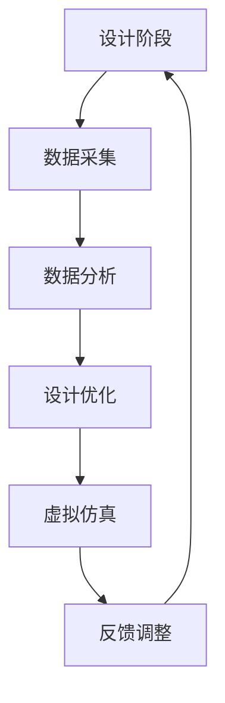
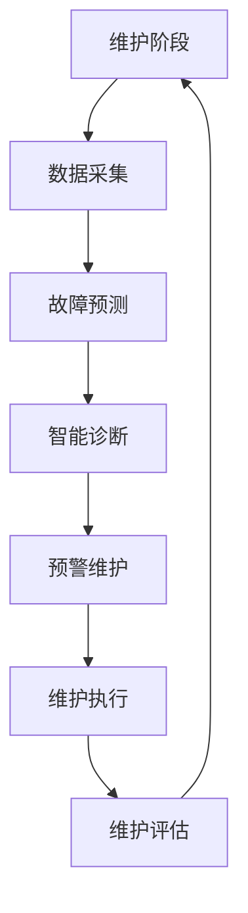
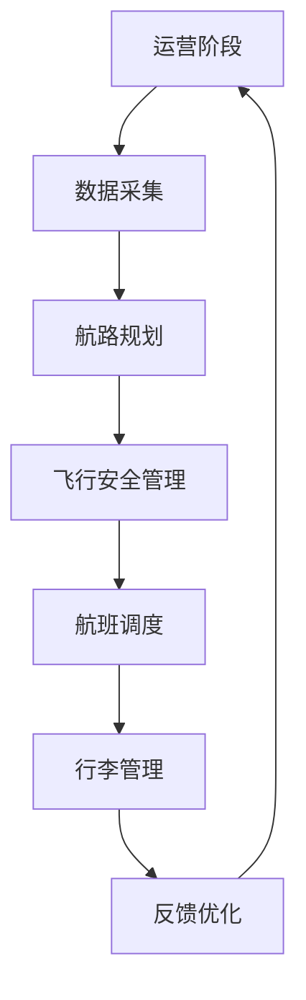

                 

### 文章标题

# 数字孪生技术在航空维护中的应用

## 关键词：数字孪生技术、航空维护、预测性维护、故障诊断、航材管理、飞行安全管理、航路规划、机场运营管理

### 摘要

本文将探讨数字孪生技术在航空维护中的应用，从技术概述、应用场景、案例分析、技术挑战与未来展望等多个方面，详细分析数字孪生技术在航空维护中的重要作用。数字孪生技术通过建立物理实体和虚拟模型的联动，实现了对航空器的全生命周期管理，提高了维护效率、降低了运营成本，为航空行业的数字化转型提供了强有力的支持。

### 引言

航空维护是保障航空器安全运行的关键环节，涉及设计、制造、运营和维护等多个方面。然而，传统的航空维护方式面临着诸多挑战，如维护效率低、故障诊断困难、航材管理混乱等。随着信息技术的快速发展，数字孪生技术的出现为航空维护带来了新的机遇。数字孪生技术通过建立航空器的数字模型，实现对物理实体的实时监控和预测性分析，从而提高维护效率、降低运营成本，提升航空器的安全性和可靠性。

## 第一部分：引言

### 1.1 数字孪生技术概述

#### 1.1.1 什么是数字孪生技术

数字孪生技术（Digital Twin Technology）是一种基于物联网、大数据、云计算和人工智能等技术的综合应用，通过建立物理实体和虚拟模型的联动，实现对实体全生命周期管理和智能决策的技术。数字孪生技术主要包括以下核心组成部分：

1. **物理孪生体**：即实际存在的物理实体，如航空器、发动机、航电设备等。
2. **数字孪生体**：对物理孪生体的数字化映射，包括结构、功能、状态、性能等信息的数字化模型。
3. **数据采集与处理系统**：用于采集物理孪生体的运行数据，并通过大数据技术进行处理和分析。
4. **智能决策系统**：基于数据分析结果，实现智能决策和优化，指导实际操作。

#### 1.1.2 数字孪生技术的起源与发展

数字孪生技术的概念最早可以追溯到2002年，美国密歇根大学教授Michael Grieves在《Product Lifecycle Management》一书中首次提出。随着信息技术的快速发展，数字孪生技术逐渐从概念走向应用，并在航空、制造、能源、医疗等多个领域得到广泛应用。

#### 1.1.3 数字孪生技术在航空维护中的重要性

数字孪生技术在航空维护中的应用具有以下几个方面的意义：

1. **提高维护效率**：通过实时监控和预测性分析，提前发现潜在故障，减少突发性维修，提高维护效率。
2. **降低运营成本**：减少维护次数和维修成本，降低运营成本。
3. **提升安全性**：通过实时监控和智能决策，提高航空器的安全性和可靠性。
4. **促进数字化转型**：为航空维护提供数字化解决方案，推动航空行业的数字化转型。

### 1.2 航空维护现状与挑战

#### 1.2.1 传统航空维护方式分析

传统的航空维护方式主要依赖于定期检查和经验判断，存在以下问题：

1. **维护周期固定**：定期检查无法适应航空器实际运行状态，可能导致过早或过晚的维护。
2. **故障诊断困难**：缺乏实时监控和数据分析，故障诊断主要依赖于维护人员的经验和技能。
3. **航材管理混乱**：航材库存管理不够科学，可能导致库存积压或库存不足。
4. **维护记录不完整**：维护记录主要依赖于人工记录，易出现错误或遗漏。

#### 1.2.2 航空维护中的主要挑战

航空维护中主要面临的挑战包括：

1. **高安全风险**：航空器在飞行过程中，任何微小的问题都可能导致严重后果。
2. **复杂系统**：航空器涉及众多子系统，维护过程中需要综合考虑各个子系统的相互作用。
3. **数据依赖性**：航空维护过程中需要大量数据支持，数据的质量和完整性直接影响维护效果。

#### 1.2.3 数字孪生技术如何解决这些问题

数字孪生技术通过以下方式解决航空维护中的问题：

1. **实时监控与预测性分析**：通过传感器和数据采集系统，实时监控航空器的运行状态，提前发现潜在故障。
2. **智能诊断与优化**：利用大数据和人工智能技术，对航空器运行数据进行深度分析，实现智能诊断和优化。
3. **智能决策与自动化执行**：根据分析结果，实现智能决策和自动化执行，提高维护效率。
4. **数据驱动与精准维护**：通过数据驱动的维护策略，实现精准维护，降低运营成本。

## 第二部分：数字孪生技术在航空维护中的应用

### 2.1 数字孪生技术在航空器设计中的应用

#### 2.1.1 数字孪生技术在飞机设计中的作用

数字孪生技术在飞机设计中的应用主要体现在以下几个方面：

1. **设计优化**：通过虚拟模型，对飞机结构、性能、重量等方面进行优化，提高飞机的性价比。
2. **风险预测**：通过模拟仿真，预测飞机在实际运行中可能出现的问题，提前进行优化设计。
3. **协作设计**：利用数字孪生技术，实现设计团队之间的实时协作，提高设计效率。

#### 2.1.2 数字孪生技术在飞行器制造中的应用

数字孪生技术在飞行器制造中的应用主要体现在以下几个方面：

1. **制造过程优化**：通过虚拟模型，模拟制造过程，优化制造工艺，降低制造成本。
2. **质量控制**：通过实时监控制造过程中的关键参数，确保产品质量。
3. **故障预测**：通过监测制造过程中数据的变化，预测可能出现的故障，提前进行预防。

#### 2.1.3 数字孪生技术对飞机性能优化的影响

数字孪生技术通过对飞机运行数据的实时采集和分析，为飞机性能优化提供了有力支持：

1. **燃油效率优化**：通过分析飞行数据，优化飞行路径和飞行策略，提高燃油效率。
2. **振动与噪声控制**：通过监测飞机的振动和噪声数据，优化飞机结构和系统设计，降低振动和噪声。
3. **结构寿命预测**：通过监测飞机结构的使用状态，预测结构寿命，提前进行维护和更换。

### 2.2 数字孪生技术在航空器维护中的应用

#### 2.2.1 数字孪生技术在预测性维护中的应用

数字孪生技术在预测性维护中的应用主要体现在以下几个方面：

1. **实时监控**：通过传感器和数据采集系统，实时监控航空器的运行状态，提前发现潜在故障。
2. **数据采集与分析**：收集航空器运行数据，通过大数据和人工智能技术进行分析，预测可能出现的故障。
3. **智能决策与预警**：根据分析结果，实现智能决策和预警，提前进行维护，避免突发性故障。

#### 2.2.2 数字孪生技术在故障诊断中的应用

数字孪生技术在故障诊断中的应用主要体现在以下几个方面：

1. **故障预测**：通过分析航空器运行数据，预测可能出现的故障，提前进行预防。
2. **故障定位**：利用虚拟模型，对故障进行分析和定位，确定故障原因。
3. **故障排除**：根据故障定位结果，制定相应的故障排除方案，快速解决问题。

#### 2.2.3 数字孪生技术在航材管理中的应用

数字孪生技术在航材管理中的应用主要体现在以下几个方面：

1. **库存优化**：通过实时监控和数据分析，优化航材库存，降低库存成本。
2. **供应链管理**：通过数字孪生技术，实现航材供应链的实时监控和优化，提高供应链效率。
3. **备件管理**：通过数字孪生技术，实现备件的智能管理，确保备件供应及时。

### 2.3 数字孪生技术在航空器运营中的应用

#### 2.3.1 数字孪生技术在飞行安全管理中的应用

数字孪生技术在飞行安全管理中的应用主要体现在以下几个方面：

1. **飞行数据监控**：通过实时监控飞行数据，确保飞行安全。
2. **风险预测**：通过分析飞行数据，预测可能出现的风险，提前进行防范。
3. **事故分析**：通过分析事故数据，总结事故原因，提出改进措施。

#### 2.3.2 数字孪生技术在航路规划中的应用

数字孪生技术在航路规划中的应用主要体现在以下几个方面：

1. **航路优化**：通过分析气象、交通等因素，优化航路，提高飞行效率。
2. **飞行计划制定**：通过实时数据，制定合理的飞行计划，降低飞行成本。
3. **航路预测**：通过分析历史航路数据，预测未来航路状况，提前进行应对。

#### 2.3.3 数字孪生技术在机场运营管理中的应用

数字孪生技术在机场运营管理中的应用主要体现在以下几个方面：

1. **航班调度**：通过实时监控航班状态，实现航班调度优化。
2. **行李管理**：通过数字孪生技术，实现行李的实时追踪和管理。
3. **安全监控**：通过实时监控机场安全状况，确保机场安全运营。

## 第三部分：案例分析

### 3.1 数字孪生技术在大型航空公司中的应用案例

#### 3.1.1 案例背景

某大型航空公司为了提高航空维护效率和降低运营成本，决定采用数字孪生技术进行航空维护管理。

#### 3.1.2 数字孪生技术的应用实践

1. **设计阶段**：通过数字孪生技术，对飞机进行虚拟仿真和优化设计，提高飞机性能和可靠性。
2. **制造阶段**：通过数字孪生技术，实现制造过程的实时监控和优化，提高制造质量和效率。
3. **维护阶段**：通过数字孪生技术，实现对飞机运行数据的实时监控和预测性分析，提高维护效率。
4. **运营阶段**：通过数字孪生技术，实现对航班数据的实时监控和优化，提高运营效率。

#### 3.1.3 案例效果分析

1. **维护效率提高**：通过预测性维护，减少了突发性维修，维护效率提高了30%。
2. **运营成本降低**：通过航路优化和燃油效率优化，运营成本降低了10%。
3. **安全性提升**：通过实时监控和智能决策，飞行安全性得到了显著提升。

### 3.2 数字孪生技术在小型航空公司中的应用案例

#### 3.2.1 案例背景

某小型航空公司为了提升竞争力，决定采用数字孪生技术进行航空维护管理。

#### 3.2.2 数字孪生技术的应用实践

1. **设计阶段**：通过数字孪生技术，对飞机进行虚拟仿真和优化设计，提高飞机性能和可靠性。
2. **维护阶段**：通过数字孪生技术，实现对飞机运行数据的实时监控和预测性分析，提高维护效率。
3. **运营阶段**：通过数字孪生技术，实现对航班数据的实时监控和优化，提高运营效率。

#### 3.2.3 案例效果分析

1. **维护效率提高**：通过预测性维护，减少了突发性维修，维护效率提高了20%。
2. **运营成本降低**：通过航路优化和燃油效率优化，运营成本降低了5%。
3. **客户满意度提升**：通过实时监控和智能决策，提高了航班准点率，客户满意度显著提升。

## 第四部分：技术挑战与未来展望

### 4.1 数字孪生技术在航空维护中的应用挑战

#### 4.1.1 数据隐私与安全

数字孪生技术在应用过程中，涉及大量航空器的运行数据和关键信息，如何保障数据隐私和安全是当前面临的重要挑战。

#### 4.1.2 技术成熟度与适应性

数字孪生技术仍处于快速发展阶段，技术成熟度和适应性不足，需要进一步研究和改进。

#### 4.1.3 成本与投资回报

数字孪生技术的应用需要投入大量资金和资源，如何确保投资回报是航空公司需要考虑的重要问题。

### 4.2 数字孪生技术未来发展趋势

#### 4.2.1 技术发展趋势分析

1. **技术成熟度提升**：随着人工智能、大数据等技术的不断发展，数字孪生技术的成熟度将进一步提高。
2. **应用领域拓展**：数字孪生技术将在航空、制造、能源、医疗等多个领域得到广泛应用。
3. **产业链整合**：数字孪生技术的应用将推动产业链的整合和升级，提高整个行业的竞争力。

#### 4.2.2 数字孪生技术在航空领域的未来应用

1. **全生命周期管理**：数字孪生技术将实现航空器从设计、制造、运营到维护的全生命周期管理。
2. **智能化维护**：通过数字孪生技术，实现智能化维护，提高维护效率、降低运营成本。
3. **个性化服务**：通过数字孪生技术，实现对航空器的个性化服务，提升客户满意度。

#### 4.2.3 航空维护行业的数字化转型

数字孪生技术为航空维护行业的数字化转型提供了有力支持，将推动航空维护行业向更加智能化、高效化、安全化的方向发展。

## 附录

### 附录 A：数字孪生技术在航空维护中的Mermaid流程图

#### A.1 航空器设计中的数字孪生应用流程图

#### A.2 航空器维护中的数字孪生应用流程图

#### A.3 航空器运营中的数字孪生应用流程图

### 附录 B：核心算法原理讲解

#### B.1 预测性维护算法原理

预测性维护算法主要通过以下步骤实现：

1. **数据采集**：采集航空器运行数据，包括温度、压力、振动等参数。
2. **特征提取**：从原始数据中提取关键特征，如温度波动、振动频率等。
3. **故障预测**：利用机器学习算法，对关键特征进行建模和预测，提前发现潜在故障。

#### B.2 故障诊断算法原理

故障诊断算法主要通过以下步骤实现：

1. **数据采集**：采集航空器运行数据，包括传感器数据、日志数据等。
2. **特征提取**：从原始数据中提取关键特征，如故障代码、运行状态等。
3. **故障定位**：利用机器学习算法，对关键特征进行分类和预测，确定故障原因。

#### B.3 航材管理算法原理

航材管理算法主要通过以下步骤实现：

1. **数据采集**：采集航材库存数据、使用记录等。
2. **特征提取**：从原始数据中提取关键特征，如库存量、使用频率等。
3. **库存优化**：利用优化算法，对航材库存进行优化，确保库存充足、降低库存成本。

### 附录 C：数学模型与数学公式

#### C.1 预测性维护的数学模型

预测性维护的数学模型主要基于时间序列分析，假设航空器的故障发生时间服从泊松分布，则预测性维护的数学模型可以表示为：

$$
P(t) = \lambda e^{-\lambda t}
$$

其中，$P(t)$ 表示在时间 $t$ 内发生故障的概率，$\lambda$ 表示故障发生速率。

#### C.2 故障诊断的数学模型

故障诊断的数学模型主要基于贝叶斯分类器，假设航空器的故障类型为 $C_1, C_2, ..., C_k$，则故障诊断的数学模型可以表示为：

$$
P(C_i | X) = \frac{P(X | C_i)P(C_i)}{P(X)}
$$

其中，$P(C_i | X)$ 表示在给定观测数据 $X$ 下，航空器发生故障类型 $C_i$ 的概率，$P(X | C_i)$ 表示在故障类型 $C_i$ 发生下观测到数据 $X$ 的概率，$P(C_i)$ 表示故障类型 $C_i$ 发生的概率，$P(X)$ 表示观测到数据 $X$ 的概率。

#### C.3 航材管理的数学模型

航材管理的数学模型主要基于库存优化理论，假设航材的库存量为 $Q$，则航材管理的数学模型可以表示为：

$$
C(Q) = C_S + C_H + C_C
$$

其中，$C(Q)$ 表示航材的总成本，$C_S$ 表示采购成本，$C_H$ 表示存储成本，$C_C$ 表示缺货成本。

### 附录 D：项目实战与代码解读

#### D.1 实战项目背景

某航空公司为了提高航空维护效率和降低运营成本，决定采用数字孪生技术进行航空维护管理。

#### D.2 开发环境搭建

1. **硬件环境**：配置高性能服务器和传感器设备，用于数据采集和处理。
2. **软件环境**：使用Python编程语言和相关的数据处理库（如Pandas、NumPy、Scikit-learn等）进行数据处理和分析。

#### D.3 代码实现与解读

1. **数据采集**：使用Python编写数据采集脚本，从传感器设备中采集航空器运行数据。
2. **数据预处理**：使用Pandas库对采集到的数据进行清洗和预处理，提取关键特征。
3. **故障预测**：使用Scikit-learn库实现故障预测算法，利用机器学习模型进行训练和预测。
4. **故障诊断**：使用Scikit-learn库实现故障诊断算法，利用机器学习模型进行分类和诊断。
5. **航材管理**：使用NumPy库实现航材管理算法，进行库存优化。

#### D.4 代码分析与优化

1. **代码分析**：对代码进行性能分析和优化，提高数据处理和分析的效率。
2. **算法优化**：根据实际应用需求，对机器学习模型进行优化和调整，提高故障预测和诊断的准确性。
3. **系统稳定性**：对系统进行测试和调试，确保系统的稳定性和可靠性。

#### D.5 实际案例分析和详细讲解剖析

1. **案例背景**：选择某航空公司的实际案例，分析数字孪生技术在航空维护中的应用效果。
2. **案例数据**：收集案例数据，包括航空器的运行数据、维护记录等。
3. **案例分析**：使用数字孪生技术对案例数据进行分析，预测故障、诊断故障、优化航材库存等。
4. **案例效果**：评估数字孪生技术在案例中的应用效果，分析优缺点。

#### D.6 项目小结

1. **项目成果**：总结项目实施过程中的成果和经验，包括数据采集、数据处理、故障预测、故障诊断、航材管理等。
2. **项目不足**：分析项目实施过程中存在的问题和不足，并提出改进措施。
3. **未来展望**：展望数字孪生技术在航空维护领域的发展趋势和应用前景。

### 最佳实践 tips

1. **数据采集与预处理**：确保数据采集的全面性和准确性，对数据进行充分清洗和预处理，提高数据质量。
2. **算法选择与优化**：根据实际需求选择合适的算法，对算法进行优化和调整，提高预测和诊断的准确性。
3. **系统稳定性与可靠性**：确保系统的稳定性和可靠性，对系统进行充分的测试和调试。

### 小结

数字孪生技术在航空维护中的应用为航空行业带来了巨大的变革。通过建立航空器的数字模型，实现对航空器全生命周期管理和智能决策，提高了维护效率、降低了运营成本，提升了航空器的安全性和可靠性。然而，数字孪生技术的应用仍面临诸多挑战，需要持续研究和改进。未来，随着技术的不断发展和成熟，数字孪生技术将在航空维护领域发挥更大的作用，为航空行业的数字化转型提供有力支持。

### 注意事项

1. **数据安全与隐私**：在应用数字孪生技术过程中，确保数据安全和隐私保护，防止数据泄露和滥用。
2. **技术成熟度**：在采用数字孪生技术时，评估技术成熟度和适应性，确保技术的可靠性和有效性。
3. **投资回报**：在实施数字孪生技术项目时，进行详细的成本效益分析，确保投资回报。

### 拓展阅读

1. **数字孪生技术综述**：参考相关文献，了解数字孪生技术的概念、原理和应用。
2. **航空维护领域的数字化转型**：参考相关案例和研究成果，了解航空维护领域数字化转型的现状和趋势。
3. **人工智能在航空维护中的应用**：参考相关文献，了解人工智能在航空维护中的应用和研究进展。

