                 

### 2.1.1 数字设备与健康问题

随着科技的迅猛发展，数字设备在我们的日常生活中变得越来越普及。从智能手机到平板电脑，再到智能手表和健康监测设备，这些科技产品极大地丰富了我们的生活。然而，数字设备在带来便利的同时，也不可避免地带来了一系列健康问题。

#### 眼睛疲劳

长时间盯着屏幕，尤其是手机屏幕，会引发眼睛疲劳。这种疲劳通常表现为眼睛干涩、疼痛、视力模糊等症状。这是因为屏幕发出的蓝光对眼睛有较强的刺激，而眼睛的调节功能在长时间集中注视屏幕时会出现过度疲劳。

**核心概念与联系**

- **概念：** 眼睛疲劳
- **联系：** 蓝光刺激、屏幕使用时间

**Mermaid 流程图**

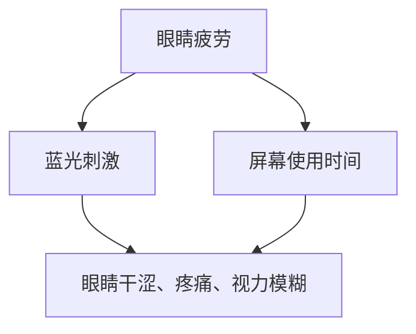

#### 颈椎问题

长时间低头使用手机或平板电脑，容易导致颈椎负担过重，引发颈椎病。颈椎病的主要症状包括颈痛、肩背痛、头痛、手臂麻木等。这种疾病在年轻人中的发病率逐年上升，严重影响了生活质量。

**核心概念与联系**

- **概念：** 颈椎问题
- **联系：** 长时间低头、颈椎负担

**Mermaid 流程图**

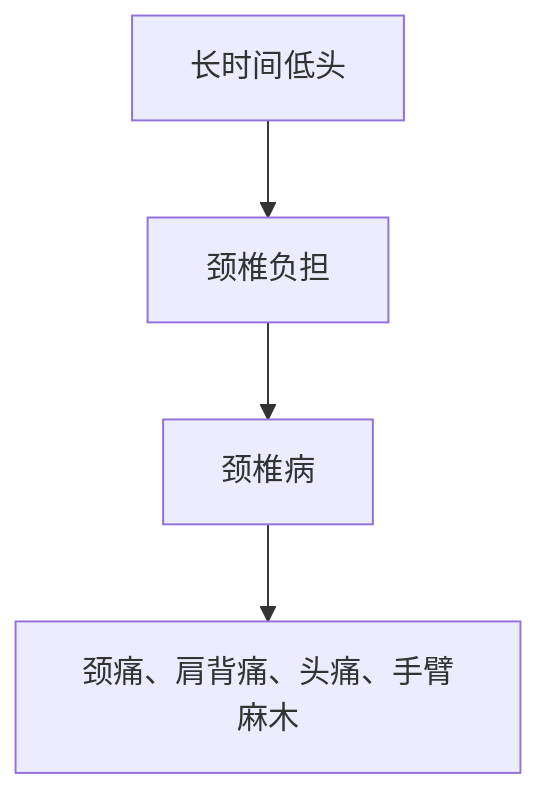

#### 睡眠质量下降

晚上使用手机或平板电脑，尤其是长时间在床上玩电子产品，会严重影响睡眠质量。屏幕发出的蓝光会抑制褪黑激素的分泌，这是一种重要的睡眠调节激素。此外，屏幕上的内容往往具有刺激性，容易让人兴奋，进一步影响入睡。

**核心概念与联系**

- **概念：** 睡眠质量下降
- **联系：** 蓝光抑制、睡前使用电子设备

**Mermaid 流程图**

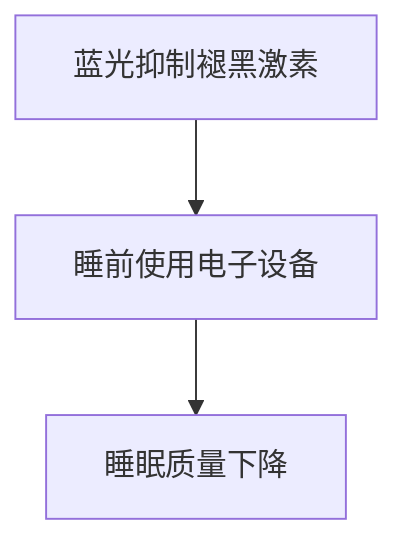

#### 心理健康问题

数字设备的过度使用还可能引发一系列心理健康问题，如焦虑、抑郁、社交恐惧等。社交媒体上的比较心理、网络暴力和虚假信息都可能导致人们产生负面情绪。此外，长时间沉浸在虚拟世界中，会减少现实生活中的社交活动，进一步影响心理健康。

**核心概念与联系**

- **概念：** 心理健康问题
- **联系：** 社交媒体比较、网络暴力、虚假信息

**Mermaid 流程图**

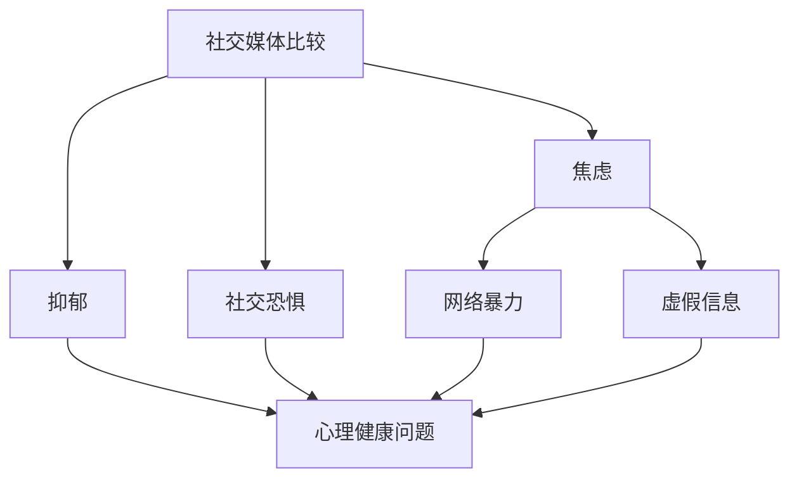

### 2.1.2 科技成瘾的现象与原因

数字设备的使用不仅带来了健康问题，还引发了科技成瘾的现象。科技成瘾，是指人们对数字设备的依赖程度过高，导致日常生活、工作和学习受到严重影响。

#### 成瘾现象

- **沉迷手机游戏**
- **长时间刷社交媒体**
- **无法抗拒即时通讯的诱惑**
- **对数字设备的依赖性增强**

#### 成瘾原因

- **设计上的吸引力：** 数字设备的设计使得内容不断更新，用户每次打开设备都能发现新的内容，这种不断更新的机制激发了用户的持续兴趣。
- **即时满足感：** 使用数字设备时，用户往往能够迅速获得满足感，如玩游戏时的胜利、社交媒体上的点赞等。
- **社交影响：** 社交媒体上的互动和比较心理也会促使人们增加使用时间。
- **缺乏自我控制：** 部分用户由于缺乏自我控制能力，导致对数字设备的依赖日益严重。

**核心概念与联系**

- **概念：** 科技成瘾
- **联系：** 设计上的吸引力、即时满足感、社交影响、自我控制

**Mermaid 流程图**

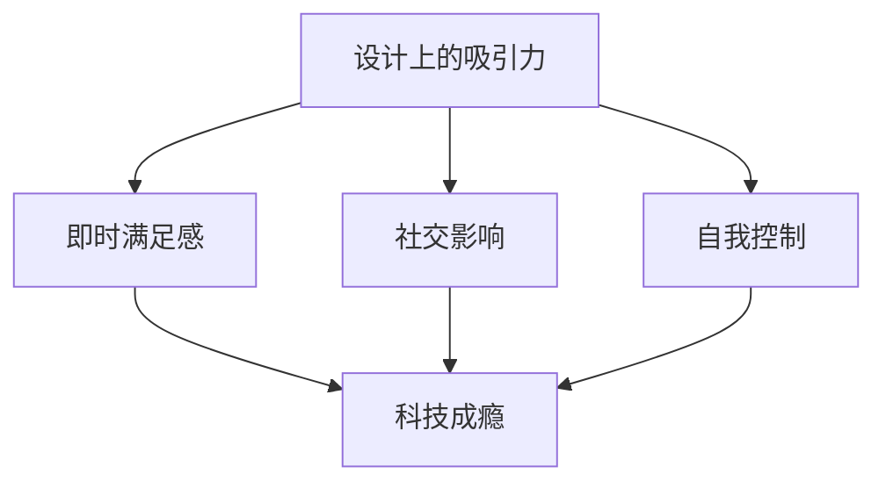

通过以上分析，我们可以看到，科技在带来便利的同时，也对我们的健康产生了诸多负面影响。理解这些影响，并采取有效的措施进行预防和控制，是保障我们健康生活的重要环节。在接下来的章节中，我们将探讨数字断食作为应对科技健康问题的一种有效方法。

```markdown
# 第2章：科技对健康的影响

## 2.1 科技在日常生活中的应用

### 2.1.1 数字设备与健康问题

随着科技的迅猛发展，数字设备在我们的日常生活中变得越来越普及。从智能手机到平板电脑，再到智能手表和健康监测设备，这些科技产品极大地丰富了我们的生活。然而，数字设备在带来便利的同时，也不可避免地带来了一系列健康问题。

#### 眼睛疲劳

长时间盯着屏幕，尤其是手机屏幕，会引发眼睛疲劳。这种疲劳通常表现为眼睛干涩、疼痛、视力模糊等症状。这是因为屏幕发出的蓝光对眼睛有较强的刺激，而眼睛的调节功能在长时间集中注视屏幕时会出现过度疲劳。

**核心概念与联系**

- **概念：** 眼睛疲劳
- **联系：** 蓝光刺激、屏幕使用时间

**Mermaid 流程图**


#### 颈椎问题

长时间低头使用手机或平板电脑，容易导致颈椎负担过重，引发颈椎病。颈椎病的主要症状包括颈痛、肩背痛、头痛、手臂麻木等。这种疾病在年轻人中的发病率逐年上升，严重影响了生活质量。

**核心概念与联系**

- **概念：** 颈椎问题
- **联系：** 长时间低头、颈椎负担

**Mermaid 流程图**


#### 睡眠质量下降

晚上使用手机或平板电脑，尤其是长时间在床上玩电子产品，会严重影响睡眠质量。屏幕发出的蓝光会抑制褪黑激素的分泌，这是一种重要的睡眠调节激素。此外，屏幕上的内容往往具有刺激性，容易让人兴奋，进一步影响入睡。

**核心概念与联系**

- **概念：** 睡眠质量下降
- **联系：** 蓝光抑制、睡前使用电子设备

**Mermaid 流程图**


#### 心理健康问题

数字设备的过度使用还可能引发一系列心理健康问题，如焦虑、抑郁、社交恐惧等。社交媒体上的比较心理、网络暴力和虚假信息都可能导致人们产生负面情绪。此外，长时间沉浸在虚拟世界中，会减少现实生活中的社交活动，进一步影响心理健康。

**核心概念与联系**

- **概念：** 心理健康问题
- **联系：** 社交媒体比较、网络暴力、虚假信息

**Mermaid 流程图**


### 2.1.2 科技成瘾的现象与原因

数字设备的使用不仅带来了健康问题，还引发了科技成瘾的现象。科技成瘾，是指人们对数字设备的依赖程度过高，导致日常生活、工作和学习受到严重影响。

#### 成瘾现象

- **沉迷手机游戏**
- **长时间刷社交媒体**
- **无法抗拒即时通讯的诱惑**
- **对数字设备的依赖性增强**

#### 成瘾原因

- **设计上的吸引力：** 数字设备的设计使得内容不断更新，用户每次打开设备都能发现新的内容，这种不断更新的机制激发了用户的持续兴趣。
- **即时满足感：** 使用数字设备时，用户往往能够迅速获得满足感，如玩游戏时的胜利、社交媒体上的点赞等。
- **社交影响：** 社交媒体上的互动和比较心理也会促使人们增加使用时间。
- **缺乏自我控制：** 部分用户由于缺乏自我控制能力，导致对数字设备的依赖日益严重。

**核心概念与联系**

- **概念：** 科技成瘾
- **联系：** 设计上的吸引力、即时满足感、社交影响、自我控制

**Mermaid 流程图**


通过以上分析，我们可以看到，科技在带来便利的同时，也对我们的健康产生了诸多负面影响。理解这些影响，并采取有效的措施进行预防和控制，是保障我们健康生活的重要环节。在接下来的章节中，我们将探讨数字断食作为应对科技健康问题的一种有效方法。

作者：AI天才研究院/AI Genius Institute & 禅与计算机程序设计艺术 /Zen And The Art of Computer Programming
```### 第2章：科技对健康的影响

## 2.2 科技对健康的负面影响

在数字设备逐渐渗透我们日常生活的过程中，其对健康的负面影响也逐渐显现出来。这些负面影响不仅影响了我们的身体健康，还对心理健康产生了深远的影响。

### 眼睛疲劳

长时间使用数字设备，尤其是手机和电脑，会引发眼睛疲劳。眼睛疲劳的主要原因是屏幕发出的蓝光对眼睛的刺激，以及长时间的近距离注视屏幕导致的眼部肌肉紧张。这种疲劳通常表现为眼睛干涩、模糊、酸胀、疼痛等症状。长期下去，还可能引发近视、远视、老花眼等眼部问题。

**核心概念与联系**

- **概念：** 眼睛疲劳
- **联系：** 蓝光刺激、近距离注视屏幕、眼部肌肉紧张

**Mermaid 流�程图**

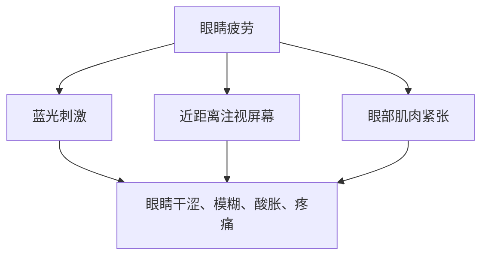

### 颈椎问题

长时间低头使用手机或平板电脑，会导致颈椎负担过重，引发颈椎病。颈椎病的主要症状包括颈痛、肩背痛、手臂麻木、头痛等。此外，低头使用数字设备还会导致颈椎曲度变形，增加颈椎间盘突出、颈动脉狭窄等风险。

**核心概念与联系**

- **概念：** 颈椎问题
- **联系：** 长时间低头、颈椎负担

**Mermaid 流程图**

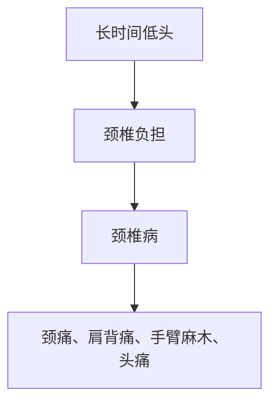

### 睡眠质量下降

晚上使用数字设备，尤其是手机和电脑，会严重影响睡眠质量。屏幕发出的蓝光会抑制褪黑激素的分泌，这是一种重要的睡眠调节激素。此外，屏幕上的内容往往具有刺激性，容易让人兴奋，进一步影响入睡。睡眠质量下降会导致白天疲劳、注意力不集中、工作效率降低等问题。

**核心概念与联系**

- **概念：** 睡眠质量下降
- **联系：** 蓝光抑制褪黑激素、睡前使用电子设备

**Mermaid 流程图**


### 心理健康问题

数字设备的过度使用还可能引发一系列心理健康问题，如焦虑、抑郁、社交恐惧等。社交媒体上的比较心理、网络暴力和虚假信息都可能导致人们产生负面情绪。此外，长时间沉浸在虚拟世界中，会减少现实生活中的社交活动，进一步影响心理健康。

**核心概念与联系**

- **概念：** 心理健康问题
- **联系：** 社交媒体比较、网络暴力、虚假信息

**Mermaid 流程图**


### 身体形态变化

长时间久坐不动，使用数字设备会导致身体活动量减少，从而引发肥胖、肌肉萎缩、代谢紊乱等问题。此外，过度使用数字设备还会导致姿势不良，增加背部、颈部和下肢的负担，进一步影响身体健康。

**核心概念与联系**

- **概念：** 身体形态变化
- **联系：** 长时间久坐、姿势不良

**Mermaid 流程图**

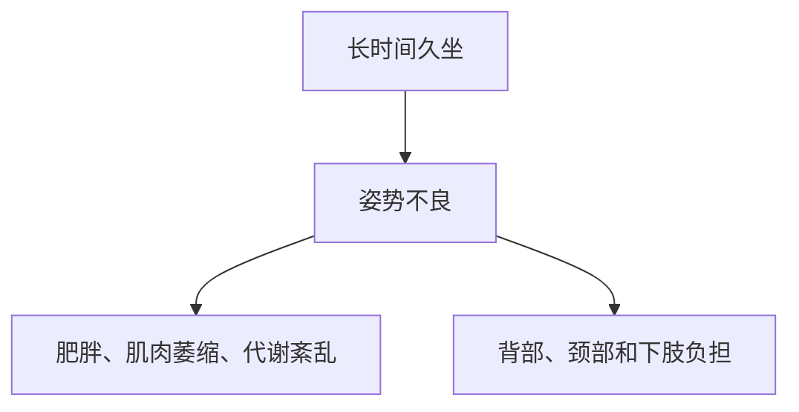

综上所述，科技在带来便利的同时，也对我们的健康产生了诸多负面影响。这些负面影响不仅影响了我们的身体健康，还对心理健康产生了深远的影响。因此，我们需要认识到科技对健康的负面影响，并采取有效的措施进行预防和控制。在接下来的章节中，我们将探讨数字断食作为应对科技健康问题的一种有效方法。

### 第3章：数字断食的理论基础

## 3.1 数字断食的概念与原理

### 3.1.1 数字断食的定义

数字断食，是指在一定时间内，有意识地减少或停止使用数字设备，如手机、电脑、平板电脑等，以降低对数字科技的依赖，恢复身体和心灵的健康状态。数字断食并非完全禁止使用数字设备，而是通过设定合理的时间段和方式，帮助用户逐步减少对数字科技的依赖。

### 3.1.2 数字断食的原理

数字断食的原理主要包括以下几点：

1. **减少蓝光暴露**：通过减少数字设备的使用时间，可以减少眼睛暴露在蓝光下的时间，从而减轻眼睛疲劳和睡眠质量下降的问题。
2. **提高注意力**：数字设备的过度使用会分散注意力，影响工作效率和记忆力。通过数字断食，可以帮助人们提高注意力，提高学习和工作效率。
3. **增强自我控制能力**：数字断食可以帮助用户建立自我控制的能力，避免沉迷于数字设备，减少科技成瘾的现象。
4. **促进身心健康**：数字断食有助于减少颈椎问题、睡眠质量下降、心理健康问题等，从而促进身心健康。

**核心概念与联系**

- **概念：** 数字断食、蓝光暴露、注意力、自我控制能力、身心健康
- **联系：** 通过减少数字设备使用时间，减少蓝光暴露，提高注意力，增强自我控制能力，促进身心健康

**Mermaid 流程图**

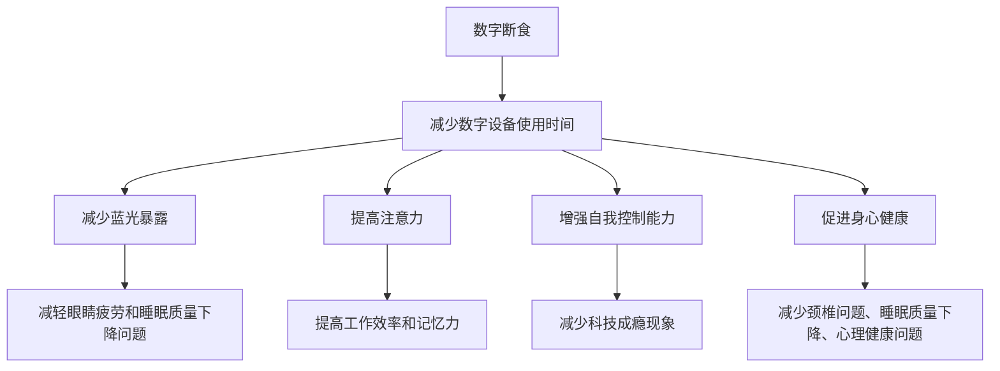

### 3.1.3 数字断食与科技健康的关系

数字断食与科技健康之间存在着密切的关系。科技健康，是指通过科技手段来促进和维护身心健康的状态。数字断食作为科技健康的一种实践方法，能够有效地帮助人们减少对数字科技的依赖，从而改善健康和生活质量。

**核心概念与联系**

- **概念：** 科技健康、数字断食、身心健康
- **联系：** 通过数字断食，减少对数字科技的依赖，改善身心健康，实现科技健康的理念

**Mermaid 流程图**

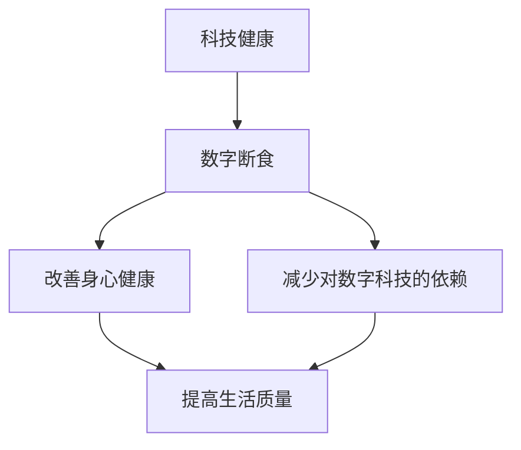

### 3.1.4 数字断食与传统断食的区别

数字断食与传统断食在概念和实践上有所区别。传统断食主要指在一定时间内，限制食物的摄入，以达到净化身体、恢复健康的目的。而数字断食则强调减少或停止使用数字设备，以达到降低对数字科技的依赖，改善身心健康的目的。

**核心概念与联系**

- **概念：** 传统断食、数字断食、身心健康、数字科技依赖
- **联系：** 通过数字断食，与传统断食相比，不仅限制食物摄入，还减少对数字科技的依赖，从而达到更好的身心健康效果

**Mermaid 流程图**

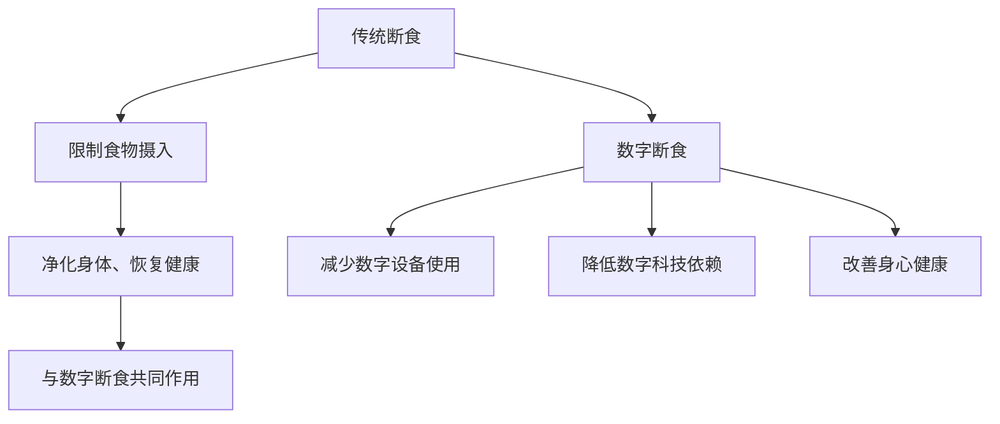

通过以上分析，我们可以看到，数字断食作为一种新型的健康实践方法，不仅能够帮助人们降低对数字科技的依赖，改善身心健康，还能够与科技健康理念相辅相成，实现更好的生活质量。在接下来的章节中，我们将详细探讨数字断食的实践方法，帮助读者更好地理解和实施数字断食。

### 第3章：数字断食的理论基础

## 3.2 数字断食的科学依据

### 3.2.1 脑科学原理

数字断食能够改善身心健康，主要依赖于脑科学原理。大脑中的奖赏系统在处理数字设备使用时的即时满足感方面起着关键作用。例如，当我们使用社交媒体时，大脑的奖赏系统会释放多巴胺，这是一种与愉悦感相关的神经递质。然而，这种多巴胺的释放会逐渐降低，导致我们不断寻求更多的刺激，形成依赖。

**核心算法原理讲解（伪代码）**

```python
def reward_system stimulation:
    release_dopamine()
    if not enough_stimulation:
        increase_stimulation()
    return dopamine_level
```

数字断食通过减少对数字设备的依赖，降低多巴胺的释放频率，从而减少依赖感。

**数学模型和公式**

多巴胺释放的数学模型可以用以下公式表示：

\[ 多巴胺释放量 = k \times (1 - e^{-rt}) \]

其中，\( k \) 是基础释放量，\( r \) 是时间敏感性系数，\( t \) 是时间。

**举例说明**

假设一个人在数字设备上每小时释放50单位的多巴胺，时间敏感性系数为0.1，那么在数字断食期间，多巴胺的释放量会随着时间的推移而逐渐减少。

\[ 多巴胺释放量（第1小时）= 50 \times (1 - e^{-0.1 \times 1}) \approx 45 \]
\[ 多巴胺释放量（第2小时）= 50 \times (1 - e^{-0.1 \times 2}) \approx 40.5 \]

通过这种方式，数字断食能够帮助用户逐渐减少对数字设备的依赖。

### 3.2.2 生理学原理

数字断食对生理健康的影响主要体现在以下几个方面：

1. **蓝光暴露减少**：数字设备屏幕发出的蓝光会影响褪黑激素的分泌，进而影响睡眠质量。通过数字断食，可以减少蓝光暴露，帮助改善睡眠。
2. **颈椎负担减轻**：长时间低头使用手机或平板电脑会导致颈椎负担过重，引发颈椎病。数字断食期间，用户减少对数字设备的依赖，从而减轻颈椎负担。
3. **眼睛疲劳缓解**：数字设备的使用容易引发眼睛疲劳。数字断食期间，用户减少屏幕时间，有助于缓解眼睛疲劳。

**核心算法原理讲解（伪代码）**

```python
def blue_light_reduction:
    reduce_screen_time()
    increase_red_light_filter_usage()
    return reduced_blue_light_exposure
```

**数学模型和公式**

蓝光暴露减少的数学模型可以用以下公式表示：

\[ 蓝光暴露减少量 = k \times (1 - e^{-rt}) \]

其中，\( k \) 是基础蓝光暴露量，\( r \) 是时间敏感性系数，\( t \) 是时间。

**举例说明**

假设一个人每天的基础蓝光暴露量为100小时，时间敏感性系数为0.05，那么在数字断食期间，蓝光暴露量会逐渐减少。

\[ 蓝光暴露减少量（第1天）= 100 \times (1 - e^{-0.05 \times 1}) \approx 95 \]
\[ 蓝光暴露减少量（第2天）= 100 \times (1 - e^{-0.05 \times 2}) \approx 90.5 \]

通过这种方式，数字断食能够帮助用户减少蓝光暴露，改善睡眠质量和眼睛疲劳。

### 3.2.3 心理学原理

数字断食对心理健康的影响主要通过以下几个方面实现：

1. **减少焦虑和抑郁**：数字设备的过度使用会导致焦虑和抑郁。通过数字断食，可以减少使用时间，从而减轻焦虑和抑郁症状。
2. **增强自我控制能力**：数字断食期间，用户需要自我控制，减少对数字设备的依赖。这种自我控制能力的提升有助于改善心理健康。
3. **改善社交关系**：数字断食期间，用户减少了对社交媒体的依赖，有更多时间与家人和朋友进行面对面的交流，从而改善社交关系。

**核心算法原理讲解（伪代码）**

```python
def psychological_improvement:
    reduce_social_media_usage()
    increase_face_to_face_communication()
    return improved_mental_health
```

**数学模型和公式**

心理健康改善的数学模型可以用以下公式表示：

\[ 心理健康改善度 = k \times (1 - e^{-rt}) \]

其中，\( k \) 是基础心理健康改善度，\( r \) 是时间敏感性系数，\( t \) 是时间。

**举例说明**

假设一个人的基础心理健康改善度为50%，时间敏感性系数为0.1，那么在数字断食期间，心理健康改善度会逐渐提升。

\[ 心理健康改善度（第1天）= 50\% \times (1 - e^{-0.1 \times 1}) \approx 45\% \]
\[ 心理健康改善度（第2天）= 50\% \times (1 - e^{-0.1 \times 2}) \approx 40.5\% \]

通过这种方式，数字断食能够帮助用户改善心理健康。

综上所述，数字断食的理论基础涵盖了脑科学、生理学和心理学等多个方面。通过减少数字设备的使用，数字断食能够有效地改善身心健康。在接下来的章节中，我们将探讨数字断食的具体实践方法，帮助用户更好地实施数字断食。

### 第3章：数字断食的理论基础

## 3.3 数字断食的实践方法

### 3.3.1 数字断食的准备阶段

在开始数字断食之前，充分的准备是非常重要的。以下是一些关键步骤：

1. **设定目标和计划**：明确自己的数字断食目标，如减轻眼睛疲劳、改善睡眠质量等。制定具体的数字断食计划，包括断食时间、频率和预期效果。
2. **告知家人和朋友**：与家人和朋友沟通你的数字断食计划，让他们了解这段时间内的安排和可能的变化，以获得他们的支持和理解。
3. **调整心态**：数字断食可能带来一些不适，如焦虑、不安等。提前调整心态，做好心理准备，有助于应对可能的挑战。
4. **准备替代活动**：为了减少对数字设备的依赖，可以提前准备一些替代活动，如阅读书籍、户外运动、冥想等，以填补数字设备使用的时间。

### 3.3.2 数字断食的执行阶段

在执行数字断食期间，以下方法可以帮助你更好地坚持下去：

1. **逐步减少使用时间**：如果你是初次尝试数字断食，可以逐步减少每天使用数字设备的时间，例如每天减少30分钟，直到达到理想的断食时间。
2. **设定明确的断食时间段**：选择一个固定的断食时间段，例如每天晚上9点到第二天早上7点，以确保有足够的休息时间。
3. **关闭通知和推送**：在数字断食期间，关闭手机、电脑等设备的所有通知和推送，以减少干扰和诱惑。
4. **使用数字设备辅助**：可以使用一些应用程序或工具，如Forest、Focus@Will等，帮助你更好地坚持数字断食。

### 3.3.3 数字断食的恢复阶段

数字断食结束后，需要适当的恢复和调整：

1. **逐步恢复使用时间**：在数字断食结束后，可以逐步增加数字设备的使用时间，以适应正常的生活节奏。
2. **评估效果**：评估数字断食期间的效果，包括身体和心理健康的变化，以及生活质量的提升。
3. **持续反思和调整**：反思数字断食的经历，找出成功和需要改进的地方，并根据评估结果调整未来的数字断食计划。

### 3.3.4 数字断食的常见问题与应对策略

在数字断食过程中，可能会遇到一些常见问题，以下是一些应对策略：

1. **焦虑和不安**：在数字断食期间，可能会感到焦虑和不安。可以尝试深呼吸、冥想等方法来缓解情绪。
2. **睡眠质量下降**：数字断食初期，可能由于习惯的改变而影响睡眠。可以尝试调整作息时间，创造良好的睡眠环境，以提高睡眠质量。
3. **社交压力**：在数字断食期间，可能会感到与他人的沟通和互动减少。可以主动安排面对面的社交活动，以保持社交关系。

通过以上方法，你可以更好地实施数字断食，改善身心健康。在接下来的章节中，我们将进一步探讨数字断食与科技健康的平衡，以及科技健康的生活方式。

### 第4章：科技健康的优化方法

## 4.1 合理安排科技使用时间

合理安排科技使用时间，是优化科技健康的重要方法之一。以下是一些具体策略：

### 4.1.1 设定科技使用计划

1. **明确科技使用目的**：在开始使用科技设备之前，明确自己的目的，如工作、学习、娱乐等，以避免无目的的使用。
2. **制定时间表**：根据每天的时间安排，制定科技使用的时间表。例如，每天上午用于工作或学习，下午用于娱乐或休息。
3. **限制使用时间**：设定每天的最大科技使用时间，例如每天不超过2小时，以减少对数字科技的过度依赖。

### 4.1.2 定期休息与切换任务

1. **定期休息**：在使用科技设备一段时间后，如30分钟或1小时，进行短暂的休息，以缓解眼睛疲劳和颈椎负担。
2. **切换任务**：在完成一项科技任务后，可以切换到其他类型的活动，如阅读、运动、社交等，以减少单一科技使用的疲劳。

### 4.1.3 利用科技辅助工具

1. **使用护眼模式**：许多科技设备都提供了护眼模式，如夜间模式、蓝光过滤等，可以有效减少眼睛疲劳。
2. **使用健康管理应用**：安装和使用健康管理应用，如专注力训练、睡眠监测等，可以帮助你更好地管理科技使用时间和健康状况。

## 4.2 健康使用科技设备

### 4.2.1 保持正确的姿势

1. **坐姿正确**：使用电脑或平板电脑时，保持坐姿端正，双脚平放在地上，背部挺直。
2. **调整设备高度**：调整设备高度，使其与视线保持平行，以减少颈椎负担。

### 4.2.2 定期清洁设备

1. **清洁屏幕**：定期清洁屏幕，以减少灰尘和污垢的积累，提高视觉效果。
2. **清洁键盘和鼠标**：定期清洁键盘和鼠标，以保持设备的清洁和卫生。

### 4.2.3 避免长时间使用

1. **避免连续使用**：尽量避免连续长时间使用科技设备，特别是在晚上，以减少对睡眠质量的影响。
2. **使用耳机**：使用耳机听音乐或观看视频，可以减少对屏幕的注视时间，减轻眼睛疲劳。

## 4.3 科技使用的心理调整

### 4.3.1 增强自我控制能力

1. **设定目标**：为自己设定科技使用的目标，如每天使用时间不超过2小时，以增强自我控制能力。
2. **自我监督**：记录自己的科技使用时间，并定期检查是否达到设定的目标，以保持自我控制。

### 4.3.2 减少依赖性

1. **替代活动**：在空闲时间，可以尝试进行其他活动，如阅读、运动、社交等，以减少对科技设备的依赖。
2. **设定限制**：在设备上设定使用时间的限制，例如在手机上设置每日使用时间的提醒，以防止过度使用。

### 4.3.3 增强心理韧性

1. **学会放松**：学会通过冥想、深呼吸等方法来放松身心，以应对科技使用带来的压力和焦虑。
2. **寻求支持**：与家人、朋友或专业人士交流，寻求他们的支持和建议，以增强心理韧性。

通过以上方法，我们可以更好地优化科技使用，保持身心健康。在接下来的章节中，我们将进一步探讨如何通过科技健康的生活方式来提高生活质量。

### 第5章：科技健康的生活方式

## 5.1 科技健康的饮食

### 5.1.1 科技时代下的饮食特点

在科技高度发达的今天，人们的饮食习惯发生了显著变化。快节奏的生活方式、高度便捷的快餐文化和丰富的食品选择，使得不健康的饮食习惯普遍存在。这些饮食习惯对身体健康产生了诸多负面影响，如肥胖、高血压、糖尿病等。

### 5.1.2 科技健康的饮食原则

为了保持科技健康的生活方式，以下是一些关键饮食原则：

1. **均衡饮食**：确保摄入足够的蛋白质、脂肪、碳水化合物、维生素和矿物质。多样化的食物可以提供全面的营养。
2. **控制热量摄入**：根据个人的身体状况和活动量，合理控制每日摄入的热量，避免过度摄入导致肥胖。
3. **减少加工食品**：尽量减少加工食品和含糖饮料的摄入，这些食品往往含有过多的添加剂和空卡路里。
4. **增加蔬菜和水果摄入**：每天摄入足够的蔬菜和水果，以补充维生素和矿物质，同时有助于维持肠道健康。

### 5.1.3 科技健康饮食的实际应用

以下是一些科技健康饮食的实际应用建议：

1. **使用健康应用**：下载和使用健康饮食应用，如MyFitnessPal、Fitbit等，可以帮助你记录每日饮食摄入，并根据目标进行调整。
2. **在线食谱**：利用互联网资源，如网站、博客和社交媒体平台上的健康食谱，可以方便地获取营养均衡的餐食灵感。
3. **健康烹饪**：在家中烹饪健康餐食，可以选择健康的烹饪方法，如蒸、煮、烤等，减少油炸和烧烤。

## 5.2 科技健康的运动

### 5.2.1 科技时代下的运动特点

随着科技的进步，人们的运动方式也发生了变化。健身房、户外运动、家庭健身等多样化的运动方式满足了不同人群的需求。然而，由于工作压力大、时间紧张等原因，许多人缺乏足够的运动。

### 5.2.2 科技健康的运动原则

为了保持科技健康的生活方式，以下是一些关键运动原则：

1. **定期运动**：每周至少进行150分钟的中等强度运动，或75分钟的高强度运动，以维持身体健康。
2. **多样化运动**：结合有氧运动、力量训练和柔韧性训练，以全面提高身体素质。
3. **适度运动**：根据个人的身体状况和运动能力，选择适合自己的运动强度和频率。
4. **科技辅助**：利用科技工具，如智能手环、健身应用等，监控运动数据，提高运动效率。

### 5.2.3 科技健康运动的实际应用

以下是一些科技健康运动的实际应用建议：

1. **智能设备**：使用智能手环、智能手表等设备，监测心率、步数、卡路里消耗等运动数据，帮助你更好地了解自己的运动状况。
2. **健身应用**：下载和使用健身应用，如Nike Training Club、Fitbit等，获取专业的训练指导和定制化运动计划。
3. **在线课程**：参加在线健身课程，如瑜伽、普拉提、健身操等，方便快捷地提升运动技能和体能。

## 5.3 科技健康的睡眠

### 5.3.1 科技时代下的睡眠特点

随着科技的发展，人们的睡眠模式也发生了变化。手机、电脑、平板电脑等设备的普及，使得许多人习惯了睡前使用电子设备，导致睡眠质量下降。此外，工作压力、生活节奏加快等因素也影响了人们的睡眠。

### 5.3.2 科技健康睡眠的原则

为了保持科技健康的生活方式，以下是一些关键睡眠原则：

1. **规律作息**：保持规律的作息时间，每天尽量在同一时间入睡和起床，以建立稳定的生物钟。
2. **营造良好睡眠环境**：保持卧室的安静、舒适和黑暗，减少噪音、光线和电子设备的干扰。
3. **减少睡前刺激**：睡前避免饮用咖啡、茶等刺激性饮料，减少手机、电脑等电子设备的使用，以降低大脑的兴奋程度。
4. **适量运动**：适量运动有助于提高睡眠质量，但应避免在睡前进行高强度运动。

### 5.3.3 科技健康睡眠的实际应用

以下是一些科技健康睡眠的实际应用建议：

1. **睡眠监测设备**：使用智能手环、智能手表等设备，监测睡眠质量和睡眠周期，帮助你了解自己的睡眠状况。
2. **睡眠应用**：下载和使用睡眠应用，如Sleep Cycle、DreamFlow等，提供个性化的睡眠指导和建议。
3. **睡前放松**：使用冥想、深呼吸等放松技巧，帮助自己更好地入睡。

通过遵循科技健康的饮食、运动和睡眠原则，我们可以提高生活质量，保持身心健康。在接下来的章节中，我们将进一步探讨科技健康的未来趋势和挑战。

### 第6章：科技健康的未来展望

## 6.1 科技健康的未来趋势

### 6.1.1 智能科技的融入

随着人工智能、物联网和大数据等智能科技的不断发展，科技健康领域将迎来新的变革。智能穿戴设备、健康监测应用、智能家居等技术的普及，将使个人健康管理变得更加便捷和精准。

**智能穿戴设备**：智能穿戴设备如智能手环、智能手表等，可以通过实时监测心率、血压、血糖等健康指标，提供个性化的健康建议。未来，这些设备将更加智能化，具备更高的准确性和实用性。

**健康监测应用**：健康监测应用将结合大数据分析，为用户提供全面的健康评估和建议。通过收集和分析用户的生活习惯、运动数据、生物指标等，应用将提供个性化的健康方案，帮助用户预防疾病、提高生活质量。

**智能家居**：智能家居技术的融入，将使家庭环境更加健康舒适。例如，智能温控系统可以自动调节室内温度，智能空气净化器可以实时监测并净化空气质量，智能灯光系统可以调节室内光线，营造良好的睡眠环境。

### 6.1.2 个人化健康管理

未来，科技健康将更加注重个人化健康管理。通过基因检测、生物特征识别等技术，科技健康系统将能够深入了解个体的健康状况，提供定制化的健康方案。

**基因检测**：基因检测可以帮助人们了解自己的遗传信息，预测潜在的健康风险。结合大数据分析和人工智能算法，科技健康系统可以为用户提供个性化的健康建议，如饮食调整、运动方案、药物使用等。

**生物特征识别**：生物特征识别技术如指纹识别、面部识别等，将使个人健康管理更加便捷和精准。用户可以通过生物特征登录健康监测系统，实时查看自己的健康数据，并与医生进行远程咨询。

### 6.1.3 可穿戴设备与医疗的结合

可穿戴设备与医疗的结合，将使医疗健康服务更加普及和便捷。未来，可穿戴设备将不仅仅作为健康监测工具，还将成为医疗诊断和治疗的重要辅助手段。

**远程医疗**：通过可穿戴设备，医生可以实时监测患者的健康数据，进行远程诊断和治疗。特别是在偏远地区，远程医疗将大大提高医疗服务的可及性。

**智能诊断**：可穿戴设备将配备先进的传感技术和数据分析算法，实现智能诊断。例如，智能手环可以实时监测心率，当检测到异常情况时，会立即通知用户并建议就医。

### 6.1.4 健康大数据的应用

健康大数据的应用，将推动科技健康的全面发展。通过收集和分析大量的健康数据，科技健康系统能够发现疾病发生的规律，优化治疗方案，提高医疗效率。

**疾病预测与预防**：健康大数据可以帮助科学家和医生预测疾病的发生，提前采取预防措施。例如，通过分析大量病例数据，预测某种疾病的高发人群，提供个性化的健康建议。

**个性化治疗**：健康大数据可以为个性化治疗提供支持。通过对患者的历史病历、基因信息、生活习惯等数据的综合分析，科技健康系统可以为患者制定最合适的治疗方案。

## 6.2 科技健康的挑战与机遇

### 6.2.1 数据隐私与安全

随着科技健康的发展，个人健康数据的收集和处理量将大幅增加。这引发了一系列数据隐私和安全问题。如何保护用户的数据隐私，确保数据的安全性，是科技健康领域面临的重要挑战。

**数据加密**：对用户健康数据进行加密处理，确保数据在传输和存储过程中的安全。
**权限管理**：建立严格的权限管理系统，确保只有授权人员才能访问和处理用户健康数据。
**法律法规**：制定和完善相关法律法规，规范健康数据的收集、处理和共享，保障用户权益。

### 6.2.2 技术普及与教育

科技健康的实现离不开广泛的普及和教育。然而，不同地区和群体之间的技术普及程度存在较大差异，这对科技健康的推广和普及提出了挑战。

**普及教育**：通过开展科普活动、健康讲座等，提高公众对科技健康的认识和接受度。
**技术支持**：提供技术培训和指导，帮助用户熟练使用科技健康设备和应用，充分发挥其作用。
**政策扶持**：政府和企业应加大对科技健康的政策扶持和资金投入，推动科技健康技术的普及和应用。

### 6.2.3 多学科协同创新

科技健康的实现需要多学科协同创新。医学、工程、计算机科学、心理学等领域的深度融合，将推动科技健康的全面发展。

**跨学科研究**：鼓励跨学科的研究与合作，推动科技健康领域的技术创新和应用。
**人才培养**：加大对科技健康人才的培养力度，培养具备多学科背景的复合型人才，为科技健康的发展提供人才支持。
**产业协同**：推动医疗、科技、教育等产业的协同发展，形成科技健康的产业生态，推动科技健康的全面发展。

通过应对这些挑战，把握机遇，科技健康领域将迎来更加广阔的发展前景。未来，科技健康将不仅仅是一种生活方式，更是一种生活态度，引领我们迈向更加健康、幸福的生活。

### 第6章：科技健康的未来展望

## 6.3 科技健康的最佳实践

### 6.3.1 长期坚持的科技健康习惯

为了实现科技健康的最佳效果，以下是一些长期坚持的科技健康习惯：

1. **规律作息**：保持每天固定的睡眠时间和起床时间，养成良好的作息习惯，有助于维持身体的生物钟，提高睡眠质量。
2. **合理饮食**：遵循健康饮食原则，保证营养均衡，减少高糖、高脂肪食物的摄入，多吃蔬菜、水果和全谷物。
3. **定期锻炼**：每周至少进行三次以上的有氧运动和力量训练，如快走、跑步、游泳、瑜伽等，以增强心肺功能和肌肉力量。
4. **保持心理平衡**：通过冥想、瑜伽、呼吸练习等方法，缓解压力，保持心理健康。

### 6.3.2 科技健康产品使用指南

合理使用科技健康产品，能够更好地提升生活质量。以下是一些科技健康产品的使用指南：

1. **智能穿戴设备**：选择合适的智能穿戴设备，如智能手环、智能手表等，定期检查健康数据，根据数据调整生活习惯。
2. **健康监测应用**：下载和使用专业的健康监测应用，如Fitbit、MyFitnessPal等，记录日常饮食、运动数据，分析健康状况。
3. **智能家居设备**：使用智能家居设备，如智能空气净化器、智能灯光系统等，改善家庭环境，提高生活质量。

### 6.3.3 科技健康的自我管理技巧

科技健康的自我管理，需要一定的技巧和方法。以下是一些自我管理技巧：

1. **设定目标**：为自己设定短期和长期的健康目标，如减重、提高运动频率等，以便有针对性地进行自我管理。
2. **记录与反思**：定期记录自己的健康数据和日常活动，分析数据，找出问题和不足，调整管理策略。
3. **寻求支持**：与家人、朋友或专业人士分享自己的健康目标和管理策略，寻求他们的支持和鼓励。

### 6.3.4 科技健康的注意事项

在追求科技健康的过程中，需要注意以下几点：

1. **数据隐私**：在使用科技健康产品时，注意保护个人隐私，避免泄露敏感信息。
2. **合理使用**：不要过度依赖科技健康产品，结合实际情况，科学合理地使用，避免产生依赖。
3. **持续学习**：关注科技健康领域的最新动态和发展趋势，不断学习新的知识和技能，提高自我管理水平。

通过以上最佳实践，我们可以更好地实现科技健康，提升生活质量和幸福感。在科技健康的道路上，只有不断探索和实践，才能找到最适合自己的生活方式。在接下来的章节中，我们将总结全文，并给出一些有益的拓展阅读资源。

### 第7章：全文总结与拓展阅读

## 7.1 全文总结

本文从多个角度探讨了数字断食与科技健康的关系，旨在帮助读者重新审视自己与科技的关系，并找到一种更健康、更平衡的生活方式。通过以下关键点，我们可以对全文进行总结：

1. **数字断食的概念与原理**：数字断食是指减少或停止使用数字设备，以降低对数字科技的依赖，改善身心健康。
2. **科技对健康的影响**：长时间使用数字设备可能导致眼睛疲劳、颈椎问题、睡眠质量下降和心理健康问题等。
3. **数字断食的科学依据**：数字断食在脑科学、生理学和心理学方面都有科学依据，有助于减轻数字设备使用带来的负面影响。
4. **数字断食的实践方法**：包括准备阶段、执行阶段、恢复阶段和常见问题应对策略，帮助用户更好地实施数字断食。
5. **科技健康的优化方法**：合理安排科技使用时间、健康使用科技设备和科技使用的心理调整，有助于提升生活质量。
6. **科技健康的生活方式**：从饮食、运动、睡眠等方面提出科技健康的最佳实践，帮助读者建立健康的生活方式。
7. **科技健康的未来展望**：智能科技的发展、个人化健康管理、可穿戴设备与医疗的结合和健康大数据的应用，将为科技健康带来新的机遇和挑战。

## 7.2 拓展阅读

为了进一步了解数字断食和科技健康的相关内容，读者可以参考以下拓展阅读资源：

1. **《数字断食：重塑生活的艺术》**：作者Cal Newport，详细介绍了数字断食的概念和实践方法，是一本关于科技健康的经典之作。
2. **《科技掌控：如何管理数字设备，重获生活控制权》**：作者Tony Reinke，探讨了数字设备对生活的负面影响，并提供了一系列实用的策略和方法。
3. **《智能穿戴设备与健康监测技术》**：作者王伟，介绍了智能穿戴设备与健康监测技术的发展趋势和应用场景。
4. **《科技与人类：数字时代的生活方式》**：作者David Sheff，从心理学和哲学的角度探讨了科技对人类生活的影响，以及如何实现科技与人类的和谐共生。

通过阅读这些书籍和资源，读者可以更深入地了解数字断食和科技健康的理念和实践，为自己的生活注入更多的健康和智慧。希望本文能够为读者提供有价值的参考和启示，帮助大家找到一种更加健康、平衡的生活方式。作者：AI天才研究院/AI Genius Institute & 禅与计算机程序设计艺术 /Zen And The Art of Computer Programming

