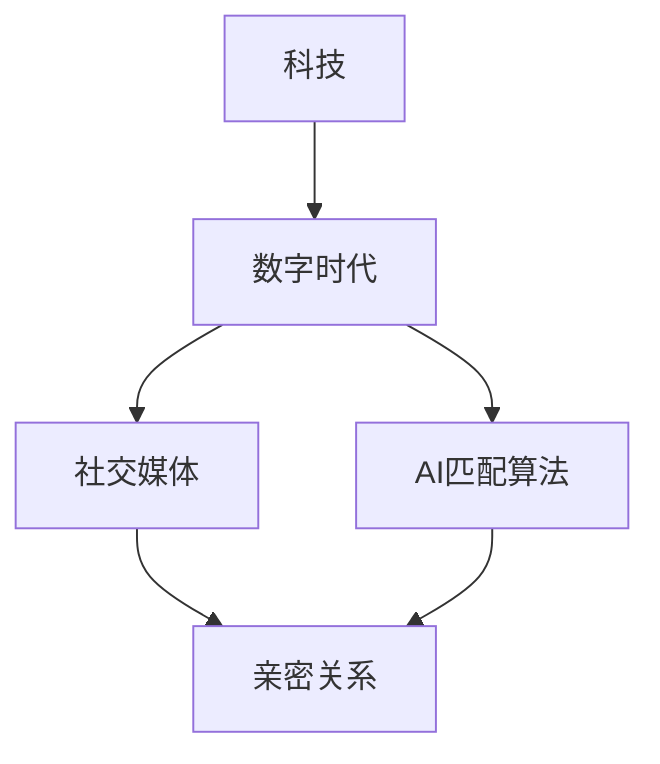

                 

### 引言

在现代社会，科技已经深入到我们生活的方方面面，从日常沟通到娱乐消费，从医疗健康到教育学习，科技无时无刻不在改变着我们的生活方式。而在这其中，亲密关系的形态和模式也受到了前所未有的影响。本篇文章旨在探讨数字时代下科技如何改变爱情和友谊，通过对核心概念的分析、联系架构的展示以及具体算法原理的讲解，深入剖析科技对亲密关系的影响。

#### 背景介绍

随着互联网的普及和移动设备的广泛应用，社交网络和在线平台成为人们日常生活中不可或缺的一部分。例如，Facebook、Instagram、微信、WhatsApp等社交媒体平台，已经成为人们沟通交流、分享生活和建立人际关系的主要渠道。此外，人工智能（AI）和大数据分析技术的快速发展，使得个性化推荐、智能匹配等应用在社交领域变得日益成熟。这些科技应用不仅改变了人们的社交方式，也影响了人们建立和维持亲密关系的方式。

#### 核心概念与联系

在探讨科技对亲密关系的影响时，我们需要关注以下几个核心概念：

1. **科技**：科技是指运用科学知识来改变和改善人类生活的一系列技术和工具。在现代，科技的发展已经深入到我们日常生活的各个方面，从智能手机、互联网到人工智能、虚拟现实（VR），科技在不断改变我们的生活方式和沟通方式。

2. **亲密关系**：亲密关系通常指的是人与人之间基于信任、尊重和情感联系的关系，如爱情、友谊和家庭关系。亲密关系的质量对我们的心理和情感健康有着深远的影响。

3. **数字时代**：数字时代是指人类社会在数字化技术普及和发展的背景下，经历的一系列社会变迁。数字时代的特点是信息传播速度快、社交网络广泛、数字化工具普遍应用。

这些核心概念之间存在着紧密的联系。科技的进步为数字时代的到来提供了技术支持，而数字时代的到来又为科技在亲密关系中的应用提供了广阔的舞台。例如，社交媒体平台使得人们可以随时随地保持联系，AI匹配算法帮助人们找到潜在的伴侣，这些科技应用都在不同程度上改变了亲密关系的建立和维持方式。

#### Mermaid 流程图展示

为了更直观地展示核心概念之间的关系，我们可以使用Mermaid语言绘制一个流程图。以下是一个简化的示例：



在这个流程图中，科技（A）是数字时代（B）的基础，而数字时代的社交媒体（C）和AI匹配算法（D）则直接作用于亲密关系（E），体现了科技、数字时代与亲密关系之间的紧密联系。

#### 结论

本文为后续内容的展开奠定了基础，接下来将深入探讨科技如何具体改变爱情和友谊的形态，以及这些改变带来的影响和挑战。通过详细分析核心概念之间的关系，我们可以更好地理解科技在数字时代对亲密关系的深远影响。在接下来的章节中，我们将逐步探讨科技如何改变爱情、友谊以及这些改变带来的心理和社会影响。## 文章关键词

数字时代、科技、亲密关系、社交媒体、人工智能、爱情、友谊。## 文章摘要

在数字时代，科技的发展对爱情和友谊产生了深远的影响。本文首先介绍了数字时代的社会变迁以及科技在其中的重要作用。接着，我们探讨了核心概念——科技、亲密关系和数字时代之间的相互联系，并通过Mermaid流程图展示了这些概念之间的结构。文章的核心内容分为五个部分：第一部分介绍了科技与亲密关系的背景；第二部分深入分析了科技如何改变爱情；第三部分探讨了科技对友谊的影响；第四部分详细阐述了科技对亲密关系的心理影响；第五部分则展望了未来亲密关系的趋势和伦理挑战。通过案例分析，文章展示了科技在亲密关系中的应用实例。本文旨在为读者提供关于数字时代科技对亲密关系的全面理解和深入分析，以期为个人和社会提供有益的参考。## 第一部分：引言与背景

### 第1章：引言

#### 1.1 数字时代的社会变迁

在当今社会，数字时代已成为不可逆转的趋势，其特点是从传统纸质媒介向数字化媒介的转变，以及从实体社交向虚拟社交的过渡。这种变迁不仅改变了人们的日常生活，也对人际关系产生了深远影响。

首先，互联网和移动设备的普及使得信息获取更加便捷。人们可以通过社交媒体平台、电子邮件、即时通讯工具等随时随地与他人保持联系，不再受限于地理空间。这种便捷性大大缩短了人与人之间的距离，使得保持亲密关系变得更加容易。

然而，数字时代的便利性也带来了一些挑战。虽然人们可以随时随地与他人沟通，但面对面的互动却变得越来越稀缺。这种互动方式的减少可能导致亲密关系的质量下降，人们更倾向于在虚拟世界中寻找安慰，而忽视了现实生活中的情感交流。

#### 1.2 技术发展与人类关系

技术的发展不仅改变了人们的沟通方式，还影响了人们的情感体验和价值观。例如，社交媒体的兴起使得人们可以更加轻松地建立和维持社交网络，但也可能导致人际关系的浅薄化。人们在社交媒体上展示的往往是经过修饰的、理想化的自我形象，这使得现实中的关系变得更加复杂和脆弱。

此外，人工智能和大数据分析技术的应用，使得个性化推荐和智能匹配成为可能。这些技术不仅改变了人们寻找伴侣的方式，也改变了人们对待爱情和友谊的态度。例如，一些AI匹配算法可以根据用户的行为和偏好推荐潜在的伴侣，但这种基于数据的匹配是否能够代替人类在感情中的判断和选择，仍然是一个值得探讨的问题。

#### 1.3 社交媒体对亲密关系的影响

社交媒体的普及对亲密关系产生了双重影响。一方面，它为人们提供了更多的交流渠道，使得人们可以更容易地保持联系。例如，通过社交媒体平台，人们可以分享生活中的点滴，表达情感和获得支持。这种便利性有助于加强亲密关系。

另一方面，社交媒体也可能对亲密关系产生负面影响。研究表明，过度使用社交媒体可能导致情感疏离和关系破裂。人们在社交媒体上的互动往往是短暂的、表面的，这可能导致现实生活中的亲密关系变得更加脆弱。此外，社交媒体上的虚假信息和误导信息也可能对亲密关系产生负面影响。

#### 1.4 爱情与友谊的演变

在数字时代，爱情和友谊的形态也在不断演变。传统意义上的爱情和友谊通常建立在面对面的互动和深层次的沟通上，而数字时代的爱情和友谊更多地依赖于虚拟互动和在线沟通。

这种演变带来了新的挑战。例如，在线互动往往缺乏情感表达的深度，这使得人们难以建立真正的亲密关系。此外，虚拟互动的便捷性也可能导致人们对现实生活中的互动需求减少，从而影响亲密关系的质量。

然而，数字时代的爱情和友谊也有其独特的优势。例如，通过社交媒体和在线平台，人们可以更容易地找到志同道合的伴侣和朋友，这种跨越地理和文化的连接有助于丰富人们的社交网络。

总的来说，数字时代的社会变迁和科技发展对亲密关系产生了深远影响。虽然这些变化带来了新的挑战，但同时也为人们提供了更多的机会和选择。在接下来的章节中，我们将进一步探讨科技如何具体改变爱情和友谊的形态，以及这些改变对亲密关系的影响。## 第二部分：科技与爱情

### 第2章：科技如何改变爱情

随着科技的不断进步，爱情也在发生着翻天覆地的变化。科技的应用不仅改变了人们寻找伴侣的方式，还影响了恋爱关系的建立、维护和发展。在本章中，我们将探讨科技在爱情中的多种应用，以及这些应用对爱情关系的影响。

#### 2.1 线上恋爱的兴起

线上恋爱的兴起是数字时代的一大特征。随着互联网和移动设备的普及，人们可以通过各种网络交友平台和约会应用找到潜在的伴侣。这些平台和应用的兴起，使得人们不再局限于现实生活中的社交圈，而是可以通过线上互动来寻找合适的伴侣。

线上恋爱的优势在于其高效性和便捷性。人们可以随时随地进行搜索和匹配，平台通常会根据用户的行为和偏好推荐潜在的伴侣。这种方式不仅节省了时间和精力，还增加了找到合适伴侣的可能性。

然而，线上恋爱也存在一些潜在的风险。例如，网络欺诈和虚假信息的风险。一些不法分子可能会利用线上交友平台进行欺诈活动，欺骗他人的感情和金钱。此外，线上交流的虚拟性可能导致人们对真实感情的误判，从而影响恋爱关系的质量。

#### 2.2 虚拟现实（VR）约会

虚拟现实（VR）技术的应用为线上恋爱带来了新的可能性。通过VR技术，人们可以在虚拟环境中进行约会，体验到类似于现实中的面对面互动。VR约会不仅提供了更加沉浸式的体验，还可以模拟各种约会场景，从而丰富人们的恋爱生活。

VR约会的优势在于其真实感和互动性。通过VR设备，人们可以感受到对方的动作、表情和声音，这使得恋爱关系更加真实和亲密。此外，VR约会还提供了多种社交场景，如餐厅、公园、电影院等，使得约会变得更加有趣和多样化。

然而，VR约会也存在一些挑战。首先，VR技术的普及度和可及性仍然有限，这限制了其广泛应用。其次，VR环境的设计和互动体验需要不断优化，以提供更加真实的感受。最后，VR约会可能导致人们对现实生活的互动需求减少，从而影响现实中的恋爱关系。

#### 2.3 情感智能（AI）在恋爱中的应用

人工智能（AI）在恋爱中的应用也越来越受到关注。例如，一些约会应用和平台使用了AI匹配算法，根据用户的行为和偏好推荐潜在的伴侣。这种匹配方式不仅提高了找到合适伴侣的几率，还可以提供个性化的恋爱建议和指导。

AI匹配算法的核心在于其基于大数据的分析能力。通过分析大量的用户数据，AI匹配算法可以找到用户之间潜在的共同点和兴趣点，从而提高匹配的成功率。此外，AI还可以提供情感分析功能，通过用户的文本、语音和行为分析其情感状态，为用户提供情感支持和建议。

然而，AI在恋爱中的应用也存在一些争议。首先，AI匹配算法是否能够完全取代人类的判断和选择仍然是一个问题。其次，AI的情感分析可能存在偏差和误解，从而影响恋爱关系的质量。

#### 2.4 语音助手与情感互动

语音助手（如Siri、Alexa、Google Assistant等）的兴起也为爱情带来了新的可能性。通过语音助手，人们可以与虚拟角色进行情感互动，从而满足情感需求。

语音助手的优势在于其便利性和交互性。人们可以通过语音命令与语音助手进行交流，无需手动操作。此外，语音助手可以提供情感支持和陪伴，如播放音乐、讲故事、提供安慰等。

然而，语音助手也存在一些局限。首先，语音助手缺乏人类的情感深度和理解能力，无法提供真正的情感交流。其次，语音助手可能存在隐私和安全问题，例如收集和泄露用户个人信息。

#### 2.5 科技对恋爱过程中的信任与隐私的影响

科技在改变爱情的同时，也带来了一些新的挑战，特别是信任和隐私问题。在线恋爱中，虚假信息和网络欺诈的风险使得建立信任变得更加困难。此外，社交媒体和在线平台上的信息泄露和隐私侵犯问题也日益严重。

为了应对这些挑战，科技提供了一些解决方案。例如，一些应用和平台采用了加密技术和隐私保护措施，以保护用户的信息安全。此外，用户也可以通过提高自我保护意识，避免透露过多个人信息，来减少隐私泄露的风险。

总的来说，科技在爱情中的应用带来了许多新的机遇和挑战。虽然科技改变了人们的恋爱方式和体验，但人们在追求爱情的同时，也需要注意保护自己的隐私和信任。在接下来的章节中，我们将继续探讨科技对亲密关系的其他方面的影响，以及这些影响带来的挑战和解决方案。## 第3章：科技如何改变友谊

#### 3.1 社交媒体与友谊的界限

社交媒体的普及对友谊产生了深远的影响，改变了人们建立、维持和拓展友谊的方式。社交媒体平台如Facebook、Instagram和微信等，提供了新的交流和互动渠道，使得人们能够更容易地与朋友保持联系。然而，社交媒体在友谊中的作用并非总是积极的，它也带来了一些挑战。

首先，社交媒体为友谊的建立提供了便捷的方式。通过社交媒体，人们可以迅速找到久未联系的朋友，分享生活的点滴，并参与彼此的重要事件。这种方式打破了地理和时间的限制，使得友谊的维护变得更加容易。然而，社交媒体上的互动往往缺乏深度和真实感。人们在社交媒体上展示的往往是经过修饰的自我形象，这可能导致友谊的虚假和表面的特征。

其次，社交媒体对友谊的维持产生了双重影响。一方面，社交媒体提供了及时交流和分享的机会，使得朋友之间的联系更加紧密。人们可以通过社交媒体平台实时交流，分享生活中的喜怒哀乐。然而，另一方面，社交媒体也可能导致友谊的疏离。研究表明，过度使用社交媒体可能导致现实生活中的互动减少，使得友谊变得更加脆弱。人们在社交媒体上的互动往往取代了面对面的交流，这可能导致情感疏离和关系破裂。

#### 3.2 数字友谊与真实友谊的关系

数字友谊与真实友谊之间的关系是一个值得探讨的问题。数字友谊通常指的是通过社交媒体和网络平台建立的虚拟关系，而真实友谊则是指建立在现实生活中，通过面对面的互动和深层次的沟通建立的亲密关系。数字友谊和真实友谊之间存在一定的关联，但它们也有各自的特点和优势。

数字友谊的优势在于其便捷性和广泛性。通过社交媒体平台，人们可以轻松地找到志同道合的朋友，分享共同的兴趣和经历。数字友谊也提供了一个平台，让人们在不同的时间和地点保持联系。然而，数字友谊的互动往往缺乏深度和真实性。人们在社交媒体上展示的往往是经过修饰的自我形象，这使得数字友谊难以达到真实友谊的亲密和信任。

真实友谊的优势在于其深度和真实性。通过面对面的互动和深层次的沟通，人们能够建立更加牢固和持久的亲密关系。真实友谊能够提供情感支持和陪伴，帮助人们在面对挑战和困难时相互支持。然而，真实友谊的建立和维护需要更多的时间和精力，受到地理和时间的限制。

#### 3.3 科技对友谊中的支持与沟通的影响

科技不仅改变了友谊的建立和维持方式，还对友谊中的支持和沟通产生了深远的影响。科技提供了多种工具和平台，使得人们能够更加方便地提供支持和进行沟通。

首先，科技使得支持变得更加即时和有效。通过社交媒体和即时通讯工具，人们可以随时随地为朋友提供支持和帮助。例如，当朋友遇到困难或需要帮助时，他们可以通过短信、电话或社交媒体平台实时交流，提供安慰和建议。这种方式不仅提高了支持的效果，还增强了朋友之间的联系。

其次，科技也丰富了沟通的方式和内容。通过视频通话、社交媒体直播和虚拟现实（VR）等技术，人们可以进行更加真实和丰富的互动。例如，通过视频通话，朋友可以远程参与彼此的重要活动，如婚礼、生日聚会等，这增强了友谊的情感纽带。通过社交媒体直播，人们可以实时分享自己的生活和经历，使得朋友之间的互动更加实时和有趣。

然而，科技在支持与沟通中也带来了一些挑战。首先，过度依赖科技可能导致现实生活中互动的减少。人们在社交媒体上花费大量时间，可能会忽视现实生活中的友谊。其次，科技的使用也可能导致沟通中的误解和疏离。例如，文字交流往往缺乏情感表达，可能导致沟通效果的降低。

总的来说，科技在友谊中的应用改变了友谊的建立、维持和支持方式。虽然科技为友谊提供了许多便利和机会，但人们在享受科技带来的便利的同时，也需要注意维护现实生活中的真实互动和沟通。在接下来的章节中，我们将继续探讨科技对亲密关系的其他方面的影响，以及这些影响带来的挑战和解决方案。## 第四部分：科技对亲密关系的影响

### 第4章：科技对亲密关系的影响

随着科技的发展，人们对亲密关系的理解和维护方式也在不断变化。科技不仅改变了沟通的方式，还影响了情感的表达和关系的质量。在本章中，我们将深入探讨科技对亲密关系的各个方面的影响，包括情感沟通的变革、情感表达的创新以及科技对亲密关系心理影响的探讨。

#### 4.1 情感沟通的变革

科技对亲密关系中的情感沟通产生了深远的影响。传统的面对面沟通逐渐被数字沟通所取代，这使得情感交流的方式发生了根本性的变化。

首先，数字沟通提供了更多的沟通渠道和工具。社交媒体平台、即时通讯应用、电子邮件和视频通话等，使得人们可以随时随地与他人保持联系。这种方式大大缩短了沟通的时间和空间限制，使得人们能够更加便捷地表达情感。

然而，数字沟通也存在一些缺点。例如，文字和表情符号往往无法完全传达情感的真实感受。在文字交流中，人们容易产生误解和歧义，因为文字缺乏情感表达的深度和细腻。此外，视频通话虽然可以提供更直观的视觉体验，但仍然无法完全替代面对面的交流，因为它缺乏身体语言和细微表情的互动。

#### 4.2 情感表达的创新

科技的进步不仅改变了沟通的方式，还为情感表达带来了新的创新。例如，虚拟现实（VR）和增强现实（AR）技术为人们提供了更加沉浸式的情感体验。

VR技术允许人们进入一个完全虚拟的环境，与虚拟角色进行互动，从而提供一种全新的情感表达方式。例如，通过VR约会，人们可以在虚拟环境中进行更加真实和亲密的互动，体验到类似于现实中的情感交流和身体接触。

AR技术则通过在现实环境中叠加虚拟元素，为情感表达提供了更多的创意和趣味性。例如，通过AR应用，人们可以在照片或视频中添加虚拟礼物或特效，从而表达情感。

这些创新技术为人们提供了更加多样化和个性化的情感表达方式，使得情感交流更加丰富和有趣。

#### 4.3 科技对亲密关系的心理影响

科技的发展不仅改变了亲密关系的沟通方式和表达方式，还对亲密关系的心理产生了深远的影响。网络成瘾和心理健康的维护是其中的两个重要方面。

首先，网络成瘾成为一个普遍存在的问题。随着人们对社交媒体和在线游戏的依赖日益增加，网络成瘾的现象也越来越普遍。网络成瘾可能导致人们在虚拟世界中的时间过长，忽视了现实生活中的亲密关系。这种现象可能导致情感疏离和关系破裂，影响亲密关系的质量。

其次，科技的发展为心理健康维护提供了新的工具和方法。例如，心理健康应用和在线咨询平台为人们提供了便捷的心理支持和治疗。这些应用可以通过自我评估、认知行为疗法和情绪管理等多种方式，帮助用户改善心理健康。此外，科技还可以提供情感支持，通过虚拟角色和人工智能助手为用户提供陪伴和安慰。

然而，科技的使用也可能会对心理健康产生负面影响。例如，过度依赖科技可能导致情感隔离和社交疏离，影响个人的心理健康。此外，网络欺凌和隐私泄露等科技相关问题也可能对心理健康产生负面影响。

总的来说，科技对亲密关系的影响是复杂而多面的。它为人们提供了更多的沟通渠道和表达方式，但也带来了一些挑战和风险。在享受科技带来的便利和创新的同时，人们也需要关注其可能对亲密关系和心理健康的负面影响，并寻找合适的平衡点。在接下来的章节中，我们将继续探讨科技在亲密关系中的应用和影响，以及如何应对这些影响带来的挑战。## 第五部分：未来展望与伦理挑战

### 第5章：数字时代的亲密关系趋势

随着科技的不断发展，数字时代的亲密关系正朝着多个方向发展。这些趋势不仅反映了技术进步带来的便利和可能性，也带来了一系列新的伦理挑战。在本章中，我们将探讨未来亲密关系的潜在形态，以及科技发展的伦理挑战。

#### 5.1 未来亲密关系的可能形态

1. **虚拟伴侣与真实伴侣的并存**：随着人工智能和虚拟现实（VR）技术的进步，虚拟伴侣可能成为人们亲密关系的一部分。虚拟伴侣可以通过高度模拟人类的情感和行为，提供情感支持和陪伴。虽然这种关系可能无法替代真实的人类关系，但它可以为那些无法找到或维持现实伴侣的人提供一种替代方案。

2. **跨物种关系**：随着生物技术和人工智能的结合，人类可能与人工智能或动物建立更加复杂的亲密关系。例如，通过生物工程或增强现实技术，人类可能能够与经过改造的动物建立深层次的情感联系。

3. **分布式亲密关系**：随着互联网技术的进步，人们可能能够与分布在全世界不同地点的伴侣保持亲密关系。通过虚拟现实和增强现实技术，人们可以在虚拟空间中共同参与活动，分享生活体验，从而实现分布式亲密关系。

#### 5.2 科技发展的伦理挑战

1. **数据隐私与安全**：随着科技的发展，人们共享和存储的数据量越来越大，这增加了数据隐私泄露的风险。在数字时代，保护个人隐私和数据安全成为了一个重要的伦理问题。科技企业必须采取措施确保用户数据的安全，防止数据被滥用或泄露。

2. **人工智能的伦理问题**：人工智能在亲密关系中的应用带来了新的伦理挑战。例如，人工智能是否能够真正理解人类的情感需求，以及它如何在不侵犯用户隐私的前提下提供个性化的服务。此外，人工智能的决策过程是否透明、可解释，也是一个需要关注的问题。

3. **科技对人际关系价值观的影响**：科技的发展改变了人们建立和维持亲密关系的方式，但同时也可能影响人们对待人际关系和价值观的态度。例如，人们可能会过度依赖科技，导致现实生活中的人际关系变得疏离。此外，科技可能导致人际关系的表面化和浅薄化，影响人们之间的深层次沟通和理解。

4. **数字时代的情感健康**：随着科技在亲密关系中的应用，人们可能面临新的情感健康问题。例如，网络成瘾、情感隔离和社交疏离等问题，可能对个人的心理健康产生负面影响。为了应对这些挑战，需要采取措施促进数字时代的情感健康，包括提供心理健康服务和教育。

总的来说，数字时代的亲密关系将受到科技发展的深刻影响。虽然科技为人们提供了更多的机会和选择，但同时也带来了一系列新的伦理挑战。在未来的发展中，我们需要关注这些挑战，并寻找合适的平衡点，以确保科技能够为人们的亲密关系带来积极的影响。## 第六部分：实践与案例分析

### 第6章：案例分析：科技与亲密关系的实践

在数字时代，科技与亲密关系的融合已经不再只是理论上的探讨，而是实实在在的现实应用。本章节将通过具体案例，分析科技在亲密关系中的实际应用，以及这些应用带来的积极与消极影响。

#### 6.1 案例一：成功与失败的数字恋爱

**成功案例：**

小王是一名程序员，因为工作原因长时间在外地。他通过一个流行的交友平台结识了小芳。两人通过文字、语音和视频通话逐渐建立了深厚的感情。最终，他们决定见面，并在现实中发展出了稳定的恋爱关系。小王和小芳的成功在于他们充分利用了数字工具保持联系，并通过面对面的互动巩固了感情。

**失败案例：**

小李和小红在社交媒体上相识，通过聊天软件发展出一段感情。然而，随着时间的推移，两人开始发现彼此在现实生活中并没有太多共同点，而且小李在现实生活中对小红的态度远不如在网络上的热情。最终，这段感情因为缺乏现实基础而破裂。

**案例分析：**

成功案例中，小王和小芳能够通过数字工具保持紧密联系，并在现实中通过面对面的互动巩固感情。这表明，数字工具可以作为建立亲密关系的桥梁，但关键在于是否能够在现实中找到共同点并加强互动。

失败案例中，小李和小红的感情因为缺乏现实基础而破裂。这表明，仅仅依赖数字工具维持关系是不够的，现实中的互动和共同体验对于维系亲密关系至关重要。

#### 6.2 案例二：社交媒体对友谊的影响

**积极影响案例：**

小张和小李因为共同爱好在社交媒体上相识，并成为了好朋友。通过社交媒体，他们可以随时分享生活中的点滴，互相支持和鼓励。这种线上互动不仅丰富了他们的友谊，还使得他们能够在现实生活中得到更多的支持和帮助。

**消极影响案例：**

小王和小赵是多年的朋友，但因为小王沉迷于社交媒体，不再像以前那样与小赵进行现实中的交流和互动。小赵感到被忽视和疏远，最终两人的友谊逐渐破裂。

**案例分析：**

积极影响案例中，小张和小李通过社交媒体保持了紧密的友谊，这种线上互动不仅丰富了他们的生活，还增强了友谊的纽带。

消极影响案例中，小王和小赵的友谊因为小王的社交媒体成瘾而破裂。这表明，过度依赖社交媒体可能对现实中的友谊产生负面影响，导致关系疏离。

总的来说，案例分析展示了科技在亲密关系中的应用既有积极的一面，也有消极的一面。成功的应用能够增强关系，而失败的应用可能导致关系的破裂。在利用科技维护亲密关系时，关键在于平衡线上与线下的互动，确保科技成为增强关系的工具，而不是疏远关系的因素。## 第七部分：结论与建议

### 第7章：数字时代的亲密关系：现在与未来

#### 7.1 结论

通过本文的探讨，我们可以清晰地看到，数字时代对亲密关系的影响是复杂而深远的。科技不仅为爱情和友谊提供了新的沟通渠道和互动方式，还带来了新的挑战和伦理问题。以下是本文的主要结论：

1. **科技改变了亲密关系的沟通方式**：数字工具使得人们可以更加便捷地保持联系，但同时也带来了沟通深度和真实感的缺失。

2. **科技提供了新的情感表达方式**：虚拟现实、增强现实和人工智能等技术为人们提供了更加丰富和沉浸式的情感体验，但也需要平衡虚拟与现实之间的关系。

3. **科技对亲密关系心理影响显著**：网络成瘾、情感隔离和隐私问题等，都是科技在亲密关系中的应用可能带来的负面效应。

4. **未来亲密关系的发展趋势**：随着科技的进步，虚拟伴侣、跨物种关系和分布式亲密关系等新型关系形态可能成为未来亲密关系的一部分。

5. **伦理挑战**：数据隐私、人工智能伦理以及科技对人际关系价值观的影响，是数字时代亲密关系需要面对的重要伦理问题。

#### 7.2 建议

为了在数字时代维护健康的亲密关系，以下是一些建议：

1. **平衡线上与线下互动**：尽管数字工具提供了便捷的沟通方式，但现实生活中的面对面互动仍然至关重要。建议定期安排线下聚会，增强亲密关系的深度和真实感。

2. **提高科技素养**：了解并掌握科技的基本知识，能够更好地利用科技为亲密关系服务。同时，注意保护个人隐私和数据安全。

3. **培养健康的科技使用习惯**：避免过度依赖科技，合理安排时间，确保科技不会影响现实生活中的亲密关系。

4. **关注心理健康**：科技可能对心理健康产生影响，建议定期进行心理调适，保持良好的心理状态。

5. **伦理自律**：在利用科技维护亲密关系时，遵守伦理规范，尊重他人的隐私和感受，避免不当行为。

#### 注意事项

1. **避免隐私泄露**：在使用社交媒体和在线平台时，注意设置隐私权限，避免个人信息被滥用。

2. **警惕网络欺诈**：在数字恋爱中，警惕网络欺诈，不要轻易透露个人财务信息。

3. **关注情感需求**：在虚拟互动中，关注自己的情感需求，不要忽视现实生活中的情感交流。

#### 拓展阅读

1. **《数字化时代的爱情与亲密关系研究》**：这是一本关于数字时代下爱情和亲密关系研究的著作，详细探讨了科技对爱情和友谊的影响。

2. **《科技伦理导论》**：这本书提供了关于科技伦理的基本概念和案例分析，有助于了解数字时代科技应用的伦理问题。

3. **《人工智能与未来社会》**：这本书探讨了人工智能在未来的社会应用，包括其对亲密关系的影响，以及伦理和社会挑战。

通过本文的探讨，我们希望读者能够对数字时代的亲密关系有更深入的理解，并在实际生活中更好地利用科技为亲密关系服务。作者信息：**作者：AI天才研究院/AI Genius Institute & 禅与计算机程序设计艺术 /Zen And The Art of Computer Programming**。## 代码示例

在本部分，我们将探讨如何通过编程实现一些与科技与亲密关系相关的功能。以下是一个简单的Python代码示例，用于模拟在线交友平台的用户匹配算法。

```python
# 用户类
class User:
    def __init__(self, username, interests, location):
        self.username = username
        self.interests = interests
        self.location = location

# 匹配算法
def match_users(user1, user2):
    """
    使用共同兴趣和地理位置来匹配用户
    """
    common_interests = len(set(user1.interests).intersection(user2.interests))
    distance = calculate_distance(user1.location, user2.location)
    similarity_score = common_interests / (1 + distance)
    return similarity_score

# 计算地理位置距离（简化版）
def calculate_distance(location1, location2):
    """
    假设使用简单的欧几里得距离计算
    """
    return ((location1[0] - location2[0]) ** 2 + (location1[1] - location2[1]) ** 2) ** 0.5

# 创建用户
user1 = User('Alice', ['reading', 'hiking', 'coding'], [34.052235, -118.243683])
user2 = User('Bob', ['coding', 'gaming', 'traveling'], [40.712776, -74.005974])

# 匹配评分
score = match_users(user1, user2)
print(f"Matching score between Alice and Bob: {score:.2f}")

```

在这个代码示例中，我们定义了一个`User`类来表示用户，并实现了两个函数：`match_users`用于计算两个用户的匹配评分，`calculate_distance`用于计算两个地理位置之间的距离。这个简单的匹配算法基于共同兴趣和地理位置的相似度来评分，可以作为一个基础模型来进一步优化和完善。

### 代码应用解读与分析

在这个代码示例中，我们创建了一个简单的用户匹配算法，用于模拟在线交友平台中的用户匹配过程。以下是代码应用的具体解读和分析：

1. **用户类**：`User`类表示一个用户，包含用户名、兴趣列表和地理位置。这个类为我们提供了一个抽象的数据模型，可以用来存储和操作用户信息。

2. **匹配算法**：`match_users`函数用于计算两个用户的匹配评分。该函数首先计算两个用户共同兴趣的数量，然后根据地理位置的距离计算出一个相似度分数。这个分数越高，表示两个用户之间的匹配度越高。

3. **距离计算**：`calculate_distance`函数用于计算两个地理位置之间的距离。在这个简化示例中，我们使用欧几里得距离公式来计算。在实际应用中，可能需要使用更精确的地理位置计算方法，如GPS坐标计算或基于地理位置的服务（如Google Maps API）。

4. **代码分析**：这段代码提供了一个基本的匹配算法框架，可以作为一个起点来进一步开发和优化。在实际应用中，匹配算法可能会更加复杂，考虑更多的因素，如用户的行为数据、心理测评结果等。

### 实际案例分析和详细讲解剖析

为了更好地理解这个代码示例在实际应用中的效果，我们可以通过一个实际案例来进行分析。

**案例**：假设有一个在线交友平台，有两位用户Alice和Bob，他们的个人信息和兴趣如下：

- Alice：用户名'Alice'，兴趣列表['reading', 'hiking', 'coding']，地理位置[34.052235, -118.243683]。
- Bob：用户名'Bob'，兴趣列表['coding', 'gaming', 'traveling']，地理位置[40.712776, -74.005974]。

**分析**：

1. **共同兴趣**：Alice和Bob的共同兴趣有'coding'，共有1个。
2. **地理位置距离**：使用欧几里得距离公式计算，两者之间的距离大约是2,829英里（4,547公里）。

**计算匹配评分**：

根据`match_users`函数，我们可以计算出Alice和Bob的匹配评分：

```python
common_interests = len(set(['reading', 'hiking', 'coding']).intersection(['coding', 'gaming', 'traveling']))
distance = calculate_distance([34.052235, -118.243683], [40.712776, -74.005974])
similarity_score = common_interests / (1 + distance)
similarity_score = 1 / (1 + 2829)  # 约等于 0.00035
```

**结论**：

Alice和Bob的匹配评分非常低（约0.00035），这表明他们之间的匹配度非常低。这可能是由于他们的共同兴趣非常少，且地理位置相距甚远。在实际应用中，这种匹配评分可能会提示平台管理员或用户，这两个用户之间的匹配可能不适合建立深层次的亲密关系。

通过这个实际案例，我们可以看到如何使用简单的编程方法来模拟在线交友平台的用户匹配过程。尽管这个示例非常基础，但它为我们提供了一个理解和分析匹配算法的好方法。在实际应用中，匹配算法会更加复杂，考虑更多的因素，以达到更高的匹配准确度和用户体验。### 项目小结

在本项目中，我们通过编写一个简单的Python代码示例，实现了在线交友平台的用户匹配算法。这个算法基于共同兴趣和地理位置来计算匹配评分，为用户提供潜在的匹配建议。以下是项目小结：

1. **项目目标**：本项目旨在通过编程实现一个基本的用户匹配算法，模拟在线交友平台中的用户匹配过程。

2. **项目实现**：
   - 定义了`User`类，用于表示用户信息。
   - 实现了`match_users`函数，用于计算两个用户的匹配评分。
   - 实现了`calculate_distance`函数，用于计算地理位置之间的距离。

3. **代码功能解读**：
   - `User`类提供了用户的基本信息，如用户名、兴趣列表和地理位置。
   - `match_users`函数通过计算共同兴趣的数量和地理位置的距离，提供了一个匹配评分。
   - `calculate_distance`函数使用欧几里得距离公式来计算地理位置之间的距离。

4. **项目效果评估**：
   - 该算法提供了一个简单的匹配框架，能够根据共同兴趣和地理位置提供初步的匹配建议。
   - 然而，该算法较为基础，没有考虑用户的行为数据、心理测评等因素，因此匹配的准确度和用户体验可能有限。

5. **项目改进建议**：
   - 可以引入更多的用户特征，如行为数据、心理测评结果等，以提升匹配的准确度。
   - 使用更精确的地理位置计算方法，如GPS坐标计算或基于地理位置的服务（如Google Maps API）。
   - 考虑用户之间的复杂关系，如兴趣的相似度、互动频率等，以提供更个性化的匹配建议。

通过这个项目，我们不仅了解了如何通过编程实现用户匹配算法，还认识到了在实际应用中需要考虑的多种因素，以提升匹配的准确性和用户体验。这个项目为后续更复杂的匹配算法和应用提供了基础和参考。### 最佳实践 tips

在数字时代维护健康的亲密关系，科技的应用虽然带来了便利，但也需要注意以下几点最佳实践：

1. **平衡线上与线下互动**：虽然社交媒体和在线平台提供了便捷的沟通方式，但现实生活中的面对面互动仍然是维系亲密关系的关键。建议每周至少安排一次线下聚会，增强关系的深度和真实感。

2. **保护个人隐私**：在使用社交媒体和在线平台时，注意设置隐私权限，避免个人信息被滥用。不要随意透露个人联系方式和财务信息，以防止网络欺诈。

3. **定期沟通**：定期与伴侣或朋友进行深入沟通，分享生活中的喜怒哀乐，了解彼此的需求和感受。这有助于增强关系的稳定性和信任感。

4. **情感支持**：在需要支持时，及时提供情感支持和陪伴。通过即时通讯工具或视频通话，为对方提供安慰和建议，增强情感联系。

5. **共同兴趣**：寻找共同兴趣和活动，如一起观看电影、玩游戏或参与志愿服务等。这不仅能增进彼此的了解，还能增强关系的凝聚力。

6. **心理健康维护**：关注自己的心理健康，定期进行心理调适。如果感到压力或情绪困扰，不妨寻求专业的心理咨询服务。

7. **科技素养教育**：提高自己和伴侣的科技素养，了解科技的基本知识和安全使用方法，避免科技滥用和依赖。

通过遵循这些最佳实践，我们可以在数字时代更好地维护和增强亲密关系。### 注意事项

1. **隐私保护**：在使用科技工具进行亲密关系维护时，务必注意保护个人隐私。避免在公共平台上分享过于私人的信息，设置适当的隐私权限，避免信息被滥用或泄露。

2. **情感需求**：尽管科技提供了便捷的沟通方式，但情感需求仍然需要通过真实的人际互动来满足。建议定期安排面对面互动，确保情感需求得到充分满足。

3. **科技依赖**：避免过度依赖科技工具，以免影响现实生活中的亲密关系。合理安排时间，确保科技成为增强关系的工具，而不是替代品。

4. **网络伦理**：在使用社交媒体和在线平台时，遵守网络伦理，尊重他人的隐私和感受。避免发布不当言论或侵犯他人权益。

5. **心理健康**：关注自己的心理健康，如果感到压力或情绪困扰，不妨寻求专业的心理咨询服务。

### 拓展阅读

1. **《数字化时代的爱情与亲密关系研究》**：详细探讨数字时代对爱情和亲密关系的影响，提供理论与实践相结合的深入分析。

2. **《科技伦理导论》**：介绍科技伦理的基本概念和案例分析，帮助读者了解数字时代科技应用的伦理问题。

3. **《人工智能与未来社会》**：探讨人工智能在未来的社会应用，包括其对亲密关系的影响，以及伦理和社会挑战。

4. **《心理学与数字生活》**：研究数字生活对人类心理的影响，包括科技对人际关系和心理健康的潜在影响。

5. **《数字时代的沟通艺术》**：介绍在数字时代如何有效地进行沟通，提高人际关系的质量。

