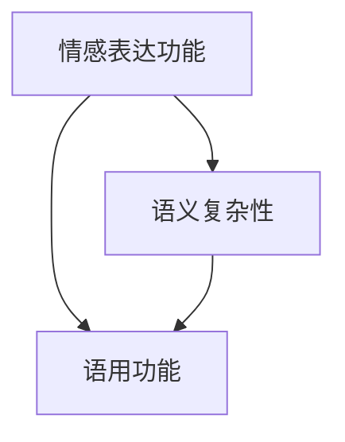
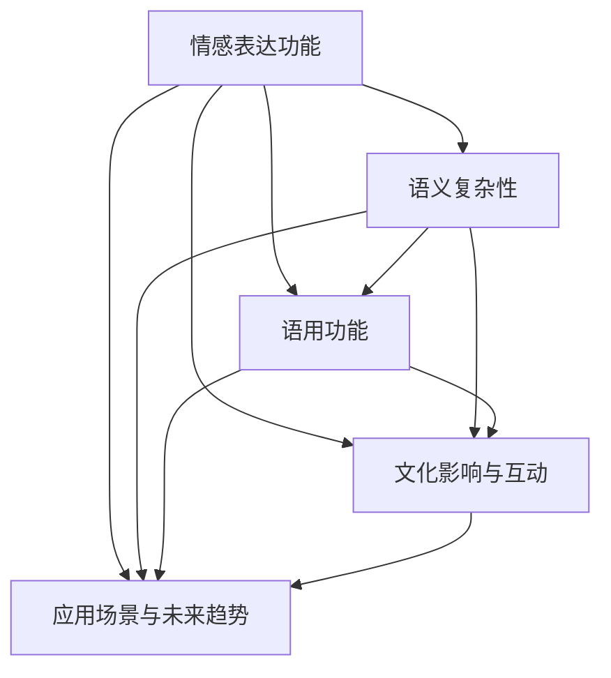

                 

### 文章标题：《数字时代的情感表达：emoji和表情包的语言学分析》

### 关键词：数字时代，情感表达，emoji，表情包，语言学，符号学，语义学，语用学

### 摘要：

随着数字通信的普及，emoji和表情包已成为现代情感表达的重要手段。本文通过语言学分析，深入探讨emoji和表情包在数字时代的情感表达功能，其语义、语用和文化影响。本文首先介绍emoji和表情包的历史背景，随后阐述语言学基础理论，接着分析emoji和表情包的语言学特性，最后讨论其在社会文化中的影响和未来发展趋势。本文旨在揭示emoji和表情包作为新兴情感语言符号的独特价值，为理解数字时代的沟通提供新的视角。

### 引言与背景

在数字通信日益普及的今天，emoji和表情包已经成为人们日常交流中不可或缺的一部分。它们不仅丰富了文字信息，还为沟通增添了情感色彩，使得虚拟世界中的表达更加生动和贴近人心。那么，emoji和表情包究竟是如何兴起并逐渐成为数字时代情感表达的主要手段的呢？

#### emoji的起源与发展

emoji的起源可以追溯到1999年，当时一位名叫肖仓健一（Shigetaka Kuritake）的日本程序员在Nokia手机的聊天软件中首次引入了这种表情符号。最初的emoji设计灵感来源于漫画表情（mood icons），目的是为了在有限的空间内传达丰富的情感信息。随着智能手机和移动互联网的普及，emoji逐渐在全球范围内流行起来。

从2007年苹果公司将emoji集成到iOS系统开始，emoji开始被各大操作系统和社交媒体平台广泛采用。截至2021年，全球使用emoji的人数已经超过了40亿。emoji不仅涵盖了基本的面部表情，还包含了各种生活场景、动物、食物和标志等，极大地丰富了情感表达的手段。

#### 表情包的兴起

与emoji不同，表情包通常是包含多个字符的图像或动画，常常带有幽默和讽刺的意味。表情包的兴起可以追溯到2000年代的即时通讯软件，如QQ和MSN等。当时的表情包大多是通过上传图片或使用现成的表情库来实现的。

随着互联网的快速发展，社交媒体平台如Twitter、Facebook和微信等，开始支持表情包的使用。表情包的流行不仅依赖于其幽默和讽刺的特点，还依赖于用户的创造力和传播能力。如今，表情包已经成为数字时代不可或缺的沟通工具，成为年轻人之间表达情感和分享生活乐趣的重要方式。

#### 数字时代的情感表达需求

在数字时代，人们对于情感表达的需求越来越多样化。传统的文字信息虽然能够传达一定的情感，但在某些情境下显得不够直接和生动。emoji和表情包的出现，正好满足了这种需求。它们通过直观的视觉符号，能够在瞬间传达复杂的情感状态，使得沟通更加高效和富有情感。

此外，emoji和表情包的使用还打破了语言和文化的障碍。不同国家和地区的人们，可以通过相同的emoji和表情包进行交流，无需依赖文字翻译。这种跨文化的沟通方式，不仅增强了人际关系的亲密度，还促进了不同文化之间的理解和融合。

总之，emoji和表情包的兴起，不仅是对数字时代情感表达需求的回应，也是技术进步和文化发展的产物。它们为人们的沟通方式带来了革命性的变化，使得虚拟世界中的情感表达更加丰富多彩。

### emoji与表情包的历史与发展

要理解emoji和表情包在数字时代情感表达中的重要作用，我们首先需要了解它们的历史和发展。从最初的创意到全球流行，emoji和表情包经历了怎样的演变？

#### emoji的诞生

emoji的诞生要归功于日本的一位程序员肖仓健一（Shigetaka Kuritake）。1999年，他在Nokia手机的聊天软件中首次引入了这种表情符号。最初的emoji设计灵感来源于漫画表情（mood icons），目的是为了在有限的空间内传达丰富的情感信息。肖仓健一设计了176个基本表情，这些表情通过一系列的小图标组成，每个图标都代表一种特定的情感或情绪。

#### emoji的全球流行

2007年，苹果公司将emoji集成到iOS系统，这使得emoji开始被广泛采用。随后，各大操作系统和社交媒体平台如Android、Windows Phone、Facebook、Twitter和微信等，也开始支持emoji的使用。emoji不仅涵盖了基本的面部表情，还包含了各种生活场景、动物、食物和标志等，极大地丰富了情感表达的手段。

截至2021年，全球使用emoji的人数已经超过了40亿。据统计，平均每个智能手机用户每天会发送大约5个emoji。这些数据表明，emoji已经成为数字时代不可或缺的一部分。

#### emoji的设计与演变

emoji的设计初衷是为了简化情感表达，使得信息传递更加直观和生动。随着技术的发展和用户需求的变化，emoji也在不断演变。从最初的简单图标到如今复杂的表情和场景，emoji的设计更加精细和多样化。例如，emoji现在不仅能够表达基本情绪，还可以表达复杂的情感状态，如惊讶、开心、愤怒、悲伤等。

此外，emoji还考虑到了性别和肤色多样性。在早期的emoji设计中，大多数表情都是男性形象，并且肤色单一。然而，随着社会的进步和多样性意识的增强，现代emoji已经包含了更多的性别和肤色选项，以满足不同用户的需求。

#### 表情包的兴起

与emoji不同，表情包通常是包含多个字符的图像或动画，常常带有幽默和讽刺的意味。表情包的兴起可以追溯到2000年代的即时通讯软件，如QQ和MSN等。当时的表情包大多是通过上传图片或使用现成的表情库来实现的。

随着互联网的快速发展，社交媒体平台如Twitter、Facebook和微信等，开始支持表情包的使用。表情包的流行不仅依赖于其幽默和讽刺的特点，还依赖于用户的创造力和传播能力。如今，表情包已经成为数字时代不可或缺的沟通工具，成为年轻人之间表达情感和分享生活乐趣的重要方式。

#### 表情包的类型与特点

表情包的类型非常多样化，从简单的卡通形象到复杂的动画，从静态图片到动态GIF，表情包的呈现形式丰富多样。不同的表情包有着各自的特点和用途，例如：

- **卡通表情包**：这类表情包通常以卡通形象为主，形象生动，易于理解，常常用于日常对话和幽默表达。
- **GIF表情包**：GIF表情包是一种动态图像，可以展现连续的动作或表情，非常适合表达瞬间的情绪变化。
- **讽刺性表情包**：这类表情包常常带有讽刺和幽默的成分，用于调侃和讽刺社会现象或时事。

总之，emoji和表情包的兴起，不仅丰富了数字时代的情感表达手段，也为人们提供了更多元化的沟通方式。它们的设计和演变，反映了社会文化的发展和用户需求的变化，使得虚拟世界中的情感表达更加丰富多彩。

### 语言学的理论框架

要深入分析emoji和表情包在数字时代情感表达中的作用，我们需要借助语言学的理论框架。语言学是研究人类语言结构、使用和发展规律的学科，包括语义学、语用学、符号学等多个分支。这些理论为我们提供了分析emoji和表情包的语言学特性提供了坚实的理论基础。

#### 语义学

语义学是研究语言意义的学科，它关注词汇、句子和话语的意义。在emoji和表情包的语义分析中，我们主要关注以下几个方面：

1. **基本情感表达**：emoji和表情包的基本功能之一是传达基本情感，如快乐、悲伤、愤怒、惊讶等。例如，😂表示大笑，😢表示哭泣，😡表示愤怒。这些基本情感符号可以直接替代文字表达，使得情感传达更加直观。
2. **隐喻和转喻**：emoji和表情包中经常使用隐喻和转喻的手法来传达复杂的情感和意义。例如，🏋️表示健身，隐喻着积极向上的生活态度；🐶表示宠物，转喻着温馨的家庭氛围。

#### 语用学

语用学是研究语言在具体语境中的使用和功能的学科，它关注语言如何在不同情境下实现交际目的。在emoji和表情包的语用分析中，我们主要关注以下几个方面：

1. **语境依赖性**：emoji和表情包的意义往往依赖于具体的语境。例如，在不同的语境中，👍可以表示赞同、点赞或支持，而在不同的语境下，👍的意义可能完全不同。
2. **情感调节**：emoji和表情包可以用来调节交流中的情感氛围。例如，在严肃的讨论中，一个😉可以缓和紧张的情绪，使得对话更加轻松愉快。

#### 符号学

符号学是研究符号系统及其功能的学科，它关注符号的本质和意义。在emoji和表情包的符号学分析中，我们主要关注以下几个方面：

1. **符号系统**：emoji和表情包构成一个符号系统，每个符号都有其特定的意义和功能。例如，🏰表示城堡，👑表示皇冠，这些符号通过视觉形象传达特定的意义。
2. **符号互动**：emoji和表情包在交流过程中发挥着互动功能，不仅能够传达情感，还可以用于互动和沟通。例如，😂可以回应对方的一个笑话，👍可以表示对某事的赞同。

#### 语言符号的构成与功能

语言符号是由形式和意义两个部分构成的，形式是符号的物理表现，意义是符号所传达的信息。在emoji和表情包中，符号的形式通常是视觉图像，而意义则是通过视觉图像传达的情感和情感状态。

1. **形式**：emoji和表情包的形式通常是简洁的图形符号，这些符号通过色彩、形状和排列等视觉元素传达特定的情感和意义。
2. **意义**：emoji和表情包的意义是通过其形式在特定的语境中传达的。例如，👍这个符号，其形式是一个竖起的大拇指，意义是表示赞同或认可。

通过语义学、语用学和符号学的理论框架，我们可以更深入地理解emoji和表情包在数字时代情感表达中的作用。这些理论不仅为我们提供了分析emoji和表情包的语言学工具，还帮助我们认识到它们在沟通中的独特价值。

### emoji与表情包的语言学分析

在了解了语言学的理论框架之后，我们可以进一步分析emoji和表情包在数字时代的语言学特性。本文将从情感表达功能、语义复杂性、语用功能等方面进行详细探讨。

#### 情感表达功能

emoji和表情包最基本的功能之一是情感表达。它们通过视觉符号直观地传达复杂的情感状态，使得沟通更加生动和富有情感。

1. **基本情感表达**：emoji和表情包涵盖了多种基本情感，如快乐、悲伤、愤怒、惊讶等。例如，😂表示大笑，😢表示哭泣，😡表示愤怒。这些基本情感符号可以直接替代文字表达，使得情感传达更加直观。

2. **复合情感表达**：emoji和表情包不仅能够表达基本情感，还可以表达复合情感。例如，😂🤕可以表示因为某种原因而大笑，😭😭可以表示因悲伤而哭泣。这些复合情感表达通过组合多个emoji，使得情感传达更加丰富和多样化。

3. **情感调节**：emoji和表情包还可以用来调节交流中的情感氛围。例如，在一个严肃的讨论中，一个😉可以缓和紧张的情绪，使得对话更加轻松愉快。

#### 语义复杂性

emoji和表情包的语义复杂性体现在它们能够传达丰富的情感和意义，甚至在某些情境下可以替代复杂的文字描述。

1. **隐喻和转喻**：emoji和表情包中经常使用隐喻和转喻的手法来传达复杂的情感和意义。例如，🏋️表示健身，隐喻着积极向上的生活态度；🐶表示宠物，转喻着温馨的家庭氛围。

2. **文化差异**：emoji和表情包的语义复杂性还体现在文化差异上。不同文化背景下的用户对相同emoji的理解可能存在差异。例如，👍在西方文化中表示赞同或认可，而在某些亚洲文化中，👍则可能表示友善或礼貌。

3. **多义性**：某些emoji和表情包具有多义性，即它们可以在不同情境下传达不同的意义。例如，👏在不同情境下可以表示鼓掌、惊讶或支持。

#### 语用功能

语用学关注语言在具体语境中的使用和功能，emoji和表情包在语用功能上也具有独特的价值。

1. **语境依赖性**：emoji和表情包的意义往往依赖于具体的语境。例如，在不同的语境中，👍可以表示赞同、点赞或支持，而在不同的语境下，👍的意义可能完全不同。

2. **礼貌功能**：emoji和表情包可以用来表达礼貌和尊重。例如，在商务交流中，使用👋可以代替传统的“你好”或“再见”，显得更加亲切和礼貌。

3. **互动功能**：emoji和表情包在交流过程中发挥着互动功能，不仅能够传达情感，还可以用于互动和沟通。例如，😂可以回应对方的一个笑话，👍可以表示对某事的赞同。

#### Mermaid流程图：emoji与表情包的核心概念与联系

为了更直观地展示emoji和表情包的核心概念与联系，我们可以使用Mermaid流程图进行阐述。以下是emoji与表情包在数字时代情感表达中的核心概念与联系：

在这个流程图中，A代表情感表达功能，B代表语义复杂性，C代表语用功能。这三者相互联系，共同构成了emoji和表情包在数字时代情感表达的核心。

通过以上分析，我们可以看出，emoji和表情包不仅丰富了数字时代的情感表达手段，还展现了其独特的语言学特性。它们在语义、语用和文化层面都具有重要的价值，为理解数字时代的沟通提供了新的视角。

### 社会文化影响与互动

emoji和表情包的流行不仅改变了数字时代的情感表达方式，还对社会文化和人际互动产生了深远的影响。通过分析它们在不同社交场合和文化背景下的作用，我们可以更全面地理解这些符号在社会中的角色。

#### emoji与表情包在社交场合的作用

1. **日常聊天**：在日常生活中，emoji和表情包被广泛应用于短信、社交媒体、即时通讯等平台。它们不仅丰富了文字信息，还能更生动地传达情感。例如，😂和😢可以轻松表达快乐和悲伤，使得交流更加自然和亲切。

2. **社交互动**：在社交媒体上，emoji和表情包常用于点赞、评论和回复。例如，👍和👎可以表达对内容的赞同或反对，而😉和😒可以调节交流的气氛，使得互动更加轻松和愉快。

3. **表情包恶搞**：在一些社交平台上，表情包被用于恶搞、讽刺或调侃。这种幽默的表达方式有助于建立群体认同感和增加社交互动的趣味性。例如，一些流行的表情包可以用来调侃社会现象或明星，从而引发共鸣和笑声。

#### emoji与表情包在不同文化背景下的作用

1. **跨文化沟通**：emoji和表情包在全球范围内的流行，使得不同文化背景的人们可以通过相同的符号进行交流。例如，👍和👏在不同语言和文化中都有相似的象征意义，从而促进了跨文化的理解和沟通。

2. **文化适应**：为了适应不同文化的需求，emoji和表情包的设计也在不断演变。例如，emoji现在包含了更多的肤色和性别选项，以满足多元文化的需求。此外，一些表情包也反映了特定文化背景下的价值观和风俗习惯。

3. **文化冲突**：尽管emoji和表情包在促进跨文化沟通方面发挥了重要作用，但它们也可能引发文化冲突。例如，某些表情包在不同的文化中可能有不同的含义，甚至可能被视为不尊重或冒犯。因此，在使用emoji和表情包时，需要考虑文化差异，以避免误解和冲突。

#### emoji与表情包对跨文化沟通的影响

1. **促进跨文化理解**：emoji和表情包通过直观的视觉符号，使得跨文化沟通更加直观和容易。它们可以帮助人们理解不同文化背景下的情感和情感表达，从而减少沟通障碍。

2. **加强文化认同**：在跨文化交流中，emoji和表情包也可以作为文化认同的象征。例如，一些特定的表情包可以代表某个文化或群体的价值观和习俗，从而增强成员之间的凝聚力。

3. **文化误解**：然而，emoji和表情包也可能导致文化误解。由于不同文化对符号的理解可能存在差异，使用不当的表情包可能会导致误解或冒犯。因此，在跨文化交流中，需要谨慎选择和使用表情包。

总之，emoji和表情包在数字时代的社交场合和文化互动中发挥着重要作用。它们不仅丰富了情感表达手段，还促进了跨文化交流和理解。然而，在使用过程中，也需要考虑文化差异，以避免误解和冲突。

### 应用场景与未来趋势

emoji和表情包的广泛应用不仅体现在社交互动中，还在商业营销、教育与心理治疗等众多领域展现出巨大的潜力。随着技术的不断发展，它们在未来的发展中也将面临新的挑战和机遇。

#### 商业营销

在商业营销中，emoji和表情包已成为品牌宣传和用户互动的重要工具。品牌通过使用emoji和表情包，可以更生动地传达品牌形象和价值观。例如，餐饮品牌可以使用🍔和🍣等食物emoji来展示其产品，而时尚品牌则可以使用👑和👗等服装emoji来展示其设计。这些表情符号不仅吸引了消费者的注意，还增加了品牌的亲和力和记忆度。

此外，emoji和表情包在用户互动中也发挥着重要作用。品牌通过在社交媒体和客服平台上使用emoji和表情包，可以更亲切地与用户沟通，增强用户满意度和忠诚度。例如，一些电商平台在客服回复中使用😊和🙏等表情包，以表达对用户的关怀和感谢。

#### 教育与心理治疗

在教育领域，emoji和表情包作为一种新兴的教学工具，正被越来越多地应用于课堂教学和在线教育中。emoji和表情包可以用于辅助语言学习，帮助学生更好地理解和表达情感。例如，在英语教学中，教师可以使用😂和😢等表情包来帮助学生理解情感词汇。此外，emoji和表情包还可以用于社交技能训练，帮助学生更好地理解和应对社交情境。

在心理治疗领域，emoji和表情包也被用于情绪调节和治疗。患者通过使用emoji和表情包，可以更直观地表达自己的情绪和感受，从而帮助治疗师更好地了解患者的内心世界。例如，情绪日记中可以使用不同的emoji来记录每天的情绪变化，这有助于患者自我反思和情绪调节。

#### 未来趋势

随着技术的不断发展，emoji和表情包在未来的发展中将面临新的机遇和挑战。

1. **人工智能与个性化**：人工智能技术的发展将使得emoji和表情包能够更准确地理解用户的情感和需求，从而提供更加个性化的情感表达选项。例如，未来的智能助手可以基于用户的情绪和偏好，自动推荐合适的emoji和表情包。

2. **虚拟现实与增强现实**：虚拟现实和增强现实技术的进步，将使得emoji和表情包在虚拟世界中的表现更加生动和互动。用户可以通过虚拟现实设备，与虚拟角色进行更加丰富的情感交流，从而提升用户体验。

3. **文化适应与多样性**：随着全球化的深入，emoji和表情包的设计将越来越注重文化适应和多样性。未来的emoji和表情包将包含更多的文化元素和多样性选项，以更好地满足全球用户的需求。

4. **隐私与安全性**：随着emoji和表情包的应用越来越广泛，隐私和安全问题也将变得越来越重要。如何保护用户的隐私和数据安全，将成为 emoji 和表情包未来发展的重要议题。

总之，emoji和表情包在商业营销、教育与心理治疗等领域的应用，展示了其在数字时代的广阔前景。随着技术的不断发展，它们将继续在情感表达和沟通中发挥重要作用，为人们的生活带来更多便利和乐趣。

### 结论与展望

本文通过深入探讨emoji和表情包在数字时代的情感表达功能，揭示了它们作为新兴情感语言符号的独特价值。首先，我们介绍了emoji和表情包的起源与发展，展示了它们如何从最初的设计逐渐演变成为全球范围内广泛使用的沟通工具。接着，我们运用语义学、语用学和符号学的理论框架，分析了emoji和表情包的语言学特性，探讨了它们在情感表达、语义复杂性和语用功能方面的作用。此外，我们还探讨了emoji和表情包在社会文化影响与互动中的作用，以及它们在商业营销、教育与心理治疗等领域的应用前景。

通过这些分析，我们可以看到，emoji和表情包不仅丰富了数字时代的情感表达手段，还打破了语言和文化的障碍，促进了跨文化的沟通和理解。它们在人际互动中发挥着重要的调节和互动功能，使得虚拟世界中的沟通更加生动和富有情感。

展望未来，随着人工智能、虚拟现实和增强现实等技术的发展，emoji和表情包将继续在情感表达和沟通中发挥重要作用。同时，如何处理文化适应和多样性、保护用户隐私和安全等问题，也将成为 emoji 和表情包未来发展的重要议题。总之，emoji和表情包作为数字时代的情感语言符号，将继续影响和塑造我们的沟通方式，为人类社会的情感交流提供新的视角和可能性。

### 附录

#### 附录A：emoji与表情包的相关资源

1. **官方网站**：  
   - [emoji官方规范网站](https://emojipedia.org/)
   - [表情包设计资源](https://getemoji.com/)

2. **研究文献**：  
   - [emoji的历史与发展](https://www.smithsonianmag.com/smart-news/how-japanese-developer-created-emoji-180965869/)
   - [emoji与社会文化的关系](https://www.npr.org/sections/codeswitch/2018/10/23/669527658/how-emoji-are-challenging-conventional-theories-of-language)

3. **开源工具**：  
   - [emoji解析工具](https://github.com/twitter/emoji)
   - [表情包生成工具](https://www.gifbin.com/)

#### 附录B：Mermaid流程图示例

以下是 emoji 与表情包核心概念与联系的 Mermaid 流程图示例：

#### 最佳实践 Tips

1. **合理使用emoji和表情包**：根据交流场景和目的，选择合适的emoji和表情包，避免过度使用或误用，以免引起误解。
2. **关注文化差异**：在使用emoji和表情包时，了解不同文化背景下的含义，以避免文化冲突。
3. **个性化表达**：结合自己的情感和语境，创造性地使用emoji和表情包，增强交流的个性和趣味性。

### 小结

通过本文的探讨，我们可以看到 emoji 和表情包作为数字时代的情感表达工具，具有丰富的语言学特性和社会文化影响。随着技术的不断发展，它们将继续在情感表达和沟通中发挥重要作用，为人类社会的情感交流带来更多便利和可能性。希望本文能为读者提供有价值的见解，激发对 emoji 和表情包的深入思考和研究。

